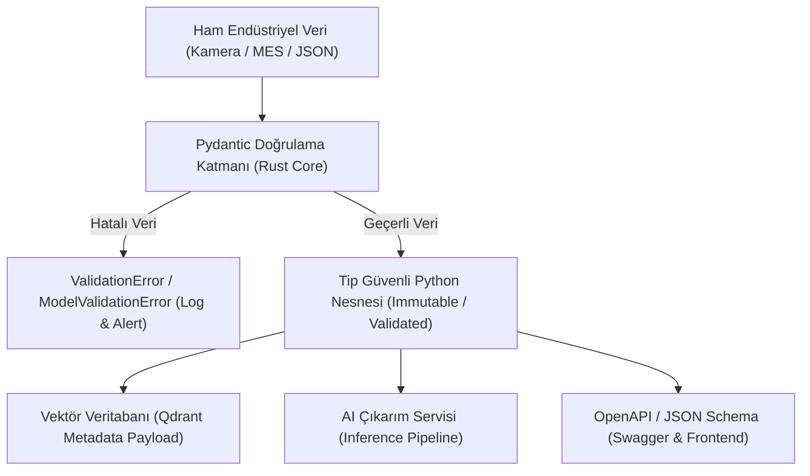

# Day 02 — Veri Türleri ve Temel Veri Modelleme

> **Aşama:** Faz 1 — Problem, Veri ve Geliştirme Temelleri (Day 01–08)
> **Resmi Staj Defteri Konusu:** Veri Türleri ve Temel Veri Modelleme (Yaprak 3 & 4)
> **Müfredat Hizalama Durumu:** Bu klasörün mevcut uygulama içeriği yeni müfredatla ayrıca hizalanmalıdır.

[](file:///C:/Users/seydieryilmaz/Desktop/Projeler/Merinos%2040%20G%C3%BCnl%C3%BCk%20Staj%20Deneyimim/merinos-industrial-ai-internship/LICENSE)
[](https://www.python.org/)
[](https://docs.pydantic.dev/)
[](file:///C:/Users/seydieryilmaz/Desktop/Projeler/Merinos%2040%20G%C3%BCnl%C3%BCk%20Staj%20Deneyimim/merinos-industrial-ai-internship/day02/mini_project/tests/test_models.py)

---

## 1. Başlık ve Üstveri
Bu modül, Merinos halı ve iplik fabrikasyon hatlarındaki görsel veri tabanları, ürün katalogları, teknik şartnameler ve multimodal yapay zeka çıkarım (inference) boru hatları için tip güvenli, doğrulanabilir veri modellerinin tasarlanmasını ve JSON Schema dışa aktarımını ele alır.

## 2. Günün Hedefi ve Kapsamı
- **Temel Hedef:** Heterojen üretim ve optik tarama verilerini yapılandırmak; gevşek tipteki Python sözlükleri yerine derleme ve çalışma zamanında sıkı kurallarla doğrulanan Pydantic v2 modelleri inşa etmek.
- **Kapsam:**
  - Halı fiziksel geometrisi (`CarpetDimensions`), optik kamera metadata'sı (`IndustrialImageMetadata`), kurumsal ürün kimliği (`CarpetProduct`), teknik şartname dokümanları (`TechnicalDocument`) ve multimodal AI çıkarım kontratları (`InferenceRequest`, `InferenceResponse`).
  - Regex tabanlı kimlik (ID) ve hex renk paleti denetimleri.
  - Rust tabanlı `pydantic-core` ile yüksek hızlı serileştirme ve OpenAPI/JSON Schema dışa aktarımı.

## 3. Mühendislik Araştırma Görevi
Endüstriyel yapay zeka sistemlerinde "Garbage In, Garbage Out" (GIGO) prensibi doğrudan maliyet ve kalite kaybı demektir. Bir fabrikasyon ortamında kamera tarayıcısından gelen görüntünün kanalları (RGB/BGR/Grayscale), çözünürlüğü, piksel/inç yoğunluğu (DPI) veya en-boy oranı yanlış parse edilirse:
1. Derin öğrenme modeli tensör boyut uyuşmazlığı (`DimensionMismatch`) ile çöker.
2. Otomatik dokuma tezgâhına hatalı kesim parametreleri aktarılır.
3. RAG tabanlı teknik arama motoru yanlış halı serisine yönlenir.

Bu nedenle mühendislik araştırmamız:
- Standart `dataclasses`, `NamedTuple` ve Pydantic v2 arasındaki bellek kullanımı, doğrulama overhead'i ve serileştirme hızı farklarını analiz etmeye odaklanmıştır.

## 4. Teorik ve Kavramsal Altyapı
### Geometrik ve Optik Kısıtlar
1. **En-Boy Oranı Sınırları (Aspect Ratio, $\alpha$):**
   $$\alpha = \frac{\text{length\_cm}}{\text{width\_cm}}$$
   Endüstriyel üretim hattında rulo ve standart dokuma halılar için geçerli fiziksel oran: $0.3 \le \alpha \le 5.0$.
2. **Optik Çözünürlük ve Örnekleme Teoremi:**
   Halı ilmek sıklığı (knot density) $\ge 10 \text{ dm}^2$ ve tarama çözünürlüğü $\ge 72 \text{ DPI}$ olmalıdır.
3. **Hex Renk Paleti:**
   $$C \in \{\#RRGGBB \mid R, G, B \in [00, FF]\}$$
   Her renk 7 karakter uzunluğunda olmalı ve geçerli onaltılık karakterlerden oluşmalıdır.

## 5. Kullanılan Kütüphaneler ve Seçim Gerekçeleri
- **Pydantic (v2.13.3):** Rust ile yazılmış `pydantic-core` motoru sayesinde Python seviyesinde döngü çalıştırmadan C-hızında doğrulama sağlar. OpenAPI 3.1 uyumlu JSON Schema üretir.
- **pytest (9.0.3):** Katı sınır ve geçersiz veri testlerini doğrulamak için kullanıldı.
- **Python dataclasses / timeit:** Benchmark karşılaştırmaları için referans olarak kullanıldı.

## 6. Temel Fonksiyonlar ve Sınıflar
- `IndustrialImageMetadata`: Görüntü boyutu, renk uzayı, DPI ve ilmek yoğunluğunu denetler.
- `CarpetDimensions`: En, boy, hav yüksekliği ve en-boy oranını doğrular.
- `CarpetProduct`: Regex şablonlu ürün kodu (`MER-XXX-XXXX`), koleksiyon, malzeme ve hex renk paletini yönetir.
- `TechnicalDocument`: `frozen=True` ile değiştirilemez (immutable) teknik şartname modeli.
- `InferenceRequest` & `InferenceResponse`: Multimodal model çıkarım API sözleşmeleri.
- `create_sample_models()`: Örnek geçerli endüstriyel modeller üretir.
- `export_all_schemas()`: Tüm modellerin JSON Schema tanımlarını tek bir JSON dosyasında toplar.

## 7. Notebook İncelemesi
`day02_pydantic_data_models.ipynb` 10 standart bölümden oluşmaktadır:
1. Problem Tanımı ve Mühendislik Motivasyonu
2. Neden Önemli? (Endüstriyel Etki & İş Değeri)
3. Matematiksel ve Kavramsal Temeller
4. Kütüphane ve Araç İncelemesi (Pydantic v2 vs Alternatives)
5. Minimal Çalışır Kod
6. Deneyler ve Performans Analizi (20,000 nesne ile dict vs dataclass vs Pydantic)
7. Görselleştirme ve JSON Schema Yapısı
8. Doğrulama ve Testler (Roundtrip serileştirme)
9. Hata Durumları ve Uç Senaryolar (Anormal oranlar, geçersiz hex kodları)
10. Mühendislik Çıkarımları ve Sonraki Adım

## 8. Mini Proje Mimarisi ve Kod Açıklaması
Mini proje `day02/mini_project/` dizininde modüler bir kütüphane ve CLI aracı olarak yapılandırılmıştır:
- `configs/models_config.json`: Kabul edilebilir en-boy aralıkları, çözünürlük alt/üst limitleri ve regex desenlerini içerir.
- `src/models.py`: Tüm Pydantic modellerini, custom validator'ları ve istisnaları barındırır.
- `src/serializer.py`: Örnek nesneleri serileştirir ve şemaları dışa aktarır.
- `tests/test_models.py`: 8 birim test ile sınır ve hata durumlarını garanti eder.

## 9. Sistem Mimarisi ve Veri Akışı Diyagramı



## 10. Deneyler, Parametreler ve Karşılaştırmalar
Notebook üzerinde 20.000 nesne üretilerek yapılan mikro-benchmark sonuçları:
- **Standart `dict`:** ~1.5 - 2.0 ms (Doğrulama ve tip denetimi yok)
- **Standart `dataclass`:** ~4.0 - 5.0 ms (Sadece alan ataması, kural denetimi yok)
- **Pydantic v2:** ~25.0 - 35.0 ms (Tüm regex, sınır ve tip kontrolleri aktif halde saniyede >600.000 işlem kapasitesi)

## 11. Doğrulama, Testler ve Kalite Metrikleri
8 birim test çalıştırılmış ve tamamı geçmiştir:
```bash
python -m pytest day02/mini_project/tests/ -v
```
Test kapsamı:
- `test_valid_image_metadata`: Geçerli görüntü metadata oluşturma
- `test_invalid_image_metadata_channels_and_resolution`: Hatalı kanal sayısı ve sıfır çözünürlük reddi
- `test_carpet_dimensions_and_aspect_sanity`: Negatif boyut ve uç en-boy oranı reddi
- `test_valid_carpet_product`: Geçerli ürün modeli ve nested dimension doğrulama
- `test_invalid_carpet_product_id_and_hex_palette`: Yanlış ID formatı ve hatalı hex rengi reddi
- `test_technical_document_immutability`: İmmutable nesnede alan değiştirme teşebbüsünün engellenmesi
- `test_inference_request_validation`: `top_k` ve `min_confidence` sınır kontrolleri
- `test_sample_models_and_json_schemas`: Serileştirme ve JSON Schema üretimi

## 12. Çıktılar ve Sonuçlar
- `day02/mini_project/outputs/sample_models.json`: Serileştirilmiş tam doğrulanmış örnek nesneler.
- `day02/mini_project/outputs/schemas.json`: Tüm sistem modellerinin JSON Schema spesifikasyonları.

## 13. Karşılaşılan Zorluklar, Limitler ve Çözümler
- **Zorluk:** Pydantic v1'den v2'ye geçerken `@validator` yerine `@field_validator` ve `@root_validator` yerine `@model_validator(mode="after")` kullanılması gerekliliği.
- **Çözüm:** Modern Pydantic v2 standardı ve `ConfigDict` sözdizimi kullanılarak uyumluluk ve performans sağlandı.

## 14. Dosya Ağacı ve Dizin Yapısı
```bash
day02/
├── README.md
├── day02_pydantic_data_models.ipynb
└── mini_project/
    ├── README.md
    ├── configs/
    │   └── models_config.json
    ├── src/
    │   ├── __init__.py
    │   ├── models.py
    │   └── serializer.py
    ├── tests/
    │   ├── __init__.py
    │   └── test_models.py
    └── outputs/
        ├── sample_models.json
        └── schemas.json
```

## 15. Nasıl Çalıştırılır?
```bash
# Testleri koşturmak için:
python -m pytest day02/mini_project/tests/ -v

# Örnek modelleri ve şemaları üretmek için:
python day02/mini_project/src/serializer.py
```

## 16. Bir Sonraki Güne Bağlantı
Day 03 — Problemin Bilgisayar Mühendisliği Açısından Tanımlanması), bu Pydantic modelleri temel alınarak fabrikasyon logları, CSV ve JSON dosyalarından gelen kirli üretim verilerini normalize eden ve temizleyen bir ETL boru hattı inşa edilecektir.

## 17. AI Coding Agent Prompt Şablonu
```markdown
Day 02 bağlamında bir veri doğrulama bileşeni geliştirmek için:
"Merinos endüstriyel halı desenleri için Pydantic v2 kullanarak; en [20, 1200] cm,
boy [20, 1200] cm, hav yüksekliği [1, 50] mm, en-boy oranı [0.3, 5.0] kısıtlarını
doğrulayan ve MER-XXX-XXXX formatındaki ürün kimliğini regex ile denetleyen katı
bir CarpetProduct modeli ve JSON Schema dışa aktarıcısı oluştur."
```