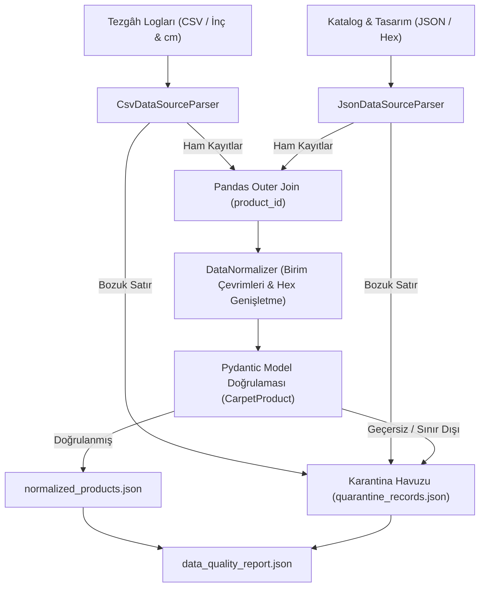

# Day 03 — Problemin Bilgisayar Mühendisliği Açısından Tanımlanması

> **Aşama:** Faz 1 — Problem, Veri ve Geliştirme Temelleri (Day 01–08)
> **Resmi Staj Defteri Konusu:** Problemin Bilgisayar Mühendisliği Açısından Tanımlanması (Yaprak 5 & 6)
> **Müfredat Hizalama Durumu:** Bu klasörün mevcut uygulama içeriği yeni müfredatla ayrıca hizalanmalıdır.

[](file:///C:/Users/seydieryilmaz/Desktop/Projeler/Merinos%2040%20G%C3%BCnl%C3%BCk%20Staj%20Deneyimim/merinos-industrial-ai-internship/LICENSE)
[](https://www.python.org/)
[](https://pandas.pydata.org/)
[](https://docs.pydantic.dev/)
[](file:///C:/Users/seydieryilmaz/Desktop/Projeler/Merinos%2040%20G%C3%BCnl%C3%BCk%20Staj%20Deneyimim/merinos-industrial-ai-internship/day03/mini_project/tests/test_pipeline.py)

---

## 1. Başlık ve Üstveri
Bu modül, Merinos fabrikasyon ortamında dokuma tezgâhlarından toplanan CSV sensör/üretim logları ile tasarım stüdyosundan gelen JSON ürün katalog verilerini birleştiren, metrik/emperyal birim uyumsuzluklarını gideren, metin/renk alanlarını normalize eden ve Day 02'de tanımlanan Pydantic modelleriyle doğrulayan dayanıklı bir ETL boru hattını ele alır.

## 2. Günün Hedefi ve Kapsamı
- **Temel Hedef:** Heterojen endüstriyel veri kaynaklarını tek bir tutarlı şemaya indirgemek; hatalı ve bozuk verilerin boru hattını çökertmesini engelleyen karantina (quarantine) mekanizmasını kurmak.
- **Kapsam:**
  - `CsvDataSourceParser` ve `JsonDataSourceParser` ile hata toleranslı veri okuma.
  - Ölçü birimi dönüşümleri (inç $\rightarrow$ cm, mm $\rightarrow$ cm).
  - Malzeme eşleme (Türkçe/İngilizce esnek sözlük dönüşümleri).
  - 3 karakterlik hex renk kodlarının 7 karaktere genişletilmesi (`#RGB` $\rightarrow$ `#RRGGBB`).
  - Day 02 Pydantic `CarpetProduct` nesnelerine döküm ve JSON kalite raporlaması.

## 3. Mühendislik Araştırma Görevi
Endüstriyel üretim hatlarında veri kaynakları standart dışı formatlar içerir:
- Bir dokuma tezgâhı en ve boyu inç cinsinden verirken, diğeri santimetre kullanabilir.
- Veritabanı aktarımlarında eksik birincil anahtarlar (`product_id = null`) veya negatif boyutlar ortaya çıkabilir.
- Hatalı bir satır yüzünden tüm batch işleminin durması, fabrikasyon takip sisteminde saatlik yüzbinlerce liralık körlüğe neden olur.

Bu nedenle araştırmamız:
- Hatalı kayıtları karantinaya (`quarantine_records.json`) ayırarak geçerli verilerin akışını kesmeyen bir **Data Quarantine & Ingestion** mimarisini geliştirmeye odaklanmıştır.

## 4. Teorik ve Kavramsal Altyapı
### Birim Dönüşümü ve Kalite Skoru Formülleri
1. **İnç - Santimetre Dönüşümü:**
   $$D_{\text{cm}} = D_{\text{inch}} \times 2.54$$
2. **Veri Kalite Skoru (Data Quality Score, $Q$):**
   $$Q = \left( \frac{N_{\text{valid}}}{N_{\text{merged}}} \right) \times 100$$
3. **Kayıp Veri İstatistiği (Missingness Rate, $\mathcal{M}$):**
   $$\mathcal{M}_j = \frac{1}{N} \sum_{i=1}^N \mathbb{I}(x_{ij} = \text{null})$$

## 5. Kullanılan Kütüphaneler ve Seçim Gerekçeleri
- **Pandas (2.x):** Hızlı dış birleştirme (Full Outer Join), vektörize dönüşümler ve eksik veri yönetimi için endüstri standardı olarak seçildi.
- **Pydantic (v2.13.3):** Temizlenen her kaydın fiziksel ve mantıksal sözleşmelere uygunluğunu derleme/çalışma anında garanti etmek için kullanıldı.
- **pytest (9.0.3):** Birim dönüşümleri, karantina ayrımı ve birleşim senaryolarını test etmek için kullanıldı.

## 6. Temel Fonksiyonlar ve Sınıflar
- `CsvDataSourceParser`: CSV loglarını okur, eksik sütunları ve boş birincil anahtarları denetler.
- `JsonDataSourceParser`: Standart JSON ve satır tabanlı NDJSON katalog beslemelerini ayrıştırır.
- `DataNormalizer`:
  - `convert_dimension_to_cm()`: Farklı birimleri santimetreye çevirir.
  - `normalize_hex_color()`: Hex kodlarını 7 karakterlik formata getirir.
  - `normalize_material()`: Metinleri `MaterialEnum` sabitlerine eşler.
  - `process_record()`: Tek bir ham kaydı `CarpetProduct` modeline dönüştürür ya da karantinaya yönlendirir.
- `DataIngestionPipeline`: Tüm süreci koordine eder ve `data_quality_report.json` oluşturur.

## 7. Notebook İncelemesi
`day03_multisource_data_pipeline.ipynb` 10 standart bölümden oluşur:
1. Problem Tanımı: Üretim Hattında Çok Kaynaklı Veri Çeşitliliği
2. Neden Önemli? (Endüstriyel Etki & Veri Boru Hattı Dayanıklılığı)
3. Matematiksel & İstatistiksel Temeller
4. Kütüphane İncelemesi (Pandas vs Polars vs DuckDB)
5. Minimal Çalışır Kod (CSV/JSON Parse & Outer Join)
6. Deneyler & Parametre Analizi (10,000 satırda Direct Read vs Chunked Read)
7. Görselleştirme: Veri Kalite Hunisi (Data Quality Funnel)
8. Doğrulama ve Testler
9. Hata Durumları ve Karantina Mekanizması
10. Mühendislik Çıkarımları & Day 04'e Bağlantı

## 8. Mini Proje Mimarisi ve Kod Açıklaması
Mini proje `day03/mini_project/` dizini altında yapılandırılmıştır:
- `configs/pipeline_config.json`: Tolerans sınırları ve varsayılan tamamlama değerleri.
- `fixtures/`: Sentetik üretim CSV ve katalog JSON beslemeleri.
- `src/parsers.py`: Hata toleranslı veri çıkarma (Extract).
- `src/normalizer.py`: Birim ve veri temizleme (Transform).
- `src/pipeline.py`: Tam boru hattı ve çıktı yükleme (Load & Report).
- `tests/test_pipeline.py`: 8 birim test.

## 9. Sistem Mimarisi ve Veri Akışı Diyagramı



## 10. Deneyler, Parametreler ve Karşılaştırmalar
Notebook üzerinde yapılan okuma ve bellek karşılaştırmaları:
- **Direct Read (10,000 Satır):** ~8.5 ms (Düşük satır sayısında daha hızlı)
- **Chunked Read (chunksize=2000):** ~14.2 ms (Bellek kısıtlı endüstriyel uç cihazlarda OOM riskini önler)

## 11. Doğrulama, Testler ve Kalite Metrikleri
8 birim test çalıştırılmış ve tamamı geçmiştir:
```bash
python -m pytest day03/mini_project/tests/ -v
```
Test kapsamı:
- `test_csv_parser_valid`: 10 üretim logunun hatasız okunması
- `test_csv_parser_missing_required_column`: Zorunlu sütun eksikliğinde hata yakalama
- `test_json_parser_valid`: 10 katalog beslemesinin ayrıştırılması
- `test_normalizer_unit_conversions`: İnç, mm ve cm dönüşümleri ile geçersiz birim yakalama
- `test_normalizer_hex_and_materials`: 3 basamaklı hex genişletme ve Türkçe malzeme eşleme
- `test_normalizer_valid_and_quarantine_record`: Geçerli kayıtta Pydantic objesi, geçersiz kayıtta karantina
- `test_full_pipeline_execution`: Tam boru hattının %100 kalite skoruyla tamamlanması
- `test_pipeline_quarantine_handling_with_dirty_records`: Bozuk ve sınır dışı verilerin başarıyla izole edilmesi

## 12. Çıktılar ve Sonuçlar
- `day03/mini_project/outputs/normalized_products.json`: Normalize edilmiş ve Pydantic onaylı 10 ürün (4.0 KB).
- `day03/mini_project/outputs/quarantine_records.json`: İzole edilen hatalı kayıtlar.
- `day03/mini_project/outputs/data_quality_report.json`: Kalite oranı ve istatistik özeti (305 bayt).

## 13. Karşılaşılan Zorluklar, Limitler ve Çözümler
- **Zorluk:** Farklı tezgâhlardan gelen inç ve cm cinsindeki ölçülerin doğrulanmadan birleştirilmesi halinde en-boy oranının bozulması.
- **Çözüm:** `dimension_unit` alanı denetlenerek her ölçü önce santimetreye dönüştürüldü, ardından `CarpetDimensions` en-boy oranı filtresine tabi tutuldu.

## 14. Dosya Ağacı ve Dizin Yapısı
```bash
day03/
├── README.md
├── day03_multisource_data_pipeline.ipynb
└── mini_project/
    ├── README.md
    ├── configs/
    │   └── pipeline_config.json
    ├── fixtures/
    │   ├── raw_production_logs.csv
    │   ├── raw_catalog_feed.json
    │   └── dirty_records.csv
    ├── src/
    │   ├── __init__.py
    │   ├── parsers.py
    │   ├── normalizer.py
    │   └── pipeline.py
    ├── tests/
    │   ├── __init__.py
    │   └── test_pipeline.py
    └── outputs/
        ├── normalized_products.json
        ├── data_quality_report.json
        └── quarantine_records.json
```

## 15. Nasıl Çalıştırılır?
```bash
# 1. Testleri çalıştırma:
python -m pytest day03/mini_project/tests/ -v

# 2. Boru hattını çalıştırma:
python -m day03.mini_project.src.pipeline
```

## 16. Bir Sonraki Güne Bağlantı
Day 04 — Python Geliştirme Ortamı ve Veri Sözleşmesi), bu normalize edilmiş veri seti üzerinde otomatik beklenti paketleri (Expectation Suites) oluşturulacak, dağılım analizleri yapılacak ve veri profilleme raporları üretilecektir.

## 17. AI Coding Agent Prompt Şablonu
```markdown
Day 03 bağlamında çok kaynaklı veri işleme hattı geliştirmek için:
"Merinos halı fabrikası için CSV üretim logları ile JSON katalog beslemelerini
Pandas ile birleştiren; inç ölçülerini 2.54 ile cm'ye çeviren, 3 basamaklı hex
renklerini (#RGB -> #RRGGBB) genişleten ve geçersiz satırları karantinaya
ayıran dayanıklı bir DataIngestionPipeline sınıfı ve pytest test takımı oluştur."
```