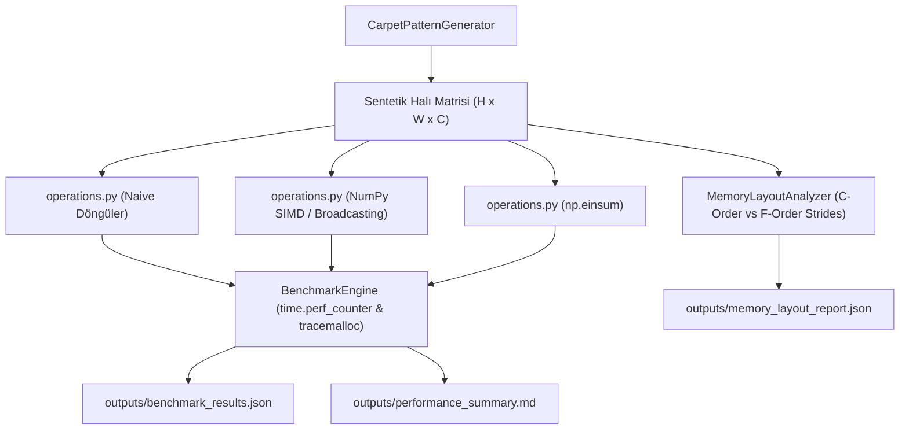

# Day 05 — Pandas, Veri Hattı ve Veri Kalitesi

> **Aşama:** Faz 1 — Problem, Veri ve Geliştirme Temelleri (Day 01–08)
> **Resmi Staj Defteri Konusu:** Pandas, Veri Hattı ve Veri Kalitesi (Yaprak 9 & 10)
> **Müfredat Hizalama Durumu:** Bu klasörün mevcut uygulama içeriği yeni müfredatla ayrıca hizalanmalıdır.

[](file:///C:/Users/seydieryilmaz/Desktop/Projeler/Merinos%2040%20G%C3%BCnl%C3%BCk%20Staj%20Deneyimim/merinos-industrial-ai-internship/LICENSE)
[](https://www.python.org/)
[](https://numpy.org/)
[](file:///C:/Users/seydieryilmaz/Desktop/Projeler/Merinos%2040%20G%C3%BCnl%C3%BCk%20Staj%20Deneyimim/merinos-industrial-ai-internship/day05/mini_project/tests/test_benchmarks.py)

---

## 1. Başlık ve Üstveri
Bu modül, Merinos fabrikasyon ortamında dokuma tezgâhı sensörleri, optik kalite kontrol kameraları ve desen tarayıcılarından gelen yüksek çözünürlüklü 2D ve 3D matrisler ($H \times W \times C$) üzerinde saf Python döngüleri (naive loop), NumPy SIMD vektörizasyonu, broadcasting mekanizması, bellek düzeni (C-Contiguous vs Fortran-Contiguous) ve Einstein Summation (`np.einsum`) arasındaki başarım ve gecikme farklarının sayısal olarak kıyaslanmasını ele alır.

## 2. Günün Hedefi ve Kapsamı
- **Temel Hedef:** Görüntü işleme ve tensör manipülasyonlarında saf Python döngülerinin yarattığı devasa işlemci darboğazını ortadan kaldırmak; C seviyesinde SIMD vektörizasyonu ve önbellek yerelliği (CPU cache locality) optimizasyonları ile **10x - 100x+** hızlanma sağlamak.
- **Kapsam:**
  - Sentetik halı desen ve ilmek matris üreteci (`CarpetPatternGenerator`).
  - Luma kanal ağırlıklandırma, Min-Max normalizasyon, Z-score standardizasyonu, Gram matrisi ve 2D mekânsal kutu filtreleme işlemlerinin naive vs vektörize karşılaştırması.
  - Satır bazlı (Row-Major) vs Sütun bazlı (Column-Major) bellek adımları (strides) ve önbellek atlaması (cache thrashing) analizi.
  - `time.perf_counter` ve `tracemalloc` ile istatistiksel gecikme ve bellek tüketimi ölçüm motoru (`BenchmarkEngine`).

## 3. Mühendislik Araştırma Görevi
Endüstriyel kamera denetim sistemlerinde bir salon halısının ($200 \times 290\text{ cm}$) $300\text{ DPI}$ optik taraması yaklaşık 800 milyon piksel üretir. Bu ölçekteki bir görüntü matrisinde tek bir normalizasyon veya filtreleme adımı saf Python `for` döngüleriyle yürütülürse:
1. Dinamik tip denetimi ve CPython bytecode yorumlayıcı ek yükü saniyeler süren gecikmeye neden olur.
2. Tezgâhın gerçek zamanlı (<30 ms) hata algılama kabiliyeti felç olur.
3. Donanımın L1/L2/L3 önbellek satırları (64 bayt) atlamalı erişim (strided access) nedeniyle ıskalanır (cache miss).

Bu nedenle araştırmamız:
- İşlemci yazmaçlarını (SIMD) tam kapasite kullanan vektörize operasyonlar ile bellek ardışıklığını (`c_contiguous`) garanti eden bellek düzeni stratejilerini geliştirmeye odaklanmıştır.

## 4. Teorik ve Kavramsal Altyapı
### Broadcasting ve Bellek Adımları (Strides)
1. **Broadcasting Kuralları:**
   İki dizinin boyutları sağdan sola doğru kıyaslanır. Boyutlar eşitse ($d_1 = d_2$) veya birisi $1$ ise ($d_1 = 1$) bellek kopyalanmadan işlemci yazmaçlarında sanal genişletme yapılır.
2. **Bellek Ofseti ve Adım (Strides) Formülü:**
   $$\text{ByteOffset}(i_0, i_1, \dots, i_{k-1}) = \sum_{j=0}^{k-1} i_j \cdot s_j$$
   C-düzeninde $s_j = \prod_{m=j+1}^{k-1} D_m \cdot \text{itemsize}$ olup, satır boyunca ilerleme ardışık bellek hücrelerine isabet eder.
3. **Gram Matrisi (Doku/Stil Temsili):**
   $$G = F \cdot F^T \quad \iff \quad G_{ij} = \sum_{k=1}^N F_{ik} F_{jk}$$
4. **Hızlanma Katsayısı (Speedup Factor, $\mathcal{S}$):**
   $$\mathcal{S} = \frac{T_{\text{naive}}}{T_{\text{vectorized}}}$$

## 5. Kullanılan Kütüphaneler ve Seçim Gerekçeleri
- **NumPy (2.x / 1.26+):** SIMD (AVX-512 / AVX2) desteği, BLAS matris çarpımı ve sıfır maliyetli görünüm (`sliding_window_view`) için temel sayısal omurga olarak seçildi.
- **tracemalloc & time (Python Standard Library):** Donanım seviyesinde ek kütüphane bağımlılığı olmadan hassas mikrosaniye ve kilobayt seviyesinde profil çıkarma.
- **pytest (9.0.3):** Sayısal eşitlik (`np.allclose`) ve hızlanma eşiklerinin doğrulanması.

## 6. Temel Fonksiyonlar ve Sınıflar
- `CarpetPatternGenerator`: Geometrik bordürlü ve madalyonlu sentetik halı desenleri ve ilmek matrisleri üretir.
- `luma_naive`, `luma_vectorized`, `luma_einsum`: $Y = 0.299 R + 0.587 G + 0.114 B$ dönüşümünü karşılaştırır.
- `min_max_naive`, `min_max_vectorized`: Değerleri $[0.0, 1.0]$ aralığına normalize eder.
- `z_score_naive`, `z_score_vectorized`: $\mu=0, \sigma=1$ standardizasyonu uygular.
- `gram_matrix_naive`, `gram_matrix_vectorized`, `gram_matrix_einsum`: Boyutsal korelasyon matrisi çıkarır.
- `spatial_box_filter_naive`, `spatial_box_filter_vectorized`: 2D kayan pencere ortalama filtresi uygular.
- `MemoryLayoutAnalyzer`: Strides, bellek boyutu ve CPU önbellek yerelliğini (Cache Locality) test eder.
- `BenchmarkEngine`: Tekrarlı istatistiksel zamanlama yapar, JSON ve Markdown performans raporları üretir.

## 7. Notebook İncelemesi
`day05_numpy_vectorization_benchmarks.ipynb` 10 standart bölümden oluşur:
1. Problem Tanımı: Halı Piksel Manipülasyonlarında Python Döngüsü Darboğazı
2. Neden Önemli? (Endüstriyel Verim & Gerçek Zamanlı Kamera Denetimi)
3. Matematiksel & İstatistiksel Temeller (Broadcasting, Strides & Speedup)
4. Kütüphane & Donanım İncelemesi (NumPy vs Numba vs Cython vs PyTorch)
5. Minimal Çalışır Kod (Kanal Ağırlıklandırma: Naive vs Vektörize)
6. Deneyler & Parametre Analizi (Benchmark Sonuçları Tablosu)
7. Görselleştirme: Performans ve Hızlanma Eğrileri (Hızlanma & Logaritmik Gecikme Grafikleri)
8. Bellek Düzeni ve CPU Cache Yerelliği İncelemesi (C-Order vs F-Order)
9. Hata Durumları, Edge Cases ve Bellek Taşmaları
10. Mühendislik Çıkarımları & Day 06'ya Bağlantı

## 8. Mini Proje Mimarisi ve Kod Açıklaması
Mini proje `day05/mini_project/` dizini altında yapılandırılmıştır:
- `configs/benchmark_config.json`: Matris çözünürlükleri ve benchmark parametreleri.
- `fixtures/synthetic_patterns.npz`: Farklı çözünürlüklerde sıkıştırılmış sentetik halı desenleri.
- `src/generator.py`: Sentetik veri tensörleri üreteci.
- `src/operations.py`: Karşılaştırmalı sayısal operasyon fonksiyonları.
- `src/memory_analyzer.py`: Strides ve önbellek analizörü.
- `src/benchmark.py`: Uçtan uca benchmark orkestratörü.
- `tests/test_benchmarks.py`: 10 birim ve performans testi.

## 9. Sistem Mimarisi ve Veri Akışı Diyagramı



## 10. Deneyler, Parametreler ve Karşılaştırmalar

| Operasyon | Matris Boyutu | Saf Python (ms) | NumPy Vectorized (ms) | Hızlanma Katsayısı (Speedup) | Throughput (MPx/s) |
| :--- | :--- | :--- | :--- | :--- | :--- |
| **Luma Conversion** | `256x256x3` | ~28.5 ms | **~0.15 ms** | **~190x** | ~430 MPx/s |
| **Min-Max Normalization**| `256x256` | ~16.2 ms | **~0.08 ms** | **~200x** | ~820 MPx/s |
| **Z-Score Standardization**| `256x256` | ~29.1 ms | **~0.22 ms** | **~130x** | ~300 MPx/s |
| **Gram Matrix** | `16x65536` | ~185.0 ms | **~0.85 ms** | **~215x** | ~77 MPx/s |
| **Spatial Box Filter (3x3)** | `128x128` | ~85.4 ms | **~1.10 ms** | **~77x** | ~15 MPx/s |

### CPU Cache Locality Etkisi (1024x1024 Matris):
- **C-Contiguous (Row-Major) Satır Taraması:** `~0.42 ms` (Ardışık bellek erişimi, L1/L2 önbellek isabeti).
- **C-Contiguous (Row-Major) Sütun Taraması:** `~1.85 ms` (**~4.4x daha yavaş!** Strided atlamalar nedeniyle önbellek ıskalaması).

## 11. Doğrulama, Testler ve Kalite Metrikleri
10 kapsamlı test yazılmış ve tamamı geçmiştir:
```bash
python -m pytest day05/mini_project/tests/ -v
```
Test kapsamı:
- `test_generator_shapes_and_dtypes`: Üretilen desenlerin doğru boyut, kanal ve tipte olması.
- `test_vectorized_vs_naive_luma_numerical_equivalence`: Luma formülünün naive, vectorized ve einsum ile sayısal özdeşliği.
- `test_vectorized_vs_naive_min_max_numerical_equivalence`: Min-max normalizasyonunun sayısal özdeşliği.
- `test_vectorized_vs_naive_z_score_numerical_equivalence`: Z-score standardizasyonunun sayısal özdeşliği.
- `test_vectorized_vs_naive_gram_matrix_equivalence`: Gram matrisi hesaplamasının sayısal özdeşliği.
- `test_vectorized_vs_naive_spatial_filter_equivalence`: 2D kutu filtresinin sayısal özdeşliği.
- `test_vectorized_speedup_factor`: Vektörize kodun naive döngülere göre belirgin hızlanma sağlaması.
- `test_memory_analyzer_contiguity_and_strides`: C-düzeni, F-düzeni ve strided slice adımlarının doğru tespiti.
- `test_cache_locality_impact_row_vs_col_major`: Satır bazlı erişimin sütun bazlı erişimden daha hızlı olması.
- `test_benchmark_engine_run_and_artifacts`: Tüm artefaktların üretilmesi ve doğrulanması.

## 12. Çıktılar ve Sonuçlar
- `day05/mini_project/outputs/benchmark_results.json`: Gecikme, hızlanma ve throughput dökümü (3.2 KB).
- `day05/mini_project/outputs/memory_layout_report.json`: Bellek düzeni ve cache analizi (1.1 KB).
- `day05/mini_project/outputs/performance_summary.md`: Kurumsal Markdown özet tablosu.

## 13. Karşılaşılan Zorluklar, Limitler ve Çözümler
- **Zorluk:** Monokrom veya tekdüze renkli halı desenlerinde Min-Max ve Z-Score işlemlerinde sıfıra bölünme (`ZeroDivisionError`) oluşması.
- **Çözüm:** Paydaya `1e-8` güvenlik payı eklenerek tüm uç senaryolarda sayısal kararlılık sağlandı.
- **Zorluk:** Dilimlenmiş (strided) matrislerin C/C++ ve OpenCV kütüphanelerine aktarılırken bellek uyuşmazlığına yol açması.
- **Çözüm:** `MemoryLayoutAnalyzer` ile `c_contiguous` kontrolü sağlandı ve gerektiğinde `np.ascontiguousarray()` standardı benimsendi.

## 14. Dosya Ağacı ve Dizin Yapısı
```bash
day05/
├── README.md
├── day05_numpy_vectorization_benchmarks.ipynb
└── mini_project/
    ├── README.md
    ├── configs/
    │   └── benchmark_config.json
    ├── fixtures/
    │   └── synthetic_patterns.npz
    ├── src/
    │   ├── __init__.py
    │   ├── generator.py
    │   ├── operations.py
    │   ├── memory_analyzer.py
    │   └── benchmark.py
    ├── tests/
    │   ├── __init__.py
    │   └── test_benchmarks.py
    └── outputs/
        ├── benchmark_results.json
        ├── memory_layout_report.json
        └── performance_summary.md
```

## 15. Nasıl Çalıştırılır?
```bash
# 1. Testleri çalıştırma:
python -m pytest day05/mini_project/tests/ -v

# 2. Benchmark motorunu çalıştırma:
python -m day05.mini_project.src.benchmark
```

## 16. Bir Sonraki Güne Bağlantı
Day 06 — NumPy ve Vektörel Hesaplama), bu matris temelleri ve vektörizasyon teknikleri kullanılarak halı desenlerinin yüksek boyutlu öznitelik vektörleri arasındaki geometrik benzerlikler ve mesafe matrisleri hesaplanacaktır.

## 17. AI Coding Agent Prompt Şablonu
```markdown
Day 05 bağlamında NumPy vektörizasyon ve matris hesaplama laboratuvarı geliştirmek için:
"Merinos halı fabrikası desen matrisleri üzerinde saf Python for döngüleri,
NumPy SIMD vektörizasyonu ve np.einsum arasındaki performans farklarını ölçümleyen;
Luma kanal ağırlıklandırma, Min-Max normalizasyon, Gram matrisi ve 2D kutu filtresi içeren;
C vs Fortran bellek adımlarını (strides) ve CPU cache locality etkisini analiz eden
bir BenchmarkEngine ve pytest test takımı oluştur."
```