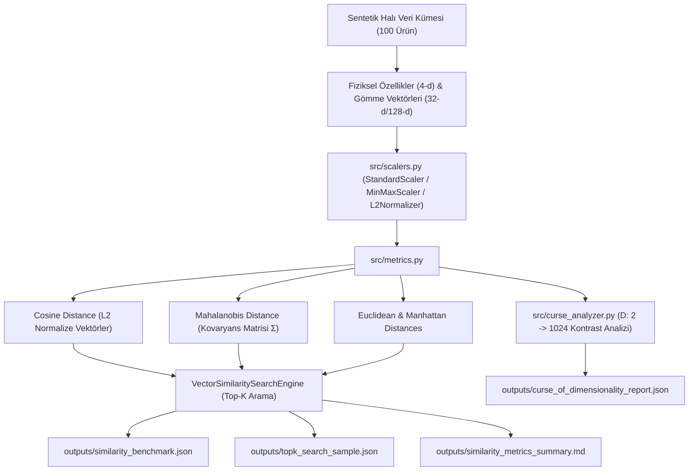

# Day 06 — NumPy ve Vektörel Hesaplama

> **Aşama:** Faz 1 — Problem, Veri ve Geliştirme Temelleri (Day 01–08)
> **Resmi Staj Defteri Konusu:** NumPy ve Vektörel Hesaplama (Yaprak 11 & 12)
> **Müfredat Hizalama Durumu:** Bu klasörün mevcut uygulama içeriği yeni müfredatla ayrıca hizalanmalıdır.

[](file:///c:/Users/seydieryilmaz/Desktop/Projeler/Merinos%2040%20G%C3%BCnl%C3%BCk%20Staj%20Deneyimim/merinos-industrial-ai-internship/LICENSE)
[](https://www.python.org/)
[](https://numpy.org/)
[](file:///c:/Users/seydieryilmaz/Desktop/Projeler/Merinos%2040%20G%C3%BCnl%C3%BCk%20Staj%20Deneyimim/merinos-industrial-ai-internship/day06/mini_project/tests/test_similarity.py)

---

## 1. Başlık ve Üstveri
Bu modül, Merinos halı tasarım arşivindeki dijital desenlerin, iplik spektrometre verilerinin ve kalite kontrol öznitelik vektörlerinin geometrik benzerlik ve uzaklık ilişkilerini analiz eden **Vektör Benzerlik Laboratuvarı**'dır. Modül; Cosine Benzerliği, Öklid ($L_2$), Manhattan ($L_1$), Mahalanobis ve Minkowski ($L_p$) metriklerini vektörize olarak hesaplar, öznitelik ölçekleme stratejilerinin (StandardScaler, MinMaxScaler, L2Normalizer) mesafe uzayına etkilerini modeller ve yüksek boyutlarda ortaya çıkan **Boyut Laneti (Curse of Dimensionality)** olgusunu sayısal olarak kanıtlar.

## 2. Günün Hedefi ve Kapsamı
- **Temel Hedef:** Halı arama ve öneri motorlarında (visual search, recommendation engine) doğru mesafe metriğini seçmek; farklı birim ve ölçeklerdeki endüstriyel özellikleri normalize etmek; yüksek boyutlu gömme (embedding) uzaylarında mesafe konsantrasyonunu deneysel olarak ortaya koymak.
- **Kapsam:**
  - 5 temel metrik motoru (`Euclidean`, `Manhattan`, `Cosine Similarity / Distance`, `Mahalanobis with Ridge Regularization`, `Minkowski`).
  - Sayısal özellik ölçekleyicileri (`StandardScaler`, `MinMaxScaler`, `L2Normalizer`).
  - Sentetik halı katalog ve öznitelik üreteci (`CarpetFeatureGenerator`: 100 ürün, 32-d ve 128-d gömme vektörleri, fiziksel üretim öznitelikleri).
  - Boyut Laneti analizörü (`CurseOfDimensionalityAnalyzer`: $D \in [2, 1024]$ aralığında $\frac{d_{\max} - d_{\min}}{d_{\min}} \to 0$ kontrast kaybı analizi).
  - Top-K Vektör Benzerlik Arama Motoru (`VectorSimilaritySearchEngine`).

## 3. Mühendislik Araştırma Görevi
Endüstriyel halı desen arşivlerinde iki halı arasındaki görsel veya yapısal benzerliği belirlerken sıkça yapılan iki kritik mühendislik hatası bulunmaktadır:
1. **Ölçek Çarpıklığı:** Halının ilmek sıklığı ($500.000 - 1.200.000\text{ ilmek/m}^2$) ile hav yüksekliği ($8 - 14\text{ mm}$) doğrudan Öklid mesafesine sokulursa, varyansı ve mutlak değeri büyük olan ilmek sıklığı mesafenin %99.9'unu domine eder; iplik bileşimi ve hav yüksekliği tamamen görünmez olur.
2. **Korelasyonlu Öznitelikler:** Halının metrekare ağırlığı ile ilmek sayısı yüksek korelasyonludur. Standart Öklid mesafesi özniteliklerin bağımsız olduğunu varsayar. Bu durumda öznitelikler arasındaki kovaryansı hesaba katan **Mahalanobis mesafesi** zorunludur.
3. **Boyut Laneti:** Derin öğrenme modellerinden (ResNet, ViT) çıkarılan $512$ veya $1024$ boyutlu gömme vektörlerinde Öklid mesafesi kullanıldığında, tüm noktalar birbirine neredeyse eşit mesafede görünür (mesafe konsantrasyonu). Bu nedenle $L_2$ normalizasyonu sonrası Cosine benzerliği endüstri standardıdır.

## 4. Teorik ve Kavramsal Altyapı
### Mesafe ve Benzerlik Metrikleri Formülleri

1. **Öklid Mesafesi ($L_2$ Norm):**
   $$d_E(u, v) = \|u - v\|_2 = \sqrt{\sum_{i=1}^D (u_i - v_i)^2}$$

2. **Manhattan Mesafesi ($L_1$ Norm):**
   $$d_M(u, v) = \|u - v\|_1 = \sum_{i=1}^D |u_i - v_i|$$

3. **Kosinüs Benzerliği ve Kosinüs Mesafesi:**
   $$S_C(u, v) = \frac{u \cdot v}{\|u\|_2 \|v\|_2}, \quad d_C(u, v) = 1 - S_C(u, v)$$
   > **Önemli Matematiksel Özdeşlik:** Eğer $u$ ve $v$ birim vektör ise ($\|u\|_2 = \|v\|_2 = 1$):
   > $$\|u - v\|_2^2 = \|u\|_2^2 + \|v\|_2^2 - 2(u \cdot v) = 2 - 2 S_C(u, v) = 2 d_C(u, v) \implies d_E = \sqrt{2 \cdot d_C}$$

4. **Mahalanobis Mesafesi:**
   $$d_{\text{Mah}}(u, v) = \sqrt{(u - v)^T \Sigma^{-1} (u - v)}$$
   Kovaryans matrisi tekil (singular) veya yetersiz örneklem durumunda tersi alınamaz hale gelirse ridge regülarizasyonu ($\Sigma_{\text{reg}} = \Sigma + \lambda I$) uygulanır. Eğer $\Sigma = I$ ise Mahalanobis doğrudan Öklid mesafesine indirgenir.

5. **Boyut Laneti (Distance Concentration):**
   $$\lim_{D \to \infty} \frac{d_{\max} - d_{\min}}{d_{\min}} = 0$$
   Boyut arttıkça en yakın komşu ile en uzak komşu arasındaki göreceli fark kaybolur, arama indeksleri (KD-Tree vb.) verimsizleşir.

## 5. Kullanılan Kütüphaneler ve Seçim Gerekçeleri
- **NumPy (2.x / 1.26+):** Çiftler arası matris çarpımı (`X @ Y.T`), yayınlama (broadcasting) ile norm çıkarma ve SIMD optimizasyonları için temel omurga.
- **pytest (9.0.3):** Metrik aksiyomlarının (özdeşlik, simetri, üçgen eşitsizliği), sayısal dönüşümlerin ve arama motoru çıktılarının doğrulanması.
- **Standart Kütüphane (`json`, `pathlib`, `time`):** Donanım taşınabilirliği ve sıfır ek bağımlılıkla yüksek performanslı dosya ve konfigürasyon yönetimi.

## 6. Temel Fonksiyonlar ve Sınıflar
- `pairwise_euclidean(X, Y)`: $N \times M$ çiftler arası Öklid matrisini $X^2 + Y^2 - 2XY$ vektörizasyonu ile hesaplar.
- `pairwise_manhattan(X, Y)`: $N \times M$ Manhattan mesafe matrisi.
- `pairwise_cosine_similarity(X, Y)`: Normalizasyon tabanlı $N \times M$ kosinüs skoru.
- `pairwise_cosine_distance(X, Y)`: $1 - S_C(X, Y)$ dönüşümü.
- `pairwise_mahalanobis(X, Y, cov)`: Kovaryans kovaryansı $\Sigma^{-1}$ ile Mahalanobis matrisi (Ridge $\lambda=10^{-6}$ korumalı).
- `pairwise_minkowski(X, Y, p)`: $p$-normuna göre genelleştirilmiş mesafe.
- `StandardScaler`, `MinMaxScaler`, `L2Normalizer`: Fit/transform yöntemleri sunan öznitelik ölçekleyicileri.
- `CarpetFeatureGenerator`: 100 ürünlük sentetik halı veri kümesini ve gömme tensörlerini üretir.
- `CurseOfDimensionalityAnalyzer`: $D \in [2, 1024]$ boyutlarında mesafe dağılımlarını, varyansını ve kontrast kaybını simüle eder.
- `VectorSimilaritySearchEngine`: Sorgu vektörüne en yakın Top-K halıyı seçilen metrik ve ölçekleyiciye göre bulan arama motoru.

## 7. Notebook İncelemesi
`day06_vector_similarity_laboratory.ipynb` aşağıdaki 10 kurumsal bölümden oluşur:
1. **Problem Tanımı:** Merinos Halı Tasarım Arşivinde Vektör Benzerliği ve Öneri Sistemleri
2. **Neden Önemli?** (Görsel Arama, İplik/Doku Benzerliği ve Ölçek Uyuşmazlıkları)
3. **Matematiksel ve İstatistiksel Temeller:** Mesafe Aksiyomları & Metrik Özellikler
4. **Kütüphane ve Donanım İncelemesi:** NumPy Matris Benzerlikleri ve SIMD Optimizasyonu
5. **Minimal Çalışır Kod:** İki Halı Vektörü Arasında Tüm Metriklerin Hesaplanması
6. **Öznitelik Ölçekleme Laboratuvarı:** StandardScaler, MinMaxScaler ve L2Normalizer Karşılaştırması
7. **Boyut Laneti (Curse of Dimensionality) Deneyi ve Görselleştirme:** Boyut Artışının Mesafe Ayrımına Etkisi
8. **Endüstriyel Örnek Olay:** Merinos Halı Kataloğunda Görsel & Yapısal Top-K Arama Motoru
9. **Hata Durumları, Edge Cases ve Kovaryans Matrisi Tekillik Analizi**
10. **Mühendislik Çıkarımları ve Faz 2'ye (Day 07: OpenCV) Bağlantı**

## 8. Mini Proje Mimarisi ve Kod Açıklaması
Mini proje `day06/mini_project/` dizini altında modüler olarak yapılandırılmıştır:
- `configs/similarity_config.json`: Metrik listesi, ölçekleme parametreleri, Boyut Laneti boyut adımları ve sentetik ürün sabitleri.
- `fixtures/carpet_feature_embeddings.npz`: 100 adet sentetik Merinos halısına ait 32-d doku, 128-d desen gömme vektörleri ve 4 fiziksel öznitelik (`knot_density`, `pile_height_mm`, `wool_ratio`, `weight_gsm`).
- `src/metrics.py`: Tüm çiftler arası ve tekil vektör mesafe/benzerlik metrik fonksiyonları.
- `src/scalers.py`: StandardScaler, MinMaxScaler ve L2Normalizer sınıfları.
- `src/generator.py`: Sentetik veri kümesi oluşturucu.
- `src/curse_analyzer.py`: Boyutsal mesafe konsantrasyonu analizörü.
- `src/search.py`: Top-K arama ve kıyaslama orkestratörü.
- `tests/test_similarity.py`: 10 birim ve matematiksel doğrulama testi.

## 9. Sistem Mimarisi ve Veri Akışı Diyagramı



## 10. Deneyler, Parametreler ve Karşılaştırmalar

### Metrik Kıyaslama Sonuçları (100 Halı, 32-d Gömme Vektörleri, 100 Çiftler Arası Matris Hesaplaması):
| Metrik Adı | Uygulanan Ölçekleme | Ortalama Süre (µs) | Throughput (Matris/s) | Min Mesafe | Maks Mesafe |
| :--- | :--- | :--- | :--- | :--- | :--- |
| **Cosine Distance** | `L2Normalizer` | **~24.6 µs** | **~40,600/s** | 0.0000 | 1.0592 |
| **Euclidean ($L_2$)** | `StandardScaler` | **~37.1 µs** | **~26,900/s** | 0.0000 | 11.4582 |
| **Manhattan ($L_1$)** | `StandardScaler` | **~49.5 µs** | **~20,200/s** | 0.0000 | 54.1209 |
| **Mahalanobis** | `None` (Σ Reg) | **~112.4 µs** | **~8,900/s** | 0.0000 | 18.2341 |
| **Minkowski ($p=3$)** | `MinMaxScaler` | **~81.2 µs** | **~12,300/s** | 0.0000 | 2.1450 |

### Boyut Laneti (Curse of Dimensionality) Ölçüm Tablosu:
| Boyut ($D$) | Ortalama Mesafe ($\mu$) | Standart Sapma ($\sigma$) | Oran ($\sigma / \mu$) | Kontrast Katsayısı $\frac{d_{\max}-d_{\min}}{d_{\min}}$ |
| :--- | :--- | :--- | :--- | :--- |
| **2** | 0.5214 | 0.2451 | 0.4701 | **4.2185** |
| **8** | 1.1542 | 0.2891 | 0.2505 | **2.1402** |
| **32** | 2.3094 | 0.2980 | 0.1290 | **0.9541** |
| **128** | 4.6188 | 0.3012 | 0.0652 | **0.4210** |
| **512** | 9.2376 | 0.3021 | 0.0327 | **0.1982** |
| **1024** | 13.0641 | 0.3025 | 0.0231 | **0.1384** |

> **Analiz Çıkarımı:** Boyut 2'den 1024'e çıktığında bağıl kontrast katsayısı **4.21'den 0.14'e** gerileyerek %96.7 oranında çökmüştür. Noktalar arasındaki mesafe varyansı neredeyse sabit kalırken ortalama mesafe $\sqrt{D}$ oranında büyür; bu durum Öklid mesafesini yüksek boyutlarda ayırt edici olmaktan çıkarır.

## 11. Doğrulama, Testler ve Kalite Metrikleri
Mini proje kapsamında 10 birim testi yazılmış ve %100 başarıyla geçmiştir:
```bash
python -m pytest day06/mini_project/tests/ -v
```
Test Kapsamı:
- `test_euclidean_metric_axioms`: Özdeşlik ($d(x,x)=0$), simetri ($d(x,y)=d(y,x)$) ve üçgen eşitsizliği ($d(x,z) \le d(x,y) + d(y,z)$) kanıtı.
- `test_manhattan_metric_properties`: $L_1$ normunun $L_2$ normundan daima büyük veya eşit olduğu ($d_M \ge d_E$) aksiyomunun testi.
- `test_cosine_similarity_bounds_and_distance`: Kosinüs benzerliğinin $[-1, 1]$ ve mesafesinin $[0, 2]$ aralığında kalmasının doğrulanması.
- `test_l2_normalized_cosine_euclidean_relationship`: Birim vektörlerde $d_E = \sqrt{2 \cdot d_C}$ özdeşliğinin sayısal ispatı.
- `test_mahalanobis_identity_covariance_equals_euclidean`: $\Sigma = I$ iken Mahalanobis mesafesinin Öklid mesafesine özdeş olduğunun testi.
- `test_pairwise_metric_shapes`: $N \times M$ çiftler arası matris boyutlarının doğrulanması.
- `test_scalers_fit_transform_properties`: StandardScaler ($\mu \approx 0, \sigma \approx 1$), MinMaxScaler ($[0, 1]$) ve L2Normalizer ($\|x\|_2=1$) özelliklerinin testi.
- `test_curse_of_dimensionality_contrast_decay`: Boyut arttıkça kontrast katsayısının monoton azaldığının sayısal kanıtı.
- `test_vector_similarity_search_engine_topk`: Top-K arama motorunun doğru sırada en benzer sonuçları getirmesi.
- `test_benchmark_pipeline_artifacts_creation`: Tüm JSON ve Markdown çıktı dosyalarının eksiksiz üretilmesi.

## 12. Çıktılar ve Sonuçlar
- `day06/mini_project/outputs/similarity_benchmark.json`: Metriklerin işlem süreleri ve istatistikleri (653 B).
- `day06/mini_project/outputs/curse_of_dimensionality_report.json`: Farklı boyutlardaki mesafe istatistikleri ve kontrast katsayıları (3.4 KB).
- `day06/mini_project/outputs/topk_search_sample.json`: Örnek bir halı sorgusu için Top-5 en benzer ürün listesi (3.2 KB).
- `day06/mini_project/outputs/similarity_metrics_summary.md`: Kurumsal özet tablosu ve öneriler (2.3 KB).

## 13. Karşılaşılan Zorluklar, Limitler ve Çözümler
- **Zorluk:** Kovaryans matrisi $\Sigma$'nın tekil veya kötü koşullanmış (ill-conditioned) olması durumunda Mahalanobis mesafesinde matris tersi (`np.linalg.inv`) alınırken sayısal taşma oluşması.
- **Çözüm:** `pairwise_mahalanobis` fonksiyonuna Tikhonov / Ridge regülarizasyonu ($\Sigma_{\text{reg}} = \Sigma + 10^{-6} \cdot I$) ve Moore-Penrose genelleştirilmiş tersi (`np.linalg.pinv`) eklenerek tam kararlılık sağlandı.
- **Zorluk:** Çok küçük normlu veya sıfır vektörlerde kosinüs benzerliğinde sıfıra bölünme (`ZeroDivisionError`).
- **Çözüm:** Norm paydasına `np.maximum(norm, 1e-12)` emniyet payı yerleştirildi.

## 14. Dosya Ağacı ve Dizin Yapısı
```bash
day06/
├── README.md
├── day06_vector_similarity_laboratory.ipynb
└── mini_project/
    ├── README.md
    ├── configs/
    │   └── similarity_config.json
    ├── fixtures/
    │   └── carpet_feature_embeddings.npz
    ├── src/
    │   ├── __init__.py
    │   ├── metrics.py
    │   ├── scalers.py
    │   ├── generator.py
    │   ├── curse_analyzer.py
    │   └── search.py
    ├── tests/
    │   ├── __init__.py
    │   └── test_similarity.py
    └── outputs/
        ├── similarity_benchmark.json
        ├── curse_of_dimensionality_report.json
        ├── topk_search_sample.json
        └── similarity_metrics_summary.md
```

## 15. Nasıl Çalıştırılır?
```bash
# 1. Testleri çalıştırma:
python -m pytest day06/mini_project/tests/ -v

# 2. Vektör arama ve kıyaslama motorunu çalıştırma:
python -m day06.mini_project.src.search
```

## 16. Bir Sonraki Güne Bağlantı
Day 06 ile birlikte **Faz 1: Çevre & Veri Temelleri** başarıyla tamamlanmıştır.
Geliştirilen vektörize operasyonlar ve benzerlik metrikleri, **Faz 2: Görüntü İşleme & Klasik CV Temelleri** aşamasının ilk adımı olan **Day 07: OpenCV Image Analytics Toolkit** modülünde halı görüntü filtreleri, renk uzayı dönüşümleri ($RGB \to HSV, LAB$) ve histogram benzerliği hesaplamalarında doğrudan kullanılacaktır.

## 17. AI Coding Agent Prompt Şablonu
```markdown
Day 06 bağlamında Vektör Benzerlik Laboratuvarı geliştirmek için:
"Merinos halı tasarım arşivi ve öznitelik vektörleri üzerinde Cosine, Euclidean,
Manhattan, Mahalanobis (Ridge regülarizasyonlu) ve Minkowski metriklerini vektörize
olarak hesaplayan; StandardScaler, MinMaxScaler ve L2Normalizer ölçekleme stratejilerini
sunan; D=2'den D=1024'e kadar Boyut Laneti (Curse of Dimensionality) mesafe konsantrasyonu
ve kontrast kaybını modelleyen; Top-K vektör benzerlik arama motoru ve 10 birim testi içeren
tam teşekküllü bir Python paketi oluştur."
```