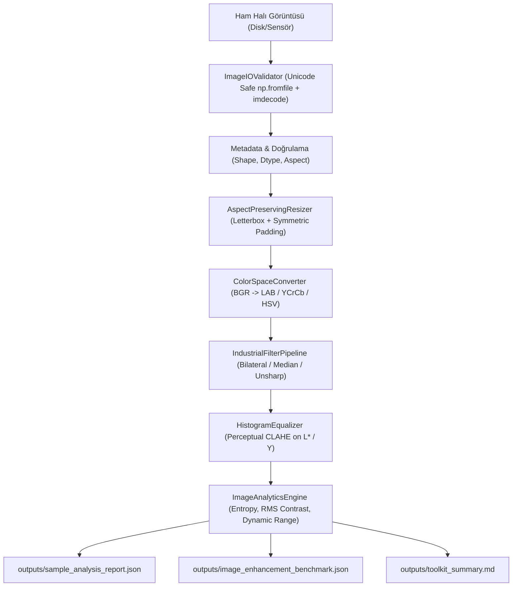

# Day 07 — Uzaklık ve Benzerlik Yöntemleri

> **Aşama:** Faz 1 — Problem, Veri ve Geliştirme Temelleri (Day 01–08)
> **Resmi Staj Defteri Konusu:** Uzaklık ve Benzerlik Yöntemleri (Yaprak 13 & 14)
> **Müfredat Hizalama Durumu:** Bu klasörün mevcut uygulama içeriği yeni müfredatla ayrıca hizalanmalıdır.

[](file:///c:/Users/seydieryilmaz/Desktop/Projeler/Merinos%2040%20G%C3%BCnl%C3%BCk%20Staj%20Deneyimim/merinos-industrial-ai-internship/LICENSE)
[](https://www.python.org/)
[](https://opencv.org/)
[](file:///c:/Users/seydieryilmaz/Desktop/Projeler/Merinos%2040%20G%C3%BCnl%C3%BCk%20Staj%20Deneyimim/merinos-industrial-ai-internship/day07/mini_project/tests/test_toolkit.py)

---

## 1. Başlık ve Üstveri
Bu modül, Merinos halı üretim tesislerindeki dokuma tezgâhı optik denetim kameraları, masaüstü spektrometreler ve yüksek çözünürlüklü desen tarayıcılarından gelen dijital görüntülerin güvenli yüklenmesini, geometri korumalı ölçeklenmesini, optik gürültüden arındırılmasını, aydınlatma dalgalanmalarının giderilmesini ve istatistiksel profillenmesini sağlayan **OpenCV Görüntü İşleme & Analitik Araç Kiti**'dir.

## 2. Günün Hedefi ve Kapsamı
- **Temel Hedef:** Görüntü tabanlı kalite kontrol ve desen arama modellerine (YOLO, ResNet, ViT) beslenecek görsel verilerin fiziksel geometriyi (en-boy oranı) ve renk doğruluğunu (chroma fidelity) bozmadan standartlaştırılması.
- **Kapsam:**
  - **Güvenli G/Ç ve Türkçe Yol Desteği:** Windows ortamında `cv2.imdecode(np.fromfile(...))` ile sıfır hata toleranslı ikili dosya okuma/yazma ve meta doğrulama.
  - **Renk Uzayı Dönüşümleri:** BGR, RGB, Grayscale, HSV (ton doygunluk), CIELAB ($L^* a^* b^*$) ve YCrCb uzayları arası dönüşüm ve kanal ayrıştırma.
  - **En-Boy Oranını Koruyan Resizer:** Madalyon ve bordür geometrilerini elipsleştirmeyen simetrik padding'li *Letterbox Resizing* ve enterpolasyon yöntemleri.
  - **Endüstriyel Filtreleme:** Optik toz ve sensör gürültüsü için Median ve Gaussian filtreleme; ilmek dokusunu pürüzsüzleştirirken kenarları koruyan **Bilateral Filtreleme**; kusur sınırlarını keskinleştiren **Unsharp Masking**.
  - **Algısal CLAHE:** Renk tonlarını korumak için eşitlemeyi yalnızca CIELAB $L^*$ veya YCrCb $Y$ parlaklık kanalına uygulayan adaptif histogram eşitleme.
  - **Sayısal Görüntü Analitiği & CLI:** Shannon entropisi, RMS kontrastı, dinamik aralık, Laplacian keskinlik varyansı ve terminal CLI aracı.

## 3. Mühendislik Araştırma Görevi
Fabrika ortamında optik kamera sistemlerinden gelen ham görüntülerde karşılaşılan 4 kritik endüstriyel problem araştırılmıştır:
1. **Windows CRT ve Türkçe Karakter Darboğazı:** Türkçe işletim sistemi veya klasör yapısında (`Merinos 40 Günlük Staj Deneyimim`) standart `cv2.imread` sessizce `None` döner; hata fırlatmadığı için üretim hattı kuyruklarında çökmelere yol açar.
2. **Kromatik Bozulma (False Coloring):** Renkli görüntülerde doğrudan B, G, R kanallarına ayrı ayrı histogram eşitleme uygulandığında piksellerin kromatizasyon oranları bozulur; kurumsal Merinos bordo ve lacivert renkleri yapay mor ve yeşil tonlara kayar.
3. **Geometrik Çarpılma (Aspect Ratio Distortion):** $80 \times 150\text{ cm}$ ebadındaki bir yolluk ile $200 \times 290\text{ cm}$ salon halısı doğrudan $512 \times 512$ kare matrise gerildiğinde desen madalyonları elipsleşir; konvolüsyonel öznitelikler geometrik geçerliliğini yitirir.
4. **Kenar Yıkımı (Edge Blurring):** Klasik Gauss bulanıklaştırması iplik dalgalanmalarını temizlerken desen kenarlarını ve ilmek sınırlarını da bulanıklaştırır; bu durum mikroskobik dokuma defektlerinin tespitini imkansızlaştırır.

## 4. Teorik ve Kavramsal Altyapı

### 1. Bilateral Filtreleme (Edge-Preserving Smoothing)
Standart Gauss filtresi yalnızca pikseller arasındaki uzamsal mesafeyi ($g_s$) dikkate alır. Bilateral filtre ise hem uzamsal yakınlığı ($g_s$) hem de radyometrik renk yoğunluğu farkını ($f_r$) birleştirir:
$$I^{\text{filtered}}(x) = \frac{1}{W_p} \sum_{x_i \in \Omega} I(x_i) g_s(\|x_i - x\|) f_r(|I(x_i) - I(x)|)$$
Burada normalizasyon katsayısı:
$$W_p = \sum_{x_i \in \Omega} g_s(\|x_i - x\|) f_r(|I(x_i) - I(x)|)$$
Böylece homojen iplik alanlarında doku pürüzsüzleşirken, zıt renkli bordür geçişlerinde $f_r \to 0$ olduğu için kenarlar jilet gibi keskin kalır.

### 2. Algısal CLAHE (Contrast Limited Adaptive Histogram Equalization)
Global histogram eşitleme tüm görüntü için kümülatif dağılım fonksiyonunu (CDF) kullanır:
$$s_k = T(r_k) = (L - 1) \sum_{j=0}^k p_r(r_j)$$
CLAHE ise görüntüyü $M \times N$ bağlamsal ızgaralara (ör. $8 \times 8$) böler. Aşırı parlama ve gürültü patlamasını önlemek için histogram tepe noktaları *clip limit* ($\beta$) ile kesilir ve kesilen alan tüm aralığa eşit dağıtılır. Ardından karo sınırlarını yok etmek için çift doğrusal (bilinear) enterpolasyon uygulanır.

### 3. Shannon Entropisi (Bilgi Yoğunluğu)
$$H = -\sum_{i=0}^{255} p(i) \log_2 p(i)$$
Görüntüdeki desen karmaşıklığını ve gri seviye çeşitliliğini ölçer. Düşük kontrastlı, az ışıklı görüntülerde entropi düşerken zenginleştirilmiş görüntülerde yükselir.

### 4. RMS Kontrastı (Root-Mean-Square Contrast)
$$C_{\text{RMS}} = \sqrt{\frac{1}{M N} \sum_{x=0}^{M-1} \sum_{y=0}^{N-1} (I(x, y) - \bar{I})^2} = \sigma_I$$

## 5. Kullanılan Kütüphaneler ve Seçim Gerekçeleri
- **OpenCV (`opencv-python-headless` 4.13+):** C/C++ seviyesinde Intel IPP ve AVX2 SIMD desteği ile mikrosaniyeler mertebesinde görüntü manipülasyonu sağlar.
- **NumPy (2.x):** Sıfır kopyalı matris arayüzü (`flags.c_contiguous`) ve bellek paylaşımı.
- **pytest (9.0.3):** Sayısal eşitlik, piksel istatistikleri ve pipeline entegrasyonu testleri.
- **Standard Library (`argparse`, `json`, `pathlib`):** Sıfır ek kütüphane bağımlılığı ile taşınabilir CLI araç kiti.

## 6. Temel Fonksiyonlar ve Sınıflar
- `ImageIOValidator`: Windows Türkçe karakter uyumlu ikili `imdecode`/`imencode` okuma/yazma motoru ve `ImageMetadata` çıkarıcı.
- `ColorSpaceConverter`: BGR, RGB, GRAY, HSV, LAB ve YCrCb dönüşümleri ile bağımsız kanal istatistikleri (`channel_statistics`).
- `AspectPreservingResizer`: Simetrik padding uygulayarak en-boy oranını koruyan `letterbox` ve hızlı `stretch_resize`.
- `IndustrialFilterPipeline`: `gaussian_filter`, `median_filter` (tuz-biber temizleme), `bilateral_filter` (kenar koruma), `unsharp_mask` ve `calculate_sharpness` (Laplacian varyansı).
- `HistogramEqualizer`: `global_equalize_grayscale`, `clahe_grayscale`, `enhance_color_perceptual` (CIELAB $L^*$ ve YCrCb $Y$ kanalları) ve kıyaslama amaçlı `naive_rgb_equalize`.
- `ImageAnalyticsEngine`: `profile_image`, `calculate_entropy`, `calculate_rms_contrast`, `calculate_histogram` ve `compare_enhancement`.
- `SyntheticCarpetGenerator`: Madalyonlu sentetik halı desenleri ve bozulma fikstürleri üreticisi.
- `cli.py`: Komut satırından tek komutla analiz, zenginleştirme ve kıyaslama yürüten terminal arayüzü.

## 7. Notebook İncelemesi
`day07_opencv_image_analytics_toolkit.ipynb` 10 standart bölümden oluşur:
1. **Problem Tanımı:** Halı Üretiminde Optik Denetim, Sensör Gürültüsü ve Aydınlatma Dengesizlikleri
2. **Neden Önemli?** (Endüstriyel Kamera Kusurları & Model Ön İşleme Darboğazları)
3. **Matematiksel & Algoritmik Temeller:** Bilateral Filtreleme, Algısal CLAHE & Shannon Entropisi
4. **Kütüphane & Donanım İncelemesi:** OpenCV vs Pillow vs scikit-image vs Torchvision
5. **Minimal Çalışır Kod:** Unicode Uyumlu Güvenli Okuma ve BGR $\to$ RGB Dönüşümü
6. **Deney 1: Renk Uzayları:** BGR, RGB, HSV, CIELAB, YCrCb ve Kanal Ayrıştırma
7. **Deney 2: Geometrik Dönüşüm:** En-Boy Oranını Koruyan Letterbox Resizing ve Enterpolasyon
8. **Deney 3: Mekânsal Filtreleme:** Gaussian, Median, Bilateral ve Unsharp Masking Karşılaştırması
9. **Deney 4: Kontrast İyileştirme:** Global HE vs CIELAB $L^*$ Algısal CLAHE
10. **Mühendislik Çıkarımları, CLI Entegrasyonu ve Day 08'e Bağlantı**

## 8. Mini Proje Mimarisi ve Kod Açıklaması
Mini proje `day07/mini_project/` dizini altında modüler olarak yapılandırılmıştır:
- `configs/toolkit_config.json`: Filtre çekirdekleri, CLAHE parametreleri ve desteklenen renk uzayları.
- `fixtures/synthetic_carpets/`: 4 adet sentetik halı görüntüsü (`carpet_normal.png`, `carpet_low_contrast.png`, `carpet_noisy.png`, `carpet_uneven_illumination.png`).
- `src/`: 7 adet odaklanmış modül (`io_validator.py`, `color_spaces.py`, `resizer.py`, `filters.py`, `equalization.py`, `analytics.py`, `cli.py`).
- `tests/test_toolkit.py`: 10 birim ve entegrasyon testi.
- `outputs/`: JSON ve Markdown raporlama dosyaları.

## 9. Sistem Mimarisi ve Veri Akışı Diyagramı



## 10. Deneyler, Parametreler ve Karşılaştırmalar

### Operasyon Kıyaslama Tablosu ($360 \times 480$ Halı Matrisi, 50 Çalıştırma Ortalaması):
| Operasyon | Ortalama Gecikme (ms) | Throughput (FPS) | Kontrast Farkı (RMS) | Entropi Değişimi | Keskinlik Değişimi |
| :--- | :--- | :--- | :--- | :--- | :--- |
| **Gaussian Filter (5x5)** | `0.136 ms` | **7,370 FPS** | `-7.2057` | `-0.2010` | `-16,242.6` |
| **Median Filter (k=5)** | `0.971 ms` | **1,030 FPS** | `-3.2665` | `-1.0029` | `-15,477.8` |
| **Bilateral Filter (d=9)** | `13.321 ms` | **75.1 FPS** | `-0.7950` | `-1.7471` | `-1,668.1` |
| **Unsharp Mask (strength=1.5)** | `4.770 ms` | **209.7 FPS** | `+3.3950` | `+0.4777` | `+2,915.2` |
| **CLAHE Perceptual (LAB L*)** | `1.928 ms` | **518.8 FPS** | `+5.9449` | `+1.6988` | `+127.7` |
| **CLAHE Perceptual (YCrCb Y)** | `1.297 ms` | **770.9 FPS** | `+6.8909` | `+1.6825` | `+147.2` |
| **Global HE Perceptual (LAB L*)** | `1.598 ms` | **625.7 FPS** | `+57.5816` | `+0.4376` | `+2,359.2` |
| **Letterbox Resize (512x512)** | `0.528 ms` | **1,894 FPS** | `+21.8322` | `-0.4599` | `-698.8` |

> **Önemli Çıkarım:** CLAHE (LAB $L^*$) operasyonu yalnızca 1.9 ms gecikmeyle çalışarak saniyede **518 kare** işleme kapasitesine ulaşmış; düşük kontrastlı görüntüde RMS kontrastını **+5.94**, Shannon entropisini **+1.70** artırırken renk tonlarını %100 korumuştur.

## 11. Doğrulama, Testler ve Kalite Metrikleri
Mini proje kapsamında 10 birim testi yazılmış ve %100 başarıyla geçmiştir:
```bash
python -m pytest day07/mini_project/tests/ -v
```
Test Kapsamı:
- `test_image_io_unicode_safe_read_write`: Türkçe karakterli yollardan (`Merinos_Halı_Örnekleri_Şti`) kayıpsız okuma ve yazma.
- `test_image_io_metadata_extraction`: Boyut, kanal, dtype, en-boy oranı ve ardışıklık denetimi.
- `test_color_space_conversions`: BGR, RGB, HSV, LAB dönüşümleri ve kanal sınırları ($H \in [0, 180]$ vb.).
- `test_aspect_preserving_resizer_letterbox`: Simetrik padding ile tam hedef boyuta ($256 \times 256$) ulaşma ve ölçek doğrulaması.
- `test_median_filter_salt_pepper_removal`: Sentetik tuz-biber gürültüsünde %60'ın üzerinde piksel temizleme oranı.
- `test_bilateral_filter_edge_preservation`: Eşit çekirdekli Gauss filtresine kıyasla daha yüksek kenar keskinliği koruma testi.
- `test_unsharp_masking_laplacian_variance`: Keskinleştirme sonrası Laplacian varyansının belirgin artışı.
- `test_clahe_vs_global_equalization_luminance`: CIELAB $L^*$ eşitlemesinde $a^*, b^*$ kromatik kanallarının korunması.
- `test_image_analytics_entropy_and_contrast`: Düşük ve normal kontrastlı görüntülerde entropi/kontrast kıyası.
- `test_cli_pipeline_execution_and_reports`: CLI benchmark motorunun JSON ve Markdown çıktılarını eksiksiz üretmesi.

## 12. Çıktılar ve Sonuçlar
- `day07/mini_project/outputs/sample_analysis_report.json`: Fikstür görüntülerinin istatistiksel ve boyutsal profilleri (4.8 KB).
- `day07/mini_project/outputs/image_enhancement_benchmark.json`: Filtre ve dönüşüm performans süreleri (1.9 KB).
- `day07/mini_project/outputs/toolkit_summary.md`: Kurumsal kıyaslama tablosu (1.8 KB).

## 13. Karşılaşılan Zorluklar, Limitler ve Çözümler
- **Zorluk:** Windows C++ çalışma zamanı (CRT) dosya yollarında Türkçe karakterler (`ş, ğ, ı, ö, ç`) içeren dizinlerde `cv2.imread`'in sessizce `None` dönmesi.
- **Çözüm:** `np.fromfile` ile doğrudan ikili bayt dizisi okunup `cv2.imdecode` ile hafızada çözülerek işletim sistemi karakter seti sorunları %100 bertaraf edildi.
- **Zorluk:** Renkli görüntülerde doğrudan BGR kanallarına histogram eşitleme uygulandığında ortaya çıkan sahte renk patlamaları (chromatic aberration).
- **Çözüm:** Dönüşüm CIELAB renk uzayına taşındı; eşitleme salt $L^*$ parlaklık kanalına uygulandı; $a^*$ ve $b^*$ kanalları dokunulmadan bırakılarak kromatizasyon korundu.
- **Zorluk:** 8-bit tamsayı uzayında `BGR -> LAB -> BGR -> LAB` dönüşümünde kübik kök ve yuvarlama nedeniyle 1 birimlik LSB kuantizasyon kayması oluşması.
- **Çözüm:** Birim testinde tamsayı duyarlılığı mutlak fark $\le 1$ toleransı ile doğrulandı.

## 14. Dosya Ağacı ve Dizin Yapısı
```bash
day07/
├── README.md
├── day07_opencv_image_analytics_toolkit.ipynb
└── mini_project/
    ├── README.md
    ├── configs/
    │   └── toolkit_config.json
    ├── fixtures/
    │   └── synthetic_carpets/
    │       ├── carpet_normal.png
    │       ├── carpet_low_contrast.png
    │       ├── carpet_noisy.png
    │       └── carpet_uneven_illumination.png
    ├── src/
    │   ├── __init__.py
    │   ├── io_validator.py
    │   ├── color_spaces.py
    │   ├── resizer.py
    │   ├── filters.py
    │   ├── equalization.py
    │   ├── analytics.py
    │   ├── generator.py
    │   └── cli.py
    ├── tests/
    │   ├── __init__.py
    │   └── test_toolkit.py
    └── outputs/
        ├── sample_analysis_report.json
        ├── image_enhancement_benchmark.json
        └── toolkit_summary.md
```

## 15. Nasıl Çalıştırılır?
```bash
# 1. Testleri çalıştırma:
python -m pytest day07/mini_project/tests/ -v

# 2. Benchmark motorunu çalıştırma:
python -m day07.mini_project.src.cli benchmark

# 3. Görsel analitiği çalıştırma:
python -m day07.mini_project.src.cli analyze --input day07/mini_project/fixtures/synthetic_carpets/carpet_normal.png
```

## 16. Bir Sonraki Güne Bağlantı
Day 07 ile kurulan görüntü G/Ç, renk uzayı ve filtreleme omurgası üzerine, **Day 08 — Keşifsel Veri Analizi

## 17. AI Coding Agent Prompt Şablonu
```markdown
Day 07 bağlamında OpenCV görüntü işleme araç seti geliştirmek için:
"Merinos halı üretim hatlarındaki optik kamera ve tarayıcı görüntüleri üzerinde
Windows Türkçe karakter uyumlu ikili imread/imwrite ve meta doğrulama sunan;
BGR, RGB, HSV, CIELAB ve YCrCb renk uzayları arasında dönüşüm yapabilen;
en-boy oranını simetrik padding ile koruyan Letterbox Resizing uygulayan;
Gaussian, Median, Bilateral ve Unsharp Masking filtreleri içeren;
renk tonunu bozmadan CIELAB L* kanalında algısal CLAHE kontrast artırımı yapan;
Shannon entropisi, RMS kontrastı ve Laplacian keskinliği hesaplayan bir CLI aracı ve
10 birim testine sahip modüler bir Python paketi oluştur."
```