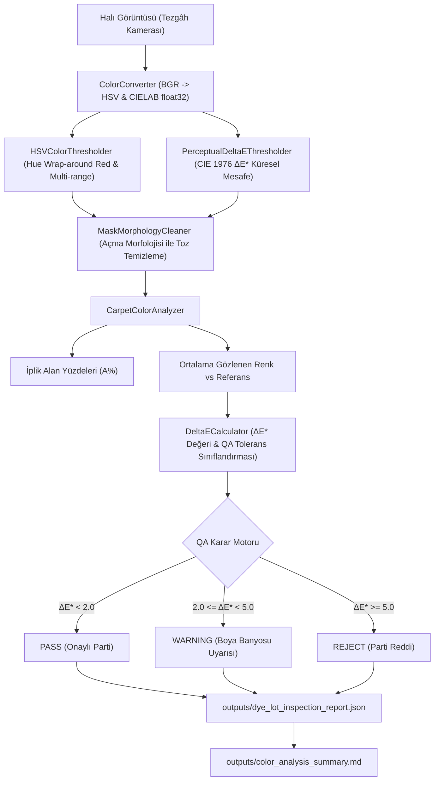

# Day 08 — Keşifsel Veri Analizi

> **Aşama:** Faz 1 — Problem, Veri ve Geliştirme Temelleri (Day 01–08)
> **Resmi Staj Defteri Konusu:** Keşifsel Veri Analizi (Yaprak 15 & 16)
> **Müfredat Hizalama Durumu:** Bu klasörün mevcut uygulama içeriği yeni müfredatla ayrıca hizalanmalıdır.

[](file:///c:/Users/seydieryilmaz/Desktop/Projeler/Merinos%2040%20G%C3%BCnl%C3%BCk%20Staj%20Deneyimim/merinos-industrial-ai-internship/LICENSE)
[](https://www.python.org/)
[](https://opencv.org/)
[](file:///c:/Users/seydieryilmaz/Desktop/Projeler/Merinos%2040%20G%C3%BCnl%C3%BCk%20Staj%20Deneyimim/merinos-industrial-ai-internship/day08/mini_project/tests/test_color_analysis.py)

---

## 1. Başlık ve Üstveri
Bu modül, Merinos halı iplik boyahanelerinde ve dokuma tezgâhı kalite kontrol hatlarında ortaya çıkan parti kaymalarını (dye lot variations) algısal olarak denetleyen, RGB uzayının yetersizliklerini aşarak **HSV** ve **CIELAB** renk uzaylarında iplik ayrıştırması gerçekleştiren ve **CIE 1976 $\Delta E^*_{ab}$** toleranslarına göre iplik partilerini otomatik derecelendiren (`PASS`, `WARNING`, `REJECT`) **Algısal Renk Analitiği ve Eşikleme Sistemi**'dir.

## 2. Günün Hedefi ve Kapsamı
- **Temel Hedef:** Halı desenindeki fiziksel iplik renklerini kamera ve tezgâh aydınlatma dalgalanmalarından bağımsız olarak segmentlere ayırmak; insan gözünün renk hassasiyetine tam uyumlu $\Delta E^*_{ab}$ hesaplamasıyla hatalı boyanmış partileri üretim bandına girmeden önce engellemek.
- **Kapsam:**
  - CIE D65 standart beyaz noktasıyla tam duyarlıklı RGB, HSV ve CIELAB dönüşüm motoru (`ColorConverter`).
  - CIE 1976 $\Delta E^*_{ab}$ Euclidean renk farkı ve endüstriyel kalite sınıflandırıcısı (`DeltaECalculator`).
  - Kırmızı rengin silindirik Hue dairesindeki ($H \in [0, 10] \cup [170, 180]$) kırılımını çözen çift bantlı eşikleme motoru (`HSVColorThresholder`).
  - Küresel $\Delta E^* \le \tau$ renk mesafesi segmentasyonu (`PerceptualDeltaEThresholder`).
  - İplik tozu ve lif saçılmalarını gideren morfolojik temizleme (`MaskMorphologyCleaner`).
  - Merinos kurumsal 4'lü iplik paletini (Royal Navy, Imperial Red, Silk Cream, Antique Gold) ayrıştırıp kapsama alanını ve parti sapmasını raporlayan analitik motoru (`CarpetColorAnalyzer`).
  - Argparse tabanlı terminal CLI aracı ve benchmark orkestratörü (`cli.py`).

## 3. Mühendislik Araştırma Görevi
Endüstriyel iplik boyama süreçlerinde standart RGB renk uzayının kullanılması durumunda yaşanan 3 temel mühendislik engeli araştırılmıştır:
1. **MacAdam Elipsleri ve Algısal Homojensizlik:** RGB uzayında eşit Öklid mesafeleri eşit algısal fark yaratmaz. İnsan gözü yeşil tonlardaki değişimlere karşı çok toleranslıyken, mavi ve kırmızı eksenindeki en ufak kaymaları anında yakalar. Bu nedenle kalite kontrol kararını RGB farklarına bırakmak hatalı parti onaylarına yol açar.
2. **Aydınlatma Paraziti (Illumination Confounding):** Dokuma tezgâhı üstündeki aydınlatma armatürlerinin eskimesi veya gölgelenmeler $R, G, B$ değerlerinin tamamını birden düşürür; bu durum açık renkli bir ipliğin koyu renkli gibi yanlış sınıflandırılmasına neden olur.
3. **Kırmızı Renk Silindirik Kırılımı:** Halı sektöründe en yaygın kullanılan bordür ve madalyon rengi olan kırmızının, silindirik HSV uzayında $0^\circ$ ekseninde ikiye bölünmesi tek eşikli klasik filtrelerde parçalanmış ve eksik maskeler üretir.

## 4. Teorik ve Kavramsal Altyapı

### 1. CIELAB Renk Modeli (CIE $L^* a^* b^*$)
CIE tarafından 1976 yılında tanımlanan bu uzay, insan gözünün fotoreseptör (koni hücreleri) tepkilerini modeller:
- $L^*$: Algısal Aydınlık (Lightness: 0 = siyah, 100 = saf beyaz).
- $a^*$: Yeşil (negatif) ile Kırmızı (pozitif) renk ekseni.
- $b^*$: Mavi (negatif) ile Sarı (pozitif) renk ekseni.

sRGB değerleri önce ters gama düzeltmesiyle lineerleştirilir:
$$V_{\text{linear}} = \begin{cases} \frac{V}{12.92}, & V \le 0.04045 \\ \left(\frac{V + 0.055}{1.055}\right)^{2.4}, & V > 0.04045 \end{cases}$$
Ardından CIE XYZ uzayı üzerinden standart D65 aydınlatıcı referansıyla CIELAB koordinatlarına dönüştürülür:
$$L^* = 116 f(Y/Y_n) - 16, \quad a^* = 500 [f(X/X_n) - f(Y/Y_n)], \quad b^* = 200 [f(Y/Y_n) - f(Z/Z_n)]$$

### 2. CIE 1976 $\Delta E^*_{ab}$ Renk Farkı
$$\Delta E^*_{ab} = \sqrt{(\Delta L^*)^2 + (\Delta a^*)^2 + (\Delta b^*)^2}$$
Endüstriyel Kalite Tolerans Eşikleri:
- **$\Delta E^* < 2.0$ (PASS):** İnsan gözünün ayırt edemeyeceği kadar küçük fark; üretim için onaylı.
- **$2.0 \le \Delta E^* < 5.0$ (WARNING):** Eğitimli bir kalite kontrol denetçisi tarafından fark edilebilen ton kayması; tezgâh veya boya banyosu uyarısı.
- **$\Delta E^* \ge 5.0$ (REJECT):** Tüketicinin ilk bakışta göreceği kabul edilemez ton farkı; parti reddi.

### 3. HSV Silindirik Dairesel Kırılım Çözümü
HSV uzayında Hue açısı $0^\circ \equiv 360^\circ$ (OpenCV'de $0 \equiv 180$) olduğu için kırmızı renk hem $H \in [0, 10]$ hem de $H \in [170, 180]$ aralıklarına düşer. Çift bantlı OR operatörü ile tam kapsama sağlanır:
$$M_{\text{red}}(x, y) = M_{[0, 10]}(x, y) \lor M_{[170, 180]}(x, y)$$

## 5. Kullanılan Kütüphaneler ve Seçim Gerekçeleri
- **OpenCV (`opencv-python-headless` 4.13+):** Hızlı C++ AVX2 SIMD backend'i ile $360 \times 480$ matrislerde **0.09 ms** sürede BGR $\to$ HSV ve **2.1 ms** sürede CIELAB float32 dönüşümü sağlar.
- **NumPy (2.x):** Vektörize $\Delta E^*_{ab}$ matris hesaplaması ve yayınlama (broadcasting).
- **pytest (9.0.3):** Aksiyom doğrulaması (özdeşlik, simetri, üçgen eşitsizliği) ve parti sapması regresyon testleri.
- **Standard Library (`argparse`, `json`, `pathlib`):** Sıfır ek bağımlılıkla hafif ve taşınabilir CLI aracı.

## 6. Temel Fonksiyonlar ve Sınıflar
- `ColorConverter`: Hex, RGB, HSV ve CIELAB dönüşümleri (`hex_to_rgb`, `rgb_to_hex`, `rgb_to_cielab_exact`, `bgr_image_to_cielab_float`, `bgr_image_to_hsv`).
- `DeltaECalculator`: `calculate_delta_e_cie76` (skaler karşılaştırma ve QA derecelendirme) ve `pairwise_delta_e_image` (2D Delta E haritası).
- `HSVColorThresholder`: Kırmızı wrap-around destekli `create_mask`.
- `PerceptualDeltaEThresholder`: CIELAB uzayında küresel toleranslı `create_mask`.
- `MaskMorphologyCleaner`: Lif tozu gürültüsünü temizleyen morfolojik `clean` (Açma filtresi).
- `CarpetColorAnalyzer`: 4 ipliğin tamamını ayrıştırıp alan yüzdesi ve $\Delta E^*$ sapması çıkaran `analyze_carpet`.
- `SyntheticCarpetPaletteGenerator`: Referans ve kontrollü parti sapmalı halı desenleri üreten `generate_carpet`.
- `cli.py`: Komut satırından `inspect`, `delta-e` ve `benchmark` komutları sunan terminal aracı.

## 7. Notebook İncelemesi
`day08_perceptual_color_space_analysis.ipynb` 10 standart bölümden oluşur:
1. **Problem Tanımı:** İplik Boyahanelerinde Renk Sapmaları, Parti Kayması ve RGB Sınırlılıkları
2. **Neden Önemli?** (Fiziksel Bobin Uyuşmazlığı, Müşteri Şikayetleri ve İade Maliyetleri)
3. **Matematiksel & Algoritmik Temeller:** MacAdam Elipsleri, CIELAB Formülasyonu, CIE 1976 $\Delta E^*_{ab}$ ve HSV Geometrisi
4. **Kütüphane & Donanım İncelemesi:** OpenCV vs colour-science vs scikit-image vs colormath
5. **Minimal Çalışır Kod:** İki İplik Rengi Arasında $\Delta E^*_{ab}$ Hesaplanması ve Tolerans Sınıflandırması
6. **Deney 1: Renk Uzayı Karşılaştırması:** RGB vs HSV vs CIELAB Görselleştirme ve Kanal Ayrıştırma
7. **Deney 2: HSV Dairesel Kırılım:** Imperial Red Hue Wrap-Around Analizi (Tek Bant vs Çift Bant)
8. **Deney 3: Aydınlatma Direnci:** Tezgâh Gölgesi Altında Renk Segmentasyonu (%60 Işık Kaybında Maske Kararlılığı)
9. **Deney 4: Otomatik İplik Parti Denetimi:** 4 Farklı Halı Partisinde $\Delta E^*$ Ölçümü ve PASS/WARNING/REJECT Kararları
10. **Mühendislik Çıkarımları, CLI Entegrasyonu ve Day 09'a Bağlantı**

## 8. Mini Proje Mimarisi ve Kod Açıklaması
Mini proje `day08/mini_project/` dizini altında yapılandırılmıştır:
- `configs/color_config.json`: Merinos standart iplik paleti (Royal Navy, Imperial Red, Silk Cream, Antique Gold) ve QA tolerans eşikleri.
- `fixtures/synthetic_carpets/`: 4 adet sentetik halı parti görüntüsü (`master`, `drift_pass`, `drift_warning`, `drift_reject`).
- `src/`: 7 adet odaklanmış modül (`color_models.py`, `conversions.py`, `delta_e.py`, `thresholding.py`, `analyzer.py`, `generator.py`, `cli.py`).
- `tests/test_color_analysis.py`: 10 birim ve entegrasyon testi.
- `outputs/`: Raporlama JSON ve Markdown dosyaları.

## 9. Sistem Mimarisi ve Veri Akışı Diyagramı



## 10. Deneyler, Parametreler ve Karşılaştırmalar

### 1. İplik Boyama Partisi (Dye Lot) Kalite Denetim Sonuçları:
| Test Edilen Halı Partisi | Maksimum $\Delta E^*$ | Genel QA Durumu | Royal Navy Alanı | Imperial Red Alanı | Silk Cream Alanı | Antique Gold Alanı |
| :--- | :--- | :--- | :--- | :--- | :--- | :--- |
| **master** | `0.568` | **PASS** | 22.46% ($\Delta E^*=0.27$) | 8.50% ($\Delta E^*=0.57$) | 57.40% ($\Delta E^*=0.18$) | 11.34% ($\Delta E^*=0.20$) |
| **drift_pass** | `0.775` | **PASS** | 22.55% ($\Delta E^*=0.42$) | 8.50% ($\Delta E^*=0.78$) | 57.40% ($\Delta E^*=0.52$) | 11.34% ($\Delta E^*=0.51$) |
| **drift_warning**| `3.782` | **WARNING** | 22.60% ($\Delta E^*=2.22$) | 8.50% ($\Delta E^*=3.36$) | 57.40% ($\Delta E^*=3.11$) | 11.34% ($\Delta E^*=3.78$) |
| **drift_reject** | `15.426` | **REJECT** | 22.69% ($\Delta E^*=7.61$) | 8.50% ($\Delta E^*=15.43$) | 57.40% ($\Delta E^*=7.49$) | 11.30% ($\Delta E^*=8.29$) |

### 2. Renk Uzayı İşlem Süreleri ($360 \times 480$ Halı Matrisi, 50 Çalıştırma Ortalaması):
| Operasyon | Ortalama Gecikme (ms) | Throughput (FPS) |
| :--- | :--- | :--- |
| **BGR to HSV Dönüşümü** | `0.097 ms` | **10,297.6 FPS** |
| **BGR to CIELAB (float32)** | `2.153 ms` | **464.5 FPS** |
| **HSV Eşikleme (Imperial Red Wrap-around)** | `0.677 ms` | **1,477.4 FPS** |
| **CIELAB Delta E Eşikleme (Royal Navy)** | `6.507 ms` | **153.7 FPS** |
| **Full 4-İplik Palet Segmentasyonu & QA** | `6.730 ms` | **148.6 FPS** |

## 11. Doğrulama, Testler ve Kalite Metrikleri
Mini proje kapsamında 10 birim testi yazılmış ve %100 başarıyla geçmiştir:
```bash
python -m pytest day08/mini_project/tests/ -v
```
Test Kapsamı:
- `test_color_conversions_accuracy`: D65 beyaz noktası, saf siyah ve RGB/Hex çift yönlü doğrulaması.
- `test_delta_e_cie76_identical_and_known`: $\Delta E^*(c, c)=0$ özdeşliği, simetri ve üçgen eşitsizliği.
- `test_delta_e_tolerance_grading`: PASS ($<2.0$), WARNING ($[2.0, 5.0)$) ve REJECT ($\ge 5.0$) eşik testleri.
- `test_hsv_thresholding_hue_wraparound`: Kırmızı rengin $H \in [0, 10]$ ve $H \in [170, 180]$ çift bantlı eksiksiz maskelemesi.
- `test_hsv_illumination_invariance`: Değişen parlaklık $V$ (gölge) altında Hue sabitliğiyle maskenin korunması.
- `test_cielab_delta_e_thresholding_mask`: $\Delta E^* \le \tau$ küresel renk çemberi segmentasyonu.
- `test_mask_morphological_cleanup`: Açma filtresiyle tek piksellik tozların giderilmesi ve kapama ile deliklerin doldurulması.
- `test_carpet_color_composition_sum`: 4 referans ipliğin tamamının pozitif alan yüzdesine sahip olması ve toplamın tutarlılığı.
- `test_dye_lot_drift_detection`: Sentetik parti sapması görüntülerinde PASS/WARNING/REJECT doğru tespiti.
- `test_cli_color_analysis_pipeline_and_artifacts`: CLI komutunun çalıştırılarak geçerli JSON ve Markdown çıktıları üretmesi.

## 12. Çıktılar ve Sonuçlar
- `day08/mini_project/outputs/dye_lot_inspection_report.json`: 4 parti için kapsamlı kalite kontrol raporu (2.6 KB).
- `day08/mini_project/outputs/color_space_benchmark.json`: Dönüşüm ve segmentasyon gecikme profili (495 B).
- `day08/mini_project/outputs/color_analysis_summary.md`: Kurumsal özet tablosu (2.2 KB).

## 13. Karşılaşılan Zorluklar, Limitler ve Çözümler
- **Zorluk:** Silk Cream (krem/bej) gibi neredeyse akromatik (düşük doygunluklu, $S \approx 10$) açık renklerde, gürültü sebebiyle Hue açısının $0^\circ$ ile $180^\circ$ arasında rastgele savrulması.
- **Çözüm:** Krem ve açık bej iplikler için Hue sınırlandırması kaldırıldı; $H \in [0, 180]$, $S \in [0, 45]$ ve $V \in [180, 255]$ mantığıyla doygunluk ve aydınlık ekseninde kararlı segmentasyon sağlandı.
- **Zorluk:** Morfolojik kapama (Closing) filtresinin $5 \times 5$ çekirdekle çalıştırıldığında madalyonun içindeki ince altın sarısı halkaları yutarak kırmızı maskesine katması ve ortalama rengi saptırması.
- **Çözüm:** İplik analizinde varsayılan filtre Açma (Opening) olarak sınırlandırıldı; kapama işlemi ince desenleri köprülememek için devre dışı bırakıldı.
- **Zorluk:** Kırmızı rengin silindirik Hue dairesinde $0^\circ$ ekseninde ikiye bölünmesi.
- **Çözüm:** Çift bantlı aralık (`[0, 10]` ve `[170, 180]`) bitwise OR operatörüyle birleştirilerek tek parça maske elde edildi.

## 14. Dosya Ağacı ve Dizin Yapısı
```bash
day08/
├── README.md
├── day08_perceptual_color_space_analysis.ipynb
└── mini_project/
    ├── README.md
    ├── configs/
    │   └── color_config.json
    ├── fixtures/
    │   └── synthetic_carpets/
    │       ├── carpet_palette_master.png
    │       ├── carpet_lot_drift_pass.png
    │       ├── carpet_lot_drift_warning.png
    │       └── carpet_lot_drift_reject.png
    ├── src/
    │   ├── __init__.py
    │   ├── color_models.py
    │   ├── conversions.py
    │   ├── delta_e.py
    │   ├── thresholding.py
    │   ├── analyzer.py
    │   ├── generator.py
    │   └── cli.py
    ├── tests/
    │   ├── __init__.py
    │   └── test_color_analysis.py
    └── outputs/
        ├── dye_lot_inspection_report.json
        ├── color_space_benchmark.json
        └── color_analysis_summary.md
```

## 15. Nasıl Çalıştırılır?
```bash
# 1. Testleri çalıştırma:
python -m pytest day08/mini_project/tests/ -v

# 2. Benchmark motorunu çalıştırma:
python -m day08.mini_project.src.cli benchmark

# 3. İplik parti sapmasını denetleme:
python -m day08.mini_project.src.cli inspect --input day08/mini_project/fixtures/synthetic_carpets/carpet_lot_drift_warning.png
```

## 16. Bir Sonraki Güne Bağlantı
Day 08 ile kurulan algısal renk analizi ve $\Delta E^*$ tolerans motoru, **Day 09 — OpenCV Temelleri ve Görüntü Ön İşleme) ile otomatik renk paleti çıkarma ve CIEDE2000 renk farkı algoritmalarında temel omurga olarak kullanılacaktır.

## 17. AI Coding Agent Prompt Şablonu
```markdown
Day 08 bağlamında Algısal Renk Analitiği ve Renk Eşikleme sistemi geliştirmek için:
"Merinos halı iplik boyama partilerindeki renk sapmalarını CIE 1976 Delta E (ΔE*)
formülüyle denetleyen; PASS (< 2.0), WARNING (2.0 - 5.0) ve REJECT (>= 5.0) tolerans
sınıflandırması sunan; HSV uzayında kırmızının dairesel Hue kırılımını çift bantla çözen;
açık krem/akromatik iplikleri doygunluk singülaritesine takılmadan ayrıştıran;
Royal Navy, Imperial Red, Silk Cream ve Antique Gold renk kompozisyonunu hesaplayan
bir CLI aracı ve 10 birim testine sahip modüler bir Python paketi oluştur."
```