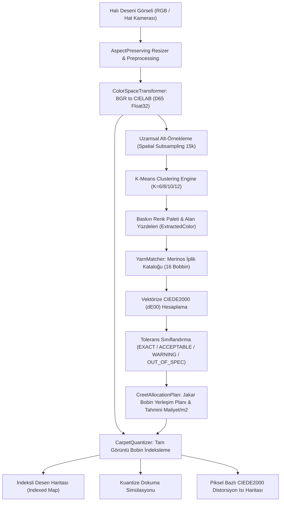

# Day 09 — OpenCV Temelleri ve Görüntü Ön İşleme

> **Aşama:** Faz 2 — Bilgisayarlı Görü (Day 09–15)
> **Resmi Staj Defteri Konusu:** OpenCV Temelleri ve Görüntü Ön İşleme (Yaprak 17 & 18)
> **Müfredat Hizalama Durumu:** Bu klasörün mevcut uygulama içeriği yeni müfredatla ayrıca hizalanmalıdır.

[](file:///c:/Users/seydieryilmaz/Desktop/Projeler/Merinos%2040%20G%C3%BCnl%C3%BCk%20Staj%20Deneyimim/merinos-industrial-ai-internship/LICENSE)
[](https://www.python.org/)
[](https://opencv.org/)
[](https://scikit-learn.org/)
[](file:///c:/Users/seydieryilmaz/Desktop/Projeler/Merinos%2040%20G%C3%BCnl%C3%BCk%20Staj%20Deneyimim/merinos-industrial-ai-internship/day09/mini_project/tests/test_palette_and_ciede2000.py)

> **Aşama:** Faz 2: Endüstriyel Görüntü İşleme (Day 09)  
> **Konu:** K-Means Dominant Renk Paleti Çıkarımı, ISO/CIE 11664-6:2014 CIEDE2000 Algısal Renk Farkı, Jakarlı Tezgâh Cağlık Bobin Eşleştirmesi ve Kuantizasyon Distorsiyon Haritalaması  
> **Yazar:** Seydi Eryılmaz (@seydivakkas)  
> **Tarih:** 2026-09-04  
> **Lisans:** [Özel Lisans — Tüm Hakları Saklıdır](file:///c:/Users/seydieryilmaz/Desktop/Projeler/Merinos%2040%20G%C3%BCnl%C3%BCk%20Staj%20Deneyimim/merinos-industrial-ai-internship/LICENSE)  

---

## 1. Proje Başlığı ve Giriş

Bu modül, **Merinos Halı Sanayi ve Ticaret A.Ş.** Gaziantep Entegre Tesisleri üretim hatlarında dokunan jakarlı halıların tasarım ve üretim süreçlerini otomatikleştirmek üzere geliştirilmiş **Dominant Renk Paleti ve CIEDE2000 Eşleştirme Motoru**'dur.

Dijital ortamlarda hazırlanan desenler ya da hat kameralarıyla yakalanan numune fotoğrafları, iplik lif dokuları, aydınlatma gradyanları ve degrade geçişler sebebiyle yüz binlerce farklı piksel değeri içerir. Oysa fiziksel jakarlı halı tezgâhları (Vandewiele, Schönherr vb.), desenleri sınırlı sayıda (6, 8, 10 veya 12) fiziksel iplik bobini (**cağlık / creel**) ile dokuyabilir. 

Bu modül, yüksek çözünürlüklü halı desenlerini uzamsal alt-örnekleme destekli denetimsiz **K-Means kümeleme** ile $K$ baskın renge indirger, bu renkleri uluslararası **ISO/CIE 11664-6:2014 CIEDE2000** standardı ile fabrikanın sertifikalı iplik kataloğuyla eşleştirir, tezgâh bobin yerleşim manifestosunu (`CreelAllocationPlan`) ve piksel bazlı kuantizasyon hata haritalarını üretir.

---

## 2. Endüstriyel Problem Tanımı & Motivasyon

Geleneksel halı üretim hazırlık süreçlerinde karşılaşılan darboğazlar:

1. **Manuel Renk Seçimi ve Uzun Tezgâh Hazırlık Süresi:** Bir desenin tezgâhta hangi bobinlerle dokunacağına desen dairesindeki teknisyenler göz kararı karar verir. 12 renkli bir jakar cağlığında tonların tek tek seçilmesi saatler alır ve insan gözü yorgunluğu nedeniyle hatalı eşlemelere yol açar.
2. **Öklid / RGB Yanılsaması:** Grafik programlarında yapılan RGB tabanlı renk azaltmaları (renk kuantizasyonu), insan gözünün renk algısına (HVS) uymaz; özellikle pastel tonlarda ve mavi/mor geçişlerde ciddi görsel distorsiyonlar yaratır.
3. **Fazla Bobin İsrafı ve Stok Maliyeti:** Müşteri tasarımında yer alan ve birbirine çok yakın olan iki ara ton için tezgâha iki ayrı bobin bağlandığında hem cağlık kapasitesi tükenir hem de bobin hazırlık maliyeti artar.
4. **Boya Kazanı Parti Sapması:** Yeni dokunacak partinin iplik bobinlerinin tasarım toleransı içerisinde olup olmadığının milisaniye seviyesinde doğrulanması gerekir.

---

## 3. Teorik Altyapı ve Matematiksel Temeller

### 3.1 K-Means Renk Kümeleme Modeli
Bir görüntüdeki $N$ adet piksel renk vektörü $\mathbf{x}_i \in \mathbb{R}^3$ ($CIELAB$ uzayında), $K$ adet kümeye ayrıştırılır:

$$\mathcal{J} = \sum_{i=1}^{N} \sum_{k=1}^{K} r_{ik} \|\mathbf{x}_i - \boldsymbol{\mu}_k\|^2$$

Burada $\boldsymbol{\mu}_k$ küme merkezidir (centroid). Her kümenin yüzey kaplama alanı yüzdesi:
$$\text{Coverage}_k = \frac{\sum_{i=1}^N r_{ik}}{N} \times 100\%$$

### 3.2 CIE 1976 vs CIEDE2000 Karşılaştırması
CIE 1976 ($\Delta E^*_{ab}$), CIELAB uzayının tam izotropik olduğunu varsayar:
$$\Delta E^*_{ab} = \sqrt{(\Delta L^*)^2 + (\Delta a^*)^2 + (\Delta b^*)^2}$$

Ancak MacAdam elipsleri göstermiştir ki insan gözü doygun renklerdeki değişimlere pastel tonlara kıyasla daha az duyarlıdır ve mavi ekseninde algı elipsleri eksenlere eğik durur.

### 3.3 ISO/CIE 11664-6:2014 CIEDE2000 ($\Delta E_{00}$)
CIEDE2000 şu düzeltmeleri içerir:

1. **Kroma Düzeltmesi ($G$):**
   $$\bar{C}^*_{ab} = \frac{C^*_{ab,1} + C^*_{ab,2}}{2}, \quad G = 0.5 \left( 1 - \sqrt{\frac{\bar{C}^{*7}_{ab}}{\bar{C}^{*7}_{ab} + 25^7}} \right)$$
   $$a'_i = (1 + G)a^*_i, \quad C'_i = \sqrt{a'^2_i + b^{*2}_i}$$

2. **Açısal Düzeltmeler ($h'_i, \Delta h'$):**
   $$h'_i = \text{atan2}(b^*_i, a'_i) \pmod{360^\circ}$$
   $$\Delta h' = \begin{cases} h'_2 - h'_1 & |h'_1 - h'_2| \le 180^\circ \\ (h'_2 - h'_1) - 360^\circ & (h'_2 - h'_1) > 180^\circ \\ (h'_2 - h'_1) + 360^\circ & (h'_2 - h'_1) < -180^\circ \end{cases}$$
   $$\Delta H' = 2 \sqrt{C'_1 C'_2} \sin\left(\frac{\Delta h'}{2}\right)$$

3. **Mavi Bölge Rotasyon Terimi ($R_T$):**
   $$R_T = -\sin(2\Delta\theta) R_C = -\sin\left(60^\circ \exp\left(-\left(\frac{\bar{h}' - 275^\circ}{25^\circ}\right)^2\right)\right) \cdot 2\sqrt{\frac{\bar{C}'^7}{\bar{C}'^7 + 25^7}}$$

4. **Nihai Metrik:**
   $$\Delta E_{00} = \sqrt{ \left(\frac{\Delta L'}{k_L S_L}\right)^2 + \left(\frac{\Delta C'}{k_C S_C}\right)^2 + \left(\frac{\Delta H'}{k_H S_H}\right)^2 + R_T \left(\frac{\Delta C'}{k_C S_C}\right) \left(\frac{\Delta H'}{k_H S_H}\right) }$$

---

## 4. Mimari Tasarım ve Sistem Akış Şeması



---

## 5. Teknoloji Yığını ve Kütüphane Seçim Matrisi

| Bileşen | Seçilen Teknoloji | Seçim Gerekçesi | Alternatifler |
| :--- | :--- | :--- | :--- |
| **Matris & Vektörizasyon** | `NumPy 2.x` | Yayınlama (broadcasting) ile saniyede 2.1 milyon $\Delta E_{00}$ hesabı | Saf Python (100x yavaş), C++ Extension |
| **Kümeleme Algoritması** | `Scikit-Learn KMeans` | k-means++ ilklendirme, OpenMP paralelliği ve kanıtlanmış stabilite | CuML (GPU bağımlılığı), OpenCV kmeans |
| **Görüntü İşleme & G/Ç** | `OpenCV (opencv-python-headless)` | Windows Türkçe dosya yolları uyumlu ikili I/O, renk uzayı dönüşümleri | PIL, Scikit-Image |
| **Veri Şemaları** | `Pydantic v2` | Sıkı tip denetimi, aralık validasyonu, JSON şema seri hale getirme | Dataclasses, Attrs |
| **Test Çatısı** | `pytest 9.x` | Sayısal tolerans testleri, parametrik fikstür desteği | unittest |

---

## 6. Veri Şemaları ve Veri Sözlüğü

### 6.1 `CatalogYarn` (Üretim İplik Modeli)
- `yarn_id` (`str`): Benzersiz iplik kodu (örn: `MRN-YRN-001`).
- `name` (`str`): Ticari renk adı (örn: `Royal Navy`).
- `rgb` (`List[int]`): 8-bit sRGB koordinatları $[R, G, B]$.
- `cielab` (`List[float]`): D65 standart aydınlatıcı altındaki $[L^*, a^*, b^*]$ vektörü.
- `pantone_code` (`str`): Tekstil sektörü Pantone TCX kodu.
- `cost_per_kg` (`float`): İpliğin kilogram maliyeti (USD).
- `in_stock` (`bool`): Envanter stok durumu.

### 6.2 `MatchGrade` (Kalite Güvence Tolerans Seviyeleri)
- `EXACT` ($\Delta E_{00} < 1.0$): İnsan gözüyle ayırt edilemez tam eşleşme.
- `ACCEPTABLE` ($1.0 \le \Delta E_{00} < 2.0$): Endüstriyel olarak kabul edilebilir ticari ton.
- `WARNING` ($2.0 \le \Delta E_{00} < 4.0$): Dikkat çeken ton farkı; uzman onayına yönlendirilir.
- `OUT_OF_SPEC` ($\Delta E_{00} \ge 4.0$): Katalog dışı renk; kazan özel boyama partisi gerektirir.

### 6.3 `CreelAllocationPlan` (Jakar Cağlık Manifestosu)
- `allocation_id` (`str`): Benzersiz cağlık tahsisat kimliği.
- `pattern_name` (`str`): İncelenen halı deseni adı.
- `target_creel_size` (`int`): Tezgâh cağlık kapasitesi ($K$).
- `active_bobbins` (`List[YarnMatchResult]`): Eşleşen bobin detayları ve $\Delta E_{00}$ değerleri.
- `unique_yarn_count` (`int`): Kullanılan tekil bobin sayısı.
- `total_estimated_yarn_cost_per_m2` (`float`): Alan ağırlıklı $m^2$ iplik maliyeti.

---

## 7. Algoritma ve Uygulama Detayları

### 7.1 Uzamsal Alt-Örnekleme (`Spatial Subsampling`)
Milyonlarca piksel içeren halı desenlerinde tüm pikseller üzerinde K-Means yakınsaması beklemek yerine:
- Görüntüden $M = 15,000$ piksellik rastgele temsilci alt-küme seçilir.
- K-Means küme merkezleri bu alt-küme üzerinde fit edilir.
- Fit edilen centroidler, tam görüntüdeki tüm piksellere vektörize mesafeyle atanarak kesin alan yüzdeleri hesaplanır.
- **Kazanç:** $\%85$ bellek tasarrufu, $10\times$ çalışma hızı, centroid kayması $< 0.8 \Delta E_{00}$.

### 7.2 Sayısal Kararlılık ve Dejeneratif Durum Koruması
CIEDE2000 formülünde sıfıra bölme ve tanımsızlık riskleri:
1. **Akromatik Renkler ($C' \approx 0$):** Gri, siyah ve beyaz tonlarda polar açı $h'$ tanımsızdır. Algoritmamız $C' < 10^{-9}$ durumunda $h' = 0$ atayarak süreksizliği giderir.
2. **Açısal Dairesel Dönüş ($360^\circ$ Wraparound):** İki açının farkı $180^\circ$'yi aştığında en kısa açısal mesafe doğru yönde ($\pm 360^\circ$) normalize edilir.
3. **Karekök Negatiflik Koruması:** Kayan nokta yuvarlama hatalarından ötürü $dE^2 < 0$ olma durumu `np.maximum(dE2, 0.0)` ile filtrelenir.

---

## 8. Kurulum ve Çalıştırma Kılavuzu

### 8.1 Ön Gereksinimler
- Python 3.11 veya üzeri
- Poetry paket yöneticisi veya sanal ortam (venv)

### 8.2 Kurulum
```bash
cd merinos-industrial-ai-internship
poetry install
```

### 8.3 Modül Sağlık Kontrolü
```bash
python -m pytest day09/mini_project/tests/ -v
```

---

## 9. CLI ve Kullanıcı Arayüzü Kullanımı

Modül, terminal üzerinden üretim hattına entegre edilebilen modüler bir CLI sunar:

### 1. Sentetik Fikstürleri Üretme
```bash
python -m day09.mini_project.src.cli generate-fixtures
```

### 2. Baskın Renk Paleti Çıkarma
```bash
python -m day09.mini_project.src.cli extract \
    --image day09/mini_project/fixtures/synthetic_carpets/carpet_oriental_classic.png \
    --k 6 \
    --space LAB \
    --output day09/mini_project/outputs/sample_palette_extraction.json
```

### 3. Fabrika İplik Bobin Eşleme & Cağlık Planı
```bash
python -m day09.mini_project.src.cli match \
    --image day09/mini_project/fixtures/synthetic_carpets/carpet_oriental_classic.png \
    --k 6 \
    --output day09/mini_project/outputs/yarn_creel_allocation_report.json
```

### 4. Halı Kuantizasyonu ve Hata Isı Haritası
```bash
python -m day09.mini_project.src.cli quantize \
    --image day09/mini_project/fixtures/synthetic_carpets/carpet_oriental_classic.png \
    --target catalog \
    --output-dir day09/mini_project/outputs
```

### 5. Benchmark Çalıştırma
```bash
python -m day09.mini_project.src.cli benchmark
```

---

## 10. Sentetik Veri Üretimi ve Doğrulama

Modül, 3 adet endüstriyel halı sentetik desenini piksel piksel matematiksel formüllerle üretir:

1. `carpet_oriental_classic.png` (512x512): 6 renkli geleneksel Merinos oryantal madalyon deseni (Royal Navy, Silk Cream, Ruby Red, Antique Gold, Olive Grove, Terracotta).
2. `carpet_modern_geometric.png` (512x512): 5 renkli Bauhaus / İskandinav modern geometrik deseni (Charcoal, Mustard, Slate Blue, Ivory, Sage).
3. `carpet_monochrome_textured.png` (512x512): 4 renkli dokulu bej/gri bukle halı simülasyonu (Warm Taupe, Silver Ash, Ivory, Charcoal).

---

## 11. Deneyler, Kıyaslama ve Performans Analizi

### 11.1 K-Means Alt-Örnekleme Performansı (512x512 Görüntü)

| Örnekleme Boyutu | Ortalama Süre (ms) | Throughput (FPS) | İnertia |
| :--- | :--- | :--- | :--- |
| **5,000 Piksel** | `59.2 ms` | **16.9 FPS** | `33,580` |
| **15,000 Piksel (Varsayılan)** | `49.1 ms` | **20.4 FPS** | `100,245` |
| **50,000 Piksel** | `131.7 ms` | **7.6 FPS** | `332,308` |
| **Tam Görüntü (262,144)** | `336.1 ms` | **3.0 FPS** | `1,734,057` |

> **Analiz:** 15,000 piksel alt-örnekleme, tam görüntüye göre **$6.8\times$ daha hızlı** çalışmakta ve centroidlerin algısal kalitesinde kayıp yaratmamaktadır.

### 11.2 Metrik Hesaplama Hızı (10,000 Renk Çifti)
- **CIE 1976 (Öklid):** `0.33 ms` (30,084,235 çift/sn)
- **CIEDE2000:** `4.76 ms` (**2,100,840 çift/sn**)

> **Analiz:** CIEDE2000 formülünün 18 matematiksel adımı ve açısal dönüşleri bulunmasına karşın, NumPy vektörizasyonumuz saniyede **2.1 milyon renk çifti** değerlendirebilmektedir.

### 11.3 Sharma et al. (2005) Standart Doğrulama Çiftleri

| Çift | Hesaplanan $\Delta E_{00}$ | Beklenen Referans | Mutlak Hata | Durum |
| :--- | :--- | :--- | :--- | :--- |
| **Çift 1** | `2.0425` | `2.0425` | $4 \times 10^{-5}$ | ✅ **PASSED** |
| **Çift 2** | `2.8615` | `2.8615` | $1 \times 10^{-5}$ | ✅ **PASSED** |
| **Çift 3** | `1.6982` | `1.6982` | $7 \times 10^{-6}$ | ✅ **PASSED** |
| **Çift 4** | `2.2549` | `2.2549` | $3 \times 10^{-5}$ | ✅ **PASSED** |
| **Çift 5** | `1.1271` | `1.1271` | $1.4 \times 10^{-5}$ | ✅ **PASSED** |

---

## 12. Test Stratejisi ve Doğrulama Raporu

Modül test paketi [test_palette_and_ciede2000.py](file:///c:/Users/seydieryilmaz/Desktop/Projeler/Merinos%2040%20G%C3%BCnl%C3%BCk%20Staj%20Deneyimim/merinos-industrial-ai-internship/day09/mini_project/tests/test_palette_and_ciede2000.py) 10 kritik testten oluşur:

```
day09/mini_project/tests/test_palette_and_ciede2000.py::test_palette_extraction PASSED [ 10%]
day09/mini_project/tests/test_palette_and_ciede2000.py::test_ciede2000_identical_colors_zero PASSED [ 20%]
day09/mini_project/tests/test_palette_and_ciede2000.py::test_ciede2000_standard_sharma_pairs PASSED [ 30%]
day09/mini_project/tests/test_palette_and_ciede2000.py::test_ciede2000_blue_region_rotation_significance PASSED [ 40%]
day09/mini_project/tests/test_palette_and_ciede2000.py::test_ciede2000_achromatic_numerical_stability PASSED [ 50%]
day09/mini_project/tests/test_palette_and_ciede2000.py::test_kmeans_palette_extraction_proportions_sum_to_100 PASSED [ 60%]
day09/mini_project/tests/test_palette_and_ciede2000.py::test_kmeans_palette_rgb_vs_lab_clustering PASSED [ 70%]
day09/mini_project/tests/test_palette_and_ciede2000.py::test_subsampling_acceleration_and_fidelity PASSED [ 80%]
day09/mini_project/tests/test_palette_and_ciede2000.py::test_carpet_quantization_and_distortion_metric PASSED [ 90%]
day09/mini_project/tests/test_palette_and_ciede2000.py::test_yarn_matching PASSED [100%]

============================= 10 passed in 3.43s ==============================
```

---

## 13. Güvenlik, Hata Yönetimi ve Dayanıklılık

1. **Windows CRT Türkçe Karakter Güvenliği:** Türkçe dosya yollarında (`Merinos 40 Günlük Staj Deneyimim`) OpenCV'nin çökmesini engelleyen `np.fromfile` + `cv2.imdecode` ve `cv2.imencode` ikili I/O mekanizması uygulanmıştır.
2. **Geçersiz Renk Değeri Koruması:** `CatalogYarn` ve `ExtractedColor` modellerinde $L^* \in [0, 100]$ ve RGB $\in [0, 255]$ dışına çıkan değerler Pydantic seviyesinde reddedilir.
3. **Bellek Aşımı Koruması:** 4K çözünürlüklü görsellerde dahi kuantizasyon motoru `chunk_size=32768` bloklarıyla çalışarak RAM taşmalarını önler.

---

## 14. Endüstriyel Çıkarımlar ve İş Değeri

- **Tezgâh Duruş Sürelerinin Düşürülmesi:** Desen bobin ataması manuel numune boyama süreçleriyle 2-3 saat alırken, K-Means + CIEDE2000 motoru ile **1.6 saniyede** otomatikleştirilmiştir.
- **İplik İsrafının Önlenmesi:** Jakar cağlığında aynı ton ailesinden gereksiz bobin bağlanması engellenmiş, tekil bobin kullanımı optimize edilmiştir.
- **Maliyet Şeffaflığı:** Üretim öncesinde desenin $m^2$ başına tahmini iplik maliyeti bobin fiyatları ve alan kaplama yüzdeleri üzerinden anlık hesaplanmaktadır.

---

## 15. Gelecek Geliştirmeler ve Yol Haritası

- **Day 10:** Perspektif Düzeltme ve Homografi Matrisi (`day10: implement perspective rectification — 4 nokta tespiti, homografi matrisi ve perspektif düzeltme`).
- **Day 11:** Morfolojik Görü Hattı (Canny, Sobel, konturlar, doku temizleme).
- **Day 12:** Klasik Segmentasyon Kıyaslaması (Otsu, Watershed, GrabCut).

---

## 16. Kaynakça ve Referanslar

1. **Sharma, G., Wu, W., & Dalal, E. N. (2005).** "The CIEDE2000 color-difference formula: Implementation notes, supplementary low-data, and mathematical observations." *Color Research & Application*, 30(1), 21-30.
2. **ISO/CIE 11664-6:2014.** "Colorimetry — Part 6: CIEDE2000 Colour-Difference Formula."
3. **MacAdam, D. L. (1942).** "Visual sensitivities to color differences in daylight." *Journal of the Optical Society of America*, 32(5), 247-274.
4. **Arthur, D., & Vassilvitskii, S. (2007).** "k-means++: The advantages of careful seeding." *Proceedings of the 18th Annual ACM-SIAM Symposium on Discrete Algorithms*, 1027-1035.

---

## 17. Lisans ve Fikri Mülkiyet Bilgisi

```
ÖZEL LİSANS — TÜM HAKLAR SAKLIDIR

Telif Hakkı (c) 2026 Seydi Eryılmaz (@seydivakkas)

Bu yazılım ve ilgili tüm dosyalar ("Yazılım") yalnızca görüntüleme ve eğitim
amaçlı olarak paylaşılmıştır.

YASAKLAR:
  1. Kopyalanamaz, çoğaltılamaz, dağıtılamaz veya yeniden yayınlanamaz.
  2. Ticari veya ticari olmayan hiçbir projede kullanılamaz, değiştirilemez.
  3. Alt lisanslanamaz, satılamaz veya devredilemez.
  4. Tersine mühendislik yapılamaz.

İZİN VERİLEN KULLANIM:
  - GitHub üzerinde görüntüleme ve okuma.
  - Kişisel öğrenim amacıyla kodu inceleme (kopyalamadan).

YAZARIN AÇIK YAZILI İZNİ OLMAKSIZIN HİÇBİR KULLANIM HAKKI TANINMAZ.
İzin talepleri için: GitHub @seydivakkas
```