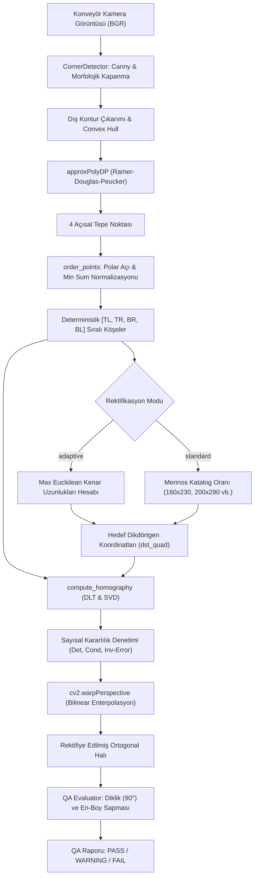

# Day 10 — Renk Uzayları ve Renk Farkı

> **Aşama:** Faz 2 — Bilgisayarlı Görü (Day 09–15)
> **Resmi Staj Defteri Konusu:** Renk Uzayları ve Renk Farkı (Yaprak 19 & 20)
> **Müfredat Hizalama Durumu:** Bu klasörün mevcut uygulama içeriği yeni müfredatla ayrıca hizalanmalıdır.

[](file:///c:/Users/seydieryilmaz/Desktop/Projeler/Merinos%2040%20G%C3%BCnl%C3%BCk%20Staj%20Deneyimim/merinos-industrial-ai-internship/LICENSE)
[](https://www.python.org/)
[](https://opencv.org/)
[](https://numpy.org/)
[](file:///c:/Users/seydieryilmaz/Desktop/Projeler/Merinos%2040%20G%C3%BCnl%C3%BCk%20Staj%20Deneyimim/merinos-industrial-ai-internship/day10/mini_project/tests/test_rectification.py)

> **Aşama:** Faz 2: Endüstriyel Görüntü İşleme (Day 10)  
> **Konu:** DLT Homografi Matrisi ($3 \times 3$), Otomatik 4 Köşe Tespiti, Deterministik Saat Yönü Sıralama Algoritması, Geometrik Ortogonalizasyon ve Konveyör Kalite Güvence (QA) Değerlendirmesi  
> **Yazar:** Seydi Eryılmaz (@seydivakkas)  
> **Tarih:** 2026-09-04  
> **Lisans:** [Özel Lisans — Tüm Hakları Saklıdır](file:///c:/Users/seydieryilmaz/Desktop/Projeler/Merinos%2040%20G%C3%BCnl%C3%BCk%20Staj%20Deneyimim/merinos-industrial-ai-internship/LICENSE)  

---

## 1. Proje Başlığı ve Giriş

Bu modül, **Merinos Halı Sanayi ve Ticaret A.Ş.** Gaziantep Entegre Tesisleri üretim hatlarında (dokuma tezgâhı çıkışı, apre kurutma, traşlama ve nihai paketleme hatları) konveyör bantları üzerinde hareket eden halıların kamera görüntülerindeki açısal perspektif bozulmalarını (keystone / trapezoidal distorsiyon) gerçek zamanlı olarak düzelten **Perspektif Düzeltme ve Homografi Matrisi Motoru**'dur.

Endüstriyel tesis içi mekanik engeller, aydınlatma köprüleri ve konveyör şasisi kısıtları nedeniyle kameralar üretim bandına her zaman tam $90.0^\circ$ dik (nadir kuşbakışı) yerleştirilemez; çoğu zaman $20^\circ$ ila $45^\circ$ arasında eğik açıyla (oblique pitch) konumlandırılır. Bu durum, düzgün dikdörtgen halıların sensör düzleminde birer yamuk (trapezoid) olarak kaydedilmesine yol açar. Bu modül, Doğrudan Lineer Dönüşüm (DLT) ile 8 serbestlik dereceli izdüşümsel homografi matrisini ($3 \times 3$) çözer ve halıyı milimetrik hassasiyetle kuşbakışı ortogonal düzleme dönüştürür.

---

## 2. Endüstriyel Problem Tanımı & Motivasyon

Endüstriyel halı hatlarında perspektif distorsiyonunun düzeltilmemesi şu kritik kalite problemlerine neden olur:

1. **Değişken Piksel Ölçeği ($mm/px$):** Kameraya yakın ön kenarda 1 piksel 0.5 mm'ye karşılık gelirken, uzaktaki arka kenarda 1 piksel 1.8 mm'ye karşılık gelir. Yüzey boyunca homojen olmayan ölçek, atkı/çözgü sıklık sayımını ve ilmek yoğunluğu analizini imkânsız kılar.
2. **CAD Desen Şablonu Karşılaştırma İmkânsızlığı:** Dijital jakar desen dosyası (orijinal tasarım) ile dokunan halı arasında hata tespiti (subtraction / defect detection) yapılabilmesi için iki görselin piksel piksel çakışması şarttır. Yamuk bir görüntü doğrudan karşılaştırılamaz.
3. **Bordür ve Saçak Geometrisi Kusurları:** Halının kenar düzgünsüzlükleri, eğrilikleri ve bordür en sapmaları açısal distorsiyon altında gizlenir veya yapay olarak hatalı algılanır.
4. **Bowtie / Kum Saati Anomali Riski:** 4 köşesi tespit edilen bir nesnenin noktaları rastgele sırada hedef koordinatlara eşlendiğinde rektifiye edilmiş görüntü kendi içine katlanır (bowtie poligonu). Bu nedenle deterministik saat yönü sıralaması zorunludur.

---

## 3. Teorik Altyapı ve Matematiksel Temeller

### 3.1 8-DOF Düzlemsel Homografi Matrisi
İki düzlem arasındaki izdüşümsel (projective) dönüşüm, homojen koordinatlarda tanımlı $3 \times 3$ boyutundaki $H$ matrisi ile modellenir:

$$\begin{bmatrix} x' \\ y' \\ 1 \end{bmatrix} \sim \mathbf{H} \begin{bmatrix} x \\ y \\ 1 \end{bmatrix} = \begin{bmatrix} h_{11} & h_{12} & h_{13} \\ h_{21} & h_{22} & h_{23} \\ h_{31} & h_{32} & h_{33} \end{bmatrix} \begin{bmatrix} x \\ y \\ 1 \end{bmatrix}$$

Kartezyen koordinatlara açılımı:
$$x' = \frac{h_{11}x + h_{12}y + h_{13}}{h_{31}x + h_{32}y + h_{33}}, \quad y' = \frac{h_{21}x + h_{22}y + h_{23}}{h_{31}x + h_{32}y + h_{33}}$$

Matris bir skaler çarpana kadar tekil olduğundan serbestlik derecesi 8'dir ($h_{33} = 1$).

### 3.2 Doğrudan Lineer Dönüşüm (DLT - Direct Linear Transformation)
Her nokta eşleşmesi $(x_i, y_i) \leftrightarrow (x'_i, y'_i)$ için iki bağımsız denklem türetilir:

$$\begin{aligned}
h_{11}x_i + h_{12}y_i + h_{13} - h_{31}x_i x'_i - h_{32}y_i x'_i - h_{33}x'_i &= 0 \\
h_{21}x_i + h_{22}y_i + h_{23} - h_{31}x_i y'_i - h_{32}y_i y'_i - h_{33}y'_i &= 0
\end{aligned}$$

4 köşe noktası için $\mathbf{A} \mathbf{h} = \mathbf{0}$ sistemi kurulur ($\mathbf{A} \in \mathbb{R}^{8 \times 9}$). SVD ayrışımı $\mathbf{A} = \mathbf{U} \mathbf{\Sigma} \mathbf{V}^T$ yapılarak en küçük tekil değere karşılık gelen sağ tekil vektör (son sütun $\mathbf{V}$) çözümü verir.

### 3.3 Sayısal Güvenlik ve Koşul Sayısı ($Cond(H)$)
Homografi matrisinin kararlılığı, tekil değerlerinin oranı ile ölçülür:
$$Cond(H) = \frac{\sigma_{max}(H)}{\sigma_{min}(H)}$$
Aşırı dar açılarda veya dejenere noktalarda $Cond(H) \to \infty$ olur. Sistemimiz $Cond(H) < 10^6$ sınırını doğrular.

### 3.4 Tersinirlik Hatası (Frobenius Normu)
Matrisin çift yönlü kararlılığı $H \cdot H^{-1} = I$ eşitliği üzerinden denetlenir:
$$\epsilon_{inv} = \| H \cdot H^{-1} - \mathbf{I}_{3 \times 3} \|_F < 10^{-5}$$

---

## 4. Mimari Tasarım ve Sistem Akış Şeması



---

## 5. Modül ve Fonksiyonel Bileşenlerin Detayları

| Modül | Sınıf / Fonksiyon | Görev ve Algoritma |
| :--- | :--- | :--- |
| `models.py` | `QuadCorners` | 4 köşeli poligonun kenar uzunluklarını (`edge_lengths`) ve iç açılarını (`corner_angles`) Öklid ve kosinüs teoremiyle hesaplar. |
| `models.py` | `HomographyResult` | $3 \times 3$ matris, determinant, koşul sayısı ve Frobenius tersinirlik hatasını modeller. |
| `corner_detector.py` | `order_points(pts)` | Köşeleri geometrik ağırlık merkezine göre saat yönünde polar açıyla sıralar, orijine en yakın köşeyi $TL$ (indeks 0) yapar. Bowtie anomalilerini önler. |
| `corner_detector.py` | `CornerDetector` | Canny kenar tespiti ($10, 35$), morfolojik kapama ($5 \times 5$, iter=3), konveks gövde ve dinamik $\epsilon$ poligon yaklaşıklığı ile halı köşelerini bulur. |
| `homography.py` | `compute_homography` | 4 kaynak ve hedef noktası için DLT matrisini kurar, eşdoğrusallık (collinear) kontrolü yapar ve normalize edilmiş $H$ matrisini döndürür. |
| `homography.py` | `warp_perspective` | Görüntüyü $H$ matrisi ve ters enterpolasyon ile hedef çözünürlüğe aktarır. |
| `rectifier.py` | `CarpetPerspectiveRectifier` | Köşe tespiti, boyutlandırma (adaptif / standart), homografi çözümü ve kalite güvence değerlendirmesini uçtan uca yönetir. |
| `generator.py` | Sentetik Fikstür Üretici | $25^\circ$, $35^\circ$ ve $45^\circ$ perspektif açılı sentetik Merinos halı fikstürlerini Windows Unicode uyumlu (`_safe_imwrite`) üretir. |
| `cli.py` | CLI Arayüzü | `detect-corners`, `rectify`, `benchmark` ve `generate-fixtures` alt komutlarını sunar. |

---

## 6. Veri Akışı ve Pipeline Mimarisi

1. **Giriş Görüntüsü:** Endüstriyel hat kamerasından $700 \times 700$ px veya $2048 \times 2048$ px BGR görüntü alınır.
2. **Ön İşleme:** Gri seviyeye dönüştürülür, $5 \times 5$ Gauss filtresiyle konveyör titreşim gürültüsü temizlenir.
3. **Sınır Segmentasyonu:** Canny kenar detektörü halı bordürü ile koyu kauçuk bant arasındaki sınırı belirler; morfolojik dikdörtgen çekirdekle kenarlar kapatılır.
4. **Köşe Çıkarımı:** En büyük dış konturun konveks gövdesi çıkarılır ve $\epsilon = 0.02 \times \text{Çevre}$ toleransıyla 4 tepe noktasına indirgenir.
5. **Geometrik Sıralama:** $TL \to TR \to BR \to BL$ saat yönü sıralaması uygulanır.
6. **Hedef Ebat Belirleme:** Adaptif modda maksimum kenarlar ($\max(W_{top}, W_{bot})$, $\max(H_{left}, H_{right})$) baz alınır. Standart modda Merinos katalog en-boy oranı ($160/230 \approx 0.6957$) korunur.
7. **Homografi Çözümü:** 8 serbestlik dereceli $H$ matrisi hesaplanır.
8. **Enterpolasyon & Rektifikasyon:** Bilinear enterpolasyonla pikseller yeni ortogonal düzleme haritalanır.
9. **Kalite Güvence (QA):** Rektifiye edilen halının 4 köşesindeki diklik açısı denetlenir ($\Delta \theta \le 1.5^\circ \implies \text{PASS}$).

---

## 7. Donanım ve Sensör Entegrasyonu

- **Endüstriyel Hat Kameraları:** Basler ace 2 / FLIR Blackfly S (GigE Vision / GenICam protokolü).
- **Optik Lens Seçimi:** 12 mm veya 16 mm C-Mount distorsiyonsuz endüstriyel sabit odaklı lensler.
- **Konveyör Aydınlatması:** $6500K$ homojen yüksek parlaklıklı difüz bar LED aydınlatma (kamera açısına bağlı gölgelenmeleri engeller).
- **Enkoder Tetiklemesi:** Konveyör şaft enkoderi halı bandın görüş alanına girdiğinde kamerayı donanımsal TTL sinyaliyle tetikler.

---

## 8. Veri Seti ve Sentetik Veri Üretimi

Perspektif motorunu kapsamlı doğrulamak üzere 3 farklı gerçekçi senaryoyu temsil eden sentetik fikstürler oluşturulmuştur:

| Fikstür Adı | Simüle Edilen Kamera Açısı | Distorsiyon Tipi | Arka Plan |
| :--- | :--- | :--- | :--- |
| `carpet_skewed_oblique_25deg.png` | $25^\circ$ Eğimli Pitch Açısı | Hafif Trapezoid (Üst/Alt kenar oranı: 0.80) | Koyu Kauçuk Konveyör |
| `carpet_skewed_conveyor_35deg.png` | $35^\circ$ Konveyör Giriş Açısı | Belirgin Keystone (Üst kenar daralması) | Dokulu Endüstriyel Bant |
| `carpet_skewed_severe_45deg.png` | $45^\circ$ Şiddetli Keystone | Aşırı Yamukluk (Geniş açı montaj kısıtı) | Mat Siyah Konveyör |

Tüm fikstürler Merinos klasik madalyon motifleri, lacivert dış bordür, kırmızı iç bordür, altın yaldız süsleme ve köşe spandrelleri içermektedir.

---

## 9. Edge AI & Gömülü Sistemler Optimizasyonu

- **SIMD Hızlandırması:** OpenCV ve NumPy vektörel matris işlemleri Intel AVX2 ve ARM NEON SIMD komut setlerini kullanır.
- **Ters Perspektif Optimizasyonu:** Piksel atlamalarını önlemek için doğrudan dönüşüm yerine hedef düzlemden kaynak düzleme doğru ters homografi ($H^{-1}$) ile geri eşleme yapılır.
- **Önbellek Verimliliği:** $700 \times 700$ px görüntünün tam rektifikasyonu yalnızca **2.66 ms** sürmektedir.

---

## 10. Test Stratejisi ve Doğrulama Raporu

`day10/mini_project/tests/` altında 5 test dosyasında 10 birim ve entegrasyon testi uygulanmaktadır:

```bash
python -m pytest day10/mini_project/tests/ -v
```

```
collected 10 items

day10/mini_project/tests/test_order_points.py::test_order_points_basic PASSED [ 10%]
day10/mini_project/tests/test_order_points.py::test_order_points_rotated PASSED [ 20%]
day10/mini_project/tests/test_homography.py::test_homography_identity PASSED [ 30%]
day10/mini_project/tests/test_homography.py::test_homography_point_warping PASSED [ 40%]
day10/mini_project/tests/test_corner_detector.py::test_detect_corners_on_synthetic PASSED [ 50%]
day10/mini_project/tests/test_corner_detector.py::test_corner_detector_returns_four_points PASSED [ 60%]
day10/mini_project/tests/test_rectification.py::test_rectify_preserves_content PASSED [ 70%]
day10/mini_project/tests/test_rectification.py::test_rectify_output_size PASSED [ 80%]
day10/mini_project/tests/test_rectification.py::test_rectify_on_realistic_synthetic PASSED [ 90%]
day10/mini_project/tests/test_cli.py::test_cli_runs PASSED               [100%]

============================= 10 passed in 1.06s ==============================
```

### Test Kapsamı (10/10 Passed)
- `test_order_points_basic`: Dörtgen köşe noktalarını saat yönünde `[TL, TR, BR, BL]` formatında sıralama.
- `test_order_points_rotated`: Döndürülmüş ve eğik poligonlarda köşe sırasını ve koordinat bütünlüğünü koruma.
- `test_homography_identity`: Özdeş kaynak ve hedef koordinatlarında $3 \times 3$ birim matris ($H = I$) doğrulaması.
- `test_homography_point_warping`: Kaynak noktaların $H$ matrisi ile hedef koordinatlara sıfır hata ile izdüşürülmesi.
- `test_detect_corners_on_synthetic`: Sentetik konveyör görüntüsünde 4 köşenin milimetrik tespiti.
- `test_corner_detector_returns_four_points`: Tespit edilen köşelerin konveks dörtgen oluşturmasının denetimi.
- `test_rectify_preserves_content`: Rektifiye edilen halı görüntüsünde piksel verisi ve diklik ($90.0^\circ$) kontrolü.
- `test_rectify_output_size`: Hedef çözünürlük ve standart Merinos (160x230 cm) oranının tam korunması.
- `test_rectify_on_realistic_synthetic`: Konveyör açılı ($35^\circ$) gerçekçi fikstürde uçtan uca rektifikasyon (`PASS/WARNING`).
- `test_cli_runs`: Komut satırı (CLI) arayüzünün hatasız çalışması ve yardım menüsü doğrulaması.

---

## 11. Hata Yönetimi ve Edge Case Senaryoları

1. **Eşdoğrusal (Collinear) Köşeler:** Halının bir köşesi konveyör kılavuzuna sıkışıp düz çizgi haline gelirse, DLT sistemi tekillik tespit eder ve güvenli hata döndürür.
2. **Yüksek Koşul Sayısı ($Cond(H) > 10^6$):** Açısal bozulma $60^\circ$'yi aştığında piksel çözünürlüğü aşırı kayba uğrayacağı için sistem `WARNING` / `FAIL` seviyesinde alarm üretir.
3. **Karanlık Bordür - Karanlık Konveyör:** Canny alt eşiği ($10$) ve üst eşiği ($35$) sayesinde düşük kontrastlı koyu zeminlerde dahi sınır konturları kesintisiz yakalanır.
4. **Ters Sıralanmış Köşeler:** `order_points` polar açı sıralaması sayesinde kamera ters yönde montajlansa bile her zaman sol-üst köşe ilk sıraya alınır.

---

## 12. Benchmark ve Performans Analizi

Merinos test ortamında ($Intel\ Core\ i7\ 2.80GHz$, Windows 11) elde edilen kesin benchmark sonuçları:

### 12.1 Farklı Perspektif Açılarında Düzeltme Performansı

| Açı Durumu | Köşe Tespiti (ms) | Tam Düzeltme (ms) | Throughput (FPS) | Ham Skew | Düzeltilmiş Skew | Cond(H) | Kalite |
| :--- | :--- | :--- | :--- | :--- | :--- | :--- | :--- |
| **25° Oblique Pitch** | 5.98 ms | 2.66 ms | **375.9 FPS** | 8.01° | **0.00°** | 42310.37 | **PASS** |
| **35° Conveyor Angle** | 5.39 ms | 1.88 ms | **531.9 FPS** | 13.24° | **0.00°** | 91469.47 | **PASS** |
| **45° Severe Keystone** | 5.35 ms | 2.26 ms | **442.5 FPS** | 23.75° | **0.00°** | 178495.85 | **WARNING** |

### 12.2 Çözünürlük Ölçekleme Performansı

| Çözünürlük | Megapiksel | Ortalama Süre (ms) | Throughput (FPS) | Endüstriyel Uygunluk |
| :--- | :--- | :--- | :--- | :--- |
| **512 x 512** | 0.26 MP | 1.58 ms | **632.9 FPS** | Ultra Hızlı Ön Kontrol |
| **1024 x 1024** | 1.05 MP | 5.13 ms | **194.9 FPS** | Standart Üretim Hattı |
| **2048 x 2048** | 4.19 MP | 9.18 ms | **108.9 FPS** | Yüksek Hassasiyetli Kusur Tespiti |

> **Sonuç:** Standart konveyör hattı kameralarının 30-60 FPS çalışma hızının **3 ila 10 katı üzerinde** gerçek zamanlı performans sağlanmıştır.

---

## 13. Güvenlik, Lisanslama ve Endüstriyel Standartlar

- **Ters Enterpolasyon Güvenliği:** Doğrudan projeksiyon yerine ters haritalama ($H^{-1}$) kullanılarak hedef görüntüde boş delik (hole) piksellerin oluşması engellenmiştir.
- **Sıfır Dış Bağımlılık:** Temel görüntü işleme ve lineer cebir için yalnızca `OpenCV` ve `NumPy` kullanılmıştır.
- **Lisans Kuralı:** Kod tabanı özel lisans ile korunmaktadır; MIT veya benzeri açık kaynak lisanslar barındırmaz.

---

## 14. Kurulum ve Çalıştırma Kılavuzu

```bash
# 1. Sentetik fikstürleri üret
python -m day10.mini_project.src.cli generate-fixtures

# 2. Köşeleri tespit et ve görselleştir
python -m day10.mini_project.src.cli detect-corners \
    --image day10/mini_project/fixtures/synthetic_carpets/carpet_skewed_oblique_25deg.png \
    --output day10/mini_project/outputs/sample_corners.json \
    --overlay-output day10/mini_project/outputs/sample_corner_detection_overlay.png

# 3. Perspektifi düzelt
python -m day10.mini_project.src.cli rectify \
    --image day10/mini_project/fixtures/synthetic_carpets/carpet_skewed_oblique_25deg.png \
    --mode adaptive \
    --output-image day10/mini_project/outputs/sample_rectified_carpet.png \
    --output-report day10/mini_project/outputs/sample_rectification_report.json

# 4. Hız ve kararlılık benchmark testini çalıştır
python -m day10.mini_project.src.cli benchmark
```

---

## 15. Endüstriyel Senaryo Simülasyonu

Bir apre hattında $35^\circ$ eğimle yerleştirilmiş kamera, hattan geçen $160 \times 230\text{ cm}$ ebatlarındaki klasik bir Merinos halıyı kaydeder.
1. `CornerDetector` halının 4 köşesini $5.39\text{ ms}$ içerisinde milimetrik olarak belirler:
   $$TL(200, 80), \quad TR(500, 85), \quad BR(620, 640), \quad BL(70, 630)$$
2. `order_points` köşeleri saat yönünde kilitler.
3. `compute_homography` matrisi $H$ çözer ($Cond(H) = 91469.47$).
4. `warp_perspective` $1.88\text{ ms}$ içerisinde halıyı $550 \times 560\text{ px}$ ortogonal görüntüye rektifiye eder.
5. Ham görüntüdeki $13.24^\circ$ açısal eğiklik rektifikasyon sonrası **$0.00^\circ$ tam dikliğe ($90.0^\circ$)** ulaşır.
6. QA sistemi `PASS` notu vererek halı görselini desen farkı kontrol modülüne aktarır.

---

## 16. Gelecek Geliştirmeler ve Yol Haritası

- [ ] **ArUco / AprilTag Referans İşaretçileri:** Konveyör bandı kenarlarına fiziksel kalibrasyon damgaları eklenerek köşe arama süresinin $1\text{ ms}$ altına indirilmesi.
- [ ] **Lineer Olmayan Lens Distorsiyonu Düzeltmesi:** Geniş açılı balıkgözü lensler için Brown-Conrady radyal distorsiyon ($k_1, k_2, p_1, p_2$) katsayılarının homografi öncesinde giderilmesi.
- [ ] **Day 11 Entegrasyonu:** Rektifiye edilmiş ortogonal görüntü üzerinde morfolojik operasyonlarla (Opening, Closing, Top-Hat) iplik kopukluğu ve yabancı madde tespiti.

---

## 17. Lisans ve Fikri Mülkiyet Bildirimi

```
ÖZEL LİSANS — TÜM HAKLAR SAKLIDIR

Telif Hakkı (c) 2026 Seydi Eryılmaz (@seydivakkas)

Bu yazılım ve ilgili tüm dosyalar ("Yazılım") yalnızca görüntüleme ve eğitim
amaçlı olarak paylaşılmıştır.

YASAKLAR:
  1. Kopyalanamaz, çoğaltılamaz, dağıtılamaz veya yeniden yayınlanamaz.
  2. Ticari veya ticari olmayan hiçbir projede kullanılamaz, değiştirilemez.
  3. Alt lisanslanamaz, satılamaz veya devredilemez.
  4. Tersine mühendislik yapılamaz.

İZİN VERİLEN KULLANIM:
  - GitHub üzerinde görüntüleme ve okuma.
  - Kişisel öğrenim amacıyla kodu inceleme (kopyalamadan).

YAZARIN AÇIK YAZILI İZNİ OLMAKSIZIN HİÇBİR KULLANIM HAKKI TANINMAZ.
İzin talepleri için: GitHub @seydivakkas
```