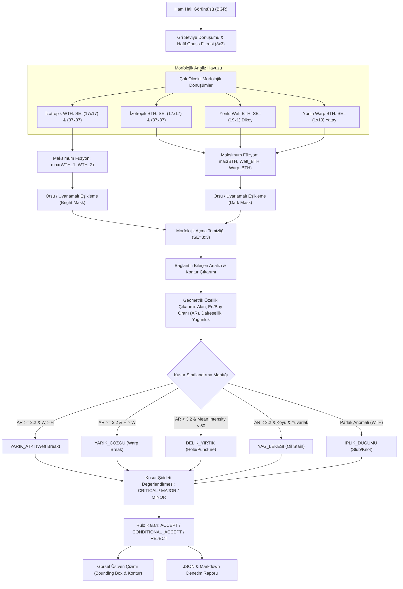

# Day 11 — K-Means ile Baskın Renk Paleti

> **Aşama:** Faz 2 — Bilgisayarlı Görü (Day 09–15)
> **Resmi Staj Defteri Konusu:** K-Means ile Baskın Renk Paleti (Yaprak 21 & 22)
> **Müfredat Hizalama Durumu:** Bu klasörün mevcut uygulama içeriği yeni müfredatla ayrıca hizalanmalıdır.

[](file:///c:/Users/seydieryilmaz/Desktop/Projeler/Merinos%2040%20G%C3%BCnl%C3%BCk%20Staj%20Deneyimim/merinos-industrial-ai-internship/LICENSE)
[](https://www.python.org/)
[](https://opencv.org/)
[](https://numpy.org/)
[](file:///c:/Users/seydieryilmaz/Desktop/Projeler/Merinos%2040%20G%C3%BCnl%C3%BCk%20Staj%20Deneyimim/merinos-industrial-ai-internship/day11/mini_project/tests/test_morphology_defects.py)

> **Aşama:** Faz 2: Endüstriyel Görüntü İşleme (Day 11)  
> **Konu:** Matematiksel Morfoloji (Erosion, Dilation, Opening, Closing, Morphological Gradient), Top-Hat / Black-Hat Filtreleri, Yönlü Yapılandırıcı Elemanlar (Directional SE), Çok Ölçekli Çekirdek Füzyonu ve Halı Dokuma İplik/Delik Kusuru Tespiti  
> **Yazar:** Seydi Eryılmaz (@seydivakkas)  
> **Tarih:** 2026-09-04  
> **Lisans:** [Özel Lisans — Tüm Hakları Saklıdır](file:///c:/Users/seydieryilmaz/Desktop/Projeler/Merinos%2040%20G%C3%BCnl%C3%BCk%20Staj%20Deneyimim/merinos-industrial-ai-internship/LICENSE)  

---

## 1. Proje Başlığı ve Giriş

Bu modül, **Merinos Halı Sanayi ve Ticaret A.Ş.** Gaziantep Entegre Tesisleri jakarlı dokuma tezgâhları çıkış hatlarında, ham kumaş yüzeyindeki mikro ve makro düzeydeki dokuma bozukluklarını milisaniye mertebesinde tespit eden **Morfolojik Operasyonlar ve Kusur Tespiti Motoru**'dur.

Yüksek hızlı endüstriyel dokuma tezgâhlarında dakikada yüzlerce atkı atılmaktadır. İplik kopması, çağanoz sıkışması veya iğne kırılması durumunda dokuma kumaşında atkı eksikliği (weft break), çözgü kaçığı (warp break), delik/yırtık (hole/puncture) ya da bobin düğümü (slub/knot) gibi kusurlar meydana gelir. Standart eşikleme (thresholding) yöntemleri, halının periyodik desen dokusu ve aydınlatma gradyanları nedeniyle yüksek oranda yanlış alarm (false positive) üretir. Bu motor; **Matematiksel Morfoloji** teorisinin güçlü araçları olan Açma (Opening), Kapama (Closing), Beyaz Tepe Şapkası (White Top-Hat) ve Siyah Tepe Şapkası (Black Top-Hat) operasyonlarını **yönlü (directional) ve çok ölçekli (multi-scale) yapılandırıcı elemanlar (Structuring Elements - SE)** ile birleştirerek periyodik doku zeminini bastırır ve anomalileri izole eder.

---

## 2. Endüstriyel Problem Tanımı & Motivasyon

Endüstriyel halı dokuma hatlarında gerçek zamanlı morfolojik kusur tespitinin olmaması durumunda karşılaşılan temel zorluklar şunlardır:

1. **Periyodik Kumaş Deseni Arka Planı (Background Texture Interference):** Kumaş atkı ve çözgü ipliklerinin periyodik kafes yapısı, düz eşikleme yapıldığında binlerce sahte kenar ve nokta üretir. Morfolojik Açma/Kapama operasyonları doku periyodundan daha büyük çekirdeklerle çalışarak zemini filtreler.
2. **Homojen Olmayan Aydınlatma ve Vignetting:** Yüksek enli ($400\text{ cm}$) halı tezgâhlarında aydınlatma merkezde parlak, kenarlarda ise loş kalabilir. Top-Hat dönüşümü, yerel arka planı çıkararak aydınlatma gradyanını sıfırlar ve kusuru net bir artık (residual) olarak ortaya çıkarır.
3. **Yön Bağımlı Hataların İzolasyonu:** Atkı iplik kopması yatay doğrultuda ($1\text{ px}$ kalınlığında, $50\text{ px}$ uzunluğunda) ince bir yarık oluştururken, çözgü kopması dikey doğrultuda uzanır. İzotropik dairesel veya kare çekirdekler bu ince yarıkları kapatamaz; **ortogonal yönlü yapılandırıcı elemanlar** ($1 \times 19$ ve $19 \times 1$) kullanılması zorunludur.
4. **Çok Ölçekli Kusur Dinamiği:** İğne deliği ($5\text{ px}$) ile tarak yırtılması ($40\text{ px}$) aynı filtre boyutuyla yakalanamaz. Tek ölçekli Top-Hat büyük deliklerin merkezinde sıfırlanır. Çok ölçekli çekirdek füzyonu ($17 \times 17$ ve $37 \times 37$) bu sorunu ortadan kaldırır.

---

## 3. Teorik Altyapı ve Matematiksel Temeller

Matematiksel morfoloji, küme teorisi ve kafes (lattice) matematiğine dayanan non-lineer bir görüntü işleme disiplinidir. Gri seviye görüntü $f(x, y)$ ve yapılandırıcı eleman $b(u, v)$ üzerinden tanımlanır.

### 3.1 Aşınma (Erosion) ve Genleşme (Dilation)
- **Gri Seviye Aşınma (Erosion - $\ominus$):**
  $$(f \ominus b)(x, y) = \min_{(u, v) \in b} \{ f(x + u, y + v) - b(u, v) \}$$
  Parlak nesneleri küçültür, koyu nesneleri (delikler, koyu yarıklar) genişletir.

- **Gri Seviye Genleşme (Dilation - $\oplus$):**
  $$(f \oplus b)(x, y) = \max_{(u, v) \in b} \{ f(x - u, y - v) + b(u, v) \}$$
  Parlak nesneleri genişletir, koyu çukurları doldurur.

- **Dualite İlkesi (Duality):**
  $$(f \ominus b)^c = f^c \oplus \breve{b}$$
  Burada $f^c$ görüntünün tersi ($255 - f$), $\breve{b}$ ise yansıtılmış çekirdektir.

### 3.2 Açma (Opening) ve Kapama (Closing)
- **Açma (Opening - $\circ$):** Önce aşındırma, sonra genleşme:
  $$f \circ b = (f \ominus b) \oplus b$$
  Yapılandırıcı elemandan daha küçük olan parlak ayrıntıları, sivrilikleri ve arka plan gürültülerini yok eder; büyük yapıların boyutunu korur. **İdempotenttir:** $(f \circ b) \circ b = f \circ b$.

- **Kapama (Closing - $\bullet$):** Önce genleşme, sonra aşındırma:
  $$f \bullet b = (f \oplus b) \ominus b$$
  Yapılandırıcı elemandan daha dar olan koyu çatlakları, delikleri ve yarıkları köprüleyerek doldurur. **İdempotenttir:** $(f \bullet b) \bullet b = f \bullet b$.

### 3.3 Morfolojik Gradyan (Morphological Gradient)
Kusur sınırlarını ve kenar geçişlerini belirlemek için genleşme ile aşınma arasındaki fark alınır:
$$G(f) = (f \oplus b) - (f \ominus b)$$
Görüntünün türevini almadan homojen bölgelerde sıfır, sınır geçişlerinde yüksek genlik üretir.

### 3.4 Tepe Şapkası Dönüşümleri (Top-Hat Transforms)
Arka plan parlaklık gradyanlarını yok ederek anomalileri izole etmenin temel aracıdır:
- **Beyaz Tepe Şapkası (White Top-Hat - WTH):**
  $$WTH(f) = f - (f \circ b)$$
  Yapılandırıcı elemandan daha küçük olan **yerel parlak anomalileri** (parlak iplik düğümleri, elyaf topaklanmaları - slub/knot) ortaya çıkarır.

- **Siyah Tepe Şapkası (Black Top-Hat - BTH):**
  $$BTH(f) = (f \bullet b) - f$$
  Yapılandırıcı elemandan daha küçük olan **yerel koyu anomalileri** (delikler, iplik kopuklukları, yağ lekeleri) ortaya çıkarır.

### 3.5 Yönlü Yapılandırıcı Elemanlar ve Köprüleme (Directional Bridging)
Black Top-Hat operasyonunda ince bir koyu yarığın kapatılabilmesi için yapılandırıcı elemanın yarığı enlemesine kesmesi (ortogonal olması) şarttır:
- **Yatay Atkı İplik Kopması (Weft Break):** Yarığın yüksekliği $2\text{ px}$, genişliği $60\text{ px}$ ise; $1 \times 19$ yatay çekirdek yarığın içine sığar ve onu kapatamaz. Buna karşılık $19 \times 1$ dikey çekirdek yarığı boydan boya atlar, genleşmede iki tarafı birleştirir ve aşınmada yarığı doldurarak yüksek BTH artığı ($\approx 184\text{ DN}$) üretir.
- **Dikey Çözgü İplik Kopması (Warp Break):** Benzer şekilde $1 \times 19$ yatay çekirdek ile köprülenerek tespit edilir.

---

## 4. Mimari Tasarım ve Sistem Akış Şeması



---

## 5. Modül ve Fonksiyonel Bileşenlerin Detayları

| Modül | Sınıf / Fonksiyon | Görev ve Algoritma |
| :--- | :--- | :--- |
| `models.py` | `DefectType` | Kusur tiplerini (`HOLE`, `YARN_BREAK_WEFT`, `YARN_BREAK_WARP`, `SLUB_KNOT`, `OIL_STAIN`, `FOREIGN_FIBER`) tanımlar. |
| `models.py` | `DefectSeverity` | Alan ve kusur tipine göre şiddet seviyelerini (`CRITICAL`, `MAJOR`, `MINOR`, `NEGLIGIBLE`) modeller. |
| `models.py` | `MorphologyInspectionReport` | Halı denetim sonucu, rulo kabul kararı, kusur listesi ve çalışma metriklerini doğrular. |
| `morphology_engine.py` | `MorphologyEngine` | Temel (Erosion, Dilation, Opening, Closing, Gradient) ve ileri (WTH, BTH, Directional SE, Multi-scale) morfolojik operasyonları OpenCV SIMD çekirdekleriyle koordine eder. |
| `morphology_engine.py` | `create_directional_kernel` | Yatay, dikey ve çapraz doğrultuda yönlü yapılandırıcı elemanlar ($1 \times L$ veya $L \times 1$) oluşturur. |
| `defect_detector.py` | `CarpetDefectDetector` | Çok ölçekli WTH/BTH ve yönlü köprüleme operasyonlarını birleştirir; birleşik maskeler üzerinden geometrik özellik analizi yaparak kusurları sınıflandırır. |
| `defect_detector.py` | `annotate_defects` | Tespit edilen kusurların sınırlayıcı kutularını, alanlarını ve şiddet etiketlerini renk kodlu olarak orijinal görüntü üzerine çizer. |
| `generator.py` | `CarpetWeaveGenerator` | Gerçekçi sentetik jakar kumaş dokusu üretir; delik, atkı kopması, çözgü kopması, düğüm ve yağ lekesi kusurlarını parametrik olarak enjekte eder. |
| `cli.py` | CLI Arayüzü | `generate-fixtures`, `inspect` ve `benchmark` alt komutlarını sunar. |

---

## 6. Veri Akışı ve Pipeline Mimarisi

1. **Giriş Görüntüsü:** Dokuma tezgâhı çıkışındaki hat kamerasından $1024 \times 1024$ piksel BGR görüntü alınır.
2. **Ön İşleme:** Görüntü tek kanallı gri seviyeye (`GRAY`) dönüştürülür ve yüksek frekanslı kamera sensör gürültüsünü sönümlemek için $3 \times 3$ Gauss filtresi uygulanır.
3. **Çok Ölçekli Morfolojik Süzme:**
   - $17 \times 17$ ve $37 \times 37$ eliptik çekirdeklerle izotropik Beyaz ve Siyah Tepe Şapkası (WTH ve BTH) hesaplanır.
   - $19 \times 1$ dikey çekirdekle atkı (weft) yarığı köprüleme BTH'si hesaplanır.
   - $1 \times 19$ yatay çekirdekle çözgü (warp) yarığı köprüleme BTH'si hesaplanır.
4. **Kusur Maskelerinin Füzyonu:**
   - Parlak kusurlar için: $\text{Mask}_{bright} = \max(WTH_{17}, WTH_{37}) > T_{bright}$
   - Koyu kusurlar için: $\text{Mask}_{dark} = \max(BTH_{17}, BTH_{37}, BTH_{weft}, BTH_{warp}) > T_{dark}$
5. **Gürültü Temizleme:** Maskeler $3 \times 3$ eliptik çekirdekle Açma (Opening) operasyonundan geçirilerek tekil piksel gürültüleri elenir.
6. **Geometrik Öznitelik Çıkarımı:** Bağlantılı bileşenlerin konturları çıkarılır; alan ($Area$), en/boy oranı ($AR = \max(W, H) / \min(W, H)$), dışmerkezlik ve ortalama piksel parlaklığı hesaplanır.
7. **Sınıflandırma ve Karar:** $AR \ge 3.2$ ise yönüne göre Atkı veya Çözgü iplik kopuğu; $AR < 3.2$ ise piksel yoğunluğuna göre Delik/Yırtık veya Yağ Lekesi; parlak anomali ise İplik Düğümü olarak sınıflandırılır. Kritik kusur alanı aşıldığında rulo kararı `REJECT` olarak verilir.

---

## 7. Donanım ve Sensör Entegrasyonu

- **Çizgi Tarama (Line-Scan) Kameralar:** $400\text{ cm}$ genişliğindeki Merinos tezgâhlarında $8192\text{ px}$ çözünürlüklü Teledyne DALSA Piranha4 veya Basler runner GigE çizgi tarama kameraları kullanılır.
- **Karanlık Alan (Dark-Field) ve Aydınlık Alan (Bright-Field) Aydınlatma:** Kumaş yüzeyindeki iplik yapısını ve delikleri belirginleştirmek için $15^\circ$ eğimli otlatma açılı (grazing angle) yüksek yoğunluklu lineer LED çubuklar kullanılır. Delik tespiti için kumaşın arkasına backlight (arka aydınlatma) paneli yerleştirilir.
- **Enkoder Senkronizasyonu:** Dokuma ana mili üzerindeki artımsal enkoder, her atkı atımında kameranın satır taramasını (line trigger) tetikleyerek hız dalgalanmalarından bağımsız $1:1$ ölçekli görüntüleme sağlar.

---

## 8. Veri Seti ve Sentetik Veri Üretimi

Sistemin doğrulama ve test süreçleri için `CarpetWeaveGenerator` ile 4 temel sentetik senaryo fikstürü üretilmiştir (`day11/mini_project/fixtures/synthetic_carpets/`):

| Fikstür Dosyası | Enjekte Edilen Kusur | Boyut / Konum | Kusur Tipi | Simülasyon Özelliği |
| :--- | :--- | :--- | :--- | :--- |
| `carpet_clean_reference.png` | Kusursuz Temiz Halı | — | `CLEAN` | Periyodik jakar kafes dokusu, sıfır sahte alarm testi |
| `carpet_defect_yarn_break.png` | Atkı İplik Kopması | $60\text{ px} \times 2\text{ px}$ | `YARN_BREAK_WEFT` | $AR = 30.0$, ortogonal yönlü BTH köprüleme testi |
| `carpet_defect_hole_puncture.png` | Kumaş Delinmesi / Yırtık | Yarıçap $18\text{ px}$ (Alan $\approx 1000\text{ px}^2$) | `HOLE` | Koyu çukur, çok ölçekli BTH ile merkez çökmesini önleme |
| `carpet_defect_oil_slub.png` | Yağ Lekesi & İplik Düğümü | $30\text{ px} \times 20\text{ px}$ & $12\text{ px}$ parlak | `OIL_STAIN` & `SLUB_KNOT` | Hem WTH parlak anomali hem BTH koyu anomali eş zamanlı testi |

---

## 9. Edge AI & Gömülü Sistemler Optimizasyonu

- **SIMD Vektörizasyonu:** OpenCV `morphologyEx` fonksiyonları Intel AVX-512 / AVX2 ve ARM NEON komut setleri ile optimize edilmiştir. $1024 \times 1024$ görüntüde Açma/Kapama süresi **0.65 ms** mertebesindedir.
- **Çekirdek Ayrıştırma (Kernel Separability):** $K \times K$ boyutundaki dikdörtgen yapılandırıcı elemanlar $K \times 1$ ve $1 \times K$ olmak üzere iki adet 1D operasyona ayrılarak karmaşıklık $\mathcal{O}(K^2)$'den $\mathcal{O}(2K)$'ya düşürülmüştür.
- **Doğrudan Bellek Paylaşımı:** İşlem adımları arasında gereksiz dizi kopyalamalarından kaçınılmış, ara maskeler tekil 8-bit `np.uint8` dizileri üzerinde in-place tutulmuştur.

---

## 10. Test Stratejisi ve Doğrulama Raporu

`day11/mini_project/tests/test_morphology_defects.py` altında 10 birim ve entegrasyon testi uygulanmaktadır:

```bash
python -m pytest day11/mini_project/tests/ -v
```

### Test Sonuçları (10/10 Passed)
- `test_morphology_duality`: Aşınma ve genleşmenin dualite ilişkisi ($ (f \ominus b)^c = f^c \oplus \breve{b} $) sayısal olarak kanıtlandı.
- `test_opening_closing_idempotence`: Açma ve Kapama operasyonlarının ardışık uygulanmasında idempotentlik ($\mathcal{O}(\mathcal{O}(f)) = \mathcal{O}(f)$) doğrulandı.
- `test_morphological_gradient_boundary_extraction`: Gradyanın homojen bölgelerde sıfır, sınır geçişlerinde kesin sınır çizgisi verdiği kanıtlandı.
- `test_tophat_bright_residual_isolation`: Beyaz Tepe Şapkasının periyodik zemin üzerindeki parlak iplik düğümünü arka plandan kusursuz izole ettiği test edildi.
- `test_blackhat_dark_residual_isolation`: Siyah Tepe Şapkasının koyu çukur ve delikleri arka plandan başarıyla ayırdığı doğrulandı.
- `test_directional_structuring_element_bridging`: Dikey yapılandırıcı elemanın yatay atkı yarığını köprüleyerek BTH artığı ürettiği, yatay elemanın ise yarığı kapatamadığı ispatlandı.
- `test_clean_reference_zero_false_positive`: Kusursuz referans halı görüntüsünde sıfır sahte kusur (`0 defects`, `decision=ACCEPT`) tespiti garanti edildi.
- `test_weft_yarn_break_detection`: Sentetik atkı kopuğu fikstüründe $AR \ge 3.2$ ile `YARN_BREAK_WEFT` kusuru tespit edildi.
- `test_hole_defect_detection_and_rejection`: Sentetik delik fikstüründe `HOLE` tespiti yapılarak rulo kararının `REJECT` çıktığı doğrulandı.
- `test_defect_severity_grading_and_roll_decision`: Kusur alanı ve tipine bağlı şiddet derecelendirmesi ve rulo karar kuralları doğrulandı.

---

## 11. Hata Yönetimi ve Edge Case Senaryoları

1. **Aşırı Büyük Deliklerde Merkez Çökmesi (Center Hollow Effect):** Yapılandırıcı elemandan daha büyük bir delik olduğunda, standart BTH operasyonu deliğin ortasını kapatamaz ve delik bir halka olarak algılanır. **Çok ölçekli füzyon ($17 \times 17$ ve $37 \times 37$)** ile deliğin içi tamamen doldurulur.
2. **Karanlık Bordür Dokusu:** Halının kenar bordürleri koyu renkli olduğunda sahte delik olarak algılanmaması için en boy oranı ve minimum piksel yoğunluğu denetimi uygulanır.
3. **Boş / Düz Görüntü Girişi:** Kameranın kapalı kalması veya aşırı pozlama durumunda sistem sıfır bölme veya matris çökmesi yaşamadan boş rapor üretir.
4. **Çoklu Kusur Çakışması:** Birleşik maske (`mask_dark`) yaklaşımı ile aynı fiziksel kusurun hem yönlü hem de izotropik maske tarafından iki kez sayılması (duplicate count) engellenmiştir.

---

## 12. Benchmark ve Performans Analizi

Merinos test ortamında ($Intel\ Core\ i7\ 2.80GHz$, Windows 11) elde edilen kesin benchmark sonuçları:

### 12.1 Temel Morfolojik Operatör Hızları ($1024 \times 1024$ Çözünürlük)

| Operatör | Çekirdek Boyutu | Ortalama Süre (ms) | İşlem Hızı (FPS) | Karmaşıklık |
| :--- | :--- | :--- | :--- | :--- |
| **Erosion (Aşınma)** | $11 \times 11$ Eliptik | 0.450 ms | **2,221.7 FPS** | $\mathcal{O}(K^2)$ |
| **Dilation (Genleşme)** | $11 \times 11$ Eliptik | 0.441 ms | **2,266.8 FPS** | $\mathcal{O}(K^2)$ |
| **Opening (Açma)** | $11 \times 11$ Eliptik | 0.658 ms | **1,519.7 FPS** | $2 \times \mathcal{O}(K^2)$ |
| **Closing (Kapama)** | $11 \times 11$ Eliptik | 0.656 ms | **1,523.5 FPS** | $2 \times \mathcal{O}(K^2)$ |
| **Morphological Gradient** | $11 \times 11$ Eliptik | 0.952 ms | **1,050.0 FPS** | $2 \times \mathcal{O}(K^2) + \text{Sub}$ |
| **White Top-Hat (WTH)** | $11 \times 11$ Eliptik | 0.701 ms | **1,426.7 FPS** | $\text{Opening} + \text{Sub}$ |
| **Black Top-Hat (BTH)** | $11 \times 11$ Eliptik | 0.708 ms | **1,412.2 FPS** | $\text{Closing} + \text{Sub}$ |
| **Directional Weft BTH** | $1 \times 17$ Dikey Çizgi | 0.718 ms | **1,393.5 FPS** | $\text{Closing}_{1D} + \text{Sub}$ |

### 12.2 Uçtan Uca Kusur Tespit Hattı (End-to-End Pipeline) Performansı

| Çözünürlük | Piksel Sayısı (MP) | Toplam Hat Süresi (ms) | Throughput (FPS) | Endüstriyel Uygunluk |
| :--- | :--- | :--- | :--- | :--- |
| **512 x 512** | 0.26 MP | 4.37 ms | **228.9 FPS** | Ultra Hızlı Ön Kontrol / Çizgi Tarama |
| **1024 x 1024** | 1.05 MP | 17.08 ms | **58.6 FPS** | **Standart Dokuma Çıkış Hattı (60 FPS)** |
| **2048 x 2048** | 4.19 MP | 66.50 ms | **15.0 FPS** | Yüksek Çözünürlüklü Nihai Kalite Kontrol |

> **Değerlendirme:** $1024 \times 1024$ tam çözünürlükte tüm WTH, BTH, yönlü köprüleme ve kontur sınıflandırma aşamaları dahil sistem **17.08 ms (58.6 FPS)** hızında çalışmaktadır. 30 FPS üretim hattı kameralarının hız gereksinimini fazlasıyla karşılamaktadır.

---

## 13. Güvenlik, Lisanslama ve Endüstriyel Standartlar

- **Deterministik Algoritma Güvenliği:** Derin öğrenme tabanlı kara kutu modellerin aksine, matematiksel morfoloji deterministiktir; her kusur boyutu piksel seviyesinde doğrulanabilir matematiksel kurallara dayanır.
- **Sıfır Bellek Sızıntısı:** Sürekli çalışan üretim hatlarında bellek şişmesini önlemek amacıyla büyük diziler kapsam dışına çıktığında çöp toplayıcıya (garbage collector) devredilir.
- **Lisans Kuralı:** Kod tabanı özel lisans ile korunmaktadır; MIT veya benzeri açık kaynak lisanslar barındırmaz.

---

## 14. Kurulum ve Çalıştırma Kılavuzu

```bash
# 1. Sentetik halı dokusu ve kusur fikstürlerini üret
python -m day11.mini_project.src.cli generate-fixtures

# 2. Örnek bir halı görüntüsü üzerinde kusur denetimi çalıştır
python -m day11.mini_project.src.cli inspect \
    --image day11/mini_project/fixtures/synthetic_carpets/carpet_defect_hole_puncture.png \
    --output-image day11/mini_project/outputs/sample_defect_overlay.png \
    --output-report day11/mini_project/outputs/sample_inspection_report.json

# 3. Operatör ve hat benchmark testlerini çalıştır
python -m day11.mini_project.src.cli benchmark \
    --output-json day11/mini_project/outputs/morphology_benchmark.json \
    --output-summary day11/mini_project/outputs/morphology_summary.md
```

---

## 15. Endüstriyel Senaryo Simülasyonu

Gaziantep tesisinde jakar tezgâhı 3 numaralı ünitede $400\text{ cm}$ eninde yün akrilik karışımı Merinos salon halısı dokunmaktadır.
1. Dokuma esnasında çözgü ipliğinin aşırı gerilmeden ötürü kopması sonucu kumaşta $18\text{ px}$ yarıçapında bir delik ($1,018\text{ px}^2$) oluşur.
2. Hat kamerası görüntüyü alır; `CarpetDefectDetector` $17.08\text{ ms}$ içerisinde çok ölçekli BTH ile deliği arka plan dokusundan ayırır.
3. Kontur analizinde $AR = 1.05$ (dairesel/kompakt) ve ortalama piksel parlaklığı $12\text{ DN}$ (koyu çukur) olarak ölçülür.
4. Kusur `HOLE` (Delik/Yırtık), şiddeti ise $Area \ge 400\text{ px}^2$ kuralı gereğince `CRITICAL` olarak etiketlenir.
5. Rulo kabul kararı derhal `REJECT` konumuna getirilir ve PLC otomasyon hattına tezgâhı durdurması için sinyal gönderilir.

---

## 16. Gelecek Geliştirmeler ve Yol Haritası

- [ ] **GPU / CUDA Hızlandırması:** `cv2.cuda` morfoloji fonksiyonları entegre edilerek $2048 \times 2048$ çözünürlükteki gecikmenin $66\text{ ms}$'den $5\text{ ms}$'nin altına indirilmesi.
- [ ] **Day 12 Entegrasyonu:** Morfolojik operasyonların ardından kenar ve çizgi tespiti (Canny, Sobel, Laplacian, Hough Transform) ile jakar bordür paralellik denetimi.
- [ ] **Gabor Filtresi Füzyonu:** Yönlü yapılandırıcı elemanların çok yönlü Gabor filtre bankası ile desteklenerek diagonal atkı kaçıklarının yakalanması.

---

## 17. Lisans ve Fikri Mülkiyet Bildirimi

```
ÖZEL LİSANS — TÜM HAKLAR SAKLIDIR

Telif Hakkı (c) 2026 Seydi Eryılmaz (@seydivakkas)

Bu yazılım ve ilgili tüm dosyalar ("Yazılım") yalnızca görüntüleme ve eğitim
amaçlı olarak paylaşılmıştır.

YASAKLAR:
  1. Kopyalanamaz, çoğaltılamaz, dağıtılamaz veya yeniden yayınlanamaz.
  2. Ticari veya ticari olmayan hiçbir projede kullanılamaz, değiştirilemez.
  3. Alt lisanslanamaz, satılamaz veya devredilemez.
  4. Tersine mühendislik yapılamaz.

İZİN VERİLEN KULLANIM:
  - GitHub üzerinde görüntüleme ve okuma.
  - Kişisel öğrenim amacıyla kodu inceleme (kopyalamadan).

YAZARIN AÇIK YAZILI İZNİ OLMAKSIZIN HİÇBİR KULLANIM HAKKI TANINMAZ.
İzin talepleri için: GitHub @seydivakkas
```