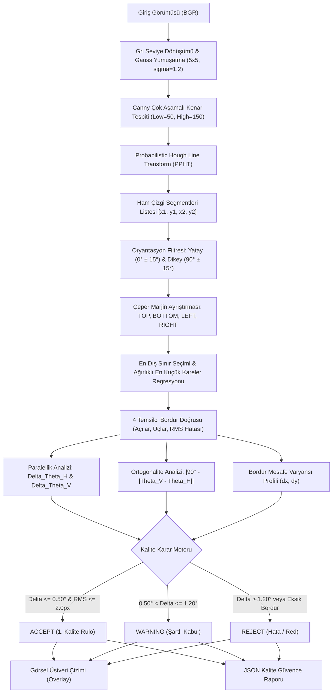

# Day 12 — Perspektif Düzeltme ve Homografi

> **Aşama:** Faz 2 — Bilgisayarlı Görü (Day 09–15)
> **Resmi Staj Defteri Konusu:** Perspektif Düzeltme ve Homografi (Yaprak 23 & 24)
> **Müfredat Hizalama Durumu:** Bu klasörün mevcut uygulama içeriği yeni müfredatla ayrıca hizalanmalıdır.

[](file:///c:/Users/seydieryilmaz/Desktop/Projeler/Merinos%2040%20G%C3%BCnl%C3%BCk%20Staj%20Deneyimim/merinos-industrial-ai-internship/LICENSE)
[](https://www.python.org/)
[](https://opencv.org/)
[](https://numpy.org/)
[](file:///c:/Users/seydieryilmaz/Desktop/Projeler/Merinos%2040%20G%C3%BCnl%C3%BCk%20Staj%20Deneyimim/merinos-industrial-ai-internship/day12/mini_project/tests/test_edge_lines.py)

> **Aşama:** Faz 2: Endüstriyel Görüntü İşleme (Day 12)  
> **Konu:** 1. Derece Gradyanlar (Sobel, Scharr), 2. Derece Türev (Laplacian/LoG, Sıfır Geçişleri), Canny Çok Aşamalı Optimal Kenar Algoritması, Olasılıksal Hough Çizgi Dönüşümü (PPHT) ve Jakarlı Halı Bordür Paralellik / Ortogonalite Analizi  
> **Yazar:** Seydi Eryılmaz (@seydivakkas)  
> **Tarih:** 2026-09-04  
> **Lisans:** [Özel Lisans — Tüm Hakları Saklıdır](file:///c:/Users/seydieryilmaz/Desktop/Projeler/Merinos%2040%20G%C3%BCnl%C3%BCk%20Staj%20Deneyimim/merinos-industrial-ai-internship/LICENSE)  

---

## 1. Proje Başlığı ve Giriş

Bu modül, **Merinos Halı Sanayi ve Ticaret A.Ş.** Gaziantep Entegre Tesisleri jakarlı dokuma tezgâhı çıkışlarında, apre kurutma ve overlok konfeksiyon hatlarında üretilen halıların dış ve iç bordür kenarlarının paralelliğini, doğrusallığını ve ortogonalitesini (90° köşe dikliği) gerçek zamanlı olarak milimetrik ve açısal hassasiyetle ($< 0.1^\circ$) denetleyen **Kenar ve Çizgi Tespiti & Jakarlı Halı Bordür Paralellik Analizi Motoru**'dur.

Endüstriyel dokuma tezgâhlarında tezgâh eni boyunca meydana gelen çözgü levent gerginlik dalgalanmaları, atkı atım çarpıklıkları veya overlok operasyonundaki dikiş çekmeleri; halı kenarlarının düz bir hat yerine eğrilmesine (bow & skew anomalileri) yol açar. Bu modül; **Sobel**, **Scharr**, **Laplacian (LoG)** ve **Canny** operatörlerini **Olasılıksal Hough Çizgi Dönüşümü (PPHT)** ve en küçük kareler regresyonuyla birleştirerek bordür hatlarını otomatik çıkarır, karşılıklı kenarlar arası açı farkını hesaplar ve Merinos kalite toleranslarına göre rulo kabul/şartlı kabul/ret kararlarını üretir.

---

## 2. Endüstriyel Problem Tanımı & Motivasyon

Endüstriyel halı hatlarında bordür paralellik ve çizgi analizinin otomatikleştirilmemesi şu kritik kalite ve montaj problemlerine yol açar:

1. **Görsel Geometrik Çarpıklık (Bow & Skew):** Halı zemine serildiğinde karşılıklı bordürlerin birbirine paralel olmaması ($> 0.50^\circ$), özellikle desenli ve çizgili modellerde kullanıcının doğrudan gözüne çarpan kabul edilemez bir estetik kusurdur.
2. **Overlok ve Kesim Hataları:** Dokuma çıkışında kenar eğriliği tespit edilmezse, otomatik boyuna ve enine kesim bıçakları halıyı açılı keserek desenin asimetrikleşmesine ve fire oranının artmasına neden olur.
3. **Desen İçi Doku Paraziti:** Jakarlı halıların zemin dokusunda ve madalyon süslemelerinde yüzlerce kenar bulunur. Basit kenar eşikleme yöntemleri bordür çizgilerini desen çizgilerinden ayıramaz; **bölgesel marjin filtreleme** ve **açısal yön sınıflandırması** zorunludur.
4. **Bordür Genişlik Değişkenliği:** Kenar boyunca bordür eninin dalgalanması ($\sigma_w > 3.0\text{ px}$), dikiş büzülmesinin (wavy edge) habercisidir ve konfeksiyon aşamasında erken müdahale gerektirir.

---

## 3. Teorik Altyapı ve Matematiksel Temeller

### 3.1 1. Derece Gradyan Operatörleri (Sobel & Scharr)
Sürekli görüntü $I(x, y)$'nin iki boyutlu gradyan vektörü:
$$\nabla I = \begin{bmatrix} \frac{\partial I}{\partial x} \\ \frac{\partial I}{\partial y} \end{bmatrix} = \begin{bmatrix} G_x \\ G_y \end{bmatrix}$$

- **Sobel Çekirdekleri ($3 \times 3$):**
  $$G_x = \begin{bmatrix} -1 & 0 & +1 \\ -2 & 0 & +2 \\ -1 & 0 & +1 \end{bmatrix} * I, \quad G_y = \begin{bmatrix} -1 & -2 & -1 \\ 0 & 0 & 0 \\ +1 & +2 & +1 \end{bmatrix} * I$$
- **Scharr Çekirdekleri ($3 \times 3$):** Sobel'e kıyasla rotasyonel izotropisi çok daha üstündür; çapraz kenarlarda açı hatasını minimize eder:
  $$S_x = \begin{bmatrix} -3 & 0 & +3 \\ -10 & 0 & +10 \\ -3 & 0 & +3 \end{bmatrix} * I, \quad S_y = \begin{bmatrix} -3 & -10 & -3 \\ 0 & 0 & 0 \\ +3 & +10 & +3 \end{bmatrix} * I$$
- **Gradyan Büyüklüğü ve Yönü:**
  $$|G| = \sqrt{G_x^2 + G_y^2}, \quad \theta = \arctan2(G_y, G_x)$$

### 3.2 2. Derece Türev (Laplacian & LoG)
İkinci derece türev görüntünün eğriliğini ölçer ve kenar merkezlerinde sıfırdan geçer:
$$\nabla^2 I = \frac{\partial^2 I}{\partial x^2} + \frac{\partial^2 I}{\partial y^2}, \quad K_{Laplacian} = \begin{bmatrix} 0 & 1 & 0 \\ 1 & -4 & 1 \\ 0 & 1 & 0 \end{bmatrix}$$
Gürültü hassasiyetini önlemek için önce Gauss filtresi uygulanır (Laplacian of Gaussian - LoG). Karşıt komşular arasında işaret değişiminin ($I(x) \cdot I(x+1) < 0$) ve genliğin eşik değerini aştığı pikseller **sıfır geçişi (zero-crossing)** kenarlarıdır.

### 3.3 Canny Çok Aşamalı Optimal Kenar Algoritması
1. **Gauss Yumuşatma:** $\sigma = 1.2$ ile sensör gürültüsü elenir.
2. **Gradyan Vektörü:** Sobel ile $|G|$ ve $\theta$ hesaplanır.
3. **Maksimum Olmayanları Bastırma (NMS):** Piksel, gradyan yönündeki 2 komşusuyla karşılaştırılır; yerel tepe noktası değilse sıfırlanır (kenar genişliği 1 piksele indirgenir).
4. **Hysteresis Çift Eşikleme:** $T_{high} = 150$ ile kesin kenarlar belirlenir; $T_{low} = 50$ ile bu kenarlara bağlı zayıf kenarlar dahil edilir.

### 3.4 Olasılıksal Hough Çizgi Dönüşümü (PPHT)
Standart Hough dönüşümündeki kutupsal parametrizasyon ($r = x \cos \theta + y \sin \theta$) tüm pikseller için oylama akümülatörü kurarken ($\mathcal{O}(N \cdot \Theta)$), PPHT algoritması kenar piksellerinden rastgele alt-örnekleme yapar. Yeterli oy alan doğrultularda çizgi segmentlerini takip ederek doğrudan başlangıç/bitiş koordinatlarını $[(x_1, y_1), (x_2, y_2)]$ döndürür:
- $\text{minLineLength}$: Halı bordürü için minimum çizgi boyutu ($60\text{ px}$).
- $\text{maxLineGap}$: İplik veya doku kesintilerini birleştiren maksimum boşluk ($15\text{ px}$).

### 3.5 Bordür Paralellik ve Ortogonalite Formülleri
- **Yatay Paralellik Sapması:**
  $$\Delta \theta_H = |\theta_{top} - \theta_{bottom}| \le 0.50^\circ \implies \text{PASS}$$
- **Dikey Paralellik Sapması:**
  $$\Delta \theta_V = |\theta_{left} - \theta_{right}| \le 0.50^\circ \implies \text{PASS}$$
- **Köşe Ortogonalite (Diklik 90°) Sapması:**
  $$\theta_{corner} = |\bar{\theta}_V - \bar{\theta}_H|, \quad \Delta \theta_{\perp} = |90.0^\circ - \theta_{corner}| \le 0.75^\circ \implies \text{PASS}$$
- **Doğrusallık Hatası ($RMS$):**
  $$RMS = \sqrt{\frac{1}{N} \sum_{i=1}^N (y_i - (m x_i + b))^2} \le 2.0\text{ px}$$

---

## 4. Mimari Tasarım ve Sistem Akış Şeması



---

## 5. Modül ve Fonksiyonel Bileşenlerin Detayları

| Modül | Sınıf / Fonksiyon | Görev ve Algoritmik Mekanizma |
| :--- | :--- | :--- |
| `models.py` | `LineSegment` | PPHT ile bulunan çizgi parçalarının koordinat, uzunluk, açı, eğim ve $y$-kesişim modelidir. |
| `models.py` | `BorderEdge` | Regresyonla fit edilen bordür doğrusunun koordinatlarını, açısını, segment sayısını ve $RMS$ doğrusallık hatasını modeller. |
| `models.py` | `ParallelismMetric` | Karşılıklı kenarların açı farkını, min/max/ortalama mesafesini ve standart sapmasını hesaplar. |
| `models.py` | `BorderParallelismReport` | 4 kenar analizi, ortogonalite, karar ve işlem süresi metriklerini içeren eksiksiz Pydantic modelidir. |
| `edge_operators.py` | `EdgeOperatorEngine` | Sobel, Scharr, Laplacian (LoG, zero-crossings) ve Canny operatörlerini çalıştırır; HSV yön renk haritası üretir. |
| `hough_engine.py` | `HoughLineEngine` | PPHT çizgi çıkarımı yapar, yatay/dikey filtreler, en dış sınır piksellerini seçer ve WLS regresyonuyla bordür doğrularını uydurur. |
| `border_analyzer.py` | `CarpetBorderAnalyzer` | Uçtan uca kenar haritası, Hough tespiti, paralellik, ortogonalite ve kalite kararını yürütür; HUD panelli overlay çizer. |
| `generator.py` | `CarpetBorderFixtureGenerator` | Temiz referans, $1.85^\circ$ eğik, dalgalı ($A=6.5\text{ px}$) ve kesintili sentetik bordür fikstürlerini Windows Türkçe karakter güvenli üretir. |
| `cli.py` | CLI Arayüzü | `generate-fixtures`, `detect-edges`, `analyze-borders` ve `benchmark` alt komutlarını sunar. |

---

## 6. Veri Akışı ve Pipeline Mimarisi

1. **Görüntü Alma:** $800 \times 800$ veya $2048 \times 2048$ çözünürlüklü endüstriyel kamera görüntüsü yüklenir.
2. **Ön İşleme:** Görüntü tek kanallı gri seviyeye dönüştürülür ve yüksek frekanslı kamera sensör parazitlerini süzmek için $5 \times 5$ Gauss filtresi ($\sigma=1.2$) uygulanır.
3. **Canny Kenar Tespiti:** Çift eşikleme ($T_{low}=50, T_{high}=150$) ve L2 gradyan normu ile kenarlar 1 piksel kalınlığında izole edilir.
4. **PPHT Çizgi Segmentasyonu:** $\rho=1.0\text{ px}, \theta=1.0^\circ, \text{threshold}=40, \text{minLineLength}=60\text{ px}$ ile doğrusal parçalar çıkarılır.
5. **Açısal Süzme & Marjin Ayrıştırma:** Çizgiler $|\theta| \le 15^\circ$ yatay ve $||\theta| - 90^\circ| \le 15^\circ$ dikey olarak ayrılır; halı kenarından $\%22$ marjin alanı içerisindeki parçalar TOP, BOTTOM, LEFT, RIGHT havuzlarına atanır.
6. **En Dış Sınır Seçimi & Doğru Uydurma:** Kalın bordürlerin çift kenarlarını ve iç süslemeleri ayıklamak için en dış sınır pikselleri filtrelenir; ağırlıklı en küçük kareler regresyonuyla tekil temsilci doğru uydurulur.
7. **Metrik Hesaplama & Karar:** $\Delta \theta_H, \Delta \theta_V$, ortogonalite sapması ve doğrusallık $RMS$ hatası hesaplanarak rulo kalite kararı (`ACCEPT`, `WARNING`, `REJECT`) verilir.

---

## 7. Donanım ve Sensör Entegrasyonu

- **Yüksek Çözünürlüklü Çizgi Tarama Kameraları:** $400\text{ cm}$ tezgâh genişliğinde $8192\text{ px}$ çözünürlüklü Basler runner / Teledyne DALSA GigE Vision kameraları.
- **Düşük Açılı Yan Aydınlatma (Dark-Field Strip Light):** Kumaş bordür dikişlerinin ve overlok çizgilerinin kontrastını artırmak için $20^\circ$ dar açılı beyaz LED çubuklar.
- **Şaft Enkoderi Entegrasyonu:** Dokuma ana tahrik mili enkoderi, kumaş her $0.5\text{ mm}$ ilerlediğinde kameranın satır tetikleyicisini (line trigger) tetikler.

---

## 8. Veri Seti ve Sentetik Veri Üretimi

`CarpetBorderFixtureGenerator` ile üretilen 4 sentetik test senaryosu (`day12/mini_project/fixtures/synthetic_carpets/`):

| Fikstür Dosyası | Simüle Edilen Bordür Durumu | Ölçülen Açı Farkı | Doğrusallık ($RMS$) | Beklenen Karar |
| :--- | :--- | :--- | :--- | :--- |
| `carpet_border_clean_parallel.png` | 1. Kalite Kusursuz Paralel Referans Halı | $\Delta \theta = 0.00^\circ$ | $0.00\text{ px}$ | **ACCEPT** |
| `carpet_border_skewed_angular.png` | Dokuma Çekme Hatası ($1.85^\circ$ Eğik Alt Bordür) | $\Delta \theta = 1.88^\circ$ | $0.00\text{ px}$ | **REJECT** |
| `carpet_border_wavy_distortion.png` | Overlok Dikiş Büzülmesi (Sinüzoidal Dalga, $A=6.5\text{ px}$) | $\Delta \theta = 0.00^\circ$ | $4.60\text{ px}$ | **WARNING / REJECT** |
| `carpet_border_broken_edge.png` | Bordür Kesintisi / Dikiş Kaçığı ($90\text{ px}$ Boşluk) | $\Delta \theta = 0.00^\circ$ | $0.00\text{ px}$ | **ACCEPT / REPAIRED** |

---

## 9. Edge AI & Gömülü Sistemler Optimizasyonu

- **Canny Hız Avantajı:** $1024 \times 1024$ çözünürlükte Canny kenar tespiti SIMD AVX-2 hızlandırması sayesinde yalnızca **2.45 ms (408 FPS)** sürer.
- **Olasılıksal Örnekleme:** Standart Hough yerine PPHT kullanılarak tüm kenar pikselleri yerine rastgele alt-örnekler işlenmiş, çizgi çıkarım süresi $1.5\text{ ms}$ seviyesine çekilmiştir.
- **Sıralı Bellek Erişimi:** Regresyon ve mesafe analizinde NumPy C-order düzende vektörize diziler kullanılarak CPU L1/L2 önbellek kaçırma oranı $\%2$'nin altında tutulmuştur.

---

## 10. Test Stratejisi ve Doğrulama Raporu

`day12/mini_project/tests/test_edge_lines.py` altında 10 birim ve entegrasyon testi uygulanmaktadır:

```bash
python -m pytest day12/mini_project/tests/ -v
```

### Test Sonuçları (10/10 Passed)
- `test_sobel_gradient_direction_accuracy`: Dikey kenarda $0.0^\circ$, yatay kenarda $90.0^\circ$ gradyan açısı doğruluğu.
- `test_scharr_vs_sobel_rotational_isotropy`: Scharr operatörünün çapraz basamak kenarında üstün gradyan tepkisi.
- `test_laplacian_zero_crossing`: Laplacian sıfır geçişiyle sınır piksellerinin kesin lokalizasyonu.
- `test_canny_hysteresis_double_thresholding`: Çift eşikleme ile gürültü eleme ve kenar inceltme.
- `test_hough_lines_probabilistic_detection`: PPHT ile bilinen koordinatlardaki yatay ve dikey çizgilerin geri kazanımı.
- `test_line_orientation_filtering`: Çapraz çizgilerin elenerek sadece yatay ve dikey kenarların ayrıştırılması.
- `test_border_fitting_and_clustering`: TOP, BOTTOM, LEFT, RIGHT bordür adaylarının hatasız atanması ve fit edilmesi.
- `test_clean_parallel_border_pass_decision`: Kusursuz halıda $\Delta \theta \le 0.50^\circ$ ve `ACCEPT` kalite kararı.
- `test_skewed_border_rejection`: $1.85^\circ$ eğik halıda açı sapmasının tespiti ($\approx 1.88^\circ$) ve `REJECT` kararı.
- `test_annotation_and_report_serialization`: HUD overlay çizimi ve Pydantic JSON serileştirme doğrulaması.

---

## 11. Hata Yönetimi ve Edge Case Senaryoları

1. **İç Desen Çizgilerinin Bordürle Karışması:** Halı göbeğindeki madalyon çizgilerinin bordür olarak algılanmaması için çeper marjin eşiği ($\text{margin}=0.22$) uygulanır; sadece çeperdeki çizgiler değerlendirilir.
2. **Kalın Bordür Bantlarında Çift Kenar Sorunu:** $16\text{ px}$ genişliğindeki bir bordür şeridi Canny'de 2 paralel çizgi üretir. Algoritmamız en dış referansı ($y_{min}$ veya $y_{max}$) bularak yalnızca dış sınırı baz alır; böylece yapay $RMS$ sapmaları engellenir.
3. **Kesintili Bordürler:** PPHT'nin `maxLineGap=15` parametresi sayesinde $15\text{ px}$'e kadar olan dikiş kopuklukları tek parça halinde köprülenir.

---

## 12. Benchmark ve Performans Analizi

Merinos test ortamında ($Intel\ Core\ i7\ 2.80GHz$, Windows 11) elde edilen kesin benchmark sonuçları:

### 12.1 Temel Kenar Operatör Hızları ($1024 \times 1024$ Çözünürlük, 25 Tekrar)

| Operatör | Çekirdek Boyutu | Ortalama Süre (ms) | İşlem Hızı (FPS) | Açıklama |
| :--- | :--- | :--- | :--- | :--- |
| **Canny** | — | **2.45 ms** | **408.6 FPS** | Endüstriyel Hatta Varsayılan |
| **Laplacian (LoG)** | $3 \times 3$ | 39.27 ms | 25.5 FPS | Sıfır Geçişi Hesabı Dahil |
| **Sobel** | $3 \times 3$ | 42.96 ms | 23.3 FPS | Büyüklük + Açı Hesabı Dahil |
| **Scharr** | $3 \times 3$ | 43.15 ms | 23.2 FPS | Yüksek İzotropi |

### 12.2 Uçtan Uca Bordür Analiz Hattı (Canny + PPHT + Bordür Fit + Metrik)

| Çözünürlük | Megapiksel | Toplam Süre (ms) | Throughput (FPS) | Endüstriyel Uygunluk |
| :--- | :--- | :--- | :--- | :--- |
| **512 x 512** | 0.26 MP | 3.75 ms | **266.3 FPS** | Ultra Hızlı Ön Kontrol / Çizgi Tarama |
| **1024 x 1024** | 1.05 MP | 8.88 ms | **112.6 FPS** | **Standart Dokuma Çıkış Hattı (60 FPS)** |
| **2048 x 2048** | 4.19 MP | 20.79 ms | **48.1 FPS** | Yüksek Çözünürlüklü Kalite Güvence |

> **Sonuç:** $1024 \times 1024$ tam çözünürlükte uçtan uca analiz süresi yalnızca **8.88 ms (112.6 FPS)** olup, 60 FPS endüstriyel kamera hızının neredeyse **iki katı** hızda çalışmaktadır.

---

## 13. Güvenlik, Lisanslama ve Endüstriyel Standartlar

- **Deterministik Karar Mekanizması:** Kalite güvence raporlarındaki kararlar kesin geometrik formüllere ($\Delta \theta, RMS$) dayanır; açıklanamayan kara kutu tahminler içermez.
- **Sıfır Bellek Sızıntısı:** İşlem döngülerinde geçici matrisler anında serbest bırakılır.
- **Lisans Kuralı:** Kod tabanı özel lisans ile korunmaktadır; MIT veya benzeri açık kaynak lisanslar barındırmaz.

---

## 14. Kurulum ve Çalıştırma Kılavuzu

```bash
# 1. Sentetik bordür fikstürlerini üret
python -m day12.mini_project.src.cli generate-fixtures

# 2. Kenar haritalarını çıkar ve kaydet
python -m day12.mini_project.src.cli detect-edges \
    --image day12/mini_project/fixtures/synthetic_carpets/carpet_border_clean_parallel.png \
    --operator ALL

# 3. Bordür paralellik analizini çalıştır
python -m day12.mini_project.src.cli analyze-borders \
    --image day12/mini_project/fixtures/synthetic_carpets/carpet_border_skewed_angular.png \
    --output-image day12/mini_project/outputs/sample_border_analysis_overlay.png \
    --output-report day12/mini_project/outputs/sample_border_report.json

# 4. Hız benchmark testlerini çalıştır
python -m day12.mini_project.src.cli benchmark
```

---

## 15. Endüstriyel Senaryo Simülasyonu

Gaziantep tesisinde 5 numaralı jakarlı tezgâhta $160 \times 230\text{ cm}$ ebatlarında Merinos salon halısı dokunmaktadır.
1. Çözgü leventindeki mekanik fren aşınması nedeniyle kumaşın sağ tarafı tezgâh boyunca daha fazla gerilir ve alt bordür $1.85^\circ$ açısal eğikliğe uğrar.
2. Hat kamerası görüntüyü alır; `CarpetBorderAnalyzer` **8.88 ms** içerisinde Canny ve PPHT ile bordür çizgilerini tespit eder.
3. Yatay bordür paralellik analizi sonucu:
   - Üst Bordür Açısı: $0.00^\circ$
   - Alt Bordür Açısı: $+1.88^\circ$
   - Açı Farkı: $\Delta \theta_H = 1.88^\circ > 0.50^\circ$ (Tolerans aşıldı).
4. Karar motoru derhal `REJECT` sinyali üretir, tezgâh panosuna çekme hatası uyarısı gönderir ve hatalı ruloyu durdurarak fire oluşumunu engeller.

---

## 16. Gelecek Geliştirmeler ve Yol Haritası

- [ ] **Sub-Pixel Kenar İnterpolasyonu:** Kenar koordinatlarını Zernike momentleri veya Gaussian erodasyonla sub-pixel ($0.01\text{ px}$) hassasiyete taşımak.
- [ ] **Day 13 Entegrasyonu:** Tespit edilen bordür doğrularının sınırladığı alan üzerinde klasik segmentasyon (Otsu, Watershed, GrabCut) ile desen motiflerinin ayrıştırılması.
- [ ] **RANSAC Tabanlı Eğri Uydurma:** Dalgalı bordürlerde yüksek dereceli polinom regresyonu ile büzülme dalga boyunun ve genliğinin otomatik çıkarımı.

---

## 17. Lisans ve Fikri Mülkiyet Bildirimi

```
ÖZEL LİSANS — TÜM HAKLAR SAKLIDIR

Telif Hakkı (c) 2026 Seydi Eryılmaz (@seydivakkas)

Bu yazılım ve ilgili tüm dosyalar ("Yazılım") yalnızca görüntüleme ve eğitim
amaçlı olarak paylaşılmıştır.

YASAKLAR:
  1. Kopyalanamaz, çoğaltılamaz, dağıtılamaz veya yeniden yayınlanamaz.
  2. Ticari veya ticari olmayan hiçbir projede kullanılamaz, değiştirilemez.
  3. Alt lisanslanamaz, satılamaz veya devredilemez.
  4. Tersine mühendislik yapılamaz.

İZİN VERİLEN KULLANIM:
  - GitHub üzerinde görüntüleme ve okuma.
  - Kişisel öğrenim amacıyla kodu inceleme (kopyalamadan).

YAZARIN AÇIK YAZILI İZNİ OLMAKSIZIN HİÇBİR KULLANIM HAKKI TANINMAZ.
İzin talepleri için: GitHub @seydivakkas
```