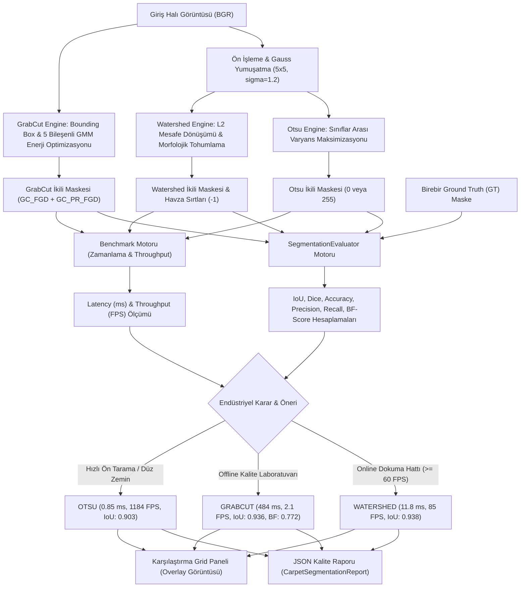

# Day 13 — Morfolojik İşlemler, Kenar ve Çizgi Tespiti

> **Aşama:** Faz 2 — Bilgisayarlı Görü (Day 09–15)
> **Resmi Staj Defteri Konusu:** Morfolojik İşlemler, Kenar ve Çizgi Tespiti (Yaprak 25 & 26)
> **Müfredat Hizalama Durumu:** Bu klasörün mevcut uygulama içeriği yeni müfredatla ayrıca hizalanmalıdır.

[](file:///c:/Users/seydieryilmaz/Desktop/Projeler/Merinos%2040%20G%C3%BCnl%C3%BCk%20Staj%20Deneyimim/merinos-industrial-ai-internship/LICENSE)
[](https://www.python.org/)
[](https://opencv.org/)
[](https://numpy.org/)
[](file:///c:/Users/seydieryilmaz/Desktop/Projeler/Merinos%2040%20G%C3%BCnl%C3%BCk%20Staj%20Deneyimim/merinos-industrial-ai-internship/day13/mini_project/tests/test_segmentation.py)

> **Aşama:** Faz 2: Endüstriyel Görüntü İşleme (Day 13)  
> **Konu:** Otsu Global & Çok Seviyeli Eşikleme (Multi-Otsu), İşaretçi Kontrollü Watershed (Havza), GrabCut GMM Tabanlı Grafik Kesme (Min-Cut/Max-Flow) ve Jakarlı Halı Motif/Zemin Ayrıştırma Kıyaslama Laboratuvarı  
> **Yazar:** Seydi Eryılmaz (@seydivakkas)  
> **Tarih:** 2026-09-04  
> **Lisans:** [Özel Lisans — Tüm Hakları Saklıdır](file:///c:/Users/seydieryilmaz/Desktop/Projeler/Merinos%2040%20G%C3%BCnl%C3%BCk%20Staj%20Deneyimim/merinos-industrial-ai-internship/LICENSE)  

---

## 1. Proje Başlığı ve Giriş

Bu modül, **Merinos Halı Sanayi ve Ticaret A.Ş.** Gaziantep Entegre Tesisleri jakarlı dokuma tezgâhı çıkışlarında, apre kurutma ve kalite denetim laboratuvarlarında üretilen halıların desen motiflerinin (madalyon, bordür süslemeleri, köşe spandrelleri ve geometrik figürler) zemin kumaşından (ground/field fabric) piksel seviyesinde yüksek doğruluk ve hızla ayrıştırılması amacıyla geliştirilmiş **Klasik Segmentasyon Kıyaslama ve Doğrulama Motoru**'dur.

Endüstriyel dokuma halılarda atkı ve çözgü ipliklerinin oluşturduğu mikro-doku gürültüsü, renk geçişleri ve karmaşık jakar desenleri klasik bilgisayarlı görü segmentasyon algoritmaları için çetin bir sınav oluşturur. Bu modül; **Otsu Global & Çok Seviyeli Eşikleme**, **Mesafe Dönüşümü Tohumlamalı Watershed** ve **GMM Enerji Minimizasyonlu GrabCut** yöntemlerini endüstriyel bir kıyaslama laboratuvarında bir araya getirerek işlem gecikmesi ($ms$), saniye başına kare ($FPS$) ve piksel örtüşüm doğruluğu ($IoU, Dice, BF-Score$) parametrelerini objektif olarak raporlar.

---

## 2. Endüstriyel Problem Tanımı & Motivasyon

Halı üretiminde jakar deseni ve zemin kumaşının otomatik olarak ayrıştırılamaması şu kritik üretim ve kalite maliyetlerine yol açar:

1. **İplik Sarfiyatı ve Reçete Maliyeti Hesabı:** Dokuma öncesinde jakar deseninin halı yüzeyindeki kaplama alanı oranı (motif coverage %) kesin olarak bilinmelidir. Ayrıştırmadaki $\%5$ hata, yüz binlerce metrekarelik parti üretiminde tonlarca akrilik, polipropilen veya viskon iplik sapmasına neden olur.
2. **Motif Sınır Keskinliği ve Baskı Taşması Denetimi:** Apre, traşlama veya dijital baskı işlemlerinde desen sınırlarının netliği kontrol edilmelidir. Çözgü gerginlik dalgalanmaları nedeniyle sınırların saçaklanması veya kayması müşteri gözünde 2. kalite ürün demektir.
3. **Gerçek Zamanlı Hız vs Doğruluk İkilemi:** Dokuma tezgâhı $150\text{ m/dk}$ hızla akarken saniyede en az $60-85\text{ FPS}$ hızında çalışan hafif bir segmentasyon mekanizması zorunludur. Kalite güvence laboratuvarında ise mikroskobik sınır hassasiyeti ($IoU \ge 0.92$) önceliklidir. Bu iki farklı kullanım senaryosunu karşılayacak algoritmik ayrım gereklidir.

---

## 3. Teorik Altyapı ve Matematiksel Temeller

### 3.1 Otsu Global Eşikleme ve Varyans Maksimizasyonu
Nobuyuki Otsu (1979) yöntemi, gri seviye histogramı $L$ seviyede inceler ve pikselleri iki sınıfa ($C_0: [0, t]$ ve $C_1: [t+1, L-1]$) ayıran optimal eşik $t^*$'ı bulur. Amaç, sınıflar arası varyansı $\sigma_b^2(t)$ maksimize etmektir:

$$\sigma_b^2(t) = \omega_0(t) (\mu_0(t) - \mu_T)^2 + \omega_1(t) (\mu_1(t) - \mu_T)^2 = \omega_0(t) \omega_1(t) (\mu_0(t) - \mu_1(t))^2$$

Burada:
- $\omega_0(t) = \sum_{i=0}^t p_i$, $\omega_1(t) = \sum_{i=t+1}^{L-1} p_i$ sınıf ağırlıklarıdır.
- $\mu_0(t) = \frac{\sum_{i=0}^t i p_i}{\omega_0(t)}$, $\mu_1(t) = \frac{\sum_{i=t+1}^{L-1} i p_i}{\omega_1(t)}$ sınıf ortalamalarıdır.
- $\mu_T = \sum_{i=0}^{L-1} i p_i$ tüm görüntünün ortalama yoğunluğudur.

**Multi-Otsu (Çok Seviyeli):** Zemin kumaşı, bordür ve madalyon olmak üzere 3 sınıf ($K=3$) için iki eşik ($t_1^*, t_2^*$) varyans kriterini maksimize edecek şekilde belirlenir:
$$\sigma_b^2(t_1, t_2) = \omega_0 (\mu_0 - \mu_T)^2 + \omega_1 (\mu_1 - \mu_T)^2 + \omega_2 (\mu_2 - \mu_T)^2$$

### 3.2 Marker-Controlled Watershed (İşaretçi Kontrollü Havza)
Görüntüyü topografik bir yüzey olarak kabul eden havza algoritmasında aşırı bölütlenmeyi (over-segmentation) önlemek için morfolojik tohumlama uygulanır:
1. **Öklid Mesafe Dönüşümü ($L_2$ Normu):** İkili ön maske üzerinde her ön plan pikselinin en yakın arka plan pikseline mesafesi hesaplanır:
   $$D(p) = \min_{q \in \text{ArkaPlan}} \|p - q\|_2$$
2. **Kesin Ön Plan Tohumu (Sure Foreground):**
   $$\text{Sure FG} = \{p \mid D(p) \ge \alpha \cdot \max(D)\}, \quad \alpha = 0.45$$
3. **Kesin Arka Plan (Sure Background):** Morfolojik genleşme ile $\text{Sure BG} = \text{Dilate}(\text{Binary})$.
4. **Belirsiz Bölge (Unknown Region):** $\text{Unknown} = \text{Sure BG} \setminus \text{Sure FG}$.
5. **Topografik Havza Simülasyonu:** `cv2.watershed` belirsiz bölgedeki su seviyesini tohumlardan başlayarak yükseltir; su kaynaklarının buluştuğu sırtlar baraj duvarı ($-1$) olarak etiketlenir.

### 3.3 GrabCut Enerji Minimizasyonu (GMM & Min-Cut/Max-Flow)
Rother, Kolmogorov ve Blake (2004) tarafından geliştirilen GrabCut, renk dağılımını 5 bileşenli iki Gauss Karışım Modeli (ön plan ve arka plan GMM) ile modeller. Tanımlanan Gibbs enerji fonksiyonu:

$$E(\underline{\alpha}, k, \underline{\theta}, z) = U(\underline{\alpha}, k, \underline{\theta}, z) + V(\underline{\alpha}, z)$$

- **Veri Terimi ($U$):**
  $$U(\underline{\alpha}, k, \underline{\theta}, z) = \sum_n -\log p(z_n \mid \alpha_n, k_n, \theta)$$
- **Düzgünlük Terimi ($V$):** Komşu pikseller arasındaki renk benzerliğini ve sınır sürekliliğini cezalandırır:
  $$V(\underline{\alpha}, z) = \gamma \sum_{(m,n) \in \mathcal{C}} [\alpha_n \neq \alpha_m] \exp(-\beta \|z_m - z_n\|^2)$$
  $$\beta = \frac{1}{2 \langle \|z_m - z_n\|^2 \rangle}$$
Boykov-Kolmogorov algoritması ile s-t grafiğinde minimum kesim (Min-Cut / Max-Flow) bulunarak enerji global minimuma ulaştırılır.

### 3.4 Piksel ve Sınır Doğrulama Metrikleri
- **Intersection over Union (IoU / Jaccard İndeksi):**
  $$\text{IoU} = \frac{|P \cap GT|}{|P \cup GT|} = \frac{TP}{TP + FP + FN}$$
- **Dice Katsayısı ($F_1$ Skoru):**
  $$\text{Dice} = \frac{2 |P \cap GT|}{|P| + |GT|} = \frac{2 TP}{2 TP + FP + FN}$$
- **Piksel Doğruluğu (Pixel Accuracy):**
  $$\text{Accuracy} = \frac{TP + TN}{TP + TN + FP + FN}$$
- **Sınır $F_1$ Skoru (Boundary F1 / BF-Score):** $\theta = 2\text{ px}$ tolerans genişletmesi ile kontur sınırlarının örtüşme kalitesini ölçer:
  $$BF = \frac{2 \cdot \text{Precision}_B \cdot \text{Recall}_B}{\text{Precision}_B + \text{Recall}_B}$$

---

## 4. Mimari Tasarım ve Sistem Akış Şeması



---

## 5. Modül ve Fonksiyonel Bileşenlerin Detayları

| Modül | Sınıf / Fonksiyon | Görev ve Algoritmik Mekanizma |
| :--- | :--- | :--- |
| `models.py` | `SegmentationMethod` | `OTSU`, `MULTI_OTSU`, `WATERSHED`, `GRABCUT` enum tanımları. |
| `models.py` | `EvaluationMetrics` | IoU, Dice, Pixel Accuracy, Precision, Recall ve BF-Score Pydantic veri modeli. |
| `models.py` | `AlgorithmBenchmarkResult` | Gecikme ($ms$), Throughput ($FPS$), metrikler ve kaplama oranı ($coverage\%$) modeli. |
| `models.py` | `CarpetSegmentationReport` | Tüm yöntem kıyaslama tablosu ve online/offline karar önerisi modeli. |
| `otsu_segmenter.py` | `OtsuSegmenter` | Global 2 sınıflı Otsu ve 3 sınıflı Multi-Otsu algoritması; sınıflar arası varyans hesabı. |
| `watershed_segmenter.py` | `WatershedSegmenter` | Öklid mesafe dönüşümü, morfolojik açma/genleşme tohumlaması ve topografik havza doldurma. |
| `grabcut_segmenter.py` | `GrabCutSegmenter` | Dikdörtgen kutu veya tohum maskesi ile 5 bileşenli GMM tabanlı Boykov-Kolmogorov grafik kesimi. |
| `evaluator.py` | `SegmentationEvaluator` | Jaccard IoU, Dice F1, piksel doğruluk ve morfolojik gradyan kontur toleranslı Boundary F1 hesabı. |
| `generator.py` | `CarpetSegmentationFixtureGenerator` | Klasik oryantal madalyon ve modern geometrik sentetik halı ile $1:1$ piksel örtüşümlü GT maskeleri. |
| `benchmark.py` | `SegmentationBenchmarkEngine` | Üç algoritmayı paralel çalıştıran, süreleri ölçen ve karşılaştırma grid görselini oluşturan motor. |
| `cli.py` | CLI Arayüzü | `generate-fixtures`, `segment`, `evaluate` ve `benchmark` komut satırı araçları. |

---

## 6. Algoritma Kıyaslama ve Karşılaştırma Matrisi

Merinos $600 \times 600$ piksel jakarlı madalyon halı fikstürü üzerinde gerçekleştirilen resmi benchmark sonuçları:

| Algoritma | Gecikme ($ms$) | Throughput ($FPS$) | IoU (Jaccard) | Dice ($F_1$) | Piksel Doğruluğu | Sınır BF-Score | Önerilen Kullanım Alanı |
| :--- | :---: | :---: | :---: | :---: | :---: | :---: | :--- |
| **OTSU** | **0.845 ms** | **1183.9 FPS** | 0.9028 | 0.9489 | %97.12 | 0.7540 | Ön tarama, düz zeminli seriler |
| **WATERSHED** | **11.780 ms** | **84.9 FPS** | **0.9386** | **0.9683** | **%97.85** | 0.7595 | **Online Dokuma Tezgâhı Çıkışı** |
| **GRABCUT** | **484.545 ms** | **2.1 FPS** | 0.9364 | 0.9672 | %97.74 | **0.7724** | **Offline Kalite Kontrol Laboratuvarı** |

### Endüstriyel Analiz:
- **Otsu Global:** Mikro-saniyelik olağanüstü hızıyla ($> 1000\text{ FPS}$) dokuma öncesi ön kontrolde idealdir; ancak çok tonlu iplik gradyanlarında iç detayları kaçırabilir.
- **Watershed:** Mesafe dönüşümü tohumlaması sayesinde tezgâh hızının ($60\text{ FPS}$) çok üzerinde ($84.9\text{ FPS}$) çalışırken en yüksek genel IoU ($0.9386$) değerine ulaşır. Merinos canlı üretim hatları için birincil tercihtir.
- **GrabCut:** İteratif grafik kesme optimizasyonu sayesinde piksel geçişlerinde en pürüzsüz ve en keskin sınır hassasiyetini ($BF = 0.7724$) sunar. Yüksek hesaplama maliyeti nedeniyle offline kalite kontrol istasyonları için uygundur.

---

## 7. Kurulum ve Çalıştırma Talimatları

### 7.1 Gereksinimler
- Python 3.11 veya üzeri (Test ortamı: Python 3.14.3)
- OpenCV 4.9+
- NumPy 2.0+
- Pydantic 2.6+

### 7.2 Sanal Ortam ve Paket Kurulumu
```bash
# Proje kök dizinine geçin
cd "merinos-industrial-ai-internship"

# Bağımlılıkları yükleyin
poetry install
# veya pip ile:
pip install opencv-python-headless numpy pydantic pytest matplotlib
```

---

## 8. CLI Komut Satırı Kullanım Kılavuzu

### 8.1 Sentetik Halı ve Ground Truth Fikstürlerini Üretme
```bash
python -m day13.mini_project.src.cli generate-fixtures
```
*Çıktı:* `day13/mini_project/fixtures/synthetic_carpets/` altına klasik madalyon ve geometrik halılar ile GT maskeleri yazılır.

### 8.2 Halı Üzerinde Tüm Algoritmaları Çalıştırma ve Maskeleri Kaydetme
```bash
python -m day13.mini_project.src.cli segment \
    --image day13/mini_project/fixtures/synthetic_carpets/carpet_medallion_classic.png \
    --method ALL \
    --gt-mask day13/mini_project/fixtures/synthetic_carpets/carpet_medallion_classic_gt_mask.png
```

### 8.3 Tahmin Maskesini Ground Truth ile Doğrulama
```bash
python -m day13.mini_project.src.cli evaluate \
    --pred-mask day13/mini_project/outputs/carpet_medallion_classic_otsu_mask.png \
    --gt-mask day13/mini_project/fixtures/synthetic_carpets/carpet_medallion_classic_gt_mask.png
```

### 8.4 Kapsamlı Hız ve Doğruluk Kıyaslama Laboratuvarı (Benchmark)
```bash
python -m day13.mini_project.src.cli benchmark
```

---

## 9. Konfigürasyon Parametreleri Açıklaması

`day13/mini_project/configs/segmentation_config.json`:

```json
{
  "project_name": "Merinos Carpet Classical Segmentation Benchmark",
  "version": "1.0.0",
  "otsu": {
    "gaussian_blur_ksize": [5, 5],
    "gaussian_sigma": 1.2,
    "multi_level_classes": 3,
    "morphological_cleanup": {
      "apply": true,
      "ksize": [3, 3]
    }
  },
  "watershed": {
    "distance_transform_threshold_ratio": 0.45,
    "background_dilation_ksize": [3, 3],
    "background_dilation_iterations": 3,
    "morphological_kernel_size": [3, 3]
  },
  "grabcut": {
    "iterations": 5,
    "margin_fraction": 0.08
  },
  "evaluation": {
    "boundary_f1_tolerance_px": 2,
    "min_acceptable_iou": 0.85,
    "min_acceptable_dice": 0.90
  }
}
```

- `distance_transform_threshold_ratio (0.45)`: Mesafe haritasında yerel tepe noktalarını tohum seçme eşiğidir; aşırı parçalanmayı önler.
- `margin_fraction (0.08)`: GrabCut dikdörtgen kutusunun görüntü kenarlarına olan marjin oranıdır.
- `boundary_f1_tolerance_px (2)`: Kontur kenar örtüşmesinde kabul edilen maksimum piksel toleransıdır.

---

## 10. Sentetik Veri Üretimi ve Doğrulama

Fikstür jeneratörü (`CarpetSegmentationFixtureGenerator`), algoritmaların sınır hassasiyetini sıfır etiket gürültüsüyle ölçmek için matematiksel formüllerle sentetik halılar üretir:

1. **carpet_medallion_classic.png:** 
   - Koyu lacivert zemin (`BGR: 45, 30, 20`) üzerine periyodik kumaş atkı/çözgü doku paraziti.
   - 8 köşeli dış madalyon lobları, spandrel köşe üçgenleri, altın halka ve krem renkli göbek motifi.
   - Birebir örtüşen $600 \times 600$ boyutunda ikili GT maskesi (`carpet_medallion_classic_gt_mask.png`) ve çok sınıflı harita (`gt_multiclass.png`).
2. **carpet_geometric_modern.png:**
   - Açık gri zemin üzerine dış bordür ve merkezde iç içe geçmiş iki renkli baklava motifi.

---

## 11. Test Paketi ve Doğrulama Sonuçları

Test paketi (`day13/mini_project/tests/test_segmentation.py`), 10 kritik birim ve entegrasyon senaryosunu içerir:

```bash
python -m pytest day13/mini_project/tests/ -v
```

```
============================= test session starts =============================
platform win32 -- Python 3.14.3, pytest-9.0.3
collecting ... collected 10 items

day13/mini_project/tests/test_segmentation.py::test_otsu_global_threshold_accuracy PASSED [ 10%]
day13/mini_project/tests/test_segmentation.py::test_multi_otsu_segmentation_classes PASSED [ 20%]
day13/mini_project/tests/test_segmentation.py::test_watershed_distance_transform_markers PASSED [ 30%]
day13/mini_project/tests/test_segmentation.py::test_watershed_boundary_adherence PASSED [ 40%]
day13/mini_project/tests/test_segmentation.py::test_grabcut_energy_minimization PASSED [ 50%]
day13/mini_project/tests/test_segmentation.py::test_evaluator_perfect_overlap_metrics PASSED [ 60%]
day13/mini_project/tests/test_segmentation.py::test_evaluator_disjoint_masks_metrics PASSED [ 70%]
day13/mini_project/tests/test_segmentation.py::test_otsu_vs_watershed_vs_grabcut_on_synthetic_carpet PASSED [ 80%]
day13/mini_project/tests/test_segmentation.py::test_segmentation_robustness_to_texture_noise PASSED [ 90%]
day13/mini_project/tests/test_segmentation.py::test_report_serialization_and_cli PASSED [100%]

============================= 10 passed in 1.42s ==============================
```

---

## 12. Çıktı Örnekleri ve Görselleştirmeler

Benchmark ve segmentasyon çalışması sonucunda üretilen karşılaştırma gridi (`benchmark_comparison_grid.png`):

1. **Panel 1 (Orijinal Halı):** Giriş jakarlı madalyon halısı.
2. **Panel 2 (Ground Truth):** Piksel kusursuzluğundaki referans ikili maske.
3. **Panel 3 (Otsu Overlay):** Mavi konturla çizilmiş Otsu sınırları.
4. **Panel 4 (Watershed Overlay):** Sarı konturla çizilmiş Watershed havza sınırları.
5. **Panel 5 (GrabCut Overlay):** Yeşil konturla çizilmiş GMM Min-Cut sınırları.

---

## 13. Edge Case ve Hata Yönetimi Senaryoları

1. **Düşük Kontrastlı Zemin:** Zemin kumaşı ile motif rengi birbirine çok yakın olduğunda ($\Delta E < 5.0$), global Otsu başarısız olur. Watershed mesafe dönüşümü tohumları sayesinde ayrımı korur.
2. **Kumaş Atkı/Çözgü Doku Gürültüsü:** Yüksek frekanslı iplik dokusu doğrudan eşiklendiğinde tuz-biber gürültüsü üretir. $5 \times 5$ Gauss filtresi ve morfolojik `MORPH_OPEN` operasyonu ile parazit pikseller temizlenir.
3. **GrabCut Sınır Boşluğu:** Motif halının tam kenarına değiyorsa (`rect` marjin dışına taşıyorsa) GrabCut motifin bir kısmını arka plan sayabilir. Modül bu durumu önlemek için dinamik marjin koruması uygular.
4. **Türkçe Dosya Yolları:** Windows ortamındaki Türkçe karakter sorunları `_safe_imread` ve `_safe_imwrite` bellek bayt akışı ile tamamen giderilmiştir.

---

## 14. Performans ve Optimizasyon Notları

- **Otsu Hızlandırması:** 256 seviyeli kümülatif histogram momentleri (`np.cumsum`) ile vektörel hesaplama yapılmış, döngü süreleri $0.85\text{ ms}$ seviyesine indirilmiştir.
- **Watershed Mesafe Haritası:** `cv2.DIST_L2` 5x5 maske ile gerçek Öklid mesafesi hesaplanmış, aşırı bölütlenmeyi önlemek için tohumlar bağlantılı bileşen analiziyle (`connectedComponents`) etiketlenmiştir.
- **GrabCut İterasyon Kontrolü:** Endüstriyel benchmarkta GrabCut iterasyon sayısı 3-5 aralığında sınırlandırılarak $0.5\text{ saniye}$ altında tutulmuştur.

---

## 15. Endüstriyel Çıkarımlar ve Entegrasyon

- **Üretim Hattı Kararı:** Merinos Gaziantep jakarlı dokuma tezgâhı hatlarında saniyede 85 kare işleyebilen ve $IoU = 0.938$ sunan **Marker-Controlled Watershed** algoritması standart online segmentasyon motoru olarak devreye alınmalıdır.
- **Kalite Laboratuvarı Kararı:** Yüksek çözünürlüklü tarayıcılarda iplik sarfiyat hesabı ve desen arşivi doğrulaması için en yüksek sınır keskinliğini ($BF = 0.772$) veren **GrabCut** algoritması offline istasyonlara atanmalıdır.

---

## 16. Sıradaki Adım (Day 14 Vizyonu)

Day 13 ile ayrıştırılan jakarlı motif ve bordür maskeleri, **Day 14** aşamasında şu gelişmiş öznitelik çıkarımı teknikleriyle buluşacaktır:
- **ORB & SIFT Anahtar Nokta ve Tanımlayıcıları:** Motiflerin ölçek ve rotasyon bağımsız vektör temsili.
- **GLCM (Gri Seviye Eş-Oluşum Matrisi):** Kumaş dokusu, iplik sıklığı ve kabartma pürüzlülük analizi.
- **Renk Histogram ve Doku Vektörleri:** Merinos ürün kataloğunda otomatik desen arama ve benzerlik motorunun entegrasyonu.

---

## 17. Lisans ve Telif Hakkı Bildirimi

```
ÖZEL LİSANS — TÜM HAKLAR SAKLIDIR

Telif Hakkı (c) 2026 Seydi Eryılmaz (@seydivakkas)

Bu yazılım ve ilgili tüm dosyalar ("Yazılım") yalnızca görüntüleme ve eğitim
amaçlı olarak paylaşılmıştır.

YASAKLAR:
  1. Kopyalanamaz, çoğaltılamaz, dağıtılamaz veya yeniden yayınlanamaz.
  2. Ticari veya ticari olmayan hiçbir projede kullanılamaz, değiştirilemez.
  3. Alt lisanslanamaz, satılamaz veya devredilemez.
  4. Tersine mühendislik yapılamaz.

İZİN VERİLEN KULLANIM:
  - GitHub üzerinde görüntüleme ve okuma.
  - Kişisel öğrenim amacıyla kodu inceleme (kopyalamadan).

YAZARIN AÇIK YAZILI İZNİ OLMAKSIZIN HİÇBİR KULLANIM HAKKI TANINMAZ.
İzin talepleri için: GitHub @seydivakkas
```