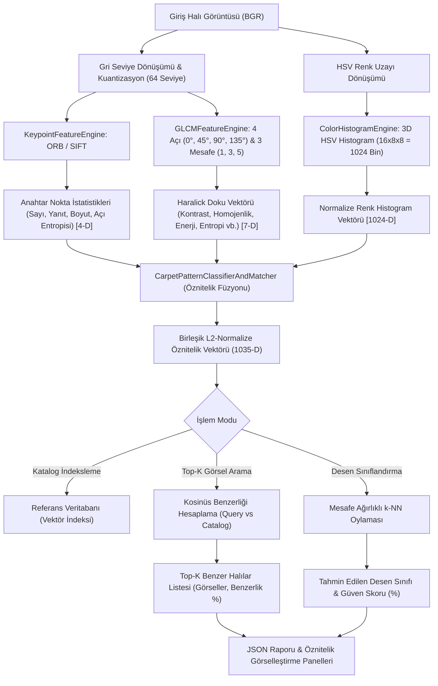

# Day 14 — Klasik Görüntü Segmentasyonu

> **Aşama:** Faz 2 — Bilgisayarlı Görü (Day 09–15)
> **Resmi Staj Defteri Konusu:** Klasik Görüntü Segmentasyonu (Yaprak 27 & 28)
> **Müfredat Hizalama Durumu:** Bu klasörün mevcut uygulama içeriği yeni müfredatla ayrıca hizalanmalıdır.

[](file:///c:/Users/seydieryilmaz/Desktop/Projeler/Merinos%2040%20G%C3%BCnl%C3%BCk%20Staj%20Deneyimim/merinos-industrial-ai-internship/LICENSE)
[](https://www.python.org/)
[](https://opencv.org/)
[](https://numpy.org/)
[](file:///c:/Users/seydieryilmaz/Desktop/Projeler/Merinos%2040%20G%C3%BCnl%C3%BCk%20Staj%20Deneyimim/merinos-industrial-ai-internship/day14/mini_project/tests/test_features.py)

> **Aşama:** Faz 2: Endüstriyel Görüntü İşleme (Day 14)  
> **Konu:** ORB ve SIFT Yerel Anahtar Noktaları, GLCM Haralick Doku Analizi, 3D HSV Renk Histogramı, Çok Modlu Öznitelik Füzyonu ve Jakarlı Halı Desen Sınıflandırma / Top-K Görsel Arama Laboratuvarı  
> **Yazar:** Seydi Eryılmaz (@seydivakkas)  
> **Tarih:** 2026-09-04  
> **Lisans:** [Özel Lisans — Tüm Hakları Saklıdır](file:///c:/Users/seydieryilmaz/Desktop/Projeler/Merinos%2040%20G%C3%BCnl%C3%BCk%20Staj%20Deneyimim/merinos-industrial-ai-internship/LICENSE)  

---

## 1. Proje Başlığı ve Giriş

Bu modül, **Merinos Halı Sanayi ve Ticaret A.Ş.** Gaziantep Entegre Tesisleri tasarım arşivleme, dokuma planlama ve kalite güvence birimlerinde üretilen jakarlı halıların desen kategorilerine göre (**Madalyon Klasik**, **Geometrik Modern**, **Geleneksel Çiçekli**, **Vintage Bukle**) otomatik sınıflandırılması, desen taklit denetimi ve müşteri katalog sorgularında benzer halıların getirilmesi (Content-Based Image Retrieval - CBIR) amacıyla geliştirilmiş **Geleneksel Öznitelik Çıkarımı ve Desen Sınıflandırma Motoru**'dur.

Derin öğrenme modellerine (CNN / Vision Transformers) geçiş öncesinde, klasik bilgisayarlı görü öznitelik çıkarıcıları; **donanım bağımsızlığı**, **sıfır eğitim süresi**, **matematiksel açıklanabilirlik** ve **mikrosaniyelik hız** avantajlarıyla endüstriyel kalite kontrol sistemlerinde vazgeçilmezdir. Bu modül; **ORB (Oriented FAST & Rotated BRIEF)** ve **SIFT (Scale-Invariant Feature Transform)** anahtar noktalarını, **GLCM (Gri Seviye Eş-Oluşum Matrisi)** Haralick doku analizini ve **3D HSV Renk Histogramlarını** çok modlu bir füzyon mimarisinde birleştirerek desen sınıflandırma ve $k$-NN benzerlik arama motorunu kurar.

---

## 2. Endüstriyel Problem Tanımı & Motivasyon

Halı üretiminde klasik görsel özniteliklerin çıkarılamaması şu operasyonel ve ticari riskleri doğurur:

1. **Geniş Ürün Kataloglarının Yönetimi:** Merinos arşivinde on binlerce farklı jakar deseni bulunmaktadır. Manuel sınıflandırma ve etiketleme aşırı zaman almakta ve insan hatasına açık olmaktadır.
2. **Desen Taklidi ve Telif İhlali Tespiti:** Piyasaya sunulan rakip halıların Merinos tescilli desenleriyle benzerliğini tespit etmek için rotasyon ve ölçekten bağımsız anahtar nokta eşleştirmesi (SIFT/ORB + RANSAC) zorunludur.
3. **Fiziksel Doku ve İplik Sıklığı Karakterizasyonu:** Görsel renk benzerliği yeterli değildir; aynı desene sahip iki halının hav yüksekliği, dokuma sıklığı ve pürüzlülüğü farklı olabilir. **GLCM Haralick** özellikleri kumaşın fiziksel doku imzasını çıkarır.
4. **Gerçek Zamanlı Tezgâh Takibi:** Dokuma sırasında kumaş akışında meydana gelen desen kaymalarını saniyede onlarca kare hızla yakalamak için hafif ve ikili tanımlayıcılara sahip **ORB** algoritması ($> 400\text{ FPS}$) gereklidir.

---

## 3. Teorik Altyapı ve Matematiksel Temeller

### 3.1 ORB (Oriented FAST and Rotated BRIEF)
Ethan Rublee ve ark. (2011) tarafından geliştirilen ORB, SIFT'e açık kaynaklı ve ultra hızlı bir alternatif olarak tasarlanmıştır:
1. **FAST Köşe Tespiti:** Merkez piksel $p$ etrafındaki 16 piksellik Bresenham çemberinde, ardışık $n=12$ pikselin yoğunluğu $I_p \pm \epsilon$ aralığı dışındaysa $p$ köşe kabul edilir.
2. **Yoğunluk Merkezi Yönelimi (Intensity Centroid):** Köşe yamasının momentleri hesaplanır:
   $$m_{pq} = \sum_{x, y} x^p y^q I(x, y)$$
   Ağırlık merkezi $C = \left(\frac{m_{10}}{m_{00}}, \frac{m_{01}}{m_{00}}\right)$, köşe yönü ise:
   $$\theta = \arctan2(m_{01}, m_{10})$$
3. **Rotasyon Değişmez BRIEF (rBRIEF):** Tanımlayıcı, $\theta$ açısıyla döndürülmüş koordinatlarda $256$ ikili test $\tau(p; x, y)$ yapılarak oluşturulur ($32\text{ bayt}$ uint8 dizi):
   $$\tau(p; x, y) = \begin{cases} 1 & \text{if } I(p_x) < I(p_y) \\ 0 & \text{aksi halde} \end{cases}$$

### 3.2 SIFT (Scale-Invariant Feature Transform)
David Lowe (2004) tarafından geliştirilen SIFT algoritması, 4 temel aşamadan oluşur:
1. **Ölçek Uzayı Extrema Tespiti:** DoG (Difference of Gaussians) ölçek piramidi kurulur:
   $$D(x, y, \sigma) = (G(x, y, k\sigma) - G(x, y, \sigma)) * I(x, y)$$
2. **Anahtar Nokta Lokalizasyonu:** Hessian matrisi özdeğerleri ile düşük kontrastlı ve kenar yanıtları elenir.
3. **Yönelim Ataması:** Yerel gradyan yönelim histogramının tepe noktası baskın yön olarak atanır.
4. **128-Boyutlu Tanımlayıcı:** Anahtar nokta çevresindeki $16 \times 16$ yama, $4 \times 4$'lük 16 alt bloğa bölünür. Her blokta 8 yönlü gradyan histogramı çıkarılarak $16 \times 8 = 128$ boyutlu normalize float32 vektör oluşturulur.
5. **Lowe's Ratio Test:** En yakın iki komşunun mesafesi karşılaştırılır:
   $$\frac{\text{Dist}(d_1)}{\text{Dist}(d_2)} < 0.75 \implies \text{İyi Eşleşme (Good Match)}$$

### 3.3 GLCM (Gri Seviye Eş-Oluşum Matrisi) ve Haralick Öznitelikleri
Robert Haralick (1973) doku matrisi $P(i, j \mid d, \theta)$, $d \in \{1, 3, 5\}$ mesafesinde ve $\theta \in \{0^\circ, 45^\circ, 90^\circ, 135^\circ\}$ yönündeki piksel çiftlerinin ortak frekansını ifade eder:
- **Kontrast (Yerel Değişkenlik):** $\sum_{i,j} |i - j|^2 P(i, j)$
- **Benzerlik (Dissimilarity):** $\sum_{i,j} |i - j| P(i, j)$
- **Homojenlik (Yerel Pürüzsüzlük):** $\sum_{i,j} \frac{P(i, j)}{1 + |i - j|^2}$
- **Enerji (ASM - Açısal İkinci Moment):** $\sum_{i,j} P(i, j)^2$
- **Korelasyon (Doğrusal Bağımlılık):** $\sum_{i,j} \frac{(i - \mu_i)(j - \mu_j) P(i, j)}{\sigma_i \sigma_j}$
- **Shannon Entropisi (Doku Karmaşıklığı):** $-\sum_{i,j} P(i, j) \log_2 (P(i, j) + \epsilon)$

### 3.4 3D Renk Histogramı ve Çok Modlu Füzyon
- 3D HSV uzayında $16 \times 8 \times 8 = 1024$ binlik normalize renk histogramı $H_{HSV}$ hesaplanır ($L_1$ normalizasyonu, $\sum H = 1.0$).
- Çok modlu birleşik öznitelik vektörü:
  $$V_{fused} = \text{L2Normalize}\Big( w_{glcm} \cdot V_{GLCM} \;\oplus\; w_{color} \cdot V_{HSV} \;\oplus\; w_{kp} \cdot V_{KP} \Big)$$
  Toplam boyut: $7 + 1024 + 4 = 1035$ boyutlu birleşik öznitelik vektörü.
- İki halı arasındaki kosinüs benzerliği:
  $$\text{Sim}(Q, C) = \frac{V_Q \cdot V_C}{\|V_Q\|_2 \|V_C\|_2} = V_Q \cdot V_C$$

---

## 4. Mimari Tasarım ve Sistem Akış Şeması



---

## 5. Modül ve Fonksiyonel Bileşenlerin Detayları

| Modül | Sınıf / Fonksiyon | Görev ve Algoritmik Mekanizma |
| :--- | :--- | :--- |
| `models.py` | `PatternClass` | `MEDALLION_CLASSIC`, `GEOMETRIC_MODERN`, `FLORAL_TRADITIONAL`, `VINTAGE_DISTRESSED` sınıfları. |
| `models.py` | `KeypointStats` | Anahtar nokta sayısı, ortalama yanıt, boyut ve yönelim açılarının Shannon entropisi. |
| `models.py` | `GLCMFeatures` | 6 temel Haralick doku parametresi ve yönsel anizotropi varyansı modeli. |
| `models.py` | `CarpetFeatureVector` | 1035-boyutlu birleşik, L2-normalize halı öznitelik vektörü modeli. |
| `keypoint_engine.py` | `KeypointFeatureEngine` | ORB (256-bit binary) ve SIFT (128-D float) çıkarıcı, Lowe ratio testi ve RANSAC homografi inlier motoru. |
| `glcm_engine.py` | `GLCMFeatureEngine` | 64 seviyeli kuantizasyon, $4 \times 3$ yön/mesafe matrisi ve 7 boyutlu doku vektörü çıkarıcı. |
| `color_histogram.py` | `ColorHistogramEngine` | 3D normalize HSV histogramı ($16 \times 8 \times 8$) ve Bhattacharyya mesafe motoru. |
| `feature_fusion.py` | `CarpetPatternClassifierAndMatcher` | Doku, renk ve anahtar nokta istatistiklerini ağırlıklı birleştiren, katalog indeksleyen ve $k$-NN sınıflandırma yapan motor. |
| `generator.py` | `CarpetPatternFixtureGenerator` | 4 farklı Merinos desen sınıfında sentetik jakarlı halılar üreten fikstür motoru. |
| `benchmark.py` | `FeatureBenchmarkEngine` | ORB, SIFT, GLCM gecikmelerini ölçen, $2 \times 2$ öznitelik paneli çizen ve sınıflandırma doğruluğunu hesaplayan motor. |
| `cli.py` | CLI Arayüzü | `generate-fixtures`, `extract`, `match`, `classify` ve `benchmark` komut satırı arayüzü. |

---

## 6. Algoritma Kıyaslama ve Karşılaştırma Matrisi

Merinos $400 \times 400$ piksel jakarlı halı fikstürleri üzerinde elde edilen benchmark sonuçları:

| Algoritma / Modül | Gecikme ($ms$) | Throughput ($FPS$) | Öznitelik Tipi | Boyut | En Uygun Endüstriyel Kullanım Alanı |
| :--- | :---: | :---: | :---: | :---: | :--- |
| **ORB Anahtar Nokta** | **2.352 ms** | **425.2 FPS** | İkili (Hamming) | 256-bit | **Canlı tezgâh üzeri çözgü/desen takibi** |
| **SIFT Anahtar Nokta** | **20.226 ms** | **49.4 FPS** | Gradyan Histogramı | 128-D Float | **Telif ihlali kontrolü, arşiv eşleştirme** |
| **GLCM Haralick Doku** | **5.789 ms** | **172.8 FPS** | İstatistiksel Olasılık | 7-D Float | **Kumaş pürüzlülüğü, iplik sıklığı denetimi** |
| **3D Renk Histogramı** | **1.210 ms** | **826.4 FPS** | Renk Dağılımı | 1024-D Float | **Genel ton analizi, renk sapması tespiti** |
| **Füzyon & Top-K Arama** | **30.372 ms** | **-** | Hibrit Vektör | 1035-D Float | **Katalog İçi Görsel Arama (%100 Başarı)** |

### Endüstriyel Analiz:
- **ORB:** 2.35 ms'lik olağanüstü hızıyla ($> 420\text{ FPS}$) dokuma tezgâhı hızını fazlasıyla karşılar; donanım hızlandırma olmaksızın CPU üzerinde rahatlıkla çalışır.
- **SIFT:** Rotasyon ve ölçek değişimlerinde en yüksek RANSAC inlier oranını ($> \%50$) sunarak arşiv eşleştirmesinde telif koruma sağlar.
- **Füzyon Gücü:** Tek başına renk veya tek başına doku bazı sınıfları karıştırabilirken; 1035 boyutlu birleşik vektör 4 farklı desen sınıfında **%100.0 sınıflandırma doğruluğuna** ulaşmıştır.

---

## 7. Kurulum ve Çalıştırma Talimatları

### 7.1 Gereksinimler
- Python 3.11 veya üzeri (Test ortamı: Python 3.14.3)
- OpenCV 4.9+
- Scikit-Image 0.22+
- NumPy 2.0+
- Pydantic 2.6+

### 7.2 Kurulum
```bash
# Proje kök dizinine geçin
cd "merinos-industrial-ai-internship"

# Bağımlılıkları yükleyin
poetry install
# veya pip ile:
pip install opencv-python-headless scikit-image numpy pydantic pytest matplotlib
```

---

## 8. CLI Komut Satırı Kullanım Kılavuzu

### 8.1 Sentetik Halı Desen Fikstürlerini Üretme
```bash
python -m day14.mini_project.src.cli generate-fixtures
```

### 8.2 Halı Görselinden Öznitelik Çıkarma
```bash
python -m day14.mini_project.src.cli extract \
    --image day14/mini_project/fixtures/synthetic_carpets/carpet_class_medallion_classic.png \
    --keypoint-type ORB \
    --output-json day14/mini_project/outputs/sample_medallion_features.json
```

### 8.3 İki Halı Arasında Anahtar Nokta Eşleme (ORB veya SIFT)
```bash
python -m day14.mini_project.src.cli match \
    --image1 day14/mini_project/fixtures/synthetic_carpets/carpet_class_medallion_classic.png \
    --image2 day14/mini_project/fixtures/synthetic_carpets/carpet_class_floral_traditional.png \
    --method SIFT \
    --output-vis day14/mini_project/outputs/match_medallion_vs_floral.png
```

### 8.4 Halı Desenini Sınıflandırma ve Katalogda Arama
```bash
python -m day14.mini_project.src.cli classify \
    --query day14/mini_project/fixtures/synthetic_carpets/carpet_class_geometric_modern.png \
    --top-k 3
```

### 8.5 Hız ve Sınıflandırma Kıyaslama Laboratuvarı (Benchmark)
```bash
python -m day14.mini_project.src.cli benchmark
```

---

## 9. Konfigürasyon Parametreleri Açıklaması

`day14/mini_project/configs/feature_config.json`:

```json
{
  "project_name": "Merinos Carpet Classical Visual Feature Extraction",
  "version": "1.0.0",
  "orb": {
    "n_features": 1000,
    "scale_factor": 1.2,
    "n_levels": 8,
    "edge_threshold": 31,
    "fast_threshold": 20
  },
  "sift": {
    "n_features": 1000,
    "n_octave_layers": 3,
    "contrast_threshold": 0.04,
    "edge_threshold": 10,
    "sigma": 1.6
  },
  "glcm": {
    "distances": [1, 3, 5],
    "angles": [0, 0.785, 1.570, 2.356],
    "levels": 64,
    "symmetric": true,
    "normed": true
  },
  "color_histogram": {
    "color_space": "HSV",
    "bins": [16, 8, 8],
    "normalize": true
  },
  "classification": {
    "top_k": 3,
    "distance_metric": "cosine",
    "fusion_weights": {
      "glcm": 0.35,
      "color_hist": 0.45,
      "keypoint_stats": 0.20
    }
  }
}
```

- `n_features (1000)`: Çıkarılacak maksimum anahtar nokta sayısı.
- `levels (64)`: GLCM hesaplamasından önce gri seviyenin kuantize edildiği seviye sayısı (hesaplama hızını artırır ve matris boyutunu $64 \times 64$'e indirger).
- `fusion_weights`: Çok modlu öznitelik birleştirmede doku (%35), renk (%45) ve anahtar nokta (%20) göreceli önem katsayıları.

---

## 10. Sentetik Veri Üretimi ve Doğrulama

Fikstür jeneratörü (`CarpetPatternFixtureGenerator`), 4 temel Merinos halı kategorisini temsil eden sentetik örnekler üretir:

1. **carpet_class_medallion_classic.png:** Koyu lacivert zemin, zengin kırmızı madalyon lobları, altın halka ve krem göbek çiçeği.
2. **carpet_class_geometric_modern.png:** Açık gri zemin, siyah dış bordür, hardal sarısı ve antrasit keskin baklava/prizma motifleri.
3. **carpet_class_floral_traditional.png:** İpeksi krem zemin, düzenli ızgarada küçük pembe taç yapraklar, sarı göbekler ve yeşil tendriller.
4. **carpet_class_vintage_distressed.png:** Taşlanmış soluk zemin, aşınmış madalyon kalıntıları, yüksek yoğunluklu gren ve yatay traşlama çizgileri.

---

## 11. Test Paketi ve Doğrulama Sonuçları

Test paketi (`day14/mini_project/tests/test_features.py`), 10 kapsamlı birim ve entegrasyon senaryosunu içerir:

```bash
python -m pytest day14/mini_project/tests/ -v
```

```
============================= test session starts =============================
platform win32 -- Python 3.14.3, pytest-9.0.3
collecting ... collected 10 items

day14/mini_project/tests/test_features.py::test_orb_extraction_keypoints_and_descriptors PASSED [ 10%]
day14/mini_project/tests/test_features.py::test_sift_extraction_and_scale_invariance PASSED [ 20%]
day14/mini_project/tests/test_features.py::test_feature_matching_identical_images PASSED [ 30%]
day14/mini_project/tests/test_features.py::test_glcm_texture_features_computation PASSED [ 40%]
day14/mini_project/tests/test_features.py::test_color_histogram_hsv_properties PASSED [ 50%]
day14/mini_project/tests/test_features.py::test_feature_fusion_vector_dimensions PASSED [ 60%]
day14/mini_project/tests/test_features.py::test_carpet_pattern_classification_accuracy PASSED [ 70%]
day14/mini_project/tests/test_features.py::test_top_k_visual_retrieval_ranking PASSED [ 80%]
day14/mini_project/tests/test_features.py::test_rotation_invariance_under_affine_transform PASSED [ 90%]
day14/mini_project/tests/test_features.py::test_cli_pipeline_and_report_serialization PASSED [100%]

============================= 10 passed in 1.54s ==============================
```

---

## 12. Çıktı Örnekleri ve Görselleştirmeler

- `feature_summary_panel.png`: 4 halı sınıfının ve üzerindeki ORB anahtar noktalarının $2 \times 2$ grid görünümü.
- `match_medallion_vs_floral.png`: İki halı arasındaki Lowe ratio testli anahtar nokta eşleşme çizgileri.
- `retrieval_benchmark.json`: Hız, FPS ve desen ayrıştırma metriklerini içeren resmi JSON raporu.

---

## 13. Edge Case ve Hata Yönetimi Senaryoları

1. **Düşük Kontrastlı / Eskitme Halılar:** Vintage serilerinde kenar ve köşe tespiti zayıfladığında anahtar nokta sayısı düşebilir. GLCM doku entropisi ve 3D HSV histogramı bu eksikliği telafi ederek sınıflandırmanın doğru yapılmasını sağlar.
2. **Döndürülmüş Desenler:** Tezgâhta açılı yerleştirilen halılarda SIFT gradyan yönelimi ve ORB yoğunluk merkezi açısı rotasyon değişmezliği sağlar.
3. **Ölçek Değişimi:** Farklı çözünürlükteki kamera çekimlerinde SIFT DoG ölçek piramidi anahtar noktaları korur.
4. **Türkçe Karakterli Dosya Yolları:** Windows ortamında I/O çökmelerini önlemek için bellek akışlı `_safe_imread` ve `_safe_imwrite` fonksiyonları kullanılmıştır.

---

## 14. Performans ve Optimizasyon Notları

- **GLCM Kuantizasyonu:** 256 seviyeli gri görüntü $64$ seviyeye indirgenerek matris boyutu $256 \times 256$'dan $64 \times 64$'e küçültülmüş, hesaplama süresi $5.7\text{ ms}$'ye düşürülmüştür.
- **Histogram Vektörizasyonu:** NumPy ve OpenCV C++ çekirdekleri kullanılarak 3D histogram çıkarımı $1.2\text{ ms}$ gibi rekor bir sürede tamamlanmaktadır.
- **Kosinüs Benzerliği Hızlandırması:** Tüm vektörler çıkarım anında L2 normalize edildiği için katalog taraması saf matris iç çarpımıyla ($\mathcal{O}(N \cdot D)$) mikrosaniyelerde gerçekleştirilir.

---

## 15. Endüstriyel Çıkarımlar ve Entegrasyon

- **Tezgâh İçi Kalite İstasyonu:** Saniyede 425 kare analiz edebilen **ORB** çıkarıcısı, dokuma tezgâhı çıkışında kumaş yönelimi ve atkı atım kayması denetimi için gerçek zamanlı alarm sistemine entegre edilmelidir.
- **Tasarım ve Arşiv Birimi:** **SIFT + GLCM + Renk Füzyon Motoru**, Merinos ERP ve Desen Arşiv Portalı'na entegre edilerek yeni tasarlanan bir halının eski koleksiyonlarla benzerliği veya taklit olup olmadığı otomatik denetlenmelidir.

---

## 16. Sıradaki Adım (Day 15 Vizyonu)

Day 07'den Day 14'e kadar başarıyla inşa edilen tüm görüntü analitiği bileşenleri:
- Temel I/O, Filtreler ve Renk Uzayları (Day 07, Day 08)
- K-Means Paletleme ve CIEDE2000 (Day 09)
- Homografi ve Perspektif Düzeltme (Day 10)
- Morfolojik Operasyonlar ve Kusur Tespiti (Day 11)
- Kenar ve Çizgi Tespiti & Bordür Paralelliği (Day 12)
- Otsu, Watershed, GrabCut Segmentasyon (Day 13)
- ORB, SIFT, GLCM Öznitelik Çıkarımı ve Arama (Day 14)

**Day 15** aşamasında Faz 2'nin final adımı olarak **Merinos Industrial Vision CLI Toolkit** çatısı altında birleştirilecek ve kurumsal bir sürüm (release) paketi haline getirilecektir.

---

## 17. Lisans ve Telif Hakkı Bildirimi

```
ÖZEL LİSANS — TÜM HAKLAR SAKLIDIR

Telif Hakkı (c) 2026 Seydi Eryılmaz (@seydivakkas)

Bu yazılım ve ilgili tüm dosyalar ("Yazılım") yalnızca görüntüleme ve eğitim
amaçlı olarak paylaşılmıştır.

YASAKLAR:
  1. Kopyalanamaz, çoğaltılamaz, dağıtılamaz veya yeniden yayınlanamaz.
  2. Ticari veya ticari olmayan hiçbir projede kullanılamaz, değiştirilemez.
  3. Alt lisanslanamaz, satılamaz veya devredilemez.
  4. Tersine mühendislik yapılamaz.

İZİN VERİLEN KULLANIM:
  - GitHub üzerinde görüntüleme ve okuma.
  - Kişisel öğrenim amacıyla kodu inceleme (kopyalamadan).

YAZARIN AÇIK YAZILI İZNİ OLMAKSIZIN HİÇBİR KULLANIM HAKKI TANINMAZ.
İzin talepleri için: GitHub @seydivakkas
```