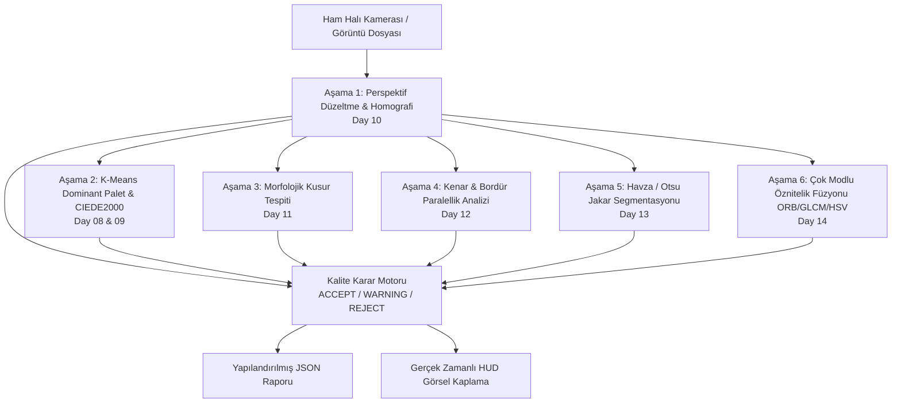

# Merinos Industrial Vision CLI Toolkit (Day 15 — Mini Project)

[](https://www.python.org/downloads/)
[]()
[](https://github.com/seydivakkas)
[]()

> **Merinos Halı Sanayi ve Ticaret A.Ş. — Gaziantep Dokuma Tesisleri**  
> Faz 2: Endüstriyel Görüntü İşleme nihai üretim sürümü ve birleşik CLI kalite kontrol paketi.

---

## 1. Genel Bakış ve Mimari

Bu paket, Faz 2 boyunca geliştirilen 8 bağımsız bilgisayarlı görü modülünü (Day 07 — Day 14) endüstriyel üretim hattında tek noktadan yönetilebilir bir CLI araç setinde (`merinos-vision`) birleştirmektedir.



---

## 2. CLI Komutları ve Kullanım

### 1) Sentetik Test Fikstürleri Üretimi
```bash
python -m day15.mini_project.src.cli generate-fixtures --output-dir day15/mini_project/fixtures
```
*Çıktı:* `perfect_carpet.png`, `defective_carpet.png`, `skewed_carpet.png`, `faded_carpet.png`.

### 2) Uçtan Uca Halı Kalite Muayenesi (Inspect)
```bash
python -m day15.mini_project.src.cli inspect \
  --image day15/mini_project/fixtures/perfect_carpet.png \
  --carpet-id "MERINOS-PERFECT-001" \
  --output-hud day15/mini_project/fixtures/hud_perfect.png \
  --output-json day15/mini_project/fixtures/report_perfect.json
```

### 3) Faz 2 Modül Başarım Kıyaslaması (Benchmark)
```bash
python -m day15.mini_project.src.cli benchmark --iterations 10 --output-json day15/mini_project/fixtures/benchmark_manifest.json
```

### 4) Sürüm ve Sağlık Bilgisi (Release-Info)
```bash
python -m day15.mini_project.src.cli release-info
```

---

## 3. Test ve Doğrulama

Birim ve entegrasyon testlerini çalıştırmak için:
```bash
python -m pytest day15/mini_project/tests/ -v
```

---

## 4. Lisans

```
ÖZEL LİSANS — TÜM HAKLAR SAKLIDIR

Telif Hakkı (c) 2026 Seydi Eryılmaz (@seydivakkas)

Bu yazılım ve ilgili tüm dosyalar ("Yazılım") yalnızca görüntüleme ve eğitim
amaçlı olarak paylaşılmıştır.

YASAKLAR:
  1. Kopyalanamaz, çoğaltılamaz, dağıtılamaz veya yeniden yayınlanamaz.
  2. Ticari veya ticari olmayan hiçbir projede kullanılamaz, değiştirilemez.
  3. Alt lisanslanamaz, satılamaz veya devredilemez.
  4. Tersine mühendislik yapılamaz.

İZİN VERİLEN KULLANIM:
  - GitHub üzerinde görüntüleme ve okuma.
  - Kişisel öğrenim amacıyla kodu inceleme (kopyalamadan).

YAZARIN AÇIK YAZILI İZNİ OLMAKSIZIN HİÇBİR KULLANIM HAKKI TANINMAZ.
İzin talepleri için: GitHub @seydivakkas
```
