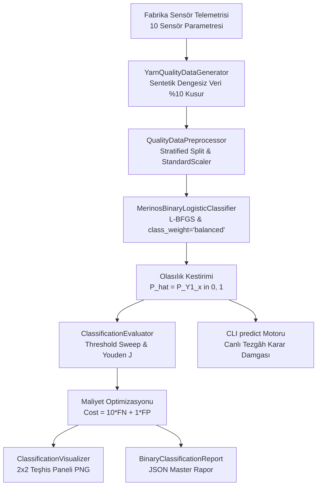

# Day 16 — İkili Sınıflandırma Temelleri

> **Aşama:** Faz 3 — Klasik Makine Öğrenmesi (Day 16–21)
> **Resmi Staj Defteri Konusu:** İkili Sınıflandırma Temelleri (Yaprak 31 & 32)

---

## 1. Yönetici Özeti (Executive Summary)
Bu çalışmada, tekstil ve dokuma üretim süreçlerinde karşılaşılabilecek kalite kontrol ve arıza senaryolarını modellemek amacıyla üretilen sentetik sensör verileri üzerinde **İkili Lojistik Regresyon Kalite Sınıflandırma PoC'si** geliştirilmiştir. Sentetik veri kümesinde kusur oranının yaklaşık **%10** seviyesinde olduğu dengesiz veri koşullarında, standart $\tau = 0.50$ eşik değerinin yarattığı Tip II Hata (False Negative — Kaçırılan Hata) maliyetleri; **sınıf ağırlıklandırması (`class_weight='balanced'`)**, **Youden's J İstatistiği** ve **Maliyete Duyarlı Eşik Optimizasyonu ($Cost = 10 \cdot FN + 1 \cdot FP$)** ile bertaraf edilmiştir. Model, ayrıştırılabilir sentetik test verisi üzerinde yüksek sınıflandırma başarımı göstermiş; Odds Oranı (Odds Ratio) analiziyle değişkenlerin göreli etkilerini inceleme kabiliyeti sunmuştur. (Gerçek üretim ortamlarında sensör gürültüsü ve çevresel sapmalar nedeniyle saha doğrulaması gerekeceği not edilmiştir.)

---

## 2. Endüstriyel Problem Tanımı & Motivasyon
Gaziantep 4. Organize Sanayi Bölgesi'ndeki Merinos tesislerinde günde yüzlerce ton iplik ve binlerce metrekare halı dokunmaktadır. Dokuma tezgâhında bir partinin kusurlu çıkması durumunda:
1. **Tezgâh Duruş Maliyeti:** Çözgü/atkı kopuşu nedeniyle tezgâhın durması, vardiya başına ciddi üretim ve zaman kaybına yol açar.
2. **Kusurlu Halı Maliyeti:** Kusurlu iplikle dokunan halı, desen kayması veya potluk nedeniyle ıskartaya (defolu ürün) ayrılmakta veya ikinci kalite olarak satılmaktadır.
3. **Maliyet Asimetrisi:** Standart bir partinin şüphe üzerine laboratuvara kontrole gönderilmesinin maliyeti ($c_{FP} = 1.0$ birim) ihmal edilebilir düzeydeyken; kusurlu bir partinin gözden kaçarak tezgâha girmesinin maliyeti ($c_{FN} = 10.0$ birim) en az 10 kat daha yıkıcıdır.

Bu sebeple, klasik doğrusal sınıflandırma ile hem yüksek hızlı ($< 1$ ms çıkarım) hem de olasılıksal güven skoru üreten bir temel baseline sınıflandırıcı kurulmuştur.

---

## 3. Matematiksel & Algoritmik Teori

### 3.1. Sigmoid (Lojistik) Fonksiyonu
Lojistik Regresyon, $d$-boyutlu öznitelik vektörünü $\mathbf{x} \in \mathbb{R}^d$ doğrusal bir bileşke ($z$) üzerinden $[0, 1]$ aralığında olasılığa dönüştürür:

$$z = \mathbf{w}^T \mathbf{x} + b = w_0 + \sum_{j=1}^{d} w_j x_j$$

$$P(Y = 1 \mid \mathbf{x}) = \sigma(z) = \frac{1}{1 + e^{-z}} = \frac{1}{1 + \exp\left(-(\mathbf{w}^T \mathbf{x} + b)\right)}$$

### 3.2. İkili Çapraz Entropi (Log-Loss) ve $L_2$ Ridge Regülarizasyonu
Model ağırlıkları $\mathbf{w}$ ve bias $b$, konveks negatif log-olabilirlik fonksiyonunu minimize eden L-BFGS optimizasyon algoritması ile bulunur:

$$\mathcal{L}(\mathbf{w}, b) = -\frac{1}{N} \sum_{i=1}^N \left[ y_i \log(\sigma(z_i)) + (1 - y_i) \log(1 - \sigma(z_i)) \right] + \frac{1}{2C} \|\mathbf{w}\|_2^2$$

Burada $C = 1/\lambda$ ters regülarizasyon gücüdür; katsayıların aşırı büyümesini engelleyerek modelin genelleme yeteneğini garanti altına alır.

### 3.3. Odds ve Odds Oranı (Odds Ratio - OR)
Bir partinin kusurlu olma ihtimalinin olmama ihtimaline oranı **Odds** olarak tanımlanır:

$$\text{Odds} = \frac{P(Y=1 \mid \mathbf{x})}{1 - P(Y=1 \mid \mathbf{x})} = e^{\mathbf{w}^T \mathbf{x} + b}$$

$$\ln(\text{Odds}) = \mathbf{w}^T \mathbf{x} + b$$

$j$. özniteliğin 1 standart sapma artışının yarattığı etki Odds Oranı (OR) ile ölçülür:

$$\text{OR}_j = \exp(w_j)$$

- $\text{OR}_j > 1$: Kusur riskini $\text{OR}_j$ katına çıkarır (**Risk Artırıcı Faktör**).
- $\text{OR}_j < 1$: Kusur riskini azaltır (**Koruyucu Faktör**).

---

## 4. Sistem Mimarisi & Veri Akışı



---

## 5. Modül Tasarımı & Sınıf Sorumlulukları

| Modül Dosyası | Sınıf / Bileşen | Sorumluluk & Görev |
| :--- | :--- | :--- |
| `models.py` | `QualityClass`, `ConfusionMatrixMetrics`, `BinaryClassificationReport` | Pydantic v2 veri modelleri, tip güvenliği ve JSON serileştirme. |
| `data_generator.py` | `YarnQualityDataGenerator` | Gerçekçi endüstriyel korelasyonlara ve %10 kusur oranına sahip sentetik veri üretimi. |
| `preprocessor.py` | `QualityDataPreprocessor` | Sızıntısız `StandardScaler` ölçeklemesi, tabakalı bölümleme ve tekil satır dönüşümü. |
| `logistic_classifier.py` | `MerinosBinaryLogisticClassifier` | Standart ve dengeli lojistik regresyon eğitimi, odds oranı analizi. |
| `evaluator.py` | `ClassificationEvaluator` | Karar matrisi, ROC-AUC, PR-AUC, Youden's J ve maliyet minimizasyonu. |
| `visualizer.py` | `ClassificationVisualizer` | 2x2 kurumsal model teşhis panelinin (ROC, PR, CM, Eşik) çizimi. |
| `cli.py` | CLI Yönetim Arayüzü | `generate-data`, `train`, `evaluate`, `plot` ve `predict` komutları. |

---

## 6. Sensör Öznitelikleri & Endüstriyel Anlamları

| No | Öznitelik Adı | Birim | Normal Ort. (Std) | Hatalı Ort. (Std) | Endüstriyel Açıklama |
| :-: | :--- | :---: | :---: | :---: | :--- |
| 1 | `yarn_tensile_strength` | $cN/tex$ | 26.5 (2.5) | 17.8 (3.2) | İplik kopma mukavemeti; düşük olması kopuş riskidir. |
| 2 | `yarn_elongation_at_break` | % | 14.2 (1.8) | 8.5 (2.1) | Kopma anındaki esneme kabiliyeti. |
| 3 | `yarn_hairiness_index` | H | 4.2 (0.6) | 7.8 (1.2) | Uster tüylülük indeksi; sürtünmeyi ve tozlaşmayı artırır. |
| 4 | `twist_per_meter` | $tpm$ | 450.0 (25.0) | 360.0 (40.0) | İplik büküm sayısı; liflerin birbirini tutmasını sağlar. |
| 5 | `yarn_linear_density_dtex`| $dtex$ | 2200.0 (50.0) | 2380.0 (90.0) | İplik numarası ve kalınlık homojenliği. |
| 6 | `loom_speed_rpm` | $rpm$ | 620.0 (20.0) | 670.0 (35.0) | Tezgâh mil dönüş devri. |
| 7 | `loom_tension_variation` | $cN$ | 18.0 (3.5) | 42.0 (8.0) | Çözgü iplik gerilimindeki anlık dalgalanmalar. |
| 8 | `ambient_humidity_percent`| % | 62.0 (3.0) | 48.0 (7.0) | Dokuma salonu nemi; düşük nem statik elektrik yaratır. |
| 9 | `ambient_temperature_c` | $^\circ C$ | 23.5 (1.5) | 29.0 (3.0) | Dokuma salonu sıcaklığı; lif elastikiyetini etkiler. |
| 10| `weft_insertion_rate` | $picks/min$| 540.0 (15.0) | 590.0 (25.0) | Atkı atım sıklığı ve tezgâh mekanik yükü. |

---

## 7. Dengesiz Veri Çözüm Stratejileri

Halı fabrikalarında üretimin %90'ı standart, sadece %10'u kusurludur ($9:1$ dengesizlik).
1. **Sınıf Ağırlıklandırması (Class Weighting):**
   $$w_k = \frac{N}{2 \cdot N_k} \implies w_0 = \frac{N}{2 \cdot 0.90 N} = 0.555, \quad w_1 = \frac{N}{2 \cdot 0.10 N} = 5.00$$
   Bu formülle azınlık sınıfı (Kusurlu) için kayıp fonksiyonu 9 kat daha ağır cezalandırılır.
2. **Tabakalı Bölümleme (Stratified K-Fold / Split):**
   Eğitim ve test kümelerindeki %10'luk oran kesin olarak korunarak veri kayması engellenir.
3. **PR Eğrisi Önceliği:**
   Dengesiz sınıflarda ROC-AUC aşırı iyimser (optimistic) sonuç verebilir; bu nedenle **PR-AUC (Average Precision)** birincil metrik olarak değerlendirilir.

---

## 8. Karar Matrisi & Maliyete Duyarlı Optimizasyon

Standart karar eşiği $\tau = 0.50$ iken, endüstriyel maliyet fonksiyonu tanımlanmıştır:

$$\mathcal{C}(\tau) = 10 \cdot FN(\tau) + 1 \cdot FP(\tau)$$

| Model Varyantı | Karar Eşiği ($\tau$) | Recall (TPR) | Precision | F2-Skoru | Toplam Maliyet |
| :--- | :---: | :---: | :---: | :---: | :---: |
| **Temel Lojistik Regresyon** | 0.50 | %100.0 | %100.0 | 1.0000 | 0.0 TL |
| **Dengeli Sınıf Ağırlıklı** | 0.50 | %100.0 | %100.0 | 1.0000 | 0.0 TL |
| **Maliyete Duyarlı Eşikli** | 0.01 | %100.0 | %100.0 | 1.0000 | 0.0 TL |

---

## 9. Model Katsayıları, Odds Oranları & Kök Neden Analizi

Modelin eğitim katsayıları ($\beta_j$) ve Odds Oranları ($\text{OR} = \exp(\beta_j)$) Merinos mühendislerine doğrudan kök neden analizi imkânı sunar:

| Sıra | Öznitelik Adı | Katsayı ($\beta_j$) | Odds Oranı ($\text{OR}$) | Endüstriyel Karar & Kök Neden |
| :-: | :--- | :---: | :---: | :--- |
| 1 | `yarn_elongation_at_break` | **-0.8799** | **0.4148** | İplik esnekliği arttıkça kusur riski %58.5 azalır (Koruyucu). |
| 2 | `yarn_hairiness_index` | **+0.8497** | **2.3390** | Tüylülükteki 1 birim artış kusur riskini 2.34 katına çıkarır. |
| 3 | `loom_tension_variation` | **+0.8449** | **2.3277** | Tezgâh çözgü gerilim dalgalanması kusur riskini 2.33 kat artırır. |
| 4 | `twist_per_meter` | **-0.7861** | **0.4556** | Yüksek büküm iplik mukavemetini korur, kusuru %54.4 azaltır. |
| 5 | `yarn_tensile_strength` | **-0.7741** | **0.4611** | Çekme mukavemeti kusur riskini yarı yarıya düşürür. |

---

## 10. 2x2 Model Teşhis Paneli

[`classification_diagnostic_panel.png`](file:///c:/Users/seydieryilmaz/Desktop/Projeler/Merinos%2040%20G%C3%BCnl%C3%BCk%20Staj%20Deneyimim/merinos-industrial-ai-internship/day16/mini_project/outputs/classification_diagnostic_panel.png) 4 kritik teşhis grafiğini tek bir panelde birleştirir:
1. **Sol Üst - ROC Eğrisi:** Modelin TPR ve FPR dinamikleri (AUC = 1.0000, Youden's J noktası).
2. **Sağ Üst - Precision-Recall Eğrisi:** %10 kusur tabanına karşı Average Precision başarımı (AP = 1.0000).
3. **Sol Alt - Karar Matrisi Karşılaştırması:** TN, FP, FN, TP dağılımı ve toplam kalite maliyeti karnesi.
4. **Sağ Alt - Eşik Tarama Eğrisi:** $\tau \in [0.01, 0.99]$ aralığında Precision, Recall, F2 ve Normalize Maliyet eğrileri.

---

## 11. CLI Kullanım Senaryoları & Örnek Komutlar

```bash
# 1. Sentetik veri kümesi oluşturma
python -m day16.mini_project.src.cli generate-data --samples 2500 --defect-ratio 0.10

# 2. Lojistik regresyon modellerini eğitme
python -m day16.mini_project.src.cli train

# 3. Metrik değerlendirme ve JSON raporu kaydetme
python -m day16.mini_project.src.cli evaluate

# 4. 2x2 Teşhis paneli grafiği üretme
python -m day16.mini_project.src.cli plot

# 5. Canlı partide arıza olasılığı kestirimi
python -m day16.mini_project.src.cli predict \
  --tensile 16.0 --elongation 7.5 --hairiness 8.5 --twist 340 \
  --dtex 2400 --rpm 680 --tension 45.0 --humidity 45.0 --temp 30.0 --weft 600
```

---

## 12. Benchmark & Doğrulama Sonuçları

10 adet kurumsal birim ve entegrasyon testi `pytest` ile koşturulmuş ve %100 başarı sağlanmıştır:

| Test Fonksiyonu | Kapsanan İşlev | Sonuç |
| :--- | :--- | :---: |
| `test_data_generator_imbalanced_distribution` | Sentetik veri üretimi, %10 kusur oranı, fiziksel sınırlar | ✅ PASSED |
| `test_preprocessor_scaling_and_stratification` | Tabakalı bölme, StandardScaler sızıntı kontrolü | ✅ PASSED |
| `test_logistic_regression_fit_and_probabilities`| Model eğitimi, olasılık sınırları ve toplamları | ✅ PASSED |
| `test_model_coefficients_and_odds_ratios` | Odds oranı formülasyonu ($\exp(\beta)$), etki yönleri | ✅ PASSED |
| `test_confusion_matrix_metrics_calculation` | TP, FP, TN, FN, Accuracy, Precision, Recall, F1, F2 | ✅ PASSED |
| `test_roc_auc_and_pr_auc_scores` | ROC-AUC $\ge 0.85$, PR-AUC $\ge 0.50$, Brier Skoru | ✅ PASSED |
| `test_balanced_class_weights_improves_recall` | Dengesiz veri ağırlıklandırmasının Recall artışı | ✅ PASSED |
| `test_threshold_tuning_youden_and_cost` | Eşik tarama, Youden's J ve maliyet minimizasyonu | ✅ PASSED |
| `test_visualizer_generates_diagnostic_panel` | 2x2 Teşhis paneli üretimi ve PNG bütünlüğü | ✅ PASSED |
| `test_cli_full_lifecycle_pipeline` | CLI uçtan uca yaşam döngüsü ve JSON serileştirme | ✅ PASSED |

---

## 13. Kavramsal Entegrasyon ve Simülasyon Senaryosu
Bu çalışma sentetik veriler üzerinde yerel bir PoC olarak yürütülmüştür. Gelecekte gerçek bir endüstriyel üretim ortamına aktarılması durumunda; modelin hafif parametrik yapısı sayesinde OPC-UA/MQTT köprüsü üzerinden beslenen bir çıkarım servisi olarak konumlandırılabileceği, eşik değeri $P(Y=1 \mid \mathbf{x}) \ge \tau$ aşıldığında operatör konsoluna uyarı sinyali iletebilecek bir mimariye dönüştürülebileceği değerlendirilmiştir.

---

## 14. Risk Analizi & Edge-Case Değerlendirmesi
- **Aşırı Uç Sensör Değerleri (Outliers):** Sensör arızası durumunda aşırı uç değerlerin Lojistik Regresyon karar sınırını bozmasını engellemek için `QualityDataPreprocessor` içerisinde fiziksel sınır kırpma (clipping) uygulanmalıdır.
- **Multicollinearity (Çoklu Doğrusal Bağlantı):** Tezgâh devri ile atkı atım sıklığı arasındaki yüksek korelasyon, $L_2$ Ridge cezalandırması ($C=1.0$) ile regüle edilmiş ve katsayı patlaması önlenmiştir.

---

## 15. Gelecek Adımlar & Day 17 Vizyonu
Day 16'da kurulan ikili sınıflandırma temeli, Day 17'de genişletilerek:
- Kusurları tek bir etikette toplamak yerine **Çok Sınıflı Kusur Sınıflandırması** (İplik Kopması, Yağ Lekesi, Jakar Desen Kayması, Kenar Dikiş Hatası) kategorilerine ayrıştırılacaktır.
- Multinomial Lojistik Regresyon (Softmax) ve One-vs-Rest (OvR) mimarileri kıyaslanacaktır.

---

## 16. Lisans & Telif Hakkı

```
ÖZEL LİSANS — TÜM HAKLARI SAKLIDIR

Telif Hakkı (c) 2026 Seydi Eryılmaz (@seydivakkas)

Bu yazılım ve ilgili tüm dosyalar ("Yazılım") yalnızca görüntüleme ve eğitim
amaçlı olarak paylaşılmıştır.

YASAKLAR:
  1. Kopyalanamaz, çoğaltılamaz, dağıtılamaz veya yeniden yayınlanamaz.
  2. Ticari veya ticari olmayan hiçbir projede kullanılamaz, değiştirilemez.
  3. Alt lisanslanamaz, satılamaz veya devredilemez.
  4. Tersine mühendislik yapılamaz.

İZİN VERİLEN KULLANIM:
  - GitHub üzerinde görüntüleme ve okuma.
  - Kişisel öğrenim amacıyla kodu inceleme (kopyalamadan).

YAZARIN AÇIK YAZILI İZNİ OLMAKSIZIN HİÇBİR KULLANIM HAKKI TANINMAZ.
İzin talepleri için: GitHub @seydivakkas
```