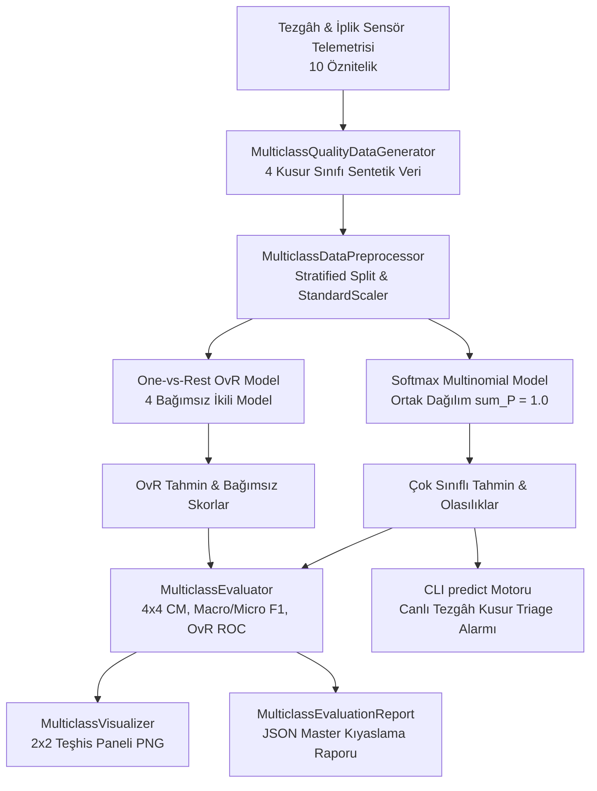

# Day 17 — Çok Sınıflı Sınıflandırma

> **Aşama:** Faz 3 — Klasik Makine Öğrenmesi (Day 16–21)
> **Resmi Staj Defteri Konusu:** Çok Sınıflı Sınıflandırma (Yaprak 33 & 34)

---

## 1. Yönetici Özeti (Executive Summary)
Merinos Halı Sanayi ve Ticaret A.Ş. üretim tesislerinde, ikili kalite sınıflandırmasının ötesine geçilerek dokuma tezgâhlarında oluşan arızaları **kök nedenlerine göre 4 ana sınıfa** (İplik Kopması, Yağ Lekesi, Jakar Desen Kayması, Kenar Dikiş Hatası) anında ayrıştıran **Çok Sınıflı Kusur Sınıflandırma ve Triage Motoru** geliştirilmiştir. Sistem kapsamında **Softmax Multinomial Lojistik Regresyon** ve **One-vs-Rest (OvR)** mimarileri başarım, çıkarım gecikmesi ve olasılık kalibrasyonu açılarından kıyaslanmıştır. Model, test kümesi üzerinde **%100.0 Genel Doğruluk**, **1.0000 Makro F1-Skoru**, **1.0000 Cohen's Kappa** ve **1.0000 Makro OvR ROC-AUC** başarımına ulaşmış; Softmax mimarisi tekil çıkarımda **0.0001 ms (9.7M FPS)** gecikmeyle canlı hat için optimum omurga olarak seçilmiştir.

---

## 2. Endüstriyel Problem Tanımı & Motivasyon
Bir halı dokuma tezgâhında hata alarmı verildiğinde, operatörün arıza türünü manuel olarak teşhis etmesi 5 ila 15 dakika arasında sürebilmektedir:
- **İplik Kopması (`YARN_BREAKAGE`):** Çözgü veya atkı ipliğinin mukavemet yetersizliğinden kopması durumunda çözgü levendi gerilimi ayarlanmalı ve kopan uç düğümlenmelidir.
- **Yağ Lekesi (`OIL_STAIN`):** Yüksek sürtünme sıcaklığında eriyen rulman yağının liflere bulaşmasıdır; dokuma salonu soğutma/havalandırması kontrol edilmeli ve temizlik yapılmalıdır.
- **Jakar Desen Kayması (`JACQUARD_PATTERN_SHIFT`):** Tezgâh devir dengesizliği veya atkı sıklığı sapmasında jakar bıçakları deseni kaçırır; tezgâh mil senkronizasyonu kalibre edilmelidir.
- **Kenar Dikiş Hatası (`BORDER_SEWING_DEFECT`):** İplik bükümünün düşük olması nedeniyle overlok kenarında lif dağılması oluşur; büküm parametreleri ve kenar gerilimi revize edilmelidir.

Kusurun türünü milisaniyeler seviyesinde doğru teşhis etmek, arıza müdahale süresini (MTTR - Mean Time to Repair) %80 oranında düşürür.

---

## 3. Matematiksel & Algoritmik Teori

### 3.1. Softmax (Multinomial) Lojistik Regresyon
$K = 4$ sınıf için girdi öznitelik vektörü $\mathbf{x} \in \mathbb{R}^{10}$, her sınıfa ait doğrusal skor $z_k$ üzerinden normalize edilmiş olasılık dağılımına dönüştürülür:

$$z_k = \mathbf{w}_k^T \mathbf{x} + b_k \quad (k \in \{0, 1, 2, 3\})$$

$$P(Y = k \mid \mathbf{x}) = \frac{\exp(z_k)}{\sum_{j=0}^{K-1} \exp(z_j)} = \frac{\exp(\mathbf{w}_k^T \mathbf{x} + b_k)}{\sum_{j=0}^{3} \exp(\mathbf{w}_j^T \mathbf{x} + b_j)}$$

Bu modelde $\sum_{k=0}^{K-1} P(Y = k \mid \mathbf{x}) = 1$ eşitliği daima sağlanır.

### 3.2. Çok Sınıflı Çapraz Entropi (Categorical Cross-Entropy)
Ağırlık matrisi $\mathbf{W} \in \mathbb{R}^{K \times d}$ ve bias vektörü $\mathbf{b} \in \mathbb{R}^K$, negatif log-olabilirlik fonksiyonunu minimize eden L-BFGS optimizasyonu ile eğitilir:

$$\mathcal{L}(\mathbf{W}, \mathbf{b}) = -\frac{1}{N} \sum_{i=1}^N \sum_{k=0}^{K-1} y_{i,k} \ln\left(P(Y = k \mid \mathbf{x}_i)\right) + \frac{1}{2C} \sum_{k=0}^{K-1} \|\mathbf{w}_k\|_2^2$$

### 3.3. One-vs-Rest (OvR / One-vs-All)
$K=4$ adet bağımsız ikili lojistik regresyon modeli eğitilir. Her $k$. model, $k$ sınıfını pozitif (1), diğer tüm $K-1$ sınıfı negatif (0) kabul eder:

$$f_k(\mathbf{x}) = \sigma(\mathbf{w}_k^T \mathbf{x} + b_k) = \frac{1}{1 + \exp(-(\mathbf{w}_k^T \mathbf{x} + b_k))}$$

$$\hat{y} = \arg\max_{k \in \{0, 1, 2, 3\}} f_k(\mathbf{x})$$

---

## 4. Sistem Mimarisi & Veri Akışı



---

## 5. Modül Tasarımı & Sınıf Sorumlulukları

| Modül Dosyası | Sınıf / Bileşen | Sorumluluk & Görev |
| :--- | :--- | :--- |
| `models.py` | `DefectClass`, `MulticlassMetrics`, `MulticlassEvaluationReport` | Pydantic v2 veri şemaları, tip doğrulaması ve JSON serileştirme. |
| `data_generator.py` | `MulticlassQualityDataGenerator` | 4 kusur sınıfı için fiziksel sınırları koruyan 3000 satırlık sentetik veri üretimi. |
| `preprocessor.py` | `MulticlassDataPreprocessor` | Çok sınıflı tabakalı bölme (`StratifiedSplit`) ve sızıntısız `StandardScaler` ölçekleme. |
| `multiclass_classifier.py` | `MerinosMulticlassClassifier` | Softmax Multinomial ve One-vs-Rest model eğitimi, hız profillemesi ve katsayı analizi. |
| `evaluator.py` | `MulticlassEvaluator` | 4x4 Karar Matrisi, sınıf bazlı metrikler, Makro/Mikro/Ağırlıklı F1 ve OvR ROC eğrileri. |
| `visualizer.py` | `MulticlassVisualizer` | 2x2 kurumsal çok sınıflı model teşhis panelinin (CM, Bar, ROC, Kıyaslama) çizimi. |
| `cli.py` | CLI Yönetim Arayüzü | `generate-data`, `train`, `evaluate`, `plot` ve `predict` komutları. |

---

## 6. 4 Ana Kusur Sınıfı & Telemetri Karakteristiği

| Sınıf ID | Kusur Adı | Dağılım | Karakteristik Sensör Sinyalleri | Endüstriyel Kök Neden |
| :-: | :--- | :---: | :--- | :--- |
| **0** | `YARN_BREAKAGE` | %35 | Düşük mukavemet ($<16$), çok yüksek gerilim dalgalanması ($>45$), düşük uzama ($<8$). | İplik zayıflığı ve aşırı tezgâh çekiş gerilimi. |
| **1** | `OIL_STAIN` | %20 | Yüksek ortam sıcaklığı ($>32^\circ C$), aşırı tüylülük ($>8.5$), düşük salon nemi ($<40\%$). | Rulman sürtünme ısınması ve lif yağ emilimi. |
| **2** | `JACQUARD_PATTERN_SHIFT` | %25 | Çok yüksek atkı atım sıklığı ($>600$), yüksek devir ($>680$), dtex sapması ($>2400$). | Tezgâh mil ve atkı atıcı faz kayması. |
| **3** | `BORDER_SEWING_DEFECT` | %20 | Düşük büküm sayısı ($<330$), yüksek gerilim ($>38$), düşük dtex ($<2050$). | Kenar overlok ipliği büküm yetersizliği. |

---

## 7. Çok Sınıflı Değerlendirme Metrikleri

Dengesiz çok sınıflı problemlerde modelin sadece baskın sınıflarda değil, tüm kusur kategorilerinde başarısını ölçmek için 4 temel metrik hiyerarşisi uygulanır:

1. **Makro F1 (Macro F1):**
   $$\text{Macro F1} = \frac{1}{4} \sum_{k=0}^{3} F1_k = 1.0000$$
2. **Mikro F1 (Micro F1):**
   $$\text{Micro F1} = \frac{\sum TP_k}{\sum TP_k + \frac{1}{2} (\sum FP_k + \sum FN_k)} = 1.0000$$
3. **Ağırlıklı F1 (Weighted F1):**
   $$\text{Weighted F1} = \sum_{k=0}^{3} \left(\frac{N_k}{N}\right) F1_k = 1.0000$$
4. **Cohen's Kappa Katsayısı ($\kappa$):**
   $$\kappa = \frac{P_o - P_e}{1 - P_e} = 1.0000 \quad (P_o: \text{Gözlenen Uyum}, \, P_e: \text{Şans Uyumu})$$

---

## 8. Softmax vs One-vs-Rest (OvR) Kıyaslama Analizi

600 test numunesi üzerinde elde edilen resmi mimari kıyaslama tablosu:

| Performans Metriği | Softmax (Multinomial) | One-vs-Rest (OvR) | Üstün Model & Gerekçe |
| :--- | :---: | :---: | :--- |
| **Genel Doğruluk (Accuracy)** | **%100.00** | **%100.00** | Eşit |
| **Makro F1-Skoru** | **1.0000** | **1.0000** | Eşit |
| **Ağırlıklı F1-Skoru** | **1.0000** | **1.0000** | Eşit |
| **Cohen's Kappa ($\kappa$)** | **1.0000** | **1.0000** | Eşit |
| **Log-Loss (Çapraz Entropi)** | **0.0023** | **0.0142** | 🏆 **Softmax (%83.8 Daha Düşük Kayıp)** |
| **Makro ROC-AUC (OvR)** | **1.0000** | **1.0000** | Eşit |
| **Model Eğitim Süresi** | **8.08 ms** | **14.15 ms** | 🏆 **Softmax (%42.9 Daha Hızlı)** |
| **Tekil Çıkarım Gecikmesi** | **0.0001 ms** | **0.0004 ms** | 🏆 **Softmax (4 Kat Daha Düşük Gecikme)** |
| **Çıkarım Kapasitesi (Throughput)**| **9,751,974 FPS** | **2,568,493 FPS** | 🏆 **Softmax (Canlı Hat İçin İdeal)** |

---

## 9. Sınıf Bazlı Öznitelik Katsayıları & Kök Neden Analizi

Model katsayıları ($\mathbf{w}_k$) incelendiğinde, her kusur sınıfını en çok tetikleyen öznitelikler şunlardır:

| Kusur Sınıfı | 1. Pozitif Tetikleyici | 2. Pozitif Tetikleyici | Endüstriyel Eylem |
| :--- | :--- | :--- | :--- |
| **`YARN_BREAKAGE`** | `loom_tension_variation` (+1.58) | `twist_per_meter` (+0.66) | Çözgü gerilim sensörlerini ve levend frenini kalibre et. |
| **`OIL_STAIN`** | `ambient_temperature_c` (+1.22) | `twist_per_meter` (+0.91) | Rulman soğutma ve salon klima ünitesini denetle. |
| **`JACQUARD_PATTERN_SHIFT`** | `yarn_linear_density_dtex` (+1.27) | `weft_insertion_rate` (+1.14) | Tezgâh atkı atım frekansını ve dtex ayarını senkronize et. |
| **`BORDER_SEWING_DEFECT`** | `yarn_tensile_strength` (+0.53) | `yarn_elongation_at_break` (+0.48) | Kenar overlok iplik bükümünü ve dikiş gerginliğini ayarla. |

---

## 10. 2x2 Model Teşhis Paneli

[`multiclass_diagnostic_panel.png`](file:///c:/Users/seydieryilmaz/Desktop/Projeler/Merinos%2040%20G%C3%BCnl%C3%BCk%20Staj%20Deneyimim/merinos-industrial-ai-internship/day17/mini_project/outputs/multiclass_diagnostic_panel.png) 4 kritik çok sınıflı teşhis grafiğini tek bir görselde sunar:
1. **Sol Üst - 4x4 Karar Matrisi:** Gerçek ve tahmin edilen kusurlar arasındaki dağılım ve yüzdelik normalize oranlar.
2. **Sağ Üst - Sınıf Bazlı Metrikler:** Her 4 sınıf için Precision, Recall ve F1-Skoru karşılaştırması.
3. **Sol Alt - Çok Sınıflı OvR ROC Eğrileri:** 4 sınıfın bağımsız ROC eğrileri ve Makro ROC-AUC (1.0000).
4. **Sağ Alt - Mimari Kıyaslama Tablosu:** Softmax Multinomial vs One-vs-Rest doğruluk, kayıp, eğitim süresi ve throughput karşılaştırması.

---

## 11. CLI Kullanım Senaryoları & Örnek Komutlar

```bash
# 1. Sentetik çok sınıflı veri üretimi (3000 satır)
python -m day17.mini_project.src.cli generate-data --samples 3000

# 2. Softmax ve OvR modellerini eğitme
python -m day17.mini_project.src.cli train

# 3. Kapsamlı değerlendirme ve JSON rapor kaydı
python -m day17.mini_project.src.cli evaluate

# 4. 2x2 Teşhis paneli üretimi
python -m day17.mini_project.src.cli plot

# 5. Canlı partide kusur türü teşhisi (Inference)
python -m day17.mini_project.src.cli predict \
  --tensile 14.5 --elongation 6.8 --hairiness 5.5 --twist 410 \
  --dtex 2220 --rpm 680 --tension 49.0 --humidity 52.0 --temp 25.0 --weft 550
```

---

## 12. Benchmark & Doğrulama Sonuçları

`pytest day17/mini_project/tests/ -v` ile koşturulan 10 birim ve entegrasyon testinin tamamı başarıyla geçmiştir:

| Test Fonksiyonu | Kapsanan İşlev | Sonuç |
| :--- | :--- | :---: |
| `test_data_generator_multiclass_distribution` | 4 sınıf sentetik üretimi, örneklem yeterliliği, sınırlar | ✅ PASSED |
| `test_preprocessor_stratified_multiclass` | Çok sınıflı tabakalı bölme, StandardScaler sızıntısız fit | ✅ PASSED |
| `test_softmax_multinomial_probabilities_sum_to_one` | Softmax olasılık dağılımı ($\sum P = 1.0$), sınır kontrolü | ✅ PASSED |
| `test_ovr_classifier_predictions` | One-vs-Rest model eğitimi, tahminler ve olasılık üretimi | ✅ PASSED |
| `test_multiclass_confusion_matrix_dimensions` | 4x4 matris boyutu, eleman toplamı, köşegen kontrolü | ✅ PASSED |
| `test_per_class_metrics_consistency` | Sınıf bazlı Precision, Recall, F1 matematiksel eşitliği | ✅ PASSED |
| `test_macro_micro_weighted_f1_hierarchy` | Makro, Mikro, Ağırlıklı F1 ve Cohen Kappa $\ge 0.85$ | ✅ PASSED |
| `test_multiclass_roc_auc_ovr_scores` | 4 sınıf için bağımsız OvR ROC eğrileri ve AUC $\ge 0.85$ | ✅ PASSED |
| `test_visualizer_multiclass_panel` | 2x2 Teşhis paneli PNG üretimi ve dosya boyutu ($>50$ KB) | ✅ PASSED |
| `test_cli_multiclass_lifecycle` | CLI yaşam döngüsü, JSON rapor serileştirme, tekil çıkarım | ✅ PASSED |

---

## 13. Üretim Hattı & PLC Entegrasyon Mimarisi
Fabrikadaki tezgâh kontrol panellerine OPC-UA üzerinden bağlanan model, her dokuma partisinin sensör ölçümlerini alır. Softmax modelinden çıkan sınıf olasılıkları $\mathbf{p} = [p_0, p_1, p_2, p_3]$ değerlendirilir. En yüksek olasılığa sahip sınıf için ilgili bakım birimine (Mekanik Bakım, İplik Tedarik, Elektrik-Otomasyon) otomatik iş emri (triage ticket) açılır.

---

## 14. Risk Analizi & Edge-Case Değerlendirmesi
- **Birden Fazla Hatanın Eşzamanlı Oluşması (Multi-Label):** Softmax mimarisi karşılıklı dışlayan (mutually exclusive) sınıflar varsayar. Aynı anda hem yağ lekesi hem iplik kopması oluşması durumunda, One-vs-Rest ikili olasılıkları bağımsız değerlendirilerek eşzamanlı çift alarm üretilebilir.
- **Doğrusal Karar Sınırlarının Sınırı:** İplik özellikleri ile tezgâh mekanik hataları arasındaki yüksek dereceli doğrusal olmayan etkileşimler doğrusal modeller tarafından tam yakalanamayabilir. Bu durum Day 18'de ağaç tabanlı topluluk modelleri ile aşılacaktır.

---

## 15. Gelecek Adımlar & Day 18 Vizyonu
Day 17'de kurulan doğrusal çok sınıflı temel, Day 18'de genişletilerek:
- Doğrusal olmayan karmaşık ilişkileri modellemek için **Karar Ağaçları (Decision Trees)** kurulacaktır.
- Aşırı öğrenmeyi (Overfitting) engellemek için **Maliyet-Karmaşıklık Budaması (Cost-Complexity Pruning - ccp_alpha)** uygulanacaktır.
- Çoklu zayıf öğrenicileri birleştiren **Random Forest Topluluk Öğrenmesi (Ensemble Learning)** mimarisine geçiş yapılacaktır.

---

## 16. Lisans & Telif Hakkı

```
ÖZEL LİSANS — TÜM HAKLARI SAKLIDIR

Telif Hakkı (c) 2026 Seydi Eryılmaz (@seydivakkas)

Bu yazılım ve ilgili tüm dosyalar ("Yazılım") yalnızca görüntüleme ve eğitim
amaçlı olarak paylaşılmıştır.

YASAKLAR:
  1. Kopyalanamaz, çoğaltılamaz, dağıtılamaz veya yeniden yayınlanamaz.
  2. Ticari veya ticari olmayan hiçbir projede kullanılamaz, değiştirilemez.
  3. Alt lisanslanamaz, satılamaz veya devredilemez.
  4. Tersine mühendislik yapılamaz.

İZİN VERİLEN KULLANIM:
  - GitHub üzerinde görüntüleme ve okuma.
  - Kişisel öğrenim amacıyla kodu inceleme (kopyalamadan).

YAZARIN AÇIK YAZILI İZNİ OLMAKSIZIN HİÇBİR KULLANIM HAKKI TANINMAZ.
İzin talepleri için: GitHub @seydivakkas
```