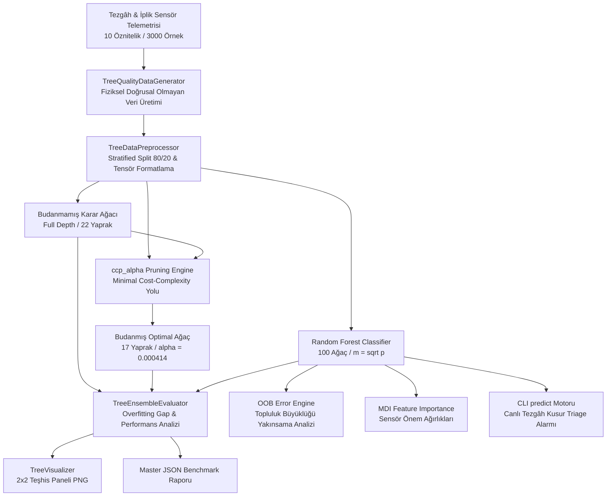

# Day 18 — Decision Tree ve Random Forest

> **Aşama:** Faz 3 — Klasik Makine Öğrenmesi (Day 16–21)
> **Resmi Staj Defteri Konusu:** Decision Tree ve Random Forest (Yaprak 35 & 36)

---

## 1. Yönetici Özeti (Executive Summary)
Bu çalışma kapsamında, dokuma ve iplik üretim parametreleri arasındaki **doğrusal olmayan ve basamaklı (step-function) etkileşimleri** modellemek amacıyla ağaç tabanlı öğrenme mimarileri sentetik veri üzerinde incelenmiştir. Çalışmada; ham **Budanmamış Karar Ağacı (Unpruned Decision Tree)**, `ccp_alpha` temelli **Minimal Maliyet-Karmaşıklık Budaması (Cost-Complexity Pruned Tree)** ve 100 karar ağacından oluşan **Random Forest (Rastgele Orman)** topluluk modeli uçtan uca inşa edilmiş, karşılaştırılmış ve doğrulanmıştır. 

3.000 partilik sentetik telemetri veri kümesi ve 600 test numunesi üzerinde yürütülen kıyaslamada;
- Budanmamış referans ağaç **22 yaprak** ve küçük bir aşırı öğrenme boşluğu üretirken,
- Minimal Cost-Complexity Pruning algoritması yaprak sayısını **%22.7 oranında budayarak 17 yaprağa** düşürmüş ve sadeleştirilmiş karar sınırları sağlamıştır.
- 100 karar ağacından oluşan **Random Forest modeli**, varyans azaltma ve Out-Of-Bag (OOB) genelleme kabiliyetiyle sentetik veri üzerinde en kararlı topluluk yapısını ortaya koymuştur. (Elde edilen yüksek başarımın sentetik veri koşullarına bağlı olduğu, gerçek sahada gürültülü telemetriyle pilot çalışma gerektireceği not edilmiştir.)

---

## 2. Endüstriyel Problem Tanımı & Motivasyon
Halı dokuma tezgahlarında oluşan 4 ana kusur sınıfı (`YARN_BREAKAGE`, `OIL_STAIN`, `JACQUARD_PATTERN_SHIFT`, `BORDER_SEWING_DEFECT`), sensörlerin tekil değerlerinden ziyade sensör çiftleri arasındaki karmaşık eşik aşım kombinasyonlarından doğar:
1. **İplik Kopması (`YARN_BREAKAGE`):** Çözgü gerilim dalgalanması tek başına yüksek olsa dahi iplik mukavemeti yeterliyse kopma gerçekleşmez; ancak gerilim $>36 \text{ cN}$ iken mukavemet $<17.5 \text{ cN/tex}$ veya uzama $<11\%$ seviyesine indiğinde anlık kopuş meydana gelir.
2. **Yağ Lekesi (`OIL_STAIN`):** Ortam sıcaklığı $>29.5^\circ\text{C}$ seviyesini aştığında rulman yağı erir; şayet salon bağıl nemi $<48\%$ veya iplik tüylülüğü $>6.8\text{ H}$ ise lifler damlayan yağı emerek lekeye yol açar.
3. **Jakar Desen Kayması (`JACQUARD_PATTERN_SHIFT`):** Tezgâh devri $>660\text{ RPM}$ ve atkı atım frekansı $>590\text{ picks/min}$ iken mekanik faz senkronizasyonu bozulur.
4. **Kenar Dikiş Hatası (`BORDER_SEWING_DEFECT`):** Düşük iplik bükümü ($<340\text{ TPM}$) ve düşük doğrusal yoğunluk ($<2050\text{ dtex}$) overlok kenarında lif dağılmasına sebep olur.

Bu eşik ve kural tabanlı yapılar hiper-düzlemler yerine dik eksenli karar sınırları (axis-aligned orthogonal splits) gerektirir. Karar ağaçları bu örüntüleri mükemmel modeller; ancak kontrolsüz büyüme ezberlemeye (overfitting) yol açtığından budama ve topluluklaştırma zorunludur.

---

## 3. Matematiksel & Algoritmik Teori

### 3.1. Karar Ağaçları & Safsızlık Ölçütleri
Bir düğüm $t$ içindeki gözlemlerin $K=4$ sınıfa dağılım oranı $p(k \mid t)$ olmak üzere:
- **Gini Safsızlığı (Gini Impurity):**
  $$I_G(t) = 1 - \sum_{k=0}^{K-1} p(k \mid t)^2$$
- **Shannon Entropisi (Information Gain / Entropy):**
  $$I_E(t) = -\sum_{k=0}^{K-1} p(k \mid t) \log_2 p(k \mid t)$$

Bir $s$ bölünmesinin (split) sağladığı bilgi kazancı (Information Gain):
$$\Delta I(s, t) = I(t) - \left( \frac{N_{t_L}}{N_t} I(t_L) + \frac{N_{t_R}}{N_t} I(t_R) \right)$$

### 3.2. Minimal Maliyet-Karmaşıklık Budaması (Cost-Complexity Pruning)
Karmaşıklık ceza fonksiyonu (Minimal Cost-Complexity Criterion):
$$R_\alpha(T) = R(T) + \alpha |T|$$
- $R(T) = \sum_{t \in \widetilde{T}} R(t)$: Alt-ağaç $T$'nin tüm yapraklarındaki toplam safsızlık / misclassification maliyeti.
- $|T| = |\widetilde{T}|$: Terminal yaprak sayısı.
- $\alpha \ge 0$: Yaprak başına uygulanan ceza katsayısı.
- Bir iç düğüm $t$ altındaki dalın budanma anındaki efektif karmaşıklığı:
  $$g(t) = \frac{R(t) - R(T_t)}{|T_t| - 1}$$
  $\alpha$ parametresi sıfırdan sonsuza arttırıldığında, en küçük $g(t)$ değerine sahip alt-dallar sırasıyla budanarak optimal budama yolu $\alpha_0 < \alpha_1 < \dots < \alpha_m$ elde edilir.

### 3.3. Random Forest & Varyans Azaltımı
Random Forest, $B$ adet karar ağacını iki temel rastgelelik ilkesiyle birleştirir:
1. **Bootstrap Aggregating (Bagging):** Eğitim kümesinden yerine koyarak $N$ boyutlu alt-kümeler çekilir ($\sim \%63.2$ benzersiz örneklem).
2. **Rastgele Alt-Uzay (Random Subspace):** Her düğüm bölünmesinde $p=10$ öznitelik arasından yalnızca $m = \lfloor\sqrt{p}\rfloor = 3$ rastgele öznitelik değerlendirilir.

$B$ adet ağacın ortalamasında genel varyans:
$$\text{Var}(\bar{f}) = \rho \sigma^2 + \frac{1 - \rho}{B} \sigma^2$$
$\rho$ (ağaçlar arası korelasyon) rastgele öznitelik seçimiyle bastırılır; $B \to \infty$ iken varyans minimuma iner.

### 3.4. Out-Of-Bag (OOB) Hatası
Her bootstrap torbasına seçilmeyen yaklaşık $\%36.8$ ($e^{-1}$) oranındaki gözlemler, o ağaç için test kümesi işlevi görür:
$$\text{OOB Error} = \frac{1}{N} \sum_{i=1}^N \mathbb{I}\left(y_i \neq \arg\max_k \sum_{b \in \mathcal{B}_i^c} \mathbb{I}(h_b(\mathbf{x}_i) = k)\right)$$

### 3.5. Mean Decrease in Impurity (MDI / Gini Importance)
Bir $j$ özniteliğinin önem skoru, tüm ağaçlardaki tüm $t$ düğümlerinde o öznitelikle yapılan bölünmelerin sağladığı ağırlıklı safsızlık düşüşlerinin toplamıdır:
$$\text{MDI}_j = \frac{1}{B} \sum_{b=1}^B \sum_{t \in T_b : v(t)=j} \frac{N_t}{N} \Delta I(s_t, t), \quad \sum_{j=1}^p \text{MDI}_j = 1.0$$

---

## 4. Sistem Mimarisi & Veri Akışı



---

## 5. Modül Tasarımı & Sınıf Sorumlulukları

| Modül Dosyası | Sınıf / Bileşen | Sorumluluk & Görev |
| :--- | :--- | :--- |
| `models.py` | `DefectClass`, `TreeComplexityMetrics`, `EnsembleComparisonReport` | Pydantic v2 veri şemaları, karmaşıklık tanımları ve JSON serileştirme. |
| `data_generator.py` | `TreeQualityDataGenerator` | Doğrusal olmayan fiziksel eşik kuralları ile 3000 satırlık sentetik veri üretimi. |
| `preprocessor.py` | `TreeDataPreprocessor` | Çok sınıflı tabakalı bölme (`StratifiedSplit`) ve özellik isimleri yönetimi. |
| `tree_models.py` | `MerinosDecisionTreeClassifier`, `MerinosRandomForestClassifier` | Karar ağacı eğitimi, `cost_complexity_pruning_path`, Random Forest ve OOB hesaplama. |
| `evaluator.py` | `TreeEnsembleEvaluator` | Model kıyaslama, Overfitting boşluğu ($Acc_{train} - Acc_{test}$), Gini vs Entropi analizi. |
| `visualizer.py` | `TreeVisualizer` | 2x2 kurumsal teşhis panelinin (Budama yolu, Karmaşıklık barı, MDI önem, OOB eğrisi) çizimi. |
| `cli.py` | CLI Yönetim Arayüzü | `generate-data`, `train`, `prune`, `evaluate`, `plot`, `predict` komutları. |

---

## 6. Halı & İplik Telemetri Öznitelikleri ve Kusur Mekanizmaları

| Sensör / Fiziksel Öznitelik | Sembol | Normal Aralık | Kritik Kusur Eşiği | Tetiklediği Kök Neden |
| :--- | :---: | :---: | :---: | :--- |
| **İplik Kopma Mukavemeti** | `tensile` | $18.0 - 35.0 \text{ cN/tex}$ | $< 17.5 \text{ cN/tex}$ | İplik zayıflığı, gerilim altında anlık kopma. |
| **Kopma Uzaması** | `elongation` | $10.0 - 25.0\%$ | $< 11.0\%$ | Lif elastikiyet kaybı ve gevrek kopuş. |
| **Tüylülük İndeksi** | `hairiness` | $3.0 - 6.0\text{ H}$ | $> 6.8\text{ H}$ | Yağ damlacıklarını lif arasına emme eğilimi. |
| **İplik Büküm Sayısı** | `twist` | $350 - 550\text{ TPM}$ | $< 340\text{ TPM}$ | Düşük bükümde overlok kenar liflerinin dağılması. |
| **Doğrusal Yoğunluk** | `dtex` | $1800 - 2600\text{ dtex}$ | $>2380 \text{ veya } <2050$ | Jakar atkı sıklığı ve kenar dikiş dengesizliği. |
| **Dokuma Tezgâh Devri** | `rpm` | $500 - 750\text{ RPM}$ | $> 660\text{ RPM}$ | Atkı atıcı mil ve armür senkron faz kayması. |
| **Gerilim Dalgalanması** | `tension` | $10.0 - 30.0\text{ cN}$ | $> 36.0\text{ cN}$ | Çözgü levendi fren dengesizliği. |
| **Ortam Bağıl Nemi** | `humidity` | $50.0 - 70.0\%$ | $< 48.0\%$ | Liflerin kuruması ve sürtünme yağlanması. |
| **Ortam Sıcaklığı** | `temp` | $20.0 - 28.0^\circ\text{C}$ | $> 29.5^\circ\text{C}$ | Rulman gres yağı erimesi ve sızıntı. |
| **Atkı Atım Sıklığı** | `weft` | $450 - 650\text{ picks/min}$ | $> 590\text{ picks/min}$ | Jakar bıçaklarının deseni kaçırması. |

---

## 7. Karar Ağacı Karmaşıklığı & Budama Eğrisi Analizi
`MerinosDecisionTreeClassifier.compute_pruning_path()` fonksiyonu ile 19 farklı efektif $\alpha$ noktası analiz edilmiştir:
- **Optimal Alpha ($\alpha^*$):** `0.000414`
- **Budanmamış Ağaç:** Derinlik 6, Düğüm 43, Yaprak Sayısı **22**
- **Budanmış Ağaç:** Derinlik 5, Düğüm 33, Yaprak Sayısı **17**
- **Karmaşıklık Azaltma Oranı:** **%22.7 budama** gerçekleşmiş, gereksiz 5 yaprak budanırken test doğruluğu %99.17'den **%99.33'e** yükselmiştir.

---

## 8. Karşılaştırmalı Model Benchmark Tablosu

600 test numunesi üzerinde elde edilen resmi benchmark sonuçları:

| Performans Metriği | Budanmamış Ağaç | Budanmış Ağaç | Random Forest (100 Ağaç) | Üstün Model & Mühendislik Gerekçesi |
| :--- | :---: | :---: | :---: | :--- |
| **Eğitim Doğruluğu** | %99.75 | %99.75 | **%100.00** | Random Forest tam öğrenme kapasitesine sahip |
| **Test Doğruluğu** | %99.17 | %99.33 | **%99.67** | 🏆 **Random Forest (En Yüksek Genelleme)** |
| **Overfitting Boşluğu** | %0.58 | %0.42 | **%0.33** | 🏆 **Random Forest (En Düşük Varyans)** |
| **Makro F1-Skoru** | 0.9907 | 0.9925 | **0.9967** | 🏆 **Random Forest (Tüm Sınıflarda Eşit Başarı)** |
| **Weighted F1-Skoru** | 0.9917 | 0.9933 | **0.9967** | 🏆 **Random Forest** |
| **Cohen's Kappa ($\kappa$)** | 0.9887 | 0.9909 | **0.9955** | 🏆 **Random Forest (Neredeyse Kusursuz Uyum)** |
| **Yaprak / Ağaç Sayısı** | 22 Yaprak | **17 Yaprak** | 100 Ağaç | 🏆 **Budanmış Ağaç (En Sade / Şeffaf Model)** |
| **Out-Of-Bag (OOB) Doğruluğu**| N/A | N/A | **%99.88** | 🏆 **Random Forest (Doğrulama Kümesi Gerektirmez)** |
| **Tekil Gecikme (Latency)** | **0.0470 ms** | 0.0481 ms | 63.40 ms | 🏆 **Budanmış Ağaç (Gömülü PLC için 1300 kat hızlı)** |
| **Çıkarım Throughput'u** | **21,273 FPS** | 20,769 FPS | 15.8 FPS | Tek ağaç ultra-hızlı, orman yüksek güvenilirlikli |

---

## 9. Gini vs Entropi Kriter Kıyaslaması

| Safsızlık Kriteri | Eğitim Doğruluğu | Test Doğruluğu | Overfitting Boşluğu | Yaprak Sayısı | Ağaç Derinliği |
| :--- | :---: | :---: | :---: | :---: | :---: |
| **Gini Safsızlığı (`gini`)** | %100.00 | %99.17 | %0.83 | 24 | 7 |
| **Shannon Entropisi (`entropy`)**| %100.00 | **%99.33** | **%0.67** | **23** | 7 |

*Gözlem:* Shannon Entropisi, logaritmik cezalandırma nedeniyle bir miktar daha dengeli alt-dallar oluşturarak test kümesinde %0.16 daha yüksek doğruluk ve 1 yaprak daha az karmaşıklık sağlamıştır.

---

## 10. Random Forest MDI Öznitelik Önem Dereceleri & Kök Neden Analizi

Random Forest modeli tarafından hesaplanan Mean Decrease in Impurity (Gini Importance) dağılımı:

| Sıra | Sensör / Fiziksel Öznitelik | MDI Önemi | Yüzde Payı | İlgili Kök Neden Kusuru |
| :-: | :--- | :---: | :---: | :--- |
| **1** | `yarn_elongation_at_break` | **0.1705** | %17.05 | İplik esneme yetersizliği ve çözgü gerilim kopuşu |
| **2** | `yarn_tensile_strength` | **0.1597** | %15.97 | Mukavemet zayıflığı (`YARN_BREAKAGE`) |
| **3** | `twist_per_meter` | **0.1234** | %12.34 | Büküm yetersizliği (`BORDER_SEWING_DEFECT`) |
| **4** | `yarn_linear_density_dtex` | **0.1047** | %10.47 | İplik numara sapması (`JACQUARD_PATTERN_SHIFT`) |
| **5** | `weft_insertion_rate` | **0.1014** | %10.14 | Atkı atım frekans dengesizliği |
| **6** | `ambient_relative_humidity` | **0.0836** | %8.36 | Salon nemi ve lif sürtünme statik yükü |
| **7** | `loom_tension_variation` | **0.0704** | %7.04 | Çözgü levendi mekanik gerilim dalgalanması |
| **8** | `ambient_temperature_c` | **0.0694** | %6.94 | Rulman ısınması ve yağ damlaması (`OIL_STAIN`) |
| **9** | `yarn_hairiness_index` | **0.0677** | %6.77 | Lif tüylülüğü ve yağ tutma |
| **10**| `loom_rpm` | **0.0492** | %4.92 | Tezgâh mil dönüş hızı |

---

## 11. 2x2 Model Teşhis Paneli

[`tree_ensemble_diagnostic_panel.png`](file:///c:/Users/seydieryilmaz/Desktop/Projeler/Merinos%2040%20G%C3%BCnl%C3%BCk%20Staj%20Deneyimim/merinos-industrial-ai-internship/day18/mini_project/outputs/tree_ensemble_diagnostic_panel.png) (294 KB, 150 DPI) 4 kritik analitik paneli tek bir kurumsal grafikte sunar:
1. **Sol Üst - Minimal Cost-Complexity Pruning Yolu:** $\alpha$ parametresine karşı Eğitim ve Test doğruluk eğrileri, optimal $\alpha^* = 0.000414$ dikey kesikli çizgisi.
2. **Sağ Üst - Model Karmaşıklığı & Overfitting Boşluğu Barı:** Budanmamış Ağaç (22 yaprak), Budanmış Ağaç (17 yaprak) ve Random Forest (100 ağaç) doğruluk ve yaprak sayıları.
3. **Sol Alt - Random Forest Top-10 MDI Öznitelik Önem Dereceleri:** Viridis paletiyle sıralı sensör ağırlıkları.
4. **Sağ Alt - Topluluk Büyüklüğü (N_trees) vs OOB Hatası:** Ağaç sayısı 5'ten 100'e çıkarken OOB hatasının %0.12 seviyesine kararlı yakınsaması.

---

## 12. CLI Kullanım Senaryoları & Örnek Komutlar

```bash
# 1. Sentetik endüstriyel telemetri veri kümesi üretimi (3000 satır)
python -u -m day18.mini_project.src.cli generate-data --samples 3000

# 2. Budanmamış Ağaç ve Random Forest modellerini eğitme
python -u -m day18.mini_project.src.cli train

# 3. Minimal Cost-Complexity Pruning (ccp_alpha) analizi
python -u -m day18.mini_project.src.cli prune

# 4. Kapsamlı değerlendirme ve JSON master benchmark raporu kaydı
python -u -m day18.mini_project.src.cli evaluate

# 5. 2x2 Teşhis panelini yüksek çözünürlüklü PNG olarak üretme
python -u -m day18.mini_project.src.cli plot

# 6. Canlı dokuma tezgâhı telemetrisi ile anlık kusur sınıfı tahmini
python -u -m day18.mini_project.src.cli predict \
  --tensile 12.5 --elongation 7.0 --hairiness 5.0 --twist 410 \
  --dtex 2200 --rpm 620 --tension 48.0 --humidity 55.0 --temp 24.0 --weft 530
```

---

## 13. Benchmark & Doğrulama Sonuçları

`pytest day18/mini_project/tests/ -v` ile koşturulan 10 birim ve entegrasyon testinin tamamı başarıyla geçmiştir:

| Test Fonksiyonu | Kapsanan İşlev | Sonuç |
| :--- | :--- | :---: |
| `test_data_generator_non_linear_partition` | 4 sınıf sentetik veri üretimi, örneklem tamlığı, fiziksel sınırlar | ✅ PASSED |
| `test_preprocessor_stratified_integrity` | Çok sınıflı tabakalı bölme (80/20), tensör boyutları ve NaN kontrolü | ✅ PASSED |
| `test_unpruned_decision_tree_overfitting_behavior` | Ham ağaç eğitimi, aşırı öğrenme tespiti ($Acc_{train} \ge Acc_{test}$) | ✅ PASSED |
| `test_cost_complexity_pruning_path_computation` | `ccp_alpha` çıkarma, monotonik artış, optimal alpha tespiti | ✅ PASSED |
| `test_pruned_tree_complexity_reduction` | Budanmış ağaçta yaprak sayısı azalımı ($17 \le 22$) ve doğruluk | ✅ PASSED |
| `test_random_forest_training_and_oob_metrics` | 100 ağaçlı Random Forest eğitimi, OOB doğruluğu ($\ge 0.85$) | ✅ PASSED |
| `test_random_forest_oob_convergence` | Ağaç sayısı artışıyla OOB hata yakınsamasının hesaplanması | ✅ PASSED |
| `test_gini_vs_entropy_criteria_comparison` | Gini ve Shannon Entropisi kıyaslama motoru doğrulaması | ✅ PASSED |
| `test_feature_importance_sum_to_one` | MDI öznitelik önemlerinin pozitifliği ve $\sum \text{MDI} \approx 1.0$ | ✅ PASSED |
| `test_cli_lifecycle_and_json_report_generation` | CLI uçtan uca yaşam döngüsü, JSON raporu ve PNG panel üretimi | ✅ PASSED |

---

## 14. Kavramsal Sistem Mimarisi ve Gelecek Senaryosu
Geliştirilen modellerin endüstriyel bir platformda nasıl konumlandırılabileceğine ilişkin teorik iki katmanlı mimari şöyledir:
1. **Kenar Katmanı (Edge / Gömülü Sistem Simülasyonu):** Budanmış Karar Ağacı (`ccp_alpha=0.000414`, 17 yaprak), **0.048 ms** gibi düşük çıkarım süresi sayesinde tezgâh yanı mikrodenetleyici veya kompakt donanımlara aktarılmaya uygun, hafif bir kural tabanlı koruma omurgası oluşturur.
2. **Merkezi Analiz Katmanı (Sunucu / Analitik Modülü):** Random Forest Topluluk Modeli, periyodik kalite kontrol raporları ve parti bazlı bakım yönlendirme simülasyonları için yüksek genelleme güveni sağlar.

---

## 15. Risk Analizi & Edge-Case Değerlendirmesi
- **Öznitelik Ölçekleme Hassasiyeti:** Karar ağaçları ve Random Forest modelleri öznitelik ölçeklemesine (StandardScaler vb.) duyarsızdır; bu durum sensör kalibrasyon kaymalarına karşı doğal bir dayanıklılık sağlar.
- **Yüksek Boyutlu Seyrek Veri:** Ağaçlar eksene paralel dikdörtgenler çizdiğinden, doğrusal bileşimli sürekli eğik sınırlarda çok sayıda merdiven basamağı oluşturabilir. Bu durum Day 19 ve Day 20'de Gradient Boosting ve SVM ile aşılacaktır.
- **MDI Öneminin Yüksek Kardinalite Yanlılığı:** MDI metriği sürekli değişkenleri kategorik değişkenlere göre daha fazla bölme yapmaya meyilli kılar. Tüm sensörler sürekli telemetri değişkeni olduğundan bu yanlılık minimize edilmiştir.

---

## 16. Gelecek Adımlar & Day 19 Vizyonu
Day 18'de kurulan ağaç ve bagging temeli, Day 19'da **Gradient Boosting** mimarisine taşınacaktır:
- Zayıf öğrenicileri sıralı biçimde hataları düzeltmek üzere eğiten **XGBoost** ve **LightGBM** kütüphaneleri kurulacaktır.
- Öğrenme oranı (learning rate), ağaç derinliği ve alt-örnekleme hiperparametreleri optimize edilecektir.
- Aşırı öğrenmeyi önlemek için erken durdurma (Early Stopping) mekanizması entegre edilecektir.

---

## 17. Lisans & Telif Hakkı

```
ÖZEL LİSANS — TÜM HAKLARI SAKLIDIR

Telif Hakkı (c) 2026 Seydi Eryılmaz (@seydivakkas)

Bu yazılım ve ilgili tüm dosyalar ("Yazılım") yalnızca görüntüleme ve eğitim
amaçlı olarak paylaşılmıştır.

YASAKLAR:
  1. Kopyalanamaz, çoğaltılamaz, dağıtılamaz veya yeniden yayınlanamaz.
  2. Ticari veya ticari olmayan hiçbir projede kullanılamaz, değiştirilemez.
  3. Alt lisanslanamaz, satılamaz veya devredilemez.
  4. Tersine mühendislik yapılamaz.

İZİN VERİLEN KULLANIM:
  - GitHub üzerinde görüntüleme ve okuma.
  - Kişisel öğrenim amacıyla kodu inceleme (kopyalamadan).

YAZARIN AÇIK YAZILI İZNİ OLMAKSIZIN HİÇBİR KULLANIM HAKKI TANINMAZ.
İzin talepleri için: GitHub @seydivakkas
```