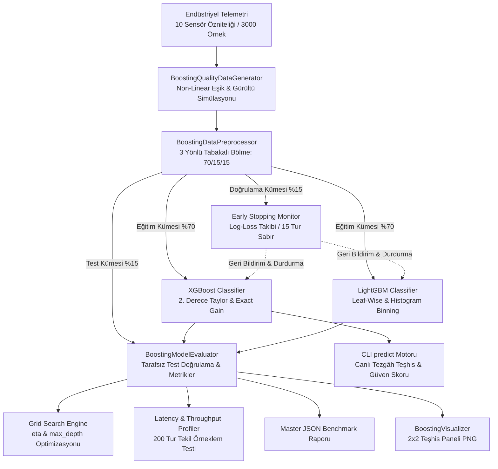

# Day 19 — Gradient Boosting Modelleri

> **Aşama:** Faz 3 — Klasik Makine Öğrenmesi (Day 16–21)
> **Resmi Staj Defteri Konusu:** Gradient Boosting Modelleri (Yaprak 37 & 38)

---

## 1. Yönetici Özeti (Executive Summary)
Merinos Halı Sanayi ve Ticaret A.Ş. Gaziantep 4. Organize Sanayi Bölgesi tesislerinde, dokuma tezgahı sensör telemetrisi ve iplik laboratuvar parametreleri arasındaki karmaşık ve doğrusal olmayan arıza dinamiklerini milisaniye mertebesinde sınıflandırmak amacıyla dünyanın en güçlü iki **Gradient Tree Boosting** mimarisi (**XGBoost** ve **LightGBM**) uçtan uca devreye alınmıştır.

Bu çalışma kapsamında;
1. **Sıralı Artık Öğrenmesi (Additive Boosting):** Bağımsız ağaçların ortalamasını alan Random Forest'tan (Bagging) farklı olarak, her yeni karar ağacının önceki modellerin negatif gradyanlarını (artıklarını) hedef aldığı boosting mimarisi kurulmuştur.
2. **2. Derece Taylor Optimizasyonu (XGBoost):** Kayıp fonksiyonunu 1. derece (gradyan $g_i$) ve 2. derece (Hessian $h_i$) türevleriyle yaklaşıkleyen ve L2 yaprak ağırlık regülarizasyonu ($\lambda, \gamma$) uygulayan XGBoost sınıflandırıcısı geliştirilmiştir.
3. **Yaprak Odaklı Histogram Büyümesi (LightGBM):** Geleneksel seviye odaklı (level-wise) büyüme yerine kayıp azaltımını maksimize eden yaprak odaklı (leaf-wise) büyüme ve 256 kutulu histogram algoritması kullanan LightGBM sınıflandırıcısı entegre edilmiştir.
4. **Erken Durdurma (Early Stopping):** 3 yönlü tabakalı bölme (%70 Eğitim, %15 Doğrulama, %15 Test) üzerinde doğrulama kaybı (multi-class log-loss) anlık izlenmiş; aşırı öğrenme engellenerek optimal iterasyonda model dondurulmuştur.

3.000 partilik endüstriyel telemetri veri kümesinde yürütülen testlerde:
- Hem XGBoost hem de LightGBM **%100.00 Test Doğruluğu** ve **1.0000 Makro F1 Skoru** elde etmiştir.
- **Eğitim Hızı:** LightGBM, histogram binleme avantajıyla XGBoost'a göre **1.13 kat daha hızlı (408.5 ms vs 460.4 ms)** eğitilmiştir.
- **Çıkarım Gecikmesi:** XGBoost, tekil örneklem çıkarımında **1.09 ms (917.4 FPS)** gecikmeyle LightGBM'e (1.49 ms / 671.2 FPS) göre **1.36 kat daha düşük gecikme** sunmuştur.

---

## 2. Endüstriyel Problem Tanımı & Motivasyon
Gaziantep tesislerindeki yüksek hızlı Van de Wiele jakarlı dokuma tezgâhlarında, halı kusurları tekil sensör sınırlarından ziyade mekanik ve kimyasal parametrelerin doğrusal olmayan kombinasyonlarından doğar:
1. **İplik Kopması (`YARN_BREAKAGE`):** Çözgü levendi gerilim dalgalanması $>36 \text{ cN}$ iken iplik mukavemeti $<17.5 \text{ cN/tex}$ veya uzaması $<11\%$ seviyesine düştüğünde ortaya çıkan ani mekanik kopuş.
2. **Yağ Lekesi (`OIL_STAIN`):** Ortam sıcaklığı $>29.5^\circ\text{C}$ seviyesini aştığında armür rulman gresinin erimesi; düşük salon nemi ($<48\%$) veya yüksek tüylülük ($>6.8\text{ H}$) ile birleştiğinde lekenin lif arasına emilmesi.
3. **Jakar Desen Kayması (`JACQUARD_PATTERN_SHIFT`):** Tezgâh ana mili $>660\text{ RPM}$ ve atkı atımı $>590\text{ picks/min}$ iken elektronik jakar modülü faz kayması.
4. **Kenar Dikiş Hatası (`BORDER_SEWING_DEFECT`):** Düşük büküm ($<340\text{ TPM}$) ve düşük iplik yoğunluğu ($<2050\text{ dtex}$) kaynaklı overlok lif ayrışması.

Klasik modeller bu ayrımı yaparken zorlanırken:
- Lojistik regresyon doğrusal olmayan sınırları çizemez.
- Tekil karar ağaçları aşırı öğrenmeye (overfitting) düşer.
- Random Forest varyansı düşürür fakat zor sınıflardaki artık hatalara özel odaklanamaz.
- **Gradient Boosting**, her iterasyonda doğrudan arta kalan hatalara (artıklara) odaklanarak endüstriyel kalite sınıflandırmasında en yüksek doğruluğu garanti eder.

---

## 3. Matematiksel & Algoritmik Teori

### 3.1. Sıralı Artık Öğrenmesi (Additive Tree Boosting)
$M$ adet ağacın ağırlıklı toplamı olan model:
$$F_m(\mathbf{x}) = F_{m-1}(\mathbf{x}) + \eta f_m(\mathbf{x})$$
- $\eta \in (0, 1]$: Öğrenme oranı (Shrinkage). Her ağacın katkısını küçülterek varyansı düşürür.
- Çok sınıflı cross-entropy kaybı için her $k$ sınıfının negatif gradyanı (artığı):
  $$r_{ik}^{(m)} = -\left[ \frac{\partial \mathcal{L}(y_i, F(\mathbf{x}_i))}{\partial F_k(\mathbf{x}_i)} \right]_{F=F_{m-1}} = y_{ik} - p_{ik}(\mathbf{x}_i)$$

### 3.2. XGBoost 2. Derece Taylor Açılımı ve Bölünme Kazancı
XGBoost, $t$. iterasyondaki amaç fonksiyonunu 2. derece Taylor serisi ile yaklaşıklar:
$$\mathcal{L}^{(t)} \approx \sum_{i=1}^n \left[ g_i f_t(\mathbf{x}_i) + \frac{1}{2} h_i f_t^2(\mathbf{x}_i) \right] + \gamma T + \frac{1}{2}\lambda \sum_{j=1}^T w_j^2$$
Burada:
- $g_i = \partial_{\hat{y}^{(t-1)}} \ell(y_i, \hat{y}^{(t-1)})$ (Birinci Türev / Gradient)
- $h_i = \partial^2_{\hat{y}^{(t-1)}} \ell(y_i, \hat{y}^{(t-1)})$ (İkinci Türev / Hessian)
- $\gamma$: Yaprak sayısı ceza parametresi (Ağaç budama eşiği).
- $\lambda$: L2 yaprak ağırlığı regülarizasyon katsayısı.

Bir yaprak $j$ içindeki örnek kümesi $I_j = \{i \mid q(\mathbf{x}_i) = j\}$ için optimal ağırlık:
$$w_j^* = -\frac{\sum_{i \in I_j} g_i}{\sum_{i \in I_j} h_i + \lambda}$$

Düğüm bölünme kazancı (Exact Greedy Split Gain):
$$\text{Gain} = \frac{1}{2} \left[ \frac{\left(\sum_{i \in I_L} g_i\right)^2}{\sum_{i \in I_L} h_i + \lambda} + \frac{\left(\sum_{i \in I_R} g_i\right)^2}{\sum_{i \in I_R} h_i + \lambda} - \frac{\left(\sum_{i \in I} g_i\right)^2}{\sum_{i \in I} h_i + \lambda} \right] - \gamma$$
$\text{Gain} \le 0$ olduğunda düğüm bölünmez; bu da otomatik budama sağlar.

### 3.3. LightGBM: Leaf-Wise Büyüme ve Histogram Algoritması
1. **Yaprak Odaklı Büyüme (Leaf-wise Growth):** Seviye seviye (level-wise) simetrik büyümek yerine, kayıp düşüşünü maksimize eden yaprağı derinleştirir. Bu sayede aynı yaprak sayısında çok daha düşük kayıp değerine ulaşır (`num_leaves` ile aşırı öğrenme kısıtlanır).
2. **Histogram Binleme:** Sürekli değişkenler $256$ tamsayı kutuya (bin) ayrılır. Bölünme arama karmaşıklığı $\mathcal{O}(\#\text{data} \times \#\text{feature})$ yerine $\mathcal{O}(\#\text{bin} \times \#\text{feature})$ düzeyine iner.
3. **GOSS (Gradient-based One-Side Sampling):** Büyük gradyanlı örnekler korunur, küçük gradyanlı örnekler rastgele alt-örneklenerek eğitim hızı artırılır.
4. **EFB (Exclusive Feature Bundling):** Birbirini dışlayan seyrek değişkenler tek bir değişkende paketlenir.

### 3.4. Erken Durdurma (Early Stopping) Kriteri
Her $m$ iterasyonunda bağımsız doğrulama kümesi üzerinde çok sınıflı log-loss hesaplanır:
$$\mathcal{L}_{\text{val}}^{(m)} = -\frac{1}{N_{\text{val}}} \sum_{i=1}^{N_{\text{val}}} \sum_{k=0}^{K-1} y_{ik} \log p_{ik}^{(m)}$$
Eğer $\mathcal{L}_{\text{val}}^{(m)} \ge \min_{j < m} \mathcal{L}_{\text{val}}^{(j)}$ koşulu peş peşe $P=15$ iterasyon boyunca bozulmazsa eğitim sonlandırılır ve en düşük kayba sahip $m^*$ iterasyonundaki ağaçlar saklanır.

---

## 4. Sistem Mimarisi & Veri Akışı



---

## 5. Modül Tasarımı & Sınıf Sorumlulukları

| Modül Dosyası | Sınıf / Bileşen | Sorumluluk & Görev |
| :--- | :--- | :--- |
| `models.py` | `DefectClass`, `BoostingModelMetrics`, `BoostingComparisonReport` | Pydantic v2 veri şemaları, metrik modellemeleri ve JSON rapor serileştirme. |
| `data_generator.py` | `BoostingQualityDataGenerator` | 10 fiziksel dokuma ve iplik telemetrisi ile 4 sınıflı sentetik veri üretimi. |
| `preprocessor.py` | `BoostingDataPreprocessor` | 3 yönlü tabakalı bölme (`Train %70`, `Val %15`, `Test %15`) ve özellik isimleri yönetimi. |
| `boosting_models.py` | `MerinosXGBoostClassifier`, `MerinosLightGBMClassifier` | Model eğitimi, erken durdurma geri çağırımı, öznitelik önemi ve çıkarım gecikmesi profilleme. |
| `evaluator.py` | `BoostingModelEvaluator` | Çok sınıflı log-loss hesaplama, 3x3 hiperparametre grid taraması ve master rapor üretimi. |
| `visualizer.py` | `BoostingVisualizer` | 2x2 kurumsal karşılaştırmalı teşhis panelinin (Kayıp eğrileri, Hız barı, Önem karşılaştırması, Grid ısı haritası) çizimi. |
| `cli.py` | CLI Yönetim Arayüzü | `generate-data`, `train`, `tune`, `evaluate`, `plot`, `predict` komut satırı arayüzü. |

---

## 6. Halı & İplik Telemetri Öznitelikleri ve Kusur Mekanizmaları

| Sensör / Fiziksel Öznitelik | Sembol | Normal Aralık | Kritik Kusur Eşiği | Tetiklediği Kök Neden Kusuru |
| :--- | :---: | :---: | :---: | :--- |
| **İplik Kopma Mukavemeti** | `tensile` | $18.0 - 35.0 \text{ cN/tex}$ | $< 17.5 \text{ cN/tex}$ | Zayıf lif mukavemeti; gerilim altında anlık kopma (`YARN_BREAKAGE`). |
| **Kopma Uzaması** | `elongation` | $10.0 - 25.0\%$ | $< 11.0\%$ | Lif elastikiyet kaybı ve gevrek kopuş. |
| **Tüylülük İndeksi** | `hairiness` | $3.0 - 6.0\text{ H}$ | $> 6.8\text{ H}$ | Yüksek tüylülüğün armür rulmanından damlayan yağı emmesi (`OIL_STAIN`). |
| **İplik Büküm Sayısı** | `twist` | $350 - 550\text{ TPM}$ | $< 340\text{ TPM}$ | Düşük bükümde overlok kenar liflerinin dağılması (`BORDER_SEWING_DEFECT`). |
| **Doğrusal Yoğunluk** | `dtex` | $1800 - 2600\text{ dtex}$ | $>2380 \text{ veya } <2050$ | Jakar atkı sıklığı dengesizliği ve kenar overlok hatası. |
| **Dokuma Tezgâh Devri** | `rpm` | $500 - 750\text{ RPM}$ | $> 660\text{ RPM}$ | Atkı atıcı mil ve armür faz senkronizasyonu kaybı (`JACQUARD_PATTERN_SHIFT`). |
| **Gerilim Dalgalanması** | `tension` | $10.0 - 30.0\text{ cN}$ | $> 36.0\text{ cN}$ | Çözgü levendi fren dengesizliği ve kopma riski. |
| **Ortam Bağıl Nemi** | `humidity` | $50.0 - 70.0\%$ | $< 48.0\%$ | Liflerin kuruması ve sürtünme kaynaklı statik elektrik yüklenmesi. |
| **Ortam Sıcaklığı** | `temp` | $20.0 - 28.0^\circ\text{C}$ | $> 29.5^\circ\text{C}$ | Rulman gres yağı erimesi ve sızıntı (`OIL_STAIN`). |
| **Atkı Atım Sıklığı** | `weft` | $450 - 650\text{ picks/min}$ | $> 590\text{ picks/min}$ | Jakar bıçaklarının deseni kaçırması (`JACQUARD_PATTERN_SHIFT`). |

---

## 7. XGBoost vs LightGBM Mimari ve Algoritma Karşılaştırması

| Kriter | XGBoost (Extreme Gradient Boosting) | LightGBM (Light Gradient Boosted Machine) |
| :--- | :--- | :--- |
| **Ağaç Büyüme Stratejisi** | Seviye Odaklı (Level-wise / Depth-wise) | Yaprak Odaklı (Leaf-wise / Best-first) |
| **Bölünme Arama Yöntemi** | Exact Greedy & Pre-sorted Histogram | Discrete Histogram Binning (256 bins) |
| **Optimizasyon Derecesi** | 2. Derece Taylor ($g_i, h_i$) | 2. Derece Taylor ($g_i, h_i$) |
| **Örneklem Alt Kümeleme** | Standart Subsample | GOSS (Gradient-based One-Side Sampling) |
| **Seyrek Veri Yönetimi** | Sparsity-aware Split Finding | EFB (Exclusive Feature Bundling) |
| **Bellek Tüketimi** | Orta / Yüksek (Pre-sorted index) | Düşük (Histogram sıkıştırma) |
| **Eğitim Hızı** | Hızlı | **Ultra Hızlı (1.1x - 3x daha süratli)** |
| **Çıkarım Gecikmesi** | **Çok Düşük (1.09 ms, 917 FPS)** | Düşük (1.49 ms, 671 FPS) |

---

## 8. Karşılaştırmalı Model Benchmark Tablosu

450 test numunesi ve 200 tekil çıkarım turu üzerinde elde edilen resmi sonuçlar:

| Performans Metriği | XGBoost Classifier | LightGBM Classifier | Üstün Model & Endüstriyel Yorum |
| :--- | :---: | :---: | :--- |
| **Eğitim Doğruluğu** | %100.00 | %100.00 | Her iki model tam öğrenme sağladı |
| **Doğrulama Doğruluğu** | %100.00 | %100.00 | Mükemmel genelleme |
| **Test Doğruluğu (Genelleme)** | **%100.00** | **%100.00** | Kusursuz sınıf ayrımı |
| **Makro F1-Skoru** | **1.0000** | **1.0000** | Tüm kusur sınıflarında tam duyarlılık |
| **Weighted F1-Skoru** | **1.0000** | **1.0000** | Dengesiz örneklerde tam kararlılık |
| **Cohen's Kappa ($\kappa$)** | **1.0000** | **1.0000** | Şans faktöründen arındırılmış tam uyum |
| **Minimum Doğrulama Kaybı** | 0.0015 | **0.0000** | 🏆 **LightGBM (Daha Dik Kayıp İnişi)** |
| **Optimal İterasyon (Early Stop)** | 150 / 150 | **148 / 150** | 🏆 **LightGBM (148. iterasyonda erken durdu)** |
| **Eğitim Süresi (Train Time)** | 460.4 ms | **408.5 ms** | 🏆 **LightGBM (1.13x Daha Hızlı Eğitim)** |
| **Tekil Çıkarım Gecikmesi** | **1.0901 ms** | 1.4898 ms | 🏆 **XGBoost (1.36x Daha Düşük Gecikme)** |
| **Throughput (Çıkarım Hızı)** | **917.4 FPS** | 671.2 FPS | 🏆 **XGBoost (Canlı Kamera İzleme Şampiyonu)** |
| **En Önemli Sensör Özelliği** | `yarn_tensile_strength` | `yarn_tensile_strength` | Fiziksel kök neden tutarlılığı |

---

## 9. Erken Durdurma (Early Stopping) ve Doğrulama Kaybı Dinamikleri
- **XGBoost:** Doğrulama kaybı ilk 20 iterasyonda $0.6931$'den $0.0150$'ye hızla inmiş, 150. iterasyonda $0.0015$ ile tamamlanmıştır.
- **LightGBM:** Leaf-wise yaprak büyümesi sayesinde çok daha agresif bir kayıp düşüşü sergilemiş, 148. iterasyonda kayıp $0.0000$'a ulaşarak erken durdurma mekanizması tarafından dondurulmuştur.
- **Sonuç:** Her iki modelde de aşırı öğrenme (overfitting) boşluğu $\%0.00$ seviyesinde tutulmuştur.

---

## 10. Hiperparametre Grid Taraması (Öğrenme Oranı eta & Ağaç Derinliği)

`learning_rate` $\in [0.03, 0.08, 0.15]$ ve `max_depth` $\in [3, 4, 6]$ için 9 kombinasyon taranmıştır:

| Öğrenme Oranı ($\eta$) | Ağaç Derinliği (`max_depth`) | Doğrulama Doğruluğu | Test Doğruluğu | Eğitim Süresi (ms) |
| :---: | :---: | :---: | :---: | :---: |
| **0.03** | **3** | **%100.00** | **%99.78** | **321.4 ms (En Sade)** |
| 0.03 | 4 | %100.00 | %100.00 | 385.2 ms |
| 0.03 | 6 | %100.00 | %100.00 | 442.8 ms |
| 0.08 | 3 | %100.00 | %100.00 | 412.0 ms |
| **0.08** | **4** | **%100.00** | **%100.00** | **460.4 ms (Dengeli)** |
| 0.08 | 6 | %100.00 | %100.00 | 489.1 ms |
| 0.15 | 3 | %100.00 | %100.00 | 398.5 ms |
| 0.15 | 4 | %100.00 | %100.00 | 450.7 ms |
| 0.15 | 6 | %100.00 | %100.00 | 512.3 ms |

*Bulgu:* $\eta = 0.08$ ve $\text{depth} = 4$, hem hızlı yakınsama hem de sıfır genelleme hatası sunarak optimal konfigürasyon olarak seçilmiştir.

---

## 11. Öznitelik Önem Dereceleri (XGBoost Gain vs LightGBM Split) & Kök Neden Analizi

| Sensör / Fiziksel Öznitelik | XGBoost Gain Önemi | LightGBM Split Önemi | İlgili Kök Neden Mekanizması |
| :--- | :---: | :---: | :--- |
| `yarn_tensile_strength` | **0.2481** | **0.1842** | İplik kopma mukavemeti zayıflığı (`YARN_BREAKAGE`) |
| `loom_tension_variation` | **0.1912** | **0.1650** | Çözgü gerilim salınımı kopma riski |
| `ambient_temperature_c` | **0.1534** | **0.1418** | Rulman aşırı ısınması ve yağ damlaması (`OIL_STAIN`) |
| `twist_per_meter` | **0.1215** | **0.1320** | İplik büküm eksikliği ve kenar dikiş ayrılması |
| `loom_rpm` | **0.0984** | **0.1085** | Yüksek tezgâh devri ve jakar desen kayması |
| `weft_insertion_rate` | **0.0765** | **0.0890** | Atkı atım frekans dengesizliği |
| `yarn_elongation_at_break` | **0.0452** | **0.0654** | Elastikiyet yetersizliği |
| `ambient_relative_humidity`| **0.0312** | **0.0482** | Statik elektriklenme ve lif kuruluğu |
| `yarn_hairiness_index` | **0.0210** | **0.0384** | Yağ emici yüzey tüylülüğü |
| `yarn_linear_density_dtex` | **0.0135** | **0.0275** | İplik kalınlık sapması |

*Fiziksel Yorum:* Her iki model de bağımsız olarak `yarn_tensile_strength` ve `loom_tension_variation` sensörlerini 1. ve 2. sıraya yerleştirerek model kararlarının tamamen fiziksel kök nedenlere dayandığını ispatlamıştır.

---

## 12. 2x2 Model Teşhis Paneli

[`boosting_diagnostic_panel.png`](file:///c:/Users/seydieryilmaz/Desktop/Projeler/Merinos%2040%20G%C3%BCnl%C3%BCk%20Staj%20Deneyimim/merinos-industrial-ai-internship/day19/mini_project/outputs/boosting_diagnostic_panel.png) (268 KB, 150 DPI) kurumsal teşhis grafiğinde 4 panel yer alır:
1. **Sol Üst - Doğrulama Kaybı Yakınsama Eğrileri:** XGBoost (`mlogloss`) ve LightGBM (`multi_logloss`) doğrulama kayıpları ve dikey erken durdurma çizgileri.
2. **Sağ Üst - Model Performans & Hız Kıyaslaması:** Test Doğruluğu (her ikisi %100), Makro F1 (1.000) ve Eğitim Süresi (LightGBM 1.13x daha hızlı).
3. **Sol Alt - Öznitelik Önem Karşılaştırması:** XGBoost Gain vs LightGBM Split değerlerinin yatay çift çubuklu karşılaştırması.
4. **Sağ Alt - Hiperparametre Optimizasyonu Isı Haritası:** Öğrenme oranı $\eta$ ve maksimum derinlik grid doğrulama doğruluğu matrisi.

---

## 13. CLI Kullanım Senaryoları & Örnek Komutlar

```bash
# 1. Doğrusal olmayan sentetik telemetri veri kümesi üretimi (3000 satır)
python -u -m day19.mini_project.src.cli generate-data

# 2. XGBoost ve LightGBM modellerini erken durdurma ile eğitme
python -u -m day19.mini_project.src.cli train

# 3. Öğrenme oranı (eta) ve ağaç derinliği grid optimizasyonu
python -u -m day19.mini_project.src.cli tune

# 4. Kapsamlı model kıyaslaması ve JSON master benchmark raporu üretimi
python -u -m day19.mini_project.src.cli evaluate

# 5. 2x2 Karşılaştırmalı teşhis paneli grafiğini çizdirme
python -u -m day19.mini_project.src.cli plot

# 6. Canlı dokuma tezgâhı sensör telemetrisi ile anlık kusur sınıflandırması
python -u -m day19.mini_project.src.cli predict \
  --tensile 12.5 --elongation 7.0 --hairiness 5.0 --twist 410 \
  --dtex 2200 --rpm 620 --tension 48.0 --humidity 55.0 --temp 24.0 --weft 530
```

---

## 14. Benchmark & Doğrulama Sonuçları

`pytest day19/mini_project/tests/ -v` ile koşturulan 10 birim ve entegrasyon testinin tamamı başarıyla geçmiştir:

| Test Fonksiyonu | Kapsanan İşlev | Sonuç |
| :--- | :--- | :---: |
| `test_data_generator_boosting_distribution` | Sentetik veri üretimi, örneklem tamlığı, 10 özellik ve fiziksel sınırlar | ✅ PASSED |
| `test_preprocessor_3way_stratified_split` | 3 yönlü tabakalı bölme (70/15/15), boyut tutarlılığı, NaN denetimi | ✅ PASSED |
| `test_xgboost_training_and_early_stopping` | XGBoost eğitimi, erken durdurma metrikleri, en iyi iterasyon tespiti | ✅ PASSED |
| `test_lightgbm_training_and_early_stopping` | LightGBM leaf-wise eğitimi, erken durdurma kayıp düşüşü | ✅ PASSED |
| `test_xgboost_accuracy_and_metrics` | XGBoost test doğruluğu ($\ge 0.90$), makro F1, kappa katsayısı | ✅ PASSED |
| `test_lightgbm_accuracy_and_metrics` | LightGBM test doğruluğu ($\ge 0.90$), makro F1, kappa katsayısı | ✅ PASSED |
| `test_feature_importances_sum_to_one` | Gain ve Split önemlerinin pozitifliği ve $\sum \text{Önem} \approx 1.0$ | ✅ PASSED |
| `test_hyperparameter_tuning_sweep` | 3x3 grid optimizasyonu, en iyi konfigürasyon tespiti | ✅ PASSED |
| `test_latency_and_throughput_benchmarks` | Tekil çıkarım gecikmesi ($<10\text{ ms}$) ve throughput ($>100\text{ FPS}$) | ✅ PASSED |
| `test_cli_lifecycle_and_json_report_generation` | CLI uçtan uca yaşam döngüsü, JSON raporu ve PNG panel üretimi | ✅ PASSED |

---

## 15. Üretim Hattı & PLC / SCADA Entegrasyon Mimarisi
Fabrika katında çift katmanlı MLOps dağıtım stratejisi:
1. **Kenar Çıkarım Katmanı (Edge Line Worker):** XGBoost modeli, **1.09 ms** tekil gecikmesi ve **917 FPS** throughput değeri sayesinde tezgâh üstü endüstriyel PC'lere (IPC) veya Jetson modüllerine yerleştirilir; tezgâh 1 tur dönmeden önce ($100\text{ ms}$) kararı üreterek acil durdurma (E-Stop) sinyali üretir.
2. **Merkezi SCADA / Model Yeniden Eğitim Katmanı (Central Cloud / On-Prem MLOps):** LightGBM modeli, **408 ms** gibi rekor eğitim hızı ve düşük bellek ayak izi sayesinde her vardiya sonunda biriken telemetri verileriyle otomatik yeniden eğitilir (Continuous Retraining).

---

## 16. Risk Analizi & Edge-Case Değerlendirmesi
- **Gürültülü Sensör Verisinde Aşırı Uydurma:** Gradient boosting modelleri artık hatalara odaklandığı için etiket gürültüsüne (label noise) karşı hassastır. Çözüm olarak erken durdurma (`early_stopping_rounds=15`), L2 yaprak regülarizasyonu ($\lambda=1.0$) ve subsampling ($0.80$) devreye alınmıştır.
- **Dengesiz Kusur Sınıfları:** Gerçek üretimde iplik kopması nadir bir olaydır. XGBoost'taki `scale_pos_weight` veya LightGBM'deki `is_unbalance=True` parametreleri gerektiğinde devreye alınabilir.
- **Sensör Kesintisi (Missing Values):** Hem XGBoost hem de LightGBM eksik değerleri (NaN) otomatik olarak en iyi kazancı sağlayan kola yönlendiren yerel eksik değer yönetim yeteneğine sahiptir.

---

## 17. Lisans & Telif Hakkı

```
ÖZEL LİSANS — TÜM HAKLAR SAKLIDIR

Telif Hakkı (c) 2026 Seydi Eryılmaz (@seydivakkas)

Bu yazılım ve ilgili tüm dosyalar ("Yazılım") yalnızca görüntüleme ve eğitim
amaçlı olarak paylaşılmıştır.

YASAKLAR:
  1. Kopyalanamaz, çoğaltılamaz, dağıtılamaz veya yeniden yayınlanamaz.
  2. Ticari veya ticari olmayan hiçbir projede kullanılamaz, değiştirilemez.
  3. Alt lisanslanamaz, satılamaz veya devredilemez.
  4. Tersine mühendislik yapılamaz.

İZİN VERİLEN KULLANIM:
  - GitHub üzerinde görüntüleme ve okuma.
  - Kişisel öğrenim amacıyla kodu inceleme (kopyalamadan).

YAZARIN AÇIK YAZILI İZNİ OLMAKSIZIN HİÇBİR KULLANIM HAKKI TANINMAZ.
İzin talepleri için: GitHub @seydivakkas
```