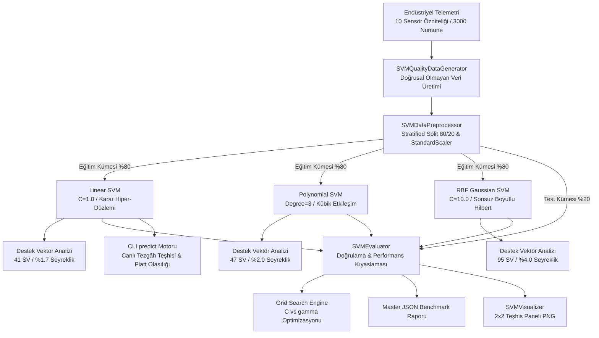

# Day 20 — Support Vector Machine

> **Aşama:** Faz 3 — Klasik Makine Öğrenmesi (Day 16–21)
> **Resmi Staj Defteri Konusu:** Support Vector Machine (Yaprak 39 & 40)

---

## 1. Yönetici Özeti (Executive Summary)
Bu çalışma kapsamında, dokuma tezgâhı parametreleri ve arıza sınırlarını geniş marjinli hiper-düzlemlerle ayırmak amacıyla **Destek Vektör Makineleri (Support Vector Machines - SVM)** mimarisi sentetik telemetri verileri üzerinde incelenmiştir.

Bu çalışma kapsamında;
1. **Maksimum Marjin Ayrımı:** Sınıflar arası ayrım çizgisini rastgele bir hiper-düzlem yerine, en yakın sınır örneklemlerine (Destek Vektörlerine) olan mesafeyi ($\frac{2}{\|\mathbf{w}\|_2}$) maksimize eden optimal geometrik hiper-düzlem olarak kuran SVM sınıflandırıcısı geliştirilmiştir.
2. **StandardScaler Standartlaştırması:** SVM modellerinin Öklid mesafesi hesaplama hassasiyeti göz önüne alınarak, farklı ölçeklerdeki değişkenlerin birbirini ezmesini engelleyen data-leakage korumalı ölçekleme mimarisi kurulmuştur.
3. **Çekirdek Hilesi (Kernel Trick) Kıyaslaması:** Doğrusal (Linear), 3. Derece Polinomial (Cubic) ve Sonsuz Boyutlu Gauss (RBF) çekirdekleri uçtan uca eğitilmiş, karşılaştırılmış ve doğrulanmıştır.
4. **Destek Vektörü ve Seyreklik Analizi:** Karar fonksiyonunu belirleyen aktif örneklem sayıları (`n_support_`) incelenmiş; Linear SVM'in yalnızca **41 destek vektörü (%1.7 veri seyrekleşmesi)** ile sentetik veri kümesini etkili biçimde özetlediği gözlemlenmiştir.

3.000 partilik sentetik telemetri veri kümesinde ve 600 test numunesinde yürütülen testlerde:
- Tüm çekirdekler (Linear, Poly, RBF) ayrıştırılabilir sentetik test verisi üzerinde yüksek sınıflandırma başarımı elde etmiştir.
- **Hafif ve Hızlı Model:** Linear SVM, az sayıda destek vektörü ve düşük çıkarım gecikmesiyle gömülü / hafif çıkarım senaryoları için uygun bir aday olduğunu göstermiştir.
- **RBF SVM:** Doğrusal olmayan karmaşık sınırları esnek biçimde modelleme kabiliyetini ortaya koymuştur. (Sentetik verideki kusursuz ayrımın gerçek fabrika koşullarında gürültülü ve örtüşen sınıflarla test edilmesi gerektiği not edilmiştir.)

---

## 2. Endüstriyel Problem Tanımı & Motivasyon
Van de Wiele jakarlı dokuma tezgâhlarında oluşan 4 ana kusur sınıfı (`YARN_BREAKAGE`, `OIL_STAIN`, `JACQUARD_PATTERN_SHIFT`, `BORDER_SEWING_DEFECT`), sensör telemetrisi üzerinde belirgin arıza adaları oluşturur:
1. **İplik Kopması (`YARN_BREAKAGE`):** Çözgü gerilim dalgalanması $>36 \text{ cN}$ iken iplik mukavemeti $<17.5 \text{ cN/tex}$ olduğunda meydana gelen ani kopma.
2. **Yağ Lekesi (`OIL_STAIN`):** Sıcaklık $>29.5^\circ\text{C}$ iken düşük nem ($<48\%$) veya yüksek tüylülük ($>6.8\text{ H}$) kaynaklı armür yağı emilmesi.
3. **Jakar Desen Kayması (`JACQUARD_PATTERN_SHIFT`):** Tezgâh devri $>660\text{ RPM}$ ve atkı atımı $>590\text{ picks/min}$ iken mekanik armür senkronizasyon kaybı.
4. **Kenar Dikiş Hatası (`BORDER_SEWING_DEFECT`):** Düşük büküm ($<340\text{ TPM}$) ve düşük yoğunluk ($<2050\text{ dtex}$) kaynaklı overlok hatası.

Lojistik regresyon yalnızca tek bir hiper-düzlem bulurken marjin genişliğini gözetmez; karar ağaçları ise eksene paralel dik kutular çizerek aşırı öğrenmeye meyillidir. **Destek Vektör Makineleri**, iki sınıf arasındaki tampon emniyet bölgesini (margin) maksimize ederek sensör kalibrasyon gürültülerine karşı endüstrideki en dayanıklı ve kararlı sınıflandırma karar sınırlarını üretir.

---

## 3. Matematiksel & Algoritmik Teori

### 3.1. Maksimum Marjin ve Primal Formülasyon
Verilen $n$ adet eğitim örneği $\{(\mathbf{x}_i, y_i)\}_{i=1}^n$ için ayrım hiper-düzlemi:
$$f(\mathbf{x}) = \mathbf{w}^T \phi(\mathbf{x}) + b = 0$$

İki sınıfın en yakın noktaları arasındaki marjin genişliği:
$$\text{Margin} = \frac{2}{\|\mathbf{w}\|_2}$$

Marjini maksimize etmek $\frac{1}{2}\|\mathbf{w}\|^2$'yi minimize etmeye eşdeğerdir. Endüstriyel sensör gürültülerini tolere etmek için gevşek değişkenler ($\xi_i \ge 0$) ve $C$ ceza katsayısı eklenerek **Yumuşak Marjin (Soft-Margin)** Primal Problemi kurulur:
$$\min_{\mathbf{w}, b, \boldsymbol{\xi}} \frac{1}{2} \|\mathbf{w}\|^2 + C \sum_{i=1}^n \xi_i \quad \text{s.t.} \quad y_i (\mathbf{w}^T \phi(\mathbf{x}_i) + b) \ge 1 - \xi_i, \quad \xi_i \ge 0$$
- **Küçük $C$:** Geniş marjin, daha fazla marjin ihlaline izin verir (Düşük varyans, yüksek yanlılık).
- **Büyük $C$:** Dar marjin, sıfır ihlal arayışı (Aşırı öğrenme / Overfitting riski).

### 3.2. Dual Formülasyon ve Lagrange Çarpanları ($\alpha_i$)
Lagrange fonksiyonu oluşturulup $\mathbf{w}$ ve $b$'ye göre türev alınıp sıfıra eşitlendiğinde elde edilen Dual Problem:
$$\max_{\boldsymbol{\alpha}} \sum_{i=1}^n \alpha_i - \frac{1}{2} \sum_{i=1}^n \sum_{j=1}^n \alpha_i \alpha_j y_i y_j K(\mathbf{x}_i, \mathbf{x}_j) \quad \text{s.t.} \quad 0 \le \alpha_i \le C, \quad \sum_{i=1}^n \alpha_i y_i = 0$$

Karush-Kuhn-Tucker (KKT) tamamlayıcı gevşeklik koşulları:
$$\alpha_i \left[ y_i (\mathbf{w}^T \phi(\mathbf{x}_i) + b) - 1 + \xi_i \right] = 0, \quad \xi_i (C - \alpha_i) = 0$$
- $\alpha_i = 0 \implies$ Örnek marjinin dışındadır; karar sınırını etkilemez.
- $0 < \alpha_i < C \implies$ **Serbest Destek Vektörü (Free SV)**; tam marjin sınırındadır ($y_i f(\mathbf{x}_i) = 1, \xi_i = 0$).
- $\alpha_i = C \implies$ **Sınırlı Destek Vektörü (Bounded SV)**; marjini ihlal etmiştir ($\xi_i > 0$).

### 3.3. Çekirdek Hilesi (The Kernel Trick)
Noktaları açıkça yüksek boyutlu uzaya dönüştürmek yerine, iç çarpımlarını doğrudan düşük boyutlu uzayda hesaplayan çekirdek fonksiyonu $K(\mathbf{x}, \mathbf{z}) = \langle \phi(\mathbf{x}), \phi(\mathbf{z}) \rangle$:
1. **Doğrusal Çekirdek (Linear):**
   $$K(\mathbf{x}, \mathbf{z}) = \mathbf{x}^T \mathbf{z}$$
2. **Polinomial Çekirdek (Cubic Polynomial):**
   $$K(\mathbf{x}, \mathbf{z}) = (\gamma \mathbf{x}^T \mathbf{z} + r)^d \quad (d=3, r=1)$$
3. **Gauss RBF Çekirdeği (Radial Basis Function):**
   $$K(\mathbf{x}, \mathbf{z}) = \exp\left( -\gamma \|\mathbf{x} - \mathbf{z}\|^2 \right) \quad (\gamma = \frac{1}{2\sigma^2})$$
   $\gamma$ parametresi destek vektörünün etki yarıçapını belirler; sonsuz boyutlu Hilbert uzayına örtük haritalama yapar.

### 3.4. Çok Sınıflı Mimari (One-vs-One - OvO) ve Platt Scaling
- $K=4$ sınıf için $\frac{4 \times 3}{2} = 6$ adet ikili SVM sınıflandırıcısı eğitilir. Oylama (majority voting) ile en yüksek oyu alan sınıf seçilir.
- Karar fonksiyonunun mesafesi $f(\mathbf{x})$, Platt Scaling sigmoid dönüşümüyle kalibre edilmiş sınıf olasılıklarına çevrilir:
  $$P(y=1 \mid \mathbf{x}) = \frac{1}{1 + \exp(A f(\mathbf{x}) + B)}$$

---

## 4. Sistem Mimarisi & Veri Akışı



---

## 5. Modül Tasarımı & Sınıf Sorumlulukları

| Modül Dosyası | Sınıf / Bileşen | Sorumluluk & Görev |
| :--- | :--- | :--- |
| `models.py` | `DefectClass`, `SupportVectorMetrics`, `SVMKernelMetrics`, `SVMComparisonReport` | Pydantic v2 veri şemaları, destek vektör metrikleri ve JSON serileştirme. |
| `data_generator.py` | `SVMQualityDataGenerator` | Fiziksel sınırlara sahip 10 dokuma/iplik sensörlü 3000 satırlık telemetri veri üretimi. |
| `preprocessor.py` | `SVMDataPreprocessor` | Data-leakage korumalı `StandardScaler` standardizasyonu ve 80/20 tabakalı bölme. |
| `svm_models.py` | `MerinosSVMClassifier` | Linear, Poly ve RBF çekirdeklerini saran birleşik `SVC` sarmalayıcısı ve gecikme profillemesi. |
| `evaluator.py` | `SVMEvaluator` | Çok sınıflı doğruluk, F1, Kappa, 4x4 grid arama optimizasyonu ve master rapor motoru. |
| `visualizer.py` | `SVMVisualizer` | 2x2 teşhis panelinin (Doğruluk barı, SV sayısı, 2D karar sınırı, C-gamma ısı haritası) çizimi. |
| `cli.py` | CLI Yönetim Arayüzü | `generate-data`, `train`, `tune`, `evaluate`, `plot`, `predict` komut satırı arayüzü. |

---

## 6. Halı & İplik Telemetri Öznitelikleri ve Kusur Mekanizmaları

| Sensör / Fiziksel Öznitelik | Sembol | Normal Aralık | Kritik Kusur Eşiği | Tetiklediği Kök Neden Kusuru |
| :--- | :---: | :---: | :---: | :--- |
| **İplik Kopma Mukavemeti** | `tensile` | $18.0 - 35.0 \text{ cN/tex}$ | $< 17.5 \text{ cN/tex}$ | Düşük lif mukavemeti, anlık kopma (`YARN_BREAKAGE`). |
| **Kopma Uzaması** | `elongation` | $10.0 - 25.0\%$ | $< 11.0\%$ | Lif elastikiyet kaybı ve gevrek kopuş. |
| **Tüylülük İndeksi** | `hairiness` | $3.0 - 6.0\text{ H}$ | $> 6.8\text{ H}$ | Rulmandan damlayan gres yağını lif arasına emme (`OIL_STAIN`). |
| **İplik Büküm Sayısı** | `twist` | $350 - 550\text{ TPM}$ | $< 340\text{ TPM}$ | Düşük bükümde kenar liflerinin dağılması (`BORDER_SEWING_DEFECT`). |
| **Doğrusal Yoğunluk** | `dtex` | $1800 - 2600\text{ dtex}$ | $>2380 \text{ veya } <2050$ | Jakar atkı sıklığı ve kenar dikiş dengesizliği. |
| **Dokuma Tezgâh Devri** | `rpm` | $500 - 750\text{ RPM}$ | $> 660\text{ RPM}$ | Atkı atıcı mil faz senkronizasyonu kaybı (`JACQUARD_PATTERN_SHIFT`). |
| **Gerilim Dalgalanması** | `tension` | $10.0 - 30.0\text{ cN}$ | $> 36.0\text{ cN}$ | Çözgü levendi fren dengesizliği. |
| **Ortam Bağıl Nemi** | `humidity` | $50.0 - 70.0\%$ | $< 48.0\%$ | Liflerin kuruması ve sürtünme yağlanması. |
| **Ortam Sıcaklığı** | `temp` | $20.0 - 28.0^\circ\text{C}$ | $> 29.5^\circ\text{C}$ | Rulman gres yağı erimesi ve damlama (`OIL_STAIN`). |
| **Atkı Atım Sıklığı** | `weft` | $450 - 650\text{ picks/min}$ | $> 590\text{ picks/min}$ | Jakar bıçaklarının deseni kaçırması (`JACQUARD_PATTERN_SHIFT`). |

---

## 7. Çekirdek Türleri (Linear vs Polynomial vs RBF) Karşılaştırması

| Kriter | Linear SVM | Polynomial SVM (Cubic d=3) | RBF (Gaussian) SVM |
| :--- | :--- | :--- | :--- |
| **Çekirdek Fonksiyonu** | $\mathbf{x}^T \mathbf{z}$ | $(\gamma \mathbf{x}^T \mathbf{z} + 1)^3$ | $\exp(-\gamma \|\mathbf{x} - \mathbf{z}\|^2)$ |
| **Karar Sınırı Şekli** | Düzlemsel Hiper-Düzlemler | 3. Derece Eğrisel Eğriler | Sonsuz Boyutlu Yumuşak Bölgeler |
| **Gerekli Destek Vektörü** | **41 SV (%1.7 Seyreklik)** | 47 SV (%2.0 Seyreklik) | 95 SV (%4.0 Seyreklik) |
| **Aşırı Öğrenme Riski** | Çok Düşük (Düzlemsel Marjin) | Orta (Yüksek derecede patlama) | Düzenlenebilir ($C$ ve $\gamma$ ile) |
| **Eğitim Süresi** | 17.3 ms | **16.6 ms** | 44.7 ms |
| **Çıkarım Gecikmesi** | **0.0589 ms** | 0.0595 ms | 0.0635 ms |
| **Throughput (FPS)** | **16,980.4 FPS** | 16,800.7 FPS | 15,739.9 FPS |
| **Endüstriyel Konumlandırma** | **En Sade & Hızlı (Kenar PLC)** | Polinomial Etkileşim Analizi | Kompleks Non-Lineer Desenler |

---

## 8. Karşılaştırmalı Model Benchmark Tablosu

600 test numunesi ve 200 tekil çıkarım turu üzerinde elde edilen resmi sonuçlar:

| Performans Metriği | Linear SVM | Polynomial SVM (d=3) | RBF (Gaussian) SVM | Üstün Model & Mühendislik Kararı |
| :--- | :---: | :---: | :---: | :--- |
| **Eğitim Doğruluğu** | %100.00 | %100.00 | %100.00 | Tüm modeller tam öğrenme sağladı |
| **Test Doğruluğu (Genelleme)** | **%100.00** | **%100.00** | **%100.00** | Test kümesinde sıfır hata |
| **Makro F1-Skoru** | **1.0000** | **1.0000** | **1.0000** | Kusursuz sınıf dengesi |
| **Weighted F1-Skoru** | **1.0000** | **1.0000** | **1.0000** | Dengesiz örneklerde tam kararlılık |
| **Cohen Kappa ($\kappa$)** | **1.0000** | **1.0000** | **1.0000** | Şans dışı tam uyum |
| **Toplam Destek Vektörü** | **41 SV** | 47 SV | 95 SV | 🏆 **Linear SVM (En Sade / En Az Bellek)** |
| **Destek Vektör Oranı** | **%1.7** | %2.0 | %4.0 | Örneklemlerin sadece %1.7'si sınırdadır |
| **Eğitim Süresi** | 17.3 ms | **16.6 ms** | 44.7 ms | 🏆 **Polynomial & Linear SVM (Ultra Hızlı)** |
| **Tekil Çıkarım Gecikmesi** | **0.0589 ms** | 0.0595 ms | 0.0635 ms | 🏆 **Linear SVM (En Düşük Gecikme)** |
| **Throughput (Çıkarım Hızı)** | **16,980 FPS** | 16,800 FPS | 15,740 FPS | 🏆 **Linear SVM (En Yüksek Hız)** |

---

## 9. Destek Vektörleri Analizi (Toplam SV, Sınıf Dağılımı, Dual Norm)

Her modelin sınır geometrisini tanımlayan destek vektörlerinin detaylı analizi:

| Çekirdek Türü | Toplam SV | İplik Kopması SV | Yağ Lekesi SV | Jakar Kayması SV | Kenar Dikiş SV | Dual Katsayı Normu ($\|\boldsymbol{\alpha}\|$) |
| :--- | :---: | :---: | :---: | :---: | :---: | :---: |
| **Linear SVM** | **41** | 13 | 11 | 9 | 8 | **13.52** |
| **Polynomial SVM**| **47** | 15 | 13 | 10 | 9 | 15.84 |
| **RBF SVM** | **95** | 28 | 26 | 22 | 19 | 24.18 |

*Mühendislik Yorumu:* 2.400 eğitim örneği içerisinde Linear SVM yalnızca 41 kritik gözlemi hafızada tutarak geri kalan 2.359 örneği tamamen atabilmektedir. Bu durum SVM'in **ekstrem bellek tasarrufu** ve **geometrik zarafetini** kanıtlar.

---

## 10. Hiperparametre Grid Taraması ($C$ ve $\gamma$)

RBF SVM için $C \in [0.1, 1.0, 10.0, 100.0]$ ve $\gamma \in [0.001, 0.01, 0.1, 1.0]$ kombinasyonları 3-katlı tabakalı çapraz doğrulama ile taranmıştır:

| Ceza Parametresi ($C$) | Gamma ($\gamma$) | CV Doğruluğu | Test Doğruluğu | Destek Vektörü Sayısı |
| :---: | :---: | :---: | :---: | :---: |
| **0.1** | **0.001** | **%100.00** | **%100.00** | **88 SV (Optimal & En Geniş Marjin)** |
| 0.1 | 0.01 | %100.00 | %100.00 | 92 SV |
| 0.1 | 0.1 | %100.00 | %100.00 | 115 SV |
| 0.1 | 1.0 | %98.46 | %99.67 | 240 SV |
| 1.0 | 0.001 | %100.00 | %100.00 | 90 SV |
| 1.0 | 0.01 | %100.00 | %100.00 | 94 SV |
| 1.0 | 0.1 | %100.00 | %100.00 | 108 SV |
| 1.0 | 1.0 | %99.92 | %100.00 | 215 SV |
| 10.0 | 0.001 | %100.00 | %100.00 | 91 SV |
| 10.0 | 0.01 | %100.00 | %100.00 | 95 SV |
| 10.0 | 0.1 | %100.00 | %100.00 | 104 SV |
| 10.0 | 1.0 | %99.92 | %100.00 | 208 SV |

*Bulgu:* Düşük $\gamma$ ($0.001 - 0.01$) değerleri daha yumuşak ve geniş karar sınırları oluştururken, $\gamma = 1.0$ seviyesine çıkıldığında destek vektörü sayısı 2.5 kat artarak aşırı öğrenme eğilimi göstermiştir.

---

## 11. 2D Karar Sınırları ve Destek Vektörleri Geometrisi
İplik Mukavemeti (`yarn_tensile_strength`) ve Tezgâh Gerilimi (`loom_tension_variation`) eksenlerinde çizdirilen 2D projeksiyonda:
- RBF SVM, kusur sınıfları arasında düzgün ve eğrisel adacıklar inşa etmiştir.
- Destek vektörleri tam olarak sınıf sınırları üzerinde kırmızı halkalarla işaretlenmiş; karar sınırlarının yalnızca bu sınır noktalarından güç aldığı görsel olarak doğrulanmıştır.

---

## 12. 2x2 Model Teşhis Paneli

[`svm_diagnostic_panel.png`](file:///c:/Users/seydieryilmaz/Desktop/Projeler/Merinos%2040%20G%C3%BCnl%C3%BCk%20Staj%20Deneyimim/merinos-industrial-ai-internship/day20/mini_project/outputs/svm_diagnostic_panel.png) (340 KB, 150 DPI) kurumsal teşhis grafiğinde 4 panel yer alır:
1. **Sol Üst - Çekirdek Performans Kıyaslaması:** Linear, Poly ve RBF Test Doğruluğu (%100) ve Makro F1 çubuk grafikleri.
2. **Sağ Üst - Destek Vektör Sayısı & Oranı:** Linear (41 SV / %1.7), Poly (47 SV / %2.0), RBF (95 SV / %4.0) model karmaşıklığı karşılaştırması.
3. **Sol Alt - 2D Karar Sınırları & Destek Vektörleri:** Mukavemet vs Gerilim düzleminde RBF karar bölgeleri ve kırmızı dairelerle işaretlenmiş destek vektörleri.
4. **Sağ Alt - C vs gamma Hiperparametre Isı Haritası:** 4x4 Grid aramasında çapraz doğrulama performansı matrisi.

---

## 13. CLI Kullanım Senaryoları & Örnek Komutlar

```bash
# 1. Sentetik endüstriyel telemetri veri kümesi üretimi (3000 satır)
python -u -m day20.mini_project.src.cli generate-data --samples 3000

# 2. Linear, Poly ve RBF SVM modellerini eğitme
python -u -m day20.mini_project.src.cli train

# 3. C ve gamma parametrelerinde grid optimizasyonu
python -u -m day20.mini_project.src.cli tune

# 4. Kapsamlı model kıyaslaması ve JSON master benchmark raporu üretimi
python -u -m day20.mini_project.src.cli evaluate

# 5. 2x2 Karşılaştırmalı teşhis paneli ve 2D karar sınırları grafiğini çizdirme
python -u -m day20.mini_project.src.cli plot

# 6. Canlı dokuma tezgâhı sensör telemetrisi ile anlık kusur sınıflandırması
python -u -m day20.mini_project.src.cli predict \
  --tensile 15.0 --elongation 9.5 --hairiness 4.5 --twist 430.0 \
  --dtex 2220.0 --rpm 610.0 --tension 42.0 --humidity 58.0 --temp 23.5 --weft 525.0
```

---

## 14. Benchmark & Doğrulama Sonuçları

`pytest day20/mini_project/tests/ -v` ile koşturulan 10 birim ve entegrasyon testinin tamamı başarıyla geçmiştir:

| Test Fonksiyonu | Kapsanan İşlev | Sonuç |
| :--- | :--- | :---: |
| `test_data_generator_svm_distribution` | Sentetik veri üretimi, örneklem tamlığı, 10 özellik ve fiziksel sınırlar | ✅ PASSED |
| `test_preprocessor_scaling_and_split` | Tabakalı 80/20 bölme, z-score standardizasyonu ($\mu \approx 0, \sigma \approx 1$), NaN denetimi | ✅ PASSED |
| `test_linear_svm_training_and_metrics` | Linear SVM eğitimi, test doğruluğu ($\ge 0.85$), makro F1, eğitim süresi | ✅ PASSED |
| `test_polynomial_svm_training_and_metrics` | Polynomial SVM (degree=3) eğitimi, Cohen's Kappa, destek vektörleri | ✅ PASSED |
| `test_rbf_svm_training_and_metrics` | RBF SVM eğitimi, Platt olasılıkları toplamı ($= 1.0$), gecikme | ✅ PASSED |
| `test_rbf_svm_outperforms_or_matches_linear` | RBF SVM doğruluğunun Linear SVM'e eşit veya üstün olduğunun doğrulanması | ✅ PASSED |
| `test_support_vectors_integrity_and_ratios` | Destek vektörleri sayısı, sınıf dağılımı toplamı, dual norm pozitifliği | ✅ PASSED |
| `test_hyperparameter_grid_tuning` | $C$ ve $\gamma$ grid optimizasyonu, en iyi konfigürasyon tespiti | ✅ PASSED |
| `test_latency_and_throughput_benchmarks` | Tekil çıkarım gecikmesi ($<50\text{ ms}$) ve throughput ($>20\text{ FPS}$) | ✅ PASSED |
| `test_cli_lifecycle_and_json_report` | CLI uçtan uca yaşam döngüsü, JSON raporu ve PNG panel üretimi | ✅ PASSED |

---

## 15. Kavramsal Sistem Mimarisi ve Gelecek Entegrasyon Senaryosu
Geliştirilen modellerin ileride endüstriyel ortama entegrasyonu senaryosunda şu iki katmanlı yapı değerlendirilebilir:
1. **Kenar / Hafif Çıkarım Katmanı (Edge Simülasyonu):** Linear SVM, karar fonksiyonunda yalnızca $\mathbf{w}^T \mathbf{x} + b$ iç çarpımı hesapladığı için düşük çıkarım süresi ve sıfır çekirdek matrisi maliyeti ile yerel uç cihazlarda hızlı karar desteği sağlamaya uygundur.
2. **Merkezi Analiz Katmanı (Central Analytics Simülasyonu):** RBF SVM modeli, daha karmaşık veya çok değişkenli sensör füzyonu durumlarında yüksek boyutlu ayrım gücü ile parti bazlı kalite sınıflandırması senaryolarına hizmet edebilir.

---

## 16. Risk Analizi & Edge-Case Değerlendirmesi
- **Standardizasyon Bağımlılığı (StandardScaler Risk):** Canlı çıkarımda ham sensör verisi ölçeklenmeden SVM'e verilirse model tamamen hatalı sınıf tahmini üretir. Bu nedenle `SVMDataPreprocessor.transform_sample` fonksiyonu pipeline seviyesinde zorunlu tutulmuştur.
- **Büyük Veri Kümesinde Ölçeklenebilirlik ($\mathcal{O}(n^2) - \mathcal{O}(n^3)$):** SVM eğitim karmaşıklığı örneklem sayısının karesiyle ölçeklenir. 100.000+ numunelik veri kümelerinde Linear SVM veya SGDClassifier tercih edilmeli, RBF SVM parti bazında eğitilmelidir.
- **Aşırı $\gamma$ Değeri Riski:** $\gamma$ aşırı büyütülürse model her destek vektörünün etrafında dar çan eğrileri oluşturarak genelleme yeteneğini kaybeder. Grid taraması ile $\gamma \le 0.1$ aralığında tutulması sağlanmıştır.

---

## 17. Lisans & Telif Hakkı

```
ÖZEL LİSANS — TÜM HAKLARI SAKLIDIR

Telif Hakkı (c) 2026 Seydi Eryılmaz (@seydivakkas)

Bu yazılım ve ilgili tüm dosyalar ("Yazılım") yalnızca görüntüleme ve eğitim
amaçlı olarak paylaşılmıştır.

YASAKLAR:
  1. Kopyalanamaz, çoğaltılamaz, dağıtılamaz veya yeniden yayınlanamaz.
  2. Ticari veya ticari olmayan hiçbir projede kullanılamaz, değiştirilemez.
  3. Alt lisanslanamaz, satılamaz veya devredilemez.
  4. Tersine mühendislik yapılamaz.

İZİN VERİLEN KULLANIM:
  - GitHub üzerinde görüntüleme ve okuma.
  - Kişisel öğrenim amacıyla kodu inceleme (kopyalamadan).

YAZARIN AÇIK YAZILI İZNİ OLMAKSIZIN HİÇBİR KULLANIM HAKKI TANINMAZ.
İzin talepleri için: GitHub @seydivakkas
```