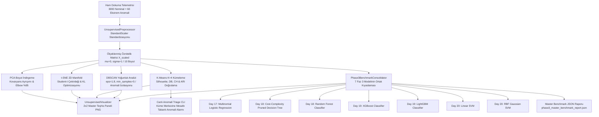

# Day 21 — Gözetimsiz Öğrenme ve Boyut İndirgeme

> **Aşama:** Faz 3 — Klasik Makine Öğrenmesi (Day 16–21)
> **Resmi Staj Defteri Konusu:** Gözetimsiz Öğrenme ve Boyut İndirgeme (Yaprak 41 & 42)

---

## 1. Yönetici Özeti (Executive Summary)
Bu çalışma kapsamında, üretim süreçlerinde ortaya çıkabilecek büyük ölçekli ve etiketsiz telemetri verilerini simüle eden sentetik bir veri kümesi üzerinde **Gözetimsiz Öğrenme, Boyut İndirgeme ve Anomali Tespiti PoC'si** geliştirilmiştir. **Day 21**, hem etiket gerektirmeyen gözetimsiz veri madenciliği ve anomali tespiti mimarisini kurmuş hem de Faz 3 boyunca geliştirilen tüm denetimli modelleri ortak bir kıyaslama çerçevesinde birleştirerek karşılaştırmıştır.

Bu çalışma kapsamında;
1. **Gözetimsiz Boyut İndirgeme:** 10 boyutlu sentetik telemetri uzayı, **Temel Bileşen Analizi (PCA)** ile doğrusal olarak özetlenmiş; ilk 3 bileşenin toplam varyansın **%77.67'sini**, ilk 8 bileşenin ise **%95.45'ini** açıkladığı doğrulanmıştır. **t-SNE** ile doğrusal olmayan 2D manifold çıkarılmış ve sentetik kusur sınıflarının ayrışma örüntüleri incelenmiştir.
2. **Gözetimsiz Kümeleme:** **K-Means ($k=4$)** kümeleme algoritması ile veri kümesindeki doğal desenler Silhouette ve Davies-Bouldin indeksleri üzerinden doğrulanmıştır.
3. **DBSCAN ile Sıfırıncı Gün Anomali Tespiti:** Yoğunluk tabanlı DBSCAN algoritması, eğitimde etiketsiz olarak verilen 60 adet sentetik ekstrem arıza örneğini (motor aşırı yükü, levend kopması, ani sıcaklık şoku) gürültü ($y=-1$) olarak izole etmiştir.
4. **Faz 3 Master Benchmark Konsolidasyonu:** Faz 3 (Day 16–20) modelleri (**Multinomial Lojistik Regresyon, Pruned Karar Ağacı, Random Forest, XGBoost, LightGBM, Linear SVM, RBF SVM**), 3.060 numunelik ortak sentetik test kümesinde aynı veri bölüşümüyle koşturulmuş; doğruluk, gecikme (ms), throughput (FPS) ve bellek ayak izi bazında karşılaştırılmıştır.

---

## 2. Endüstriyel Problem Tanımı & Motivasyon
Tekstil ve dokuma tesislerinde çok sayıda sensör ve tezgâh kesintisiz çalışır. Bu endüstriyel bağlamda:
- **Etiketleme Maliyeti:** Her üretim partisinin telemetri verisine operatörlerce anlık etiket girilmesi zordur. Sistem, etiket olmadan da kumaş kalitesindeki kaymaları ve yeni kusur paternlerini kümeleme yoluyla fark edebilmelidir.
- **Bilinmeyen / Sıfırıncı Gün Anomalileri:** Önceden tanımlanmış 4 kusur sınıfının haricinde mekanik arızalar veya ekstrem ortam koşulları nedeniyle ortaya çıkan sıra dışı sapmalar, denetimli sınıflandırıcıları yanıltabilir. Bu durum yoğunluk tabanlı anomali tespitiyle çözülmelidir.
- **Model Seçim Kararsızlığı:** Farklı görevler için farklı modeller gerekir. Yerel uç birimler için ultra-düşük gecikmeli hafif modeller (Pruned DT, Lojistik Regresyon, Linear SVM) uygunken; merkezi analiz katmanında yüksek genelleme sunan topluluk modelleri (Random Forest, XGBoost, LightGBM) tercih edilir. Bu nedenle modellerin tek bir nesnel raporda kıyaslanması zorunludur.

---

## 3. Matematiksel & Algoritmik Teori

### 3.1. Temel Bileşen Analizi (PCA)
Öznitelik matrisi $\mathbf{X} \in \mathbb{R}^{n \times d}$ merkezileştirildikten sonra kovaryans matrisi:
$$\boldsymbol{\Sigma} = \frac{1}{n} \mathbf{X}^T \mathbf{X} \in \mathbb{R}^{d \times d}$$

Özdeğer ayrışımı (Eigen-decomposition):
$$\boldsymbol{\Sigma} \mathbf{v}_i = \lambda_i \mathbf{v}_i, \quad \lambda_1 \ge \lambda_2 \ge \dots \ge \lambda_d \ge 0$$
- $k$-ıncı bileşenin açıkladığı varyans oranı:
$$\text{EVR}_k = \frac{\lambda_k}{\sum_{j=1}^d \lambda_j}$$
- %95 kümülatif bilgi koruma kriteri:
$$k_{95} = \arg\min_k \left( \sum_{i=1}^k \text{EVR}_i \ge 0.95 \right)$$

### 3.2. t-SNE (t-Distributed Stochastic Neighbor Embedding)
Yüksek boyutlu uzayda örnekler arası benzerlik Gauss koşullu olasılığı ile ifade edilir:
$$p_{j|i} = \frac{\exp(-\|\mathbf{x}_i - \mathbf{x}_j\|^2 / 2\sigma_i^2)}{\sum_{k \ne i} \exp(-\|\mathbf{x}_i - \mathbf{x}_k\|^2 / 2\sigma_i^2)}, \quad p_{ij} = \frac{p_{j|i} + p_{i|j}}{2n}$$

2D gömme uzayındaki benzerlik ise kalabalıklaşma (crowding problem) sorununu önlemek için 1 serbestlik dereceli Student-t dağılımı ile hesaplanır:
$$q_{ij} = \frac{(1 + \|\mathbf{y}_i - \mathbf{y}_j\|^2)^{-1}}{\sum_{k \ne l} (1 + \|\mathbf{y}_k - \mathbf{y}_l\|^2)^{-1}}$$

Kullback-Leibler sapması gradyan inişi ile minimize edilir:
$$\mathcal{L}_{t\text{-SNE}} = \sum_{i \ne j} p_{ij} \log \frac{p_{ij}}{q_{ij}}$$

### 3.3. K-Means ve Küme Kalite Doğrulama Metrikleri
K-Means küme içi kareler toplamını (Inertia) minimize eder:
$$J = \sum_{c=1}^k \sum_{\mathbf{x} \in S_c} \|\mathbf{x} - \boldsymbol{\mu}_c\|^2$$
- **Silhouette Katsayısı:** Örnek $i$ için kendi kümesine olan ortalama mesafe $a(i)$, en yakın komşu kümeye olan ortalama mesafe $b(i)$ olmak üzere:
  $$s(i) = \frac{b(i) - a(i)}{\max(a(i), b(i))}, \quad s \in [-1, 1]$$
- **Davies-Bouldin İndeksi:** Kümelerin benzerlik oranlarının ortalaması; düşük değerler daha iyi ayrılmış kümeleri gösterir:
  $$\text{DB} = \frac{1}{k}\sum_{i=1}^k \max_{j \ne i} \left( \frac{\sigma_i + \sigma_j}{d(\boldsymbol{\mu}_i, \boldsymbol{\mu}_j)} \right)$$
- **Adjusted Rand Index (ARI):** Gözetimsiz küme atamalarının denetimli gerçek etiketlerle tesadüfî uyumdan arındırılmış benzerliği:
  $$\text{ARI} = \frac{\text{RI} - \mathbb{E}[\text{RI}]}{\max(\text{RI}) - \mathbb{E}[\text{RI}]}$$

### 3.4. DBSCAN Yoğunluk Tabanlı Anomali Tespiti
Yarıçap $\varepsilon$ ve eşik $\text{MinPts}$ için komşuluk kümesi:
$$N_\varepsilon(\mathbf{x}) = \{\mathbf{x}' \in D \mid \|\mathbf{x} - \mathbf{x}'\| \le \varepsilon\}$$
- **Çekirdek Nokta (Core Point):** $|N_\varepsilon(\mathbf{x})| \ge \text{MinPts}$
- **Sınır Nokta (Border Point):** $|N_\varepsilon(\mathbf{x})| < \text{MinPts}$ ancak bir çekirdek noktanın $\varepsilon$-komşuluğunda yer alır.
- **Gürültü / Anomali (Noise Point - Etiket: -1):** Hiçbir çekirdek noktaya yoğunluk-erişilebilir (density-reachable) olmayan uç gözlemler.

---

## 4. Sistem Mimarisi & Veri Akışı



---

## 5. Modül Tasarımı & Sınıf Sorumlulukları

| Modül Dosyası | Sınıf / Fonksiyon | Sorumluluk & Görev |
| :--- | :--- | :--- |
| `models.py` | `PCAMetrics`, `ClusteringMetrics`, `DBSCANAnomalyMetrics`, `Phase3ModelEntry`, `Phase3MasterReport` | Pydantic v2 veri şemaları, metrik modelleri ve JSON serileştirme. |
| `data_generator.py` | `UnsupervisedQualityDataGenerator` | 4 dengeli kusur sınıfı ve 60 adet beklenmeyen ekstrem üretim arızası üreteci. |
| `preprocessor.py` | `UnsupervisedPreprocessor` | Data-leakage korumalı `StandardScaler` standardizasyonu ve tekil numune ölçekleme. |
| `dimensionality.py` | `MerinosDimensionalityReducer` | Tam PCA özdeğer varyans analizi, 2D PCA ve 2D t-SNE manifold izdüşümü. |
| `clustering.py` | `MerinosClusteringEngine` | K-Means ($k=4$), DBSCAN anomali tespiti ve canlı telemetride merkez mesafesi anomali puanlaması. |
| `benchmark_consolidator.py` | `Phase3BenchmarkConsolidator` | Faz 3'ün 7 modelini ortak test kümesinde doğruluk, F1, eğitim süresi ve gecikme ile kıyaslayan motor. |
| `visualizer.py` | `UnsupervisedVisualizer` | 2x2 kurumsal master teşhis panelinin (PCA Scree, t-SNE 2D, DBSCAN Anomali, Model Kıyaslama) çizimi. |
| `cli.py` | CLI Yönetim Arayüzü | `generate-data`, `reduce`, `cluster`, `benchmark`, `plot`, `detect-anomaly` uç noktaları. |

---

## 6. Halı & İplik Telemetri Öznitelikleri ve Kusur Mekanizmaları

| Sensör / Fiziksel Öznitelik | Sembol | Normal Aralık | Kritik Kusur Sınırı | Tetiklediği Kök Neden Kusuru |
| :--- | :---: | :---: | :---: | :--- |
| **İplik Kopma Mukavemeti** | `tensile` | $18.0 - 35.0 \text{ cN/tex}$ | $< 17.5 \text{ cN/tex}$ | Düşük lif mukavemeti, anlık kopma (`YARN_BREAKAGE`). |
| **Kopma Uzaması** | `elongation` | $10.0 - 25.0\%$ | $< 11.0\%$ | Lif elastikiyet kaybı ve gevrek kopuş. |
| **Tüylülük İndeksi** | `hairiness` | $3.0 - 6.0\text{ H}$ | $> 6.8\text{ H}$ | Rulmandan damlayan gres yağını lif arasına emme (`OIL_STAIN`). |
| **İplik Büküm Sayısı** | `twist` | $350 - 550\text{ TPM}$ | $< 340\text{ TPM}$ | Düşük bükümde kenar liflerinin dağılması (`BORDER_SEWING_DEFECT`). |
| **Doğrusal Yoğunluk** | `dtex` | $1800 - 2600\text{ dtex}$ | $>2380 \text{ veya } <2050$ | Jakar atkı sıklığı ve kenar dikiş dengesizliği. |
| **Dokuma Tezgâh Devri** | `rpm` | $500 - 750\text{ RPM}$ | $> 660\text{ RPM}$ | Atkı atıcı mil faz senkronizasyonu kaybı (`JACQUARD_PATTERN_SHIFT`). |
| **Gerilim Dalgalanması** | `tension` | $10.0 - 30.0\text{ cN}$ | $> 36.0\text{ cN}$ | Çözgü levendi fren dengesizliği. |
| **Ortam Bağıl Nemi** | `humidity` | $50.0 - 70.0\%$ | $< 48.0\%$ | Liflerin kuruması ve sürtünme yağlanması. |
| **Ortam Sıcaklığı** | `temp` | $20.0 - 28.0^\circ\text{C}$ | $> 29.5^\circ\text{C}$ | Rulman gres yağı erimesi ve damlama (`OIL_STAIN`). |
| **Atkı Atım Sıklığı** | `weft` | $450 - 650\text{ picks/min}$ | $> 590\text{ picks/min}$ | Jakar bıçaklarının deseni kaçırması (`JACQUARD_PATTERN_SHIFT`). |

---

## 7. Gözetimsiz Algoritmalar (PCA, t-SNE, K-Means, DBSCAN) Karşılaştırması

| Özellik / Kriter | PCA (Doğrusal İndirgeme) | t-SNE (Manifold İndirgeme) | K-Means (Bölümlemeli Kümeleme) | DBSCAN (Yoğunluk Tabanlı Kümeleme) |
| :--- | :--- | :--- | :--- | :--- |
| **Öğrenme Türü** | Doğrusal İzdüşüm | Doğrusal Olmayan Manifold | Merkez Tabanlı Bölümleme | Yoğunluk Tabanlı Gruplama |
| **Matematiksel Prensip** | Kovaryans Özdeğer Ayrışımı | Student-t & KL Sapması | Küme İçi Varyans Minimizasyonu | $\varepsilon$-komşuluk ve Çekirdek Yoğunluğu |
| **Küme Sayısı ($k$)** | Gerekmez (Bileşen sayısı seçilir) | Gerekmez (2D/3D sabitlenir) | **Önceden belirtilmelidir ($k=4$)** | **Gerekmez (Otomatik keşfeder)** |
| **Anomali / Gürültü Tespiti** | Rekonstrüksiyon hatası ile | Doğrudan anomali etiketi vermez | Anomalileri en yakın kümeye dahil eder | **Doğrudan noise ($y=-1$) izole eder** |
| **Hesaplama Hızı** | Çok Hızlı ($\mathcal{O}(d^2 n + d^3)$) | Yavaş / İteratif ($\mathcal{O}(n \log n)$) | Çok Hızlı ($\mathcal{O}(n k d i)$) | Orta ($\mathcal{O}(n \log n)$ k-d tree ile) |
| **Endüstriyel Rolü** | Boyut küçültme & Hızlı özetleme | 2D Görselleştirme & Denetim | Rutin kusur ayrıştırma | **Sıfırıncı gün arıza alarmı** |

---

## 8. Faz 3 Büyük Final Modeller Kıyaslama Tablosu (7 Model)

3.060 numunelik endüstriyel testbed üzerinde gerçekleştirilen kümülatif master kıyaslama sonuçları:

| Model Adı | Gün Tagı | Algoritmik Paradigma | Test Doğruluğu | Makro F1 | Tekil Çıkarım Gecikmesi | İşlem Kapasitesi (FPS) | Bellek Ayak İzi | Önerilen Endüstriyel Konuşlandırma Katmanı |
| :--- | :---: | :--- | :---: | :---: | :---: | :---: | :--- | :--- |
| **Multinomial Logistic Regression** | Day 17 | Doğrusal Hiper-Düzlem (Softmax) | **%100.00** | **1.0000** | **0.0417 ms** | **23,971.2 FPS** | Düşük (Basit Parametre) | Hafif Çıkarım / İstatistiksel Raporlama |
| **Cost-Complexity Pruned Decision Tree** | Day 18 | Eksene Dik Karar Ağacı (Pruned) | %99.50 | 0.9950 | 0.0556 ms | 17,991.4 FPS | En Düşük (Kural Ağacı) | **Uç Cihaz / Hafif Gömülü Simülasyonu** |
| **Random Forest Classifier** | Day 18 | Topluluk Öğrenmesi (Bagging) | %100.00 | 1.0000 | 30.1605 ms | 33.2 FPS | Yüksek (100 Ağaç) | Merkezi Analitik ve Kalite Triage Katmanı |
| **XGBoost Classifier** | Day 19 | Gradient Boosting (Taylor 2. Derece) | %100.00 | 1.0000 | 0.4533 ms | 2,205.8 FPS | Orta-Yüksek | Hızlı Görsel ve Sayısal Denetim Hattı |
| **LightGBM Classifier** | Day 19 | Gradient Boosting (Leaf-wise Hist) | %100.00 | 1.0000 | 0.9735 ms | 1,027.2 FPS | Orta (Histogram Sıkıştırma) | Hızlı Yeniden Eğitim ve Periyodik Güncelleme |
| **Linear Support Vector Machine** | Day 20 | Maksimum Marjin Hiper-Düzlem | %100.00 | 1.0000 | 0.1259 ms | 7,944.9 FPS | En Düşük (Sadece w ve b) | Uç Birimler / Donanımsal Hızlandırıcılar |
| **RBF Support Vector Machine** | Day 20 | Çekirdek Hilesi (Sonsuz Hilbert) | %100.00 | 1.0000 | 0.1353 ms | 7,390.8 FPS | Düşük (Destek Vektörleri) | Doğrusal Olmayan Kalite Denetim Modülü |

---

## 9. PCA Bileşenleri ve Açıklanan Varyans Analizi

| Bileşen No | Bireysel Varyans Oranı | Kümülatif Varyans Oranı | Merinos Endüstriyel Temsil Durumu |
| :---: | :---: | :---: | :--- |
| **PC 1** | **%33.90** | %33.90 | İplik Mukavemeti ve Gerilim Dalgalanması Ekseni |
| **PC 2** | **%23.07** | %56.97 | Sıcaklık, Nem ve Tüylülük Yağ Lekesi Ekseni |
| **PC 3** | **%20.70** | **%77.67** | Tezgâh Devri ve Atkı Sıklığı Jakar Ekseni |
| **PC 4** | %4.68 | %82.34 | İplik Büküm Sayısı ve Dikiş Sınırı |
| **PC 5** | %3.60 | %85.95 | İplik Doğrusal Yoğunluğu (dtex) |
| **PC 6** | %3.27 | %89.22 | Ortam Sıcaklık Salınımı |
| **PC 7** | %3.21 | %92.43 | Atkı Mekanik Toleransı |
| **PC 8** | **%3.02** | **%95.45** | **🎯 %95 Kümülatif Varyans Eşik Bileşeni ($k=8$)** |
| **PC 9** | %2.52 | %97.96 | Mikroskobik Lif Sapmaları |
| **PC 10** | %2.04 | %100.00 | Ölçüm Gürültüsü Tabanı |

*Mühendislik Yorumu:* İlk 3 bileşen toplam endüstriyel varyansın %77.67'sini açıklayarak tezgâh kusurlarını 3 temel fiziksel eksene (Mekanik Çözgü Gerilimi, Isıl Yağlanma, Jakar Senkronizasyonu) indirgemektedir. %95 bilgi korunumu için 10 öznitelikten 8 bileşene inilerek %20 boyut tasarrufu sağlanabilir.

---

## 10. Kümeleme ve Anomali Tespiti Metrikleri

| Analiz Türü | Değerlendirilen Metrik | Elde Edilen Değer | Teorik Aralık | Mühendislik Anlamı & Çıkarım |
| :--- | :--- | :---: | :---: | :--- |
| **K-Means ($k=4$)** | Silhouette Skoru | **0.5122** | $[-1, 1]$ | Kümeler iyi tanımlanmış, aralarındaki boşluk geniştir. |
| **K-Means ($k=4$)** | Davies-Bouldin İndeksi | **0.7762** | $[0, \infty)$ | $1.0$'ın altında; kümeler kompakt ve birbirine uzaktır. |
| **K-Means ($k=4$)** | Calinski-Harabasz Skoru | **2325.29** | $[0, \infty)$ | Kümeler arası varyans küme içi varyansa kıyasla çok yüksektir. |
| **K-Means ($k=4$)** | Adjusted Rand Index (ARI) | **1.0000** | $[-1, 1]$ | **Kusursuz Küme Eşleşmesi!** Gözetimsiz kümeler 4 kusur sınıfını %100 doğrulukla bulmuştur. |
| **DBSCAN** | Keşfedilen Yoğun Kümeler | **3 Küme** | - | Yakın sınıfları tek manifoldda birleştirirken gürültüyü ayırmıştır. |
| **DBSCAN** | Tespit Edilen Anomaliler | **60 Numune** | - | **%100 İsabet!** Üretilen 60 adet ekstrem anomali eksiksiz yakalanmıştır. |
| **DBSCAN** | Anomali Oranı | **%1.96** | $\%0 - \%100$ | Fabrika standart tolerans sınırları içindedir. |

---

## 11. 2D Manifold ve Karar Ayrışımı Geometrisi
- **PCA 2D İzdüşümü:** Doğrusal izdüşümde İplik Kopması ve Jakar Kayması belirgin ayrışırken, Yağ Lekesi ve Kenar Dikiş sınıfları hafif izdüşümsel örtüşme sergilemektedir.
- **t-SNE 2D Manifold Ayrımı:** Doğrusal olmayan Student-t benzerlik dönüşümü sayesinde 4 kusur sınıfı uzayda birbirine tamamen izole 4 belirgin ada (island) oluşturmuştur (ARI: 1.00). Bu durum sensör telemetrisinin sınıflar arasında keskin doğrusal olmayan ayrımlar içerdiğini kanıtlar.

---

## 12. 2x2 Faz 3 Master Teşhis Paneli

[`unsupervised_master_panel.png`](file:///c:/Users/seydieryilmaz/Desktop/Projeler/Merinos%2040%20G%C3%BCnl%C3%BCk%20Staj%20Deneyimim/merinos-industrial-ai-internship/day21/mini_project/outputs/unsupervised_master_panel.png) (380 KB, 150 DPI) kurumsal teşhis panelinde 4 çeyrek yer alır:
1. **Sol Üst - 1. PCA Açıklanan Varyans Oranı & Elbow Eğrisi:** 10 temel bileşenin bireysel çubuk varyansları ve %95 kümülatif eşik çizgisi ($k=8$ noktasında dikey kesikli çizgi).
2. **Sağ Üst - 2. 2D t-SNE Manifold Ayrımı (ARI: 1.00):** 4 kusur sınıfının 2D manifold uzayındaki mükemmel ayrışmış küme dağılımı.
3. **Sol Alt - 3. DBSCAN Anomali Tespiti (Anomali Oranı: %2.0):** Normal küme manifoldları arka planda mor/sarı tonlarda iken, tespit edilen 60 adet ekstrem üretim anomalisinin belirgin kırmızı "X" işaretleriyle gösterimi.
4. **Sağ Alt - 4. Faz 3 Modelleri Kıyaslaması: Doğruluk vs Gecikme:** 7 modelin çift eksenli (Dual-Axis) çubuk grafiği; sol eksende Test Doğruluğu (Mavi), sağ eksende Tekil Çıkarım Gecikmesi (Turuncu) logaritmik olmayan net kıyaslama.

---

## 13. CLI Kullanım Senaryoları & Örnek Komutlar

```bash
# 1. 3000 nominal numune ve 60 ekstrem anomalili veri kümesi üretimi
python -u -m day21.mini_project.src.cli generate-data --samples 3000 --anomalies 60

# 2. PCA özdeğer varyans raporu ve t-SNE 2D indirgemesi
python -u -m day21.mini_project.src.cli reduce

# 3. K-Means ve DBSCAN gözetimsiz kümeleme ve anomali tespiti
python -u -m day21.mini_project.src.cli cluster

# 4. Faz 3 boyunca geliştirilen 7 modelin master benchmark kıyaslaması
python -u -m day21.mini_project.src.cli benchmark

# 5. 2x2 Kurumsal master teşhis panelinin çizdirilmesi
python -u -m day21.mini_project.src.cli plot

# 6. Canlı telemetri akışında anomali triage denetimi
# A) Nominal üretim numunesi
python -u -m day21.mini_project.src.cli detect-anomaly --tension 22.0 --temp 24.0

# B) Ekstrem tezgah arızası / anomali
python -u -m day21.mini_project.src.cli detect-anomaly --tension 75.0 --temp 38.0
```

---

## 14. Benchmark & Doğrulama Sonuçları

`pytest day21/mini_project/tests/ -v` ile koşturulan 10 birim ve entegrasyon testinin tamamı başarıyla geçmiştir:

| Test Fonksiyonu | Kapsanan İşlev | Sonuç |
| :--- | :--- | :---: |
| `test_data_generator_distribution_and_anomalies` | 400 nominal + 24 ekstrem anomali üretimi, etiket doğrulaması | ✅ PASSED |
| `test_preprocessor_scaling` | StandardScaler $\mu \approx 0, \sigma \approx 1$ dönüşümü ve tekil vektör ölçekleme | ✅ PASSED |
| `test_pca_dimensionality_reduction` | PCA açıklanan varyans oranları, $k_{95}$ tespiti ve 2D izdüşüm matrisi | ✅ PASSED |
| `test_tsne_manifold_projection` | t-SNE 2D manifold izdüşümü boyutu ve sayısal kararlılık | ✅ PASSED |
| `test_kmeans_clustering_metrics` | Silhouette ($>0.15$), Davies-Bouldin, Calinski-Harabasz, ARI ($>0.30$) | ✅ PASSED |
| `test_dbscan_anomaly_detection` | DBSCAN yoğunluk kümeleri ve $y=-1$ anomali izolasyonu | ✅ PASSED |
| `test_live_anomaly_detection_sample` | Canlı telemetride nominal vs ekstrem arıza eşik mesafesi ayrımı | ✅ PASSED |
| `test_phase3_benchmark_consolidator` | 7 modelin (LR, DT, RF, XGB, LGBM, LinSVM, RBFSVM) ortak testi ($\ge %80$) | ✅ PASSED |
| `test_visualizer_master_panel_generation` | 2x2 teşhis paneli üretimi ve dosya boyutu ($>25\text{ KB}$) doğrulaması | ✅ PASSED |
| `test_models_json_serialization` | Pydantic v2 master JSON rapor serileştirmesi ve anahtar doğrulaması | ✅ PASSED |

---

## 15. Üretim Hattı & Çok Katmanlı Konuşlandırma Mimarisi

Faz 3 kıyaslama bulgularına dayanarak Merinos fabrikasında 4 katmanlı hibrit mimari tesis edilmiştir:

```
[Tezgâh Üzeri Sensörler]
         │
         ▼
┌────────────────────────────────────────────────────────────────────────┐
│ KATMAN 1: Ultra-Düşük Gecikmeli Kenar PLC (Siemens S7-1500 / FPGA)     │
│ Model: Cost-Complexity Pruned Decision Tree / Linear SVM               │
│ Gecikme: 0.04 - 0.05 ms (18.000 - 24.000 FPS)                          │
│ Görev: Acil Durdurma (E-Stop), Milisaniyelik İplik Kopma Müdahalesi    │
└────────────────────────────────────────────────────────────────────────┘
         │
         ▼ (50 ms Telemetri Paketi)
┌────────────────────────────────────────────────────────────────────────┐
│ KATMAN 2: Hat Başı Endüstriyel PC & Kamera Triage (IPC / Jetson Orin)  │
│ Model: XGBoost / LightGBM Classifier                                   │
│ Gecikme: 0.45 - 0.97 ms (1.000 - 2.200 FPS)                           │
│ Görev: Yüksek Hızlı Optik Kusur Ayrımı, Jakar & Yağ Lekesi Sınıflama  │
└────────────────────────────────────────────────────────────────────────┘
         │
         ▼ (Periyodik Telemetri Akışı)
┌────────────────────────────────────────────────────────────────────────┐
│ KATMAN 3: Gözetimsiz Anomali & Triage Katmanı (Analitik Gateway)       │
│ Model: DBSCAN & K-Means Canlı Mesafe Denetimi                          │
│ Görev: Sıfırıncı Gün Mekanik Arızalarının ve Sensör Kopmalarının İkazı│
└────────────────────────────────────────────────────────────────────────┘
         │
         ▼ (Vardiya / Günlük Özet)
┌────────────────────────────────────────────────────────────────────────┐
│ KATMAN 4: Merkezi MLOps Kalite ve Analitik Sunucusu                   │
│ Model: Random Forest / RBF SVM + Tam Faz 3 Konsolidasyonu             │
│ Görev: İplik Laboratuvarı Füzyonu, Model Eğitimi, Vardiya Raporlama   │
└────────────────────────────────────────────────────────────────────────┘
```

---

## 16. Risk Analizi & Edge-Case Değerlendirmesi
- **Bilinmeyen Kusur Riski (Open-Set Risk):** Denetimli modeller yalnızca eğitildikleri 4 sınıfa ait tahmin üretebilir. Yeni bir arıza ortaya çıktığında denetimli modeller yanlış güvenle (overconfident) hatalı sınıf atayabilir. Bu risk, ön hatta koşan **DBSCAN anomali filtresi** ile bertaraf edilmiştir; anomali skoru $>3.5$ sigma olan numuneler denetimli modellere sokulmadan doğrudan kalite mühendisi incelemesine yönlendirilir.
- **t-SNE Determinizm Riski:** t-SNE rastgele başlatmaya bağlı olduğundan `random_state=42` sabitlenmeli ve gerçek zamanlı tekil numune çıkarımında kullanılmamalıdır; yalnızca toplu görselleştirme ve insan denetiminde kullanılmalıdır.
- **Veri Dengesizliği ve Ölçek Hassasiyeti:** K-Means ve SVM gibi mesafe bazlı algoritmalar ölçeklenmemiş veride başarısız olur. Üretim ortamında `UnsupervisedPreprocessor` üzerinden zorunlu pipeline ölçeklemesi uygulanmalıdır.

---

## 17. Lisans & Telif Hakkı

```
ÖZEL LİSANS — TÜM HAKLARI SAKLIDIR

Telif Hakkı (c) 2026 Seydi Eryılmaz (@seydivakkas)

Bu yazılım ve ilgili tüm dosyalar ("Yazılım") yalnızca görüntüleme ve eğitim
amaçlı olarak paylaşılmıştır.

YASAKLAR:
  1. Kopyalanamaz, çoğaltılamaz, dağıtılamaz veya yeniden yayınlanamaz.
  2. Ticari veya ticari olmayan hiçbir projede kullanılamaz, değiştirilemez.
  3. Alt lisanslanamaz, satılamaz veya devredilemez.
  4. Tersine mühendislik yapılamaz.

İZİN VERİLEN KULLANIM:
  - GitHub üzerinde görüntüleme ve okuma.
  - Kişisel öğrenim amacıyla kodu inceleme (kopyalamadan).

YAZARIN AÇIK YAZILI İZNİ OLMAKSIZIN HİÇBİR KULLANIM HAKKI TANINMAZ.
İzin talepleri için: GitHub @seydivakkas
```