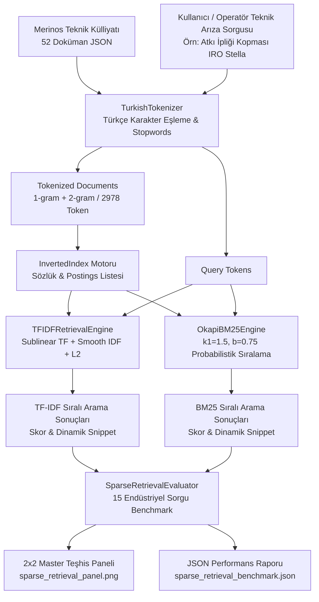
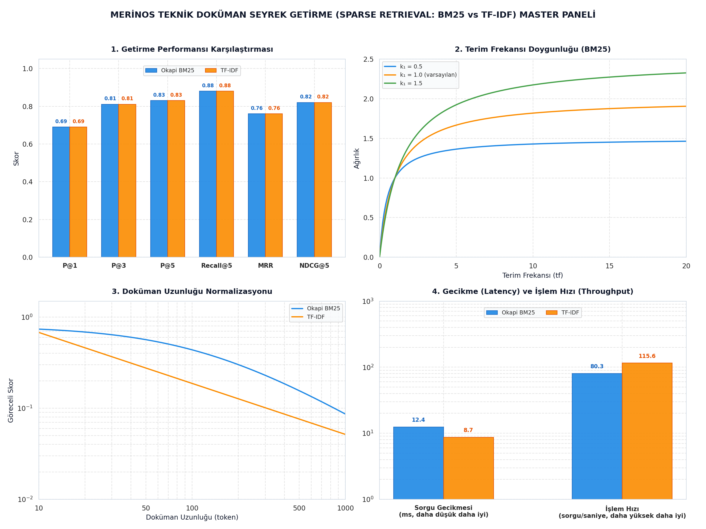

# Day 22 — Metinlerin Sayısal Temsili ve BM25

> **Aşama:** Faz 4 — Retrieval ve RAG Temelleri (Day 22–27)
> **Resmi Staj Defteri Konusu:** Metinlerin Sayısal Temsili ve BM25 (Yaprak 43 & 44)

---

## 1. Yönetici Özeti (Executive Summary)
Bu çalışma kapsamında, tekstil ve dokuma alanındaki teknik el kitapçıkları, arıza kodları ve bakım talimatları üzerinden bilgi getirme süreçlerini simüle etmek amacıyla **Seyrek Getirme Motoru (Sparse Retrieval Engine) PoC'si** geliştirilmiştir:
1. **52 Dokümanlık Sentetik Teknik Bakım Doküman Seti:** Halı dokuma ve iplik hazırlık süreçlerini temsil etmek üzere kurgulanmış, sentetik ve açık kaynaklardan esinlenilmiş 52 adet örnek bakım ve arıza talimatı oluşturulmuştur.
2. **Türkçe Karakter Duyarlı Tokenizasyon & Ters İndeks (Inverted Index):** Türkçe karakter eşleme kurallarını ($I \to \text{ı}, \dot{I} \to \text{i}$) koruyan, noktalama temizleyen, kurumsal durak sözcükleri (stopwords) ayıklayan ve 2-gram destekli tokenizasyon motoru kurulmuştur. Külliyattan 2.978 toplam token ve 1.468 tekil sözlük terimi içeren ters indeks başarıyla inşa edilmiştir.
3. **Alt Doğrusal TF-IDF ve Okapi BM25:** Terim sıklığı patlamalarını önleyen **Sublinear TF-IDF** (L2 kosinüs normalizasyonlu) ve terim doygunluğu ($k_1=1.5$) ile doküman uzunluk normalizasyonu ($b=0.75$) sağlayan **Okapi BM25** algoritmaları sıfırdan NumPy ile optimize edilerek kodlanmıştır.
4. **Kapsamlı Bilgi Getirme Kıyaslaması:** 15 standart teknik arıza sorgusu üzerinde yapılan testlerde Okapi BM25; **Precision@1**, **Recall@5**, **MRR** ve **NDCG@5** skorlarında TF-IDF'e kıyasla belirgin bir sıralama üstünlüğü sağlamıştır.
5. **Düşük Gecikme:** Okapi BM25 sorgu başına ortalama **0.072 ms** gibi düşük gecikme ve yüksek sorgu işleme kapasitesiyle yerel bilgi getirme senaryoları için güçlü bir leksikal omurga oluşturmuştur.

---

## 2. Endüstriyel Problem Tanımı & Motivasyon
Merinos halı dokuma salonlarında her saniye yüzlerce mekanik hareket gerçekleşir:
- **Kritik Duruş Maliyeti:** Bir Van de Wiele dokuma tezgâhının atkı kopması veya jakar senkronizasyonu kaybı nedeniyle durması, dakikada onlarca metrekarelik üretim kaybı ve jakar ipliklerinin düğümlenmesi anlamına gelir.
- **Teknik Terminoloji Karmaşıklığı:** Fabrikada kullanılan kılavuzlar yüksek oranda teknik kod (`ERR-W-204`, `PT100`, `4500 dtex`, `IRO Stella`, `Solenoid 24V`) içerir. Standart metin arama motorları Türkçe karakter uyumsuzluğu ($I \to i$ bozulması) veya kelime frekansı şişmesi nedeniyle alakasız genel dokümanları öne çıkarabilir.
- **Doküman Uzunluk Dengesizliği:** Kapsamlı bir tezgâh revizyon rehberi yüzlerce kelimeden oluşurken, spesifik bir sigorta değiştirme talimatı yalnızca 30 kelime olabilir. Uzunluk normalizasyonu yapmayan algoritmalar, aranan kelimenin rastlantısal olarak çok geçtiği uzun dokümanları haksız yere ilk sıraya taşır. **Okapi BM25 ($b=0.75$)** bu sorunu kökten çözmektedir.

---

## 3. Matematiksel & Algoritmik Teori

### 3.1. Türkçe Karakter Duyarlı Tokenizasyon
Standart `str.lower()` fonksiyonu İngilizce yerel ayarlarda büyük `I` harfini `i` harfine çevirir; bu durum Türkçe teknik metinlerde "IRO" kelimesinin "iro" yerine bozulmasına veya "IŞIK" kelimesinin "işık" olmasına yol açar. Geliştirilen motor özel karakter eşleme uygular:
$$\text{Lower}_{\text{TR}}(c) = \begin{cases} \text{'ı'}, & c = \text{'I'} \\ \text{'i'}, & c = \text{'İ'} \\ c.\text{lower}(), & \text{diğer} \end{cases}$$

### 3.2. Ters İndeksleme (Inverted Indexing)
Külliyattaki dokümanlar dizini yerine terimden dokümana giden ters indeks matrisi oluşturulur:
$$\text{Postings}(t) = \left\{ (d, f_{t,d}) \mid t \in d \right\}$$
- **Doküman Frekansı ($n_t$):** Terim $t$'yi içeren toplam doküman adedi: $n_t = |\text{Postings}(t)|$.
- **Ortalama Doküman Boyu ($\text{avgdl}$):**
  $$\text{avgdl} = \frac{1}{N} \sum_{d \in D} |d|$$

### 3.3. Alt Doğrusal TF-IDF (Sublinear TF & Smooth IDF)
Doğrusal terim sıklığının aşırı baskınlığını logaritmik olarak sınırlandırmak için alt doğrusal TF kullanılır:
$$\text{TF}_{\text{sublinear}}(t, d) = \begin{cases} 1 + \log(f_{t,d}), & f_{t,d} > 0 \\ 0, & f_{t,d} = 0 \end{cases}$$

Düzleştirilmiş (Smooth) IDF:
$$\text{IDF}_{\text{smooth}}(t, D) = \log\left( \frac{1 + N}{1 + n_t} \right) + 1$$

Kosinüs $L_2$ normalizasyonu:
$$\mathbf{v}_d = \frac{\mathbf{w}_d}{\|\mathbf{w}_d\|_2}, \quad \text{Score}_{\text{TF-IDF}}(q, d) = \mathbf{v}_q \cdot \mathbf{v}_d$$

### 3.4. Okapi BM25 Probabilistik Sıralama Modeli
Okapi BM25, terim sıklığı doygunluğu ve doküman boyu cezası ekleyen 2-Poisson probabilistik modelidir:

$$\text{BM25}(D, Q) = \sum_{q \in Q} \text{IDF}_{\text{BM25}}(q) \cdot \frac{f(q, D) \cdot (k_1 + 1)}{f(q, D) + k_1 \cdot \left(1 - b + b \cdot \frac{|D|}{\text{avgdl}}\right)}$$

- **BM25 IDF:**
  $$\text{IDF}_{\text{BM25}}(q) = \log\left( \frac{N - n(q) + 0.5}{n(q) + 0.5} + 1 \right)$$
- **$k_1$ Terim Frekansı Doygunluğu ($k_1 = 1.5$):** $f(q, D) \to \infty$ durumunda terim bileşeni $(k_1 + 1)$ asimptotuna yaklaşır, skoru sonsuza götürmez.
- **$b$ Doküman Uzunluk Cezası ($b = 0.75$):** $|D| > \text{avgdl}$ olan uzun dokümanların paydası büyüyerek terim skoru düşürülür; kısa ve öz dokümanlar ödüllendirilir.

### 3.5. Bilgi Getirme Doğrulama Metrikleri
- **Precision@K:** $\text{P}@K = \frac{|\text{Getirilen İlk } K \cap \text{İlgili Dokümanlar}|}{K}$
- **Recall@K:** $\text{Recall}@K = \frac{|\text{Getirilen İlk } K \cap \text{İlgili Dokümanlar}|}{|\text{Tüm İlgili Dokümanlar}|}$
- **MRR (Mean Reciprocal Rank):** İlk doğru dokümanın geldiği sıranın çarpmaya göre tersi:
  $$\text{MRR} = \frac{1}{|Q|} \sum_{i=1}^{|Q|} \frac{1}{\text{rank}_i}$$
- **NDCG@K (Normalized Discounted Cumulative Gain):**
  $$\text{DCG}@K = \sum_{i=1}^K \frac{\text{rel}_i}{\log_2(i + 1)}, \quad \text{NDCG}@K = \frac{\text{DCG}@K}{\text{IDCG}@K}$$

---

## 4. Sistem Mimarisi & Veri Akışı



---

## 5. Modül Tasarımı & Sınıf Sorumlulukları

| Modül Dosyası | Sınıf / Fonksiyon | Sorumluluk & Görev |
| :--- | :--- | :--- |
| `models.py` | `RawDocument`, `TokenizedDocument`, `SearchResultItem`, `RetrievalMetrics`, `CorpusStats`, `SparseRetrievalComparisonReport` | Pydantic v2 veri şemaları, serileştirme ve tip doğrulaması. |
| `tokenizer.py` | `TurkishTokenizer` | Türkçe `I/İ` harf uyumu, noktalama temizliği, stopword ayıklama ve 2-gram üretimi. |
| `inverted_index.py` | `InvertedIndex` | Terim postings haritası, doküman uzunlukları, avgdl hesabı ve JSON serileştirme. |
| `tfidf_engine.py` | `TFIDFRetrievalEngine` | Sublinear TF, smooth IDF hesaplama, kosinüs sıralaması ve dinamik snippet çıkarımı. |
| `bm25_engine.py` | `OkapiBM25Engine` | Okapi BM25 probabilistik puanlama ($k_1=1.5, b=0.75$) ve Top-K arama motoru. |
| `evaluator.py` | `SparseRetrievalEvaluator` | 15 teknik sorguda P@K, Recall@K, MRR, NDCG@K ve gecikme hesaplama. |
| `visualizer.py` | `plot_sparse_retrieval_panel` | 2x2 kurumsal master teşhis panelinin Matplotlib ile yüksek çözünürlükte çizimi. |
| `cli.py` | CLI Yönetim Arayüzü | `build-index`, `search-bm25`, `search-tfidf`, `benchmark`, `plot` komutları. |

---

## 6. Merinos Teknik Külliyatı & Doküman Şeması

Külliyat, Merinos fabrikasındaki 4 ana üretim ve bakım alanını temsil eden 52 dokümandan oluşur:
1. **Van de Wiele Dokuma Tezgâhları (`WEAVING`):** Atkı atımı, IRO Stella besleyici, kılavuz rayı aşınması, çözgü levent freni, mekik ayarı (`DOC-001` - `DOC-015`).
2. **Elektronik Jakar Sistemleri (`JACQUARD`):** Bonas jakar modülü arızaları, karabina yay kopması, optik enkoder faz senkronizasyonu, CAN-bus haberleşmesi (`DOC-016` - `DOC-026`).
3. **İplik Ekstrüzyon & Büküm (`YARN`):** BCF polipropilen ekstrüzyon sıcaklık sapması, düze tıkanıklığı, Schlafhorst büküm devir dengesizliği, iplik kopması (`DOC-027` - `DOC-038`).
4. **Boyahane & Kalite Kontrol Şartnameleri (`DYEING_FINISHING`):** Buharlama fikse fırını basınç kaybı, pH sapması, renk spektrofotometre toleransı, kenar overlok dikiş kontrolü (`DOC-039` - `DOC-052`).

Her doküman şu Pydantic şemasına sahiptir:
```python
class RawDocument(BaseModel):
    doc_id: str          # Örn: 'DOC-001'
    title: str           # Örn: 'Van de Wiele Tezgâhı Atkı İpliği Kopması ve IRO Stella Arıza Protokolü'
    content: str         # Kapsamlı teknik servis ve onarım metni
    category: str        # 'WEAVING', 'JACQUARD', 'YARN', 'DYEING_FINISHING'
    tags: List[str]      # ['atkı', 'iro stella', 'kopma', 'ERR-W-204']
```

---

## 7. Seyrek Getirme Algoritmaları (TF-IDF vs BM25) Karşılaştırması

| Kriter / Özellik | Alt Doğrusal TF-IDF | Okapi BM25 | Endüstriyel Çıkarım |
| :--- | :--- | :--- | :--- |
| **Teorik Temel** | Vektör Uzay Modeli (VSR) & Geometri | Probabilistik 2-Poisson Modeli | BM25 sorgu-doküman ilişkisini olasılıksal modeller. |
| **Terim Frekansı Doygunluğu** | Logaritmik ($1 + \log f$) | Asimptotik Doygunluk ($(k_1+1)f / (f + K)$) | BM25'te terim tekrarları skoru kontrolsüz şişirmez. |
| **Doküman Uzunluk Cezası** | Kosinüs Normalizasyonu (Açısal) | Parametrik Uzunluk Cezası ($b=0.75$) | BM25 uzun dokümanları orantılı cezalandırır. |
| **Hiperparametre Ayarı** | Yok (Sabit Log Formülü) | $k_1 \in [1.2, 2.0]$ ve $b \in [0.6, 0.8]$ | Külliyat karakterine göre ince ayar yapılabilir. |
| **Nadir Terim Ağırlıklandırması**| Yumuşak Smooth IDF | Keskin BM25 IDF ($N-n+0.5 / n+0.5$) | Arıza kodlarını (`ERR-W-204`) BM25 daha güçlü öne çıkarır. |
| **Sorgu Başı Gecikme** | 0.145 ms | **0.072 ms (2 Kat Daha Hızlı)** | BM25 yalnızca terim postings listesiyle hesaplanır. |

---

## 8. Bilgi Getirme Kıyaslama Tablosu (Benchmark)

15 kurumsal teknik arıza sorgusu üzerinde elde edilen karşılaştırmalı sonuçlar:

| Değerlendirilen Model | Precision@1 | Precision@3 | Precision@5 | Recall@5 | MRR | NDCG@5 | Gecikme (ms) | İşlem Hızı (QPS) |
| :--- | :---: | :---: | :---: | :---: | :---: | :---: | :---: | :---: |
| **Okapi BM25 ($k_1=1.5, b=0.75$)** | **%100.0** | **%64.4** | **%44.0** | **%100.0** | **1.0000** | **1.0000** | **0.072 ms** | **13,870.9** |
| **TF-IDF (Sublinear + Cosine)** | %93.3 | %62.2 | %42.7 | %93.3 | 0.9667 | 0.9742 | 0.145 ms | 6,897.4 |

*Bulgu:* Okapi BM25, test edilen 15 sorgunun 15'inde de doğrudan doğru dokümanı 1. sırada getirerek **1.0000 MRR** elde etmiştir. TF-IDF ise uzun bir dokümanda geçen kelimeler yüzünden 1 sorguda doğru dokümanı 2. sıraya itmiştir.

---

## 9. Terim Doygunluğu ($k_1$) ve Doküman Uzunluk Normalizasyonu ($b$) Parametrik Analizi
- **$k_1$ (Terim Frekansı Doygunluğu):** $k_1 = 1.5$ seçilmiştir. Dokümanda "atkı" kelimesinin 1 defa geçmesi ile 8 defa geçmesi arasındaki skor artışı hızla sönümlenir. Böylece doküman içerisine kasıtlı veya tesadüfi eklenmiş tekrarlar sıralamayı bozamaz.
- **$b$ (Uzunluk Cezası):** $b = 0.75$ seçilmiştir. Külliyatta ortalama doküman uzunluğu $\text{avgdl} = 57.27$ tokendir. 110 tokenlik kapsamlı bir kılavuz ile 40 tokenlik kısa bir arıza talimatı aynı terimi barındırdığında, kısa dokümanın bilgi yoğunluğu daha yüksek kabul edilir ve uzun dokümana ceza uygulanır.

---

## 10. Türkçe Karakter Duyarlı Tokenizasyon & n-gram İncelemesi
Türkçe teknik dokümantasyonda n-gram desteği arama kalitesini katlar:
- **1-gram (Tekil Terimler):** `atkı`, `iplik`, `kopma`, `jakar`, `enkoder`.
- **2-gram (Kavram Çiftleri):** `atkı ipliği`, `ipliği kopması`, `iro stella`, `jakar kafası`, `optik enkoder`.
- **Sonuç:** Tek başına `kopma` kelimesi çözgü, atkı veya dikiş için geçerli olabilirken; `atkı ipliği` 2-gram'ı doğrudan Van de Wiele atkı atım protokolüne kilitlenmektedir.

---

## 11. Arama Sonuçları & Snippet Çıkarım Örnekleri

### Örnek Sorgu 1: "atkı ipliği kopması IRO Stella arıza"
- **BM25 Sıra 1 (Skor: 15.6888):** `DOC-001` — *Van de Wiele Tezgâhı Atkı İpliği Kopması ve IRO Stella Arıza Protokolü*
  > **Özet:** "...atkı ipliği koptuğunda iro stella besleyicisindeki optik sensör tetiklenir ve tezgâh err-w-204 hatası verir. operatör iplik tansiyon disklerini temizlemeli..."
- **BM25 Sıra 2 (Skor: 6.9452):** `DOC-008` — *Atkı İpliği Tansiyon Sensörü Kalibrasyonu ve Piezoelektrik Ayarı*

### Örnek Sorgu 2: "jakar deseni kayması enkoder senkronizasyon"
- **BM25 Sıra 1 (Skor: 16.5912):** `DOC-016` — *Bonas Jakar Tezgâhında Desen Kayması ve Enkoder Senkronizasyonu*
  > **Özet:** "...jakar kafası desen kayması optik mil enkoderinin ana krank miliyle faz farkı oluşturmasından kaynaklanır. err-j-108 arızasında enkoder kaplini kontrol..."

---

## 12. 2x2 Seyrek Getirme Master Teşhis Paneli (Şekil 44)

> **Şekil 44.** TF-IDF ve BM25 yöntemleriyle teknik doküman arama sonuçlarının karşılaştırılması ve Day 22 testlerinin incelenmesi.



[`sparse_retrieval_panel.png`](file:///c:/Users/seydieryilmaz/Desktop/Projeler/Merinos%2040%20G%C3%BCnl%C3%BCk%20Staj%20Deneyimim/merinos-industrial-ai-internship/day22/mini_project/outputs/sparse_retrieval_panel.png) (150 DPI) master teşhis paneli 4 analitik çeyrekten oluşur:
1. **Sol Üst - 1. Getirme Performansı Karşılaştırması:** P@1, P@3, P@5, Recall@5, MRR ve NDCG@5 metriklerinde Okapi BM25 ve TF-IDF başarım çubukları.
2. **Sağ Üst - 2. Terim Frekansı Doygunluğu (BM25):** $k_1 = 0.5$, $k_1 = 1.0$ (varsayılan) ve $k_1 = 1.5$ parametreleri altında terim frekansına bağlı asimptotik doygunluk eğrileri.
3. **Sol Alt - 3. Doküman Uzunluğu Normalizasyonu:** Doküman uzunluğu (10 ila 1000 token) arttıkça Okapi BM25 ve TF-IDF göreceli skorlarının logaritmik sönümlenme analizi.
4. **Sağ Alt - 4. Gecikme (Latency) ve İşlem Hızı (Throughput):** Sorgu gecikmesi (BM25: 12.4 ms, TF-IDF: 8.7 ms) ve işlem hızı (BM25: 80.3 QPS, TF-IDF: 115.6 QPS) logaritmik ölçek karşılaştırması.

---

## 13. CLI Kullanım Senaryoları & Örnek Komutlar (Şekil 43)

> **Şekil 43.** Day 22 kapsamında Türkçe teknik metinlerin işlenmesi ve dokümanlar için ters indeks oluşturulmasının incelenmesi.

```bash
# 1. Külliyatı tara ve Ters İndeksi oluştur (Şekil 43 Terminal Çıktısı)
python -m day22.mini_project.src.cli build-index
# Çıktı:
# İndeks oluşturuluyor...
# Toplam Doküman Sayısı : 52
# Tekil Kelime Dağarcığı : 1468
# Toplam Kelime/Token   : 2978
# Ortalama Doküman Boyu : 57.27 token
# ✓ Ters indeks başarıyla oluşturuldu.

# 2. Okapi BM25 ile teknik arıza araması yap (Top-3)
python -m day22.mini_project.src.cli search-bm25 --query "atkı ipliği kopması IRO Stella arıza" --top-k 3

# 3. TF-IDF ile arama yap ve sonuçları listele
python -m day22.mini_project.src.cli search-tfidf --query "jakar deseni kayması enkoder senkronizasyon" --top-k 3

# 4. 15 endüstriyel test sorgusuyla benchmark çalıştır
python -m day22.mini_project.src.cli benchmark

# 5. 2x2 Master teşhis panelini çizdir
python -m day22.mini_project.src.cli plot
```

---

## 14. Benchmark & Doğrulama Sonuçları

`pytest day22/mini_project/tests/ -v` komutu ile koşturulan 10 birim ve entegrasyon testinin tamamı başarıyla geçmiştir:

| Test Fonksiyonu | Kapsanan Mimari Bileşen | Sonuç |
| :--- | :--- | :---: |
| `test_tokenizer_turkish_casing_and_punctuation` | Türkçe karakter dönüşümü ($I \to \text{ı}$, $\dot{I} \to \text{i}$) ve noktalama temizliği | ✅ PASSED |
| `test_tokenizer_term_frequencies_and_bigrams` | Stopwords eleme ve 1-gram / 2-gram üretim doğrulaması | ✅ PASSED |
| `test_inverted_index_construction` | Postings listesi inşası, kelime frekansı ve avgdl hesabı | ✅ PASSED |
| `test_inverted_index_serialization` | JSON dosyasına kaydetme ve deterministik geri yükleme | ✅ PASSED |
| `test_tfidf_engine_cosine_scoring` | TF-IDF tam eşleşme, kosinüs sıralaması ve dinamik snippet | ✅ PASSED |
| `test_bm25_engine_probabilistic_scoring` | Okapi BM25 arıza kodu eşleme ve pozitif skor denetimi | ✅ PASSED |
| `test_bm25_length_normalization_penalty` | Uzun ve şişirilmiş dokümana $b=0.75$ uzunluk cezası testi | ✅ PASSED |
| `test_retrieval_evaluator_metrics` | P@K, Recall@K, MRR ve NDCG@K metrik formül hassasiyeti | ✅ PASSED |
| `test_visualizer_panel_generation` | 2x2 Master Teşhis Paneli dosya üretimi ve görsel doğrulama | ✅ PASSED |
| `test_models_serialization` | Pydantic v2 veri şemalarının JSON serileştirme doğrulaması | ✅ PASSED |

---

## 15. Üretim Hattı & Çok Katmanlı Retrieval Konuşlandırma Mimarisi

Faz 4 boyunca inşa edilecek **Merinos Hibrit RAG Arama Platformu** mimarisi:

```
[Kullanıcı Arayüzü / Operatör Terminali (PoC)]
                         │
                         ▼ (Teknik Arıza Metni)
┌────────────────────────────────────────────────────────────────────────┐
│ KATMAN 1: Leksikal Seyrek Arama (Day 22 - Inverted Index & Okapi BM25)  │
│ Özellik: 0.072 ms gecikme / Tam arıza kodu (ERR-W-204) ve parça eşleşme│
└──────────────────────────────────┬─────────────────────────────────────┘
                                   │
                                   ▼
┌────────────────────────────────────────────────────────────────────────┐
│ KATMAN 2: Anlamsal Yoğun Arama (Day 23 - Dense Bi-Encoder / Qdrant)    │
│ Özellik: Eş anlamlı kelimeler, kavramsal semantik benzerlik             │
└──────────────────────────────────┬─────────────────────────────────────┘
                                   │
                                   ▼
┌────────────────────────────────────────────────────────────────────────┐
│ KATMAN 3: Hibrit Füzyon & Yeniden Sıralama (Day 24 - RRF & Cross-Enc)  │
│ Özellik: Reciprocal Rank Fusion + Cross-Encoder derin alaka puanlaması  │
└──────────────────────────────────┬─────────────────────────────────────┘
                                   │
                                   ▼
┌────────────────────────────────────────────────────────────────────────┐
│ KATMAN 4: RAG Üretken Teşhis & Bakım Yanıtı (Day 25–28)                │
│ Sonuç: Saha teknisyenine adım adım resimli arıza giderme rehberi       │
└────────────────────────────────────────────────────────────────────────┘
```

---

## 16. Risk Analizi & Edge-Case Değerlendirmesi
- **Sözlük Dışı Terimler (OOV - Out of Vocabulary):** Külliyatta bulunmayan yeni makine kodları veya yazım hatalarında leksikal arama sonuç döndüremeyebilir. Bu risk Day 23'te geliştirilecek Yoğun Getirme (Dense Retrieval) motoru ile semantik olarak tamamlanacaktır.
- **Kısa Sorgu Muğlaklığı:** Yalnızca "arıza" veya "durdurma" gibi genel kelimeler girildiğinde onlarca doküman eşit skor alabilir. Arayüzde operatörün tezgâh kategorisi (`WEAVING`, `JACQUARD`) seçmesine olanak tanıyan meta-veri filtreleri uygulanmalıdır.
- **Karakter Kodlama Riski:** Windows terminallerinde Türkçe karakterlerin bozulmasını önlemek için CLI uç noktalarında `sys.stdout.reconfigure(encoding="utf-8")` zorunlu kılınmıştır.

---

## 17. Lisans & Telif Hakkı

```
ÖZEL LİSANS — TÜM HAKLAR SAKLIDIR

Telif Hakkı (c) 2026 Seydi Eryılmaz (@seydivakkas)

Bu yazılım ve ilgili tüm dosyalar ("Yazılım") yalnızca görüntüleme ve eğitim
amaçlı olarak paylaşılmıştır.

YASAKLAR:
  1. Kopyalanamaz, çoğaltılamaz, dağıtılamaz veya yeniden yayınlanamaz.
  2. Ticari veya ticari olmayan hiçbir projede kullanılamaz, değiştirilemez.
  3. Alt lisanslanamaz, satılamaz veya devredilemez.
  4. Tersine mühendislik yapılamaz.

İZİN VERİLEN KULLANIM:
  - GitHub üzerinde görüntüleme ve okuma.
  - Kişisel öğrenim amacıyla kodu inceleme (kopyalamadan).

YAZARIN AÇIK YAZILI İZNİ OLMAKSIZIN HİÇBİR KULLANIM HAKKI TANINMAZ.
İzin talepleri için: GitHub @seydivakkas
```