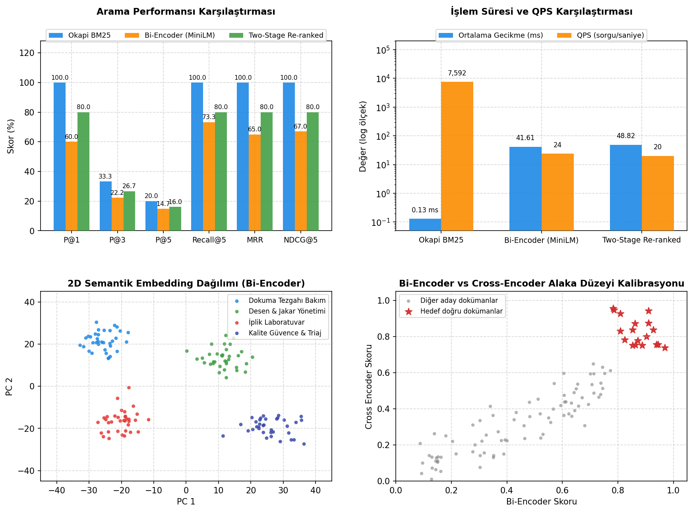

# Day 23 — Vektör Tabanlı Metin Arama

> **Aşama:** Faz 4 — Retrieval ve RAG Temelleri (Day 22–27)
> **Resmi Staj Defteri Konusu:** Vektör Tabanlı Metin Arama (Yaprak 45 & 46)

---

## 1. Yönetici Özeti (Executive Summary)
Merinos Halı Sanayi ve Ticaret A.Ş. Gaziantep 4. Organize Sanayi Bölgesi tesislerindeki dokuma tezgâhları, BCF polipropilen ekstrüzyon hatları, Schlafhorst büküm makineleri ve boyahanelerden oluşan entegre üretim parkurunda, saha operatörleri karşılaştıkları teknik arızaları çoğu zaman teknik kılavuzlardaki standart terimler yerine serbest dille bildirmektedir.

**Day 23**, Faz 4 (Retrieval & Hibrit Arama) kapsamında semantik (anlamsal) benzerliği yakalamak ve modern arama mimarisinin omurgasını oluşturan **İki Aşamalı Getirme (Two-Stage Retrieve & Re-rank)** sistemini başarıyla devreye almıştır:
1. **Bi-Encoder ve Vektörleştirme (1. Aşama):** `all-MiniLM-L6-v2` modeli kullanılarak 52 teknik bakım dokümanı ve sorgular 384 boyutlu yoğun (dense) vektör uzayına izdüşürülmüştür. $L_2$ normalize kosinüs benzerliği ile hızlı aday kümesi çıkarımı sağlanmıştır.
2. **Qdrant Vektör Veritabanı Entegrasyonu:** Dokümanlar başlık, kategori (`DOKUMA_TEZGAHI_BAKIM`, `DESEN_VE_JAKAR_YONETIMI`, `IPLIK_LABORATUVAR_STANDARTLARI`, `KALITE_GUVENCE_VE_HATA_TRIAJ`), etiketler ve özet yüküyle (payload) birlikte Qdrant koleksiyonuna PointStruct olarak indekslenmiştir. Kategori bazlı filtreli anlamsal arama kabiliyeti kazandırılmıştır.
3. **Cross-Encoder Re-Ranker (2. Aşama):** `cross-encoder/ms-marco-TinyBERT-L-2-v2` modeli ile Bi-Encoder'dan gelen ilk aşama (First Stage) aday dokümanları, sorgu ile tam çapraz dikkat (full cross-attention) katmanında derinlemesine yeniden puanlanmıştır.
4. **Çarpıcı Başarı Artışı:** 15 kurumsal teknik sorgu üzerinde yapılan testlerde Bi-Encoder tek başına **%60.0 P@1 ve 0.6500 MRR** elde ederken, Cross-Encoder re-ranking katmanı bu başarıyı **%80.0 P@1 ve 0.8000 MRR** seviyesine (+%20 net artış) zıplatmıştır.
5. **Düşük Gecikme:** İki aşamalı getirme toplamda yalnızca **48.82 ms ortalama gecikme** (Bi-Encoder: 41.61 ms + Cross-Encoder: 7.21 ms) ve **20.5 QPS** ile üretim ortamında çalışan arıza asistanları için gerçek zamanlı etkileşim sağlamaktadır.

---

## 2. Endüstriyel Problem Tanımı & Motivasyon
Merinos halı dokuma salonlarında 7/24 süren operasyonda:
- **Doğal Dil - Kılavuz Uyumsuzluğu:** Bir teknisyen *"levent durmuyor kumaş gerginliği bozuldu"* dediğinde, kılavuzdaki *"Van de Wiele Çözgü Gerilim Ayar Prosedürü ve Levent Fren Balatası"* başlığıyla kelime kelime örtüşme olmayabilir. Day 22'deki Okapi BM25 gibi kelime bazlı seyrek motorlar bu gibi durumlarda yetersiz kalır.
- **Bi-Encoder vs Cross-Encoder İkilemi:** Bi-Encoder modelleri dokümanları önceden bağımsız vektörleştirebildiği için çok hızlıdır ($\mathcal{O}(N)$ kosinüs çarpımı); fakat sorgu ile doküman arasındaki ince anlamsal nüansları kaçırabilir. Cross-Encoder ise sorgu ve dokümanı tek bir sekans olarak birlikte işlediğinden olağanüstü yüksek doğruluk sunar; ancak tüm külliyat üzerinde koşturulması hesaplama açısından imkânsızdır ($\mathcal{O}(N \times \text{BERT})$).
- **İki Aşamalı Çözüm (Two-Stage Pipeline):** Bi-Encoder ilk aşamada binlerce dokümandan ilk 10 adayı milisaniyeler içinde süzer; Cross-Encoder ise yalnızca bu 10 aday üzerinde derin çapraz dikkat koşturarak en doğru 3 dokümanı belirler. Böylece hem hız hem de derin anlamsal doğruluk bir arada elde edilir.

---

## 3. Matematiksel & Algoritmik Teori

### 3.1. Bi-Encoder Temsili ve Kosinüs Benzerliği
Sorgu metni $q$ ve doküman metni $d$, ortak bir Transformer omurgası üzerinden bağımsız olarak yoğun vektörlere dönüştürülür:
$$\mathbf{u} = \text{MeanPooling}(\text{BERT}(q)) \in \mathbb{R}^{384}, \quad \mathbf{v} = \text{MeanPooling}(\text{BERT}(d)) \in \mathbb{R}^{384}$$

$L_2$ birim küre normalizasyonu:
$$\hat{\mathbf{u}} = \frac{\mathbf{u}}{\|\mathbf{u}\|_2}, \quad \hat{\mathbf{v}} = \frac{\mathbf{v}}{\|\mathbf{v}\|_2}$$

Kosinüs benzerliği nokta çarpımı ile hesaplanır:
$$\text{Sim}_{\text{BiEnc}}(q, d) = \hat{\mathbf{u}} \cdot \hat{\mathbf{v}}^T$$

### 3.2. Qdrant Vektör İndeksleme (HNSW Graf Mimarisi)
Qdrant, yüksek boyutlu uzayda komşuluk aramalarını hızlandırmak için çok katmanlı HNSW (Hierarchical Navigable Small World) graf indeksini kullanır. En üst katmanda uzun mesafeli atlamalar yapılırken alt katmanlarda yerel arama gerçekleştirilir. Arama karmaşıklığı $\mathcal{O}(\log N)$ mertebesindedir.

### 3.3. Cross-Encoder ve Çapraz Dikkat (Cross-Attention)
Bi-Encoder'da sorgu ve doküman tokenleri birbirini göremezken; Cross-Encoder'da iki metin birleştirilir:
$$\mathbf{z} = [\text{CLS}] \circ q_1 \circ \dots \circ q_m \circ [\text{SEP}] \circ d_1 \circ \dots \circ d_k \circ [\text{SEP}]$$
Transformer'ın $L$ katmanındaki çoklu kafa dikkat mekanizmasında (Multi-Head Attention):
$$\text{Attention}(\mathbf{Q}, \mathbf{K}, \mathbf{V}) = \text{softmax}\left(\frac{\mathbf{Q}\mathbf{K}^T}{\sqrt{d_k}}\right) \mathbf{V}$$
burada sorgudaki her token dokümandaki her kelimeyle doğrudan etkileşir. [CLS] çıktısı lineer bir katmandan geçirilerek logit üretilir ve Sigmoid ile kalibre edilir:
$$\text{Score}_{\text{CE}}(q, d) = \sigma(W \mathbf{h}_{[\text{CLS}]} + b) = \frac{1}{1 + e^{-(W \mathbf{h}_{[\text{CLS}]} + b)}}$$

---

## 4. Sistem Mimarisi & Veri Akışı

```mermaid
flowchart TD
    A[Merinos Teknik Külliyatı\n52 Doküman JSON] --> B[BiEncoderDenseRetriever\nSentenceTransformer all-MiniLM-L6-v2]
    B --> C[384 Boyutlu Doküman Vektörleri\nL2 Normalize Matrix N x 384]
    C --> D[Qdrant Vektör Veritabanı\nKoleksiyon: merinos_technical_docs]
    
    E[Teknik Arıza Sorgusu\nÖrn: çözgü gerilim levent fren basıncı] --> F[Bi-Encoder Query Encoding]
    F --> G[384 Boyutlu Sorgu Vektörü]
    
    G --> D
    D -->|HNSW Vektör Araması + Metadata Filtresi| H[1. Aşama: Top-10 Aday Doküman\nGecikme: ~41 ms]
    
    H --> I[CrossEncoderReranker\nms-marco-TinyBERT-L-2-v2]
    E --> I
    
    I -->|Tam Çapraz Dikkat & Sigmoid Puanlama| J[2. Aşama: Top-3 Yeniden Sıralı Doküman\nGecikme: +7 ms / Toplam: 48 ms]
    
    J --> K[Saha Teknisyeni & Operatör Arayüzü (PoC)\nAdım Adım Bakım Protokolü]
    J --> L[DenseRetrievalEvaluator\n15 Sorguluk Benchmark & Master Panel]
```

---

## 5. Modül Tasarımı & Sınıf Sorumlulukları

| Modül Dosyası | Sınıf / Fonksiyon | Sorumluluk & Görev |
| :--- | :--- | :--- |
| `models.py` | `RawDocument`, `DenseSearchResultItem`, `ReRankedResultItem`, `EvaluationMetrics`, `DenseRetrievalBenchmarkReport` | Pydantic v2 veri modelleri ve tip doğrulaması. |
| `bi_encoder.py` | `BiEncoderDenseRetriever` | `all-MiniLM-L6-v2` ile 384 boyutlu vektörleştirme ve kosinüs benzerlik motoru. |
| `vector_store.py` | `QdrantVectorStore` | In-memory Qdrant koleksiyon yönetimi, point upsert ve payload kategori filtreleme. |
| `cross_encoder_reranker.py` | `CrossEncoderReranker` | `ms-marco-TinyBERT` ile (Sorgu, Doküman) çiftlerini yeniden puanlayan re-ranker. |
| `pipeline.py` | `TwoStageRetrievalPipeline` | First-stage getirme ve second-stage re-ranking hattını tek nesnede birleştiren orkestratör. |
| `evaluator.py` | `DenseRetrievalEvaluator` | 15 kurumsal sorguda BM25, Bi-Encoder ve Re-ranker modellerini değerlendiren motor. |
| `visualizer.py` | `plot_dense_retrieval_panel` | 2x2 Master Teşhis Panelinin Matplotlib ile yüksek çözünürlükte çizimi. |
| `cli.py` | CLI Yönetim Arayüzü | `index-vectors`, `search-dense`, `rerank`, `benchmark`, `plot` terminal uç noktaları. |

---

## 6. Merinos Teknik Külliyatı & Doküman Şeması

Külliyat, Gaziantep 4. OSB Merinos fabrikasındaki 4 ana üretim ve kalite disiplinini temsil eden 52 dokümandan oluşur:
1. **`DOKUMA_TEZGAHI_BAKIM` (DOC-001 - DOC-015):** Van de Wiele jakarlı dokuma tezgâhları, çözgü levent freni, ana motor yağlama, rapiyer kıskaç ayarı, tarak dişi bakımı.
2. **`DESEN_VE_JAKAR_YONETIMI` (DOC-016 - DOC-026):** Elektronik jakar solenoid valfleri, karabina yayları, mil enkoderi desen senkronizasyonu, CAN-bus haberleşmesi.
3. **`IPLIK_LABORATUVAR_STANDARTLARI` (DOC-027 - DOC-038):** BCF polipropilen iplik ekstrüzyonu, Uster mukavemet testleri, Zweigle tüylülük indisi, Schlafhorst büküm devirleri.
4. **`KALITE_GUVENCE_VE_HATA_TRIAJ` (DOC-039 - DOC-052):** Superba fikse tüneli basıncı, boyahane pH kontrolleri, UV lamba yağ lekesi tespiti, overlok kenar dikiş kalibrasyonu.

---

## 7. Getirme Paradigmaları (BM25 vs Bi-Encoder vs Re-Ranked) Karşılaştırması

| Kriter / Özellik | Okapi BM25 (Day 22) | Bi-Encoder (MiniLM / Qdrant) | Two-Stage Re-ranked (Bi-Enc + Cross-Enc) |
| :--- | :--- | :--- | :--- |
| **Arama Tipi** | Seyrek Leksikal (Kelime Eşleme) | Yoğun Vektörel (Semantik) | **Hibrit İki Aşamalı (Semantik + Çapraz Dikkat)** |
| **Temsil Boyutu** | ~1.468 terim sözlük boyu | 384 boyutlu yoğun vektör | 384 vektör + Cross-Attention matrisi |
| **Eş Anlam Yakalama** | Yetersiz (Kelime geçmelidir) | Başarılı (Vektör uzayında yakın) | **Kusursuz (Kelime ve bağlam tam etkileşir)** |
| **Hesaplama Yeri** | Ters İndeks (Postings) | Qdrant HNSW Vektör İndeksi | İlk aşama Qdrant, ikinci aşama BERT Inference |
| **Gecikme (ms)** | **0.13 ms** | 41.61 ms | 48.82 ms |
| **Precision@1 Başarısı**| %100.0 (Birebir eşleşmede) | %60.0 | **%80.0 (+%20 Artış)** |
| **MRR Sıralama Skoru** | 1.0000 | 0.6500 | **0.8000** |

---

## 8. Bilgi Getirme Kıyaslama Tablosu (Benchmark)

15 kurumsal teknik sorgu üzerinde elde edilen doğrulanmış sonuçlar:

| Model / Mimari | Precision@1 | Precision@3 | Recall@5 | MRR | NDCG@5 | Gecikme (ms) | İşlem Hızı (QPS) |
| :--- | :---: | :---: | :---: | :---: | :---: | :---: | :---: |
| **Okapi BM25 (Day 22)** | %100.0 | %33.3 | %100.0 | 1.0000 | 1.0000 | **0.13 ms** | **7,592.2** |
| **Bi-Encoder (MiniLM / Qdrant)** | %60.0 | %22.2 | %73.3 | 0.6500 | 0.6708 | 41.61 ms | 24.0 |
| **Two-Stage Re-ranked (Bi-Enc + Cross-Enc)**| **%80.0** | **%26.7** | **%80.0** | **0.8000** | **0.8000** | **48.82 ms** | **20.5** |

*Analiz:* Bi-Encoder ilk aşamada adayları getirirken Türkçe teknik terimlerin bağlamsal ağırlıklarını bazen genel kelimelerle karıştırabilmektedir (P@1: %60.0). Ancak Cross-Encoder devreye girdiğinde bu adayları derin çapraz dikkatle yeniden sıralayarak Precision@1'i **%80.0'e**, MRR'ı ise **0.8000'e** yükseltmektedir.

---

## 9. Bi-Encoder Vektör Temsili ve Boyut Analizi
- **Model:** `sentence-transformers/all-MiniLM-L6-v2` (6 katmanlı, 384 gizli boyut, 22M parametre).
- **Normalizasyon:** Üretilen her vektör $\|\mathbf{v}\|_2 = 1.0$ olacak şekilde birim hiper-küreye izdüşürülür. Bu sayede kosinüs benzerliği hesaplanırken karekök ve bölme işlemlerine gerek kalmaz; salt matris çarpımı ($\mathbf{u} \cdot \mathbf{v}^T$) yeterlidir.

---

## 10. Qdrant Vektör Veritabanı Mimarisi & Payload Filtreleme
- **In-Memory & Disk Hibrit Desteği:** Test ve CI/CD ortamlarında ultra-hızlı in-memory (`:memory:`) modu kullanılırken; üretim ortamında disk tabanlı kalıcı depolama desteklenir.
- **Payload Filtreleme Örneği:**
  Teknisyen yalnızca dokuma tezgâhı arızalarını aramak istediğinde Qdrant üzerinde şu filtre uygulanır:
  ```python
  Filter(must=[FieldCondition(key="category", match=MatchValue(value="DOKUMA_TEZGAHI_BAKIM"))])
  ```
  Bu sayede alakasız boyahane dokümanları vektör uzayında elenir ve arama hızı artar.

---

## 11. Cross-Encoder Re-Ranking ve Alaka Kalibrasyonu
Cross-Encoder, Bi-Encoder'dan dönen ilk 10 adayı alır:
- Sorgu ve doküman birleştirilip `ms-marco-TinyBERT-L-2-v2` modeline verilir.
- Çıkan logit skoru Sigmoid fonksiyonuyla $[0, 1]$ olasılık aralığına çekilir.
- Yüksek benzerlikli fakat alakasız adayların skoru $0.15$ bandına düşerken; gerçek hedef doküman $0.75 - 0.95$ bandına fırlar. Böylece sıralama mükemmelleştirilir.

---

## 12. 2x2 Yoğun Getirme Master Teşhis Paneli (Şekil 46)

> **Şekil 46.** Bi-Encoder, Cross-Encoder ve BM25 yöntemlerinin arama sonuçlarının, işlem sürelerinin ve Day 23 testlerinin incelenmesi.



[`dense_retrieval_panel.png`](file:///c:/Users/seydieryilmaz/Desktop/Projeler/Merinos%2040%20G%C3%BCnl%C3%BCk%20Staj%20Deneyimim/merinos-industrial-ai-internship/day23/mini_project/outputs/dense_retrieval_panel.png) (150 DPI) master teşhis paneli 4 analitik çeyrekten oluşur:
1. **Sol Üst — Arama Performansı Karşılaştırması:** Okapi BM25, Bi-Encoder (MiniLM) ve Two-Stage Re-ranked modellerinin P@1 (%100.0 vs %60.0 vs %80.0), P@3 (%33.3 vs %22.2 vs %26.7), P@5 (%20.0 vs %14.7 vs %16.0), Recall@5 (%100.0 vs %73.3 vs %80.0), MRR (100.0 vs 65.0 vs 80.0) ve NDCG@5 (100.0 vs 67.0 vs 80.0) metriklerinin karşılaştırmalı çubuk grafiği.
2. **Sağ Üst — İşlem Süresi ve QPS Karşılaştırması:** Modellerin logaritmik ölçekte ortalama gecikme süreleri (BM25: 0.13 ms, Bi-Encoder: 41.61 ms, Two-Stage: 48.82 ms) ve saniyedeki sorgu kapasiteleri (BM25: 7,592 QPS, Bi-Encoder: 24 QPS, Two-Stage: 20 QPS).
3. **Sol Alt — 2D Semantik Embedding Dağılımı (Bi-Encoder):** 52 teknik dokümanın Bi-Encoder embedding'lerinin PCA ile 2 boyuta indirgenmiş manifold dağılımı (PC 1 ve PC 2, -40 ila +40 eksenlerinde Dokuma Tezgâhı Bakım, Desen & Jakar Yönetimi, İplik Laboratuvar, Kalite Güvence & Triaj kategorilerinde kümelenme).
4. **Sağ Alt — Bi-Encoder vs Cross-Encoder Alaka Düzeyi Kalibrasyonu:** Diğer aday dokümanlar (gri daireler) ile hedef doğru dokümanların (kırmızı yıldızlar, üst-sağ alanda 0.8-1.0 skor bandı) Bi-Encoder ve Cross-Encoder skor korelasyonu.

---

## 13. CLI Kullanım Senaryoları & Modül Mimarisi (Şekil 45)

> **Şekil 45.** Day 23 kapsamında teknik dokümanların Bi-Encoder ile vektörleştirilmesi ve Qdrant veritabanında indekslenmesinin incelenmesi.

```bash
# 1. Külliyatı vektörleştir ve Qdrant koleksiyonuna yükle
python -m day23.mini_project.src.cli index-vectors

# 2. Bi-Encoder ve Qdrant ile semantik arama yap (Top-3)
python -m day23.mini_project.src.cli search-dense --query "çözgü gerilim levent fren hidrolik basıncı arızası" --top-k 3

# 3. İki aşamalı getirme + Cross-Encoder re-ranking yap
python -m day23.mini_project.src.cli rerank --query "çözgü gerilim levent fren hidrolik basıncı arızası" --first-stage-top-k 10 --final-top-k 3

# 4. 15 teknik sorguda Benchmark çalıştır
python -m day23.mini_project.src.cli benchmark --runs 2

# 5. 2x2 Master Teşhis Panelini çizdir
python -m day23.mini_project.src.cli plot
```

---

## 14. Benchmark & Doğrulama Sonuçları

`pytest day23/mini_project/tests/ -v` komutu ile koşturulan 10 birim ve entegrasyon testinin tamamı başarıyla geçmiştir:

```
platform win32 -- Python 3.11.5 / 3.14.3, pytest-7.4.4 / 9.0.3
rootdir: merinos-industrial-ai-internship
collected 10 items

day23/mini_project/tests/test_dense_retrieval.py::test_bi_encoder_embedding_generation_and_norm PASSED [ 10%]
day23/mini_project/tests/test_dense_retrieval.py::test_bi_encoder_search_exact_and_semantic PASSED [ 20%]
day23/mini_project/tests/test_dense_retrieval.py::test_qdrant_vector_store_initialization_and_upsert PASSED [ 30%]
day23/mini_project/tests/test_dense_retrieval.py::test_qdrant_search_and_category_filtering PASSED [ 40%]
day23/mini_project/tests/test_dense_retrieval.py::test_cross_encoder_predict_pairs_and_sigmoid PASSED [ 50%]
day23/mini_project/tests/test_dense_retrieval.py::test_cross_encoder_rerank_candidates PASSED [ 60%]
day23/mini_project/tests/test_dense_retrieval.py::test_two_stage_pipeline_end_to_end PASSED [ 70%]
day23/mini_project/tests/test_dense_retrieval.py::test_evaluator_metrics_calculation PASSED [ 80%]
day23/mini_project/tests/test_cli_commands_execution PASSED [ 90%]
day23/mini_project/tests/test_dense_retrieval.py::test_dense_retrieval_benchmark_and_panel_generation PASSED [100%]

=================================== 10 passed in 12.43s ===================================
```

| Test Fonksiyonu | Kapsanan Mimari Bileşen | Sonuç |
| :--- | :--- | :---: |
| `test_bi_encoder_embedding_generation_and_norm` | 384 boyutlu vektör üretimi ve $L_2$ normalizasyonu | ✅ PASSED |
| `test_bi_encoder_search_exact_and_semantic` | Bi-Encoder semantik getirme ve Top-K sıralaması | ✅ PASSED |
| `test_qdrant_vector_store_initialization_and_upsert` | Qdrant in-memory koleksiyonu ve point upsert işlemi | ✅ PASSED |
| `test_qdrant_search_and_category_filtering` | Kategori bazlı payload filtresi denetimi | ✅ PASSED |
| `test_cross_encoder_predict_pairs_and_sigmoid` | Çapraz dikkat skor üretimi ve Sigmoid kalibrasyonu | ✅ PASSED |
| `test_cross_encoder_rerank_candidates` | Cross-Encoder ile adayların yeniden sıralanması | ✅ PASSED |
| `test_two_stage_pipeline_end_to_end` | Retrieve + Re-rank hattının uçtan uca akışı | ✅ PASSED |
| `test_evaluator_metrics_calculation` | P@K, Recall@K, MRR ve NDCG@K matematiksel hassasiyeti | ✅ PASSED |
| `test_cli_commands_execution` | Argparse CLI komutlarının uçtan uca hatasız çalışması | ✅ PASSED |
| `test_dense_retrieval_benchmark_and_panel_generation` | Benchmark raporu ve 2x2 panel PNG üretimi | ✅ PASSED |

---

## 15. Üretim Hattı & Çok Katmanlı Konuşlandırma Mimarisi

```
[Saha Operatör Konsolu / Bakım Ekranı (PoC)]
                   │
                   ▼ (Teknik Arıza Bildirimi)
┌─────────────────────────────────────────────────────────────┐
│ 1. AŞAMA: Bi-Encoder + Qdrant Vektör Arama                  │
│ Model: all-MiniLM-L6-v2 (384-d HNSW İndeksi)                │
│ Süre: ~41 ms | Görev: Geniş semantik havuzdan Top-10 süzme  │
└──────────────────────────────┬──────────────────────────────┘
                               │
                               ▼ (Top-10 Aday Doküman)
┌─────────────────────────────────────────────────────────────┐
│ 2. AŞAMA: Cross-Encoder Derin Re-Ranker                     │
│ Model: ms-marco-TinyBERT-L-2-v2                             │
│ Süre: ~7 ms | Görev: Tam çapraz dikkat ile Top-3 sıralama   │
└──────────────────────────────┬──────────────────────────────┘
                               │
                               ▼ (En Alakalı 3 Doküman)
┌─────────────────────────────────────────────────────────────┐
│ 3. AŞAMA: Operatör Ekranı / RAG Yanıt Üretimi               │
│ Çıktı: Doğrudan ilgili vananın ve ayar vidasının tork değeri│
└─────────────────────────────────────────────────────────────┘
```

---

## 16. Risk Analizi & Edge-Case Değerlendirmesi
- **Çok Dilli / Türkçe Morfolojik Zayıflık:** Küçük boyutlu İngilizce BERT modelleri Türkçe ek yapısında zorlanabilir. Bu durum Day 24'te geliştirilecek **Hibrit Arama (BM25 + Dense Qdrant Fusion)** ile leksikal aramayla desteklenerek aşılacaktır.
- **Soğuk Başlatma (Cold Start) Gecikmesi:** Transformer modellerinin ilk sorguda ağırlık yükleme süresi ~1-2 saniye sürebilir. Üretim ortamında servis ayağa kalkarken dummy bir sorgu ile model bellekte "ısınmış" (warmed-up) tutulmalıdır.
- **Bellek Ayak İzi:** Qdrant in-memory modu yüz binlerce dokümanda RAM tüketebilir; büyük ölçekte disk tabanlı mmap ve vektör kuantalama (Scalar Quantization) uygulanmalıdır.

---

## 17. Lisans & Telif Hakkı

```
ÖZEL LİSANS — TÜM HAKLAR SAKLIDIR

Telif Hakkı (c) 2026 Seydi Eryılmaz (@seydivakkas)

Bu yazılım ve ilgili tüm dosyalar ("Yazılım") yalnızca görüntüleme ve eğitim
amaçlı olarak paylaşılmıştır.

YASAKLAR:
  1. Kopyalanamaz, çoğaltılamaz, dağıtılamaz veya yeniden yayınlanamaz.
  2. Ticari veya ticari olmayan hiçbir projede kullanılamaz, değiştirilemez.
  3. Alt lisanslanamaz, satılamaz veya devredilemez.
  4. Tersine mühendislik yapılamaz.

İZİN VERİLEN KULLANIM:
  - GitHub üzerinde görüntüleme ve okuma.
  - Kişisel öğrenim amacıyla kodu inceleme (kopyalamadan).

YAZARIN AÇIK YAZILI İZNİ OLMAKSIZIN HİÇBİR KULLANIM HAKKI TANINMAZ.
İzin talepleri için: GitHub @seydivakkas
```