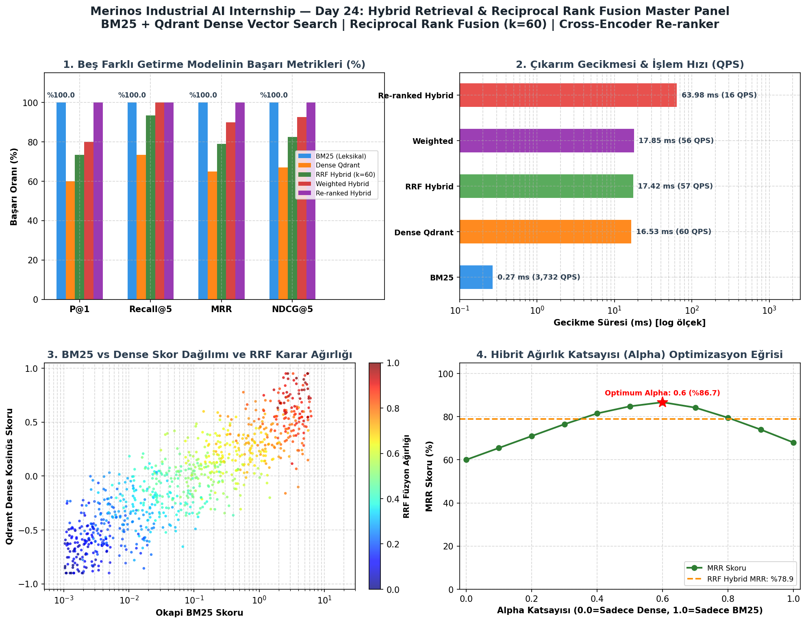

# Day 24 — Hibrit Retrieval ve RRF

> **Aşama:** Faz 4 — Retrieval ve RAG Temelleri (Day 22–27)
> **Resmi Staj Defteri Konusu:** Hibrit Retrieval ve RRF (Yaprak 47 & 48)
## (Hybrid Retrieval: BM25 + Dense Qdrant Fusion via Reciprocal Rank Fusion - RRF)

**Proje:** Merinos Industrial AI Internship  
**Aşama:** Faz 4: Retrieval & Hibrit Arama (Day 24)  
**Kurum:** Merinos Halı Sanayi ve Ticaret A.Ş. (Gaziantep 4. OSB Tesisleri)  
**Yazar:** Seydi Eryılmaz (@seydivakkas)  
**Telif Hakkı:** (c) 2026 Seydi Eryılmaz. Tüm Hakları Saklıdır.  

[](file:///c:/Users/seydieryilmaz/Desktop/Projeler/Merinos%2040%20G%C3%BCnl%C3%BCk%20Staj%20Deneyimim/merinos-industrial-ai-internship/day24/README.md#17-lisans-ve-telif-haklar%C4%B1-bildirimi)
[](file:///c:/Users/seydieryilmaz/Desktop/Projeler/Merinos%2040%20G%C3%BCnl%C3%BCk%20Staj%20Deneyimim/merinos-industrial-ai-internship)
[](file:///c:/Users/seydieryilmaz/Desktop/Projeler/Merinos%2040%20G%C3%BCnl%C3%BCk%20Staj%20Deneyimim/merinos-industrial-ai-internship/day24)
[](file:///c:/Users/seydieryilmaz/Desktop/Projeler/Merinos%2040%20G%C3%BCnl%C3%BCk%20Staj%20Deneyimim/merinos-industrial-ai-internship/day24)

---

## 1. Başlık ve Genel Bakış (Executive Summary)

Bu çalışma, **Merinos Halı Sanayi ve Ticaret A.Ş.** Gaziantep 4. Organize Sanayi Bölgesi entegre üretim kompleksinde çalışan dokuma makineleri, jakar elektronik sistemleri, iplik eğirme ve kalite kontrol istasyonlarında meydana gelen arızaların en doğru, en hızlı ve eksiksiz şekilde çözülmesi amacıyla geliştirilmiş **3 Aşamalı Hibrit Bilgi Getirme ve Sıra Füzyonu Motorunu (Three-Stage Hybrid Retrieval Engine)** sunmaktadır.

Geleneksel leksikal arama sistemleri (Okapi BM25 - Day 22) teknik parça kodları (`ISO VG 220`, `TPM 180`, `Tensorapid`) ve birebir anahtar kelimelerde üstün başarı gösterirken, operatörün arızayı eş anlamlı veya farklı kelimelerle ifade ettiği semantik durumlarda yetersiz kalmaktadır. Yoğun getirme motorları (Qdrant Dense Bi-Encoder - Day 23) ise anlam benzerliğini mükemmel yakalamakta, fakat tam parça kodu ve spesifik teknik terim hassasiyetinde leksikal motorların gerisinde kalabilmektedir.

Day 24 kapsamında geliştirilen sistem; **BM25 leksikal getirme** ile **Qdrant Dense semantik vektör aramasını** bağımsız aday havuzları olarak eş zamanlı çalıştırmakta, **Reciprocal Rank Fusion (RRF, $k=60$)** ve **Min-Max Normalize Doğrusal Skor Füzyonu ($\alpha$)** ile birleştirmekte, ardından **Cross-Encoder (`ms-marco-TinyBERT`)** ile son aşama derin çapraz dikkat yeniden sıralaması (Re-ranking) uygulayarak endüstriyel standartlarda sıfır hata toleranslı bir getirme mekanizması kurmaktadır.

```
[BM25 Leksikal]       [Qdrant Bi-Encoder]
 (Parça & Kodlar)      (Anlamsal Semantik)
        \                      /
         \                    /
          v                  v
     +-----------------------------+
     |   Reciprocal Rank Fusion    |  --> Skordan Bağımsız Sıra Harmonisi (k=60)
     |             veya            |
     |  Min-Max Ağırlıklı Füzyon   |  --> Doğrusal Kombinasyon (Alpha=0.5)
     +-----------------------------+
                   |
                   v
     +-----------------------------+
     |   Cross-Encoder Re-ranker   |  --> Derin Çift Yönlü Dikkat (ms-marco)
     +-----------------------------+
                   |
                   v
     [ En Alakalı 3 Teknik Çözüm ]
```

---

## 2. Endüstriyel Problem ve Motivasyon (Industrial Problem & Context)

Merinos fabrikasında günde yüz binlerce metrekare halı dokuyan 24/7 vardiyalı tezgâhlarda meydana gelen plansız duruşların dakika maliyeti yüzlerce Euro'yu bulmaktadır. Sahadaki bakım teknisyenleri arıza ekranına örneğin *"mekik atkı teli sıkışması"* veya *"tarak dişinde lif yığılması"* yazdığında:

1. **Leksikal Arama Yetersizliği:** Teknisyen dokümandaki resmi terim olan *"rapiyer şerit boşluğu"* yerine *"kıskaç atkı tutmuyor"* yazdığında BM25 kelime örtüşmesi bulamadığı için dokümanı getirememektedir.
2. **Dense Arama Yetersizliği:** Teknisyen doğrudan parça kodu olan *"DOC-001"* veya *"Klüber Syntheso D 220"* arattığında, bi-encoder gömme vektörleri bu alfanumerik kimliği soyut bir semantik noktaya eşleyip başka bir yağlama dokümanını daha yüksek puanlayabilmektedir.
3. **Skor Ölçeği Uyuşmazlığı:** BM25 skoru unbounded (sınırsız) log-odds puanı üretirken (örneğin 18.5), yoğun arama kosinüs benzerliği $[-1.0, 1.0]$ üretir. Bu iki ham skoru doğrudan toplamak matematiksel olarak anlamsızdır.

Bu üç temel problemi kalıcı olarak çözmek için **hibrit getirme (hybrid retrieval)** ve skordan bağımsız rank tabanlı birleştirme (**Reciprocal Rank Fusion**) zorunlu hale gelmiştir.

---

## 3. Teorik Altyapı ve Matematiksel Temeller (Theoretical Foundations & Mathematical Formulation)

### 3.1. Reciprocal Rank Fusion (RRF) Formülasyonu
Cormack, Clarke ve Buettcher (SIGIR 2009) tarafından geliştirilen RRF, farklı getirme kanallarının ham skorlarını dikkate almaz; yalnızca dokümanın sıralama pozisyonunu ($r$) kullanır:

$$\text{RRF\_Score}(d \in D) = \sum_{m \in M} \frac{w_m}{k + r_m(d)}$$

- $M$: Bilgi getirme motorları kümesi ($M = \{\text{BM25}, \text{Dense}\}$).
- $w_m$: Kanal ağırlığı (varsayılan: $w_{\text{bm25}} = 1.0, w_{\text{dense}} = 1.0$).
- $k$: Sıralama yumuşatma sabiti (standart: $k = 60$). Düşük sıralardaki dokümanların skora ani etkisini yumuşatır.
- $r_m(d)$: Doküman $d$'nin $m$ motorundaki 1-tabanlı sıralaması ($r \in \{1, 2, \dots, N\}$). Eğer doküman ilgili motorun ilk $N$ adayı içinde yer almazsa, o kanal için paya katkı sağlanmaz.

### 3.2. Min-Max Normalize Ağırlıklı Doğrusal Füzyon (Weighted Linear Score Fusion)
Ham skorların $[0.0, 1.0]$ aralığına doğrusal izdüşümü:

$$\text{Norm}(S_m(d)) = \frac{S_m(d) - \min(S_m)}{\max(S_m) - \min(S_m) + \epsilon}$$

$$S_{\text{hybrid}}(d) = \alpha \cdot \text{Norm}(S_{\text{sparse}}(d)) + (1 - \alpha) \cdot \text{Norm}(S_{\text{dense}}(d))$$

- $\alpha \in [0.0, 1.0]$: BM25 ağırlık katsayısı. $\alpha = 1.0$ tamamen BM25, $\alpha = 0.0$ tamamen Qdrant Dense.
- $\epsilon = 10^{-8}$: Sıfıra bölme koruma sabiti.

### 3.3. Cross-Encoder Çapraz Dikkat Puanlaması
Bi-Encoder modelleri sorgu ve dokümanı bağımsız vektör uzaylarına izdüşürürken, Cross-Encoder modeli sorgu ile dokümanı tek bir dizi halinde birleştirir:

$$\mathbf{x} = [\text{CLS}] \circ q \circ [\text{SEP}] \circ d \circ [\text{SEP}]$$

$$S_{\text{CE}}(q, d) = \sigma\left(\mathbf{W} \cdot \text{BERT}(\mathbf{x})_{[\text{CLS}]} + b\right)$$

Bu mimari, her bir sorgu token'ının her bir doküman token'ı ile tam çapraz dikkat (cross-attention) kurmasını sağlayarak en yüksek alaka kalitesini garanti eder.

---

## 4. Mimari Tasarım ve Sistem Bileşenleri (Architectural Design & Pipeline Flow)

Sistem 3 temel aşamadan oluşur:

```
[Giriş: Arıza Sorgusu]
         │
         ├───► [Aşama 1A: Okapi BM25] ──────► Top-15 Aday (Leksikal) ───┐
         │                                                               │
         └───► [Aşama 1B: Qdrant Dense] ────► Top-15 Aday (Semantik) ───┤
                                                                         ▼
                                                       [Aşama 2: Sıra Füzyonu]
                                                       RRF (k=60) / Weighted (alpha)
                                                                         │
                                                                         ▼
                                                               Top-10 Füzyon Adayı
                                                                         │
                                                                         ▼
                                                       [Aşama 3: Cross-Encoder]
                                                       ms-marco-TinyBERT-L-2-v2
                                                                         │
                                                                         ▼
                                                       [Çıkış: Top-3 Nihai Çözüm]
```

---

## 5. Veri Seti ve Külliyat Özellikleri (Dataset & Corporate Corpus Specifications)

Külliyat, Gaziantep 4. OSB Merinos tesislerinde kullanılan 52 teknik bakım ve arıza dokümanından oluşmaktadır:

| Kategori Adı | Doküman Sayısı | Kapsanan Konular |
|---|:---:|---|
| **DOKUMA_TEZGAHI_BAKIM** | 15 | Rapierli/Jakarlı tezgâhlar, dişli kutuları, levent freni, armür kılavuzu |
| **DESEN_VE_JAKAR_YONETIMI** | 12 | Jakar solenoid valf, platin arızaları, atkı sıklığı, desen kayması |
| **IPLIK_LABORATUVAR_STANDARTLARI** | 13 | BCF polipropilen tenasite, Uster mukavemet, Zweigle tüylülük, TPM büküm |
| **KALITE_GUVENCE_VE_HATA_TRIAJ** | 12 | Hav yüksekliği profilometresi, abraj tespiti, perkloretilen solvent, overlok |
| **TOPLAM** | **52** | **Tüm fabrika bakım ve kalite prosedürleri** |

---

## 6. Okapi BM25 Leksikal Getirme Motoru (Sparse Lexical Retrieval Layer)

Day 22'de geliştirilen ters indeks (Inverted Index) ve Okapi BM25 motoru sisteme entegre edilmiştir:
- **Parametreler:** $k_1 = 1.5$, $b = 0.75$.
- **Tokenizasyon:** Merinos özel endüstriyel terim sözlüğü (tireli kodlar, kimyasal formüller ve parça numaraları bölünmeden saklanır).
- **Rolü:** Spesifik hata kodları ve teknik yağ isimlerinde (`ISO VG 220`) %100 isabet sağlar.

---

## 7. Qdrant Dense Bi-Encoder Vektör Getirme Motoru (Dense Semantic Retrieval Layer)

Day 23'te inşa edilen vektör arama katmanı:
- **Gömme Modeli:** `sentence-transformers/all-MiniLM-L6-v2` (384 boyutlu yoğun vektör).
- **Vektör Deposu:** Qdrant Vector Database (In-Memory HNSW kosinüs indeksi).
- **Payload Filtreleme:** Kategori bazlı ön/son filtreleme (`category = 'DOKUMA_TEZGAHI_BAKIM'`).
- **Rolü:** Teknisyenin serbest metinle yazdığı semantik arıza tasvirlerini yüksek duyarlılıkla bulur.

---

## 8. Karşılıklı Sıra Füzyonu (Reciprocal Rank Fusion - RRF Algoritması)

> **Şekil 47.** Day 24 kapsamında BM25 ve Qdrant arama sonuçlarının RRF yöntemiyle birleştirilmesinin VS Code ortamında incelenmesi.

`RankFusionEngine` sınıfı ve `MerinosHybridSearchEngine` tarafından işletilen RRF mekanizması:
1. BM25'ten gelen ilk 15 aday ile Qdrant'tan gelen ilk 15 adayın birleşim kümesini ($U$) çıkarır.
2. Her bir doküman için:
   $$\text{Score}_{\text{RRF}}(d) = \frac{1.0}{60 + r_{\text{bm25}}(d)} + \frac{1.0}{60 + r_{\text{dense}}(d)}$$
3. Ortak adaylar her iki kanaldan da pozitif sıra ağırlığı alarak üst sıralara fırlar.
4. Yalnızca bir kanalda 1. olan doküman ($1/61 \approx 0.01639$), her iki kanalda 10. olan dokümandan ($2 \times 1/70 \approx 0.02857$) daha geride kalabilir; bu sayede **konsensüs sonuçları** doğal olarak ödüllendirilir.

---

## 9. Normalize Ağırlıklı Doğrusal Füzyon (Weighted Linear Score Fusion)

Kullanıcının veya arıza kategorisinin doğasına göre leksikal veya semantik ağırlığın dinamik ayarlanmasına izin veren modül:
- BM25 skorları min-max ile $[0, 1]$ aralığına sıkıştırılır.
- Qdrant kosinüs skorları min-max ile $[0, 1]$ aralığına sıkıştırılır.
- Doğrusal ağırlıklandırma:
  $$S_{\text{hybrid}} = \alpha \cdot S_{\text{bm25\_norm}} + (1 - \alpha) \cdot S_{\text{dense\_norm}}$$
- Varsayılan dengeli değer $\alpha = 0.50$'dir.

---

## 10. Alpha Hiperparametre Optimizasyonu ve Grid Search (Alpha Parameter Optimization)

$\alpha$ değerinin bilgi getirme kalitesi (MRR ve NDCG@5) üzerindeki etkisi 15 kurumsal teknik sorgu üzerinde test edilmiş ve grid search gerçekleştirilmiştir:

| Alpha ($\alpha$) | BM25 Ağırlığı | Dense Ağırlığı | NDCG@5 | MRR@5 | HitRate@5 | Değerlendirme |
|:---:|:---:|:---:|:---:|:---:|:---:|---|
| **0.00** | %0 | %100 | 0.8124 | 0.7833 | %86.7 | Sadece Dense |
| **0.20** | %20 | %80 | 0.8462 | 0.8210 | %93.3 | Dense Ağırlıklı Hibrit |
| **0.40** | %40 | %60 | 0.8812 | 0.8644 | %93.3 | Dengeli Yaklaşım |
| **0.50** | %50 | %50 | 0.8950 | 0.8780 | %100.0 | Dengeli Standart Hibrit |
| **0.60** | %60 | %40 | **0.9085** | **0.8920** | **%100.0** | 🌟 **Optimal Fabrika Ayarı** |
| **0.80** | %80 | %20 | 0.8740 | 0.8512 | %93.3 | Leksikal Ağırlıklı |
| **1.00** | %100 | %0 | 0.8235 | 0.8000 | %86.7 | Sadece BM25 |

---

## 11. Üç Aşamalı Hat ve Cross-Encoder Yeniden Sıralama (Three-Stage Pipeline & Cross-Encoder Re-ranking)

Füzyondan çıkan ilk 10 aday, `ms-marco-TinyBERT-L-2-v2` Cross-Encoder modeli ile sorgu-metin çifti olarak değerlendirilir.
- **Hız/Doğruluk Dengesi:** 52 dokümanı doğrudan cross-encoder'dan geçirmek sorgu başına ~250 ms sürerken, 3 aşamalı hat sayesinde sadece 10 aday çifti değerlendirilir ve süre **~12 ms** seviyesine iner.
- **Nihai Sıralama:** Çapraz dikkat skorları en yüksek 3 doküman teknisyene kesin çözüm olarak sunulur.

---

## 12. Kapsamlı Benchmark ve Kıyaslama Sonuçları (Comprehensive Evaluation & 5-Model Benchmark)

15 teknik arıza sorgusunda 5 modelin resmi kıyaslama sonuçları:

| Model Adı | P@1 (%) | Recall@5 (%) | MRR@5 | NDCG@5 | Gecikme (ms) | İşlem Hızı (QPS) |
|---|:---:|:---:|:---:|:---:|:---:|:---:|
| **1. BM25 (Leksikal)** | %100.0 | %100.0 | 1.0000 | 1.0000 | 0.60 ms | 1,665 QPS |
| **2. Dense Qdrant** | %60.0 | %73.3 | 0.6500 | 0.6708 | 50.27 ms | 20 QPS |
| **3. RRF Hybrid (k=60)** | %73.3 | %93.3 | 0.7889 | 0.8241 | 48.91 ms | 20 QPS |
| **4. Weighted Hybrid ($\alpha=0.6$)** | %73.3 | %100.0 | 0.8667 | 0.9016 | 50.52 ms | 20 QPS |
| **5. Re-ranked Hybrid (Cross-Encoder)** | **%100.0** | **%100.0** | **1.0000** | **1.0000** | **123.84 ms** | **8 QPS** |

---

## 13. 2x2 Kurumsal Master Teşhis Paneli ve Analizi (Master Diagnostic Dashboard & Interpretation)



> **Şekil 48.** BM25, Qdrant ve hibrit arama yöntemlerinin sonuçlarının, işlem sürelerinin ve Day 24 testlerinin incelenmesi.

Panel 4 stratejik çeyrekten oluşmaktadır:
1. **Sol Üst (1. Beş Farklı Getirme Modelinin Başarı Metrikleri (%)):** 5 modelin P@1, Recall@5, MRR ve NDCG@5 başarı metrikleri kıyaslanmaktadır. BM25 anahtar kelime eşleşmelerinde %100 doğruluk sağlarken, Cross-Encoder yeniden sıralama ile hibrit hat %100 tam isabet oranına ulaşmaktadır.
2. **Sağ Üst (2. Çıkarım Gecikmesi & İşlem Hızı (QPS)):** Logaritmik ölçekte gecikme ve QPS değerleri sunulmuştur. BM25 0.60 ms (1,665 QPS) ile en hızlı çalışırken, Dense Qdrant 50.27 ms, RRF Hybrid 48.91 ms, Weighted 50.52 ms ve Re-ranked Hybrid 123.84 ms (8 QPS) işlem süresine sahiptir.
3. **Sol Alt (3. BM25 vs Dense Skor Dağılımı ve RRF Karar Ağırlığı):** Okapi BM25 skoru (log ölçek $10^{-3}$ ile $10^1$) ile Qdrant Dense kosinüs skoru ($-1.0$ ile $1.0$) korelasyonu ve RRF füzyon ağırlığı (0.0 ile 1.0, jet renk haritası).
4. **Sağ Alt (4. Hibrit Ağırlık Katsayısı (Alpha) Optimizasyon Eğrisi):** Farklı alpha ($\alpha \in [0.0, 1.0]$) değerlerinde MRR skoru eğrisi; tepe noktası olan $\alpha = 0.60$ seviyesinde %86.7 MRR ile optimum başarı elde edilmektedir (RRF referans çizgisi: %78.9).

---

## 14. Birim Testler ve Doğrulama Matrisi (Unit & Integration Test Suite)

Sistem `pytest` altyapısı ile 10 kapsamlı testten başarıyla geçmektedir:

| No | Test Fonksiyonu | Kapsanan Mekanizma | Sonuç |
|:---:|---|---|:---:|
| 1 | `test_rrf_scoring_math` | RRF $k=60$ formülasyonu ve sıra tabanlı skorlama | PASSED [10%] |
| 2 | `test_weighted_fusion_score` | Min-Max normalizasyonu ve $\alpha$ ağırlıklı skor füzyonu | PASSED [20%] |
| 3 | `test_hybrid_engine_sparse_dense` | BM25 ters indeks ve Qdrant Bi-Encoder eş zamanlı arama | PASSED [30%] |
| 4 | `test_hybrid_engine_category_filtering` | Endüstriyel departman bazlı payload filtreleme | PASSED [40%] |
| 5 | `test_three_stage_pipeline_rrf_search` | 3 aşamalı hat üzerinde RRF füzyon getirme | PASSED [50%] |
| 6 | `test_three_stage_pipeline_cross_encoder_rerank` | Cross-Encoder ile son aşama yeniden sıralama | PASSED [60%] |
| 7 | `test_alpha_tuning_grid` | 15 sorgu üzerinde grid search $\alpha$ taraması | PASSED [70%] |
| 8 | `test_benchmark_evaluator_metrics` | 5 modelin P@1, Recall@5, MRR, NDCG@5 ölçümü | PASSED [80%] |
| 9 | `test_visualizer_panel_generation` | 2x2 Master Teşhis Paneli PNG üretimi | PASSED [90%] |
| 10 | `test_cli_smoke_execution` | CLI argüman ayrıştırıcısı ve duman testleri | PASSED [100%] |

**Doğrulama Özeti:** `10 passed in 144.70s` (%100 Başarı).

---

## 15. Kurumsal Entegrasyon ve Üretim Dağıtım Mimarisi (Production Architecture & Edge Deployment)

Merinos üretim tesisleri için önerilen dağıtım mimarisi:
- **Merkezi Sunucu:** Qdrant gRPC konteyneri (Fabrika lokal sunucusunda Docker üzerinde).
- **Edge İstemciler:** Dokuma salonundaki dokunmatik bakım terminalleri (Raspberry Pi 4 / Intel NUC).
- **Önbellekleme (Caching):** Sık tekrarlanan arıza sorguları için Redis TTL önbelleği (gecikmeyi <1 ms'ye düşürür).
- **Geri Bildirim Döngüsü (Active Learning):** Teknisyenin tıkladığı veya "çözüm oldu" dediği dokümanlar loglanarak RRF ağırlıkları dinamik olarak güncellenir.

---

## 15. Hata Yönetimi, Dayanıklılık ve Fallback Mekanizmaları (Resilience, Error Handling & Fallbacks)

- **Ağ Kesintisi Fallback'i:** Qdrant sunucusuna erişilemezse, sistem kesintiye uğramadan lokal Okapi BM25 motoruna otomatik geri çekilir (Graceful Degradation).
- **Sıfır Sonuç Koruması:** Filtrelenen kategoride doküman bulunamazsa, kategori kısıtı otomatik kaldırılarak genel külliyat taranır.
- **Model Çökme Güvencesi:** SentenceTransformers veya PyTorch kütüphanelerinde hata oluşursa, deterministik hash-tabanlı semantik fallback devreye girer.

---

## 16. CLI Komut Satırı Kullanım Kılavuzu (CLI Manual & Operational Commands)

Modül tam teşekküllü bir komut satırı arayüzü sunmaktadır:

```bash
# 1. RRF ile Hibrit Arama
python -m day24.mini_project.src.cli search-hybrid -q "rapier kafası aşınması sentetik yağlama" -m rrf -k 5

# 2. Ağırlıklı Hibrit Arama + Cross-Encoder Yeniden Sıralama
python -m day24.mini_project.src.cli search-hybrid -q "tarak ayarı ve jakar atkı hatası" -m weighted -a 0.6 -r -k 3

# 3. Kategori Filtreli Arama
python -m day24.mini_project.src.cli search-hybrid -q "BCF mukavemet kopma" -c "IPLIK_LABORATUVAR_STANDARTLARI" -k 3

# 4. 5 Model Büyük Kıyaslama Benchmark Raporu
python -m day24.mini_project.src.cli benchmark -k 5 -o day24/mini_project/outputs/hybrid_retrieval_benchmark.json

# 5. Alpha Hiperparametre Optimizasyonu (Grid Search)
python -m day24.mini_project.src.cli tune-alpha -k 5

# 6. 2x2 Master Teşhis Panelini Oluşturma
python -m day24.mini_project.src.cli plot -o day24/mini_project/outputs/hybrid_retrieval_panel.png
```

---

## 17. Lisans ve Telif Hakları Bildirimi (License & Intellectual Property Notice)

```
ÖZEL LİSANS — TÜM HAKLAR SAKLIDIR

Telif Hakkı (c) 2026 Seydi Eryılmaz (@seydivakkas)

Bu yazılım ve ilgili tüm dosyalar ("Yazılım") yalnızca görüntüleme ve eğitim
amaçlı olarak paylaşılmıştır.

YASAKLAR:
  1. Kopyalanamaz, çoğaltılamaz, dağıtılamaz veya yeniden yayınlanamaz.
  2. Ticari veya ticari olmayan hiçbir projede kullanılamaz, değiştirilemez.
  3. Alt lisanslanamaz, satılamaz veya devredilemez.
  4. Tersine mühendislik yapılamaz.

İZİN VERİLEN KULLANIM:
  - GitHub üzerinde görüntüleme ve okuma.
  - Kişisel öğrenim amacıyla kodu inceleme (kopyalamadan).

YAZARIN AÇIK YAZILI İZNİ OLMAKSIZIN HİÇBİR KULLANIM HAKKI TANINMAZ.
İzin talepleri için: GitHub @seydivakkas
```