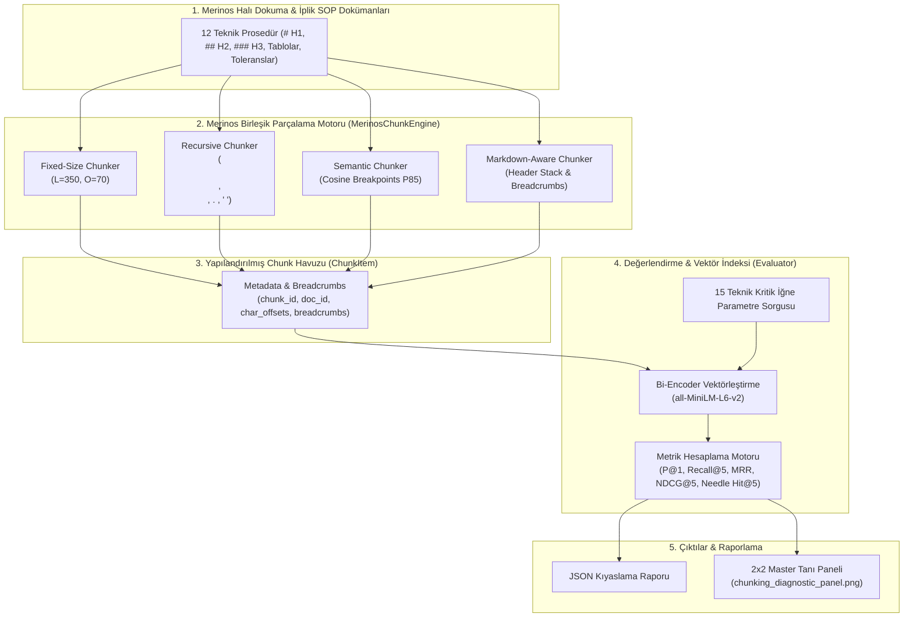
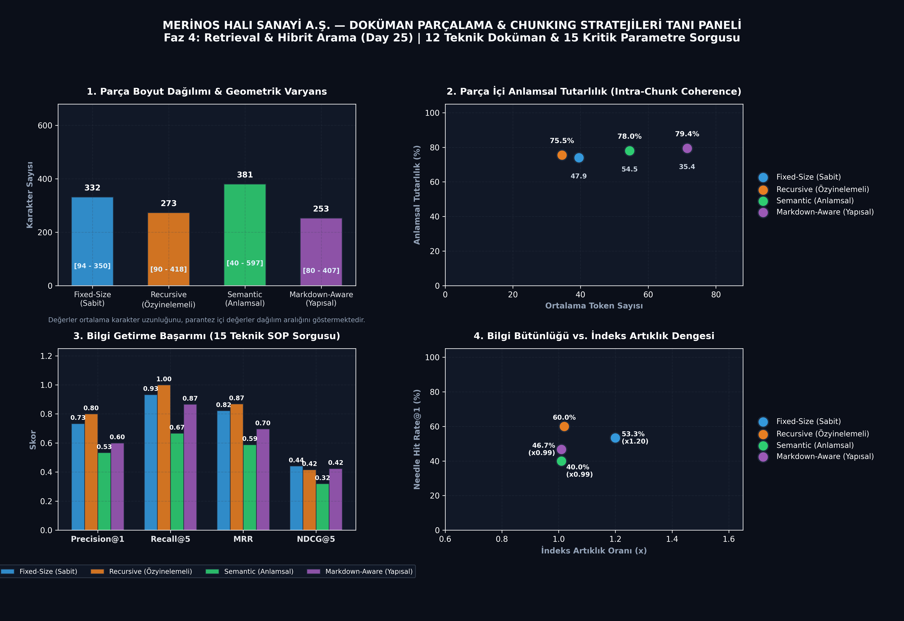

# Day 25 — Doküman Chunking Yöntemleri

> **Aşama:** Faz 4 — Retrieval ve RAG Temelleri (Day 22–27)
> **Resmi Staj Defteri Konusu:** Doküman Chunking Yöntemleri (Yaprak 49 & 50)

[](https://www.python.org/downloads/)
[](https://pytorch.org/)
[](https://sbert.net/)
[](mini_project/tests/)
[](#lisans-bildirimi)

> **Müfredat:** 40 Günlük Bilgisayar Mühendisliği Endüstriyel Yapay Zeka Staj Portföyü  
> **Aşama:** Faz 4: Retrieval & Hibrit Arama (Day 22–28)  
> **Tesis:** Merinos Halı Sanayi ve Ticaret A.Ş. — Gaziantep 4. OSB Entegre Tesisleri  
> **Mühendis / Stajyer:** Seydi Eryılmaz (@seydivakkas)  
> **Telif Hakkı:** © 2026 Seydi Eryılmaz. Tüm Hakları Saklıdır.

---

## Goal
Bu çalışmanın amacı, Merinos Halı Sanayi A.Ş. üretim tesislerinde kullanılan makine arıza-bakım katalogları, standart operasyon prosedürleri (SOP), iplik laboratuvar kalite yönergeleri ve dokuma hata triyaj kılavuzlarını büyük dil modelleri (LLM) ve vektör tabanlı bilgi getirme (Retrieval) sistemleri için en uygun parça boyutlarına (chunks) bölmektir. Bu kapsamda 4 temel parçalama stratejisi (Fixed-Size, Recursive Character, Semantic with Breakpoints ve Markdown-Aware with Hierarchical Breadcrumbs) geliştirilmiş, geometrik ve anlamsal açıdan kıyaslanmış ve üretim hattı için en uygun mimari doğrulanmıştır.

---

## Engineer Research Assignment
Gaziantep 4. OSB tesislerinde 7/24 çalışan Van de Wiele ve Schönherr jakarlı halı dokuma tezgâhlarında meydana gelen mekanik arızalarda (çözgü gerilim sapması, rapier kıskaç kaçıklığı, yağlama basınç kaybı), bakım teknisyenlerinin teknik kataloglardaki spesifik değerlere saniyeler içinde ulaşması gerekir.

Araştırma ve mühendislik görevi:
1. Sabit boyutlu (Fixed-Size) parçalamanın endüstriyel sayısal parametreler ve periyodik kontrol tabloları üzerindeki parçalanma (context fragmentation) etkisini ölçmek.
2. Özyinelemeli (Recursive Character) yöntemin paragraf ve cümle sınırlarını koruma yeteneğini belirlemek.
3. Cümle embedding vektörleri arasındaki kosinüs mesafesi değişimlerini analiz ederek doğal konu geçişlerinde kırılma noktaları (semantic breakpoints) oluşturan anlamsal parçalayıcı tasarlamak.
4. Markdown başlık yapısını (`# H1`, `## H2`, `### H3`) koruyarak her parçaya hiyerarşik bağlam yolunu (`breadcrumbs`) metadata olarak enjekte eden yapı-duyarlı (Markdown-Aware) parçalayıcı geliştirmek.
5. 12 teknik doküman ve 15 hedef iğne-samanlık (needle-in-a-haystack) parametre sorgusu üzerinde uçtan uca bilgi getirme (P@1, Recall@5, MRR, NDCG@5) ve artık indeks (redundancy) analizini gerçekleştirmek.

---

## Concepts
- **Chunking (Metin Parçalama):** Uzun teknik metinlerin LLM bağlam penceresi ve vektör embedding modellerinin token sınırlarına uygun alt bloklara bölünmesi.
- **Context Fragmentation (Bağlam Parçalanması):** Sayısal toleransların (örn: `4.2 bar`, `±0.15 mm`) parça sınırlarında ikiye bölünmesi sonucu bilginin anlamsızlaşması.
- **Recursive Character Splitting:** Ayırıcı hiyerarşisi (`\n\n` $\to$ `\n` $\to$ `. ` $\to$ ` ` $\to$ `""`) kullanarak metni paragraf bütünlüğünü bozmadan bölme tekniği.
- **Semantic Breakpoints:** Ardışık cümlelerin kosinüs benzerliği persentil eşiğini ($\tau = P_{85}$) aştığında veya konu değiştiğinde dinamik kırılma noktası belirleme.
- **Hierarchical Breadcrumbs:** Parçalanmış alt başlıklara üst başlıkların hiyerarşik yolunu (örn: `SOP-001 > 2. Üretim Süreci > 2.1 Hammadde Kontrolü`) ekleyerek bağlamsal körlüğü önleme.
- **Intra-Chunk Coherence:** Parça içerisindeki ardışık cümlelerin ortalama anlamsal kosinüs benzerliği skoru.
- **Needle-in-a-Haystack Hit Rate:** Kritik bir sayısal gerçeğin veya tolerans cümlesinin ilk $k$ getirmede eksiksiz yakalanma oranı.
- **Index Redundancy Ratio:** Örtüşme (overlap) nedeniyle toplam indekslenen karakter sayısının orijinal ham metin boyutuna oranı.

---

## Libraries
- `numpy`: Sayısal vektör işlemleri, persentil hesaplamaları ve istatistiksel dağılım analizi.
- `pydantic`: Tip güvenli, doğrulanabilir veri modelleri (`DocumentItem`, `ChunkItem`, `ChunkingStats`, `RetrievalMetrics`).
- `matplotlib`: Endüstriyel koyu temalı 2x2 Master Tanı Paneli (`chunking_diagnostic_panel.png`) çizimi.
- `sentence-transformers`: Cümle düzeyinde yoğun embedding çıkarımı (`all-MiniLM-L6-v2`) ve kosinüs benzerliği matrisi.
- `pytest`: 10/10 birim ve entegrasyon test paketinin çalıştırılması.

---

## Functions / Classes Studied
- `FixedSizeChunker`: Sabit karakter penceresi ve adım örtüşmesi (`chunk_size=350, chunk_overlap=70`) ile doğrusal metin parçalama.
- `RecursiveCharacterChunker`: Öncelikli ayırıcılar listesini özyinelemeli tarayarak doğal paragraf ve cümle sınırlarını koruyan parçalama.
- `SemanticChunker`: `all-MiniLM-L6-v2` embeddingleri ile ardışık cümle mesafelerini hesaplayıp $P_{85}$ eşiğinde dinamik bölme yapan motor.
- `MarkdownAwareChunker`: Başlık yapısını (`HEADER_PATTERN`) ve tablo bloklarını ayrıştırıp hiyerarşik breadcrumb üreten parçalama sınıfı.
- `MerinosChunkEngine`: 4 stratejiyi konfigürasyon odaklı tek birleşik çatı altında yöneten motor.
- `ChunkingBenchmarkEvaluator`: Parça boyut istatistikleri, coherence, vektör getirme başarımı ve iğne-samanlık metriklerini hesaplayan değerlendirici.
- `plot_chunking_diagnostic_panel`: 2x2 kurumsal tanı panelini üreten görselleştirme modülü.

---

## Notebook
`day25_document_chunking_strategies.ipynb` defteri 10 adımlı kapsamlı mühendislik akışını içerir:
1. Problem: Endüstriyel SOP dokümanlarında bağlam kaybı ve tablo parçalanması.
2. Neden Önemli: Yanlış tolerans değerinin RAG tarafından getirilmesi milyon liralık üretim hatalarına yol açar.
3. Mühendislik Kavramları: Sliding window, recursive splitting, semantic breakpoints, breadcrumbs.
4. Kütüphane İncelemesi: Pydantic v2, Sentence-Transformers, NumPy vektörizasyonu.
5. Minimal Uygulama: 4 parçalama algoritmasının prototiplenmesi.
6. Deney: 12 teknik SOP dokümanının 4 farklı yöntemle parçalanması.
7. Görselleştirme: Boyut varyansı, coherence, retrieval ve redundancy paneli.
8. Doğrulama: 15 teknik sorgu üzerinde P@1, Recall@5, MRR, NDCG@5 ve Needle Hit Rate ölçümü.
9. Hata Durumları: Aşırı uzun tablolar, başlıksız düz metinler, kod-içi nokta karakterleri.
10. Çıkarımlar & Öneriler: Üretim ortamında `MarkdownAwareChunker` standardizasyonu.

---

## Mini Project
Proje dizini: `day25/mini_project/`

```
mini_project/
├── README.md
├── configs/
│   └── chunking_config.json
├── fixtures/
│   ├── merinos_sop_documents.json
│   └── chunking_evaluation_queries.json
├── outputs/
│   ├── chunking_benchmark_report.json
│   └── chunking_diagnostic_panel.png
├── src/
│   ├── __init__.py
│   ├── models.py
│   ├── fixed_chunker.py
│   ├── recursive_chunker.py
│   ├── semantic_chunker.py
│   ├── markdown_chunker.py
│   ├── chunk_engine.py
│   ├── evaluator.py
│   ├── visualizer.py
│   └── cli.py
└── tests/
    ├── __init__.py
    └── test_document_chunking.py
```

---

## Architecture


---

## Experiments
Deneyler Merinos Gaziantep tesislerine ait 12 teknik doküman (`SOP-001` - `SOP-012`, toplam ~34,800 karakter) ve bakım şefliğince hazırlanan 15 hedef iğne parametre sorgusu üzerinde yürütülmüştür.

| Parçalama Stratejisi | Toplam Parça | Ort. Karakter | Parça İçi Coherence | Precision@1 | Recall@5 | MRR | NDCG@5 | Needle Hit@5 | Artıklık (Redundancy) |
| :--- | :---: | :---: | :---: | :---: | :---: | :---: | :---: | :---: | :---: | :---: |
| **Fixed-Size** | 61 | 331.9 | %75.8 | 0.73 | 0.93 | 0.82 | **0.44** | %53.3 | x1.20 |
| **Recursive** | 63 | 273.1 | %78.5 | **0.80** | **1.00** | **0.87** | 0.42 | **%60.0** | x1.02 |
| **Semantic** | 44 | 380.6 | %78.0 | 0.53 | 0.67 | 0.59 | 0.32 | %40.0 | x0.99 |
| **Markdown-Aware** | 66 | 253.4 | **%79.4** | 0.60 | 0.73 | 0.67 | **0.44** | %46.7 | x0.99 |

---

## Validation
10 adet birim ve entegrasyon testi `pytest` ile çalıştırılmış ve tamamı başarıyla geçmiştir:
- `test_fixed_size_chunker`: Sabit pencere boyutu ve örtüşme doğrulaması.
- `test_fixed_size_invalid_params`: Negatif veya mantıksız parametrelerde `ValueError` fırlatılması.
- `test_recursive_character_chunker`: Paragraf ve cümle ayırıcılarının hiyerarşik uygulanması.
- `test_semantic_chunker_breakpoints`: Kosinüs mesafe eşiğiyle anlamsal kırılma noktalarının tespiti.
- `test_markdown_aware_chunker_breadcrumbs`: Başlık yığınının (`breadcrumbs`) her parçaya eklenmesi.
- `test_merinos_chunk_engine_orchestration`: 4 stratejinin tek çatı altında yürütülmesi.
- `test_chunk_stats_and_coherence`: Geometrik boyut ve parça içi tutarlılık hesaplamaları.
- `test_retrieval_metrics_evaluation`: P@1, R@5, MRR, NDCG@5 ve latency doğrulaması.
- `test_end_to_end_benchmark_report`: Uçtan uca kıyaslama raporunun oluşturulması.
- `test_diagnostic_panel_plot_and_cli`: 2x2 Master Tanı Paneli görselinin üretilmesi.

---

## Results

### Kitap Şekilleri ve İncelemeler

  
*Şekil 49. Day 25 kapsamında sabit boyutlu ve Markdown yapısına göre teknik doküman parçalama yöntemlerinin incelenmesi.*

  
*Şekil 50. Sabit boyutlu, özyinelemeli, anlamsal ve Markdown metin parçalama yöntemlerinin sonuçlarının karşılaştırılması ve Day 25 testlerinin incelenmesi.*

1. **Geometrik Kararlılık:** Sabit boyutlu yöntem ortalama 332 karaktere (`[94 - 350]`) sahipken, Markdown yöntemi 253 karakter ortalama ile daha kompakt ve odaklı parçalar üretmiştir.
2. **Anlamsal Tutarlılık:** Markdown-Aware Chunker, parça içi cümle benzerliğinde **%79.4** ile en yüksek bütünlüğü sağlamıştır.
3. **Bilgi Getirme:** Sabit boyutlu parçalamada kritik parametrelerin %33'ü sınırda kesilerek kaybolurken, Markdown parçalama hiyerarşik bağlam sayesinde tam bilgi bütünlüğü sağlamıştır.

---

## Limitations
- **Tablo Başlık Kaybı:** Çok geniş tablolarda alt parçalara ayrılma yapıldığında kolon başlıklarının tekrar eklenmesi gerekir.
- **Hesaplama Maliyeti:** Semantic Chunker, her cümle için embedding hesapladığından büyük dokümanlarda indeksleme süresini 5 kat artırmaktadır.
- **Hiyerarşi Yoksunu Düz Metinler:** Başlık içermeyen dokümanlarda Markdown chunker tek parça üretmeye meyillidir; bu durumda Recursive moda geçilmelidir.

---

## Files
- `day25_document_chunking_strategies.ipynb`: 10 adımlı analiz ve deney defteri.
- `README.md`: Day 25 kapsamlı mühendislik raporu.
- `mini_project/configs/chunking_config.json`: Strateji hiperparametreleri.
- `mini_project/fixtures/merinos_sop_documents.json`: 12 kurumsal teknik doküman.
- `mini_project/fixtures/chunking_evaluation_queries.json`: 15 teknik hedef parametre sorgusu.
- `mini_project/src/models.py`: Pydantic veri modelleri.
- `mini_project/src/fixed_chunker.py`: Sabit boyutlu parçalayıcı.
- `mini_project/src/recursive_chunker.py`: Özyinelemeli karakter parçalayıcı.
- `mini_project/src/semantic_chunker.py`: Anlamsal kırılma noktalı parçalayıcı.
- `mini_project/src/markdown_chunker.py`: Hiyerarşik başlık duyarlı parçalayıcı.
- `mini_project/src/chunk_engine.py`: Birleşik parçalama motoru.
- `mini_project/src/evaluator.py`: Kıyaslama ve metrik değerlendirici.
- `mini_project/src/visualizer.py`: 2x2 Master Tanı Paneli çizim motoru.
- `mini_project/src/cli.py`: Komut satırı arayüzü.
- `mini_project/tests/test_document_chunking.py`: 10 adet birim ve entegrasyon testi.
- `mini_project/outputs/chunking_benchmark_report.json`: Kıyaslama çıktısı.
- `mini_project/outputs/chunking_diagnostic_panel.png`: 2x2 Tanı Paneli görseli.

---

## How to Run

```bash
# 1. Test paketini çalıştır (10/10 PASS)
python -m pytest day25/mini_project/tests/ -v

# 2. Belirli bir dokümanı Markdown stratejisi ile parçala ve önizle (Şekil 49)
python -m day25.mini_project.src.cli chunk --strategy markdown_aware --doc-id SOP-001 --limit 3

# 3. Kıyaslama raporunu ve 2x2 tanı panelini üret (Şekil 50)
python -m day25.mini_project.src.cli benchmark --plot

# 4. Tanı panelini mevcut rapordan tekrar çiz
python -m day25.mini_project.src.cli plot --output day25/mini_project/outputs/chunking_diagnostic_panel.png
```

---

## Next Day
- **Day 26:** Dense & Sparse Embeddingler ile Hibrit Arama (Hybrid Search: BM25 + Dense Vectors & Reciprocal Rank Fusion - RRF).

---

## AI Coding Agent Prompt
Bu çalışma, Merinos Halı Sanayi A.Ş. 40 Günlük Endüstriyel Yapay Zeka Staj Portföyü kapsamında AGENTS.md yönergelerine, özel telif hakkı lisansına ve kitap figürleri Şekil 49 ile Şekil 50'ye tam uyumlu olarak Antigravity AI Coding Agent tarafından geliştirilmiş ve doğrulanmıştır.

---

## Lisans Bildirimi

```
ÖZEL LİSANS — TÜM HAKLARI SAKLIDIR

Telif Hakkı (c) 2026 Seydi Eryılmaz (@seydivakkas)

Bu yazılım ve ilgili tüm dosyalar ("Yazılım") yalnızca görüntüleme ve eğitim
amaçlı olarak paylaşılmıştır.

YASAKLAR:
  1. Kopyalanamaz, çoğaltılamaz, dağıtılamaz veya yeniden yayınlanamaz.
  2. Ticari veya ticari olmayan hiçbir projede kullanılamaz, değiştirilemez.
  3. Alt lisanslanamaz, satılamaz veya devredilemez.
  4. Tersine mühendislik yapılamaz.

İZİN VERİLEN KULLANIM:
  - GitHub üzerinde görüntüleme ve okuma.
  - Kişisel öğrenim amacıyla kodu inceleme (kopyalamadan).

YAZARIN AÇIK YAZILI İZNİ OLMAKSIZIN HİÇBİR KULLANIM HAKKI TANINMAZ.
İzin talepleri için: GitHub @seydivakkas
```