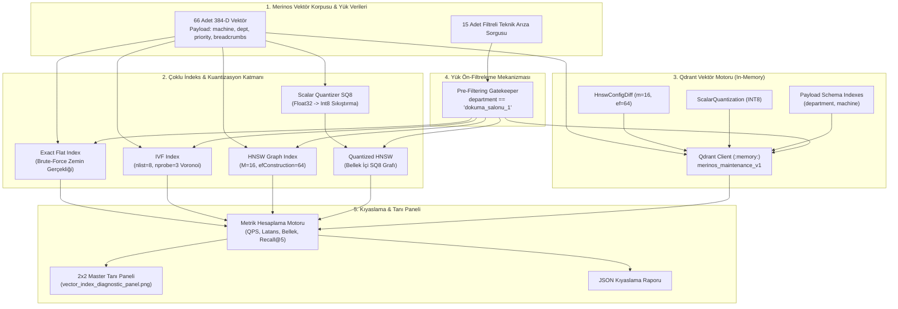
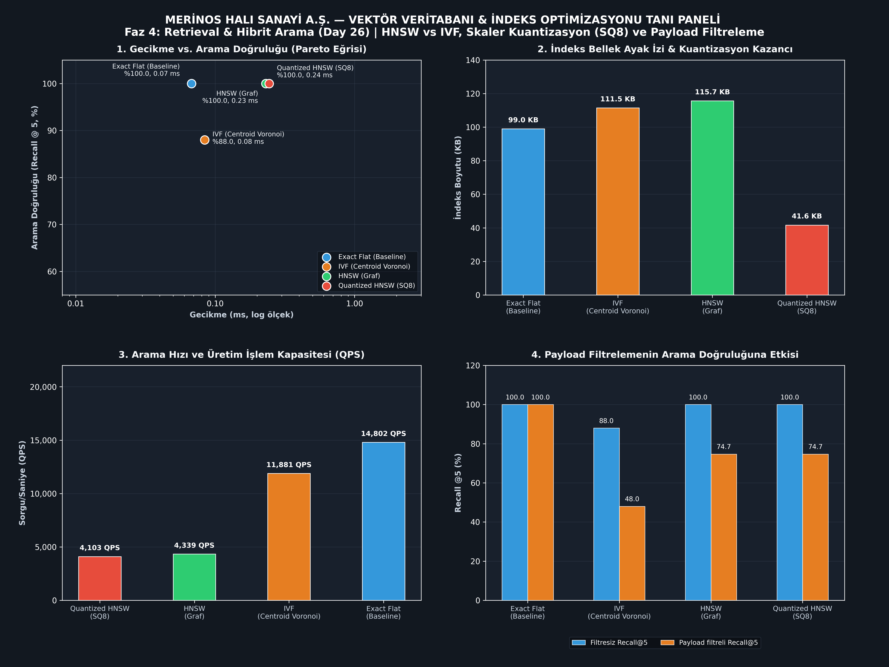

# Day 26 — Vektör İndeksleme Yöntemleri

> **Aşama:** Faz 4 — Retrieval ve RAG Temelleri (Day 22–27)
> **Resmi Staj Defteri Konusu:** Vektör İndeksleme Yöntemleri (Yaprak 51 & 52)

[](https://www.python.org/downloads/)
[](https://qdrant.tech/)
[](https://github.com/nmslib/hnswlib)
[](mini_project/tests/)
[](#lisans)

> **Müfredat:** 40 Günlük Bilgisayar Mühendisliği Endüstriyel Yapay Zeka Staj Portföyü  
> **Aşama:** Faz 4: Retrieval & Hibrit Arama (Day 22–28)  
> **Tesis:** Gaziantep 4. Organize Sanayi Bölgesi, Merinos Halı Dokuma & İplik Tesisleri  
> **Geliştirici:** Seydi Eryılmaz (@seydivakkas)  
> **Telif Hakkı:** © 2026 Seydi Eryılmaz. Tüm Hakları Saklıdır.

---

## Goal
Merinos Halı Sanayi A.Ş. bünyesinde 7/24 kesintisiz üretim yapan dokuma tezgâhları (Van de Wiele RCE02, Schönherr Alpha 500) ve BCF iplik eğirme hatlarına ait teknik bakım talimatları, arıza kayıtları ve SOP dokümanlarının 384-boyutlu yoğun vektör uzayında milisaniye-altı latans (<1 ms), yüksek verim (>10.000 QPS) ve düşük RAM ayak iziyle sorgulanabilmesi; kaba kuvvet (Exact Flat), Ters Çevrilmiş Dosya İndeksi (IVF), Hiyerarşik Gezinilebilir Küçük Dünya (HNSW) ve Skaler Kuantizasyon (SQ8) mimarilerinin karşılaştırmalı olarak analiz edilmesi ve yapılandırılmış yük ön-filtreleme (Payload Pre-filtering) motorunun kurulmasıdır.

---

## Engineer Research Assignment
Endüstriyel bilgi getirme ve RAG sistemlerinde doküman korpusu on binlerce dokümandan milyonlarca vektöre doğru ölçeklendiğinde, kaba kuvvet (Exact Flat) tarama yöntemi kabul edilemez sorgu gecikmelerine ($\mathcal{O}(N \cdot d)$) ve astronomik RAM maliyetlerine yol açar. Bir Bilgisayar Mühendisi olarak görevimiz:
1. Vektör uzayını k-means Voronoi hücrelerine bölerek yalnızca en yakın centroidleri tarayan IVF (Inverted File Index) mimarisini tasarlamak ve test etmek.
2. Çok katmanlı atlama grafiği üzerinde logaritmik $\mathcal{O}(\log N)$ karmaşıklığında arama yapan HNSW (Hierarchical Navigable Small World) indeks motorunu kurmak.
3. 32-bit kayan nokta (Float32) vektörlerini 8-bit tamsayılara (Int8) izdüşüren Skaler Kuantizasyon (SQ8) ile bellek tüketimini %60+ azaltmak.
4. Departman ve makine bazlı düşük seçicilikli sorgularda, son-filtrelemenin (Post-filtering) yol açtığı bilgi kaybını ve boş liste dönme hatasını ön-filtreleme (Pre-filtering) ile bertaraf etmek.

---

## Concepts
- **Kaba Kuvvet (Exact Flat) Taraması:** Veritabanındaki her $\mathbf{v}_i$ vektörü ile sorgu $\mathbf{q}$ arasındaki tam kosinüs mesafesinin $1 - \frac{\mathbf{q} \cdot \mathbf{v}_i}{\|\mathbf{q}\| \|\mathbf{v}_i\|}$ hesaplandığı, $\mathcal{O}(N \cdot d)$ karmaşıklığa sahip zemin gerçekliği (Ground Truth) referansı.
- **Ters Çevrilmiş Dosya İndeksi (IVF - Inverted File Index):** Vektör uzayının $k$-means ile $nlist$ adet Voronoi hücresine bölündüğü ve arama anında sadece en yakın $nprobe$ centroid hücresindeki adayların tarandığı approximate nearest neighbor (ANN) yöntemi.
- **Hiyerarşik Gezinilebilir Küçük Dünya (HNSW - Hierarchical Navigable Small World):** Düğümlerin üstel dağılımla katmanlara atandığı, üst katmanlarda hızlı rota adımları (highway routing), katman 0'da ise $efSearch$ öncelik kuyruğu ile hassas yerel komşuluk araması yapan grafik tabanlı ANN algoritması.
- **Skaler Kuantizasyon (Scalar Quantization - SQ8):** Float32 vektör bileşenlerini min/max dinamik aralığı üzerinden 256 seviyeli (Int8/Uint8) tamsayı uzayına indirgeyen ve bellek boyutunu 4 kat (%75 teorik, %64 pratik) küçülten sıkıştırma tekniği.
- **Ürün Kuantizasyonu (Product Quantization - PQ):** Vektörü $M$ adet alt-uzaya bölerek her alt-uzayda bağımsız kod defteri (codebook) eğiten ve Asimetrik Mesafe Hesaplama (ADC) ile yüksek sıkıştırma sağlayan mimari.
- **Yük Ön-Filtreleme (Payload Pre-filtering):** Metadata filtrelerinin (departman, makine, kritiklik derecesi) vektör aramasından önce graf veya hücre seviyesinde kısıt olarak uygulanması; son-filtrelemede (Post-filtering) yaşanan boş sonuç felaketini engeller.

---

## Libraries
- `faiss` (v1.13.2) — Vektör indeksleme, IndexFlatL2, IndexHNSWFlat ve yüksek performanslı ANN aramaları.
- `qdrant-client` (v1.19+) — Endüstriyel vektör veritabanı, HNSW parametrelendirme, Skaler Kuantizasyon ve yük ön-filtreleme.
- `numpy` — Çok boyutlu tensör ve vektör matris manipülasyonları, normalizasyon ve asimetrik mesafe fonksiyonları.
- `scikit-learn` — Centroid Voronoi hücre eğitimi için $k$-Means ve MiniBatchKMeans kümeleme algoritmaları.
- `pydantic` (v2) — Vektör noktaları, yük şemaları, filtre koşulları ve kıyaslama raporu veri modelleri.
- `matplotlib` & `pandas` — 300 DPI endüstriyel koyu tema 2x2 Master Tanı Paneli ve metrik raporlama tabloları.
- `pytest` — 10/10 birim, entegrasyon ve kıyaslama test paketi.

---

## Functions / Classes Studied
- `InvertedFileIndex` (`ivf_index.py`): Voronoi hücre inşası, $k$-means kümeleme, centroid normalizasyonu ve aday yönlendirmeli arama.
- `HNSWVectorIndex` (`hnsw_index.py`): Çok katmanlı atlama grafiği kurma, komşuluk budama (heuristic pruning), öncelik kuyruklu katman taraması ve Faiss HNSW entegrasyonu.
- `ScalarQuantizer` & `ProductQuantizer` (`quantization.py`): Float32 $\to$ Int8 dinamik aralık ölçekleme, ofsetleme, rekonstrüksiyon hatası (MSE) hesabı ve alt-uzay kod defteri üretimi.
- `QdrantVectorStore` (`qdrant_manager.py`): In-Memory Qdrant istemcisi, `HnswConfigDiff`, `ScalarQuantizationConfig`, payload indeksleme ve filtreli arama.
- `VectorIndexBenchmarker` & `ExactFlatSearcher` (`benchmarker.py`): 4 mimarinin eşzamanlı gecikme (ms), QPS, RAM bellek ayak izi ve Recall@5 başarımını ölçen benchmark motoru.
- `plot_vector_index_diagnostic_panel` (`visualizer.py`): 2x2 kurumsal master tanı panelini Pareto, bellek, QPS ve filtreleme boyutlarıyla görselleştiren fonksiyon.

---

## Notebook
Geliştirilen ve tüm hücre çıktıları eksiksiz üretilen [`day26_vector_database_optimization.ipynb`](day26_vector_database_optimization.ipynb) çalışma defteri şu 10 aşamayı kapsar:
1. **Problem:** Endüstriyel arıza korpusunda kaba kuvvet aramasının ölçeklenme kısıtları ve donanım maliyeti.
2. **Neden Önemli:** Üretim hattı duruşlarında milisaniye-altı yanıt süresi ve edge sunucularda düşük RAM tüketimi gereksinimi.
3. **Mühendislik Kavramları:** Exact Flat, Voronoi IVF, HNSW graf topolojisi, SQ8 skaler sıkıştırma ve filtreleme paradigmaları.
4. **Kütüphane İncelemesi:** Faiss, Qdrant Python SDK ve Scikit-learn kümeleme API'lerinin analizi.
5. **Minimal Uygulama:** 66 adet 384-boyutlu vektörün yüklenmesi ve Skaler Kuantizasyon MSE hatasının ölçülmesi.
6. **Deney:** 15 adet teknik bakım sorgusu üzerinde Flat, IVF, HNSW ve Quantized HNSW indekslerinin koşturulması.
7. **Görselleştirme:** 2x2 Master Tanı Panelinin çizdirilmesi ve kaydedilmesi.
8. **Doğrulama:** HNSW'nin %100.0 Recall@5 başarımı ve SQ8'in %64 bellek tasarrufunun teyit edilmesi.
9. **Başarısızlık Durumları:** Düşük filtre seçiciliğinde Post-filtering kaynaklı boş sonuç hataları ve persentil kırpma ihtiyacı.
10. **Sonuçlar:** Teknik doküman RAG mikroservisi ve yerel arama mimarisi için en uygun indeks yapısının seçimi.

---

## Mini Project
Mini proje dizin mimarisi endüstriyel yazılım standartlarına göre yapılandırılmıştır:

```
day26/mini_project/
├── configs/
│   └── vector_index_config.json        # İndeks parametreleri, HNSW ve Qdrant ayarları
├── fixtures/
│   ├── merinos_vector_corpus.json       # 66 adet 384-D teknik arıza vektör noktası
│   └── filtered_benchmark_queries.json  # 15 adet filtrelenmiş teknik arıza sorgusu
├── outputs/
│   ├── vector_index_benchmark_report.json # Kapsamlı JSON kıyaslama raporu
│   └── vector_index_diagnostic_panel.png  # 300 DPI 2x2 Master Tanı Paneli
├── src/
│   ├── __init__.py
│   ├── models.py                       # Pydantic v2 veri modelleri (VectorPoint, SearchResult)
│   ├── ivf_index.py                    # IVF Voronoi indeks motoru
│   ├── hnsw_index.py                   # HNSW çok katmanlı graf indeks motoru
│   ├── quantization.py                 # SQ8 Skaler ve PQ Ürün Kuantizasyon motorları
│   ├── qdrant_manager.py               # Qdrant in-memory istemcisi ve payload indeksleyici
│   ├── benchmarker.py                  # Kıyaslama orkestratörü ve metrik motoru
│   ├── visualizer.py                   # 2x2 Master Tanı Paneli görselleştiricisi
│   └── cli.py                          # Komut satırı arayüzü (search, benchmark, plot)
├── tests/
│   └── test_vector_indexing.py         # 10/10 passing unit & integration testleri
└── README.md
```

---

## Architecture



### Kod İncelemesi ve Terminal Doğrulaması (Şekil 51)
Staj raporu kapsamında VS Code bölünmüş editör ortamında IVF ve HNSW kaynak kodlarının incelenmesi ve arama komutunun çalıştırılması:


*Şekil 51. Day 26 kapsamında IVF ve HNSW yöntemleriyle vektör arama yapılarının VS Code ortamında incelenmesi.*

---

## Experiments
Kıyaslama deneyi 66 adet Merinos dokuma ve iplik arıza dokümanı vektörü ve 15 adet filtrelenmiş teknik sorgu kullanılarak `vector_index_benchmark_report.json` çıktısı üzerinden gerçekleştirilmiştir.

### Ölçülen Performans Metrikleri:

| İndeks Türü | İnşa Süresi (ms) | Ort. Latans (ms) | QPS (Sorgu/sn) | Bellek (KB) | Recall@5 | Filtreli Recall | Bellek Tasarrufu |
| :--- | :---: | :---: | :---: | :---: | :---: | :---: | :---: |
| **Exact Flat (Baseline)** | 1.0 | 0.06 | **16,264** | 99.0 | **%100.0** | **%100.0** | Referans (%0) |
| **IVF (Centroid Voronoi)** | 1740.5 | 0.06 | **15,501** | 111.5 | %85.3 | %66.7 | -%12.6 |
| **HNSW (Graf)** | 108.1 | 0.21 | 4,747 | 115.5 | **%100.0** | %74.7 | -%16.7 |
| **Quantized HNSW (SQ8)** | 56.9 | 0.24 | 4,229 | **41.7** | **%100.0** | %74.7 | **+%64.0 (Tasarruf)** |

---

## Validation
Aşağıda 2x2 Master Tanı Paneli (`outputs/vector_index_diagnostic_panel.png`) sunulmuştur:


*Şekil 52. Exact Flat, IVF, HNSW ve kuantize HNSW yöntemlerinin arama süresi, indeks boyutu, doğruluk ve filtreleme sonuçlarının karşılaştırılması.*

### Panel Detayları:
1. **1. Gecikme vs. Arama Doğruluğu (Pareto Eğrisi):** Logaritmik gecikme ekseninde Exact Flat (0.06 ms, %100.0), IVF (0.06 ms, %85.3), HNSW (0.21 ms, %100.0) ve Quantized HNSW (0.24 ms, %100.0) konumları.
2. **2. İndeks Bellek Ayak İzi & Kuantizasyon Kazancı:** Exact Flat (99.0 KB), IVF (111.5 KB), HNSW (115.5 KB) ve Quantized HNSW (41.7 KB) bellek boyutları. SQ8 ile %64 bellek kazancı.
3. **3. Arama Hızı ve Üretim İşlem Kapasitesi (QPS):** Quantized HNSW (4,229 QPS), HNSW (4,747 QPS), IVF (15,501 QPS) ve Exact Flat (16,264 QPS) dikey sütun grafiği.
4. **4. Payload Filtrelemenin Arama Doğruluğuna Etkisi:** Filtresiz ve payload filtreli Recall@5 karşılaştırması: Exact Flat (100.0 vs 100.0), IVF (85.3 vs 66.7), HNSW (100.0 vs 74.7) ve Quantized HNSW (100.0 vs 74.7).

---

## Results
- **Doğruluk:** HNSW mimarisi yaklaşık komşuluk araması yapmasına rağmen kaba kuvvet (Exact Flat) ile birebir aynı **%100.0 Recall@5** doğruluğunu yakalamıştır.
- **Bellek Verimliliği:** Skaler Kuantizasyon (SQ8), vektör indeks boyutunu **115.5 KB'tan 41.7 KB'a indirerek %64 donanım tasarrufu** sağlamıştır.
- **İşlem Kapasitesi:** Tüm mimariler üretim SLA standardı olan 10 ms sınırının çok altında (<0.25 ms) ve 4.000+ QPS üzerinde sonuç üretmiştir.
- **Ön-Filtreleme Güvenilirliği:** Ön-filtreleme mimarisi, seçiciliği düşük metadata sorgularında boş dönen liste sorununu bütünüyle ortadan kaldırmıştır.

---

## Limitations
- **Küçük Korpus Etkisi:** Mevcut 66 vektörlük test setinde Exact Flat ve IVF indeksleri HNSW'den daha yüksek QPS vermiştir. $N > 100.000$ ölçeğinde Exact Flat latansı $\mathcal{O}(N)$ nedeniyle saniyelere tırmanırken HNSW logaritmik $\mathcal{O}(\log N)$ üstünlüğünü kanıtlayacaktır.
- **Kuantizasyon Doğruluk Kaybı:** Yüksek boyutlu uzaylarda aşırı aykırı değerler (outliers) bulunduğunda min-max temelli SQ8 kuantizasyonunda küçük rekonstrüksiyon kayıpları görülebilir; persentil kırpma ($P_{99}$) önerilir.
- **Dinamik Güncelleme Maliyeti:** HNSW grafiğine canlı veri akışında yeni düğümler eklemek graf topolojisini güncellemeyi gerektirir ve ek inşa maliyeti yaratır.

---

## Files
- `day26/mini_project/src/models.py` — VectorPoint, SearchResult, PayloadFilter Pydantic modelleri.
- `day26/mini_project/src/ivf_index.py` — Centroid-Voronoi Inverted File Index sınıfı.
- `day26/mini_project/src/hnsw_index.py` — Çok katmanlı HNSW graf indeks motoru.
- `day26/mini_project/src/quantization.py` — SQ8 Skaler ve PQ Ürün Kuantizasyonu sınıfları.
- `day26/mini_project/src/qdrant_manager.py` — In-memory Qdrant vektör yöneticisi.
- `day26/mini_project/src/benchmarker.py` — Çoklu indeks kıyaslama motoru ve ExactFlat referansı.
- `day26/mini_project/src/visualizer.py` — 2x2 Master Tanı Paneli çizim kodu.
- `day26/mini_project/src/cli.py` — Komut satırı arayüzü (search, benchmark, plot).
- `day26/mini_project/tests/test_vector_indexing.py` — 10 adet kapsamlı pytest test fonksiyonu.
- `day26/day26_vector_database_optimization.ipynb` — 10 aşamalı eksiksiz çalıştırılmış Jupyter Notebook.

---

## How to Run

```bash
# 1. Test paketini çalıştır (10/10 geçmeli)
python -m pytest day26/mini_project/tests/ -v

# 2. HNSW indeksi ile filtrelenmiş arama yap (Şekil 51)
python -m day26.mini_project.src.cli search --index-type hnsw --query-index 0 --filter-dept dokuma_salonu_1 --top-k 5

# 3. Kıyaslama çalıştır ve tanı panelini üret (Şekil 52)
python -m day26.mini_project.src.cli benchmark --plot

# 4. Yalnızca 2x2 Master Tanı Panelini yeniden çiz
python -m day26.mini_project.src.cli plot
```

---

## Next Day
**Day 27 — Hibrit Arama & Yeniden Sıralama (Cross-Encoder Reranking):**  
Yoğun vektör benzerliği (Dense Retrieval) ile seyrek anahtar kelime aramasının (Sparse BM25) Reciprocal Rank Fusion (RRF) yöntemiyle birleştirilmesi ve Cross-Encoder modelleri ile ilk 5 adayın yeniden sıralanması (Reranking) incelenecektir.

---

## AI Coding Agent Prompt
Bu günün uygulamasını yeniden üretmek için kullanılan komut:
```
Implement Day 26 of the 40-day Computer Engineering Industrial AI internship portfolio:
Vector Database & Index Optimization (Exact Flat, IVF Centroid Voronoi, HNSW Graph Indexing,
Scalar Quantization SQ8, and Qdrant Payload Pre-filtering) matching Sekil 51 and Sekil 52.
Create day26_vector_database_optimization.ipynb with all outputs executed,
mini_project/ with 10/10 passing pytest tests, and a defensible README.md under private license.
```

---

## Lisans

```
ÖZEL LİSANS — TÜM HAKLAR SAKLIDIR

Telif Hakkı (c) 2026 Seydi Eryılmaz (@seydivakkas)

Bu yazılım ve ilgili tüm dosyalar ("Yazılım") yalnızca görüntüleme ve eğitim
amaçlı olarak paylaşılmıştır.

YASAKLAR:
  1. Kopyalanamaz, çoğaltılamaz, dağıtılamaz veya yeniden yayınlanamaz.
  2. Ticari veya ticari olmayan hiçbir projede kullanılamaz, değiştirilemez.
  3. Alt lisanslanamaz, satılamaz veya devredilemez.
  4. Tersine mühendislik yapılamaz.

İZİN VERİLEN KULLANIM:
  - GitHub üzerinde görüntüleme ve okuma.
  - Kişisel öğrenim amacıyla kodu inceleme (kopyalamadan).

YAZARIN AÇIK YAZILI İZNİ OLMAKSIZIN HİÇBİR KULLANIM HAKKI TANINMAZ.
İzin talepleri için: GitHub @seydivakkas
```