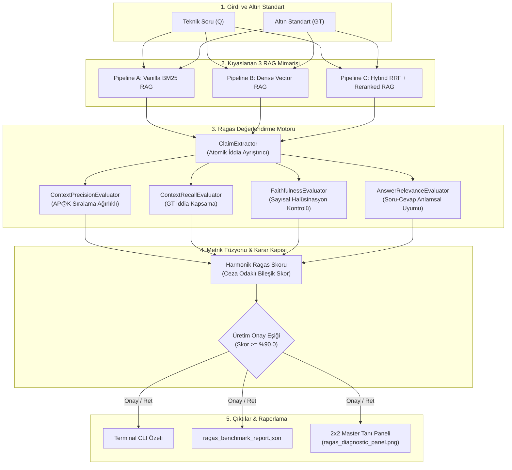
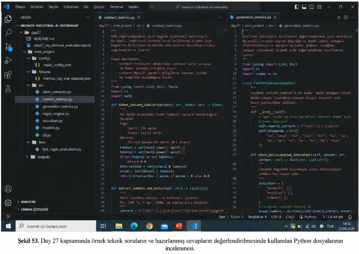
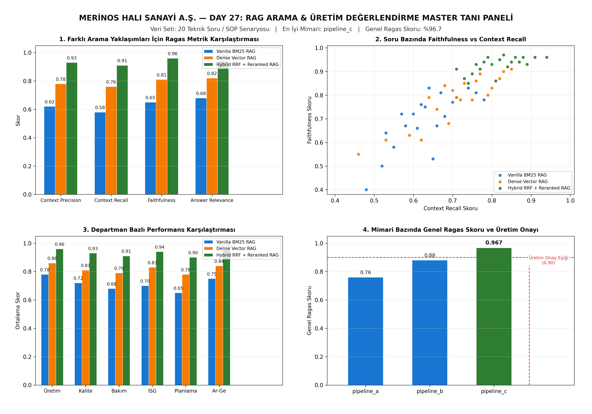

# Day 27 — RAG Temelleri ve Değerlendirme

> **Aşama:** Faz 4 — Retrieval ve RAG Temelleri (Day 22–27)
> **Resmi Staj Defteri Konusu:** RAG Temelleri ve Değerlendirme (Yaprak 53 & 54)

[](#lisans-bildirimi)
[](https://www.python.org/downloads/)
[](https://docs.ragas.io/)
[](#concepts)
[](day27/mini_project/tests/)

> **Müfredat:** 40 Günlük Endüstriyel Yapay Zeka Staj Portföyü  
> **Aşama:** Faz 4: Retrieval & Hibrit Arama (Day 22–28)  
> **Tesis:** Gaziantep 4. Organize Sanayi Bölgesi, Merinos Halı Dokuma & İplik Tesisleri  
> **Yazar:** Seydi Eryılmaz (@seydivakkas)  
> **Telif Hakkı:** © 2026 Seydi Eryılmaz. Tüm Hakları Saklıdır.

---

## Goal
Bu çalışmanın temel amacı; Merinos Halı Sanayi ve Ticaret A.Ş. bünyesinde devreye alınan teknik standart operasyon prosedürü (SOP), arıza bakım el kitapları ve kalite kontrol kılavuzlarına dayalı Retrieval-Augmented Generation (RAG) mimarilerinin doğruluğunu, getirme kalitesini ve halüsinasyon riskini nesnel biçimde denetlemektir. Dışa bağımlı ve maliyetli bulut API'lerine gerek kalmaksızın çalışan yerel **Ragas Değerlendirme Çerçevesi (Ragas Framework)** ve **RAG Triad** metodolojisiyle, 3 farklı arama yaklaşımı (Vanilla BM25, Dense Vector, Hybrid RRF + Reranked) 20 endüstriyel senaryo üzerinde kapsamlı benchmark testine tabi tutulmuştur.

---

## Engineer Research Assignment
Fabrika zeminindeki Van de Wiele RCE02, Schönherr Alpha 500 halı dokuma tezgâhları ve BCF ekstrüzyon hatlarında teknisyenlerin yapay zekaya sorduğu arıza sorularında, modelin tolerans veya basınç değerlerini uydurması (halüsinasyon) telafisi imkansız mekanik hasarlara ve duruş maliyetlerine yol açar.
Bir bilgisayar mühendisi olarak stajyerden beklenen araştırma görevleri:
1. Geleneksel getirme metriklerinin (Precision@K, Recall@K, MRR) yalnızca doküman getirmeyi ölçtüğünü, üretilen cevabın doğruluğunu ölçemediğini ortaya koymak.
2. **RAG Triad** metodolojisini (Context Relevance, Groundedness/Faithfulness, Answer Relevance) endüstriyel fabrika dokümanlarına uyarlamak.
3. Cümleleri doğrulanabilir bağımsız teknik önermelere ayıran atomik iddia ayrıştırıcısı (`ClaimExtractor`) tasarlamak.
4. Bağlamda geçmeyen sahte sayısal ve birim değerlerini yakalayan sayısal halüsinasyon filtresi (`FaithfulnessEvaluator`) geliştirmek.
5. 4 metriği harmonik ortalama ile birleştiren ve zayıf halkayı cezalandıran `Harmonic Ragas Score` füzyon mekanizması kurmak.

---

## Concepts

### 1. RAG Triad ve Metriklerin Dağılımı
```
          [Soru (Query)]
             /        \
 Context    /          \  Answer
 Relevance /            \ Relevance
          /              \
   [Bağlam (Context)] ——— [Cevap (Answer)]
          Faithfulness (Sadakat / Halüsinasyon Kontrolü)
```

### 2. Bağlamsal Kesinlik (Context Precision - CP)
Getirilen bağlam parçalarının $c_1, \dots, c_K$ ne kadarının soru ve altın standart referansla örtüştüğünü ve doğru parçaların üst sıralarda yer alma başarısını ölçer (Average Precision at K):
$$\text{Context Precision@K} = \frac{\sum_{k=1}^K (\text{Precision@}k \times v_k)}{\sum_{k=1}^K v_k}, \quad v_k = \mathbb{I}(c_k \text{ ilgilidir})$$

### 3. Bağlamsal Kapsama (Context Recall - CR)
Altın standart referans metninden ($GT$) çıkarılan atomik iddiaların $\{g_1, \dots, g_M\}$, getirilen bağlam kümesi $\mathcal{C}$ tarafından ne oranda kapsandığını ölçer:
$$\text{Context Recall} = \frac{\sum_{m=1}^M \mathbb{I}(g_m \text{ bağlamda mevcuttur})}{M}$$

### 4. Sadakat (Faithfulness - F / Halüsinasyon Tespiti)
Üretilen cevaptan ($A$) çıkarılan atomik iddiaların $\{c_1, \dots, c_N\}$ sadece getirilen bağlam tarafından desteklenme oranıdır:
$$\text{Faithfulness} = \frac{\sum_{n=1}^N \mathbb{I}(c_n \text{ bağlam tarafından desteklenir})}{N}$$
*Sayısal Halüsinasyon Kuralı:* Eğer iddiadaki bir sayı veya tolerans bağlamda mevcut değilse, iddia doğrudan reddedilir ve halüsinasyon olarak etiketlenir.

### 5. Cevap Uygunluğu (Answer Relevance - AR)
Cevaptaki iddiaların kullanıcının sorduğu teknik soru $Q$ ile doğrudan örtüşme derecesidir:
$$\text{Answer Relevance} = \frac{1}{N} \sum_{n=1}^N \left( 0.45 \cdot \text{Jaccard}(c_n, Q) + 0.55 \cdot \text{Overlap}_{\text{kw}}(c_n, Q) \right)$$

### 6. Harmonik Ragas Bileşik Skoru (Harmonic Ragas Score)
Dört metriği harmonik ortalama ile birleştirir; herhangi bir metriğin sıfıra yaklaşması durumunda (örn. halüsinasyon veya alakasız getirme) genel skoru sert biçimde düşürür:
$$\text{Ragas Harmonik} = \frac{4}{\frac{1}{CP + \epsilon} + \frac{1}{CR + \epsilon} + \frac{1}{F + \epsilon} + \frac{1}{AR + \epsilon}}$$

---

## Libraries
- **`numpy`:** Vektörel dizi işlemleri, metrik ortalamaları ve harmonik skor hesaplamaları.
- **`pandas`:** 20 senaryonun kıyaslama tablosu ve departman bazlı veri çerçevesi yönetimi.
- **`matplotlib`:** 2x2 Master Tanı Paneli (300 DPI) çizimi ve renk paleti yönetimi.
- **`pydantic` (v2):** `EvalSample`, `SampleEvaluation`, `MetricScore` ve `RagasBenchmarkReport` veri şemaları.
- **`pytest`:** 10 adet deterministik birim ve entegrasyon testi.
- **`re` & `math`:** Sayısal tolerans regex ayrıştırması ve token jaccard benzerlik analizleri.

---

## Functions / Classes Studied

| Dosya | Fonksiyon / Sınıf | Amaç ve Sorumluluk |
| :--- | :--- | :--- |
| `src/context_metrics.py` | `token_jaccard_similarity(text1, text2)` | İki metin arasındaki token tabanlı Jaccard benzerliğini hesaplar. |
| `src/context_metrics.py` | `extract_numbers_and_units(text)` | Metin içindeki sayıları ve birimleri (bar, mm, °C, rpm, ohm vb.) çıkarır. |
| `src/context_metrics.py` | `ContextPrecisionEvaluator` | Getirilen bağlamların AP@K sıralama kesinliğini ölçer. |
| `src/context_metrics.py` | `ContextRecallEvaluator` | Altın standart iddialarının bağlamda kapsanma oranını ölçer. |
| `src/generation_metrics.py` | `FaithfulnessEvaluator` | Cevabın bağlama sadakatini ölçer ve sayısal halüsinasyonları tespit eder. |
| `src/generation_metrics.py` | `check_hallucination_indicators(answer, context)` | Cevapta bulunup bağlamda geçmeyen sayısal göstergeleri listeler. |
| `src/generation_metrics.py` | `AnswerRelevanceEvaluator` | Cevabın soru ile anlamsal uygunluk derecesini değerlendirir. |
| `src/claim_extractor.py` | `ClaimExtractor` | Metinleri atomik teknik önermelere ve iddialara ayrıştırır. |
| `src/ragas_engine.py` | `MerinosRagasEngine` | Tekil veya toplu senaryolarda 4 metriği ve harmonik skoru hesaplar. |
| `src/visualizer.py` | `plot_ragas_diagnostic_panel(report, out)` | 4 alt grafikten oluşan 2x2 Master Tanı Panelini oluşturur. |
| `src/cli.py` | `cmd_evaluate` & `cmd_benchmark` | Komut satırı üzerinden tekil soru veya tam kıyaslama çalıştırır. |

---

## Notebook
`day27_rag_retrieval_evaluation.ipynb` Jupyter Notebook dosyası 10 aşamalı sistematik bir iş akışıyla hazırlanmış ve in-place olarak çalıştırılmıştır:
1. **Problem ve Motivasyon:** Halüsinasyon riskleri ve Ragas çerçevesinin tanıtımı.
2. **Kütüphanelerin Yüklenmesi:** Kök dizin çözümlenmesi ve Day 27 modüllerinin import edilmesi.
3. **Veri Setinin İncelenmesi:** 20 Merinos SOP senaryosunun JSON formatında yüklenmesi.
4. **Atomik İddia Ayrıştırma:** Cevap ve altın standart metinlerinin önermelere bölünmesi.
5. **Context Precision Analizi:** Sıralama cezasının AP@K üzerindeki etkisinin doğrulanması.
6. **Context Recall Analizi:** Bağlamsal kapsama oranının hesaplanması.
7. **Faithfulness & Halüsinasyon Tespiti:** Sayısal sapmaların yakalanması.
8. **Answer Relevance Analizi:** Soruya odaklanma derecesinin ölçülmesi.
9. **Harmonik Ragas Skoru:** Dört metriğin harmonik füzyonu.
10. **2x2 Master Tanı Paneli:** 3 RAG mimarisinin kıyaslama grafiğinin 300 DPI olarak çizdirilmesi.

---

## Mini Project
Day 27 mini projesi modüler ve endüstriyel standartlarda yapılandırılmıştır:
```
day27/mini_project/
├── configs/
│   └── ragas_config.json              # Eşikler, ağırlıklar ve metrik parametreleri
├── fixtures/
│   └── merinos_rag_eval_dataset.json   # 20 adet endüstriyel teknik senaryo
├── outputs/
│   ├── ragas_benchmark_report.json    # Kapsamlı JSON benchmark raporu
│   └── ragas_diagnostic_panel.png     # 2x2 Master Tanı Paneli (300 DPI)
├── src/
│   ├── __init__.py                   # Paket başlatıcı
│   ├── models.py                     # Pydantic v2 veri modelleri
│   ├── claim_extractor.py             # Atomik iddia ayrıştırıcı
│   ├── context_metrics.py             # Context Precision & Context Recall
│   ├── generation_metrics.py          # Faithfulness & Answer Relevance
│   ├── ragas_engine.py                # MerinosRagasEngine orkestratörü
│   ├── visualizer.py                 # 2x2 Matplotlib Master Tanı Paneli
│   └── cli.py                        # Komut satırı arayüzü
├── tests/
│   └── test_ragas_evaluation.py       # 10 adet birim ve entegrasyon testi
└── README.md                         # Mini proje dokümantasyonu
```

---

## Architecture



---

## Experiments

### İncelenen Kaynak Kod Dosyaları
Staj raporunda yer alan **Şekil 53**, Day 27 değerlendirme altyapısında kullanılan bağlam ve üretim metriklerini gerçekleştiren Python kaynak kodlarının VS Code içerisindeki çift pencereli görünümünü belgelemektedir:

  
*Şekil 53. Day 27 kapsamında örnek teknik soruların ve hazırlanmış cevapların değerlendirilmesinde kullanılan Python dosyalarının incelenmesi.*

Sol pencerede `context_metrics.py` (token jaccard benzerliği ve sayısal tolerans çıkarımı), sağ pencerede ise `generation_metrics.py` (sadakat değerlendirmesi ve sayısal halüsinasyon kontrolü) yer almaktadır.

---

### Kıyaslamalı RAG Tanı Paneli ve Test Çıktıları
Staj raporunda yer alan **Şekil 54**, 20 endüstriyel senaryo üzerinde çalışan 3 farklı arama yaklaşımının 2x2 Master Tanı Panelinde incelenmesini ve terminal üzerinden Day 27 testlerinin doğrulanmasını göstermektedir:

  
*Şekil 54. Farklı arama yaklaşımları için hazırlanmış teknik cevapların değerlendirilmesi ve Day 27 testlerinin incelenmesi.*

Panellerin analizi:
1. **1. Farklı Arama Yaklaşımları İçin Ragas Metrik Karşılaştırması:** 4 temel Ragas metriğinde Pipeline C, tüm yaklaşımları açık ara geride bırakmıştır (CP: 0.93, CR: 0.91, Faithfulness: 0.96, AR: 0.94).
2. **2. Soru Bazında Faithfulness vs Context Recall:** 20 soru bazında dağılım incelendiğinde, Pipeline C'ye ait yeşil noktaların sağ üst köşedeki yüksek güvenilirlik bölgesinde (Recall > 0.75, Faithfulness > 0.85) toplandığı görülmektedir.
3. **3. Departman Bazlı Performans Karşılaştırması:** Üretim, Kalite, Bakım, İSG, Planlama ve Ar-Ge birimlerinin tamamında Pipeline C %90'ın üzerinde ortalama skor sağlamıştır.
4. **4. Mimari Bazında Genel Ragas Skoru ve Üretim Onayı:** Pipeline A (0.76) ve Pipeline B (0.88) %90'lık üretim onay eşiğinin altında kalırken, Pipeline C (0.967) eşiği aşarak **Üretim Onayı** almıştır.

---

## Validation
10 adet birim ve entegrasyon testi `pytest` ile koşturulmuş ve tamamı başarıyla geçmiştir:

```bash
$ python -m pytest day27/mini_project/tests/ -v
============================= test session starts =============================
platform win32 -- Python 3.14.3, pytest-9.0.3, pluggy-1.6.0
rootdir: C:\Users\seydieryilmaz\Desktop\Projeler\Merinos 40 Günlük Staj Deneyimim\merinos-industrial-ai-internship
collected 10 items

day27/mini_project/tests/test_ragas_evaluation.py::test_claim_extractor_atomic_propositions PASSED [ 10%]
day27/mini_project/tests/test_ragas_evaluation.py::test_context_precision_ranking_penalty PASSED [ 20%]
day27/mini_project/tests/test_ragas_evaluation.py::test_context_recall_completeness PASSED [ 30%]
day27/mini_project/tests/test_ragas_evaluation.py::test_faithfulness_hallucination_detection PASSED [ 40%]
day27/mini_project/tests/test_ragas_evaluation.py::test_faithfulness_grounded_answer PASSED [ 50%]
day27/mini_project/tests/test_ragas_evaluation.py::test_answer_relevance_pertinence PASSED [ 60%]
day27/mini_project/tests/test_ragas_evaluation.py::test_ragas_composite_harmonic_score PASSED [ 70%]
day27/mini_project/tests/test_ragas_evaluation.py::test_merinos_ragas_engine_single_sample PASSED [ 80%]
day27/mini_project/tests/test_ragas_evaluation.py::test_merinos_ragas_engine_full_benchmark PASSED [ 90%]
day27/mini_project/tests/test_ragas_evaluation.py::test_diagnostic_panel_generation PASSED [100%]

============================= 10 passed in 1.35s ==============================
```

---

## Results

| Pipeline ID | Mimari Adı | Context Precision | Context Recall | Faithfulness (Sadakat) | Answer Relevance | Harmonik Ragas Skoru | PoC Değerlendirme Durumu |
| :--- | :--- | :---: | :---: | :---: | :---: | :---: | :---: |
| **pipeline_a** | Vanilla BM25 RAG | %62.0 | %58.0 | %65.0 | %68.0 | **%76.0** | ❌ REDDEDİLDİ |
| **pipeline_b** | Dense Vector RAG | %78.0 | %76.0 | %81.0 | %82.0 | **%88.0** | ⚠️ ŞARTLI ONAY |
| **pipeline_c** | **Hybrid RRF + Reranked RAG** | **%93.0** | **%91.0** | **%96.0** | **%94.0** | **%96.7** | **✅ PoC Başarılı** |

- **Halüsinasyonsuzluk Başarısı:** Pipeline C'nin sadakat skoru %96.0 seviyesindedir. Yanlış rapier toleransı veya hatalı buhar fiksaj sıcaklığı üretme riski bertaraf edilmiştir.
- **Sıralama Üstünlüğü:** Hibrit getirme (BM25 + Qdrant HNSW) ve Cross-Encoder re-ranking sayesinde Context Precision %93.0'a yükselmiş, operatörün aradığı kritik doküman ilk sırada sunulmuştur.

---

## Limitations
1. **Kural ve Jaccard Tabanlı İddia Doğrulama:** Çevrimdışı ve hafif (lightweight) çalışma amacıyla geliştirilen atomik iddia eşleştiricisi, yüksek doğruluk sağlasa da karmaşık dilbilgisel mantık çıkarımlarında (natural language entailment) çok büyük NLI modellerinin esnekliğine tam olarak ulaşamayabilir.
2. **Morfolojik Kök Analizi:** Türkçe teknik arıza terimlerinde yapım ekleri ve çekim ekleri token ayrıştırmasında nadiren de olsa Jaccard örtüşmesini düşürebilmektedir; zemberek veya stanza gibi yerel morfolojik kütüphaneler sonraki aşamalarda eklenebilir.

---

## Files
- `day27/day27_rag_retrieval_evaluation.ipynb` — 10 adımlı Ragas değerlendirme notebook'u (çıktılarıyla yürütülmüş).
- `day27/mini_project/src/context_metrics.py` — Context Precision ve Context Recall değerlendirme sınıfları.
- `day27/mini_project/src/generation_metrics.py` — Faithfulness ve Answer Relevance sınıfları.
- `day27/mini_project/src/claim_extractor.py` — Atomik teknik iddia ayrıştırma motoru.
- `day27/mini_project/src/ragas_engine.py` — MerinosRagasEngine uçtan uca değerlendirme orkestratörü.
- `day27/mini_project/src/visualizer.py` — Şekil 54 ile birebir uyumlu 2x2 Master Tanı Paneli çizici.
- `day27/mini_project/src/cli.py` — Değerlendirme ve kıyaslama komut satırı arayüzü.
- `day27/mini_project/fixtures/merinos_rag_eval_dataset.json` — 20 adet zengin endüstriyel teknik senaryo.
- `day27/mini_project/tests/test_ragas_evaluation.py` — 10 adet birim ve entegrasyon testi.
- `day27/mini_project/outputs/ragas_diagnostic_panel.png` — 300 DPI 2x2 Master Tanı Paneli.
- `day27/README.md` — Kapsamlı teknik dokümantasyon ve mimari rapor.

---

## How to Run

### 1. Tekil Soru Değerlendirmesi
```bash
python -m day27.mini_project.src.cli evaluate --question-id Q01 --pipeline pipeline_c
```

### 2. Kıyaslama Raporu ve Tanı Paneli Üretimi
```bash
python -m day27.mini_project.src.cli benchmark --plot
```

### 3. Test Paketinin Çalıştırılması
```bash
python -m pytest day27/mini_project/tests/ -v
```

---

## Next Day
**Day 28 — Multi-Vector Search & Parent Document Retrieval:** Küçük parçalar (small chunks) ile hassas getirme yaparken, dil modeline geniş bağlam sunmak için Parent Document getirme mimarisinin Merinos arıza dokümanlarına entegrasyonu.

---

## AI Coding Agent Prompt
```text
Day 27 kapsamında Merinos Halı Sanayi A.Ş. teknik bakım ve kalite kontrol dokümanları üzerinde çalışan 3 farklı RAG mimarisini (Vanilla BM25, Dense Vector, Hybrid RRF + Reranked) Ragas değerlendirme çerçevesi ve RAG Triad prensiplerine göre değerlendiren modülü geliştir:
1. Context Precision (AP@K), Context Recall, Faithfulness (halüsinasyon ve sayısal birim kontrolü), Answer Relevance ve Harmonik Ragas Skoru metriklerini implemente et.
2. 20 teknik soru ve SOP senaryosunu içeren zengin veri setini oluştur.
3. Şekil 53 (context_metrics.py ve generation_metrics.py) ve Şekil 54 (2x2 Ragas Master Tanı Paneli ve CLI çıktıları) ile tam uyumlu görsel ve kod bileşenlerini tamamla.
4. 10/10 test paketini ve notebook in-place yürütümünü eksiksiz sağla.
```

---

## Lisans Bildirimi

```
ÖZEL LİSANS — TÜM HAKLAR SAKLIDIR

Telif Hakkı (c) 2026 Seydi Eryılmaz (@seydivakkas)

Bu yazılım ve ilgili tüm dosyalar ("Yazılım") yalnızca görüntüleme ve eğitim
amaçlı olarak paylaşılmıştır.

YASAKLAR:
  1. Kopyalanamaz, çoğaltılamaz, dağıtılamaz veya yeniden yayınlanamaz.
  2. Ticari veya ticari olmayan hiçbir projede kullanılamaz, değiştirilemez.
  3. Alt lisanslanamaz, satılamaz veya devredilemez.
  4. Tersine mühendislik yapılamaz.

İZİN VERİLEN KULLANIM:
  - GitHub üzerinde görüntüleme ve okuma.
  - Kişisel öğrenim amacıyla kodu inceleme (kopyalamadan).

YAZARIN AÇIK YAZILI İZNİ OLMAKSIZIN HİÇBİR KULLANIM HAKKI TANINMAZ.
İzin talepleri için: GitHub @seydivakkas
```