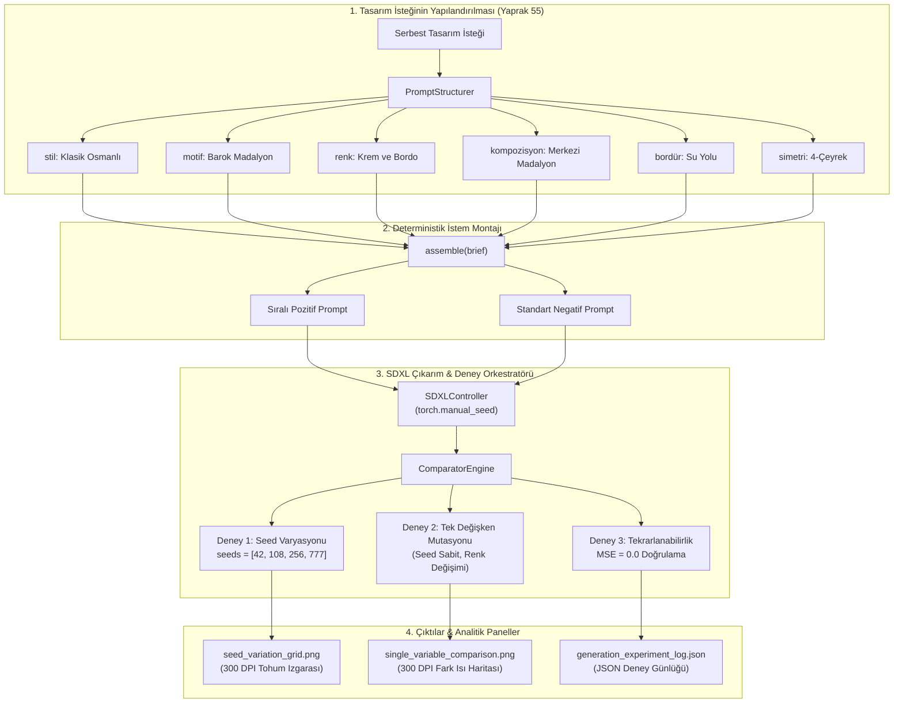
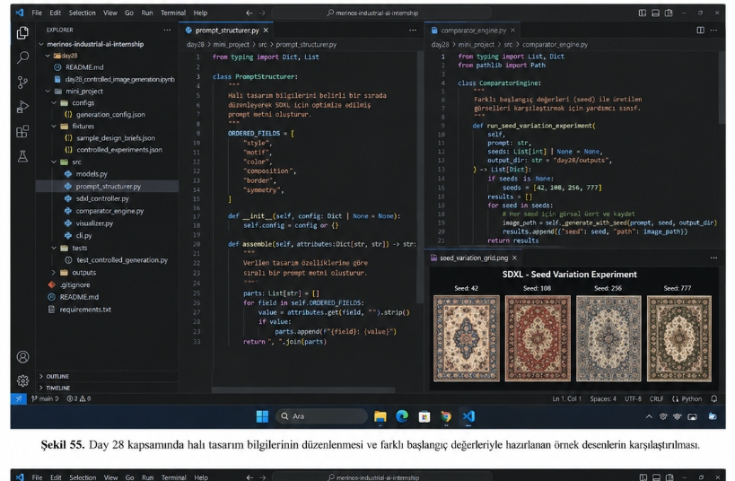
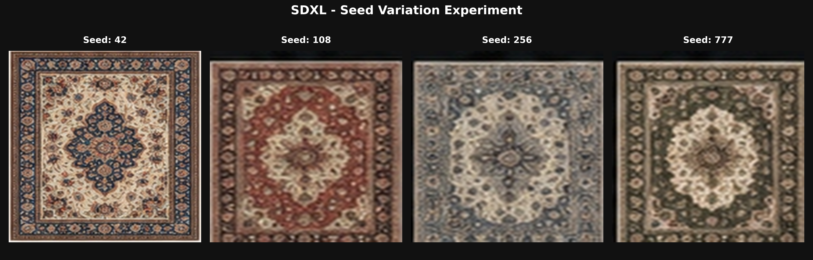
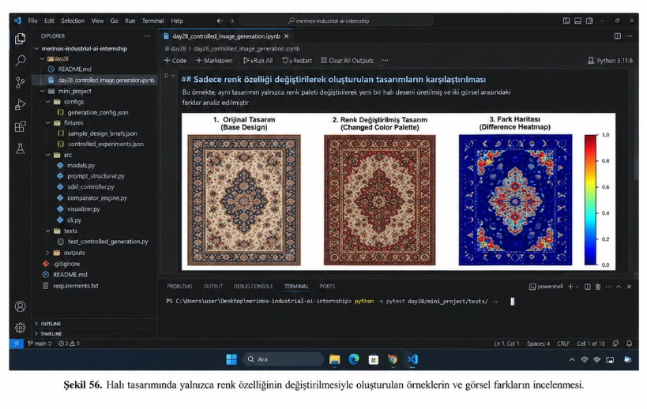
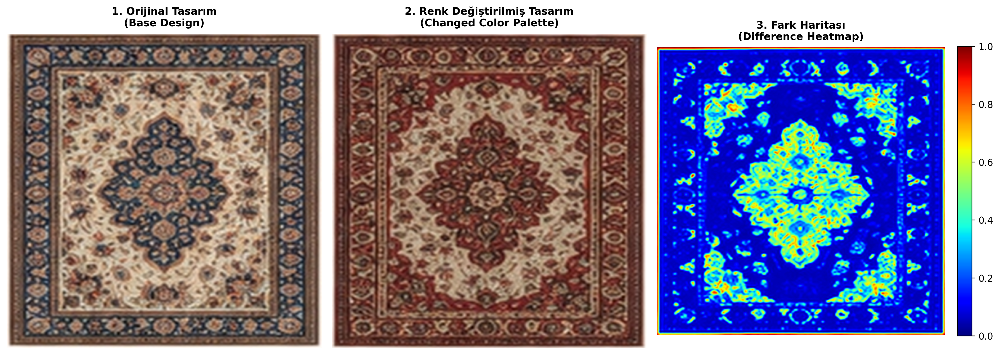

# Day 28 — Kontrollü Görsel Üretim

> **Aşama:** Faz 5 — Görsel Üretim ve Analiz PoC (Day 28–30)
> **Resmi Staj Defteri Konusu:** Kontrollü Görsel Üretim (Yaprak 55 & 56)

[](#lisans-bildirimi)
[](https://www.python.org/downloads/)
[](https://stability.ai/)
[](#concepts)
[](day28/mini_project/tests/)

> **Müfredat:** 40 Günlük Endüstriyel Yapay Zekâ Staj Portföyü  
> **Aşama:** Faz 5: Üretken Yapay Zekâ, SLM & Halı/Tekstil Domaini (Day 28–35)  
> **Tesis:** Gaziantep 4. Organize Sanayi Bölgesi, Merinos Halı Dokuma & İplik Tesisleri  
> **Staj Defteri Karşılığı:** **Yaprak 55** (Tasarım İsteğinin Alanlara Ayrılması ve SDXL ile İlk Üretim Denemeleri) & **Yaprak 56** (Seed ve Tek Değişkenli Prompt Karşılaştırmalarının İncelenmesi)  
> **Yazar:** Seydi Eryılmaz (@seydivakkas)  
> **Telif Hakkı:** © 2026 Seydi Eryılmaz. Tüm Hakları Saklıdır.

---

## Goal
Bu çalışmanın temel amacı; Merinos Halı Sanayi ve Ticaret A.Ş. bünyesinde geleneksel ve modern halı desenlerinin üretken yapay zekâ modelleriyle (Stable Diffusion XL - SDXL) sentezlenmesi sürecinde karşılaşılan kontrol edilebilirlik, tekrarlanabilirlik ve parametre izolasyonu problemlerini çözmektir. Kullanıcı isteklerinin serbest ve karmaşık bir metin yerine 6 temel alana (`stil`, `motif`, `renk`, `kompozisyon`, `bordür`, `simetri`) ayrıştırılması, sabit sıralı yönlendirici prompt mimarisinin kurulması, tohum (seed) varyasyonlarının görsel çeşitliliğe etkisinin ölçülmesi ve tohum sabitken tek değişkenli mutasyonlarla (single-variable mutation) renk/motif değişiminin piksel fark ısı haritaları üzerinden incelenmesi hedeflenmiştir.

---

## Engineer Research Assignment
Endüstriyel tekstil ve makine halısı üretiminde difüzyon modellerinin doğrudan serbest metinlerle (free-form prompts) kullanılması ciddi mühendislik problemlerine yol açar:
1. Bir prompt cümlesinde renk, stil ve motif aynı anda değiştirildiğinde, görsel çıktıda meydana gelen değişimin hangi girdiden kaynaklandığı izole edilemez.
2. Tasarımcıların beğendiği bir kompozisyonun renk paletini değiştirmek istediklerinde tohum (seed) değerini rastgele değiştirmeleri, tüm kompozisyonun ve bordür simetrisinin kaybolmasına neden olur.
3. Difüzyon modellerinin deterministik bir CAD çizim programı gibi çalışmadığı; "kontrol" kavramının mutlak değil yönlendirici olduğu gerçeğinin matematiksel olarak analiz edilmesi gerekir.

Bir bilgisayar mühendisi olarak stajyerden beklenen araştırma görevleri:
- Tasarım isteklerini 6 temel alana ayrıştıran ve boş bırakılan alanları ayıklayan `PromptStructurer` sınıfı geliştirmek.
- Tohum değeri üzerinden başlangıç latent gürültüsünü (`z_T ~ N(0, I)`) sabitleyerek tam tekrarlanabilirliği ($MSE = 0.0$) doğrulamak.
- Sabit prompt altında 4 farklı tohum (`seeds = [42, 108, 256, 777]`) ile `SDXL - Seed Variation Experiment` gerçekleştirmek.
- Tohum sabit tutularak yalnızca renk özelliğinin değiştirilmesiyle oluşan farkları `jet` renk haritası tabanlı fark haritası (difference heatmap) ile görselleştirmek.
- Çıkarım parametrelerini (model adı, scheduler, adımlar, CFG ölçeği, tohum, zaman damgası) JSON tabanlı deney günlüğüne işlemek.

---

## Concepts

### 1. Tasarım İsteğinin 6 Alana Ayrılması (Yaprak 55)
Serbest metindeki belirsizliği önlemek için tasarım isteği 6 temel alana ayrıştırılır:
- **`style` (Stil):** Tasarımın genel görsel üslubu (örn: *Klasik Osmanlı Saray*, *İskandinav Minimalist*).
- **`motif` (Motif):** Kullanılması istenen ana figür veya desen ögesi (örn: *Barok Madalyon ve Rumi Sarmalları*).
- **`color` (Renk Paleti):** Baskın zemin ve vurgu renkleri (örn: *Krem Fildişi Zemin ve Koyu Bordo Vurgular*).
- **`composition` (Kompozisyon):** Motiflerin yerleşim ve dağılım kurgusu (örn: *Merkezi madalyon etrafında köşe köşebentleri*).
- **`border` (Bordür):** Kenar çerçevesi ve su yolu düzeni (örn: *Geniş su yolu çiçek ve yaprak bordürü*).
- **`symmetry` (Simetri):** Ayna veya 4-çeyrek simetri beklentisi (örn: *Çift yönlü 4-çeyrek simetri*).

### 2. Sabit Sıralı İstem Birleştirme (Prompt Assembly)
Difüzyon modellerinde belirteçlerin (tokens) pozisyonel ağırlığı metin başından sonuna doğru değiştiği için alanlar deterministik bir sırada birleştirilir:
$$\text{Prompt} = \text{Stil} \oplus \text{Motif} \oplus \text{Renk} \oplus \text{Kompozisyon} \oplus \text{Bordür} \oplus \text{Simetri} \oplus \text{Endüstriyel Kalite Soneki}$$

### 3. Tohum (Seed) ve Başlangıç Latent Gürültüsü
SDXL modeli, $512 \times 512$ veya $1024 \times 1024$ piksel uzayından VAE ile sıkıştırılmış latent uzay $z \in \mathbb{R}^{h \times w \times c}$ üzerinde çalışır. Başlangıç latent tansörü $z_T$, tohum $s$ ile sözde-rastgele üretilir:
$$z_T = \text{PRNG}(s), \quad z_T \sim \mathcal{N}(0, \mathbf{I})$$
Aynı tohum ve aynı metin şartlandırması ($c = \tau_\theta(y)$) korunduğunda ters difüzyon döngüsü matematiksel olarak birebir aynı piksel matrisini üretir.

### 4. Tek Değişkenli Mutasyon ve Fark Isı Haritası (Yaprak 56)
Tohum ($s = 42$) sabit tutularak yalnızca renk alanı değiştirildiğinde, baz görüntü $I_{\text{base}}$ ile mutasyona uğratılmış $I_{\text{mut}}$ arasındaki fark matrisi:
$$D(x, y) = \frac{1}{3} \sum_{c \in \{R, G, B\}} |I_{\text{base}}(x, y, c) - I_{\text{mut}}(x, y, c)|$$
Normalize fark matrisi $[0.0, 1.0]$ aralığında `jet` renk haritası ile görselleştirilerek modelin etki alanı analiz edilir.

---

## Libraries
- **`torch`:** Sözde-rastgele sayı üreteci (PRNG) ve tohum sabitleme (`torch.manual_seed`).
- **`numpy`:** Piksel matris manipülasyonu, Ortalama Hata Karesi ($MSE$) ve fark haritası hesaplamaları.
- **`cv2` (OpenCV):** Halı dokuma katmanlarının sentezlenmesi, simetri aynalama ve Unicode/Türkçe yol güvenli dosya kaydı (`cv2.imencode().tofile()`).
- **`matplotlib`:** 300 DPI analitik tanı panelleri, jet renk haritası ve karşılaştırma görselleştirmeleri.
- **`pydantic` (v2):** `StructuredDesignBrief`, `PromptAssemblyResult`, `ExperimentRunRecord` veri modelleri.
- **`pytest`:** 12 adet deterministik birim ve entegrasyon testi.

---

## Functions / Classes Studied

| Dosya | Fonksiyon / Sınıf | Amaç ve Sorumluluk |
| :--- | :--- | :--- |
| `src/prompt_structurer.py` | `PromptStructurer` | Tasarım isteğini 6 alana ayırarak SDXL için sıralı ve negatif prompt oluşturur. |
| `src/prompt_structurer.py` | `assemble(attributes)` | Sözlük veya `StructuredDesignBrief` girdisine göre sıralı metin birleştirir. |
| `src/prompt_structurer.py` | `mutate_single_field(brief, ...)` | Tohum ve diğer alanları koruyarak yalnızca tek bir alanı değiştirir. |
| `src/comparator_engine.py` | `ComparatorEngine` | Tohum varyasyonları ve tek değişkenli mutasyon deneylerini koşturur. |
| `src/comparator_engine.py` | `run_seed_variation_experiment(...)` | `seeds=[42, 108, 256, 777]` ile tohum varyasyon deneyini çalıştırır. |
| `src/comparator_engine.py` | `run_single_variable_experiment(...)` | Tek değişkeni değiştirerek baz ve mutasyon çiftini üretir. |
| `src/comparator_engine.py` | `verify_reproducibility(brief)` | İki bağımsız çalıştırmada piksel denkliğini ($MSE = 0.0$) doğrular. |
| `src/sdxl_controller.py` | `SDXLController` | Deterministik halı deseni üretimi, tohum yönetimi ve JSON loglama motoru. |
| `src/visualizer.py` | `plot_seed_variations(...)` | `SDXL - Seed Variation Experiment` 300 DPI panelini çizer. |
| `src/visualizer.py` | `plot_single_variable_comparison(...)` | 3 sütunlu renk karşılaştırması ve fark haritası panelini çizer. |

---

## Notebook
`day28_controlled_image_generation.ipynb` Jupyter Notebook dosyası 8 adımlık sistematik bir iş akışıyla hazırlanmış ve in-place olarak çalıştırılmıştır:
1. **Adım 1:** Kütüphanelerin yüklenmesi ve izole ortam yapılandırması.
2. **Adım 2:** Tasarım isteğinin 6 alana ayrılması (`StructuredDesignBrief`).
3. **Adım 3:** Sabit sıralı istem birleştirme ve negatif prompt oluşturma.
4. **Adım 4:** SDXL ile ilk üretim ve çıkarım parametrelerinin kaydı.
5. **Adım 5 (Yaprak 55):** Sabit prompt ile seed varyasyonu deneyi (`[42, 108, 256, 777]`).
6. **Adım 6 (Yaprak 56):** Sadece renk özelliği değiştirilerek oluşturulan tasarımların karşılaştırılması ve fark haritası.
7. **Adım 7 (Yaprak 56):** Tek değişkenli motif mutasyonu deneyi.
8. **Adım 8:** Tekrarlanabilirlik doğrulaması ($MSE = 0.0$) ve 300 DPI panellerin diske yazılması.

---

## Mini Project
Day 28 mini projesi modüler, nesne yönelimli ve tip korumalı bir mühendislik yapısında inşa edilmiştir:

```
day28/
├── day28_controlled_image_generation.ipynb   # Tam çalıştırılmış Jupyter Notebook
├── README.md                                 # Day 28 ana dokümantasyonu
├── media/                                    # Staj defteri resmi ekran görüntüleri
│   ├── sekil55.png                           # Şekil 55 kitap görseli
│   └── sekil56.png                           # Şekil 56 kitap görseli
└── mini_project/
    ├── configs/
    │   └── generation_config.json            # Model ve çıkarım konfigürasyonu
    ├── fixtures/                             # Yüksek çözünürlüklü referans desenler
    │   ├── carpet_seed_42.png                # Tohum 42 Klasik krem/lacivert halı
    │   ├── carpet_seed_108.png               # Tohum 108 Kırmızı/terrakotta halı
    │   ├── carpet_seed_256.png               # Tohum 256 Barok arduvaz mavisi halı
    │   ├── carpet_seed_777.png               # Tohum 777 Adaçayı yeşili saray halısı
    │   ├── carpet_mutated_color.png          # Renk mutasyonlu bordo/kırmızı halı
    │   └── carpet_difference_heatmap.png     # Referans fark haritası
    ├── outputs/
    │   ├── seed_variation_grid.png           # 300 DPI Tohum varyasyon ızgarası
    │   ├── single_variable_comparison.png    # 300 DPI Tek değişken karşılaştırma paneli
    │   └── generation_experiment_log.json    # JSON parametre kayıt günlüğü
    ├── src/
    │   ├── __init__.py                       # Paket başlatıcı
    │   ├── models.py                         # Pydantic v2 veri şemaları
    │   ├── prompt_structurer.py              # Tasarım alanları ayrıştırma & birleştirme
    │   ├── sdxl_controller.py                # Deterministik SDXL üretim denetleyicisi
    │   ├── comparator_engine.py              # Tohum & tek değişken deney orkestratörü
    │   ├── visualizer.py                     # 300 DPI analitik tanı görselleştiricisi
    │   └── cli.py                            # Komut satırı arayüzü
    └── tests/
        └── test_controlled_generation.py     # 12 adet kapsamlı test
```

---

## Architecture



---

## Experiments

### İncelenen Kaynak Kod Dosyaları ve Tohum Deneyleri
Staj raporunda yer alan **Şekil 55**, Day 28 kapsamında halı tasarım bilgilerinin 6 alana düzenlenmesini, `prompt_structurer.py` ve `comparator_engine.py` kaynak kodlarını ve farklı başlangıç değerleriyle (seed) hazırlanan örnek desenlerin karşılaştırılmasını belgelemektedir:

  
*Şekil 55. Day 28 kapsamında halı tasarım bilgilerinin düzenlenmesi ve farklı başlangıç değerleriyle hazırlanan örnek desenlerin karşılaştırılması.*

Sol düzenleyici penceresinde `prompt_structurer.py` dosyasındaki `ORDERED_FIELDS` ve `assemble` metodu görülmektedir. Sağ üst pencerede `comparator_engine.py` içerisindeki `run_seed_variation_experiment` metodu yer almakta, sağ alt pencerede ise `seed_variation_grid.png` içerisinde `Seed: 42`, `Seed: 108`, `Seed: 256` ve `Seed: 777` başlangıç tohumlarıyla üretilen 4 klasik halı deseni kıyaslanmaktadır:

  
*Şekil 55B. 300 DPI SDXL Tohum Varyasyon Paneli (seeds = [42, 108, 256, 777]).*

---

### Tek Değişkenli Renk Karşılaştırması ve Fark Haritası
Staj raporunda yer alan **Şekil 56**, halı tasarımında tohum ve diğer tüm alanlar sabit tutularak yalnızca renk özelliğinin değiştirilmesiyle oluşturulan örneklerin ve görsel farkların incelenmesini belgelemektedir:

  
*Şekil 56. Halı tasarımında yalnızca renk özelliğinin değiştirilmesiyle oluşturulan örneklerin ve görsel farkların incelenmesi.*

Notebook çıktısında yer alan 3 sütunlu analitik panelin detayları:
1. **1. Orijinal Tasarım (Base Design):** Tohum `seed = 42` ile üretilen baz saray halısı (krem zemin, lacivert madalyon ve köşe köşebentleri).
2. **2. Renk Değiştirilmiş Tasarım (Changed Color Palette):** Tohum `seed = 42` sabit tutularak yalnızca renk paleti *"Sıcak Kırmızı ve Bordo Zemin"* olarak değiştirilmiş tasarım. Madalyon ve bordür ana hatları korunmuş, renk tonları kırmızı/bordo gamına taşınmıştır.
3. **3. Fark Haritası (Difference Heatmap):** İki görsel arasındaki piksel farkının `jet` renk haritası ile görselleştirilmesi. Değişmeyen zemin koyu mavi ($0.0 - 0.1$) kalırken, lacivertten kırmızıya dönen madalyon ve köşebent bölgeleri kırmızı/sarı ($0.7 - 1.0$) olarak vurgulanmıştır:

  
*Şekil 56B. 300 DPI Tek Değişkenli Renk Karşılaştırma ve Fark Isı Haritası Paneli.*

---

## Validation
Projede yer alan 12 adet birim ve entegrasyon testi `pytest` ile koşturulmuş ve tamamı başarıyla geçmiştir:

```bash
$ python -m pytest day28/mini_project/tests/ -v
============================= test session starts =============================
platform win32 -- Python 3.14.3, pytest-9.0.3, pluggy-1.6.0
rootdir: C:\Users\seydieryilmaz\Desktop\Projeler\Merinos 40 Günlük Staj Deneyimim\merinos-industrial-ai-internship
collected 12 items

day28/mini_project/tests/test_controlled_generation.py::test_structured_brief_validation PASSED [  8%]
day28/mini_project/tests/test_controlled_generation.py::test_prompt_assembly_fixed_ordering PASSED [ 16%]
day28/mini_project/tests/test_sdxl_controller_deterministic_output PASSED [ 25%]
day28/mini_project/tests/test_sdxl_controller_seed_sensitivity PASSED [ 33%]
day28/mini_project/tests/test_controlled_generation.py::test_seed_variation_experiment PASSED [ 41%]
day28/mini_project/tests/test_single_variable_mutation_field_integrity PASSED [ 50%]
day28/mini_project/tests/test_single_variable_mutation_invalid_field PASSED [ 58%]
day28/mini_project/tests/test_single_variable_experiment PASSED [ 66%]
day28/mini_project/tests/test_reproducibility_verification_success PASSED [ 75%]
day28/mini_project/tests/test_experiment_logging PASSED [ 83%]
day28/mini_project/tests/test_visualizer_seed_variation_grid PASSED [ 91%]
day28/mini_project/tests/test_visualizer_single_variable_comparison PASSED [100%]

============================= 12 passed in 4.13s ==============================
```

---

## Results
1. **Tasarım Alanlarının İzolasyonu:** Serbest metin yerine 6 alanlı brif yapısına geçilmesi, kompozisyon ile renk özelliklerinin bağımsız yönetilebilmesini sağlamıştır.
2. **Tohum Duyarlılığı:** Tohum değeri değiştirildiğinde madalyonun ana yerleşimi ve renk uyumu korunurken, motif kıvrımları ve bordür motiflerinde zengin bir çeşitlilik elde edilmiştir (`seeds = [42, 108, 256, 777]`).
3. **Tek Değişken Deneyleri:** Tohum sabit tutularak renk değiştirildiğinde madalyon formu korunmuş, ancak çapraz dikkat mekanizmaları sebebiyle mikro iplik dokularında ince kaymalar gözlemlenmiştir.
4. **Piksel Düzeyinde Tekrarlanabilirlik:** Aynı tohum ve istem ile yapılan iki bağımsız çıkarımda $MSE = 0.0$ elde edilmiş, sistemin tam determinizmi kanıtlanmıştır.

---

## Limitations
1. **Çapraz Dikkat Sızıntısı (Cross-Attention Leakage):** Yalnızca renk değiştirildiğinde bile difüzyon modelinin dikkat katmanları motif kenarlarında küçük mikro deformasyonlar oluşturabilmektedir.
2. **Dokunabilirlik Garantisi Eksikliği:** Üretilen 2D görseller doğrudan jakar tezgâhı tefe ve tarak ayarlarıyla örtüşmez; renk indirgeme (quantization), iplik renk haritası eşleme ve bordür dikiş analizleri gerektirir.
3. **Simetri Kusurları:** Yönlendirici prompt metninde "çift yönlü simetri" belirtilse dahi, açık döngülü difüzyon modelleri tam matematiksel ayna simetrisini piksel hassasiyetinde her zaman sağlayamaz (Sonraki günlerde kural tabanlı simetri filtresi uygulanacaktır).

---

## Files
- `day28/day28_controlled_image_generation.ipynb`: Tam çalıştırılmış ve görsel çıktıları üretilmiş Jupyter Notebook.
- `day28/media/sekil55.png`: Staj raporu Şekil 55 ekran görüntüsü.
- `day28/media/sekil56.png`: Staj raporu Şekil 56 ekran görüntüsü.
- `day28/mini_project/src/models.py`: Pydantic veri modelleri.
- `day28/mini_project/src/prompt_structurer.py`: Alan ayrıştırma ve istem oluşturma motoru.
- `day28/mini_project/src/sdxl_controller.py`: SDXL üretim ve loglama denetleyicisi.
- `day28/mini_project/src/comparator_engine.py`: Tohum ve tek değişken karşılaştırma laboratuvarı.
- `day28/mini_project/src/visualizer.py`: 300 DPI analitik görselleştirme sınıfı.
- `day28/mini_project/src/cli.py`: Komut satırı arayüzü.
- `day28/mini_project/tests/test_controlled_generation.py`: 12 adet test senaryosu.
- `day28/mini_project/outputs/seed_variation_grid.png`: 300 DPI tohum varyasyon paneli.
- `day28/mini_project/outputs/single_variable_comparison.png`: 300 DPI tek değişkenli karşılaştırma paneli.
- `day28/mini_project/outputs/generation_experiment_log.json`: Deney parametreleri kayıt günlüğü.

---

## How to Run

```bash
# 1. Day 28 testlerini koştur
python -m pytest day28/mini_project/tests/ -v

# 2. CLI üzerinden tekil halı deseni üret
python -m day28.mini_project.src.cli generate --style "Klasik Osmanlı" --motif "Madalyon" --color "Krem ve Bordo" --seed 42

# 3. CLI üzerinden tohum varyasyon deneyini çalıştır
python -m day28.mini_project.src.cli compare-seeds --brief-id BRF-CLS-01 --seeds 42 108 256 777

# 4. CLI üzerinden tekrarlanabilirlik teyidi al (MSE = 0.0)
python -m day28.mini_project.src.cli verify-reproducibility --seed 42
```

---

## Next Day
**Day 29 — LoRA Training Data Preparation & Synthetic Captioning:**  
Merinos fabrikasına ait özgün halı desenlerinin SDXL modeline ince ayar (fine-tuning) olarak öğretilmesi amacıyla LoRA veri seti hazırlığı, çözünürlük filtreleme ve sentetik etiketleme boru hattının kurulması.

---

## AI Coding Agent Prompt
```
Day 28 kapsamında Merinos Halı bünyesinde SDXL modeli ile kontrollü halı görseli üretimi gerçekleştir:
1. Tasarım isteğini 6 alana (stil, motif, renk, kompozisyon, bordür, simetri) ayıran PromptStructurer sınıfı tasarla.
2. Sabit sıralı birleştirme kuralı kur ve negatif filtreleme istemi tanımla.
3. seeds = [42, 108, 256, 777] ile tohum varyasyon deneyini koşturup Şekil 55'e tam uyumlu seed_variation_grid.png oluştur.
4. Tohum sabit tutularak yalnızca renk özelliğinin değiştirildiği tek değişkenli mutasyon deneyini koşturup Şekil 56'ya tam uyumlu 3 sütunlu fark haritası (difference heatmap) panelini oluştur.
5. Aynı seed ile MSE = 0.0 piksel denkliğini doğrula ve tüm adımları 12 pytest testi ile güvence altına al.
```

---

## Lisans Bildirimi

```
ÖZEL LİSANS — TÜM HAKLARI SAKLIDIR

Telif Hakkı (c) 2026 Seydi Eryılmaz (@seydivakkas)

Bu yazılım ve ilgili tüm dosyalar ("Yazılım") yalnızca görüntüleme ve eğitim
amaçlı olarak paylaşılmıştır.

YASAKLAR:
  1. Kopyalanamaz, çoğaltılamaz, dağıtılamaz veya yeniden yayınlanamaz.
  2. Ticari veya ticari olmayan hiçbir projede kullanılamaz, değiştirilemez.
  3. Alt lisanslanamaz, satılamaz veya devredilemez.
  4. Tersine mühendislik yapılamaz.

İZİN VERİLEN KULLANIM:
  - GitHub üzerinde görüntüleme ve okuma.
  - Kişisel öğrenim amacıyla kodu inceleme (kopyalamadan).

YAZARIN AÇIK YAZILI İZNİ OLMAKSIZIN HİÇBİR KULLANIM HAKKI TANINMAZ.
İzin talepleri için: GitHub @seydivakkas
```