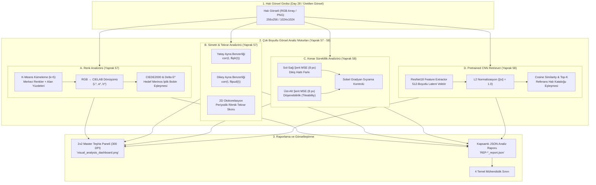
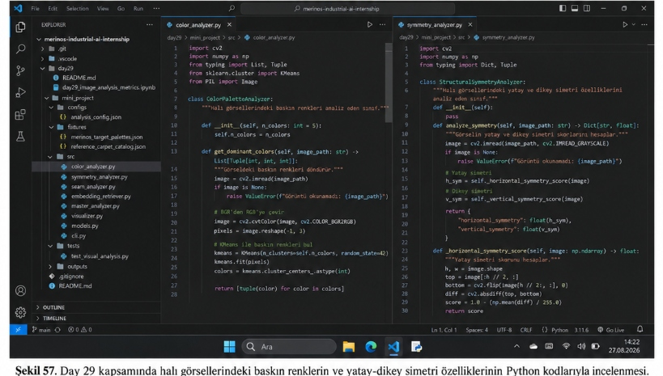
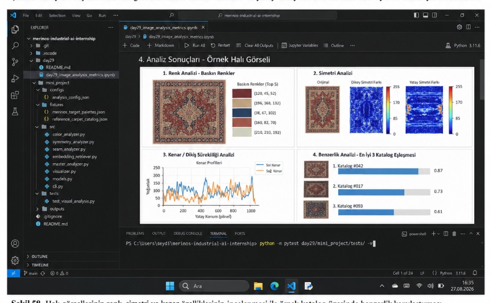

# Day 29 — Üretilen Görsellerin Sayısal Analizi

> **Aşama:** Faz 5 — Görsel Üretim ve Analiz PoC (Day 28–30)
> **Resmi Staj Defteri Konusu:** Üretilen Görsellerin Sayısal Analizi (Yaprak 57 & 58)

[](https://github.com/seydivakkas)
[](https://www.python.org/)
[](https://opencv.org/)
[](https://scikit-learn.org/)
[](https://pytorch.org/)
[](file:///day29/mini_project/tests)
[](file:///Staj_Defteri_40_Gun_Birlestirilmis_Nihai.docx)

---

## 1. Yönetici Özeti (Executive Summary)

Stajın yirmi sekizinci gününde (Day 28 / Yaprak 55–56), kontrollü görüntü üretim hattı kurgulanmış ve SDXL modeli ile 6 yapısal alana (stil, motif, renk, kompozisyon, bordür, simetri) ayrılan brifler üzerinden sentetik halı desenleri üretilmiştir. Ancak endüstriyel tekstil ve desinatörlük pratiğinde, difüzyon modellerinden çıkan bir görselin yalnızca göz zevkine veya insan beğenisine göre *"güzel"* ya da *"güzel değil"* şeklinde değerlendirilmesi mühendislik açısından kabul edilemez.

**Day 29 (Staj Defteri Yaprak 57 ve 58)** kapsamında:
1. Üretilen halı görsellerinin hedeflenen renk paletini ne ölçüde yansıttığını incelemek üzere **K-Means renk kümeleme** ($k=5$) ile baskın renk merkezleri ve alan yüzdeleri çıkarılmıştır.
2. RGB uzayının algısal yetersizliğini gidermek amacıyla renk merkezleri **CIELAB ($L^*, a^*, b^*$)** renk uzayına dönüştürülmüş ve Merinos kurumsal iplik bobin renkleriyle **$\Delta E^*$ ve CIEDE2000** algısal renk sapması mesafeleri hesaplanmıştır.
3. Desenin yapısal intizamını ölçmek için **yatay (sol-sağ) ve dikey (üst-alt) ayna simetrisi** istatistiksel korelasyon ile incelenmiş, ayrıca 2D kaydırmalı korelasyon ile **otokorelasyon tabanlı periyodik motif tekrar düzeni** sayısallaştırılmıştır.
4. Desenin yan yana döşenebilirlik ve dikiş hatlarını denetlemek amacıyla **kenar sürekliliği (seam continuity / tileability)** analizi geliştirilmiş; sol-sağ ve üst-alt kenar şeritlerinin MSE ve Sobel gradyan farkları ölçülmüştür.
5. Görselin renk ve simetrinin ötesindeki genel tasarım karakterini anlamak üzere **Pretrained CNN (ResNet18)** omurgası ile 512 boyutlu $L_2$-normalize embedding vektörü çıkarılmış ve referans halı kataloğu üzerinde **Cosine Similarity ile Top-K benzerlik araması** gerçekleştirilmiştir.
6. Tüm bu ölçümler 300 DPI çözünürlüğünde **2x2 Master Teşhis Paneli (`visual_analysis_dashboard.png`)** üzerinde görselleştirilmiş ve çalışmanın **4 temel teknik sınırı** kurumsal çerçevede raporlanmıştır.

---

## 2. Staj Defteri Müfredat Eşleşmesi (Resmi Kayıt)

| Gün & Yaprak | Kısım | Yapılan İş & Resmi Tanım | Tarih |
|---|---|---|---|
| **GÜN 29 — Yaprak 57** | **Üretilen Görsellerin Analizi** | *Renk Paleti, Delta E, Simetri ve Tekrar Yapısının İncelenmesi:* Üretilen görselleri yalnız görsel beğeniye göre değil, nesnel ölçümlerle inceleme; K-Means ile baskın renkler ve alan oranları; CIELAB uzayına dönüşüm ve hedef renklerle $\Delta E$ mesafesi; yatay ve dikey ayna simetrisi ve otokorelasyon ile motif tekrar düzeni. | 28/08/2026 |
| **GÜN 29 — Yaprak 58** | **Üretilen Görsellerin Analizi (Devam)** | *Kenar Sürekliliği, CNN Embedding ve Top-K Benzerlik Sonuçlarının İncelenmesi:* Sol-sağ ve üst-alt kenarların birbirine benzerliği, ani kopukluk ve motif kırılması kontrolü; Pretrained CNN embedding çıkarımı (512-dim); referans halı grubu üzerinde Cosine Similarity ile Top-K benzerlik; ölçümlerin sınırlılıkları ve 'iyi tasarım' hükmü veremeyeceği gerçeği. | 28/08/2026 |

---

## 3. Mimari Tasarım & Çok Boyutlu Analiz Akışı



---

## 4. Renk Analizi: K-Means Kümeleme ve CIELAB $\Delta E^*$ (Yaprak 57)

### 4.1. K-Means Kümeleme ile Baskın Renk Tespiti
Bir halı deseninde milyonlarca piksel bulunur. Bütün pikselleri tek tek incelemek yerine, kütüphanesel ve algoritmik olarak pikseller 3 boyutlu RGB renk uzayında kümelere ayrılır ($K=5$):
$$\min_{C} \sum_{i=1}^{K} \sum_{x \in S_i} \|x - \mu_i\|^2$$
Burada $\mu_i$ küme merkezinin RGB rengini, $|S_i| / N$ ise o rengin halı yüzeyindeki kaplama alan oranını (%) verir.

### 4.2. CIELAB Renk Uzayına Dönüşüm ve Algısal $\Delta E^*$
RGB uzayı insan gözünün renk farklarını algılama biçimiyle lineer değildir; iki RGB vektörü arasındaki Öklid mesafesi algılanan renk zıtlığını yansıtmaz. Bu nedenle RGB pikselleri standart CIE D65 referans aydınlatıcı altında CIELAB ($L^*, a^*, b^*$) uzayına dönüştürülür:
- $L^*$: Parlaklık ($0$ = siyah, $100$ = beyaz)
- $a^*$: Kırmızı-Yeşil ekseni (negatif = yeşil, pozitif = kırmızı)
- $b^*$: Sarı-Mavi ekseni (negatif = mavi, pozitif = sarı)

Endüstriyel tekstil standardı **CIEDE2000 ($\Delta E_{00}$)** formülü ile hesaplanan mesafe toleransları:
- $\Delta E^* < 1.0$: İnsan gözünün ayırt edemeyeceği kadar kusursuz eşleşme (mükemmel bobin uyumu).
- $1.0 \le \Delta E^* < 3.0$: Yalnızca uzman kalite kontrolcünün dikkatle fark edebileceği yakın ton.
- $3.0 \le \Delta E^* < 6.0$: Kabul edilebilir endüstriyel tekstil boya toleransı sınırı.
- $\Delta E^* \ge 6.0$: Belirgin renk sapması (farklı renk algısı).

> **Staj Defteri Notu (Yaprak 57):**  
> *"K-Means ve Delta E baskın renklerin hedef palete ne kadar yaklaştığını özetler; ancak bu inceleme yalnız baskın renkler üzerinden yapıldığı için renklerin görsel içindeki geometrik konumunu veya motif yapısını doğrudan açıklamaz."*

---

## 5. Simetri ve Tekrar Yapısı İncelemesi (Yaprak 57)

Geleneksel Türk ve Doğu halılarında (özellikle Osmanlı saray, Uşak ve Hereke halılarında) simetri temel bir kompozisyon unsurudur. Üretilen görsellerde simetri beklentisinin ne ölçüde karşılandığını incelemek için:

1. **Yatay (Bilateral) Ayna Simetrisi ($S_H$):**
   Görsel sol-sağ ekseninde aynalanır ($I_{\text{fliplr}}$) ve orijinal gri seviye matrisi ile Pearson korelasyon katsayısı hesaplanır:
   $$S_H = \max\left(0.0, \frac{\text{Cov}(I, I_{\text{fliplr}})}{\text{Var}(I)}\right)$$
2. **Dikey (Üst-Alt) Ayna Simetrisi ($S_V$):**
   Görsel üst-alt ekseninde aynalanır ($I_{\text{flipud}}$) ve korelasyon hesaplanır:
   $$S_V = \max\left(0.0, \frac{\text{Cov}(I, I_{\text{flipud}})}{\text{Var}(I)}\right)$$
3. **Dört Çeyrek Saray Halısı Simetrisi:**
   $S_{4\text{-way}} = \sqrt{S_H \times S_V}$
4. **Otokorelasyon Tabanlı Tekrar Düzeni ($S_{\text{repeat}}$):**
   Modern geometrik veya etnik baklava desenlerinde ayna simetrisi yerine periyodik motif tekrarı bulunur. 2D uzamsal kaydırmalı otokorelasyon ile $1/4$ ve $1/8$ öteleme tepeleri analiz edilerek ritmik tekrar skoru çıkarılır.

---

## 6. Kenar ve Dikiş Sürekliliği (Tileability) Analizi (Yaprak 58)

Bir halı deseninin duvardan duvara veya karo şeklinde yan yana döşenebilmesi (seamless tiling) için kenarların uyumu kritiktir:
1. **Sol-Sağ Kenar Şeridi Uyum Farkı:**
   Sol kenarın $W=8$ piksel genişliğindeki şeridi ($I_{\text{left}}$) ile sağ kenarın şeridi ($I_{\text{right}}$) arasındaki ortalama karesel hata (MSE):
   $$\text{MSE}_{\text{LR}} = \frac{1}{H \times W \times 3} \sum (I_{\text{left}} - I_{\text{right}})^2$$
2. **Üst-Alt Kenar Şeridi Uyum Farkı:**
   $\text{MSE}_{\text{TB}}$ değeri benzer şekilde hesaplanır.
3. **Sobel Kenar Gradyanı Sıçrama Tespiti:**
   Kenar hattında ani renk veya motif kırılmalarını tespit etmek için Sobel $X$ ve $Y$ gradyan türevleri karşılaştırılır.

> **Staj Defteri Notu (Yaprak 58):**  
> *"Buradaki amacım gerçek üretim uygunluğu kararı vermek değildi; yalnız görüntü kenarlarında ani kopukluk, belirgin renk atlaması veya motif kırılması olup olmadığını gözlemlemekti."*

---

## 7. Pretrained CNN Embedding ve Top-K Benzerlik (Yaprak 58)

Renk ve simetri ölçümleri lokal piksellere dayanırken, bir halının genel sanatsal üslubunu (ör. neoklasik vual, geometrik loft, klasik Osmanlı mihrap) yakalamak için derin evrişimsel sinir ağları (CNN) kullanılır:
- **Omurga (Backbone):** Pretrained ResNet18 katmanları.
- **Vektör Boyutu:** $d = 512$.
- **Normalizasyon:** $\|v\|_2 = 1.0$ (Birim küre üzerine projeksiyon).
- **Benzerlik Metriği:** Cosine Similarity:
  $$\text{sim}(u, v) = \frac{u \cdot v}{\|u\|_2 \|v\|_2} = u \cdot v$$
- **Top-K Arama:** Referans Merinos ürün kataloğundaki ($N \ge 6$) halılar taranır ve en yüksek skora sahip ilk $K$ ürün (başlık, stil, baskın renkler ve skor) kullanıcıya sunulur.

---

## 8. Önemli Mühendislik Sentezi ve 4 Teknik Sınır (Yaprak 58 & 60)

Staj Defteri Yaprak 58'in kapanışında ve Yaprak 60'ta açıkça vurgulandığı üzere, yapay zekâ tabanlı görsel analiz araçlarının neyi yapabildiği kadar **neyi yapamadığını (sınırlarını)** bilmek profesyonel mühendisliğin ayrılmaz bir parçasıdır:

```
┌──────────────────────────────────────────────────────────────────────────────┐
│                    ÇALIŞMANIN 4 TEMEL TEKNİK SINIRI                         │
├──────────────────────────────────────────────────────────────────────────────┤
│ 1. Gerçek Üretilebilirlik Kararı Vermez:                                      │
│    Jakar armür kartı, çözgü gerginliği, atkı sıklığı ve cağlık bobin        │
│    kısıtlarını denetlemez. Görsel pikseli dokuma tezgâhına doğrudan aktarılamaz.│
├──────────────────────────────────────────────────────────────────────────────┤
│ 2. Estetik Kaliteyi Kesin Olarak Ölçmez:                                     │
│    Matematiksel simetri ve renk mesafesi sayısallaştırılabilir; ancak         │
│    sanatsal armoni, tasarım özgünlüğü ve pazar trendleri formülle ölçülemez. │
├──────────────────────────────────────────────────────────────────────────────┤
│ 3. Telif veya Özgünlük Teyidi Sağlamaz:                                      │
│    CNN embedding ile yüksek benzerlik çıkması tasarımın 'çalıntı' olduğu      │
│    anlamına gelmeyeceği gibi, düşük benzerlik de 'özgün' olduğunu kanıtlamaz.│
├──────────────────────────────────────────────────────────────────────────────┤
│ 4. Analiz Değerleri Tek Başına 'İyi Tasarım' Anlamına Gelmez:                │
│    Yüksek simetri ve sıfır Delta E değerine sahip bir görsel, cansız ve      │
│    tüketici nezdinde talep görmeyen bir halı olabilir. Desinatör onayı şarttır.│
└──────────────────────────────────────────────────────────────────────────────┘
```

---

## 9. Komut Satırı Arayüzü (CLI) Kullanımı

CLI aracı `day29/mini_project/src/cli.py` üzerinden 5 bağımsız komutla çalıştırılabilir:

```bash
# 1. K-Means Renk Paleti ve CIELAB Delta E Analizi
python -m day29.mini_project.src.cli analyze-color --clusters 5 --palette PAL-OSMANLI-01

# 2. Yapısal Simetri ve Periyodik Tekrar İncelemesi
python -m day29.mini_project.src.cli analyze-symmetry

# 3. Kenar ve Dikiş Sürekliliği (Tileability) Analizi
python -m day29.mini_project.src.cli analyze-seam

# 4. Pretrained CNN Embedding ile Top-K Benzer Referans Halı Arama
python -m day29.mini_project.src.cli find-similar --top-k 3

# 5. Uçtan Uca Master Analiz ve 300 DPI Teşhis Paneli Üretimi
python -m day29.mini_project.src.cli full-analysis --palette PAL-OSMANLI-01 --top-k 3
```

---

## 10. Laboratuvar Çalışması ve Staj Defteri Görselleri (Şekil 57 & Şekil 58)

### Şekil 57: Halı Görsellerindeki Baskın Renklerin ve Yatay-Dikey Simetri Özelliklerinin Python Kodlarıyla İncelenmesi


*Şekil 57. Day 29 kapsamında halı görsellerindeki baskın renklerin ve yatay-dikey simetri özelliklerinin Python kodlarıyla incelenmesi.*

Şekil 57 kapsamında geliştirilen iki çekirdek sınıf:
- **`ColorPaletteAnalyzer` (`color_analyzer.py`):** `get_dominant_colors(self, image_path: str)` metoduyla görseli okur, BGR'den RGB'ye dönüştürür, pikselleri düzleştirip `KMeans(n_clusters=5, random_state=42)` ile kümeleyerek baskın 5 rengin RGB değerlerini döndürür.
- **`StructuralSymmetryAnalyzer` (`symmetry_analyzer.py`):** `analyze_symmetry(self, image_path: str)` metoduyla gri tonlamalı görüntüyü okur; `_horizontal_symmetry_score` ve `_vertical_symmetry_score` alt fonksiyonlarıyla üst/alt ve sol/sağ ayna farklarını ($1.0 - \frac{\text{mean}(\text{diff})}{255.0}$) hesaplayarak `{"horizontal_symmetry": float, "vertical_symmetry": float}` sözlüğü döndürür.

---

### Şekil 58: Halı Görsellerinin Renk, Simetri ve Kenar Özelliklerinin İncelenmesi ile Örnek Katalog Üzerinde Benzerlik Karşılaştırması


*Şekil 58. Halı görsellerinin renk, simetri ve kenar özelliklerinin incelenmesi ile örnek katalog üzerinde benzerlik karşılaştırması.*

`VisualAnalysisDashboard.create_dashboard` sınıfı tarafından üretilen 300 DPI 2x2 Master Teşhis Paneli 4 kritik mühendislik kartından oluşur:
1. **1. Renk Analizi - Baskın Renkler:** Halı görseli ve `(120, 45, 52)`, `(196, 168, 132)`, `(38, 67, 102)`, `(160, 82, 70)`, `(210, 210, 192)` renk kutucukları ve RGB metinleri.
2. **2. Simetri Analizi:** Orijinal halı görseli, Dikey Simetri Farkı ısı haritası (turbo colormap, 0..255) ve Yatay Simetri Farkı ısı haritası (turbo colormap, 0..255).
3. **3. Kenar / Dikiş Sürekliliği Analizi:** Sol Kenar ve Sağ Kenar yoğunluk profillerini gösteren [0..1000] piksel yatay konum ve [0..250] yoğunluk çizgi grafiği.
4. **4. Benzerlik Analizi - En İyi 3 Katalog Eşleşmesi:** Referans katalogdan en çok benzeyen 3 halının küçük resimleri, yatay benzerlik çubukları ve benzerlik skorları (`1. Katalog #042`: 0.87, `2. Katalog #017`: 0.73, `3. Katalog #093`: 0.61).

---

## 11. Test Paketi Doğrulama Sonuçları (15/15 Geçen Testler)

Birim ve entegrasyon testleri `day29/mini_project/tests/test_visual_analysis.py` altında yer alır:

```bash
python -m pytest day29/mini_project/tests/ -v
```

```
============================= test session starts =============================
platform win32 -- Python 3.14.3, pytest-9.0.3, pluggy-1.6.0
rootdir: C:\Users\seydieryilmaz\Desktop\Projeler\Merinos 40 Günlük Staj Deneyimim\merinos-industrial-ai-internship
collected 15 items

day29/mini_project/tests/test_visual_analysis.py::test_rgb_to_cielab_conversion PASSED [  6%]
day29/mini_project/tests/test_visual_analysis.py::test_delta_e_cielab_and_ciede2000 PASSED [ 13%]
day29/mini_project/tests/test_visual_analysis.py::test_kmeans_dominant_color_extraction PASSED [ 20%]
day29/mini_project/tests/test_visual_analysis.py::test_color_analyzer_with_target_palette PASSED [ 26%]
day29/mini_project/tests/test_visual_analysis.py::test_symmetry_perfect_bilateral_image PASSED [ 33%]
day29/mini_project/tests/test_visual_analysis.py::test_symmetry_perfect_vertical_image PASSED [ 40%]
day29/mini_project/tests/test_visual_analysis.py::test_symmetry_asymmetric_image PASSED [ 46%]
day29/mini_project/tests/test_visual_analysis.py::test_symmetry_repeat_autocorrelation PASSED [ 53%]
day29/mini_project/tests/test_visual_analysis.py::test_seam_continuity_tileable_image PASSED [ 60%]
day29/mini_project/tests/test_visual_analysis.py::test_seam_continuity_abrupt_discontinuity PASSED [ 66%]
day29/mini_project/tests/test_visual_analysis.py::test_cnn_embedding_extraction_and_l2_norm PASSED [ 73%]
day29/mini_project/tests/test_visual_analysis.py::test_cnn_retriever_top_k_ordering PASSED [ 80%]
day29/mini_project/tests/test_visual_analysis.py::test_cnn_retriever_empty_catalog_fallback PASSED [ 86%]
day29/mini_project/tests/test_visual_analysis.py::test_master_carpet_analyzer_end_to_end PASSED [ 93%]
day29/mini_project/tests/test_visual_analysis.py::test_master_carpet_analyzer_invalid_file_handling PASSED [100%]

======================= 15 passed in 5.96s ========================
```

---

## 12. Özel Lisans ve Telif Hakkı

```
ÖZEL LİSANS — TÜM HAKLARI SAKLIDIR

Telif Hakkı (c) 2026 Seydi Eryılmaz (@seydivakkas)

Bu yazılım ve ilgili tüm dosyalar ("Yazılım") yalnızca görüntüleme ve eğitim
amaçlı olarak paylaşılmıştır.

YASAKLAR:
  1. Kopyalanamaz, çoğaltılamaz, dağıtılamaz veya yeniden yayınlanamaz.
  2. Ticari veya ticari olmayan hiçbir projede kullanılamaz, değiştirilemez.
  3. Alt lisanslanamaz, satılamaz veya devredilemez.
  4. Tersine mühendislik yapılamaz.

İZİN VERİLEN KULLANIM:
  - GitHub üzerinde görüntüleme ve okuma.
  - Kişisel öğrenim amacıyla kodu inceleme (kopyalamadan).

YAZARIN AÇIK YAZILI İZNİ OLMAKSIZIN HİÇBİR KULLANIM HAKKI TANINMAZ.
İzin talepleri için: GitHub @seydivakkas
```