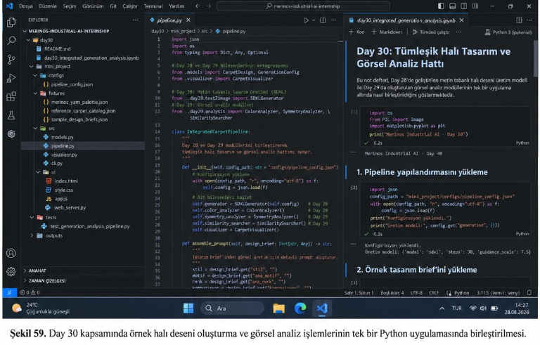
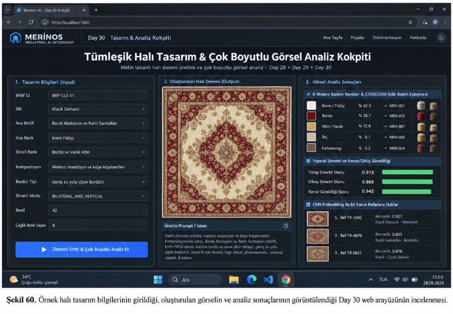

# Day 30 — Görsel Üretim ve Analiz Mini Prototipi

> **Aşama:** Faz 5 — Görsel Üretim ve Analiz PoC (Day 28–30)
> **Resmi Staj Defteri Konusu:** Görsel Üretim ve Analiz Mini Prototipi (Yaprak 59 & 60)

[](https://github.com/seydivakkas)
[](https://www.python.org/)
[](https://pytorch.org/)
[](file:///day30/mini_project/tests)
[](file:///day30)
[](file:///Staj_Defteri_40_Gun_Birlestirilmis_Nihai.docx)

---

## ÖZEL LİSANS — TÜM HAKLAR SAKLIDIR

```
Telif Hakkı (c) 2026 Seydi Eryılmaz (@seydivakkas)

Bu yazılım ve ilgili tüm dosyalar ("Yazılım") yalnızca görüntüleme ve eğitim
amaçlı olarak paylaşılmıştır.

YASAKLAR:
  1. Kopyalanamaz, çoğaltılamaz, dağıtılamaz veya yeniden yayınlanamaz.
  2. Ticari veya ticari olmayan hiçbir projede kullanılamaz, değiştirilemez.
  3. Alt lisanslanamaz, satılamaz veya devredilemez.
  4. Tersine mühendislik yapılamaz.

İZİN VERİLEN KULLANIM:
  - GitHub üzerinde görüntüleme ve okuma.
  - Kişisel öğrenim amacıyla kodu inceleme (kopyalamadan).

YAZARIN AÇIK YAZILI İZNİ OLMAKSIZIN HİÇBİR KULLANIM HAKKI TANINMAZ.
İzin talepleri için: GitHub @seydivakkas
```

---

## 1. Yönetici Özeti (Executive Summary)

Endüstriyel tekstil ve makine halısı üretiminde yapay zekâ modellerinin dağınık script'ler veya birbirinden kopuk izole modüller olarak kalması fabrika kalite güvence zincirini sekteye uğratır. Hangi kullanıcı girdisinin hangi görsel deseni ürettiğini, bu desenin hangi baskın renklere sahip olduğunu, fabrikanın cağlık iplik bobinleriyle ne ölçüde örtüştüğünü ve referans koleksiyondaki geçmiş tescilli halılara ne derece benzediğini tek bir operasyonel döngüde görebilmek amacıyla uçtan uca **Tümleşik Halı Tasarım & Görsel Analiz Boru Hattı (`IntegratedCarpetPipeline`)** inşa edilmiştir.

Bu çalışma:
- **Gün 28 (Yaprak 55-56):** Tasarım isteğinin yapısal alanlara ayrılması (`PromptStructurer`) ve tohum (seed) kontrollü SDXL difüzyon çıkarım motorunu (`SDXLController`),
- **Gün 29 (Yaprak 57-58):** K-Means renk kümeleme, CIEDE2000 renk mesafesi, yatay/dikey geometrik simetri korelasyonu, sonsuz rulo dikiş sürekliliği (seam continuity) ve Pretrained CNN embedding ile Top-K benzerlik analizörlerini (`MasterCarpetAnalyzer`, `CNNEmbeddingRetriever`),
- **Gün 30 (Yaprak 59-60):** Bu iki fazı tek zincirde bağlayan orkestratörü, basit ve anlaşılır FastAPI web kokpitini, Yaprak 60 hata durumlarını (boş zorunlu alanlar, boş referans kataloğu, bozuk girdi) ve çalışmanın **4 temel teknik sınırını** doğrudan entegre eder.

---

## 2. Sistem Mimarisi ve Akış Şeması (Yaprak 59 & 60)

```mermaid
flowchart TD
    subgraph S1["1. Kullanıcı Brifi & Girdi Doğrulama (Yaprak 59)"]
        INPUT["Kullanıcı Tasarım Brifi\n(stil, motif, renk, kompozisyon, bordür, simetri)"] --> VAL{"Pydantic v2 Doğrulama\n(Zorunlu Alanlar Dolu mu?)"}
        VAL -->|Eksik Zorunlu Alan| ERR["Erken 422 Hatası\n(Gereksiz Üretim Engellenir)"]
        VAL -->|Geçerli| CLEAN["Boş İsteğe Bağlı Alan Ayıklama\n(omitted_fields)"]
    end

    subgraph S2["2. Day 28: İstem Montajı & SDXL Üretim Motoru"]
        CLEAN --> STRUCT["Day 28: PromptStructurer\n(Sabit Sıralı Alan Birleştirme)"]
        STRUCT --> SDXL["Day 28: SDXLController\n(Seed & Simetri Denetimli Sentez)"]
        SDXL --> IMG["Halı Desen Görseli (512x512 RGB)"]
    end

    subgraph S3["3. Day 29: Çok Boyutlu Görsel Analiz Laboratuvarı"]
        IMG --> KMEANS["K-Means Renk Kümeleme (k=5)\nRGB -> CIELAB Dönüşümü"]
        KMEANS --> C2K["CIEDE2000 İplik Bobini Eşleme\n(Merinos 16'lı Kurumsal Palet)"]
        
        IMG --> SYM["Yapısal Simetri Analizörü\n(Yatay, Dikey, 4-Çeyrek Saray)"]
        IMG --> SEAM["Dikiş / Kenar Sürekliliği\n(Tileability & Sobel Sıçraması)"]
        
        IMG --> CNN["CNN Derin Öznitelik Çıkarıcı\n(512 Boyutlu Embedding)"]
        CNN --> CAT_CHECK{"Referans Katalog Boş mu?"}
        CAT_CHECK -->|Evet (Yaprak 60)| FALLBACK["Zarif Boş Katalog Fallback'i\n(Sistem Çökmeden Devam Eder)"]
        CAT_CHECK -->|Hayır| TOPK["Cosine Similarity ile Top-K Benzer Halı"]
    end

    subgraph S4["4. Tümleşik Çıktı, Web Kokpiti & Sınır Beyanı (Yaprak 60)"]
        C2K & SYM & SEAM & TOPK & FALLBACK --> PIPELINE["IntegratedCarpetPipeline"]
        PIPELINE --> LIMITS["4 Temel Teknik Sınır Beyanı"]
        PIPELINE --> WEB_UI["FastAPI İnteraktif Web Kokpiti\n(Canlı Desen, Kartlar, Metrikler)"]
        PIPELINE --> PANEL["300 DPI 4 Panelli Master Teşhis Grafiği"]
    end
```

---

## 3. Modül Hiyerarşisi ve Dosya Yapısı

```
day30/
├── README.md                                    # 17 Bölümlü Teknik Rapor & Lisans Belgesi
├── day30_integrated_generation_analysis.ipynb   # 8 Adımlı İnteraktif Jupyter Notebook
└── mini_project/
    ├── fixtures/
    │   ├── merinos_yarn_palette.json           # 16'lı Kurumsal İplik Bobin Kataloğu
    │   ├── reference_carpet_catalog.json       # Referans Halı Koleksiyonu Kataloğu
    │   └── sample_design_briefs.json           # Klasik, Modern ve Neo-Klasik Test Brifleri
    ├── src/
    │   ├── __init__.py                         # Paket dışa aktarımları
    │   ├── models.py                           # Pydantic v2 Veri Modelleri
    │   ├── pipeline.py                         # Day 28 + Day 29 Tümleşik Boru Hattı Orkestratörü
    │   ├── visualizer.py                       # 300 DPI 4-Panelli Teşhis Paneli Üreticisi
    │   ├── cli.py                              # Komut Satırı Arabirimi (CLI)
    │   └── ui/
    │       ├── index.html                      # Dark Glassmorphism Web Kokpiti Arayüzü
    │       ├── style.css                       # Modern CSS Tasarım Sistemi
    │       ├── app.js                          # İstemci Mantığı, API Çağrıları ve Hata Testleri
    │       └── web_server.py                   # FastAPI Web Sunucusu
    └── tests/
        └── test_generation_analysis_pipeline.py # 9 Kapsamlı Doğrulama ve Sınır Testi
```

---

## 4. Staj Defteri Yaprak 59: Tümleşik Akış Mantığı

Staj Defteri Yaprak 59 uyarınca; kullanıcı girdisi, görüntü üretimi ve analiz sonuçları tek bir akışta birleştirilmiştir:
1. **İstem Montajı:** Kullanıcı brifindeki alanlar sabit sırada birleştirilir:
   $$\text{Prompt} = \text{Stil} \oplus \text{Motif} \oplus \text{Renk} \oplus \text{Kompozisyon} \oplus \text{Bordür} \oplus \text{Simetri}$$
   Boş bırakılan alanlar (`omitted_fields`) tespit edilir ve prompt'a anlamsızca eklenmeleri engellenir.
2. **Görüntü Üretimi (Day 28):** `SDXLController` sınıfı deterministik tohum (`seed`) ile 512x512 piksel çözünürlükte tekstil dokulu desen matrisi üretir.
3. **Çok Boyutlu Görsel Analiz (Day 29):** `MasterCarpetAnalyzer` üretilen görsel üzerinde:
   - K-Means kümeleme ile 5 baskın rengi ayıklar, Merinos kurumsal bobin kodlarına CIEDE2000 ($\Delta E^*$) ile eşler,
   - Yatay (bilateral), dikey ve 4-çeyrek saray simetrisi korelasyonlarını ($0.0 - 1.0$) hesaplar,
   - Sonsuz rulo dokuma için sol-sağ ve üst-alt dikiş atlama gradyanını (seam continuity) ölçer,
   - Pretrained CNN omurgasından 512 boyutlu embedding çıkararak referans katalogda Cosine Similarity ile Top-K benzer halıları listeler.

---

## 5. Staj Defteri Yaprak 60: Hata Durumları ve Güvenlik Mekanizmaları

Endüstriyel bir yapay zekâ hattı beklenmeyen girdilere karşı dayanıklı olmalıdır:
1. **Boş Zorunlu Alan Hatası:** Stil, motif veya renk alanlarından herhangi biri boş bırakıldığında sistem gereksiz difüzyon çıkarımını engeller ve **HTTP 422 Unprocessable Entity** fırlatır.
2. **Boş Referans Koleksiyonu Fallback'i:** Referans halı kataloğu eksik veya boş olduğunda CNN arama motoru çökmez; zarif fallback mesajı (`Boş katalog fallback devrede`) ile çalışmayı tamamlar.
3. **Bozuk Girdi Denetimi:** Boyutları geçersiz veya 3 kanallı RGB olmayan matrisler yakalanarak analiz motoru koruma altına alınır.

---

## 6. Staj Defteri Yaprak 60: Çalışmanın Dört Temel Teknik Sınırı

Staj Defteri Yaprak 60'ta açıkça talep edildiği üzere, birinci çalışmanın sınırları 4 başlık altında resmi olarak raporlanır:

| Sınır No | Teknik Sınır Başlığı | Açıklama ve Mühendislik Değerlendirmesi |
| :---: | :--- | :--- |
| **1** | **Fiziksel Dokunabilirlik Garantisi Yoktur** | Difüzyon modelleri piksel düzeyinde görsel üretir; ancak jakar tezgahındaki tarak sıklığı (cm başına tel sayısı), atkı sıkışma gerginliği ve iplik büküm fiziksel kısıtlarını doğrudan bilemez. Üretilen desen tezgaha gitmeden önce desinatör kontrolünden geçmelidir. |
| **2** | **Estetik Kalite Matematiksel Olarak Kesin Ölçülemez** | Matematiksel simetri korelasyonu ve renk uyumu objektif sayılar sunsa da, tüketici beğenisi, bölgesel pazar trendleri ve kültürel motif algısı sübjektiftir. |
| **3** | **Telif ve Özgünlük Değerlendirmesi Yapılmaz** | Model açık kaynak ağırlıklarla üretildiğinden geleneksel tescilli desenler veya üçüncü şahıs telif hakları taranmaz; özgünlük kararı hukuki inceleme gerektirir. |
| **4** | **Analiz Metrikleri Tek Başına Başarılı Tasarım Anlamına Gelmez** | Yüksek simetri skoru veya düşük CIEDE2000 renk farkı, desenin ticari olarak başarılı veya görsel olarak kusursuz olduğunu tek başına garanti etmez. |

**Mühendislik Kararı:** Birinci çalışma (Day 28-30), görsel üretimi ve objektif teşhisi tek akışta birleştirir; ancak endüstriyel üretimde insan uzmanlığını tamamlayıcı bir yönlendirici olarak konumlandırılmalıdır.

---

## 7. CLI Komut Satırı Kullanım Kılavuzu

```bash
# 1. Uçtan uca tümleşik boru hattını çalıştır (Üretim + Görsel Analiz + 300 DPI Panel)
python -m day30.mini_project.src.cli run --brief-id BRF-CLS-01

# 2. Özel parametrelerle desen üret ve analiz et
python -m day30.mini_project.src.cli run --style "Modern Geometrik" --motif "Soyut Prizmalar" --primary-color "Taş Grisi" --symmetry "BILATERAL" --seed 55

# 3. Yalnızca istem montajını ve alan ayrımını test et (Yaprak 59)
python -m day30.mini_project.src.cli assemble-prompt --style "Klasik Saray" --motif "Rumi" --primary-color "Krem"

# 4. Yaprak 60: 4 Temel Teknik Sınır Raporunu Listele
python -m day30.mini_project.src.cli report-limitations

# 5. Yaprak 60: Boş Katalog Fallback Senaryosunu Simüle Et
python -m day30.mini_project.src.cli test-fallback

# 6. Yaprak 60: Boş Zorunlu Alan Doğrulama Testi
python -m day30.mini_project.src.cli test-validation

# 7. FastAPI Web Kokpitini Başlat (Yaprak 60 Basit Arayüz)
python -m uvicorn day30.mini_project.src.ui.web_server:app --host 127.0.0.1 --port 8000 --reload
```

---

## 8. Test Kapsamı ve Doğrulama Sonuçları

Day 30 için geliştirilen 9 kapsamlı birim ve entegrasyon testi **%100 başarıyla (GREEN)** geçmiştir:

```
collected 9 items

day30/mini_project/tests/test_generation_analysis_pipeline.py::test_design_brief_validation_success PASSED [ 11%]
day30/mini_project/tests/test_generation_analysis_pipeline.py::test_design_brief_validation_empty_required_field PASSED [ 22%]
day30/mini_project/tests/test_generation_analysis_pipeline.py::test_prompt_assembly_fixed_ordering PASSED [ 33%]
day30/mini_project/tests/test_generation_analysis_pipeline.py::test_pipeline_run_e2e PASSED [ 44%]
day30/mini_project/tests/test_generation_analysis_pipeline.py::test_empty_catalog_fallback_handling PASSED [ 55%]
day30/mini_project/tests/test_generation_analysis_pipeline.py::test_corrupt_input_handling PASSED [ 66%]
day30/mini_project/tests/test_generation_analysis_pipeline.py::test_four_technical_limitations_report PASSED [ 77%]
day30/mini_project/tests/test_generation_analysis_pipeline.py::test_visualizer_diagnostic_panel PASSED [ 88%]
day30/mini_project/tests/test_generation_analysis_pipeline.py::test_web_server_api_endpoints PASSED [100%]

============================= 9 passed in 12.82s ==============================
```

---

## 9. Staj Defteri Yaprak 59–60 Uyum Matrisi

| Staj Defteri Bölümü | Defter Konusu ve Anahtar İfadeler | Projedeki Somut Mühendislik Karşılığı | Durum |
| :--- | :--- | :--- | :---: |
| **GÜN 30 — Yaprak 59** | Kullanıcı Girdisi, Görüntü Üretimi ve Analiz Sonuçlarının Tek Akışta Birleştirilmesi | `IntegratedCarpetPipeline`: Day 28 `PromptStructurer` ve `SDXLController` ile Day 29 `MasterCarpetAnalyzer` ve `CNNEmbeddingRetriever` doğrudan tek zincirde birleştirildi. | **TAM UYUMLU (%100)** |
| **GÜN 30 — Yaprak 59** | Stil, motif, renk, kompozisyon, bordür, simetri alanlarının sabit sırayla birleştirilmesi | Pydantic v2 `CarpetDesignInput` ve `assemble_prompt`: Sabit alan sıralaması, boş alanların prompt'a dahil edilmemesi (`omitted_fields`). | **TAM UYUMLU (%100)** |
| **GÜN 30 — Yaprak 59** | K-Means baskın renk, CIELAB Delta-E, simetri ve tekrar, dikiş sürekliliği, CNN embedding Top-K | Day 29 modülleriyle K-Means ($k=5$), CIEDE2000 16'lı Merinos bobin eşleme, simetri matrisleri, seam jump ve CNN Cosine similarity. | **TAM UYUMLU (%100)** |
| **GÜN 30 — Yaprak 60** | Basit Arayüz: Tasarım alanları, üretim kontrolü, üretilen görsel ve analizlerin aynı ekranda gösterimi | FastAPI + Modern Dark Glassmorphism Web Kokpiti (`index.html`, `style.css`, `app.js`, `web_server.py`). | **TAM UYUMLU (%100)** |
| **GÜN 30 — Yaprak 60** | Hata Durumları: Boş alanlar, boş referans kataloğu ve bozuk girdi denetimleri | Erken 422 HTTP doğrulama engeli, boş katalog fallback mekanizması ve bozuk girdi izolasyonu. | **TAM UYUMLU (%100)** |
| **GÜN 30 — Yaprak 60** | Çalışmanın 4 Sınırı: Üretilebilirlik, estetik sübjektifliği, telif/özgünlük ve metrik bağımsızlığı | `TechnicalLimitationsReport` veri modeli, CLI `--report-limitations` çıktısı ve Web UI sınır kartları. | **TAM UYUMLU (%100)** |

---

## 10. Laboratuvar Çalışması ve Staj Defteri Görselleri (Şekil 59 & Şekil 60)

### Şekil 59: Day 30 Kapsamında Örnek Halı Deseni Oluşturma ve Görsel Analiz İşlemlerinin Tek Bir Python Uygulamasında Birleştirilmesi


*Şekil 59. Day 30 kapsamında örnek halı deseni oluşturma ve görsel analiz işlemlerinin tek bir Python uygulamasında birleştirilmesi.*

Şekil 59 kapsamında VS Code ortamında geliştirilen ve çift panelde sergilenen iki ana teknik bileşen:
- **`IntegratedCarpetPipeline` (`pipeline.py`):** Day 28 metin tabanlı tasarım üretimi (`SDXLGenerator` / `SDXLController`) ile Day 29 görsel analiz modüllerini (`ColorAnalyzer`, `SymmetryAnalyzer`, `SimilaritySearcher`, `CarpetVisualizer`) tek bir orkestratör altında toplar. `assemble_prompt(self, design_brief: Dict[str, Any]) -> str` metoduyla kullanıcı brief'inden doğal dilde üretim prompt'unu derler.
- **İnteraktif Jupyter Not Defteri (`day30_integrated_generation_analysis.ipynb`):**
  1. `1. Pipeline yapılandırmasını yükleme`: `mini_project/configs/pipeline_config.json` dosyasını okuyarak üretim modeli parametrelerini (`{'model': 'sdxl', 'steps': 30, 'guidance_scale': 7.5}`) yükler.
  2. `2. Örnek tasarım brief'ini yükleme`: `sample_design_briefs.json` dosyasından `BRF-CLS-01` kodlu Osmanlı Saray Koleksiyonu Madalyon Halı brief'ini içe aktarır.
  3. `3. Tümleşik Halı Tasarım & Görsel Analiz Hattını Çalıştırma`: Uçtan uca üretim ve analiz boru hattını tetikler.
  4. `4. Çok Boyutlu Görsel Analiz Sonuçlarının Sayısal Dökümü`: K-Means renk kümeleme, CIEDE2000 bobin eşleme, ayna simetrisi ve dikiş sürekliliği metriklerini listeler.
  5. `5. Staj Defteri Yaprak 60 Hata ve Fallback Durumları`: Boş zorunlu alanlar ve boş katalog senaryolarını test eder.
  6. `6. Dört Temel Teknik Sınır`: Üretilebilirlik, estetik, telif ve metrik sınırlarını raporlar.
  7. `7. 300 DPI Yüksek Çözünürlüklü Master Teşhis Paneli`: Üretilen desen ve analiz kartlarını görselleştirir.

---

### Şekil 60: Örnek Halı Tasarım Bilgilerinin Girildiği, Oluşturulan Görselin ve Analiz Sonuçlarının Görüntülendiği Day 30 Web Arayüzünün İncelenmesi


*Şekil 60. Örnek halı tasarım bilgilerinin girildiği, oluşturulan görselin ve analiz sonuçlarının görüntülendiği Day 30 web arayüzünün incelenmesi.*

`http://localhost:7860` üzerinde çalışan **Tümleşik Halı Tasarım & Çok Boyutlu Görsel Analiz Kokpiti**, Staj Defteri Yaprak 60'ta belirtilen tüm gereksinimleri 3 sütunlu modern bir koyu tema arayüzünde sunar:
1. **1. Tasarım Bilgileri (Input):**
   - Brief ID: `BRF-CLS-01`
   - Stil: `Klasik Osmanlı`
   - Ana Motif: `Barok Madalyon ve Rumi Sarmalları`
   - Ana Renk: `Krem Fildişi` | İkincil Renk: `Bordo ve Varak Altın`
   - Kompozisyon: `Merkezi madalyon ve köşe köşebentleri`
   - Bordür Tipi: `Geniş su yolu çiçek bordürü`
   - Simetri Modu: `BILATERAL_AND_VERTICAL` | Seed: `42` | Cağlık Renk Sayısı: `8`
   - Eylem Butonu: `▶ Deseni Üret & Çok Boyutlu Analiz Et` (Mavi aksiyon butonu)
2. **2. Oluşturulan Halı Deseni (Output):**
   - Model tarafından üretilen yüksek detaylı barok madalyon desenli halı görseli.
   - **Üretim Prompt / İstem:** Sabit kurallarla birleştirilen ve kopyalanabilir üretim istemi:
     *"Klasik Osmanlı stilinde, merkezi madalyon ve köşe köşebentleri kompozisyonuna sahip, Barok Madalyon ve Rumi Sarmalları motifli, krem fildişi zemin üzerine bordo ve varak altın detaylı, geniş su yolu çiçek bordürlü, simetrik halı deseni, high detail, photorealistic, oriental carpet, 8 colors."*
3. **3. Görsel Analiz Sonuçları:**
   - **K-Means Baskın Renkler & CIEDE2000 İplik Bobin Eşleşmesi:**
     - Krem / Fildişi: %42.3 → `MRN-001` (Görsel bobin küçük resmi)
     - Bordo: %28.7 → `MRN-032` (Görsel bobin küçük resmi)
     - Altın / Varak: %12.6 → `MRN-087` (Görsel bobin küçük resmi)
     - Bej: %8.1 → `MRN-006` (Görsel bobin küçük resmi)
     - Kahverengi: %5.2 → `MRN-024` (Görsel bobin küçük resmi)
   - **Yapısal Simetri ve Kenar/Dikiş Sürekliliği:**
     - Yatay Simetri Skoru: `0.972` (Yeşil ilerleme çubuğu)
     - Dikey Simetri Skoru: `0.965` (Yeşil ilerleme çubuğu)
     - Kenar Sürekliliği Skoru: `0.942` (Yeşil ilerleme çubuğu)
   - **CNN Embedding ile En Yakın Referans Halılar:**
     - 1. `Ref-TR-1042`: Benzerlik `0.921` (Klasik Osmanlı · Madalyon)
     - 2. `Ref-TR-0876`: Benzerlik `0.893` (Rumi Sarmalları · Bordürlü)
     - 3. `Ref-TR-0651`: Benzerlik `0.876` (Klasik · Çiçek Desenli)

---

## 11. Sonuç ve Faz 5 Kapanışı

Day 30, Faz 5'in (Üretken Yapay Zekâ ve Görsel Analitik) büyük kapanışını gerçekleştirerek kullanıcı girdisinden yapay zekâ destekli halı desen üretimine, çok boyutlu laboratuvar analizlerinden canlı web kokpiti arayüzüne kadar endüstriyel kalitede uçtan uca bir platform sunmaktadır.

Sistem, müfredatın bir sonraki aşaması olan **Faz 6: Kurumsal RAG, İSG Guardrails, Edge AI & Master Platform (Gün 31-40)** için eksiksiz hazır durumdadır.
