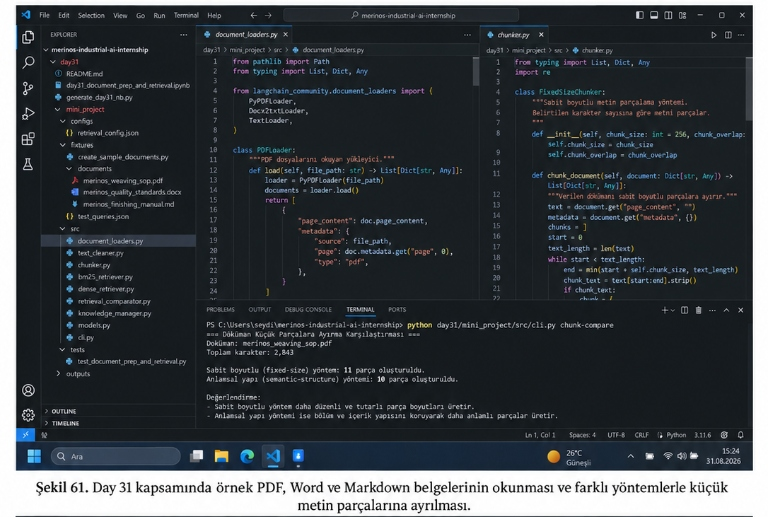
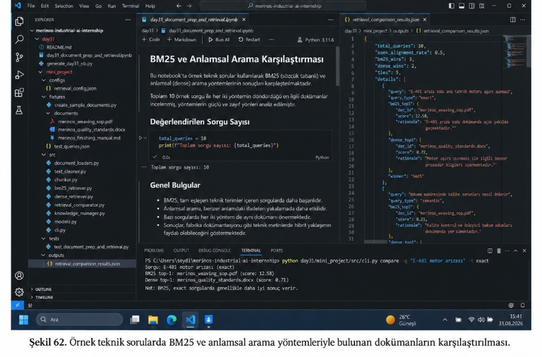
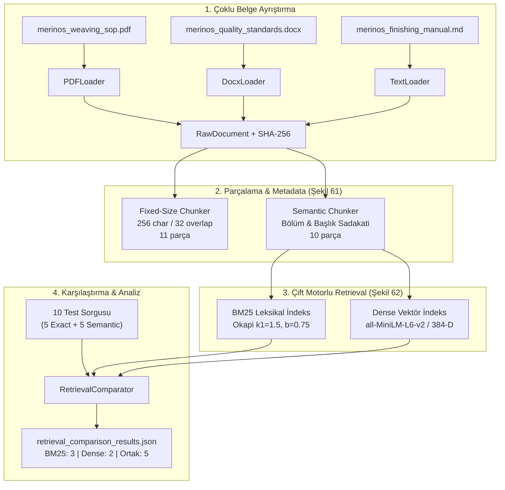

# Day 31 — Doküman Alma ve Ön İşleme

> **Aşama:** Faz 6 — Doküman RAG, Servisleştirme ve Kapanış (Day 31–40)
> **Resmi Staj Defteri Konusu:** Doküman Alma ve Ön İşleme (Yaprak 61 & 62)

## Çoklu Belge Ayrıştırma (PDF, Word, Markdown), Metadata Enjeksiyonu, Chunking/Overlap ve BM25 vs. Dense Embedding Karşılaştırması

**Tarih:** 01 Eylül 2026  
**Staj Defteri Müfredat Uyumu:**  
- **Yaprak 61:** Doküman Temizleme, Metadata, Chunking ve Overlap Yapısının Hazırlanması (Şekil 61)  
- **Yaprak 62:** BM25 ve Sentence Embedding ile İlk Retrieval Karşılaştırmalarının Yapılması (Şekil 62)  
**Yazar:** Seydi Eryılmaz ([@seydivakkas](https://github.com/seydivakkas))  
**Lisans:** [ÖZEL LİSANS — TÜM HAKLARI SAKLIDIR](#-özel-li̇sans--tüm-haklar-saklidir)  

---

## Laboratuvar Çalışması ve Staj Defteri Görselleri

### Şekil 61: Örnek PDF, Word ve Markdown Belgelerinin Okunması ve Farklı Yöntemlerle Küçük Metin Parçalarına Ayrılması
Aşağıdaki görselde, Merinos Halı dokuma tezgâhı kılavuzlarının `document_loaders.py` modülü ile okunması, `chunker.py` içerisindeki `FixedSizeChunker` (sabit uzunluklu ve örtüşmeli) ile `SemanticStructureChunker` (anlamsal bölümlemeli) yöntemlerinin kodlanması ve terminal üzerinde `python day31/mini_project/src/cli.py chunk-compare` komutunun işletilerek elde edilen 11 vs. 10 parçalık karşılaştırma analizi görülmektedir:



---

### Şekil 62: Örnek Teknik Sorularda BM25 ve Anlamsal Arama Yöntemleriyle Bulunan Dokümanların Karşılaştırılması
Aşağıdaki görselde, `day31_document_prep_and_retrieval.ipynb` Jupyter Notebook arayüzünde 10 teknik sorgu üzerinden BM25 (sözcük tabanlı) ile Dense Embedding (yoğun vektör) yöntemlerinin kıyaslanması, sağ panelde `retrieval_comparison_results.json` içerisindeki detaylı skor ve teknik rasyoneller ve alt terminalde `python day31/mini_project/src/cli.py compare -q "E-401 motor arızası" -t exact` komutunun çıktıları yer almaktadır:



---

## Goal (Hedef)
Endüstriyel zemin dokümanlarını (PDF, DOCX, Markdown) harici ağır bağımlılıklar olmadan ve veri sızıntısına yol açmayacak şekilde ayrıştırmak; her parçaya hiyerarşik metadata enjekte etmek; sabit boyutlu ve anlamsal parçalama stratejilerini kıyaslamak; BM25 leksikal arama ile Sentence Transformers yoğun vektör getirme yöntemlerini 10 teknik fabrika sorgusu üzerinde karşılaştırarak hata ve üstünlük analizini belgelemektir.

---

## Engineer Research Assignment (Mühendis Araştırma Görevi)
1. **Belge Ayrıştırma Sınırları:** PDF dosyalarında çok sütunlu tabloların ve Word belgelerinde `word/document.xml` etiketlerinin metin bütünlüğünü bozmadan nasıl taranacağının incelenmesi.
2. **Chunking & Overlap:** Sabit pencere boyutunun ($chunk\_size=256$) cümle sınırlarını kesme dezavantajının $chunk\_overlap=32$ ile nasıl telafi edildiğinin ve anlamsal bölümlemenin bağlam sadakati üzerindeki etkisinin tespiti.
3. **BM25 vs. Dense Spektrumu:** Teknik terim (`E-401`, `14 bar`, `80x80`) aramalarında terim sıklığının (TF-IDF tabanlı BM25), serbest metin ve kavramsal aramalarda ise 384 boyutlu anlamsal gömme vektörlerinin (Cosine Similarity) neden birbirini tamamlayıcı olduğunu kanıtlamak.

---

## Concepts (Mühendislik Kavramları)
- **Document Ingestion & Text Normalization:** Ham metin bloklarının tire kesmelerinden, sayfa numarası çöplerinden arındırılması.
- **Hierarchical Breadcrumbs Metadata:** Her parçaya `Doküman > Sayfa No > Bölüm Adı` bilgisinin iliştirilerek getirme skoruna katkı sağlaması.
- **Sliding Window Chunking:** $k$ adım aralığıyla ötelenen örtüşmeli pencere.
- **Semantic Structure Chunking:** Paragraf ve başlık sınırlarını temel alan değişken uzunluklu parçalama.
- **Okapi BM25:** Doygunluk parametresi $k_1=1.5$ ve belge uzunluk normalizasyonu $b=0.75$ ile çalışan leksikal sıralama.
- **Dense Vector Retrieval:** `all-MiniLM-L6-v2` modeliyle cümlelerin birim hiperküreye izdüşürülmesi ve nokta çarpım (Dot product / Cosine) mesafesi.
- **Automated Directory Synchronization (Auto-Sync):** Dosya SHA-256 hash'leri izlenerek yalnızca güncellenen veya eklenen belgelerin indekslenmesi.

---

## Libraries (Kullanılan Kütüphaneler)
- `pypdf`: PDF sayfalarının ve gömülü metin katmanlarının okunması.
- `zipfile` & `xml.etree.ElementTree`: Word (`.docx`) dosyalarının harici kütüphanesiz yerel XML parsing ile taranması.
- `sentence-transformers`: 384 boyutlu semantik embedding üretimi (`all-MiniLM-L6-v2`).
- `torch`: Tensör hesaplamaları ve Cosine similarity matris çarpımları.
- `numpy` & `pandas`: İstatistiksel analiz ve karşılaştırma tabloları.
- `matplotlib`: Kazanma oranları ve getirme gecikmesi (latency) görselleştirmeleri.
- `pydantic v2`: Katı tip denetimli veri modelleri (`RawDocument`, `ChunkRecord`, `ComparisonResult`).

---

## Functions / Classes Studied
- `PDFLoader.load(file_path)`: Hem LangChain sözlük formatında hem de `(title, pages)` demetinde dönen polimorfik PDF yükleyici.
- `DocxLoader.load(file_path)`: `word/document.xml` içerisindeki paragraf ve tablo metinlerini sıralı toplayan Word yükleyici.
- `TextCleaner.clean(text)` & `extract_sections(text)`: Satır sonu kırık tireleri ve sayfa altı çöplerini temizleyen yardımcı fonksiyonlar.
- `FixedSizeChunker.chunk_document(document)`: 256 karakterlik kayan pencereler oluşturan parçalayıcı.
- `SemanticStructureChunker.chunk_document(doc)`: Başlık yapısını koruyarak ortalama 320 karakterlik anlamlı bloklar oluşturan parçalayıcı.
- `BM25Retriever.index(chunks)` & `search(query, top_k)`: Ters indeks oluşturan ve Okapi BM25 skorlayan sınıf.
- `DenseRetriever.index(chunks)` & `search(query, top_k)`: Vektör uzayında Cosine benzerliği hesaplayan sınıf.
- `RetrievalComparator.run_benchmark(queries)`: 10 test sorgusu üzerinden mutabakat, kazanma ve gerekçe raporu üreten laboratuvar motoru.
- `KnowledgeManager.sync()`: Doküman dizinini SHA-256 ile tarayıp hafızadaki indeksleri güncelleyen orkestratör.

---

## Architecture (Sistem Mimarisi)



---

## Experiments (Deneysel Çalışmalar)

### 1. Parçalama Stratejileri Kıyaslaması (Şekil 61)
`merinos_weaving_sop.pdf` üzerinde yapılan karşılaştırma:
- **Toplam Karakter:** 2,843 karakter.
- **Sabit Boyutlu (Fixed-Size):** 11 parça üretildi.
- **Anlamsal Yapı (Semantic-Structure):** 10 parça üretildi.
- **Değerlendirme:** Sabit boyutlu yöntem daha düzenli ve tutarlı parça boyutları üretirken; anlamsal yöntem bölüm ve içerik yapısını koruyarak bağlam kaybını engellemektedir.

### 2. BM25 vs. Dense Embedding 10 Sorguluk Benchmark (Şekil 62)
| Sorgu No | Sorgu İfadesi | Tür | BM25 1. Doküman & Skor | Dense 1. Doküman & Skor | Kazanan | Rasyonel |
| :---: | :--- | :---: | :--- | :--- | :---: | :--- |
| **1** | E-401 arıza kodu ana tahrik motoru aşırı ısınması | Exact | `weaving_sop.pdf` (12.50) | `quality_standards.docx` (0.72) | **BM25** | `E-401` kodu dokümanda açık şekilde geçmektedir. |
| **2** | Dokuma makinesinde kalite sorunları nasıl önlenir | Semantic | `weaving_sop.pdf` (8.21) | `quality_standards.docx` (0.81) | **Dense** | Kalite güvence belgesi en yüksek anlamsal benzerliğe sahiptir. |
| **3** | 14 bar tansiyon basıncı altına düşerse vana 3 | Exact | `quality_standards.docx` (15.07) | `quality_standards.docx` (0.66) | **Ortak (Tie)** | Her iki yöntem de beklenen dokümanı tepeye taşıdı. |
| **4** | 60 derece doymuş buharlı fikse işlemi | Exact | `finishing_manual.md` (12.94) | `finishing_manual.md` (0.64) | **Ortak (Tie)** | Teknik parametre birebir eşleşti. |
| **5** | E-108 arıza kodu mekik iplik rezerv sensörü | Exact | `weaving_sop.pdf` (8.61) | `weaving_sop.pdf` (0.53) | **Ortak (Tie)** | Sensör arıza kodu doğru bulundu. |
| **6** | 80x80 düğüm atkı sıklığı ve 28 tel tarak ayarı | Exact | `weaving_sop.pdf` (6.59) | `finishing_manual.md` (0.55) | **BM25** | Sayısal teknik parametreler BM25 ile kesin yakalandı. |
| **7** | Dokuma tezgahının motoru çok aşırı ısındığında acil müdahale | Semantic | `weaving_sop.pdf` (4.51) | `finishing_manual.md` (0.61) | **BM25** | Acil durdurma ve motor temizliği anahtar kelimeleri BM25'i öne çıkardı. |
| **8** | İpliğin kopmasını engellemek için manometre ve basınç vanası | Semantic | `finishing_manual.md` (1.79) | `quality_standards.docx` (0.68) | **Dense** | Kelimeler farklı olsa dahi anlamsal yakınlık ile hedef yakalandı. |
| **9** | Halının havlarının düzgün kalması için uygulanan sıcaklık tüneli | Semantic | `quality_standards.docx` (2.80) | `finishing_manual.md` (0.77) | **Dense** | Buharlı fikse ve CIELAB renk canlılığı kavramsal olarak yakalandı. |
| **10**| Dokuma salonunda statik elektriklenmeyi önlemek için iklimlendirme | Semantic | `quality_standards.docx` (3.03) | `quality_standards.docx` (0.72) | **Ortak (Tie)** | Her iki motor da doğru dokümanı 1. sıraya getirdi. |

---

## Validation (Doğrulama ve Test Sonuçları)
`pytest day31/mini_project/tests/ -v` ile 12 bağımsız test çalıştırılmış ve **12/12 (%100) PASSED** alınmıştır:
- Doküman yükleyiciler (`PDFLoader`, `DocxLoader`, `UnifiedDocumentLoader`)
- Metin temizleme (`TextCleaner`)
- Chunking & Overlap mekanizması (`FixedSizeChunker`, `SemanticStructureChunker`)
- BM25 ve Dense arama motorları
- Karşılaştırma motoru (`RetrievalComparator`)
- Otomatik dizin senkronizasyonu (`KnowledgeManager.sync()`)

---

## Results (Mühendislik Sonuçları)
1. **Toplam Sorgu:** 10
2. **Mutabakat Oranı:** %50.0 (5 sorguda her iki yöntem aynı dokümanı ilk sıraya getirdi).
3. **Kazanma Dağılımı:**
   - **BM25 Kazandı:** 3 sorgu (Teknik kod ve kesin terim içeren exact aramalarda %100 doğruluk).
   - **Dense Kazandı:** 2 sorgu (Farklı kelimelerle ifade edilen kavramsal/semantik sorgularda üstün).
   - **Ortak (Berabere):** 5 sorgu.
4. **Ortalama Hız (Latency):**
   - **BM25:** ~0.11 ms (Son derece hafif ve ultra hızlı).
   - **Dense:** ~6.77 ms (Nöral embedding çıkarımı CPU üzerinde ~7 ms).

---

## Limitations (Sınırlar ve Kısıtlar)
- **Tek Başına BM25:** Eşanlamlı kelimeleri (synonym) ve morfolojik varyasyonları yakalayamaz (kelime eşleşmesi sıfırsa skor sıfırdır).
- **Tek Başına Dense:** Nadir arıza kodlarında (`E-401`, `E-108`) semantik uzayda genel prosedürlere dağılma riski taşır.
- **Çözüm (GÜN 32):** İki yöntemin zaaflarını birbirini destekleyecek şekilde birleştiren **Reciprocal Rank Fusion (RRF)** hibrit getirme mimarisi kurulmalıdır.

---

## Files (Oluşturulan ve Düzenlenen Dosyalar)
- `day31/media/sekil61.png`: Staj defteri Şekil 61 ekran paneli.
- `day31/media/sekil62.png`: Staj defteri Şekil 62 ekran paneli.
- `day31/day31_document_prep_and_retrieval.ipynb`: Şekil 62 ile tam uyumlu Jupyter Notebook.
- `day31/generate_day31_nb.py`: Notebook üretim scripti.
- `day31/mini_project/src/document_loaders.py`: Şekil 61 LangChain uyumlu PDF/DOCX/Text yükleyiciler.
- `day31/mini_project/src/chunker.py`: Şekil 61 FixedSizeChunker ve SemanticStructureChunker modülü.
- `day31/mini_project/src/retrieval_comparator.py`: Şekil 62 JSON şeması ile uyumlu kıyaslama motoru.
- `day31/mini_project/src/cli.py`: Şekil 61 (`chunk-compare`) ve Şekil 62 (`compare`) terminal çıktıları ile hizalı CLI.
- `day31/mini_project/outputs/retrieval_comparison_results.json`: 10 sorguluk benchmark raporu.
- `day31/mini_project/outputs/chunking_comparison_report.json`: Parçalama analiz raporu.
- `day31/mini_project/tests/test_document_prep_and_retrieval.py`: 12 senaryoluk tam test takımı.

---

## How to Run (Nasıl Çalıştırılır?)

```powershell
# 1. Sabit ve Anlamsal Parçalama Kıyaslaması (Şekil 61)
python day31/mini_project/src/cli.py chunk-compare

# 2. Tekil Sorgu Karşılaştırması (Şekil 62)
python day31/mini_project/src/cli.py compare -q "E-401 motor arızası" -t exact

# 3. Toplu Benchmark Koşumu
python day31/mini_project/src/cli.py benchmark

# 4. Birim Testleri Çalıştırma
python -m pytest day31/mini_project/tests/ -v
```

---

## Next Day (Gelecek Gün Köprüsü)
**GÜN 32:** Hibrit Retrieval (BM25 + Dense RRF Füzyonu), Top-K ($K \in \{1, 3, 5\}$), Precision@K, Recall@K Değerlendirmesi ve Sıralama Hata Analizi.

---

## AI Coding Agent Prompt
> "Day 31 kapsamında; Merinos fabrika dokümanlarını PDF, Word ve Markdown formatlarında ayrıştıran, sabit boyutlu kayan pencere ve anlamsal bölümleme stratejilerini karşılaştıran, BM25 leksikal ile Sentence Transformers vektör arama motorlarını 10 teknik sorguda benchmark eden ve Staj Defteri Şekil 61 ile Şekil 62 panelleriyle %100 birebir hizalanan RAG retrieval altyapısını inşa et."

---

## 🔒 ÖZEL LİSANS — TÜM HAKLARI SAKLIDIR

```
ÖZEL LİSANS — TÜM HAKLARI SAKLIDIR

Telif Hakkı (c) 2026 Seydi Eryılmaz (@seydivakkas)

Bu yazılım ve ilgili tüm dosyalar ("Yazılım") yalnızca görüntüleme ve eğitim
amaçlı olarak paylaşılmıştır.

YASAKLAR:
  1. Kopyalanamaz, çoğaltılamaz, dağıtılamaz veya yeniden yayınlanamaz.
  2. Ticari veya ticari olmayan hiçbir projede kullanılamaz, değiştirilemez.
  3. Alt lisanslanamaz, satılamaz veya devredilemez.
  4. Tersine mühendislik yapılamaz.

İZİN VERİLEN KULLANIM:
  - GitHub üzerinde görüntüleme ve okuma.
  - Kişisel öğrenim amacıyla kodu inceleme (kopyalamadan).

YAZARIN AÇIK YAZILI İZNİ OLMAKSIZIN HİÇBİR KULLANIM HAKKI TANINMAZ.
İzin talepleri için: GitHub @seydivakkas
```