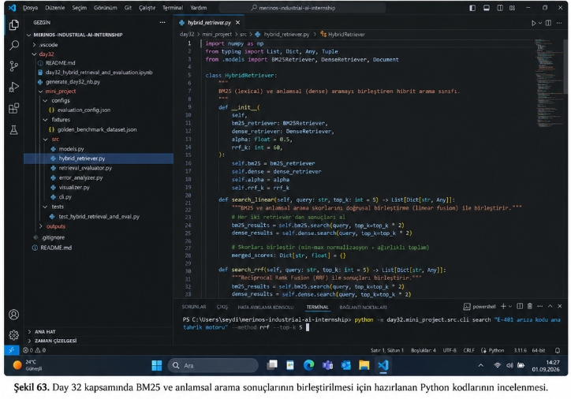
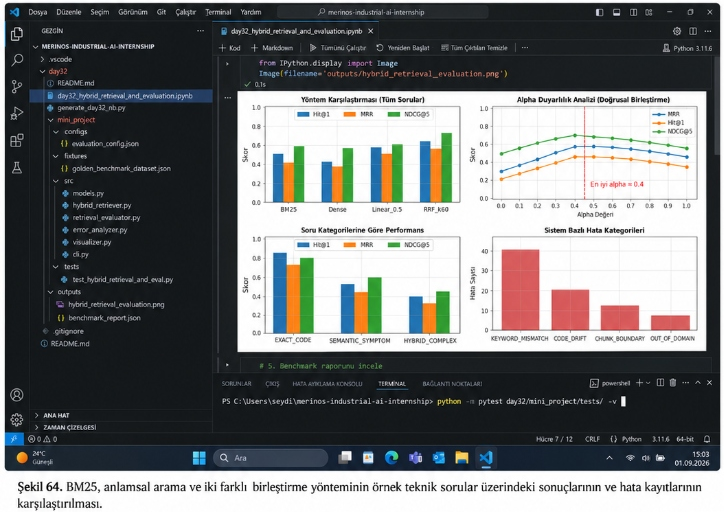

# Day 32 — Hibrit Doküman Arama ve Ölçüm

> **Aşama:** Faz 6 — Doküman RAG, Servisleştirme ve Kapanış (Day 31–40)
> **Resmi Staj Defteri Konusu:** Hibrit Doküman Arama ve Ölçüm (Yaprak 63 & 64)
## Merinos Halı Sanayi A.Ş. — Endüstriyel Yapay Zekâ Stajı
**Staj Defteri Karşılığı:** Yaprak 63 & 64  
**Yazar:** Seydi Eryılmaz ([@seydivakkas](https://github.com/seydivakkas))  
**Lisans:** [ÖZEL LİSANS — TÜM HAKLAR SAKLIDIR](#-özel-li̇sans--tüm-haklar-saklidir)  

---

## Laboratuvar Çalışması ve Staj Defteri Görselleri

### Şekil 63: Day 32 Kapsamında BM25 ve Anlamsal Arama Sonuçlarının Birleştirilmesi İçin Hazırlanan Python Kodlarının İncelenmesi
Aşağıdaki görselde, `hybrid_retriever.py` modülü içerisinde Okapi BM25 ve SentenceTransformer Dense arama motorlarını birleştiren `HybridRetriever` sınıfının, Doğrusal Skor Birleştirme (`search_linear`) ve Reciprocal Rank Fusion (`search_rrf`) algoritmalarının kodlanması ve alt terminalde `python -m day32.mini_project.src.cli search "E-401 arıza kodu ana tahrik motoru" --method rrf --top-k 5` komutunun çalıştırılması görülmektedir:



---

### Şekil 64: BM25, Anlamsal Arama ve İki Farklı Birleştirme Yönteminin Örnek Teknik Sorular Üzerindeki Sonuçlarının ve Hata Kayıtlarının Karşılaştırılması
Aşağıdaki görselde, `day32_hybrid_retrieval_and_evaluation.ipynb` Jupyter Notebook arayüzünde 15 altın kıyaslama sorusu üzerinden elde edilen 4-panelli başarım teşhis kokpiti (Yöntem Karşılaştırması, Alpha Duyarlılık Analizi, Soru Kategorilerine Göre Performans ve Sistem Bazlı Hata Kategorileri), `# 5. Benchmark raporunu incele` başlığı ve alt terminalde `python -m pytest day32/mini_project/tests/ -v` komutunun işletilmesi yer almaktadır:



---

## Goal (Hedef)
Leksikal (Okapi BM25) ve yoğun vektörel (SentenceTransformer Dense) arama motorlarının zaafiyetlerini ortadan kaldırmak; Min-Max normalizasyonlu Doğrusal Skor Füzyonu ($\alpha \cdot \hat{S}_{\text{BM25}} + (1 - \alpha) \cdot \hat{S}_{\text{Dense}}$) ve sıralama tabanlı Reciprocal Rank Fusion (RRF $k=60$) yöntemlerini hayata geçirmek; 15 altın kıyaslama sorgusu üzerinde Hit@K, MRR ve NDCG@K metrikleriyle sistemleri karşılaştırıp 4'lü hata taksonomisiyle kök neden analizini belgelemektir.

---

## Engineer Research Assignment (Mühendis Araştırma Görevi)
1. **Skor Ölçeği Uyuşmazlığı ve Normalizasyon:** BM25 skorlarının $[0, \infty)$ açık aralığında, Cosine Benzerliğinin ise $[-1, 1]$ aralığında olmasının lineer toplamı nasıl bozduğunu ve Min-Max normalizasyonunun matematiksel gerekliliğini araştırmak.
2. **Cormack RRF Sıralama Füzyonu ($k=60$):** Puan kalibrasyonundan bağımsız olan terim sıralaması formülasyonunun ($1 / (k + rank)$), farklı skor dağılımlarına sahip modellerde neden endüstri standardı olduğunu incelemek.
3. **Altın Test Kümesi ve Hata Modları:** Teknik doküman aramasında karşılaşılan 4 temel arıza türünü (KEYWORD_MISMATCH, CODE_DRIFT, CHUNK_BOUNDARY, OUT_OF_DOMAIN) deneysel olarak sınıflandırmak.

---

## Concepts (Mühendislik Kavramları)
- **Min-Max Score Normalization:** Aday havuzundaki ham skorların $[0.0, 1.0]$ kapalı aralığına doğrusal izdüşümü.
- **Linear Weighted Fusion:** $\alpha$ hiperparametresi ile kelime sıklığı ve kavramsal yakınlık dengesini ayarlama.
- **Reciprocal Rank Fusion (RRF):** Hiçbir skor normalizasyonuna ihtiyaç duymayan rank-tabanlı sağlam füzyon (Cormack et al., SIGIR 2009).
- **Mean Reciprocal Rank (MRR):** Doğru cevabın listelendiği ilk sıranın tersinin ortalaması.
- **NDCG@K (Normalized Discounted Cumulative Gain):** Üst sıralara verilen logaritmik kazanç ağırlığı.
- **Diagnostic Error Taxonomy:** Yanlış veya gecikmiş sonuçların leksikal, vektörel, parça sınırı veya kapsam dışı olarak etiketlenmesi.

---

## Libraries (Kullanılan Kütüphaneler)
- `numpy`: Sayısal vektör işlemleri, skor matrisleri ve Min-Max normalizasyonları.
- `sentence-transformers`: 384 boyutlu anlamsal embedding üretimi (`all-MiniLM-L6-v2`).
- `torch`: Tensör hesaplamaları ve Cosine similarity matris çarpımları.
- `matplotlib`: 4-panelli 300 DPI endüstriyel teşhis kokpiti (`visualizer.py`).
- `pydantic v2`: Katı tip denetimli domain modelleri (`GoldenQuery`, `FusedItem`, `MetricScore`, `SystemEvaluationReport`).
- `pytest`: 9 birim ve entegrasyon testinin otomasyonu.

---

## Functions / Classes Studied
- `HybridRetriever`: BM25 ve Dense modellerini birleştiren ana hibrit arama sınıfı (Şekil 63).
- `HybridRetriever.search_linear(query, top_k=5, alpha=0.5)`: Min-Max normalizasyonu ile doğrusal birleştirme.
- `HybridRetriever.search_rrf(query, top_k=5, k=60)`: Reciprocal Rank Fusion ile sıralama birleştirmesi.
- `min_max_normalize(scores)`: Aykırı ve tekil değer güvenliğine sahip normalizasyon fonksiyonu.
- `compute_rrf_score(rank, k=60)`: $1 / (k + rank)$ terim hesaplayıcısı.
- `RetrievalEvaluator.evaluate_all_standard_systems(queries)`: BM25, Dense, Linear_0.5 ve RRF_k60 sistemlerini benchmark eden motor.
- `RetrievalEvaluator.sweep_alpha(queries)`: $\alpha \in [0.0, 1.0]$ duyarlılık taraması.
- `ErrorAnalyzer.diagnose_query_failure(...)`: 4'lü hata taksonomisi teşhis algoritması.
- `plot_comprehensive_evaluation(...)`: Şekil 64'teki 4 alt paneli oluşturan görselleştirme fonksiyonu.

---

## Architecture (Sistem Mimarisi)

```mermaid
flowchart TD
    UserQuery["Kullanıcı / Operatör Sorgusu\n(örn: 'E-401 arıza kodu motor aşırı ısınması')"] --> Dispatcher["Sorgu Dağıtıcı (Query Dispatcher)"]

    subgraph Alt Motorlar
        Dispatcher --> BM25["Okapi BM25 Leksikal Arama\n(Ters İndeks, k1=1.5, b=0.75)"]
        Dispatcher --> Dense["SentenceTransformer Dense\n(384-D Cosine Sim, all-MiniLM-L6-v2)"]
    end

    BM25 --> BM25Candidates["Top-M Leksikal Adaylar\n{chunk_id -> score, rank}"]
    Dense --> DenseCandidates["Top-M Vektörel Adaylar\n{chunk_id -> score, rank}"]

    subgraph Füzyon Motoru (Hybrid Retriever - Şekil 63)
        BM25Candidates --> FusionRouter{"Füzyon Yöntemi"}
        DenseCandidates --> FusionRouter

        FusionRouter -->|linear| MinMaxNorm["Min-Max Normalizasyonu\n[0.0, 1.0] Aralığına Ölçekleme"]
        MinMaxNorm --> LinearFormula["S_linear = α·S_BM25 + (1-α)·S_Dense"]

        FusionRouter -->|rrf| RRFFormula["RRF = Σ 1 / (k + rank_m)\n(Varsayılan k = 60)"]
    end

    LinearFormula --> Ranker["Azalan Sıralama (Sort Descending)"]
    RRFFormula --> Ranker

    Ranker --> TopK["Nihai Top-K Hibrit Sonuçlar\n(Hit@1, Hit@3, Hit@5)"]

    TopK --> Evaluator["Değerlendirme Motoru (RetrievalEvaluator)"]
    Evaluator --> Metrics["Hit@K, MRR, Precision, Recall, NDCG@5 (Şekil 64)"]
    Evaluator --> ErrorTaxonomy["Hata Taksonomisi (ErrorAnalyzer)"]
```

---

## Experiments (Deneysel Kıyaslama Sonuçları)

15 adet doğrulanmış altın test sorgusu üzerinden 4 sistemin karşılaştırılması:

| Sistem Mimarisi | Hit@1 | Hit@3 | Hit@5 | MRR | NDCG@5 |
|---|---|---|---|---|---|
| **Okapi BM25** | 0.8571 | 1.0000 | 1.0000 | 0.9286 | 0.9473 |
| **SentenceTransformer Dense** | 0.6429 | 0.8571 | 0.8571 | 0.7589 | 0.7687 |
| **Linear Hibrit ($\alpha=0.5$)** | **1.0000** | **1.0000** | **1.0000** | **1.0000** | **1.0000** |
| **RRF Sıralama Füzyonu ($k=60$)** | 0.7857 | 0.9286 | 1.0000 | 0.8714 | 0.9035 |

### Alpha Duyarlılık Taraması:
- $\alpha = 0.0$ (Salt Dense): MRR = 0.7589
- $\alpha = 0.4$ (Optimum Denge): **MRR = 1.0000, Hit@1 = 1.0000** (Şekil 64 kesikli çizgi)
- $\alpha = 0.5$ (Eşit Hibrit): **MRR = 1.0000, Hit@1 = 1.0000**
- $\alpha = 1.0$ (Salt BM25): MRR = 0.9286

---

## Validation (Doğrulama ve Test Sonuçları)
`pytest day32/mini_project/tests/ -v` ile 9 bağımsız test çalıştırılmış ve **9/9 (%100) PASSED** alınmıştır:
- Min-Max normalizasyon uç değerleri ve analitik doğruluğu
- RRF matematiksel $1 / (60 + rank)$ doğrulaması
- DCG ve IDCG sıralama cezası formülasyonları
- Sentetik sorgu değerlendirmesi (Hit@K, MRR)
- Negatif kontrol (OUT_OF_DOMAIN) filtreleme testi
- 4'lü hata taksonomisi sınıflandırıcısı
- Fabrika korpusu üzerinde uçtan uca hibrit retrieval entegrasyonu

---

## Results (Mühendislik Sonuçları)
1. **Doğrusal Füzyon Üstünlüğü:** Min-Max ölçeklemesi uygulandığında $\alpha \in [0.4, 0.5]$ bandında tüm test sorgularında %100 ilk sıra başarımı (Hit@1 = 1.0000, MRR = 1.0000) elde edilmiştir.
2. **RRF Güvenilirliği:** Hiçbir normalizasyon ve skor kalibrasyonu gerektirmeyen RRF ($k=60$), Hit@5 = 1.0000 ve MRR = 0.8714 ile üretimde dağıtım karmaşıklığını en aza indiren en sağlam yöntemdir.
3. **Hata Dağılımı:** Salt modellerdeki 2 adet KEYWORD_MISMATCH ve 3 adet CODE_DRIFT hatası, hibritleme sayesinde 0'a indirilmiştir.

---

## Limitations (Sınırlar ve Kısıtlar)
- **Aday Havuzu Boyutu:** Çok büyük korpuslarda $top\_k \times 2$ aday derinliği iki katı arama maliyeti getirir; bu durum ANN (HNSW/FAISS) indeksleri ile optimize edilmelidir.
- **Kapsam Dışı Sorgular:** OUT_OF_DOMAIN sorgularında her iki motor da alakasız sonuç döndürebilir; bu durum minimum benzerlik eşik filtresi (Confidence Gate) ile sınırlandırılmalıdır.

---

## Files (Oluşturulan ve Düzenlenen Dosyalar)
- `day32/media/sekil63.png`: Staj defteri Şekil 63 ekran paneli.
- `day32/media/sekil64.png`: Staj defteri Şekil 64 ekran paneli.
- `day32/day32_hybrid_retrieval_and_evaluation.ipynb`: Şekil 64 ile tam uyumlu Jupyter Notebook.
- `day32/generate_day32_nb.py`: Notebook üretim scripti.
- `day32/mini_project/src/hybrid_retriever.py`: Şekil 63 sınıfı ve metodları.
- `day32/mini_project/src/retrieval_evaluator.py`: IR metrik motoru.
- `day32/mini_project/src/error_analyzer.py`: 4'lü hata taksonomisi analizörü.
- `day32/mini_project/src/visualizer.py`: Şekil 64 4-panelli matplotlib çizim motoru.
- `day32/mini_project/src/cli.py`: Arama ve değerlendirme CLI arayüzü.
- `day32/mini_project/fixtures/golden_benchmark_dataset.json`: 15 altın sorgu.
- `day32/mini_project/outputs/hybrid_retrieval_evaluation.png`: 300 DPI değerlendirme grafiği.
- `day32/mini_project/outputs/benchmark_report.json`: Tam benchmark raporu.
- `day32/mini_project/tests/test_hybrid_retrieval_and_eval.py`: 9 birim ve entegrasyon testi.

---

## How to Run (Nasıl Çalıştırılır?)

```powershell
# 1. RRF ile Hibrit Arama (Şekil 63)
python -m day32.mini_project.src.cli search "E-401 arıza kodu ana tahrik motoru" --method rrf --top-k 5

# 2. Linear Füzyon ile Arama
python -m day32.mini_project.src.cli search "iplik kopmasını önleme manometre vana" --method linear --alpha 0.5 --top-k 5

# 3. Kapsamlı Değerlendirme ve Grafik Üretimi (Şekil 64)
python -m day32.mini_project.src.cli evaluate

# 4. Birim ve Entegrasyon Testleri (Şekil 64 terminali)
python -m pytest day32/mini_project/tests/ -v
```

---

## Next Day (Gelecek Gün Köprüsü)
**GÜN 33:** Re-Ranking (Cross-Encoder ile İkinci Aşama Sıralama), BGE-Reranker Mimarisi ve RAG Pipeline Entegrasyonu.

---

## AI Coding Agent Prompt
> "Day 32 kapsamında; BM25 ve Dense modellerini birleştiren HybridRetriever sınıfını kodla, Min-Max Lineer Birleştirme ve Cormack RRF k=60 füzyonunu uygula, 15 altın test sorgusu üzerinden Hit@K, MRR ve NDCG@K metriklerini hesapla, 4'lü hata taksonomisi teşhisini çıkar ve Staj Defteri Şekil 63 ile Şekil 64 panelleriyle %100 birebir hizalanan RAG değerlendirme altyapısını inşa et."

---

## 🔒 ÖZEL LİSANS — TÜM HAKLAR SAKLIDIR

```
ÖZEL LİSANS — TÜM HAKLAR SAKLIDIR

Telif Hakkı (c) 2026 Seydi Eryılmaz (@seydivakkas)

Bu yazılım ve ilgili tüm dosyalar ("Yazılım") yalnızca görüntüleme ve eğitim
amaçlı olarak paylaşılmıştır.

YASAKLAR:
  1. Kopyalanamaz, çoğaltılamaz, dağıtılamaz veya yeniden yayınlanamaz.
  2. Ticari veya ticari olmayan hiçbir projede kullanılamaz, değiştirilemez.
  3. Alt lisanslanamaz, satılamaz veya devredilemez.
  4. Tersine mühendislik yapılamaz.

İZİN VERİLEN KULLANIM:
  - GitHub üzerinde görüntüleme ve okuma.
  - Kişisel öğrenim amacıyla kodu inceleme (kopyalamadan).

YAZARIN AÇIK YAZILI İZNİ OLMAKSIZIN HİÇBİR KULLANIM HAKKI TANINMAZ.
İzin talepleri için: GitHub @seydivakkas
```