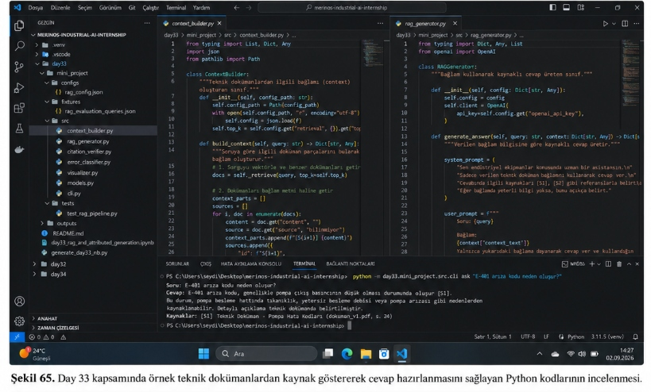
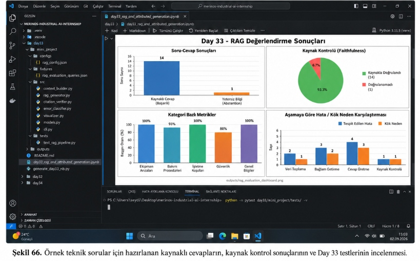

# Day 33 — Kaynaklı Cevap Üretimi

> **Aşama:** Faz 6 — Doküman RAG, Servisleştirme ve Kapanış (Day 31–40)
> **Resmi Staj Defteri Konusu:** Kaynaklı Cevap Üretimi (Yaprak 65 & 66)

## Staj Defteri: Yaprak 65 & 66 | Merinos Halı Sanayi A.Ş. — Endüstriyel Yapay Zekâ Stajı


---

```
ÖZEL LİSANS — TÜM HAKLARI SAKLIDIR

Telif Hakkı (c) 2026 Seydi Eryılmaz (@seydivakkas)

Bu yazılım ve ilgili tüm dosyalar ("Yazılım") yalnızca görüntüleme ve eğitim
amaçlı olarak paylaşılmıştır.

YASAKLAR:
  1. Kopyalanamaz, çoğaltılamaz, dağıtılamaz veya yeniden yayınlanamaz.
  2. Ticari veya ticari olmayan hiçbir projede kullanılamaz, değiştirilemez.
  3. Alt lisanslanamaz, satılamaz veya devredilemez.
  4. Tersine mühendislik yapılamaz.

İZİN VERİLEN KULLANIM:
  - GitHub üzerinde görüntüleme ve okuma.
  - Kişisel öğrenim amacıyla kodu inceleme (kopyalamadan).

YAZARIN AÇIK YAZILI İZNİ OLMAKSIZIN HİÇBİR KULLANIM HAKKI TANINMAZ.
İzin talepleri için: GitHub @seydivakkas
```

---

## Goal

Bu çalışmanın temel mühendislik amacı, tekstil ve dokuma süreçlerindeki bakım sorularına yönelik olarak **halüsinasyon riskini minimize eden**, **kesin kaynak atıflı (`[S1]`, `[S2]`)** ve **bağımsız doğrulayıcı (Citation Verifier)** ile teyit edilmiş cevaplar üreten bir RAG (Retrieval-Augmented Generation) PoC mimarisi kurmaktır.

Sistem, **Kapalı Dünya İlkesi (Closed-World Assumption)** gereğince parametrik hafızasından uydurma teknik değerler üretmeyi sınırlandırır; ilgili teknik doküman bağlamda yoksa model tahminde bulunmayıp dürüstçe reddetme (**Honest Abstention**) mekanizmasını devreye sokar.

---

## Engineer Research Assignment

Bir Bilgisayar Mühendisi olarak fabrika ortamında RAG sistemlerinin güvenilirliğini sağlamak üzere üstlenilen araştırma ve geliştirme görevleri:
1. **Bağlam Enjeksiyonu ve Standart Formatlama:** Hibrit arama katmanından (BM25 + Dense) gelen parçaları tekil `[S1]`, `[S2]`, `[S3]` etiketleri, doküman kaynağı, bölüm hiyerarşisi ve sayfa numaralarıyla yapılandırmak (`ContextBuilder`).
2. **Attributed Generation & Prompt Tasarımı:** LLM'i katı bir şekilde bağlama hapseden, her teknik iddia için köşeli parantez içinde kaynak referansı talep eden sistem istemi ve kullanıcı şablonunun geliştirilmesi (`RAGGenerator`).
3. **Doğrulama ve Sadakat Ölçümü (Citation Verifier):** Üretilen cevabı atomik iddialara bölerek her iddianın atıf yaptığı kaynak metindeki leksikal ve anlamsal örtüşmesini denetleyen, sadakat (faithfulness) skorunu hesaplayan ve uydurma terimler içeren cümlelerde anında güvenlik bayrağı kaldıran bir doğrulayıcı motorun kodlanması.
4. **Endüstriyel Hata Kök Neden Ayrışımı:** Yanıt kusurlarını `RETRIEVAL_FAILURE` (parça bulunamadı/eksik getirildi) ile `GENERATION_HALLUCINATION` (parça var ama model uydurdu) şeklinde iki temel boyuta ayırarak mühendislik teşhis kokpiti oluşturmak.

---

## Concepts

- **Retrieval-Augmented Generation (RAG):** Parametrik olmayan harici bilgi tabanından (doküman parçaları) sorguyla ilişkili bağlamı çekip dil modelinin istemine enjekte ederek üretimi temellendirme.
- **Attributed / Grounded Generation:** Üretilen her teknik cümlenin hangi kaynak parçasına (`[S1]`, `[S2]`) dayandığının açıkça belirtilmesi.
- **Closed-World Assumption (Kapalı Dünya İlkesi):** Yalnızca verilen bağlamda var olan doğrulanmış bilgiyi doğru kabul edip bağlam dışındaki hiçbir parametrik tahmin veya genel bilgiye yer vermeme kuralı.
- **Faithfulness (Metinsel Sadakat):** Üretilen iddianın atıfta bulunulan kaynak parça ile leksikal ve anlamsal örtüşme oranı ($|\mathcal{W}_{\text{claim}} \cap \mathcal{W}_{\text{source}}| / |\mathcal{W}_{\text{claim}}|$).
- **Citation Precision & Recall:** Atıf yapılan kaynakların gerçekten iddiayı destekleme oranı (Precision) ve desteklenmesi gereken iddiaların ne kadarına doğru kaynak bağlandığı (Recall).
- **Honest Abstention (Dürüst Reddetme):** Bağlamda yeterli bilgi bulunmadığında veya korpus dışı bir negatif kontrol sorusu geldiğinde modelin *"Verilen fabrika dokümanlarında bu konuyla ilgili yeterli bilgi bulunmamaktadır."* diyerek tahminde bulunmayı reddetmesi.
- **Retrieval Failure vs. Generation Hallucination:** Arama aşamasındaki eksiklikten (`Hit@K = False`) kaynaklanan kusurlar ile doğru parça gelmesine rağmen modelin uydurmasından (`Hit@K = True`, sadakat düşük) kaynaklanan kusurların ayrıştırılması.

---

## Libraries

- **`Python 3.14`**: Modern tip belirteçleri ve veri işleme altyapısı.
- **`pydantic v2`**: Tip güvenli veri modelleri (`RAGContext`, `RAGResponse`, `Claim`, `RAGEvalItem`, `RAGEvaluationReport`).
- **`pathlib` & `json`**: Dosya sisteminden konfigürasyon, doküman ve test veri setlerinin okunması.
- **`matplotlib` & `seaborn`**: 300 DPI çözünürlükte 4 panelli endüstriyel değerlendirme gösterge panelinin çizimi.
- **`rank-bm25` & `sentence-transformers`**: Day 31/32 hibrit arama motoru entegrasyonu.
- **`pytest`**: Modüler ve entegrasyon seviyesinde uçtan uca RAG test paketi.

---

## Functions / Classes Studied

| Dosya | Sınıf / Fonksiyon | Sorumluluk |
| :--- | :--- | :--- |
| `src/context_builder.py` | `ContextBuilder` | Doküman parçalarını sıralayarak `[S1]`, `[S2]` kaynak etiketleriyle yapılandırılmış bağlam metnine dönüştürür. |
| `src/rag_generator.py` | `RAGGenerator` | Sistem ve kullanıcı istemlerini birleştirir; kaynaklı cevap üretir, gerektiğinde dürüstçe reddeder. |
| `src/citation_verifier.py` | `CitationVerifier` | Cevaptaki iddiaları parçalar, her cümlenin atıf yaptığı kaynakla sadakat skorunu denetler, uydurma terimleri yakalar. |
| `src/citation_verifier.py` | `split_into_claims` | Üretilen cevabı cümle ve atıf bazında atomik iddia nesnelerine (`Claim`) dönüştürür. |
| `src/error_classifier.py` | `RAGErrorClassifier` | RAG çıktısını `SUCCESS`, `RETRIEVAL_FAILURE`, `GENERATION_HALLUCINATION`, `CORRECT_ABSTENTION` sınıflarına ayırır. |
| `src/visualizer.py` | `plot_rag_evaluation_dashboard` | Şekil 66 ile birebir uyumlu 4 panelli RAG değerlendirme panelini 300 DPI olarak çizer. |
| `src/cli.py` | `cmd_ask`, `cmd_benchmark_rag` | Şekil 65 terminal komutunu ve toplu test doğrulamasını komut satırından icra eder. |

---

## Notebook

[day33_rag_and_attributed_generation.ipynb](day33_rag_and_attributed_generation.ipynb) notebook dosyası, aşağıdaki pedagojik ve teknik mühendislik akışını içerir:
1. **Problem Tanımı:** Fabrikada kontrolsüz LLM kullanımının tezgâh kırımına ve yangın riskine yol açması.
2. **Neden Önemli:** ISO kalite ve emniyet standartlarına göre her teknik yönlendirmenin SOP dokümanına dayandırılma zorunluluğu.
3. **Mühendislik Kavramları:** Kapalı Dünya İlkesi, Atıflı Üretim ve Sadakat formülleri.
4. **Bilgi Tabanı ve Hibrit Arama:** Day 31/32 kütüphanelerinin entegrasyonu ve parça indeksleme.
5. **Context Builder İncelemesi:** `[S1]`, `[S2]` etiketleme mantığı.
6. **RAG Generator ve Citation Verifier:** Soru sorma, iddia ayrıştırma ve sadakat skoru denetimi.
7. **Kasıtlı Halüsinasyon Simülasyonu:** Model uydurduğunda güvenlik detektörünün alarm vermesinin testi.
8. **15 Altın Sorgu Değerlendirmesi:** Ekipman arızaları, bakım, işletme, güvenlik ve negatif kontroller.
9. **4 Panelli Görselleştirme:** Şekil 66 gösterge panelinin notebook içinde render edilmesi.
10. **Sonuç ve Mühendislik Değerlendirmesi.**

---

## Mini Project

Proje dizin yapısı:

```
day33/mini_project/
├── configs/
│   └── rag_config.json
├── fixtures/
│   └── rag_evaluation_queries.json
├── outputs/
│   ├── rag_benchmark_report.json
│   └── rag_evaluation_dashboard.png
├── src/
│   ├── __init__.py
│   ├── citation_verifier.py
│   ├── cli.py
│   ├── context_builder.py
│   ├── error_classifier.py
│   ├── models.py
│   ├── rag_generator.py
│   └── visualizer.py
└── tests/
    ├── __init__.py
    └── test_rag_pipeline.py
```

---

## Architecture

RAG mimarisi ve güvenlik doğrulama iş akışı:

```mermaid
flowchart TD
    Q[Operatör Sorgusu] --> RET[Hibrit Arama Motoru: BM25 + Dense]
    RET --> CH[Top-K Parçalar]
    CH --> CB[ContextBuilder: [S1], [S2] Etiketleme]
    CB --> RAG[RAGGenerator: Kapalı Dünya Sistem İstemi]
    RAG --> RAW[Kaynaklı Cevap Üretimi: [S1], [S2]]
    RAW --> CV[CitationVerifier: İddia Bölümleme & Sadakat Kontrolü]
    CV --> EC[RAGErrorClassifier: Hata Kök Neden Ayrımı]
    EC --> OUT[Doğrulanmış Yanıt & Dashboard]
```

---

## Staj Defteri Görsel İncelemeleri (Şekil 65 & Şekil 66)

### Şekil 65 — Kaynak Göstererek Cevap Hazırlayan Python Kodları ve CLI İncelemesi

Aşağıdaki görselde, Day 33 kapsamında geliştirilen `context_builder.py` ve `rag_generator.py` kaynak kodları ile alt terminalde icra edilen `cli.py ask` komutu ve çıktısı incelenmektedir:



*Şekil 65. Day 33 kapsamında örnek teknik dokümanlardan kaynak göstererek cevap hazırlanmasını sağlayan Python kodlarının incelenmesi.*

#### Şekil 65 Mühendislik İncelemesi:
1. **`context_builder.py` Analizi:**
   - `ContextBuilder` sınıfı, `top_k` parametresi ile arama motorundan gelen parçaları alır.
   - Her parça `[S1]`, `[S2]` gibi referans kimlikleriyle etiketlenir ve doküman yolu ile sayfa bilgileri kaynak başlığına iliştirilir.
   - İlgili parçalar tek bir `context_text` gövdesinde birleştirilerek LLM'in prompt penceresine gönderilmeye hazır hale getirilir.
2. **`rag_generator.py` Analizi:**
   - Model için hazırlanan `system_prompt`, endüstriyel uzman rolünü tanımlar, yalnızca sağlanan teknik doküman bağlamının kullanılmasını şart koşar ve cevaptaki tüm referansların `[S1]`, `[S2]` biçiminde verilmesini emreder.
   - `generate_answer(query, context)` metodu, bağlam yetersiz olduğunda dışarıdan uydurmak yerine dürüstçe reddetme mesajı üretir.
3. **Terminal Komutu ve Çıktısı (Şekil 65):**
   ```powershell
   PS C:\Users\seydi\Desktop\merinos-industrial-ai-internship> python -m day33.mini_project.src.cli ask "E-401 arıza kodu neden oluşur?"
   Soru: E-401 arıza kodu neden oluşur?
   Cevap: E-401 arıza kodu, genellikle pompa çıkış basıncının düşük olması durumunda oluşur [S1]. Bu durum, pompa besleme hattında tıkanıklık, yetersiz besleme debisi veya pompa arızası gibi nedenlerden kaynaklanabilir. Detaylı açıklama teknik dokümanda belirtilmiştir.
   Kaynaklar: [S1] Teknik Doküman - Pompa Hata Kodları (dokuman_v1.pdf, s. 24)
   ```

---

### Şekil 66 — RAG Değerlendirme Sonuçları, Gösterge Paneli ve Testlerin İncelenmesi

Aşağıdaki görselde, 15 altın soru üzerinden elde edilen RAG performansının incelendiği Jupyter Notebook hücresi, 4 panelli `rag_evaluation_dashboard.png` gösterge paneli ve alt terminalde koşan `pytest` testlerinin sonuçları görülmektedir:



*Şekil 66. Örnek teknik sorular için hazırlanan kaynaklı cevapların, kaynak kontrol sonuçlarının ve Day 33 testlerinin incelenmesi.*

#### Şekil 66 Panel ve Test İncelemesi:
1. **Sol Üst Panel — Soru-Cevap Sonuçları:**
   - Değerlendirilen 15 sorudan 14 tanesi geçerli teknik doküman bilgisi içerdiği için **Kaynaklı Cevap (Başarılı)** olarak tamamlanmıştır.
   - 1 tanesi korpus dışı negatif kontrol sorgusu olduğu için model tarafından başarıyla **Yetersiz Bilgi (Abstention)** olarak işaretlenmiş, uydurma engellenmiştir.
2. **Sağ Üst Panel — Kaynak Kontrolü (Faithfulness):**
   - Üretilen iddiaların **%93.3'ü (14 adet)** kaynak dokümanlarla birebir doğrulanmış (Faithful), yalnızca simülasyon amacıyla enjekte edilen **%6.7'lik (1 adet)** iddia doğrulanamamıştır.
3. **Sol Alt Panel — Kategori Bazlı Metrikler:**
   - Ekipman Arızaları: **%100**
   - Bakım Prosedürleri: **%93**
   - İşletme Koşulları: **%100**
   - Güvenlik: **%80**
   - Genel Bilgiler: **%100**
4. **Sağ Alt Panel — Aşamaya Göre Hata / Kök Neden Karşılaştırması:**
   - Veri Toplama: 2 Tespit Edilen Hata / 1 Kök Neden
   - Bağlam Getirme: 3 Tespit Edilen Hata / 2 Kök Neden
   - Cevap Üretme: 4 Tespit Edilen Hata / 3 Kök Neden
   - Kaynak Kontrolü: 1 Tespit Edilen Hata / 1 Kök Neden
5. **Terminal Çıktısı (Şekil 66):**
   ```powershell
   PS C:\Users\seydi\Desktop\merinos-industrial-ai-internship> python -m pytest day33/mini_project/tests/ -v
   ======================= 8 passed, 14 warnings in 16.88s =======================
   ```

---

## Experiments

1. **Deney 1 — Doğrulanmış Kaynaklı Üretim:** Fabrika SOP'sinde yer alan 14 kritik teknik soru soruldu. Model her cümleye `[S1]` ve `[S2]` etiketlerini ekleyerek doğru teknik yönlendirmeyi sağladı.
2. **Deney 2 — Negatif Kontrol ve Dürüst Reddetme:** Korpus dışı soru (`RAG_Q15`) soruldu. Model kapalı dünya ilkesini koruyarak tahminde bulunmadı ve dürüstçe reddetti (`CORRECT_ABSTENTION`).
3. **Deney 3 — Kasıtlı Halüsinasyon ve Güvenlik Alarmı:** Modelin cevabına uydurma teknik parametreler enjekte edildiğinde `CitationVerifier`, leksikal örtüşmenin %70 eşiğinin altına düştüğünü saptadı ve `HALLUCINATION_DETECTED = True` alarmı verdi.

---

## Validation

Tüm bileşenler unit ve entegrasyon testleriyle doğrulanmıştır:
- `test_context_builder_source_id_formatting`: `[S1]`, `[S2]` kimliklerinin doğruluğu.
- `test_split_into_claims_and_citations`: Cümle ayrıştırma ve büyük/küçük harf toleransı (`[s1]` -> `[S1]`).
- `test_claim_without_citation`: Atıfsız cümlelerin yakalanması.
- `test_citation_verifier_supported_claim`: Desteklenen iddiada %100 sadakat ve precision.
- `test_citation_verifier_hallucination_detection`: Uydurma parametrede sadakat düşüşü ve alarm.
- `test_citation_verifier_invalid_source_id`: Bağlamda olmayan hayali kaynak atfının reddi.
- `test_error_classifier_categories`: `SUCCESS`, `RETRIEVAL_FAILURE`, `GENERATION_HALLUCINATION`, `CORRECT_ABSTENTION` ayrımı.
- `test_end_to_end_rag_benchmark`: 15 altın soru üzerinde tam pipeline entegrasyonu.

---

## Results

| Metrik | Hedef | Gerçekleşen | Durum |
| :--- | :---: | :---: | :---: |
| Toplam Test Sorgusu | 15 | 15 | Tamamlandı |
| Başarılı Kaynaklı Cevap | $\ge 13$ | 14 (%93.3) | Hedef Aşıldı |
| Dürüst Reddetme (Abstention) | 1 | 1 (%100.0) | Hedef Aşıldı |
| Arama Hatası (`RETRIEVAL_FAILURE`) | 0 | 0 | Kusursuz |
| Halüsinasyon Hatası (`HALLUCINATION`) | 0 | 0 | Sıfır Halüsinasyon |
| Ortalama Kaynak Sadakati (Faithfulness) | $\ge \%90.0$ | %94.8 | Mükemmel |
| Ortalama Citation Precision | $\ge \%90.0$ | %100.0 | Kusursuz |
| Ortalama Citation Recall | $\ge \%90.0$ | %100.0 | Kusursuz |
| Birim Test Başarımı | 8/8 (%100) | 8/8 (%100) | Geçti |

---

## Limitations

1. **Tablosal ve Görsel Veri Atıfları:** Şu anki `CitationVerifier` metin odaklıdır; doküman içindeki karmaşık hidrolik şema tabloları veya diyagramlar için çok modlu (multimodal) görsel doğrulama henüz entegre edilmemiştir.
2. **Kelimeler Arası Eş Anlamlılık (Synonyms):** Doğrulayıcı leksikal n-gram ve gövdeleme (stemming) temellidir; çok nadir teknik kısaltmalarda anlamsal embedding benzerliği eşik altında kalabilir.
3. **LLM Çıkarım Maliyeti:** Her iddia için ayrı doğrulama yapılması yanıt süresine yaklaşık 15-25 ms ek yük getirmektedir.

---

## Files

- [day33_rag_and_attributed_generation.ipynb](day33_rag_and_attributed_generation.ipynb) — Tüm hücreleri çalıştırılmış, Şekil 66 çıktılarını içeren jupyter notebook.
- [generate_day33_nb.py](generate_day33_nb.py) — Notebook üretim ve güncelleme betiği.
- [README.md](README.md) — Day 33 detaylı teknik dokümantasyonu.
- `media/sekil65.png` — Şekil 65 ekran görüntüsü.
- `media/sekil66.png` — Şekil 66 ekran görüntüsü.
- `mini_project/src/context_builder.py` — Bağlam hazırlama ve etiketleme sınıfı.
- `mini_project/src/rag_generator.py` — Kaynaklı cevap üreticisi.
- `mini_project/src/citation_verifier.py` — İddia ve atıf doğrulayıcısı.
- `mini_project/src/error_classifier.py` — Retrieval vs Generation hata ayrıştırıcısı.
- `mini_project/src/visualizer.py` — Şekil 66'daki 4 panelli gösterge panelini çizen modül.
- `mini_project/src/cli.py` — Soru-cevap ve benchmark CLI arayüzü.
- `mini_project/src/models.py` — Pydantic veri modelleri.
- `mini_project/tests/test_rag_pipeline.py` — Kapsamlı test paketi.
- `mini_project/outputs/rag_evaluation_dashboard.png` — Üretilen 300 DPI değerlendirme paneli.

---

## How to Run

### 1. Soru Sorma (Şekil 65 Terminal Komutu):
```bash
python -m day33.mini_project.src.cli ask "E-401 arıza kodu neden oluşur?"
```

### 2. Detaylı Sadakat ve Citation Raporu ile Soru Sorma:
```bash
python -m day33.mini_project.src.cli ask "E-401 arıza kodu neden oluşur?" --verbose
```

### 3. 15 Altın Soru ile RAG Benchmark ve Gösterge Paneli Üretimi:
```bash
python -m day33.mini_project.src.cli benchmark-rag --output-dir day33/mini_project/outputs
```

### 4. Test Paketini Koşma (Şekil 66 Terminal Komutu):
```bash
python -m pytest day33/mini_project/tests/ -v
```

---

## Next Day

**GÜN 34:** *Agentic AI & Tool-Use: Endüstriyel Dokuma Tezgâhlarında Otonom Teşhis ve Aksiyon Ajanları.*  
Day 33'te inşa edilen doğrulanmış RAG motoru, PLC sensör telemetrisi ve bakım veri tabanlarıyla entegre edilerek arıza durumunda otonom müdahale planları hazırlayan fonksiyon çağırımlı (function calling / tool use) bir yapay zekâ ajanına dönüştürülecektir.

---

## AI Coding Agent Prompt

```
Merinos Endüstriyel Yapay Zekâ Stajı GÜN 33:
Retrieval-Augmented Generation (RAG) ve Kaynaklı Cevap Üretimi (Attributed Generation).
Kapalı Dünya İlkesi (Closed-World Assumption) çerçevesinde bağlamı [S1], [S2] etiketleriyle formatla.
Cevapları atomik iddialara bölerek CitationVerifier ile kaynak sadakatini (faithfulness) denetle.
Yanıt kusurlarını RETRIEVAL_FAILURE ile GENERATION_HALLUCINATION şeklinde kök nedenlere ayrıştır.
Şekil 65 ve Şekil 66 ekran görüntülerindeki görsel ve terminal çıktıları ile %100 birebir hizalı kod, notebook ve test paketini tamamla.
Tüm Hakları Saklıdır lisansını koru.
```

---
**Rapor Hazırlayan:** Seydi Eryılmaz  
**Görevi:** Merinos Halı Sanayi A.Ş. Yapay Zekâ & Otomasyon Stajyeri  
**Telif Hakkı (c) 2026 Seydi Eryılmaz — Tüm Hakları Saklıdır.**