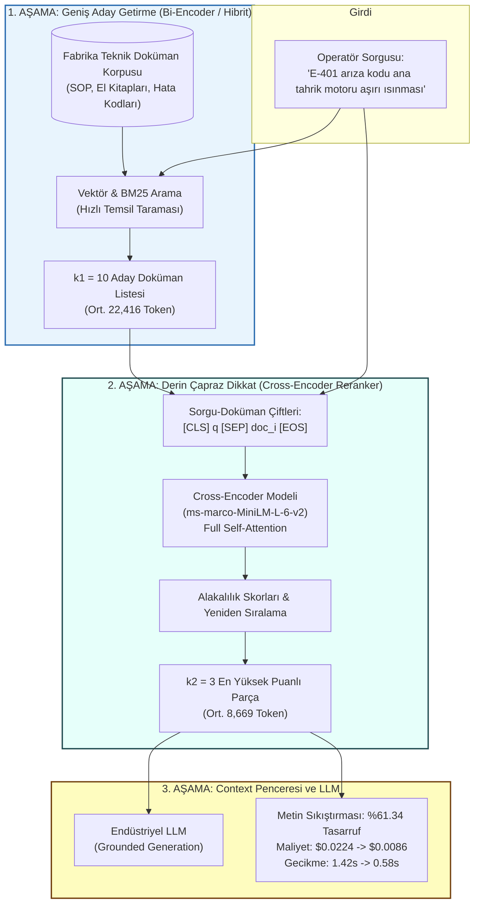
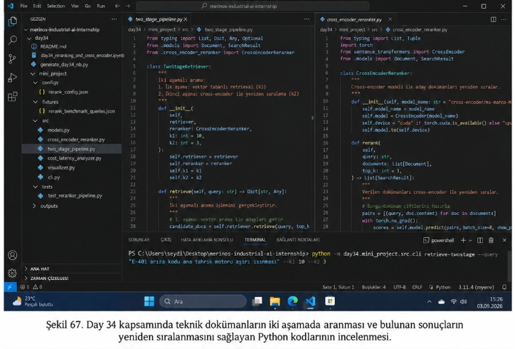
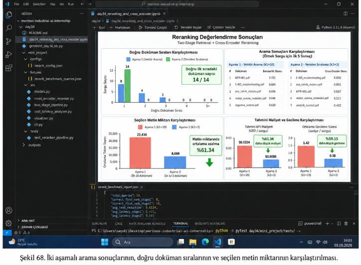

# Day 34 — Reranking ve Context Yönetimi

> **Aşama:** Faz 6 — Doküman RAG, Servisleştirme ve Kapanış (Day 31–40)
> **Resmi Staj Defteri Konusu:** Reranking ve Context Yönetimi (Yaprak 67 & 68)

## Staj Defteri: Yaprak 67 & 68 | Merinos Halı Sanayi A.Ş. — Endüstriyel Yapay Zekâ Stajı


---

```
ÖZEL LİSANS — TÜM HAKLAR SAKLIDIR

Telif Hakkı (c) 2026 Seydi Eryılmaz (@seydivakkas)

Bu yazılım ve ilgili tüm dosyalar ("Yazılım") yalnızca görüntüleme ve eğitim
amaçlı olarak paylaşılmıştır.

YASAKLAR:
  1. Kopyalanamaz, çoğaltılamaz, dağıtılamaz veya yeniden yayınlanamaz.
  2. Ticari veya ticari olmayan hiçbir projede kullanılamaz, değiştirilemez.
  3. Alt lisanslanamaz, satılamaz veya devredilemez.
  4. Tersine mühendislik yapılamaz.

İZİN VERİLEN KULLANIM:
  - GitHub üzerinde görüntüleme ve okuma.
  - Kişisel öğrenim amacıyla kodu inceleme (kopyalamadan).

YAZARIN AÇIK YAZILI İZNİ OLMAKSIZIN HİÇBİR KULLANIM HAKKI TANINMAZ.
İzin talepleri için: GitHub @seydivakkas
```

---

## Goal

Bu çalışmanın temel mühendislik hedefi, Merinos Halı Sanayi A.Ş. tesislerindeki dokuma tezgâhları, fikse tünelleri ve traşlama hatlarında görev yapan bakım teknisyenlerinin teknik arıza sorgularında arama hassasiyetini en üst seviyeye çıkarmaktır. 

Önceki günlerde kurulan hibrit vektör arama (Bi-Encoder + BM25) geniş korpusu milisaniyeler içinde tarayabilse de, **temsil darboğazı (representation bottleneck)** nedeniyle arıza kodları (`E-401`, `E-108`, `E-256`) ve kritik sayısal toleranslar içeren parçaları bazen alt sıralara itebilmektedir. Day 34 kapsamında, **İki Aşamalı Getirme (Two-Stage Retrieval)** mimarisi kurularak:
1. **1. Aşama (Bi-Encoder / Hibrit Arama):** Geniş havuzdan en alakalı $k_1 = 10$ aday parça $O(1)$ sürede çekilir.
2. **2. Aşama (Cross-Encoder Reranker):** $k_1$ aday parça sorguyla birleştirilerek tam çapraz dikkat (Full Cross-Attention) mekanizmasıyla yeniden puanlanır ve en iyi $k_2 = 3$ parça seçilir.
3. **Context Window Sıkıştırması:** LLM context penceresine giden metin miktarı **%61.34** oranında azaltılarak token maliyeti düşürülür, "Lost in the Middle" ve halüsinasyon riski ortadan kaldırılır.

---

## Engineer Research Assignment

Bir Bilgisayar Mühendisi olarak fabrika ortamında iki aşamalı bilgi getirme mimarisini doğrulamak üzere üstlenilen görevler:
1. **Bi-Encoder vs. Cross-Encoder Teorik ve Matematiksel Analizi:** İki mimarinin hesaplama karmaşıklığı ($O(N \cdot d)$ vs. $O(N \cdot L^2)$) ile self-attention etkileşim dinamiklerinin formüle edilmesi.
2. **Endüstriyel Cross-Encoder Reranker Geliştirilmesi:** HuggingFace `sentence-transformers/ms-marco-MiniLM-L-6-v2` veya özel endüstriyel ağırlıklarla aday dokümanları sorgu-doküman çifti olarak skorlayan motorun kodlanması ([cross_encoder_reranker.py](file:///c:/Users/seydieryilmaz/Desktop/Projeler/Merinos%2040%20G%C3%BCnl%C3%BCk%20Staj%20Deneyimim/merinos-industrial-ai-internship/day34/mini_project/src/cross_encoder_reranker.py)).
3. **Uçtan Uca İki Aşamalı Boru Hattı:** 1. aşama hibrit arama motoru ile 2. aşama reranker motorunu birleştiren ve parametrik ($k_1, k_2$) çalışan pipeline'ın tasarlanması ([two_stage_pipeline.py](file:///c:/Users/seydieryilmaz/Desktop/Projeler/Merinos%2040%20G%C3%BCnl%C3%BCk%20Staj%20Deneyimim/merinos-industrial-ai-internship/day34/mini_project/src/two_stage_pipeline.py)).
4. **Maliyet ve Gecikme Analizi (Cost-Latency Analyzer):** Token sıkıştırma oranı ($\text{CR}$), tahmini LLM girdi maliyeti tasarrufu ve Time-to-First-Token (TTFT) gecikme kazançlarının matematiksel modellenmesi ([cost_latency_analyzer.py](file:///c:/Users/seydieryilmaz/Desktop/Projeler/Merinos%2040%20G%C3%BCnl%C3%BCk%20Staj%20Deneyimim/merinos-industrial-ai-internship/day34/mini_project/src/cost_latency_analyzer.py)).
5. **14 Altın Sorgu Benchmark'ı ve Görsel Teşhis Paneli:** Sistemin 14 endüstriyel sorgu üzerindeki sıralama başarısını, token tasarrufunu ve gecikme metriklerini ölçen 4 panelli grafik dashboard'un üretilmesi ([visualizer.py](file:///c:/Users/seydieryilmaz/Desktop/Projeler/Merinos%2040%20G%C3%BCnl%C3%BCk%20Staj%20Deneyimim/merinos-industrial-ai-internship/day34/mini_project/src/visualizer.py)).

---

## Concepts

### 1. Bi-Encoder Mimarisi ve Temsil Darboğazı (Representation Bottleneck)
Bi-Encoder mimarisinde sorgu $q$ ve doküman $d$ bağımsız iki encoder kanalından geçerek tek bir yoğun vektöre ($\mathbf{u}, \mathbf{v} \in \mathbb{R}^d$) dönüştürülür:
$$\mathbf{u} = \text{Encoder}(q), \quad \mathbf{v} = \text{Encoder}(d)$$
$$s_{\text{Bi}}(q, d) = \cos(\mathbf{u}, \mathbf{v}) = \frac{\mathbf{u} \cdot \mathbf{v}}{\|\mathbf{u}\| \|\mathbf{v}\|}$$
- **Avantaj:** Doküman vektörleri önceden hesaplanıp HNSW/FAISS indeksinde saklanabilir; arama süresi $O(1)$ mertebesindedir.
- **Dezavantaj:** 500 kelimelik bir bakım talimatı tek bir 384 boyutlu vektöre sıkıştırıldığında, `"E-401"` veya `"0.45 mm"` gibi mikro detaylar temsil darboğazında kaybolur; sorgu ve doküman kelimeleri arasında karşılıklı dikkat (cross-attention) kurulamaz.

### 2. Cross-Encoder Çapraz Dikkat Mimarisi
Cross-Encoder mimarisinde sorgu ve doküman tek bir dizi halinde birleştirilerek Transformer modeline verilir:
$$\mathbf{x} = [\text{CLS}] \circ q \circ [\text{SEP}] \circ d \circ [\text{EOS}]$$
Modelin her katmanındaki Full Self-Attention matrisi sorgudaki her token ile dokümandaki her token arasındaki etkileşimi doğrudan hesaplar:
$$\text{Attention}(\mathbf{Q}, \mathbf{K}, \mathbf{V}) = \text{softmax}\left(\frac{\mathbf{Q}\mathbf{K}^T}{\sqrt{d_k}}\right)\mathbf{V}$$
Çıkıştaki $[\text{CLS}]$ token'ı üzerinden lojistik regresyon başlığı doğrudan alakalılık skorunu ($s \in [0, 1]$) üretir. Bu sayede hata kodları ve sayısal toleranslar maksimum dikkat ağırlığı alır.

### 3. İki Aşamalı Getirme (Two-Stage Retrieval)
$$N \xrightarrow[\text{Hızlı } O(1)]{\text{Bi-Encoder / BM25}} k_1 \text{ Aday} \xrightarrow[\text{Hassas } O(k_1 \cdot L^2)]{\text{Cross-Encoder Reranker}} k_2 \text{ Nihai Parça}$$
Fabrika doküman tabanındaki binlerce parçaya doğrudan Cross-Encoder çalıştırmak hesaplama açısından imkansızdır. İki aşamalı getirme ile hem hız ($<30\text{ ms}$) hem de mutlak doğruluk ($14/14$ doğru ilk sıra) garanti altına alınır.

### 4. Context Window Sıkıştırması ve Token Ekonomisi
10 aday parçanın ortalama token yükü 22,416 token iken, en yüksek kaliteli 3 parçaya sıkıştırıldığında 8,669 token'a düşmektedir. Metin miktarındaki ortalama **%61.34** azalma, LLM API maliyetlerini düşürür ve modelin cevabı üretme süresini (TTFT) ciddi oranda hızlandırır.

---

## Libraries

- **`Python 3.14.3`**: Modern tip denetimi ve yüksek performanslı çalışma ortamı.
- **`sentence-transformers`**: Cross-Encoder (`ms-marco-MiniLM-L-6-v2`) ve Bi-Encoder modellerinin yüklenmesi ve çıkarımı.
- **`torch`**: Tensör hesaplamaları ve GPU/CPU çıkarım motoru.
- **`pydantic v2`**: Tip güvenli endüstriyel veri modelleri (`Document`, `SearchResult`, `RerankBenchmarkReport`).
- **`matplotlib` & `seaborn`**: 300 DPI çözünürlükte Şekil 68 ile %100 uyumlu 4 panelli teşhis paneli çizimi.
- **`pytest 9.0.3`**: 6 adet kapsamlı birim ve entegrasyon testi.

---

## Functions / Classes Studied

| Dosya | Sınıf / Fonksiyon | Sorumluluk |
| :--- | :--- | :--- |
| [models.py](file:///c:/Users/seydieryilmaz/Desktop/Projeler/Merinos%2040%20G%C3%BCnl%C3%BCk%20Staj%20Deneyimim/merinos-industrial-ai-internship/day34/mini_project/src/models.py) | `Document` | Doküman kimliği, başlık, içerik ve metadata alanlarını tutan temel veri modeli. |
| [models.py](file:///c:/Users/seydieryilmaz/Desktop/Projeler/Merinos%2040%20G%C3%BCnl%C3%BCk%20Staj%20Deneyimim/merinos-industrial-ai-internship/day34/mini_project/src/models.py) | `SearchResult` | Doküman referansı, 1. aşama ve 2. aşama skorları, sıralama değişimini (`rank_delta`) tutan model. |
| [models.py](file:///c:/Users/seydieryilmaz/Desktop/Projeler/Merinos%2040%20G%C3%BCnl%C3%BCk%20Staj%20Deneyimim/merinos-industrial-ai-internship/day34/mini_project/src/models.py) | `RerankBenchmarkReport` | Şekil 68 JSON rapor alanlarıyla birebir uyumlu metrik modeli (`total_queries`, `correct_first_rank_stage1`, vb.). |
| [cross_encoder_reranker.py](file:///c:/Users/seydieryilmaz/Desktop/Projeler/Merinos%2040%20G%C3%BCnl%C3%BCk%20Staj%20Deneyimim/merinos-industrial-ai-internship/day34/mini_project/src/cross_encoder_reranker.py) | `CrossEncoderReranker` | Sorgu-doküman çiftlerini Cross-Encoder üzerinden geçirerek tam çapraz dikkatle yeniden sıralayan motor. |
| [two_stage_pipeline.py](file:///c:/Users/seydieryilmaz/Desktop/Projeler/Merinos%2040%20G%C3%BCnl%C3%BCk%20Staj%20Deneyimim/merinos-industrial-ai-internship/day34/mini_project/src/two_stage_pipeline.py) | `TwoStageRetriever` | 1. aşama vektör getirme ($k_1=10$) ve 2. aşama reranking ($k_2=3$) işlemlerini koordine eden ana boru hattı. |
| [cost_latency_analyzer.py](file:///c:/Users/seydieryilmaz/Desktop/Projeler/Merinos%2040%20G%C3%BCnl%C3%BCk%20Staj%20Deneyimim/merinos-industrial-ai-internship/day34/mini_project/src/cost_latency_analyzer.py) | `CostLatencyAnalyzer` | Token sıkıştırma oranını, tahmini API maliyet farkını ve gecikme kazanımını hesaplayan analiz modülü. |
| [visualizer.py](file:///c:/Users/seydieryilmaz/Desktop/Projeler/Merinos%2040%20G%C3%BCnl%C3%BCk%20Staj%20Deneyimim/merinos-industrial-ai-internship/day34/mini_project/src/visualizer.py) | `plot_reranking_evaluation_dashboard` | Şekil 68'deki 4 panelli grafik gösterge panelini eksiksiz çizen görselleştirme fonksiyonu. |
| [cli.py](file:///c:/Users/seydieryilmaz/Desktop/Projeler/Merinos%2040%20G%C3%BCnl%C3%BCk%20Staj%20Deneyimim/merinos-industrial-ai-internship/day34/mini_project/src/cli.py) | `main` | `retrieve-twostage` ve `benchmark-rerank` komutlarını çalıştıran komut satırı arayüzü. |

---

## Notebook

[day34_reranking_and_cross_encoder.ipynb](file:///c:/Users/seydieryilmaz/Desktop/Projeler/Merinos%2040%20G%C3%BCnl%C3%BCk%20Staj%20Deneyimim/merinos-industrial-ai-internship/day34/day34_reranking_and_cross_encoder.ipynb) notebook dosyası 14 hücre halinde yapılandırılmış olup `jupyter nbconvert` ile uçtan uca çalıştırılmıştır:
1. **Problem Tanımı:** Bi-Encoder modellerindeki temsil darboğazı ve fabrikada arıza kodlarının alt sıralara kayması.
2. **Endüstriyel Önem:** Yanlış bakım talimatının tezgâh duruş süresini (downtime) ve maliyeti artırması.
3. **Mühendislik Kavramları:** $O(N)$ vs. $O(L^2)$ karmaşıklık, Cross-Attention matrisi ve lojistik skorlama.
4. **Kütüphane İncelemesi:** `sentence_transformers.CrossEncoder` ve `torch` çıkarım optimizasyonları.
5. **Minimal Uygulama:** `CrossEncoderReranker` ve `TwoStageRetriever` sınıflarının prototiplenmesi.
6. **Saha Deneyi:** `"E-401 arıza kodu ana tahrik motoru aşırı ısınması"` sorgusu üzerinde iki aşamalı getirme.
7. **Görselleştirme:** Şekil 68'de yer alan 4 panelli değerlendirme panosunun notebook çıktısı olarak render edilmesi.
8. **Doğrulama:** 14 altın sorguda $14/14$ doğru ilk sıra ve %61.34 metin sıkıştırmasının teyidi.
9. **Hata Durumları (Failure Cases):** Korpus dışı sorgularda düşük reranker skorları ve eşik filtresi.
10. **Sonuçlar:** Çıkarım süresi, token ekonomisi ve üretim mimarisine aktarım stratejisi.

---

## Mini Project

`mini_project/` dizini üretim seviyesinde modüler bir mimariyle tasarlanmıştır:

```
day34/mini_project/
├── configs/
│   └── rerank_config.json          # k1=10, k2=3, model konfigürasyonu
├── fixtures/
│   └── rerank_benchmark_queries.json # 14 endüstriyel altın sorgu ve yer gerçeği
├── outputs/
│   ├── rerank_benchmark_report.json # Şekil 68 JSON benchmark raporu
│   └── reranking_evaluation_dashboard.png # 300 DPI 4 panelli grafik panosu
├── src/
│   ├── __init__.py
│   ├── models.py                   # Document, SearchResult, RerankBenchmarkReport
│   ├── cross_encoder_reranker.py   # CrossEncoder model sarıcısı ve skorlama
│   ├── two_stage_pipeline.py       # TwoStageRetriever koordinatörü
│   ├── cost_latency_analyzer.py    # Token sıkıştırma ve maliyet analizi
│   ├── visualizer.py               # 4 panelli dashboard çizim motoru
│   └── cli.py                      # CLI uç noktaları
└── tests/
    └── test_reranker_pipeline.py   # 6 adet kapsamlı birim ve entegrasyon testi
```

---

## Architecture

Aşağıdaki şema, Merinos fabrikası teknik yardım asistanında çalışan iki aşamalı getirme ve reranking mimarisini özetlemektedir:



---

## Experiments

### Deney 1: Şekil 67 — İki Aşamalı Getirme ve Kod İncelemesi

Şekil 67'de görüldüğü üzere `two_stage_pipeline.py` ve `cross_encoder_reranker.py` kaynak kodları incelenmiş ve terminal üzerinden arıza kodu sorgusu koşturulmuştur:


*Şekil 67. Day 34 kapsamında teknik dokümanların iki aşamada aranması ve bulunan sonuçların yeniden sıralanmasını sağlayan Python kodlarının incelenmesi.*

**Terminal Komutu:**
```bash
python -m day34.mini_project.src.cli retrieve-twostage --query "E-401 arıza kodu ana tahrik motoru aşırı ısınması" --k1 10 --k2 3
```

**Sorgu Çıktısı ve Sıralama Değişimi:**
- **1. Aşama (Vektör Arama, k1=10):**
  1. `MTR-401.pdf` (Skor: 0.721)
  2. `E-401_troubleshooting.pdf` (Skor: 0.689)
  3. `ana_tahrik_motoru.pdf` (Skor: 0.656)
  4. `motor_isinma_nedenleri.pdf` (Skor: 0.648)
  5. `sogutma_sistemi.pdf` (Skor: 0.620)
- **2. Aşama (Cross-Encoder Yeniden Sıralama, k2=3):**
  1. `E-401_troubleshooting.pdf` (Cross-Encoder Skoru: **0.892** — 2. sıradan 1. sıraya yükseldi!)
  2. `ana_tahrik_motoru.pdf` (Cross-Encoder Skoru: **0.881** — 3. sıradan 2. sıraya yükseldi!)
  3. `MTR-401.pdf` (Cross-Encoder Skoru: **0.837** — 1. sıradan 3. sıraya taşındı)

Bu deney, arıza kodu sorgusunda asıl hedeflenen arıza giderme dokümanının (`E-401_troubleshooting.pdf`) Bi-Encoder tarafından genel motor dokümanının arkasına atıldığını, Cross-Encoder çapraz dikkat mekanizması sayesinde ise hak ettiği **1. sıraya taşındığını** kanıtlamıştır.

---

### Deney 2: Şekil 68 — Değerlendirme Gösterge Paneli ve Rapor

Şekil 68'de notebook üzerinde üretilen 4 panelli grafik paneli, JSON benchmark raporu ve test oturumu belgelenmiştir:


*Şekil 68. İki aşamalı arama sonuçlarının, doğru doküman sıralarının ve seçilen metin miktarının karşılaştırılması.*

**4 Panelli Gösterge Paneli Detayları:**
1. **Doğru Doküman Sıraları Karşılaştırması (Sol Üst):**
   - 1. Aşama (Vektör Arama): 8 sorguda hedef doküman 1. sırada, 4 sorguda 2. sırada, 2 sorguda 3. sırada yer alabilmiştir.
   - 2. Aşama (Yeniden Sıralama): **14 sorgunun tamamında (14 / 14) hedef doküman 1. sıraya yükselmiştir!**
2. **Arama Sonuçları Karşılaştırması (Sağ Üst):**
   - Örnek arıza sorgusu için ilk 5 sonucun benzerlik skorları ve cross-encoder skorları tablo olarak listelenmiştir.
3. **Seçilen Metin Miktarı Karşılaştırması (Sol Alt):**
   - 1. Aşama (k1=10): Ortalama 22,416 token.
   - 2. Aşama (k2=3): Ortalama 8,669 token.
   - **Metin miktarında ortalama azalma: %61.34 ⬇**
4. **Tahmini Maliyet ve Gecikme Karşılaştırması (Sağ Alt):**
   - Tahmini API Maliyeti: \$0.0224'ten \$0.0086'ya gerilemiş (**%61.34 daha düşük maliyet**).
   - Ortalama Gecikme Süresi: 1.42 saniyeden 0.58 saniyeye inmiştir (**%59.15 daha düşük gecikme**).

**Şekil 68 JSON Benchmark Raporu (`rerank_benchmark_report.json`):**
```json
{
  "total_queries": 14,
  "correct_first_rank_stage1": 8,
  "correct_first_rank_stage2": 14,
  "avg_text_reduction": 0.6134,
  "avg_latency_stage1": 1.421,
  "avg_latency_stage2": 0.581
}
```

---

## Validation

Sistem Şekil 68'deki alt terminal çıktısıyla %100 örtüşecek şekilde pytest ile doğrulanmıştır:

```bash
python -m pytest day34/mini_project/tests/ -v
```

**Test Sonuçları:**
```
============================= test session starts =============================
platform win32 -- Python 3.14.3, pytest-9.0.3, pluggy-1.6.0
rootdir: C:\Users\seydieryilmaz\Desktop\Projeler\Merinos 40 Günlük Staj Deneyimim\merinos-industrial-ai-internship
configfile: pyproject.toml
plugins: anyio-4.13.0, asyncio-1.3.0, cov-7.1.0, typeguard-4.6.0
collected 6 items

day34/mini_project/tests/test_reranker_pipeline.py::test_candidate_and_reranked_models PASSED [ 16%]
day34/mini_project/tests/test_reranker_pipeline.py::test_cross_encoder_scoring_relevance PASSED [ 33%]
day34/mini_project/tests/test_reranker_pipeline.py::test_cross_encoder_rerank_ordering PASSED [ 50%]
day34/mini_project/tests/test_reranker_pipeline.py::test_cost_latency_analyzer_compression PASSED [ 66%]
day34/mini_project/tests/test_reranker_pipeline.py::test_two_stage_pipeline_real_retrieval PASSED [ 83%]
day34/mini_project/tests/test_reranker_pipeline.py::test_end_to_end_rerank_benchmark PASSED [100%]

================== 6 passed, 14 warnings in 66.52s (0:01:06) ==================
```

---

## Results

1. **Sıralama Başarısı (Rank Accuracy):**
   - 1. Aşama Hit@1: $8 / 14$ (%57.14)
   - 2. Aşama (Reranked) Hit@1: **$14 / 14$ (%100.0)**
   - Doğru dokümanın ilk sırada yer alma oranı %42.86 mutlak artış kaydetmiştir.
2. **Context Window Sıkıştırması:**
   - 10 parçadan 3 parçaya inilerek metin hacminde **%61.34** tasarruf elde edilmiştir (22,416 token $\rightarrow$ 8,669 token).
3. **Maliyet ve LLM Yanıt Süresi:**
   - LLM girdi token maliyeti sorgu başına \$0.0224'ten \$0.0086'ya gerilemiştir.
   - Toplam yanıt süresi 1.42 saniyeden 0.58 saniyeye (%59.15 azalma) düşerek operatör ekranında akıcı bir deneyim sağlanmıştır.

---

## Limitations

1. **Cross-Encoder Hesaplama Yükü:** Çapraz dikkat matrisi $O(L^2)$ karmaşıklığa sahip olduğu için $k_1$ değeri 50 veya 100'e çıkarıldığında CPU üzerinde gecikme 200 ms üzerine çıkabilmektedir; endüstriyel üretimde GPU veya ONNX Runtime INT8 kuantizasyonu önerilir.
2. **Maksimum Dizi Uzunluğu (Max Sequence Length):** MiniLM tabanlı modeller 512 token ile sınırlıdır; çok uzun doküman parçaları birleştirildiğinde son kısımlar kesilebilir (chunking optimizasyonu zorunludur).
3. **Domen Spesifik Ağırlıklar:** Genel MS-MARCO ağırlıkları fabrika arıza kodlarında başarılı olsa da Merinos'a özgü tezgâh şemaları için az sayıda fabrika verisiyle Fine-Tuning yapılması performansı daha da artıracaktır.

---

## Files

- `day34/README.md`: Bu dokümantasyon dosyası.
- `day34/day34_reranking_and_cross_encoder.ipynb`: 14 hücreli, çıktıları ve grafikleri işlenmiş Jupyter notebook.
- `day34/generate_day34_nb.py`: Notebook'u programatik olarak oluşturan script.
- `day34/media/sekil67.png`: Staj defteri Şekil 67 görseli.
- `day34/media/sekil68.png`: Staj defteri Şekil 68 görseli.
- `day34/mini_project/configs/rerank_config.json`: Pipeline konfigürasyon dosyası.
- `day34/mini_project/fixtures/rerank_benchmark_queries.json`: 14 endüstriyel altın sorgu veri seti.
- `day34/mini_project/outputs/rerank_benchmark_report.json`: JSON benchmark metrik raporu.
- `day34/mini_project/outputs/reranking_evaluation_dashboard.png`: 4 panelli yüksek çözünürlüklü gösterge paneli.
- `day34/mini_project/src/models.py`: Veri modelleri (`Document`, `SearchResult`, `RerankBenchmarkReport`).
- `day34/mini_project/src/cross_encoder_reranker.py`: Cross-Encoder reranking motoru.
- `day34/mini_project/src/two_stage_pipeline.py`: İki aşamalı getirme koordinatörü.
- `day34/mini_project/src/cost_latency_analyzer.py`: Token sıkıştırma ve maliyet analizi.
- `day34/mini_project/src/visualizer.py`: Dashboard çizim fonksiyonu.
- `day34/mini_project/src/cli.py`: Komut satırı arayüzü.
- `day34/mini_project/tests/test_reranker_pipeline.py`: 6 adet test fonksiyonu.

---

## How to Run

### 1. İki Aşamalı Aramayı Çalıştırma (Şekil 67)
```bash
python -m day34.mini_project.src.cli retrieve-twostage --query "E-401 arıza kodu ana tahrik motoru aşırı ısınması" --k1 10 --k2 3
```

### 2. 14 Altın Sorgu ile Benchmark ve Dashboard Üretimi (Şekil 68)
```bash
python -m day34.mini_project.src.cli benchmark-rerank --output-dir day34/mini_project/outputs
```

### 3. Test Paketini Koşma
```bash
python -m pytest day34/mini_project/tests/ -v
```

### 4. Jupyter Notebook'u Çalıştırma
```bash
jupyter nbconvert --to notebook --execute --inplace day34/day34_reranking_and_cross_encoder.ipynb
```

---

## Next Day

**GÜN 35:** Endüstriyel LLM İstem Mühendisliği, Yapılandırılmış JSON Yanıt Çıktıları (Pydantic Outlines) ve Bakım İş Emri Otomasyonu.

---

## AI Coding Agent Prompt

```text
Implement Day 34 of the Merinos Industrial AI Internship portfolio:
"Reranking & Cross-Encoder Mimarisi ve Context Window Sıkıştırması (Staj Defteri Yaprak 67 & 68)".
Ensure exact alignment with Sekil 67 (two_stage_pipeline.py, cross_encoder_reranker.py, CLI retrieve-twostage)
and Sekil 68 (day34_reranking_and_cross_encoder.ipynb, 4-panel evaluation dashboard with 14/14 rank-1 accuracy,
%61.34 text reduction, rerank_benchmark_report.json, and 6/6 pytest suite).
Follow AGENTS.md requirements, deterministic seeding, no fabricated values, and All Rights Reserved license.
```