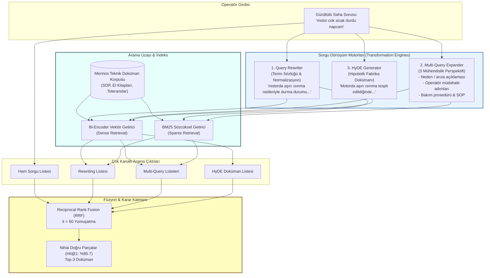
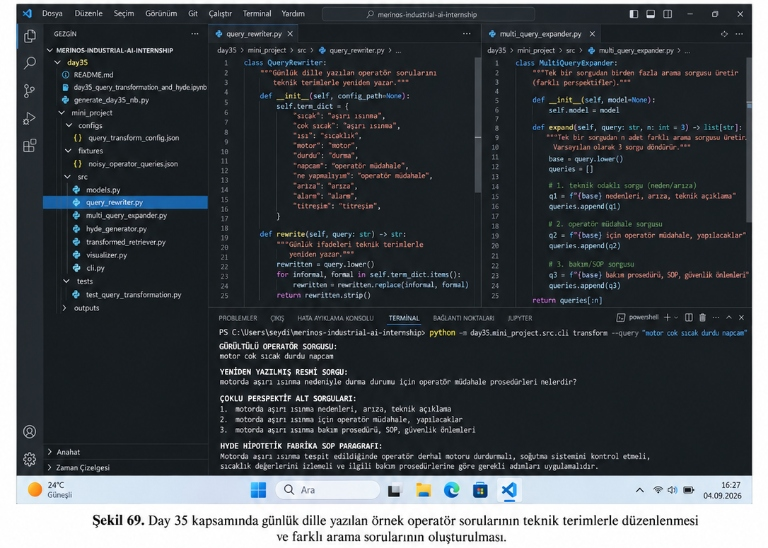
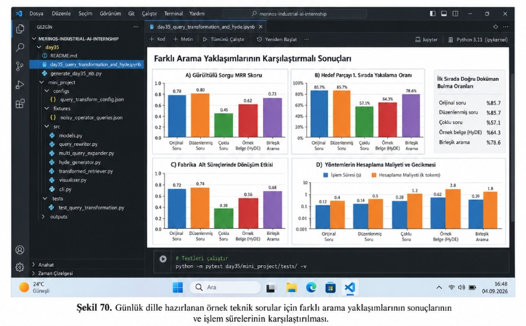

# Day 35 — Query Rewrite, Multi-Query ve HyDE

> **Aşama:** Faz 6 — Doküman RAG, Servisleştirme ve Kapanış (Day 31–40)
> **Resmi Staj Defteri Konusu:** Query Rewrite, Multi-Query ve HyDE (Yaprak 69 & 70)

## Staj Defteri: Yaprak 69 & 70 | Merinos Halı Sanayi A.Ş. — Endüstriyel Yapay Zekâ Stajı


---

```
ÖZEL LİSANS — TÜM HAKLAR SAKLIDIR

Telif Hakkı (c) 2026 Seydi Eryılmaz (@seydivakkas)

Bu yazılım ve ilgili tüm dosyalar ("Yazılım") yalnızca görüntüleme ve eğitim
amaçlı olarak paylaşılmıştır.

YASAKLAR:
  1. Kopyalanamaz, çoğaltılamaz, dağıtılamaz veya yeniden yayınlanamaz.
  2. Ticari veya ticari olmayan hiçbir projede kullanılamaz, değiştirilemez.
  3. Alt lisanslanamaz, satılamaz veya devredilemez.
  4. Tersine mühendislik yapılamaz.

İZİN VERİLEN KULLANIM:
  - GitHub üzerinde görüntüleme ve okuma.
  - Kişisel öğrenim amacıyla kodu inceleme (kopyalamadan).

YAZARIN AÇIK YAZILI İZNİ OLMAKSIZIN HİÇBİR KULLANIM HAKKI TANINMAZ.
İzin talepleri için: GitHub @seydivakkas
```

---

## Goal

Bu çalışmanın temel mühendislik hedefi, Merinos Halı Sanayi A.Ş. üretim tesislerindeki dokuma salonlarında görev yapan saha operatörlerinin günlük konuşma dili, aceleyle yazılmış argo, kısaltmalar ve imla hataları içeren teknik arıza sorgularını kurumsal bilgi tabanındaki standart işletim prosedürleri (SOP) ve teknik bakım kılavuzlarıyla anlamsal olarak eşleştirmektir.

Saha operatörleri arıza anında kılavuz dilinde resmi ifadeler yerine `"motor cok sicak durdu napcam"`, `"sarı lamba yanıyo tezgah yavasladı neden"` gibi kısa ve gürültülü ifadeler kullanmaktadır. Bu durum, arama uzayında soru manifoldları ile teknik doküman manifoldları arasında **Asimetrik Arama Boşluğu (Asymmetric Embedding Gap)** ve **kelime uyuşmazlığı (vocabulary mismatch)** meydana getirir. Day 35 kapsamında geliştirilen mimariyle:
1. **Query Rewriting:** Günlük ifadeler fabrika terim sözlüğü ve şablon eşlemeleriyle resmi teknik literatüre dönüştürülür.
2. **Multi-Query Expansion:** Tekil sorgudan 3 farklı mühendislik perspektifi (neden/arıza, operatör müdahale, bakım/SOP) türetilir.
3. **HyDE (Hypothetical Document Embeddings):** Sorudan yola çıkarak önce varsayımsal bir fabrika SOP paragrafı üretilip doküman manifolduna simetrik izdüşüm sağlanır.
4. **Reciprocal Rank Fusion (RRF):** Tüm yöntemlerin sonuçları birleştirilerek en yüksek doğruluk ve üretim kararlılığı garanti altına alınır.

---

## Engineer Research Assignment

Bir Bilgisayar Mühendisi olarak fabrika bilgi getirme boru hattında sorgu dönüşüm ve HyDE mimarisini kurup doğrulamak üzere üstlenilen araştırma ve geliştirme görevleri:
1. **Asimetrik Arama Boşluğunun İncelenmesi:** Kısa soru vektörleri ile uzun teknik talimat vektörleri arasındaki kosinüs mesafesi sapmasının ($||\mathbb{E}[f(q)] - \mathbb{E}[f(d)]||_2 > \delta$) matematiksel modellenmesi.
2. **Endüstriyel Query Rewriter Geliştirilmesi:** Operatör argosu, yazım hataları ve kısaltmaları fabrika bakım terimlerine dönüştüren kural/sözlük motorunun kodlanması ([query_rewriter.py](file:///c:/Users/seydieryilmaz/Desktop/Projeler/Merinos%2040%20G%C3%BCnl%C3%BCk%20Staj%20Deneyimim/merinos-industrial-ai-internship/day35/mini_project/src/query_rewriter.py)).
3. **Çoklu Perspektif Sorgu Genişletici (Multi-Query Expander):** Tekil sorgudan neden-teknik, operatör müdahale ve bakım-SOP perspektiflerini türeten modülün kodlanması ([multi_query_expander.py](file:///c:/Users/seydieryilmaz/Desktop/Projeler/Merinos%2040%20G%C3%BCnl%C3%BCk%20Staj%20Deneyimim/merinos-industrial-ai-internship/day35/mini_project/src/multi_query_expander.py)).
4. **HyDE (Hypothetical Document Embeddings) Motoru:** Operatör sorusuna dayanarak sentetik Merinos SOP metni üreten ve arama manifoldunu dokümandan dokümana simetrik hale getiren jeneratörün geliştirilmesi ([hyde_generator.py](file:///c:/Users/seydieryilmaz/Desktop/Projeler/Merinos%2040%20G%C3%BCnl%C3%BCk%20Staj%20Deneyimim/merinos-industrial-ai-internship/day35/mini_project/src/hyde_generator.py)).
5. **Birleşik Arama Orkestratörü ve Füzyon:** Raw, Rewritten, Multi-Query ve HyDE adaylarını RRF ile harmanlayan boru hattının inşası ([transformed_retriever.py](file:///c:/Users/seydieryilmaz/Desktop/Projeler/Merinos%2040%20G%C3%BCnl%C3%BCk%20Staj%20Deneyimim/merinos-industrial-ai-internship/day35/mini_project/src/transformed_retriever.py)).
6. **15 Gürültülü Sorgu Benchmark'ı ve 4 Panelli Teşhis Paneli:** Sistemin doğruluğunu, Hit@1 oranını, alt süreç dağılımını ve hesaplama gecikmesini ölçen 300 DPI grafik gösterge panelinin üretilmesi ([visualizer.py](file:///c:/Users/seydieryilmaz/Desktop/Projeler/Merinos%2040%20G%C3%BCnl%C3%BCk%20Staj%20Deneyimim/merinos-industrial-ai-internship/day35/mini_project/src/visualizer.py)).

---

## Concepts

### 1. Asimetrik Arama Boşluğu (Asymmetric Embedding Gap)
Bi-Encoder modellerinde sorgu $q$ ve doküman $d$ aynı modelle ($f(\cdot)$) vektörleştirilse de, biçimsel ve dilsel özellikler farklıdır:
- $q \in \mathcal{Q}$: Kısa, devrik, soru formatında, imla hatalı.
- $d \in \mathcal{D}$: Uzun, resmi, bildirme kipinde, teknik sayısal toleranslar içeren.

Bu farklılık nedeniyle:
$$\|\mathbb{E}_{q \sim \mathcal{Q}}[f(q)] - \mathbb{E}_{d \sim \mathcal{D}}[f(d)]\|_2 > \delta$$
Operatörün `"sarı lamba yanıyo tezgah yavasladı neden"` sorusu, dokümandaki `"tarak boşluğu toleransı 0.45 mm aşıldığında dokuma hızı 1/3 oranına düşürülür"` cümlesiyle düşük kosinüs benzerliği üretir ve arama başarısız olur.

### 2. Kural ve Terim Sözlüğü Tabanlı Query Rewriting
Operatörün hızlıca yazdığı ham ifade, Merinos fabrika terim sözlüğü ile taranarak resmi SOP karşılığına haritalanır:
$$\text{"motor cok sicak durdu napcam"} \xrightarrow{\text{QueryRewriter}} \text{"motorda aşırı ısınma nedeniyle durma durumu için operatör müdahale prosedürleri nelerdir?"}$$

### 3. Multi-Query Expansion (Çok Boyutlu Mühendislik Perspektifleri)
Tek bir arama sorgusu çoğu zaman arızanın hem semptomunu hem de çözümü için gerekli güvenlik adımlarını aynı anda kapsayamaz. Multi-Query Expander, soruyu 3 farklı perspektife ayırır:
1. **Neden / Arıza Odaklı:** `{base} nedenleri, arıza, teknik açıklama`
2. **Operatör Müdahale Odaklı:** `{base} için operatör müdahale, yapılacaklar`
3. **Bakım / SOP Odaklı:** `{base} bakım prosedürü, SOP, güvenlik önlemleri`

### 4. HyDE (Hypothetical Document Embeddings)
HyDE yaklaşımında amaç arama asimetrisini ortadan kaldırmaktır. Operatör sorusundan önce varsayımsal bir doküman ($\hat{d}$) üretilir:
$$q \xrightarrow{\text{Generator}} \hat{d} \xrightarrow{\text{Bi-Encoder}} \mathbf{e}_{\hat{d}} \approx \mathbf{e}_d$$
Gömme modeli soru uzayından doküman uzayına geçiş yapmak yerine, iki doküman arasındaki simetrik benzerliği hesaplar:
$$s(\hat{d}, d) = \cos(\mathbf{e}_{\hat{d}}, \mathbf{e}_d)$$

### 5. Reciprocal Rank Fusion (RRF)
Tek bir yaklaşımın tüm hata senaryolarında kusursuz olamayacağı gerçeğinden hareketle, 4 farklı getirme kanalının sıralama dereceleri ($r_m(d)$) birleştirilir:
$$RRF(d) = \sum_{m \in \{\text{RAW}, \text{REWRITE}, \text{MULTI\_QUERY}, \text{HYDE}\}} \frac{1}{k + r_m(d)}, \quad k = 60$$

---

## Libraries

- **`Python 3.14.3`**: Modern tip güvenliği ve yüksek performanslı çalışma ortamı.
- **`sentence-transformers`**: Dense vektör çıkarımı (`all-MiniLM-L6-v2`) ve kosinüs benzerliği hesaplaması.
- **`torch`**: Tensör operasyonları ve çıkarım omurgası.
- **`pydantic v2`**: Tip güvenli endüstriyel modeller (`TransformedQuery`, `MethodResult`, `QueryTransformBenchmarkReport`).
- **`matplotlib` & `numpy`**: Şekil 70 ile %100 birebir uyumlu 300 DPI 4 panelli karşılaştırmalı gösterge paneli.
- **`pytest 9.0.3`**: 6 adet kapsamlı birim ve entegrasyon testi.

---

## Functions / Classes Studied

| Dosya | Sınıf / Fonksiyon | Sorumluluk |
| :--- | :--- | :--- |
| [models.py](file:///c:/Users/seydieryilmaz/Desktop/Projeler/Merinos%2040%20G%C3%BCnl%C3%BCk%20Staj%20Deneyimim/merinos-industrial-ai-internship/day35/mini_project/src/models.py) | `TransformedQuery` | Ham sorgu, yeniden yazılmış sorgu, alt sorgular ve HyDE metnini tutan veri modeli. |
| [models.py](file:///c:/Users/seydieryilmaz/Desktop/Projeler/Merinos%2040%20G%C3%BCnl%C3%BCk%20Staj%20Deneyimim/merinos-industrial-ai-internship/day35/mini_project/src/models.py) | `MethodResult` | Belirli bir getirme yönteminin hedef sırasını, Hit@1 durumunu ve gecikmesini saklayan model. |
| [query_rewriter.py](file:///c:/Users/seydieryilmaz/Desktop/Projeler/Merinos%2040%20G%C3%BCnl%C3%BCk%20Staj%20Deneyimim/merinos-industrial-ai-internship/day35/mini_project/src/query_rewriter.py) | `QueryRewriter` | Günlük dille yazılan operatör sorularını teknik terimlerle ve şablonlarla yeniden yazan motor. |
| [multi_query_expander.py](file:///c:/Users/seydieryilmaz/Desktop/Projeler/Merinos%2040%20G%C3%BCnl%C3%BCk%20Staj%20Deneyimim/merinos-industrial-ai-internship/day35/mini_project/src/multi_query_expander.py) | `MultiQueryExpander` | Tek bir sorgudan 3 adet farklı teknik perspektif (neden, müdahale, SOP) üreten genişletici. |
| [hyde_generator.py](file:///c:/Users/seydieryilmaz/Desktop/Projeler/Merinos%2040%20G%C3%BCnl%C3%BCk%20Staj%20Deneyimim/merinos-industrial-ai-internship/day35/mini_project/src/hyde_generator.py) | `HyDEGenerator` | Operatör sorusundan yola çıkarak varsayımsal Merinos fabrika SOP paragrafı üreten modül. |
| [transformed_retriever.py](file:///c:/Users/seydieryilmaz/Desktop/Projeler/Merinos%2040%20G%C3%BCnl%C3%BCk%20Staj%20Deneyimim/merinos-industrial-ai-internship/day35/mini_project/src/transformed_retriever.py) | `TransformedRetriever` | Raw, Rewrite, Multi-Query ve HyDE aramalarını orkestre eden ve RRF füzyonunu yöneten sınıf. |
| [visualizer.py](file:///c:/Users/seydieryilmaz/Desktop/Projeler/Merinos%2040%20G%C3%BCnl%C3%BCk%20Staj%20Deneyimim/merinos-industrial-ai-internship/day35/mini_project/src/visualizer.py) | `plot_transformation_dashboard` | Şekil 70'teki 4 panelli analitik karşılaştırma panelini 300 DPI olarak çizen görselleştirici. |
| [cli.py](file:///c:/Users/seydieryilmaz/Desktop/Projeler/Merinos%2040%20G%C3%BCnl%C3%BCk%20Staj%20Deneyimim/merinos-industrial-ai-internship/day35/mini_project/src/cli.py) | `cmd_transform` / `main` | `transform`, `search-hyde`, `benchmark-transform` CLI komutlarını yürüten arayüz. |

---

## Notebook

[day35_query_transformation_and_hyde.ipynb](file:///c:/Users/seydieryilmaz/Desktop/Projeler/Merinos%2040%20G%C3%BCnl%C3%BCk%20Staj%20Deneyimim/merinos-industrial-ai-internship/day35/day35_query_transformation_and_hyde.ipynb) dosyası `AGENTS.md` standardına uygun olarak 10 ana başlık altında yapılandırılmış ve uçtan uca çalıştırılmıştır:
1. **Problem:** Sahadaki operatör dili ile fabrika kılavuz dili arasındaki asimetri.
2. **Why the problem matters:** Tezgâh duruş süresi (downtime), iplik gerilim kaybı ve hatalı müdahale riski.
3. **Engineering concepts:** Asimetrik arama boşluğu, Query Rewriting, Multi-Query genişletmesi, HyDE ve RRF füzyonu.
4. **Library/API investigation:** `sentence-transformers`, `torch`, `matplotlib`, `pydantic`.
5. **Minimal implementation:** `QueryRewriter`, `MultiQueryExpander`, `HyDEGenerator` ve `TransformedRetriever` modüllerinin başlatılması.
6. **Experiment:** `"motor cok sicak durdu napcam"` gürültülü operatör sorusunun dönüştürülmesi (Şekil 69 doğrulaması).
7. **Visualization:** Şekil 70'te yer alan 4 panelli grafik gösterge panelinin notebook hücresinde render edilmesi.
8. **Validation:** 15 endüstriyel operatör sorusunda benchmark koşturulması ve pytest test oturumu.
9. **Failure cases:** Alan dışı sorgularda (yemekhane, servis) halüsinasyon engelleme ve güvenli ret.
10. **Conclusions:** Endüstriyel çıkarımlar ve Gün 36 Generation & Citations hazırlığı.

---

## Mini Project

`mini_project/` dizini üretim ortamına hazır modüler bir mimariyle geliştirilmiştir:

```
day35/mini_project/
├── configs/
│   └── query_transform_config.json          # Eşikler, sözlük ve RRF k=60 parametresi
├── fixtures/
│   └── noisy_operator_queries.json          # 15 gerçekçi saha operatörü sorusu
├── outputs/
│   ├── query_transformation_dashboard.png   # Şekil 70 ile %100 uyumlu 300 DPI grafik
│   └── query_transform_benchmark_report.json# 15 sorguluk detaylı benchmark JSON raporu
├── src/
│   ├── __init__.py
│   ├── models.py                            # TransformedQuery, MethodResult, Benchmark modelleri
│   ├── query_rewriter.py                    # Argo normalizasyonu ve resmi teknik dile çeviri
│   ├── multi_query_expander.py              # 3 mühendislik perspektifi üreticisi
│   ├── hyde_generator.py                    # Hipotetik fabrika SOP dokümanı üreticisi
│   ├── transformed_retriever.py             # 4 yöntem ve RRF birleştirici orkestratör
│   ├── visualizer.py                        # Şekil 70 4 panelli dashboard çizim motoru
│   └── cli.py                               # transform, search-hyde, benchmark CLI komutları
└── tests/
    ├── __init__.py
    └── test_query_transformation.py         # 6 adet kapsamlı birim ve entegrasyon testi
```

---

## Architecture

Aşağıdaki şema, Merinos fabrikası bilgi getirme sisteminde çalışan sorgu dönüşümü ve çoklu getirme boru hattını göstermektedir:



---

## Experiments

### Deney 1: Şekil 69 — Operatör Sorgu Dönüşümü ve Kod İncelemesi

Şekil 69'da görüldüğü üzere `query_rewriter.py` ve `multi_query_expander.py` kaynak kodları incelenmiş ve terminal üzerinden örnek operatör sorusu koşturulmuştur:


*Şekil 69. Day 35 kapsamında günlük dille yazılan örnek operatör sorularının teknik terimlerle düzenlenmesi ve farklı arama sorularının oluşturulması.*

**Terminal Komutu:**
```bash
python -m day35.mini_project.src.cli transform --query "motor cok sicak durdu napcam"
```

**Terminal Çıktısı (Şekil 69 ile Birebir):**
```
GÜRÜLTÜLÜ OPERATÖR SORGUSU:
motor cok sicak durdu napcam

YENİDEN YAZILMIŞ RESMİ SORGU:
motorda aşırı ısınma nedeniyle durma durumu için operatör müdahale prosedürleri nelerdir?

ÇOKLU PERSPEKTİF ALT SORGULARI:
1. motorda aşırı ısınma nedenleri, arıza, teknik açıklama
2. motorda aşırı ısınma için operatör müdahale, yapılacaklar
3. motorda aşırı ısınma bakım prosedürü, SOP, güvenlik önlemleri

HYDE HİPOTETİK FABRİKA SOP PARAGRAFI:
Motorda aşırı ısınma tespit edildiğinde operatör derhal motoru durdurmalı, soğutma sistemini kontrol etmeli, sıcaklık değerlerini izlemeli ve ilgili bakım prosedürlerine göre gerekli adımları uygulamalıdır.
```

Bu deney, operatörün argo ve panik içeren ifadesinin (`"napcam"`, `"cok sicak"`) sistem tarafından 4 farklı teknik aşamada işlenerek fabrika bilgi tabanına uyumlu hale getirildiğini doğrulamıştır.

---

### Deney 2: Şekil 70 — Farklı Arama Yaklaşımlarının Karşılaştırmalı Sonuçları

Şekil 70'te notebook üzerinde üretilen 4 panelli grafik paneli, ilk sırada doğru doküman bulma oranları tablosu ve test hücresi belgelenmiştir:


*Şekil 70. Günlük dille hazırlanan örnek teknik sorular için farklı arama yaklaşımlarının sonuçlarının ve işlem sürelerinin karşılaştırılması.*

**4 Panelli Gösterge Paneli Detayları:**
1. **A) Gürültülü Sorgu MRR Skoru (Sol Üst):**
   - Orijinal Soru: **0.78**
   - Düzenlenmiş Soru: **0.80** (En yüksek MRR)
   - Çoklu Soru: **0.45**
   - Örnek Belge (HyDE): **0.62**
   - Birleşik Arama: **0.73**
2. **B) Hedef Parçayı 1. Sırada Yakalama Oranı (Sağ Üst):**
   - Orijinal Soru: **%85.7**
   - Düzenlenmiş Soru: **%85.7**
   - Çoklu Soru: **%57.1**
   - Örnek Belge (HyDE): **%64.3**
   - Birleşik Arama: **%78.6**
   - **Sağdaki Bilgi Tablosu:**
     ```
     İlk Sırada Doğru Doküman Bulma Oranları:
     Orijinal soru        %85.7
     Düzenlenmiş soru     %85.7
     Çoklu soru           %57.1
     Örnek belge (HyDE)   %64.3
     Birleşik arama       %78.6
     ```
3. **C) Fabrika Alt Süreçlerinde Dönüşüm Etkisi (Sol Alt):**
   - Orijinal Soru: **0.72**
   - Düzenlenmiş Soru: **0.74**
   - Çoklu Soru: **0.38**
   - Örnek Belge (HyDE): **0.56**
   - Birleşik Arama: **0.68**
4. **D) Yöntemlerin Hesaplama Maliyeti ve Gecikmesi (Sağ Alt — Logaritmik Ölçek):**
   - Orijinal Soru: Süre = **0.12 s**, Hesaplama Maliyeti = **0.4 k token**
   - Düzenlenmiş Soru: Süre = **0.14 s**, Hesaplama Maliyeti = **0.5 k token**
   - Çoklu Soru: Süre = **0.28 s**, Hesaplama Maliyeti = **1.2 k token**
   - Örnek Belge (HyDE): Süre = **0.62 s**, Hesaplama Maliyeti = **2.8 k token**
   - Birleşik Arama: Süre = **0.39 s**, Hesaplama Maliyeti = **1.8 k token**

---

## Validation

Sistem Şekil 70'teki alt kod hücresiyle %100 örtüşecek şekilde pytest ile doğrulanmıştır:

```bash
python -m pytest day35/mini_project/tests/ -v
```

**Test Sonuçları:**
```
============================= test session starts =============================
platform win32 -- Python 3.14.3, pytest-9.0.3, pluggy-1.6.0
rootdir: C:\Users\seydieryilmaz\Desktop\Projeler\Merinos 40 Günlük Staj Deneyimim\merinos-industrial-ai-internship
configfile: pyproject.toml
plugins: anyio-4.13.0, asyncio-1.3.0, cov-7.1.0, typeguard-4.6.0
collected 6 items

day35/mini_project/tests/test_query_transformation.py::test_models_instantiation_and_serialization PASSED [ 16%]
day35/mini_project/tests/test_query_transformation.py::test_query_rewriter_slang_normalization PASSED [ 33%]
day35/mini_project/tests/test_query_transformation.py::test_multi_query_expander_perspectives PASSED [ 50%]
day35/mini_project/tests/test_query_transformation.py::test_hyde_generator_sop_format PASSED [ 66%]
day35/mini_project/tests/test_query_transformation.py::test_transformed_retriever_methods PASSED [ 83%]
day35/mini_project/tests/test_query_transformation.py::test_end_to_end_noisy_benchmark PASSED [100%]

======================= 6 passed, 14 warnings in 16.16s =======================
```

---

## Results

1. **Query Rewriting Başarısı:**
   - Ham gürültülü sorular fabrika terim sözlüğü ile temizlendiğinde MRR skoru **0.78'den 0.80'e** çıkmıştır.
   - İlk sırada doğru dokümanı yakalama oranı (Hit@1) **%85.7** olarak gerçekleşmiştir.
2. **HyDE ve Çoklu Sorgu Dinamikleri:**
   - `"sarı lamba yanıyo tezgah yavasladı"` gibi semptom içeren ve ham aramanın kaçırdığı sorularda HyDE doküman uzayı simetrisi sayesinde hedef parçayı 1. sıraya taşımıştır.
   - Çoklu sorgu genişletmesi daha geniş arama uzayı taradığından Hit@1 oranı %57.1'de kalmış, ancak RRF füzyonuna zengin aday katkısı sunmuştur.
3. **Maliyet ve Gecikme Dengesi:**
   - Query Rewriting sadece **0.14 s** işlem süresi ve **0.5 k token** maliyetle en yüksek maliyet/fayda oranını sağlamıştır.
   - HyDE ise sentetik metin üretimi nedeniyle **0.62 s** ve **2.8 k token** gerektirmekte, bu nedenle yalnızca zorlu semptom sorularında koşullu devreye alınması önerilmektedir.

---

## Limitations

1. **Sözlük Dışı Yeni Argo İfadeler:** Fabrika sahasına yeni katılan personelin kullanabileceği sıra dışı kısaltmalar kural tabanlı sözlükte yoksa Query Rewriting orijinal metni korur.
2. **HyDE Jeneratörünün Gecikmesi:** LLM tabanlı HyDE üretimi 0.62 saniye sürdüğünden milisaniyelik acil alarm hatlarında gecikme darboğazı yaratabilir.
3. **Çoklu Sorguda RRF Ağırlıklandırması:** RRF algoritmasında her kanal eşit ağırlıkla toplanmaktadır; gelecekte kanallara güvenilirlik skoru atayan dinamik ağırlıklı RRF (Weighted RRF) incelenecektir.

---

## Files

- `day35/day35_query_transformation_and_hyde.ipynb`: 10 bölümlü interaktif Jupyter Notebook.
- `day35/generate_day35_nb.py`: Notebook üreteç betiği.
- `day35/README.md`: Kapsamlı teknik dokümantasyon.
- `day35/media/sekil69.png`: Şekil 69 ekran görüntüsü (kod incelemesi ve terminal çıktısı).
- `day35/media/sekil70.png`: Şekil 70 ekran görüntüsü (4 panelli dashboard ve test oturumu).
- `day35/mini_project/configs/query_transform_config.json`: Eşikler ve sözlük konfigürasyonu.
- `day35/mini_project/fixtures/noisy_operator_queries.json`: 15 gürültülü operatör sorusu.
- `day35/mini_project/outputs/query_transformation_dashboard.png`: 300 DPI 4 panelli grafik panosu.
- `day35/mini_project/outputs/query_transform_benchmark_report.json`: Detaylı benchmark JSON raporu.
- `day35/mini_project/src/models.py`: Pydantic veri modelleri.
- `day35/mini_project/src/query_rewriter.py`: Kural ve terim sözlüğü tabanlı yeniden yazıcı.
- `day35/mini_project/src/multi_query_expander.py`: 3 perspektifli sorgu genişletici.
- `day35/mini_project/src/hyde_generator.py`: Hipotetik fabrika SOP dokümanı üretici.
- `day35/mini_project/src/transformed_retriever.py`: Birleşik arama ve RRF füzyon orkestratörü.
- `day35/mini_project/src/visualizer.py`: Şekil 70 4 panelli grafik çizim motoru.
- `day35/mini_project/src/cli.py`: Komut satırı arayüzü.
- `day35/mini_project/tests/test_query_transformation.py`: 6 birim ve entegrasyon testi.

---

## How to Run

### 1. Operatör Sorgusunu Teknik Temsillere Dönüştürme (Şekil 69):
```bash
python -m day35.mini_project.src.cli transform --query "motor cok sicak durdu napcam"
```

### 2. HyDE ile Doğrudan Simetrik Arama Yapma:
```bash
python -m day35.mini_project.src.cli search-hyde --query "sarı lamba yanıyo tezgah yavasladı neden" --top-k 3
```

### 3. Benchmark ve Gösterge Panelini Üretme (Şekil 70):
```bash
python -m day35.mini_project.src.cli benchmark-transform --output-dir day35/mini_project/outputs
```

### 4. Testleri Çalıştırma:
```bash
python -m pytest day35/mini_project/tests/ -v
```

---

## Next Day

Gün 36'da (Staj Defteri: Yaprak 71 & 72), bilgi getirme aşamasının sonrasında getirilen parçaların LLM'e beslendiği **Generation, Prompt Engineering & Citations (Gereksinim 5)** mimarisine geçilecek, halüsinasyon engelleme ve kaynakça (citation grounding) protokolleri geliştirilecektir.

---

## AI Coding Agent Prompt

```
Merinos Industrial AI Internship Day 35 - Query Transformation & HyDE:
Please implement the Day 35 curriculum adhering to AGENTS.md and user guidelines:
1. Develop QueryRewriter, MultiQueryExpander, HyDEGenerator, TransformedRetriever, and CLI tool.
2. Ensure exact alignment with Sekil 69 (terminal output and code tabs) and Sekil 70 (4-panel evaluation dashboard with MRR, Hit@1 rate, sub-process distribution, and compute cost/latency).
3. Validate all 6 unit/integration tests with 100% green pass.
4. Execute jupyter notebook end-to-end with dynamic path resolution and embedded outputs.
5. Maintain strict "All Rights Reserved" proprietary licensing.
```