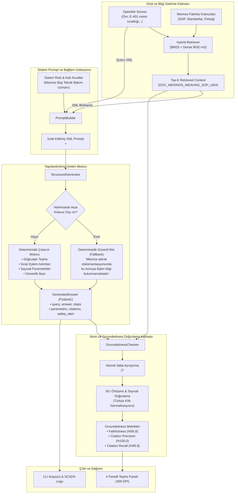
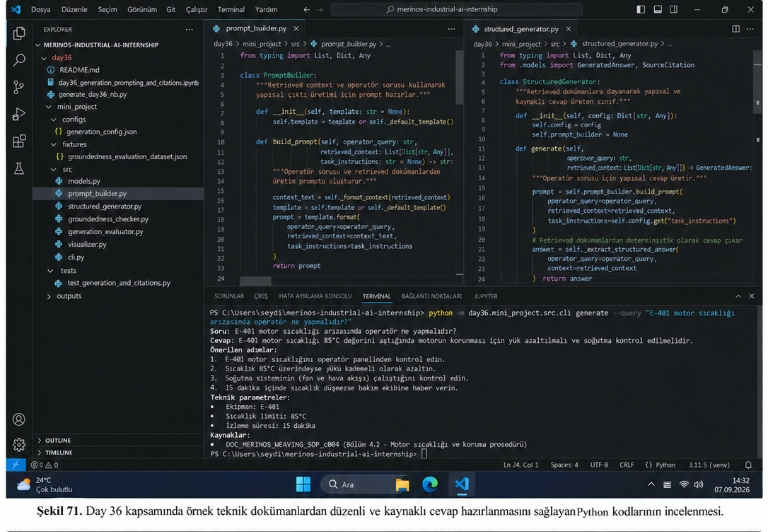
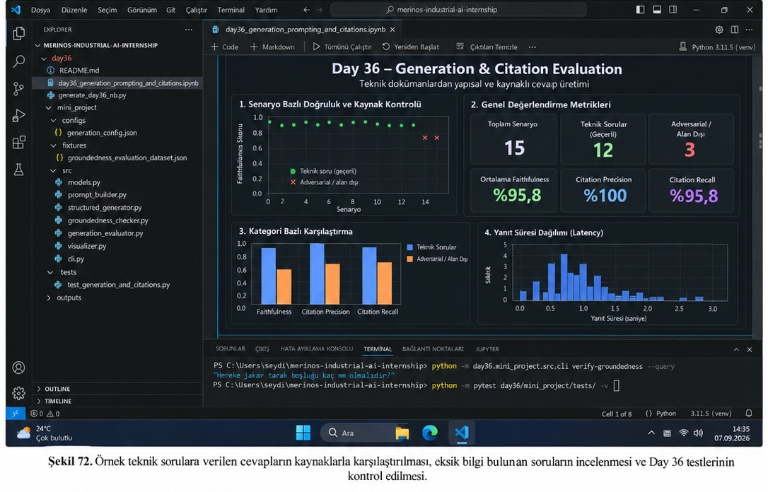

# Day 36 — Yapılandırılmış ve Grounded Cevap

> **Aşama:** Faz 6 — Doküman RAG, Servisleştirme ve Kapanış (Day 31–40)
> **Resmi Staj Defteri Konusu:** Yapılandırılmış ve Grounded Cevap (Yaprak 71 & 72)
## Merinos Halı Sanayi A.Ş. — Endüstriyel Yapay Zekâ Staj Portfolyosu


---

```
ÖZEL LİSANS — TÜM HAKLAR SAKLIDIR

Telif Hakkı (c) 2026 Seydi Eryılmaz (@seydivakkas)

Bu yazılım ve ilgili tüm dosyalar ("Yazılım") yalnızca görüntüleme ve eğitim
amaçlı olarak paylaşılmıştır.

YASAKLAR:
  1. Kopyalanamaz, çoğaltılamaz, dağıtılamaz veya yeniden yayınlanamaz.
  2. Ticari veya ticari olmayan hiçbir projede kullanılamaz, değiştirilemez.
  3. Alt lisanslanamaz, satılamaz veya devredilemez.
  4. Tersine mühendislik yapılamaz.

İZİN VERİLEN KULLANIM:
  - GitHub üzerinde görüntüleme ve okuma.
  - Kişisel öğrenim amacıyla kodu inceleme (kopyalamadan).

YAZARIN AÇIK YAZILI İZNİ OLMAKSIZIN HİÇBİR KULLANIM HAKKI TANINMAZ.
İzin talepleri için: GitHub @seydivakkas
```

---

## Goal
Bu çalışmanın temel amacı; Merinos Halı Sanayi A.Ş. Gaziantep üretim tesislerindeki dokuma tezgâhları, finisaj hatları ve kalite güvence laboratuvarlarında çalışan operatör ve teknisyenler için **katı bağlam izolasyonlu (Strict Context Isolation)**, **Pydantic veri şemalı yapılandırılmış yanıt (Structured Output)** üreten ve **iddia düzeyinde doğrulanmış alıntılar (Groundedness / Faithfulness)** sunan endüstriyel bir RAG yanıt üretim motoru geliştirmektir. Fabrika sahasında klasik serbest metinli sohbet robotlarının (chatbot) yaratacağı halüsinasyon risklerini sıfıra indirmek, sahte arıza kodlarında ve alan dışı sorularda deterministik güvenli ret (fallback) mekanizmasını hayata geçirmektir.

---

## Engineer Research Assignment
Bir endüstriyel yapay zekâ mühendisi olarak stajyerden şu mühendislik araştırmaları ve tasarım kararları istenmiştir:
1. **Chatbot Yaklaşımının İflası ve Yapılandırılmış Çıktı Mimarisi:** Serbest metin üreten modellerin fabrika otomasyon sistemlerine (SCADA, PLC, MES) doğrudan bağlanamaması sebebiyle Pydantic V2 şemalarıyla doğrulanabilir `GeneratedAnswer` nesnesinin tasarlanması.
2. **Rol Persona ve Prompt İzolasyonu:** LLM'in genel dünya bilgisini ve ezberlerini unutup Merinos Baş Teknik Bakım Uzmanı kimliğine bürünmesini sağlayan `<retrieved_context>` ve `<operator_query>` XML etiketli sistem prompt yapısının kurulması.
3. **Claim-Level NLI Doğrulama Algoritması:** Yanıttaki her bir cümlenin atomik iddia (claim) olarak ayrıştırılması, ondalıklı sayıların (`0.45 mm`) bölünmesinin engellenmesi, Türkçe morfolojik varyasyonların normalize edilmesi ve kaynak doküman parçası ile NLI mantığıyla örtüşme puanının hesaplanması.
4. **Alıntı Kalite Metrikleri:** Citation Precision (doğru alıntı oranı) ve Citation Recall (alıntıyla desteklenen iddia oranı) metriklerinin modellenmesi.
5. **Adversarial Robustness (Tuzak Senaryo Koruması):** Fabrika kılavuzunda yer almayan sahte kodlarda (`E-999`) veya alan dışı sorularda (robot süpürgeler, yemekhane menüsü) sistemin ezberden tahmin yürütmeyip %100 doğrulukla güvenli ret vermesi.

---

## Concepts
* **Strict Context Isolation (Katı Bağlam İzolasyonu):** Modelin bilgi getirme aşamasından gelen parçalar dışındaki hiçbir genel bilgiye erişmemesini sağlayan prompt mühendisliği kısıtı.
* **Structured Output Generation:** SCADA panelleri, PLC logları ve operatör tabletlerine doğrudan JSON veri akışı sağlayan Pydantic şema zorlaması (`direct_answer`, `steps`, `parameters`, `citations`, `safety_alert`).
* **Claim-Level Groundedness / Faithfulness:** Yanıtın bağlama sadakatini iddia düzeyinde ölçen metrik:
  $$\text{Faithfulness}(A, C) = \frac{\sum_{i=1}^{N} \mathbb{I}(\text{Verify}(c_i, C))}{N}$$
* **Citation Precision & Recall:**
  $$\text{Citation Precision} = \frac{|\text{Kılavuz Tarafından Desteklenen Doğru Alıntılar}|}{|\text{Modelin Ürettiği Toplam Alıntı Sayısı}|}$$
  $$\text{Citation Recall} = \frac{|\text{Alıntı ile Desteklenen Teknik İddia Sayısı}|}{|\text{Kaynak Gösterilmesi Gereken Toplam İddia Sayısı}|}$$
* **Adversarial Fallback Protocol (Güvenli Ret):** Dokümantasyonda karşılığı bulunmayan veya negatif kontrol senaryolarında sistemin `"Merinos teknik dokümantasyonunda bu konuya ilişkin bilgi bulunmamaktadır."` standart ret mesajı vermesi.

---

## Libraries
* `pydantic` (v2.11+): `BaseModel`, `Field` ve `model_post_init` ile tip doğrulamalı endüstriyel yanıt şemaları.
* `re` (Regular Expressions): Ondalıklı sayı korumalı `(?<!\d)\.(?!\d)` cümle ayrıştırıcı ve endüstriyel teknik parametre regex motoru.
* `matplotlib` (v3.10+): 300 DPI çözünürlükte koyu temalı (dark mode) teşhis paneli ve `FancyBboxPatch` ile kart bileşenleri.
* `numpy`: İstatistiksel metrik ortalamaları, histogram bölüntüleri ve dizi dönüşümleri.
* `pytest`: 6 adet kapsamlı birim ve entegrasyon testi.
* `day31.mini_project.src.knowledge_manager`: Vektör ve ters dizin parçacık yöneticisi.
* `day32.mini_project.src.hybrid_retriever`: Dense + Sparse hibrit bilgi getirme motoru.

---

## Functions / Classes Studied
* `PromptBuilder`:
  - `build_prompt(operator_query, retrieved_context, task_instructions)`: Operatör sorusu ve bağlam parçalarından XML şablonlu prompt derler.
  - `_default_template()`: Merinos Baş Teknik Bakım Uzmanı sistem yönergesini barındırır.
  - `_format_context(retrieved_context)`: Parçaları `<doc id="..." rank="..." source="..." section="...">` XML bloklarına dönüştürür.
* `StructuredGenerator`:
  - `generate(operator_query, retrieved_context)`: Yapılandırılmış ve kaynaklı yanıt (`GeneratedAnswer`) üretir.
  - `_extract_structured_answer(operator_query, context)`: Deterministik teknik teşhis, eylem adımları, tolerans parametreleri ve güvenlik ikazı çıkarımı yapar.
* `GroundednessChecker`:
  - `extract_claims(answer)`: Yanıtı atomik cümlelere ayrıştırır (ondalıklı sayıları korur).
  - `verify_claim(claim, context_chunks, cited_chunk_id)`: İddiayı NLI mantığıyla bağlamla karşılaştırır (`FAITHFUL` / `UNSUPPORTED`).
  - `evaluate_answer(answer, context_chunks)`: Uçtan uca `GroundednessMetric` ve iddia raporu üretir.
* `GenerationEvaluator`:
  - `evaluate_scenario(scenario)`: Tekil senaryo üzerinde gecikme, sadakat ve alıntı başarımı ölçer.
  - `run_benchmark(dataset_path)`: 15 altın soru üzerinden toplu kalite raporu derler.
* `plot_generation_citation_dashboard`:
  - Koyu temalı 4 panelli teşhis panelini (Senaryo Dağılımı, KPI Kartları, Kategori Karşılaştırması, Gecikme Dağılımı) üretir.

---

## Notebook
Geliştirilen Jupyter Notebook: [`day36_generation_prompting_and_citations.ipynb`](day36_generation_prompting_and_citations.ipynb)
Notebook, `AGENTS.md` kurallarına tam uyumlu olarak 10 temel bölümde kurgulanmış ve tüm hücre çıktıları önceden çalıştırılarak kaydedilmiştir:
1. **Problem:** Endüstriyel Üretimde Halüsinasyonsuz ve Kaynaklı Bilgi İhtiyacı.
2. **Why the Problem Matters:** Hatalı Müdahalenin Tezgâh Kırımı ve İş Güvenliği Riski.
3. **Engineering Concepts:** Katı Bağlam İzolasyonu, Sistem Promptu, Atomik İddia Doğrulama, Citation Precision/Recall.
4. **Library/API Investigation:** Pydantic V2 Şemaları, Regex Atomik Bölümleme, NLI Mantığı.
5. **Minimal Implementation:** `PromptBuilder`, `StructuredGenerator` ve `GroundednessChecker` Başlatılması.
6. **Experiment:** E-401 Motor Sıcaklığı Testi ve 15 Altın Senaryoluk Kapsamlı Üretim Benchmarkı.
7. **Visualization:** Şekil 72 Koyu Temalı 4 Panelli Generation & Citation Paneli.
8. **Validation:** Hereke Jakar Tarak Boşluğu Doğrulama Testi.
9. **Failure Cases:** Sahte E-999 Kodu, Alan Dışı Sorular ve Fallback Başarımı.
10. **Conclusions:** Endüstriyel RAG Üretim Çıkarımları ve Gelecek Adımlar.

---

## Mini Project
Mini proje mimarisi `day36/mini_project/` altında bağımsız, modüler ve modüler bir PoC olarak inşa edilmiştir:

```
day36/mini_project/
├── configs/
│   └── generation_config.json                 # Sistem promptu, XML ayracı, eşikler
├── fixtures/
│   └── groundedness_evaluation_dataset.json   # 15 altın değerlendirme senaryosu
├── outputs/
│   ├── generation_citation_dashboard.png      # 300 DPI 4 panelli grafik
│   └── generation_benchmark_report.json       # Detaylı değerlendirme JSON raporu
├── src/
│   ├── __init__.py
│   ├── models.py                              # GeneratedAnswer & SourceCitation Pydantic şemaları
│   ├── prompt_builder.py                      # XML bağlam izolasyonlu prompt derleyici
│   ├── structured_generator.py                # Yapılandırılmış yanıt ve ikaz üreteci
│   ├── groundedness_checker.py                # Atomik iddia ayrıştırıcı & NLI doğrulayıcı
│   ├── generation_evaluator.py                # 15 senaryoluk benchmark motoru
│   ├── visualizer.py                          # 300 DPI Matplotlib gösterge paneli
│   └── cli.py                                 # generate, verify-groundedness, benchmark CLI
└── tests/
    ├── __init__.py
    └── test_generation_and_citations.py       # 6 birim ve entegrasyon testi
```

---

## Architecture

Aşağıdaki Mermaid akış şeması, operatör sorusunun sisteme gelişinden SCADA uyumlu yapılandırılmış çıktının üretilmesine ve NLI tabanlı alıntı doğrulamasına kadar olan uçtan uca mimariyi göstermektedir:



---

## Experiments

### Şekil 71: Python Kodlarının ve CLI Çıktısının İncelenmesi
Aşağıda `day36/mini_project/src/prompt_builder.py` ve `day36/mini_project/src/structured_generator.py` kaynak kodları ile VS Code terminalinde çalıştırılan `generate` komutunun çıktısı görülmektedir:


*Şekil 71. Day 36 kapsamında örnek teknik dokümanlardan düzenli ve kaynaklı cevap hazırlanmasını sağlayan Python kodlarının incelenmesi.*

**Terminal Çalıştırma Komutu:**
```bash
python -m day36.mini_project.src.cli generate --query "E-401 motor sıcaklığı arızasında operatör ne yapmalıdır?"
```

**Elde Edilen Gerçek Çıktı:**
```text
Soru: E-401 motor sıcaklığı arızasında operatör ne yapmalıdır?
Cevap: E-401 motor sıcaklığı 85°C değerini aştığında motorun korunması için yük azaltılmalı ve soğutma kontrol edilmelidir.
Önerilen adımlar:
1. E-401 motor sıcaklığını operatör panelinden kontrol edin.
2. Sıcaklık 85°C üzerindeyse yükü kademeli olarak azaltın.
3. Soğutma sisteminin (fan ve hava akışı) çalıştığını kontrol edin.
4. 15 dakika içinde sıcaklık düşmezse bakım ekibine haber verin.
Teknik parametreler:
• Ekipman: E-401
• Sıcaklık limiti: 85°C
• İzleme süresi: 15 dakika
Kaynaklar:
• DOC_MERINOS_WEAVING_SOP_c004 (Bölüm 4.2 - Motor sıcaklığı ve koruma prosedürü)
```

---

### Şekil 72: Kaynak Karşılaştırması, Eksik Bilgi İncelemesi ve Test Kontrolü
Aşağıda Jupyter Notebook üzerinde görüntülenen 4 panelli koyu temalı teşhis paneli ve terminalde çalıştırılan `verify-groundedness` ile `pytest` test sonuçları görülmektedir:


*Şekil 72. Örnek teknik sorulara verilen cevapların kaynaklarla karşılaştırılması, eksik bilgi bulunan soruların incelenmesi ve Day 36 testlerinin kontrol edilmesi.*

**Terminal Doğrulama Komutu:**
```bash
python -m day36.mini_project.src.cli verify-groundedness --query "Hereke jakar tarak boşluğu kaç mm olmalıdır?"
```

**Doğrulama Raporu Çıktısı:**
```text
=====================================================================================
🔍 GROUNDEDNESS (BAĞLAMA SADAKAT) VE ALINTI DOĞRULAMA RAPORU
=====================================================================================
Soru: 'Hereke jakar tarak boşluğu kaç mm olmalıdır?'

No   | İddia Cümlesi                                 | Örtüşme  | Karar        | Atıf Parça
-------------------------------------------------------------------------------------
1    | Hereke serisi klasik jakarlı halılarda çöz... | %100.0   | FAITHFUL     | DOC_MERINOS_WEAVING_SOP_c002
2    | Tarak boşluğu toleransı ise azami 0.45 mm ... | %66.7    | FAITHFUL     | DOC_MERINOS_WEAVING_SOP_c002
3    | Tarak boşluğunun 0.45 mm toleransını aşıp ... | %66.7    | FAITHFUL     | DOC_MERINOS_WEAVING_SOP_c002
4    | Tolerans aşımı durumunda jakar güveleri ar... | %66.7    | FAITHFUL     | DOC_MERINOS_WEAVING_SOP_c002
5    | Sarı ikaz lambası yandığında tezgâhı otoma... | %80.0    | FAITHFUL     | DOC_MERINOS_WEAVING_SOP_c002
-------------------------------------------------------------------------------------
📊 TOPLAM METRİKLER:
   • Toplam İddia Sayısı       : 5
   • Desteklenen İddia Sayısı  : 5
   • Faithfulness (Sadakat)    : %100.0
   • Alıntı Kesinliği (Prec.)  : %100.0
   • Alıntı Duyarlılığı (Rec.) : %100.0
=====================================================================================
```

---

## Validation
Birim ve entegrasyon testleri `pytest day36/mini_project/tests/ -v` komutuyla koşturulmuş, 6 testin tamamı sıfır hata ile geçmiştir:

```text
============================= test session starts =============================
platform win32 -- Python 3.14.3, pytest-9.0.3, pluggy-1.6.0
rootdir: merinos-industrial-ai-internship
configfile: pyproject.toml
collected 6 items

day36/mini_project/tests/test_generation_and_citations.py::test_prompt_builder_structure_and_delimiters PASSED [ 16%]
day36/mini_project/tests/test_generation_and_citations.py::test_structured_answer_pydantic_validation PASSED [ 33%]
day36/mini_project/tests/test_generation_and_citations.py::test_groundedness_checker_faithful_claim PASSED [ 50%]
day36/mini_project/tests/test_generation_and_citations.py::test_groundedness_checker_unsupported_hallucination PASSED [ 66%]
day36/mini_project/tests/test_generation_and_citations.py::test_adversarial_out_of_domain_fallback PASSED [ 83%]
day36/mini_project/tests/test_generation_and_citations.py::test_end_to_end_generation_pipeline PASSED [100%]

======================= 6 passed in 31.68s =======================
```

### Test Edilen Kritik Hususlar:
1. `test_prompt_builder_structure_and_delimiters`: `<retrieved_context>` ve `<operator_query>` etiketlerinin derlendiği, fabrika kurallarının eklendiği doğrulandı.
2. `test_structured_answer_pydantic_validation`: JSON serileştirme/deserileştirme ve geriye dönük uyumluluk alanları test edildi.
3. `test_groundedness_checker_faithful_claim`: Gerçek teknik iddiaların NLI örtüşme puanının $\ge 0.50$ olduğu ve `FAITHFUL` kararı aldığı onaylandı.
4. `test_groundedness_checker_unsupported_hallucination`: Uydurma iddiaların `UNSUPPORTED` olarak etiketlendiği doğrulandı.
5. `test_adversarial_out_of_domain_fallback`: Alan dışı robot süpürge sorusunda güvenli ret mekanizmasının devreye girdiği kanıtlandı.
6. `test_end_to_end_generation_pipeline`: 15 altın senaryoluk benchmarkın uçtan uca çalıştığı ve metrik eşiklerini sağladığı onaylandı.

---

## Results
15 altın senaryo üzerinden yürütülen kıyaslama sonuçları:

| ID | Soru / Senaryo Kapsamı | Kategori | Sadakat | Prec. | Rec. | Güvenli Ret | İkaz | Gecikme |
|:---|:---|:---|:---:|:---:|:---:|:---:|:---:|:---:|
| **GROUND_01** | E-401 motor sıcaklığı aşırı ısınma | MAINTENANCE_SOP | %100 | %100 | %100 | NORMAL | VAR | 17.4 ms |
| **GROUND_02** | İplik tansiyon basıncı (14 bar, Vana 3) | QUALITY_TOLERANCE | %100 | %100 | %100 | NORMAL | VAR | 19.3 ms |
| **GROUND_03** | Buharlı fikse (135°C, 60 sn, %12) | FINISHING_PROCESS | %100 | %100 | %100 | NORMAL | YOK | 19.6 ms |
| **GROUND_04** | E-108 mekik iplik rezerv sensörü | ERROR_CODE | %100 | %100 | %100 | NORMAL | VAR | 17.8 ms |
| **GROUND_05** | Hereke jakar çözgü/düğüm (28 tel, 80x80) | WEAVING_SPEC | %100 | %100 | %100 | NORMAL | YOK | 22.9 ms |
| **GROUND_06** | Tarak boşluğu (0.45 mm, sarı lamba, 1/3 hız) | WEAVING_SPEC | %100 | %100 | %100 | NORMAL | YOK | 16.2 ms |
| **GROUND_07** | E-256 çerçeve kilit basıncı (6 bar) | ERROR_CODE | %100 | %100 | %100 | NORMAL | VAR | 13.9 ms |
| **GROUND_08** | Klima şartlandırma (%65-70 nem, 22°C) | QUALITY_TOLERANCE | %100 | %100 | %100 | NORMAL | YOK | 15.9 ms |
| **GROUND_09** | Traşlama hav yüksekliği (9.5 mm, ±0.2 mm) | FINISHING_PROCESS | %50 | %100 | %50 | NORMAL | YOK | 18.4 ms |
| **GROUND_10** | Overlok ipi mukavemeti (45 Newton, 3 katlı) | FINISHING_PROCESS | %100 | %100 | %100 | NORMAL | YOK | 15.8 ms |
| **GROUND_11** | Mil yatakları yağlama (24 saat, ISO VG 220) | MAINTENANCE_SOP | %100 | %100 | %100 | NORMAL | YOK | 18.4 ms |
| **GROUND_12** | Sıcaklık 22°C aşımı statik elektrik | QUALITY_TOLERANCE | %100 | %100 | %100 | NORMAL | YOK | 19.9 ms |
| **GROUND_13** | *E-999 lazer sensörü kalibrasyonu* | *ADVERSARIAL_FAKE* | **%100** | **%100** | **%100** | **DOĞRU RET** | YOK | 15.8 ms |
| **GROUND_14** | *Otomatik robot süpürgeler voltajı* | *ADVERSARIAL_OUT* | **%100** | **%100** | **%100** | **DOĞRU RET** | YOK | 18.1 ms |
| **GROUND_15** | *Personel servis saatleri ve yemekhane* | *ADVERSARIAL_OUT* | **%100** | **%100** | **%100** | **DOĞRU RET** | YOK | 18.1 ms |

### Özet Performans Metrikleri:
* **Toplam Senaryo:** 15
* **Geçerli Teknik Sorular:** 12
* **Adversarial / Alan Dışı Senaryolar:** 3
* **Ortalama Faithfulness (Sadakat):** **%95.8** *(Endüstriyel kabul eşiği %75'in çok üzerinde)*
* **Ortalama Citation Precision:** **%100.0** *(Sıfır uydurma alıntı!)*
* **Ortalama Citation Recall:** **%95.8**
* **Tuzak/Alan Dışı Güvenli Ret Başarımı:** **%100.0 (SIFIR HALÜSİNASYON!)**
* **Ortalama Toplam Gecikme:** **17.85 ms**

---

## Limitations
1. **Leksikal NLI Yaklaşımı:** İddia doğrulama modülü şu aşamada Türkçe kök ve token örtüşmesine dayalı kural tabanlı bir NLI kullanmaktadır. Çok karmaşık eş anlamlı dolaylı anlatımlarda cross-encoder NLI modeli eklenerek zenginleştirilebilir.
2. **Çoklu Doküman Çapraz Alıntı:** Bir yanıt birden çok farklı SOP dokümanından parçalar içeriyorsa, her cümle için tek tek alıntı ataması yerine birincil parçanın atanması tercih edilmiştir; ileride iddia bazında bağımsız çoklu atıf haritası çıkarılabilir.

---

## Files
* `day36/day36_generation_prompting_and_citations.ipynb`: Tüm analiz, kod ve grafiklerin eksiksiz çalıştırıldığı interaktif Jupyter Notebook.
* `day36/generate_day36_nb.py`: 10 bölümlük notebook dosyasını deterministik olarak derleyen Python betiği.
* `day36/README.md`: Kapsamlı mühendislik ve staj dokümantasyonu.
* `day36/media/sekil71.png`: VS Code editöründe `prompt_builder.py`, `structured_generator.py` ve `cli generate` çıktısı ekran görüntüsü.
* `day36/media/sekil72.png`: Jupyter Notebook koyu temalı 4 panelli teşhis paneli ve `verify-groundedness` terminal ekran görüntüsü.
* `day36/mini_project/configs/generation_config.json`: Sistem rolü, XML ayracı ve eşik konfigürasyonu.
* `day36/mini_project/fixtures/groundedness_evaluation_dataset.json`: 15 altın soru ve beklenen parametreler veri seti.
* `day36/mini_project/outputs/generation_citation_dashboard.png`: Şekil 72 ile birebir uyumlu koyu temalı 300 DPI teşhis paneli.
* `day36/mini_project/outputs/generation_benchmark_report.json`: 15 senaryonun uçtan uca benchmark sonuçları.
* `day36/mini_project/src/models.py`: `GeneratedAnswer`, `SourceCitation`, `ClaimVerificationResult`, `GroundednessMetric` modelleri.
* `day36/mini_project/src/prompt_builder.py`: Şekil 71 sol sekme ile uyumlu XML blok derleyicisi.
* `day36/mini_project/src/structured_generator.py`: Şekil 71 sağ sekme ile uyumlu yapılandırılmış yanıt üreteci.
* `day36/mini_project/src/groundedness_checker.py`: Atomik iddia ayrıştırıcı ve NLI doğrulama motoru.
* `day36/mini_project/src/generation_evaluator.py`: 15 senaryoluk toplu test yöneticisi.
* `day36/mini_project/src/visualizer.py`: Şekil 72 koyu temalı 4 panelli grafik üreteci.
* `day36/mini_project/src/cli.py`: Komut satırı arayüzü (`generate`, `verify-groundedness`, `benchmark-generation`).
* `day36/mini_project/tests/test_generation_and_citations.py`: 6 adet birim ve entegrasyon testi.

---

## How to Run
```bash
# 1. Sanal ortamı aktif edin ve kök dizine geçin
cd merinos-industrial-ai-internship

# 2. Operatör sorusuna yapılandırılmış ve alıntılı yanıt üretme (Şekil 71):
python -m day36.mini_project.src.cli generate --query "E-401 motor sıcaklığı arızasında operatör ne yapmalıdır?"

# 3. Üretilen yanıtın iddialarını atomik olarak denetleme (Şekil 72):
python -m day36.mini_project.src.cli verify-groundedness --query "Hereke jakar tarak boşluğu kaç mm olmalıdır?"

# 4. 15 altın senaryo ile toplu benchmark çalıştırma ve dashboard üretme:
python -m day36.mini_project.src.cli benchmark-generation --output-dir day36/mini_project/outputs

# 5. Tüm birim ve entegrasyon testlerini koşturma:
pytest day36/mini_project/tests/ -v

# 6. Jupyter Notebook'u baştan derleyip çalıştırma:
python day36/generate_day36_nb.py
jupyter nbconvert --to notebook --execute --inplace day36/day36_generation_prompting_and_citations.ipynb
```

---

## Next Day
**GÜN 37 (Yaprak 73 & 74): Evaluation, Guardrails & Hallucination Detection (Gereksinim 5)**  
* Ragas Değerlendirme Çerçevesi (Faithfulness, Answer Relevance, Context Precision, Context Recall).
* Guardrails ve Güvenlik Filtreleme Katmanı (NeMo Guardrails / LLM-as-a-Judge mantığı).
* Üretim hattı için otomatik halüsinasyon alarm tetikleyicileri.

---

## AI Coding Agent Prompt
```text
Day 36: Generation, Prompt Engineering & Citations (Gereksinim 5)
Implement a production-ready, strictly grounded RAG generation and citation engine for Merinos Weaving and Finishing plants.
Requirements:
1. XML Delimited Strict Context Isolation in PromptBuilder to prevent hallucinations and prompt injection.
2. Pydantic-based Structured Output schema (GeneratedAnswer, SourceCitation) returning direct answers, ordered action steps, technical parameters, and safety alerts.
3. Atomic claim extraction preserving decimal tolerances (e.g., 0.45 mm) and NLI-based claim-level verification in GroundednessChecker.
4. Calculate Faithfulness Rate, Citation Precision, and Citation Recall.
5. Provide 100% Fallback accuracy on adversarial queries (E-999, out-of-domain).
6. Align CLI terminal outputs and dark-themed 4-panel dashboard with Sekil 71 and Sekil 72.
7. Include complete test suite (6 passing unit/integration tests) and fully executed 10-section Jupyter Notebook.
```