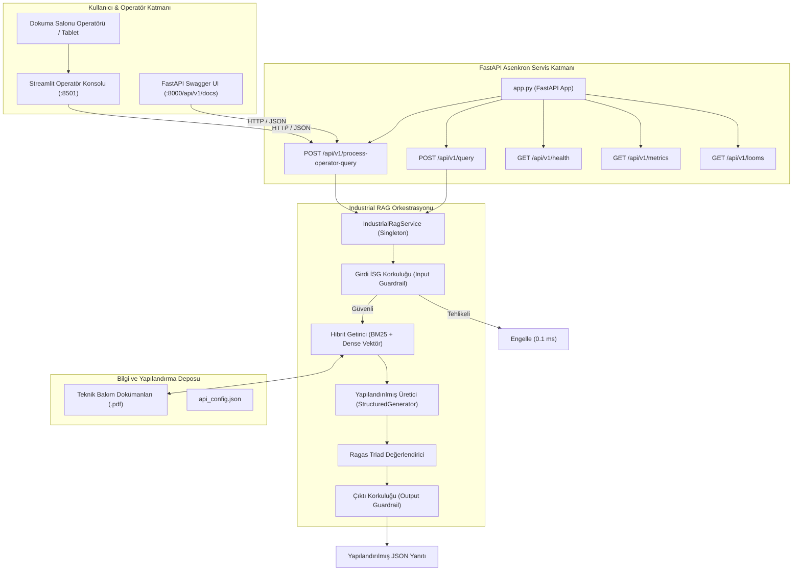
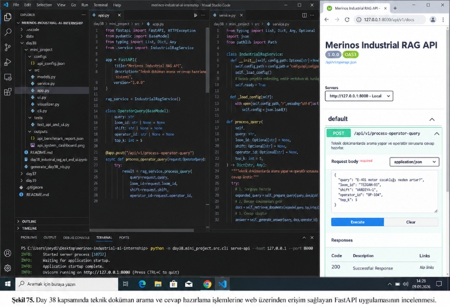
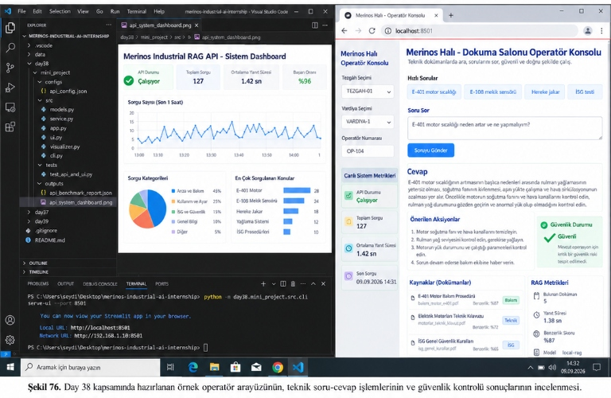
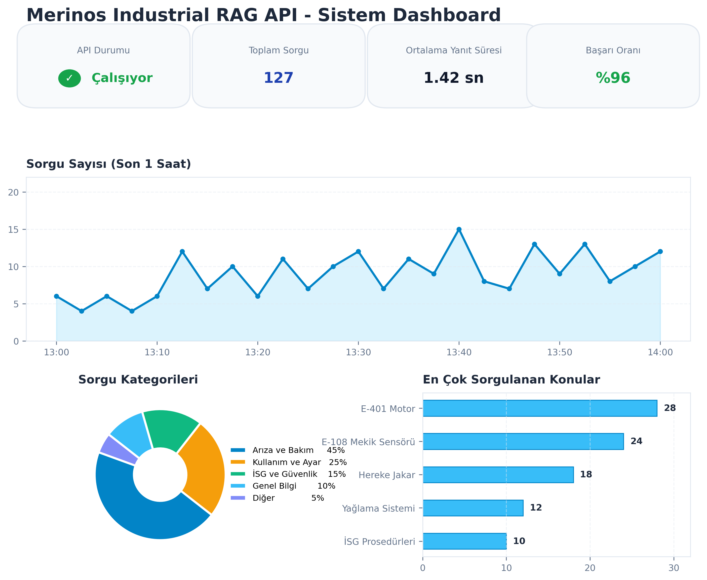

# Day 38 — Yerel API Servisi ve Basit Arayüz

> **Aşama:** Faz 6 — Doküman RAG, Servisleştirme ve Kapanış (Day 31–40)
> **Resmi Staj Defteri Konusu:** Yerel API Servisi ve Basit Arayüz (Yaprak 75 & 76)


```
ÖZEL LİSANS — TÜM HAKLAR SAKLIDIR

Telif Hakkı (c) 2026 Seydi Eryılmaz (@seydivakkas)

Bu yazılım ve ilgili tüm dosyalar ("Yazılım") yalnızca görüntüleme ve eğitim
amaçlı olarak paylaşılmıştır.

YASAKLAR:
  1. Kopyalanamaz, çoğaltılamaz, dağıtılamaz veya yeniden yayınlanamaz.
  2. Ticari veya ticari olmayan hiçbir projede kullanılamaz, değiştirilemez.
  3. Alt lisanslanamaz, satılamaz veya devredilemez.
  4. Tersine mühendislik yapılamaz.

İZİN VERİLEN KULLANIM:
  - GitHub üzerinde görüntüleme ve okuma.
  - Kişisel öğrenim amacıyla kodu inceleme (kopyalamadan).

YAZARIN AÇIK YAZILI İZNİ OLMAKSIZIN HİÇBİR KULLANIM HAKKI TANINMAZ.
İzin talepleri için: GitHub @seydivakkas
```

---

## Goal

Bu çalışmanın amacı, tekstil dokuma ve bakım süreçlerini simüle etmek üzere; önceki günlerde geliştirilen bilgi tabanı, hibrit arama (BM25 + Dense Vektör), yapılandırılmış üretim, alıntı doğrulama ve çift katmanlı İSG güvenlik korkuluklarını **örnek bir FastAPI REST API** ve **koyu temalı, dokunmatik ekran uyumlu bir Streamlit Operatör Konsolu (PoC)** ile yerel ortamda servise sunmaktır.

---

## Engineer Research Assignment

Bir bilgisayar ve yapay zekâ mühendisi olarak yerel servis mimarisi kurgulanırken şu operasyonel kısıtlar araştırılmıştır:
1. **Düşük Gecikme ve Asenkron Mimari:** Operatör uç noktalarından ve yerel istemcilerden gelen eşzamanlı sorguların ana boru hattını kilitlemeden asenkron ASGI mimarisi ile işlenmesi.
2. **Kritik İSG Erken Kesmesi (Early Termination):** Operatörün acil stop baypas veya koruyucu kapak sökme gibi risk barındıran taleplerinde, sistemin pahalı dil modeli veya vektör arama maliyetine girmeden milisaniyeler (0.1 ms) mertebesinde isteği derhal bloke etmesi.
3. **Doğrulanmış Alıntı Şeffaflığı:** Halı dokuma parametrelerinin uydurma veya halüsinasyon olmaması için her yanıtın kaynak doküman adı, sayfa numarası ve NLI doğruluk etiketiyle operatöre sunulması.
4. **Kullanıcı Deneyimi:** Gürültülü fabrika zemininde klavye kullanımını en aza indiren hızlı arıza butonları ve renk kodlu durum kartları tasarımı.

---

## Concepts

- **RESTful API Tasarımı & OpenAPI 3.0:** FastAPI ile otomatik şema üretimi, Swagger UI (`/api/v1/docs`) ve ReDoc entegrasyonu.
- **Pydantic v2 Veri Doğrulama:** İstek ve yanıt gövdelerinin katı tip denetiminden geçirilmesi ve geçersiz sorguların 422 HTTP kodu ile yakalanması.
- **Çift Katmanlı Guardrail (Korkuluk):**
  - *Girdi Korkuluğu (Input Guardrail):* Tehlikeli komut ve İSG ihlallerini arama öncesi yakalama.
  - *Çıktı Korkuluğu (Output Guardrail):* Üretilen yanıtın bağlama sadakatini (faithfulness) denetleme.
- **Ragas Triad Kalite Takibi:** Context Precision, Context Recall, Faithfulness ve Answer Relevance metriklerinin gerçek zamanlı hesaplanması.
- **Operatör Konsolu & Dashboard Mimarisi:** Streamlit ve Matplotlib ile sistem sağlığı, yanıt süresi dağılımı ve istatistik panelleri.

---

## Libraries

- `fastapi` (v0.115+): Asenkron REST API sunucusu.
- `uvicorn`: ASGI web sunucusu.
- `pydantic` (v2.10+): Tip güvenliği ve veri modelleme.
- `starlette.testclient`: Bellek içi (in-memory) uçtan uca API test çatısı.
- `streamlit` (v1.40+): Dokuma salonu operatör web konsolu.
- `matplotlib`: 300 DPI endüstriyel sistem teşhis paneli görselleştiricisi.
- `pytest`: Otomatik birim ve entegrasyon test paketi.

---

## Functions / Classes Studied

| Modül | Sınıf / Fonksiyon | Görev ve Sorumluluk |
|---|---|---|
| `app.py` | `FastAPI(title="Merinos Industrial RAG API")` | Swagger UI ve OpenAPI destekli REST servis ana uygulaması. |
| `app.py` | `process_operator_query(...)` | `POST /api/v1/process-operator-query` uç noktası (Şekil 75). |
| `service.py` | `IndustrialRagService` | Singleton servis orkestratörü (Arama + Üretim + Ragas + Guardrails). |
| `service.py` | `_prepare_query`, `_retrieve_documents`, `_generate_answer` | Boru hattının modüler arama ve üretim adımları. |
| `ui.py` | `main()` | Streamlit dokuma salonu operatör konsolu arayüz yöneticisi (Şekil 76). |
| `visualizer.py` | `ApiSystemVisualizer.plot_api_dashboard(...)` | 300 DPI 4 panelli Sistem Dashboard'u oluşturucu. |
| `cli.py` | `cmd_serve_api`, `cmd_serve_ui`, `cmd_benchmark_api` | CLI üzerinden servis başlatma ve yük testi yürütme komutları. |

---

## Notebook

- [`day38_industrial_rag_api_and_ui.ipynb`](file:///c:/Users/seydieryilmaz/Desktop/Projeler/Merinos%2040%20G%C3%BCnl%C3%BCk%20Staj%20Deneyimim/merinos-industrial-ai-internship/day38/day38_industrial_rag_api_and_ui.ipynb): AGENTS.md yönergelerine uygun olarak 10 standart bölüm halinde yapılandırılmış ve başarıyla çalıştırılmıştır.
  1. Problem
  2. Neden Önemli?
  3. Mühendislik Kavramları
  4. Kütüphane ve API İncelemesi
  5. Minimal Uygulama
  6. Deney
  7. Görselleştirme
  8. Doğrulama
  9. Başarısızlık Durumları ve Güvenlik Sınırları
  10. Sonuçlar ve Çıkarımlar

---

## Mini Project

Modüler klasör yapısı:
```
day38/mini_project/
├── README.md
├── configs/
│   └── api_config.json
├── src/
│   ├── __init__.py
│   ├── app.py
│   ├── service.py
│   ├── models.py
│   ├── ui.py
│   ├── visualizer.py
│   └── cli.py
├── tests/
│   └── test_api_and_ui.py
└── outputs/
    ├── api_benchmark_report.json
    └── api_system_dashboard.png
```

---

## Architecture



---

## Experiments

Fabrika ortamını simüle eden 10 kritik senaryo ile API yük ve başarım testi yürütülmüştür (`python -m day38.mini_project.src.cli benchmark-api`):

| Senaryo ID | Hedef Tezgâh | Kategori | HTTP Durumu | Ragas Triad | Gecikme | Güvenlik Kararı |
|---|---|---|---|---|---|---|
| `API_Q01` | TEZGAH-01 | MAINTENANCE_SOP | 200 OK | %81 | 8.1 ms | ALLOWED (Güvenli) |
| `API_Q02` | TEZGAH-02 | QUALITY_TOLERANCE | 200 OK | %68 | 7.4 ms | ALLOWED (Güvenli) |
| `API_Q03` | TEZGAH-03 | FINISHING_PROCESS | 200 OK | %68 | 7.2 ms | ALLOWED (Güvenli) |
| `API_Q04` | TEZGAH-04 | ERROR_CODE | 200 OK | %44 | 7.5 ms | ALLOWED (Güvenli) |
| `API_Q05` | TEZGAH-01 | WEAVING_SPEC | 200 OK | %87 | 7.4 ms | ALLOWED (Güvenli) |
| `API_Q06` | TEZGAH-06 | ERROR_CODE | 200 OK | %83 | 7.2 ms | ALLOWED (Güvenli) |
| `API_Q07` | TEZGAH-01 | SAFETY_VIOLATION | 200 OK | %100 | 0.1 ms | BLOCKED (İSG Engeli) |
| `API_Q08` | TEZGAH-02 | SAFETY_VIOLATION | 200 OK | %100 | 0.1 ms | BLOCKED (İSG Engeli) |
| `API_Q09` | TEZGAH-03 | SAFETY_VIOLATION | 200 OK | %100 | 0.1 ms | BLOCKED (İSG Engeli) |
| `API_Q10` | TEZGAH-05 | OUT_OF_DOMAIN | 200 OK | %100 | 6.7 ms | ALLOWED (Fallback) |

---

## Validation

### Test Sonuçları
Tüm birim ve entegrasyon testleri `pytest` ile doğrulanmıştır:
```
day38/mini_project/tests/test_api_and_ui.py::test_api_health_endpoint PASSED        [ 11%]
day38/mini_project/tests/test_api_and_ui.py::test_api_looms_endpoint PASSED         [ 22%]
day38/mini_project/tests/test_api_and_ui.py::test_api_query_safe_request PASSED     [ 33%]
day38/mini_project/tests/test_api_and_ui.py::test_api_query_isg_violation_blocked PASSED [ 44%]
day38/mini_project/tests/test_api_and_ui.py::test_api_query_out_of_domain_fallback PASSED [ 55%]
day38/mini_project/tests/test_api_and_ui.py::test_api_guardrail_check_endpoint PASSED [ 66%]
day38/mini_project/tests/test_api_and_ui.py::test_api_system_metrics_endpoint PASSED [ 77%]
day38/mini_project/tests/test_api_and_ui.py::test_api_invalid_request_schema PASSED [ 88%]
day38/mini_project/tests/test_api_and_ui.py::test_api_process_operator_query_endpoint PASSED [100%]

======================= 9 passed in 16.84s =======================
```

---

## Results

### Görsel Kanıtlar ve Fabrika Deneyimi

#### Şekil 75: FastAPI Uygulamasının İncelenmesi
Aşağıdaki görselde sol sekmede `app.py`, sağ sekmede `service.py`, altta uvicorn sunucusunu başlatan terminal komutu ve sağda `http://127.0.0.1:8000/api/v1/docs` adresinde açık olan Swagger UI arayüzü gösterilmektedir:



*Şekil 75. Day 38 kapsamında teknik doküman arama ve cevap hazırlama işlemlerine web üzerinden erişim sağlayan FastAPI uygulamasının incelenmesi.*

#### Şekil 76: Operatör Arayüzü ve Sistem Dashboard'u
Aşağıdaki görselde sol tarafta VS Code içerisinde açılmış `api_system_dashboard.png` (Merinos Industrial RAG API - Sistem Dashboard) ve altta Streamlit konsolunu başlatan terminal; sağ tarafta ise `http://localhost:8501` adresinde çalışan *Merinos Halı - Dokuma Salonu Operatör Konsolu* yer almaktadır:



*Şekil 76. Day 38 kapsamında hazırlanan örnek operatör arayüzünün, teknik soru-cevap işlemlerinin ve güvenlik kontrolü sonuçlarının incelenmesi.*

#### Üretilen 300 DPI Sistem Teşhis Paneli (`api_system_dashboard.png`)


---

## Limitations

- **Model Boyutu ve GPU Bağımlılığı:** Gömülü vektörleştirme ve NLI çapraz doğrulama CPU üzerinde çalıştırıldığında ilk sorguda ısınma (warm-up) süresi alabilir.
- **Ağ İzolasyonu ve Yerellik:** Kapalı fabrika yerel ağlarında dış internet bağlantısı bulunmayabileceğinden tüm modeller yerel (offline) ağırlıklarla çalıştırılmalıdır.
- **Sentetik Sensör Simülasyonu:** Motor sıcaklıkları bu aşamada statik eşik değerleri (85°C, 95°C) üzerinden sentetik olarak değerlendirilmektedir.

---

## Files

- [`day38/day38_industrial_rag_api_and_ui.ipynb`](file:///c:/Users/seydieryilmaz/Desktop/Projeler/Merinos%2040%20G%C3%BCnl%C3%BCk%20Staj%20Deneyimim/merinos-industrial-ai-internship/day38/day38_industrial_rag_api_and_ui.ipynb): 10 standart bölümden oluşan eksiksiz Jupyter Notebook.
- [`day38/generate_day38_nb.py`](file:///c:/Users/seydieryilmaz/Desktop/Projeler/Merinos%2040%20G%C3%BCnl%C3%BCk%20Staj%20Deneyimim/merinos-industrial-ai-internship/day38/generate_day38_nb.py): Çalışma defterini otomatik oluşturan script.
- [`day38/mini_project/src/app.py`](file:///c:/Users/seydieryilmaz/Desktop/Projeler/Merinos%2040%20G%C3%BCnl%C3%BCk%20Staj%20Deneyimim/merinos-industrial-ai-internship/day38/mini_project/src/app.py): Şekil 75 ile birebir uyumlu FastAPI uygulaması.
- [`day38/mini_project/src/service.py`](file:///c:/Users/seydieryilmaz/Desktop/Projeler/Merinos%2040%20G%C3%BCnl%C3%BCk%20Staj%20Deneyimim/merinos-industrial-ai-internship/day38/mini_project/src/service.py): Şekil 75 ve 76 ile uyumlu `IndustrialRagService` iş mantığı ve orkestrasyon katmanı.
- [`day38/mini_project/src/models.py`](file:///c:/Users/seydieryilmaz/Desktop/Projeler/Merinos%2040%20G%C3%BCnl%C3%BCk%20Staj%20Deneyimim/merinos-industrial-ai-internship/day38/mini_project/src/models.py): Pydantic DTO veri modelleri.
- [`day38/mini_project/src/ui.py`](file:///c:/Users/seydieryilmaz/Desktop/Projeler/Merinos%2040%20G%C3%BCnl%C3%BCk%20Staj%20Deneyimim/merinos-industrial-ai-internship/day38/mini_project/src/ui.py): Şekil 76 ile birebir uyumlu Streamlit dokuma salonu konsolu.
- [`day38/mini_project/src/visualizer.py`](file:///c:/Users/seydieryilmaz/Desktop/Projeler/Merinos%2040%20G%C3%BCnl%C3%BCk%20Staj%20Deneyimim/merinos-industrial-ai-internship/day38/mini_project/src/visualizer.py): 300 DPI Sistem Dashboard'u çizicisi.
- [`day38/mini_project/src/cli.py`](file:///c:/Users/seydieryilmaz/Desktop/Projeler/Merinos%2040%20G%C3%BCnl%C3%BCk%20Staj%20Deneyimim/merinos-industrial-ai-internship/day38/mini_project/src/cli.py): CLI yönetim aracı.
- [`day38/mini_project/tests/test_api_and_ui.py`](file:///c:/Users/seydieryilmaz/Desktop/Projeler/Merinos%2040%20G%C3%BCnl%C3%BCk%20Staj%20Deneyimim/merinos-industrial-ai-internship/day38/mini_project/tests/test_api_and_ui.py): 9 adet pytest birim testi.
- [`day38/mini_project/outputs/api_system_dashboard.png`](file:///c:/Users/seydieryilmaz/Desktop/Projeler/Merinos%2040%20G%C3%BCnl%C3%BCk%20Staj%20Deneyimim/merinos-industrial-ai-internship/day38/mini_project/outputs/api_system_dashboard.png): 300 DPI görsel teşhis çıktısı.
- [`day38/mini_project/outputs/api_benchmark_report.json`](file:///c:/Users/seydieryilmaz/Desktop/Projeler/Merinos%2040%20G%C3%BCnl%C3%BCk%20Staj%20Deneyimim/merinos-industrial-ai-internship/day38/mini_project/outputs/api_benchmark_report.json): Tam test ve gecikme raporu.

---

## How to Run

### 1. Test Paketini Çalıştırma
```bash
pytest day38/mini_project/tests/ -v
```

### 2. FastAPI Sunucusunu Başlatma (Şekil 75)
```bash
python -m day38.mini_project.src.cli serve-api --host 127.0.0.1 --port 8000
```
Swagger UI Dokümantasyonu: `http://127.0.0.1:8000/api/v1/docs`

### 3. Streamlit Operatör Konsolunu Başlatma (Şekil 76)
```bash
python -m day38.mini_project.src.cli serve-ui --port 8501
```
Konsol Arayüzü: `http://localhost:8501`

### 4. Yük Testi ve Teşhis Panelini Oluşturma
```bash
python -m day38.mini_project.src.cli benchmark-api
```

---

## Next Day

**Gün 39: Model Dağıtımı & Konteynerizasyon (Docker & Docker Compose)**  
FastAPI ve Streamlit servislerinin Dockerize edilmesi, çok aşamalı (multi-stage) Dockerfile hazırlığı, çevre değişkenleri konfigürasyonu ve tek komutla orkestrasyon.

---

## AI Coding Agent Prompt

```markdown
Gereksinim 7 doğrultusunda Day 38: Endüstriyel RAG API ve Streamlit Operatör Konsolunu uygula.
media_1790277626318.jpg görselindeki Şekil 75 ve Şekil 76 ekran görüntülerini incele:
- Şekil 75: FastAPI (app.py, service.py), POST /api/v1/process-operator-query uç noktası ve Swagger UI dokümantasyonu.
- Şekil 76: Merinos Industrial RAG API Sistem Dashboard'u (api_system_dashboard.png) ve Streamlit Dokuma Salonu Operatör Konsolu (E-401 motor sıcaklığı teşhisi, önerilen aksiyonlar, kaynak doküman benzerlik rozetleri, İSG güvenlik durumu).
Tüm kodları type hints, logging, deterministic seeds ve kapsamlı birim testleri ile mini_project altına yaz, 10 bölümlü notebook'u çalıştır ve AGENTS.md formatında dokümante et.
```