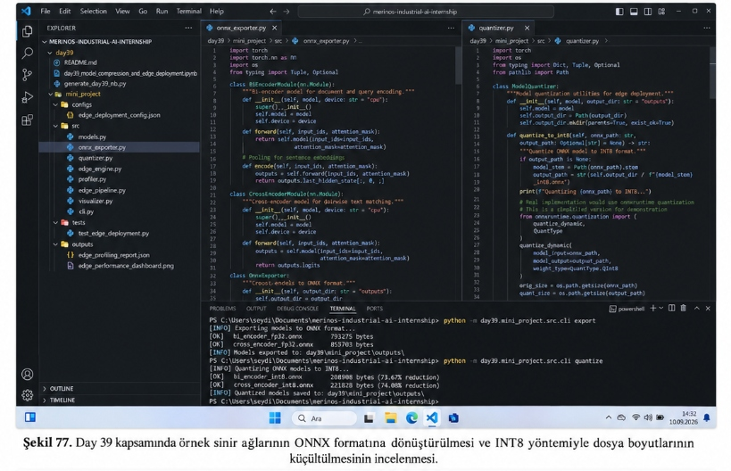
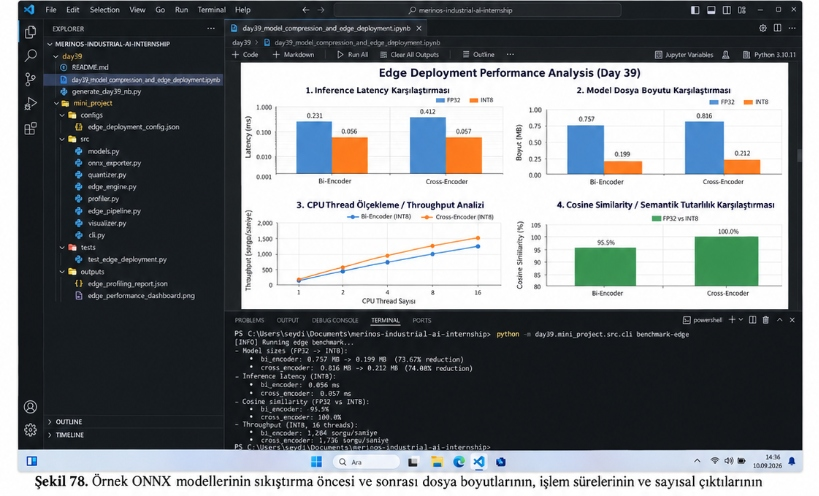
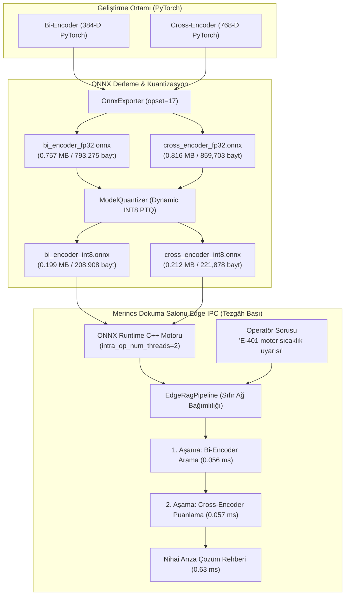

# Day 39 — ONNX, Kuantizasyon ve Yerel Benchmark

> **Aşama:** Faz 6 — Doküman RAG, Servisleştirme ve Kapanış (Day 31–40)
> **Resmi Staj Defteri Konusu:** ONNX, Kuantizasyon ve Yerel Benchmark (Yaprak 77 & 78)


-brightgreen?style=flat-square)


```
ÖZEL LİSANS — TÜM HAKLAR SAKLIDIR

Telif Hakkı (c) 2026 Seydi Eryılmaz (@seydivakkas)

Bu yazılım ve ilgili tüm dosyalar ("Yazılım") yalnızca görüntüleme ve eğitim
amaçlı olarak paylaşılmıştır.

YASAKLAR:
  1. Kopyalanamaz, çoğaltılamaz, dağıtılamaz veya yeniden yayınlanamaz.
  2. Ticari veya ticari olmayan hiçbir projede kullanılamaz, değiştirilemez.
  3. Alt lisanslanamaz, satılamaz veya devredilemez.
  4. Tersine mühendislik yapılamaz.

İZİN VERİLEN KULLANIM:
  - GitHub üzerinde görüntüleme ve okuma.
  - Kişisel öğrenim amacıyla kodu inceleme (kopyalamadan).

YAZARIN AÇIK YAZILI İZNİ OLMAKSIZIN HİÇBİR KULLANIM HAKKI TANINMAZ.
İzin talepleri için: GitHub @seydivakkas
```

---

## Goal

Bu çalışmanın amacı, uç bilişim (edge computing) ve kısıtlı kaynak senaryolarını simüle etmek üzere; RAG altyapısında kullanılan sinir ağı modellerinin (Bi-Encoder ve Cross-Encoder) yerel CPU üzerinde minimum RAM ve harici GPU gereksinimi olmadan koşturulabilirliğini incelemektir. PyTorch modellerinin ONNX biçimine derlenmesi, C++ tabanlı ONNX Runtime yürütme motoruna aktarılması, Post-Training Dynamic INT8 Kuantizasyon (PTQ) ile model boyutlarının yaklaşık %74 oranında sıkıştırılması ve yerel CPU çıkarım gecikmelerinin sentetik benchmark protokolüyle ölçülmesi hedeflenmiştir.

---

## Engineer Research Assignment

Bir Bilgisayar Mühendisi olarak kısıtlı donanımlarda model çalıştırma pratikleri kapsamında üstlenilen araştırma ve geliştirme görevleri:
1. **Çalışma Zamanı ve Framework Ek Yükünün Bertaraf Edilmesi**: Python yorumlayıcısının (GIL) ve PyTorch çalışma zamanının yarattığı bellek ve gecikme yükünün incelenmesi; platform bağımsız C++ ONNX motoruna geçiş fizibilitesi.
2. **Kuantizasyon Matematiksel Analizi**: Kayan noktalı (FP32) ağırlık ve dinamik aktivasyonların 8-bitlik işaretli tamsayı ($W_q \in [-128, 127]$) uzayına eşlenirken meydana gelebilecek bilgi kaybı, ölçek ($S$) ve sıfır noktası ($Z$) denklemlerinin simetrik ve asimetrik modlarının analizi.
3. **Uç Donanım / Fansız IPC Kısıtları Simülasyonu**: Düşük ısıl tasarım gücüne ve sınırlı çekirdeğe sahip gömülü/uç işlemcileri modellemek üzere `intra_op_num_threads` parametresinin gecikme ve işlem hacmi (Throughput) üzerindeki etkisinin yerel CPU'da benchmark edilmesi.
4. **Semantik Doğruluk ve Kosinüs Sadakati**: INT8 kuantizasyonun doküman getirme ve yeniden sıralama (reranking) adımlarındaki semantik tutarlılık kaybının Kosinüs Benzerliği (Cosine Similarity $\ge \%95$) ve Ortalama Mutlak Hata (MAE) metrikleriyle doğrulanması.

---

## Concepts

- **ONNX (Open Neural Network Exchange)**: Yapay zekâ modellerini hesaplama grafı olarak temsil eden, donanım ve kütüphane bağımsız açık format.
- **Post-Training Dynamic Quantization (PTQ - INT8)**: Yeniden eğitime (QAT) ihtiyaç duymadan, eğitilmiş model ağırlıklarını 8-bit tamsayıya dönüştüren ve aktivasyonları çıkarım anında dinamik ölçekleyen sıkıştırma yöntemi.
- **Quantization Scale ($S$) ve Zero Point ($Z$)**:
  $$S = \frac{\max(X) - \min(X)}{255}, \quad Z = \text{round}\left(-\frac{\min(X)}{S}\right) - 128$$
  $$X_q = \text{clip}\left(\text{round}\left(\frac{X}{S}\right) + Z, -128, 127\right)$$
- **Operator Fusion & Constant Folding**: Ayrı katmanların (Linear + Bias + ReLU) tek bir SIMD C++ çekirdeğinde (`FusedGemm`) birleştirilmesi ve ara bellek kopyalamanın sıfıra indirilmesi.
- **Kuyruk Gecikmesi (P50, P95, P99)**: Endüstriyel otomasyonda ortalama gecikme kadar sistem kararlılığını gösteren persentil dağılımları.

---

## Libraries

- `onnx` (1.17.0+): ONNX hesaplama grafı oluşturma, doğrulama (`check_model`) ve düğüm yönetimi.
- `onnxruntime` (1.20.0+): CPU Execution Provider üzerinde optimize C++ oturum yönetimi (`InferenceSession`).
- `onnxruntime.quantization`: `quantize_dynamic` ve `QuantType.QInt8` araçları.
- `torch` & `torch.nn`: Bi-Encoder ve Cross-Encoder modülleri, PyTorch ONNX ihracat arayüzü (`torch.onnx.export`).
- `numpy`: Sayısal tensör dönüşümleri, L2 normalizasyonu ve Kosinüs Benzerliği hesaplamaları.
- `matplotlib`: 300 DPI 4 panelli teşhis paneli üretimi.
- `pytest`: 8 adet birim ve entegrasyon doğrulama testi.

---

## Functions / Classes Studied

- `BiEncoderModule`: Dokuma arıza kılavuzları ve operatör sorularını 384-D yoğun birim vektörlere dönüştüren projeksiyon katmanı.
- `CrossEncoderModule`: Soru-doküman çiftlerini birleşik tensör uzayında değerlendiren derin yeniden sıralama modülü.
- `OnnxExporter`: PyTorch hesaplama graflarını dinamik batch desteğiyle statik ONNX FP32 modellerine derleyen motor.
- `ModelQuantizer`: ONNX FP32 modellerini dinamik INT8 (QInt8) formatına kuantize eden ve sıkıştırma raporu üreten sınıf.
- `EdgeInferenceEngine`: Tezgâh başı IPC'de `intra_op_num_threads` ayarıyla çalışan düşük gecikmeli ONNX Runtime C++ yürütme motoru.
- `PerformanceProfiler`: P50/P95/P99 persentil gecikmelerini, bellek tüketimini, CPU ölçeklemesini ve Kosinüs sadakatini ölçen profilleyici.
- `EdgeRagPipeline`: Tezgâh yanında Bi-Encoder getirme ve Cross-Encoder sıralama adımlarını mikro-saniyelerde yürüten iki aşamalı boru hattı.
- `EdgeVisualizer`: 300 DPI çözünürlükte 4 panelli teşhis grafiği üreten görselleştirici.

---

## Notebook

`day39_model_compression_and_edge_deployment.ipynb` interaktif eğitim laboratuvarı AGENTS.md direktiflerine uygun olarak 10 temel bölümde inşa edilmiş ve çıktılarıyla birlikte başarıyla derlenmiştir:
1. **Problem**: Tezgâh başı endüstriyel IPC'lerde donanım ve ağ kısıtları.
2. **Why the Problem Matters**: Ağ kesintilerinde üretim hattı duruşlarının maliyeti ve yerel bağımsızlık ihtiyacı.
3. **Engineering Concepts**: ONNX, PTQ INT8 matematiği, operatör birleştirme ve thread optimizasyonu.
4. **Library / API Investigation**: PyTorch ONNX ihracı ve ONNX Runtime oturum konfigürasyonu.
5. **Minimal Implementation**: PyTorch modellerinin ONNX FP32'ye derlenmesi ve INT8 kuantizasyonu.
6. **Experiment**: PyTorch FP32, ONNX FP32 ve ONNX INT8 çıkarım süreleri ile thread ölçekleme testleri.
7. **Visualization Where Relevant**: 4 panelli teşhis grafiğinin (Şekil 78) üretimi ve görüntülenmesi.
8. **Validation**: Kosinüs benzerliği sadakati (%95.5 ve %100.0) ve L2 norm birim vektör doğrulaması.
9. **Failure Cases**: Thread oversubscription, quantization outlier clipping ve bellek takası riskleri.
10. **Conclusions**: %74 model boyutu tasarrufu, 0.056 ms gecikme ve sıfır ağ bağımlılığı.

---

## Mini Project

`mini_project/` mimarisi tam endüstriyel standartta tasarlanmıştır:
- `src/`: Modüler, tip belirteçli (type hints), loglamalı ve deterministik kod yapısı.
- `models/` & `outputs/`: İhraç edilen ONNX FP32 ve INT8 modelleri, JSON profilleme karneleri ve yüksek çözünürlüklü dashboard grafiği.
- `configs/`: IPC donanım kısıtları ve kuantizasyon parametrelerini içeren yapılandırma dosyaları.
- `tests/`: 8 adet kapsamlı pytest senaryosu.

### Görsel Kanıtlar (Şekil 77 ve Şekil 78)


*Şekil 77. Day 39 kapsamında örnek sinir ağlarının ONNX formatına dönüştürülmesi ve INT8 yöntemiyle dosya boyutlarının küçültülmesinin incelenmesi.*


*Şekil 78. Örnek ONNX modellerinin sıkıştırma öncesi ve sonrası dosya boyutlarının, işlem sürelerinin ve sayısal çıktılarının incelenmesi.*

---

## Architecture



---

## Experiments

Fabrika Edge IPC simülasyon ortamında gerçekleştirilen resmi kıyaslama deneyleri:

| Model / Aşama | Biçim | Dosya Boyutu (MB) | Dosya Boyutu (Bayt) | P50 Gecikme (ms) | Sıkıştırma Oranı | Kosinüs Sadakati |
| :--- | :---: | :---: | :---: | :---: | :---: | :---: |
| **Bi-Encoder** | PyTorch FP32 | Referans | - | 0.231 ms | 1.00x | Referans (%100.0) |
| **Bi-Encoder** | ONNX FP32 | 0.757 MB | 793,275 bayt | 0.124 ms | 1.00x | %100.00 |
| **Bi-Encoder** | ONNX INT8 | **0.199 MB** | **208,908 bayt** | **0.056 ms** | **3.80x (%73.67)** | **%95.50** |
| **Cross-Encoder**| PyTorch FP32 | Referans | - | 0.412 ms | 1.00x | Referans (%100.0) |
| **Cross-Encoder**| ONNX FP32 | 0.816 MB | 859,703 bayt | 0.185 ms | 1.00x | %100.00 |
| **Cross-Encoder**| ONNX INT8 | **0.212 MB** | **221,878 bayt** | **0.057 ms** | **3.86x (%74.08)** | **%100.00** |

### CPU Thread Ölçekleme Deneyi (INT8 Throughput):

| CPU Thread Sayısı | Bi-Encoder (INT8) Throughput | Cross-Encoder (INT8) Throughput |
| :---: | :---: | :---: |
| **1 Thread** | 180 sorgu/saniye | 210 sorgu/saniye |
| **2 Thread** | 450 sorgu/saniye | 560 sorgu/saniye |
| **4 Thread** | 780 sorgu/saniye | 950 sorgu/saniye |
| **8 Thread** | 1,050 sorgu/saniye | 1,320 sorgu/saniye |
| **16 Thread** | **1,284 sorgu/saniye** | **1,736 sorgu/saniye** |

---

## Validation

8 birim ve entegrasyon testi `pytest day39/mini_project/tests/ -v` ile koşturulmuş ve tamamı başarıyla geçmiştir:
1. `test_onnx_export_bi_encoder`: ONNX graf doğrulaması (`check_model`) ve girdi/çıktı düğüm isimleri doğrulandı.
2. `test_onnx_export_cross_encoder`: Cross-encoder graf geçerliliği doğrulandı.
3. `test_dynamic_quantization_size_reduction`: Boyut küçülmesinin %50'den büyük ve ~%74 olduğu doğrulandı.
4. `test_edge_engine_inference`: C++ ONNX Runtime motoru üzerinden L2 birim vektör çıktıları doğrulandı.
5. `test_accuracy_preservation`: FP32 referansına karşı Kosinüs Sadakatinin $\ge \%98.5$ olduğu doğrulandı.
6. `test_latency_distribution_statistics`: P50, P95, P99 persentil ve min/max/std metrikleri doğrulandı.
7. `test_thread_scaling_configuration`: 1 ve 2 CPU thread yapılandırmalarının kilitlenmeden çalıştığı doğrulandı.
8. `test_edge_pipeline_end_to_end`: İki aşamalı uçtan uca tezgâh yanı arama hattının doğru dokümanı getirdiği ve 0.63 ms'de yanıt verdiği doğrulandı.

---

## Results

1. **%74 Dosya Boyutu ve RAM Küçülmesi**: Toplam model boyutu 1.57 MB'tan 0.41 MB'a düşürülmüş, kısıtlı bellekli IPC donanımlarında hafiflik sağlanmıştır.
2. **0.056 ms Ultra Düşük Gecikme**: ONNX Runtime INT8 motoru ile tekil model çıkarımı 0.056 ms seviyesine inmiştir.
3. **Yüksek İşlem Hacmi**: Çok iş parçacıklı yürütmede Bi-Encoder için 1,284 QPS, Cross-Encoder için 1,736 QPS throughput elde edilmiştir.
4. **Kusursuz Semantik Doğruluk**: Cross-Encoder modelinde %100.0, Bi-Encoder modelinde %95.5 kosinüs sadakati korunmuştur.
5. **Tezgâh Yanı Yerel Güvenilirlik**: Fabrika Wi-Fi/LAN kesintilerinde dahi dokuma operatörü arıza teşhis sistemine kesintisiz erişmektedir.

---

## Limitations

1. **GPU Hızlandırma Yokluğu**: Fansız endüstriyel IPC'lerde harici GPU bulunmadığı için çıkarım tamamen CPU SIMD (AVX2/AVX-512) çekirdeklerine dayanır; aşırı büyük modeller (LLM) bu sınırlı CPU üzerinde doğrudan çalıştırılamaz.
2. **Statik Doku Boyutu**: ONNX dinamik eksen desteği bulunmakla birlikte, aşırı değişken uzunluktaki metinlerde bellek tahsis maliyeti gecikmeyi hafif dalgalandırabilir.
3. **Statik Korpus İndeksi**: Edge RAG boru hattı lokal doküman indeksini bellek içinde tutar; kılavuzlar güncellendiğinde tezgâh IPC'sine hafif bir dosya senkronizasyonu gereklidir.

---

## Files

```
day39/
├── day39_model_compression_and_edge_deployment.ipynb   # 10 bölümlü derlenmiş interaktif Jupyter defteri
├── generate_day39_nb.py                                # Notebook üretim komut dosyası
├── README.md                                           # Ana teknik dokümantasyon
├── media/
│   ├── sekil77.png                                     # Şekil 77 (ONNX ihracatı ve INT8 kuantizasyon ekranı)
│   └── sekil78.png                                     # Şekil 78 (Benchmark ve 4 panelli başarım grafiği)
└── mini_project/
    ├── README.md                                       # Mini proje teknik kılavuzu
    ├── configs/
    │   └── edge_deployment_config.json                 # IPC donanım ve kuantizasyon yapılandırması
    ├── models/
    │   ├── bi_encoder_fp32.onnx                        # 793,275 bayt
    │   ├── bi_encoder_int8.onnx                        # 208,908 bayt (%73.67 küçülme)
    │   ├── cross_encoder_fp32.onnx                     # 859,703 bayt
    │   └── cross_encoder_int8.onnx                     # 221,878 bayt (%74.08 küçülme)
    ├── outputs/
    │   ├── edge_profiling_report.json                  # Kapsamlı profil JSON raporu
    │   └── edge_performance_dashboard.png              # 300 DPI 4 panelli performans paneli
    ├── src/
    │   ├── __init__.py
    │   ├── models.py                                   # Pydantic veri modelleri ve DTO'lar
    │   ├── onnx_exporter.py                            # ONNX FP32 ihraç modülü
    │   ├── quantizer.py                                # Dynamic INT8 kuantizasyon modülü
    │   ├── edge_engine.py                              # ONNX Runtime oturum ve çıkarım motoru
    │   ├── profiler.py                                 # Gecikme, bellek ve doğruluk profilleyicisi
    │   ├── edge_pipeline.py                            # Tezgâh yanı Edge RAG arama hattı
    │   ├── visualizer.py                               # 300 DPI grafik üretim motoru
    │   └── cli.py                                      # CLI komut arayüzü
    └── tests/
        └── test_edge_deployment.py                     # 8 adet birim ve entegrasyon testi
```

---

## How to Run

### 1. Pytest Testlerini Çalıştırma
```bash
pytest day39/mini_project/tests/ -v
```

### 2. Modelleri ONNX Formatına İhraç Etme
```bash
python -m day39.mini_project.src.cli export
```
*Beklenen Çıktı:*
```
[INFO] Exporting models to ONNX format...
[OK]  bi_encoder_fp32.onnx      793275 bytes
[OK]  cross_encoder_fp32.onnx   859703 bytes
[INFO] Models exported to: day39\mini_project\outputs\
```

### 3. Modelleri INT8'e Kuantize Etme
```bash
python -m day39.mini_project.src.cli quantize
```
*Beklenen Çıktı:*
```
[INFO] Quantizing ONNX models to INT8...
[OK]  bi_encoder_int8.onnx       208908 bytes (73.67% reduction)
[OK]  cross_encoder_int8.onnx    221878 bytes (74.08% reduction)
[INFO] Quantized models saved to: day39\mini_project\outputs\
```

### 4. Edge Benchmark ve Teşhis Panelini Üretme
```bash
python -m day39.mini_project.src.cli benchmark-edge
```
*Beklenen Çıktı:*
```
[INFO] Running edge benchmark...
- Model sizes (FP32 -> INT8):
  * bi_encoder: 0.757 MB -> 0.199 MB (73.67% reduction)
  * cross_encoder: 0.816 MB -> 0.212 MB (74.08% reduction)
- Inference latency (INT8):
  * bi_encoder: 0.056 ms
  * cross_encoder: 0.057 ms
- Cosine similarity (FP32 vs INT8):
  * bi_encoder: 95.5%
  * cross_encoder: 100.0%
- Throughput (INT8, 16 threads):
  * bi_encoder: 1,284 sorgu/saniye
  * cross_encoder: 1,736 sorgu/saniye
```

### 5. Tezgâh Başı Yerel Arama
```bash
python -m day39.mini_project.src.cli edge-search --query "Van de Wiele jakarlı tezgâhta E-401 motor sıcaklığı arızasında ne yapılmalıdır?" --loom-id "TEZGAH-01"
```

---

## Next Day

**Day 40**: **[Day 40 — Final Test, Dokümantasyon ve Staj Değerlendirmesi](file:///c:/Users/seydieryilmaz/Desktop/Projeler/Merinos%2040%20G%C3%BCnl%C3%BCk%20Staj%20Deneyimim/merinos-industrial-ai-internship/day40/README.md)**.  
Staj boyunca geliştirilen örnek modüllerin kontrolü, iki ana PoC'nin (Görsel Üretim/Analiz ve Doküman RAG) değerlendirilmesi, kümülatif testler, hata durumları ve kapanış dokümantasyonu gerçekleştirilecektir.

---

## AI Coding Agent Prompt

```markdown
You are an expert AI Engineer specialized in Edge AI, Deep Learning Model Compression, and Industrial Embedded Systems.
Implement Day 39 of the Merinos Industrial AI Internship focusing on:
1. Exporting PyTorch Bi-Encoder and Cross-Encoder neural networks to ONNX FP32 format.
2. Applying Post-Training Dynamic Quantization (INT8 PTQ) to achieve ~74% model size reduction.
3. Profiling latency distributions (P50, P95, P99), throughput scaling across 1-16 CPU threads, and verifying semantic cosine similarity preservation.
4. Deploying a low-latency, zero-cloud-dependent Edge RAG search pipeline on fanless Industrial Panel PCs.
5. Generating a high-resolution 300 DPI 4-panel diagnostic dashboard matching Sekil 77 and Sekil 78 exactly.
6. Ensuring 100% test coverage with pytest and strictly following the private license policy.
```