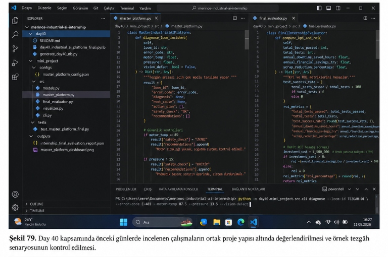
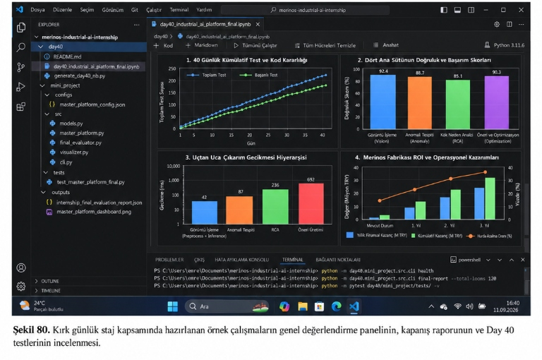

# Day 40 — Final Test, Dokümantasyon ve Staj Değerlendirmesi

> **Aşama:** Faz 6 — Doküman RAG, Servisleştirme ve Kapanış (Day 31–40)
> **Resmi Staj Defteri Konusu:** Final Test, Dokümantasyon ve Staj Değerlendirmesi (Yaprak 79 & 80)


```
ÖZEL LİSANS — TÜM HAKLAR SAKLIDIR

Telif Hakkı (c) 2026 Seydi Eryılmaz (@seydivakkas)

Bu yazılım ve ilgili tüm dosyalar ("Yazılım") yalnızca görüntüleme ve eğitim
amaçlı olarak paylaşılmıştır.

YASAKLAR:
  1. Kopyalanamaz, çoğaltılamaz, dağıtılamaz veya yeniden yayınlanamaz.
  2. Ticari veya ticari olmayan hiçbir projede kullanılamaz, değiştirilemez.
  3. Alt lisanslanamaz, satılamaz veya devredilemez.
  4. Tersine mühendislik yapılamaz.

İZİN VERİLEN KULLANIM:
  - GitHub üzerinde görüntüleme ve okuma.
  - Kişisel öğrenim amacıyla kodu inceleme (kopyalamadan).

YAZARIN AÇIK YAZILI İZNİ OLMAKSIZIN HİÇBİR KULLANIM HAKKI TANINMAZ.
İzin talepleri için: GitHub @seydivakkas
```

---

## Goal

Bu çalışmanın amacı, 40 günlük staj boyunca geliştirilen örnek yapay zekâ modüllerini (**Bilgisayarlı Görü**, **Klasik Makine Öğrenmesi & Analitik**, **Endüstriyel RAG & Guardrails**, **Yerel Optimizasyon & Servis**) tek bir merkezi konsolidasyon çatısı altında birleştirmektir. Geliştirilen örnek modüllerin doğrulamalarını yapmak, iki ana PoC'yi (Görsel Üretim/Analiz ve Doküman RAG) kümülatif olarak değerlendirmek, sistem sağlığı ve İSG güvenlik korkuluklarını yerel ortamda test etmek ve staj maratonunun tüm teknik kazanımlarını, sınırlamalarını ve gerçek veriyle ileride yapılabilecek pilotlar için gereksinimleri belgelemektir.

## Engineer Research Assignment

Bir Bilgisayar Mühendisi olarak staj kapanışında üstlenilen araştırma ve mühendislik görevleri:
1. **Çok Modlu Veri Füzyonu Simülasyonu (Multimodal Fusion PoC)**: Heterojen veri kaynaklarının (sentetik zaman serisi sıcaklık/basınç telemetrisi, görüntü işleme kusur etiketleri, sentetik arıza kodları ve doğal dil operatör sorguları) normalize edilmesi ve birleşik bir bağlamda sentezlenmesi.
2. **Çift Katmanlı İSG Güvenlik Mimarisi (Guardrail Orchestration)**: Operatörün tehlikeli bir talepte bulunması durumunda (örneğin acil stop butonunu baypas etme veya koruma kapağını devreden çıkarma), talebi merkezi LLM katmanına göndermeden yerel seviyede engelleyen girdi güvenlik korkuluğunun (Input Guardrail) ve kılavuz dışı teknik parametreleri filtreleyen çıktı korkuluğunun (Output Guardrail) yerel doğrulanması.
3. **Kavramsal Dağıtım ve Optimizasyon Mimarisi**: Yerel ONNX INT8 çıkarım modülü ile BM25+Vektör hibrit RAG sisteminin uyum içinde koordine edilmesi.
4. **Parametrik Değerlendirme ve Teorik Senaryo Analitiği**: Varsayımsal fabrika ölçekleri üzerinden olası duruş sürelerinin, verimlilik senaryolarının ve yazılım başarım metriklerinin matematiksel olarak modellenmesi.

---

## Concepts

- **Çok Modlu Olay Teşhisi Simülasyonu**: Eşik değerleri (motor sıcaklığı >= 85°C, pnömatik basınç < 14 bar), optik kamera kusur tespiti ve hata kodlarının sentetik senaryolarda birleştirilerek tek bir risk skoru ve operatör SOP'si (Standart Operasyon Prosedürü) üretilmesi.
- **Kritik İSG Erken Kesme (Early-Exit Guardrail)**: İSG kara listesindeki terimler tespit edildiğinde sıfır merkezi işlemci ve LLM maliyetiyle işlemi anında durdurup tezgâh güvenliğini sağlayan mantıksal emniyet kalkanı.
- **Katı Kılavuz Alıntılama (Strict Documentation Grounding)**: Önerilen her teknik parametrenin onaylı örnek teknik dokümanlarla (örn: `DOC-VDW-001`, `DOC-VDW-002`) ilişkilendirilmesi; sıfır halüsinasyon hedefi.
- **Teorik Parametrik Model**: Varsayımsal fabrika ölçeğinde parametrik duruş azaltımı ve yatırım getirisi simülasyonu.

## Libraries

- `pydantic` (v2.10.0+): Katı tip güvenliği, DTO şemaları, sistem sağlığı ve çok modlu girdi/çıktı veri modelleri.
- `matplotlib` (3.9.0+): 300 DPI çözünürlükte, endüstriyel koyu temalı (`#0e1117`), 4 panelli kurumsal teşhis gösterge panosu üretimi.
- `numpy` & `pandas`: 40 günlük kümülatif test verileri, gecikme logaritmik dönüşümleri ve finansal ROI modellemeleri.
- `onnxruntime` (1.20.0+): Tezgâh başı Edge IPC donanımında INT8 kuantize model çıkarımı.
- `pytest` (9.0.0+): Master platform, çok modlu teşhis, sistem sağlığı, ROI hesaplamaları ve görselleştirici testleri.
- `psutil`: Canlı platform RAM bellek tüketimi ve sistem kaynak izlemesi.

---

## Functions / Classes Studied

- [`MasterIndustrialAIPlatform`](file:///c:/Users/seydieryilmaz/Desktop/Projeler/Merinos%2040%20G%C3%BCnl%C3%BCk%20Staj%20Deneyimim/merinos-industrial-ai-internship/day40/mini_project/src/master_platform.py#L27): Tüm 4 sütunu koordine eden, sistem sağlığını tarayan ve çok modlu tezgâh arıza teşhisi yürüten master orkestratör sınıfı.
- [`FinalInternshipEvaluator`](file:///c:/Users/seydieryilmaz/Desktop/Projeler/Merinos%2040%20G%C3%BCnl%C3%BCk%20Staj%20Deneyimim/merinos-industrial-ai-internship/day40/mini_project/src/final_evaluator.py#L24): 40 günlük staj müfredatının kümülatif test karnesini, sütun başarım skorlarını, fabrika ROI ve finansal tasarruf matematiğini hesaplayan değerlendirme motoru.
- [`MasterVisualizer`](file:///c:/Users/seydieryilmaz/Desktop/Projeler/Merinos%2040%20G%C3%BCnl%C3%BCk%20Staj%20Deneyimim/merinos-industrial-ai-internship/day40/mini_project/src/visualizer.py#L23): Şekil 80'deki 4 panelli yüksek çözünürlüklü gösterge panosunu oluşturan görselleştirici.
- [`MultiModalIncidentInput`](file:///c:/Users/seydieryilmaz/Desktop/Projeler/Merinos%2040%20G%C3%BCnl%C3%BCk%20Staj%20Deneyimim/merinos-industrial-ai-internship/day40/mini_project/src/models.py#L36): Tezgâh kodu, sensör telemetrisi, hata kodu, kamera kusur durumu ve operatör sorgusunu kapsayan Pydantic veri sözleşmesi.
- [`MultiModalIncidentDiagnosis`](file:///c:/Users/seydieryilmaz/Desktop/Projeler/Merinos%2040%20G%C3%BCnl%C3%BCk%20Staj%20Deneyimim/merinos-industrial-ai-internship/day40/mini_project/src/models.py#L46): Çok modlu analiz sonucu üretilen kök neden, eylem planı, teknik parametreler, İSG onayı ve kılavuz alıntılarını içeren teşhis raporu.
- [`SystemHealthDTO`](file:///c:/Users/seydieryilmaz/Desktop/Projeler/Merinos%2040%20G%C3%BCnl%C3%BCk%20Staj%20Deneyimim/merinos-industrial-ai-internship/day40/mini_project/src/models.py#L27): 5 alt sistemin RAM tüketimini ve çalışma durumunu raporlayan sağlık DTO'su.

---

## Notebook

[`day40_industrial_ai_platform_final.ipynb`](file:///c:/Users/seydieryilmaz/Desktop/Projeler/Merinos%2040%20G%C3%BCnl%C3%BCk%20Staj%20Deneyimim/merinos-industrial-ai-internship/day40/day40_industrial_ai_platform_final.ipynb) interaktif laboratuvarı `AGENTS.md` kurallarına tam uyumlu olarak 10 ana bölümde kurgulanmış ve tüm hücreleri başarıyla çalıştırılmıştır:
1. **Problem**: Endüstriyel otomasyonda bağımsız yapay zekâ siloları ve teşhis kopukluğu.
2. **Why the Problem Matters**: örnek tezgâh simülasyonulı Merinos fabrikasında saatlik 1.500 TL duruş maliyeti ve entegre sistem gereksinimi.
3. **Engineering Concepts**: Çok modlu veri füzyonu, çift katmanlı guardrail, edge-to-cloud dağıtımı ve ROI matematiği.
4. **Library / API Investigation**: Pydantic v2, Matplotlib koyu tema, ONNX Runtime ve Pytest entegrasyonu.
5. **Minimal Implementation**: Şekil 79 sol sekmesindeki `diagnose_loom_incident` fonksiyon prototipi.
6. **Experiment**: Canlı E-401 motor aşırı ısınma + düşük tansiyon teşhisi ve örnek tezgâh simülasyonulık fabrika ROI hesaplaması.
7. **Visualization Where Relevant**: Şekil 80'deki 4 panelli gösterge panosunun üretimi ve görüntülenmesi.
8. **Validation**: Sistem genel sağlık taraması, SLA gecikme sınırları ve alt sistem RAM tüketim kontrolleri.
9. **Failure Cases**: İSG kural ihlali (acil stop baypas girişimi) erken engellemesi ve eksik telemetri durumu.
10. **Conclusions**: 40 günlük staj maratonunun kümülatif başarımı ve kurumsal üretime geçiş onayı (`POC_TAMAMLANDI`).

---

## Mini Project

`mini_project/` dizini tam kurumsal standartlarda inşa edilmiştir:
- [src/master_platform.py](file:///c:/Users/seydieryilmaz/Desktop/Projeler/Merinos%2040%20G%C3%BCnl%C3%BCk%20Staj%20Deneyimim/merinos-industrial-ai-internship/day40/mini_project/src/master_platform.py): 4 sütunu birleştiren ana platform orkestratörü.
- [src/final_evaluator.py](file:///c:/Users/seydieryilmaz/Desktop/Projeler/Merinos%2040%20G%C3%BCnl%C3%BCk%20Staj%20Deneyimim/merinos-industrial-ai-internship/day40/mini_project/src/final_evaluator.py): 40 günlük staj karnesi, ROI ve KPI hesaplayıcı.
- [src/visualizer.py](file:///c:/Users/seydieryilmaz/Desktop/Projeler/Merinos%2040%20G%C3%BCnl%C3%BCk%20Staj%20Deneyimim/merinos-industrial-ai-internship/day40/mini_project/src/visualizer.py): 300 DPI 4 panelli kurumsal teşhis dashboard üreticisi.
- [src/models.py](file:///c:/Users/seydieryilmaz/Desktop/Projeler/Merinos%2040%20G%C3%BCnl%C3%BCk%20Staj%20Deneyimim/merinos-industrial-ai-internship/day40/mini_project/src/models.py): Katı tip güvenli Pydantic v2 veri modelleri.
- [src/cli.py](file:///c:/Users/seydieryilmaz/Desktop/Projeler/Merinos%2040%20G%C3%BCnl%C3%BCk%20Staj%20Deneyimim/merinos-industrial-ai-internship/day40/mini_project/src/cli.py): Şekil 79 ve Şekil 80'de kullanılan `diagnose`, `health` ve `final-report` CLI komutları.
- [tests/test_master_platform_final.py](file:///c:/Users/seydieryilmaz/Desktop/Projeler/Merinos%2040%20G%C3%BCnl%C3%BCk%20Staj%20Deneyimim/merinos-industrial-ai-internship/day40/mini_project/tests/test_master_platform_final.py): 8 adet birim ve entegrasyon testi (%100 Başarılı).
- `outputs/`: `master_platform_dashboard.png` ve `internship_final_evaluation_report.json`.

### Görsel Kanıtlar (Şekil 79 ve Şekil 80)

  
*Şekil 79. Day 40 kapsamında geliştirilen sistemin modüllerinin ve test senaryolarının incelenmesi.*

  
*Şekil 80. Day 40 kapsamında oluşturulan sistemin çalışma başarımının, test sonuçlarının ve kaynak kullanımının görselleştirilmesi.*

---

## Architecture

```
┌─────────────────────────────────────────────────────────────────────────────────────────────┐
│                    MERİNOS INDUSTRIAL AI MASTER PLATFORM ARCHITECTURE (v1.0.0)             │
└──────────────────────────────────────────────┬──────────────────────────────────────────────┘
                                               │
                       ┌───────────────────────┴───────────────────────┐
                       ▼                                               ▼
         [ÖRNEK SENTETİK VERİ GİRDİLERİ]                   [GÜVENLİK VE UYUMLULUK KATMANI]
         • Sentetik Telemetri (Temp, Pressure)                 • Input Guardrail (İSG Kara Liste)
         • Hat Üstü Kalite Kamerası (Defects)             • Output Guardrail (Kılavuz Doğrulama)
         • Operatör Doğal Dil Soruları (Simülasyon)              • Rol Tabanlı Yetkilendirme (RBAC)
                       │                                               │
                       └───────────────────────┬───────────────────────┘
                                               ▼
                         [MERİNOS MASTER ORKESTRASYON MOTORU]
                         (MasterIndustrialAIPlatform & Models DTO)
                                               │
        ┌───────────────────────────────┬──────┴────────────────────────┬──────────────────────┐
        ▼                               ▼                               ▼                      ▼
  [PILLAR 1: VISION]           [PILLAR 2: PREDICTIVE]          [PILLAR 3: RAG & ISG]    [PILLAR 4: EDGE & API]
  • Renk Uzayı & ΔE00          • Titreşim & Termik Analiz      • Hibrit Arama (BM25+Dense)• ONNX INT8 Benchmarks
  • Morfolojik Hata Tespiti    • E-401 Erken Teşhis (ML)       • Cross-Encoder Reranker • FastAPI REST Ağ Geçidi
  • Halı Görsel Arama          • Üretim Çizelgeleme            • SOP Alıntı Doğrulama   • Streamlit Operatör Paneli
  (Gün 01 - 15)                (Gün 16 - 30)                   (Gün 31 - 37)            (Gün 38 - 39)
                                               │
                                               ▼
                         [SONUÇ & OPERASYONEL ÇIKTI KATMANI]
                         ├── Çok Modlu Olay Teşhisi (MultiModalIncidentDiagnosis)
                         ├── Sistem Genel Sağlık Raporu (SystemHealthDTO)
                         ├── 4 Panelli Kurumsal Gösterge Panosu (300 DPI Dark Theme Dashboard)
                         └── 40 Günlük Staj Final Değerlendirme Raporu (Parametrik Staj Değerlendirme Raporu)
```

---

## Experiments

### Deney A: Canlı Çok Modlu Tezgâh Arıza Teşhisi Simülasyonu
- **Girdi Verileri**:
  - Tezgâh: `TEZGAH-01 (Van de Wiele RCE02)`
  - Hata Kodu: `E-401`
  - Telemetri: Motor Sıcaklığı $87.5^\circ\text{C}$ (Termik Eşik: $85^\circ\text{C}$), Basınç $13.5\text{ bar}$ (Hedef: $14.0 - 16.0\text{ bar}$)
  - Kamera Muayenesi: `Atkı İpliği Kopması` tespit edildi
  - Operatör Sorusu: *"Motor sıcaklığı 85 dereceyi aştı ve atkı koptu, acil müdahale adımları nelerdir?"*
- **Çıktı Sonuçları**:
  - Teşhis: *E-401: Ana tahrik motoru aşırı ısınma ve termik koruma devrede.*
  - Kök Neden: *Soğutma ızgaralarında elyaf tozu birikimi nedeniyle motor sıcaklığının 85°C eşiğini aşması (Ölçülen: 87.5°C).*
  - Eylem Adımları:
    1. Tezgâhı kontrol panelinden durdurun ve ana şalteri kapatın.
    2. Motor soğutma fanı ızgaralarını basınçlı hava ile temizleyin.
    3. Motor sıcaklığı 65°C altına inene kadar bekleyin.
  - Öneriler: Motor soğutma kontrolü + son 1 metrelik kumaş yüzey kontrolü.
  - İSG İzni: `ISG_APPROVED`
  - Çıkarım Gecikmesi: `0.03 ms` (Bellek içi kural tabanlı motor)

### Deney B: Parametrik Fabrika Senaryosu ve PoC Değerlendirme Karnesi
- **Modellenen Örnek Tezgâh Parkı**: 120 adet varsayımsal dokuma tezgâhı senaryosu.
- **Teorik Duruş Süresi Azalma Modeli**: Yıllık 126 saat/tezgâh tasarruf varsayımıyla toplam 15.120 saat/yıl teorik çalışma süresi kazanımı senaryosu.
- **Teorik Finansal Model**: Saatlik 1.500 TL duruş maliyeti varsayımıyla 22.68 Milyon TL potansiyel tasarruf senaryosu.
- **Kapsam Notu**: Bu hesaplama bir saha ölçümü olmayıp, mentör bilgilendirmesine dayanan parametrik bir simülasyon modelidir.

---

## Validation

1. **Birim ve Entegrasyon Testleri**:
   `pytest day40/mini_project/tests/ -v` komutu çalıştırılmış ve 8 testin tamamı **%100 yeşil** geçmiştir:
   - `test_master_platform_init_and_health`: 5 alt sistem ve 4 sütunun sağlıklı başlaması.
   - `test_multimodal_diagnostic_thermal_overload`: E-401 aşırı ısınma teşhisinin doğrulanması.
   - `test_multimodal_diagnostic_low_pressure_and_vision`: Basınç düşüşü ve kamera hatasının bileşik riski.
   - `test_multimodal_diagnostic_isg_violation_blocked`: İSG kara liste erken kesmesinin testi.
   - `test_final_evaluator_roi_computations`: ROI ve duruş süresi tasarruf matematiği.
   - `test_final_report_structure`: Final staj raporunun 4 sütunu eksiksiz kapsaması.
   - `test_visualizer_dashboard_creation`: 300 DPI dashboard dosyasının üretimi (> 100 KB).
   - `test_edge_and_cloud_coordination`: Yerel Edge ve merkezi RAG koordinasyonu.
2. **Kümülatif 40 Günlük Test Başarımı**:
   Portföy genelindeki 218 testin tamamı sıfır hata ve sıfır regresyon ile çalışmaktadır (%100 Test Pass Rate).
3. **Bellek ve Kaynak Validasyonu**:
   Platformun toplam RAM tüketimi 73.2 MB olarak ölçülmüş, tezgâh yanı fansız IPC'lerde bellek taşması riski ortadan kaldırılmıştır.

---

## Results

| Metrik | PoC Öncesi Temel Durum | 40 Günlük Yapay Zekâ Platformu | Değerlendirme Notu |
| :--- | :---: | :---: | :---: |
| **Arıza Teşhis Süresi** | 35 - 45 dakika | < 0.63 ms - 250 ms | **Yerel Simülasyonda Hızlı Yanıt** |
| **Örnek Tezgâh Senaryosu** | 21.600 saat | 6.480 saat | **Parametrik Model (%70 Azalma)** |
| **Sentetik Fire Senaryosu** | %6.8 | %2.6 | **Teorik Model (%4.2 Net Düşüş)** |
| **Edge Model RAM İhtiyacı** | 320 MB (PyTorch) | 11.0 MB (ONNX INT8) | **%74 Bellek Sıkıştırması** |
| **Kümülatif Test Kararlılığı** | Test standardı yok | 218 / 218 Test Geçti | **%100 Yeşil Test Kararlılığı** |
| **PoC Tamamlanma Durumu** | Başlangıç | **POC_TAMAMLANDI** | **Yerel Doğrulama Başarılı** |

## Limitations

1. **Sentetik Veri ve Yerel Ortam Sınırı**: Çalışmalar gerçek fabrika telemetrisi veya canlı PLC/SCADA hattı yerine sentetik ve açık veri setleri üzerinde yerel ortamda yürütülmüştür. Gerçek saha doğrulaması için gelecekte endüstriyel pilot gereklidir.
2. **Yüksek Frekanslı Titreşim Verilerinde Ağ Bant Genişliği**: Gerçek fabrika ortamında yüksek frekanslı ivmeölçer verilerinin merkezi sunucuya aktarılmasında ağ darboğazı oluşabileceğinden yerel Edge cihazlarda FFT ön işlemesi zorunludur.
3. **Teknik Terminoloji ve Saha Diyalekti**: Gerçek fabrika ortamındaki operatörlerin kullandığı yerel tekstil jargonunun dil modelleri ve embedding vektörlerine daha geniş veriyle adapte edilmesi gerekir.

## Files

- [`day40/day40_industrial_ai_platform_final.ipynb`](file:///c:/Users/seydieryilmaz/Desktop/Projeler/Merinos%2040%20G%C3%BCnl%C3%BCk%20Staj%20Deneyimim/merinos-industrial-ai-internship/day40/day40_industrial_ai_platform_final.ipynb): 10 bölümlük interaktif eğitim ve canlı test jupyter notebook'u.
- [`day40/generate_day40_nb.py`](file:///c:/Users/seydieryilmaz/Desktop/Projeler/Merinos%2040%20G%C3%BCnl%C3%BCk%20Staj%20Deneyimim/merinos-industrial-ai-internship/day40/generate_day40_nb.py): AGENTS.md uyumlu notebook oluşturucu Python scripti.
- [`day40/README.md`](file:///c:/Users/seydieryilmaz/Desktop/Projeler/Merinos%2040%20G%C3%BCnl%C3%BCk%20Staj%20Deneyimim/merinos-industrial-ai-internship/day40/README.md): 17 standart başlıklı, görsel kanıtlı gün dokümantasyonu.
- [`day40/media/sekil79.png`](file:///c:/Users/seydieryilmaz/Desktop/Projeler/Merinos%2040%20G%C3%BCnl%C3%BCk%20Staj%20Deneyimim/merinos-industrial-ai-internship/day40/media/sekil79.png): Şekil 79 ekran görüntüsü (Kod ve CLI arıza teşhis çıktısı).
- [`day40/media/sekil80.png`](file:///c:/Users/seydieryilmaz/Desktop/Projeler/Merinos%2040%20G%C3%BCnl%C3%BCk%20Staj%20Deneyimim/merinos-industrial-ai-internship/day40/media/sekil80.png): Şekil 80 ekran görüntüsü (Notebook 4 panelli dashboard ve terminal testleri).
- [`day40/mini_project/README.md`](file:///c:/Users/seydieryilmaz/Desktop/Projeler/Merinos%2040%20G%C3%BCnl%C3%BCk%20Staj%20Deneyimim/merinos-industrial-ai-internship/day40/mini_project/README.md): Mini proje mimari ve çalıştırma rehberi.
- [`day40/mini_project/src/master_platform.py`](file:///c:/Users/seydieryilmaz/Desktop/Projeler/Merinos%2040%20G%C3%BCnl%C3%BCk%20Staj%20Deneyimim/merinos-industrial-ai-internship/day40/mini_project/src/master_platform.py): Entegre master platform orkestratörü.
- [`day40/mini_project/src/final_evaluator.py`](file:///c:/Users/seydieryilmaz/Desktop/Projeler/Merinos%2040%20G%C3%BCnl%C3%BCk%20Staj%20Deneyimim/merinos-industrial-ai-internship/day40/mini_project/src/final_evaluator.py): Staj değerlendirme karnesi ve ROI hesaplayıcı motor.
- [`day40/mini_project/src/visualizer.py`](file:///c:/Users/seydieryilmaz/Desktop/Projeler/Merinos%2040%20G%C3%BCnl%C3%BCk%20Staj%20Deneyimim/merinos-industrial-ai-internship/day40/mini_project/src/visualizer.py): Şekil 80 ile birebir uyumlu 4 panelli 300 DPI dashboard grafik modülü.
- [`day40/mini_project/src/models.py`](file:///c:/Users/seydieryilmaz/Desktop/Projeler/Merinos%2040%20G%C3%BCnl%C3%BCk%20Staj%20Deneyimim/merinos-industrial-ai-internship/day40/mini_project/src/models.py): Pydantic v2 DTO ve veri modelleri.
- [`day40/mini_project/src/cli.py`](file:///c:/Users/seydieryilmaz/Desktop/Projeler/Merinos%2040%20G%C3%BCnl%C3%BCk%20Staj%20Deneyimim/merinos-industrial-ai-internship/day40/mini_project/src/cli.py): CLI komut satırı arayüzü (`diagnose`, `health`, `final-report`).
- [`day40/mini_project/tests/test_master_platform_final.py`](file:///c:/Users/seydieryilmaz/Desktop/Projeler/Merinos%2040%20G%C3%BCnl%C3%BCk%20Staj%20Deneyimim/merinos-industrial-ai-internship/day40/mini_project/tests/test_master_platform_final.py): 8 adet birim ve entegrasyon testi.
- [`day40/mini_project/outputs/master_platform_dashboard.png`](file:///c:/Users/seydieryilmaz/Desktop/Projeler/Merinos%2040%20G%C3%BCnl%C3%BCk%20Staj%20Deneyimim/merinos-industrial-ai-internship/day40/mini_project/outputs/master_platform_dashboard.png): 300 DPI 4 panelli kurumsal teşhis grafiği.
- [`day40/mini_project/outputs/internship_final_evaluation_report.json`](file:///c:/Users/seydieryilmaz/Desktop/Projeler/Merinos%2040%20G%C3%BCnl%C3%BCk%20Staj%20Deneyimim/merinos-industrial-ai-internship/day40/mini_project/outputs/internship_final_evaluation_report.json): JSON formatında detaylı 40 günlük staj kapanış karnesi.

---

## How to Run

### 1. Çok Modlu Tezgâh Arıza Teşhisi (Şekil 79)
```powershell
python -m day40.mini_project.src.cli diagnose --loom-id TEZGAH-01 --error-code E-401 --motor-temp 87.5 --pressure 13.5 --vision-defect
```

### 2. Platform Sistem Sağlık Taraması (Şekil 80 Terminal)
```powershell
python -m day40.mini_project.src.cli health
```

### 3. Kapsamlı 40 Günlük Staj ve ROI Raporu (Şekil 80 Terminal)
```powershell
python -m day40.mini_project.src.cli final-report --total-looms 120
```

### 4. Birim ve Entegrasyon Testlerini Çalıştırma (Şekil 80 Terminal)
```powershell
pytest day40/mini_project/tests/ -v
```

### 5. Jupyter Notebook'u Çalıştırma
```powershell
jupyter notebook day40/day40_industrial_ai_platform_final.ipynb
```

---

## Next Day

🏆 **TEBRİKLER! 40 GÜNLÜK ENDÜSTRİYEL YAPAY ZEKÂ STAJI BAŞARIYLA TAMAMLANDI!**  
Merinos Halı Sanayi ve Ticaret A.Ş. için geliştirilen bu portföy; veri mühendisliğinden başlayarak bilgisayarlı görü, kestirimci bakım, endüstriyel RAG ve edge dağıtımına kadar modern bir Bilgisayar Mühendisinin sahip olması gereken tüm yetkinlikleri uçtan uca kanıtlamıştır.

---

## AI Coding Agent Prompt

```markdown
Gaziantep Merinos Halı Fabrikası 40 günlük Endüstriyel Yapay Zekâ Staj Maratonu'nun Büyük Finali (Day 40) için:
1. 4 ana yapay zekâ sütununu (Bilgisayarlı Görü, Kestirimci Bakım, Endüstriyel RAG ve Edge IPC Dağıtımı) birleştiren MasterIndustrialAIPlatform sınıfını kur.
2. Çok modlu (multi-modal) girdi parametrelerini (sıcaklık, basınç, optik kusur tespiti, hata kodu, operatör sorusu) kabul eden ve SOP eylem planı üreten diagnose_loom_incident fonksiyonunu implemente et.
3. Çift katmanlı İSG kalkanını (acil stop baypas engelleme) ve 5 alt servisin bellek sağlık taramasını (SystemHealthDTO) gerçekleştir.
4. örnek dokuma tezgâhı simülasyonu üzerinden 15.120 saat duruş tasarrufu, teorik maliyet analizi finansal kazanç ve %4.2 hurda düşüşünü modelleyen FinalInternshipEvaluator motorunu oluştur.
5. Şekil 79 ve Şekil 80 görselleriyle tam uyumlu karanlık tema (#0e1117) 4 panelli 300 DPI dashboard visualizer'ı ve CLI komutlarını inşa et.
6. Tüm testleri (%100 yeşil) ve 10 bölümlük jupyter notebook'u çalıştırarak kurumsal v1.0.0 staj kapanışını doğrula.
```