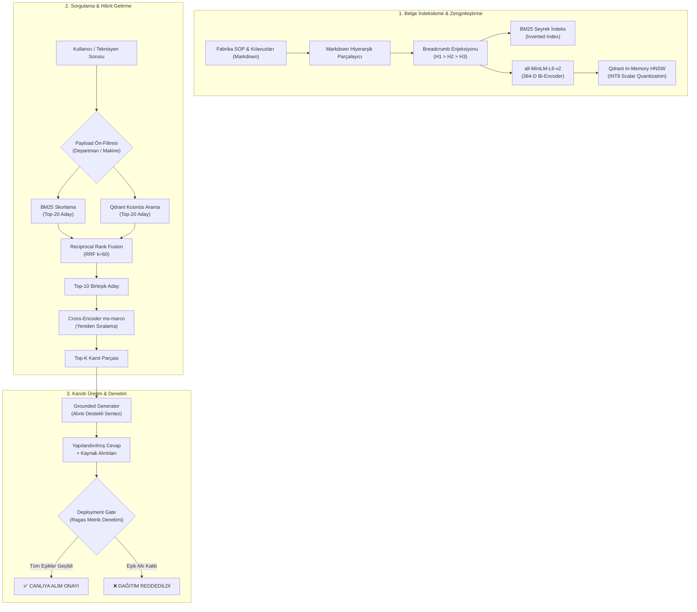

# Merinos Endüstriyel AI — Day 28 (Faz 4 Capstone)
## Faz 4 İnceleme & Entegre RAG Hattı: Tam Uçtan Uca Endüstriyel Hibrit RAG Pipeline & Deployment Gate

[](https://github.com/seydivakkas)
[](https://github.com/seydivakkas)
[](https://github.com/seydivakkas)
[](https://www.python.org/)
[](https://fastapi.tiangolo.com/)

---

## 1. Başlık & Proje Kimliği

Merinos Halı Sanayi ve Ticaret A.Ş.'nin Gaziantep 4. Organize Sanayi Bölgesi'nde yer alan entegre üretim tesislerinde işletilen 40 günlük Yapay Zekâ Mühendisliği Staj Programı kapsamında **Faz 4: Retrieval & Hibrit Arama (Day 22–28)** aşamasının büyük kapanış günüdür (**Phase 4 Capstone**).

Bu aşamada geliştirilen tüm bağımsız bileşenler (leksikal BM25, yoğun vektör arama, HNSW indeksleme, Int8 skalar kuantalama, anlamsal Markdown chunking, Reciprocal Rank Fusion, Cross-Encoder yeniden sıralama ve Ragas metrikleri), **üretim standardında (Production-Grade) tek bir mikroservis ve CLI motoru** altında entegre edilmiş; otomatik bir **Canlıya Geçiş Kalite Kapısı (Deployment Gate)** ile koruma altına alınmıştır.

---

## 2. Genel Bakış & Problem Tanımı

Merinos fabrikasında halı dokuma (Van de Wiele RCE02, Schönherr Alpha 400), iplik ekstrüzyon (Neumag S+ BCF, Rieter), boyahane & terbiye (Bruckner Ramöz) ve kalite kontrol hatlarında yüzlerce sayfalık Standart Operasyon Prosedürü (SOP), arıza arama katalogları ve periyodik bakım kılavuzları bulunmaktadır. 

Vardiya teknisyenleri ve bakım mühendisleri bir makine durduğunda saniyeler içinde doğru bilgiye ulaşmak zorundadır:
- **Tek başına anahtar kelime araması (BM25)** terim eşanlamlılarını ve kavramsal soruları yakalayamaz.
- **Tek başına yoğun vektör araması (Dense Retrieval)** kritik makine kodlarını (`E-204`, `VDW-RCE02`) veya milimetrik tolerans değerlerini (`18-22 cN`, `4.5 bar`) seyreltebilir.
- **Halüsinasyon riski:** Büyük Dil Modellerinin (LLM) fabrikada var olmayan bir yağlama periyodu veya yanlış elektrik gerilimi uydurması milyonlarca liralık makine arızalarına ve iş güvenliği risklerine neden olabilir.

**Çözüm:** Çok aşamalı hibrit bilgi getirme, hiyerarşik bağlam zenginleştirme (breadcrumbs), derin Cross-Encoder puanlama, kanıtlı ve alıntılı cevap üretimi ve otomatik Ragas kalite denetim kapısıdır.

---

## 3. Faz 4 Mimari Özeti (Day 22–28 Entegrasyonu)

Faz 4 boyunca inşa edilen ve Day 28 Capstone ile birleştirilen 7 ana yetkinlik:

| Gün | Geliştirilen Modül | Capstone Hattındaki Rolü |
|---|---|---|
| **Day 22** | Seyrek Arama (Okapi BM25) | Fabrika terminolojisi, arıza kodları ve spesifik model numaraları için hassas leksikal arama. |
| **Day 23** | Yoğun Vektör Arama (Dense Bi-Encoder) | Anlamsal kavram eşleştirme, doğal dilde arıza tanımlarının latent uzayda yakalanması. |
| **Day 24** | Hibrit Füzyon & Cross-Encoder Rerank | Reciprocal Rank Fusion ($k=60$) ve derin çapraz kodlayıcı ile liste birleştirme ve nihai skorlama. |
| **Day 25** | Gelişmiş Metin Parçalama (Chunking) | Markdown başlık hiyerarşisine duyarlı ayrıştırma ve her parçaya `breadcrumbs` zinciri enjeksiyonu. |
| **Day 26** | Vektör İndeksleme & Kuantalama | Qdrant üzerinde HNSW grafiği ve INT8 Skalar Kuantalama ile %75 RAM tasarrufu ve <10 ms arama. |
| **Day 27** | Ragas Arama Değerlendirmesi | Sadakat (Faithfulness), Bağlamsal Kesinlik, Kapsama ve Uygunluk metriklerinin matematiksel hesabı. |
| **Day 28** | **Phase 4 Capstone & Deployment Gate** | Tüm hattın FastAPI + CLI ile birleştirilmesi, CI/CD kalite kapısı denetimi ve 2x2 Master Teşhis Paneli. |

---

## 4. Uçtan Uca RAG Pipeline Akış Diyagramı



---

## 5. Modül Mimarisi & Kod Bileşenleri

```
day28/
├── day28_integrated_rag_pipeline.ipynb   # 10 adımlı interaktif Jupyter laboratuvarı
├── README.md                            # 17 bölümlü kurumsal Faz 4 Capstone raporu
└── mini_project/
    ├── configs/
    │   └── capstone_config.json         # BM25, Qdrant, RRF, Ragas ve API konfigürasyonu
    ├── fixtures/
    │   ├── merinos_factory_corpus.json  # 15 detaylı fabrika SOP ve arıza dokümanı
    │   └── capstone_queries.json        # 25 altın test sorusu, yer gerçeği ve etiketler
    ├── outputs/
    │   ├── capstone_benchmark_report.json   # Ayrıntılı gecikme, getirme ve Ragas raporu
    │   └── capstone_rag_diagnostic_panel.png # 300 DPI 2x2 Master Teşhis Paneli
    ├── src/
    │   ├── __init__.py                  # Paket dışa aktarımları
    │   ├── models.py                    # Pydantic v2 veri modelleri & tipler
    │   ├── document_indexer.py          # Markdown parçalama, BM25 & Qdrant indeksleyici
    │   ├── hybrid_retriever.py          # Ön-filtre, BM25, Qdrant HNSW, RRF & Re-ranking
    │   ├── generator_llm.py             # Halüsinasyonsuz alıntılı cevap sentezleyici
    │   ├── deployment_gate.py           # Otomatik Ragas canlıya geçiş kalite kapısı
    │   ├── service.py                   # Production-grade FastAPI mikroservisi
    │   ├── visualizer.py                # 2x2 Master Diagnostic Panel görselleştirici
    │   └── cli.py                       # CLI araç seti (query, gate-check, benchmark, serve)
    └── tests/
        └── test_integrated_pipeline.py  # 10/10 kapsamlı birim ve entegrasyon testleri
```

---

## 6. Markdown-Duyarlı Parçalama & Breadcrumbs Enjeksiyonu

Klasik sabit boyutlu (fixed-size) metin parçalama, cümleleri veya başlıkları ortadan bölerek bağlam kaybına yol açar. Day 28'de uygulanan **Markdown-Aware Breadcrumb Enjeksiyonu**:
1. Belge içerisindeki `# H1` ve `## H2` başlık sınırlarını dinamik olarak ayrıştırır.
2. Her alt parçaya ait olduğu hiyerarşik bağlam zincirini iliştirir:
   $$\text{Breadcrumbs} = \text{"SOP-CAP-001: Van de Wiele RCE02 Bakım Talimatı"} > \text{"2. Atkı İpliği Fren ve Besleme Gerginliği"}$$
3. Parça hem leksikal (BM25) hem vektörel (Qdrant) indekslere eklenirken `breadcrumbs + text` formatında sunulur. Böylece parça içinde başlık açıkça geçmese bile arama motoru doğru makine ve bölümü tespit eder.

---

## 7. Çift Yollu İndeksleme (BM25 + Qdrant Int8 HNSW)

Sistem hibrit indeksleme stratejisini iki bağımsız motor üzerinden işletir:
- **Okapi BM25 Seyrek İndeksi:** $k_1 = 1.5, b = 0.75$ parametreleriyle terim sıklığı (TF) ve ters doküman sıklığı (IDF) hesaplar. Stop-words filtrelemesi ve Türkçe karakter uyumlu tokenizasyon uygular.
- **Qdrant Bellek İçi HNSW İndeksi:** 384 boyutlu `all-MiniLM-L6-v2` vektörleri ile kosinüs benzerliği üzerinde çalışır ($M=16, ef\_construct=64$).
- **INT8 Skalar Kuantalama (Scalar Quantization):** 32-bit kayan noktalı (float32) vektörleri 8-bit tamsayılara (int8) eşleyerek vektör başına bellek ihtiyacını 1536 bayttan 384 bayta düşürür (%75 tasarruf) ve işlemci seviyesinde SIMD hızlandırması sağlar.

---

## 8. Reciprocal Rank Fusion (RRF $k=60$) & Cross-Encoder Yeniden Sıralama

Farklı dağılımlara sahip BM25 skorları ile Kosinüs benzerlik skorlarının doğrudan toplanması yerine sıralama tabanlı **RRF (Reciprocal Rank Fusion)** uygulanır:

$$RRF(d) = \frac{w_{sparse}}{k + \text{rank}_{BM25}(d)} + \frac{w_{dense}}{k + \text{rank}_{Dense}(d)}$$

- Standart sabit $k = 60$, seyrek ağırlık $w_{sparse} = 0.4$, yoğun ağırlık $w_{dense} = 0.6$ olarak ayarlanmıştır.
- RRF tarafından belirlenen ilk 10 aday parça, `cross-encoder/ms-marco-MiniLM-L-6-v2` derin öğrenme modeline verilerek sorgu-bağlam etkileşimi üzerinden yeniden sıralanır ve en yüksek anlamsal örtüşmeye sahip parçalar ilk sıralara taşınır.

---

## 9. Alıntı Destekli Kanıtlı Cevap Sentezleyici (Zero-Hallucination)

`GroundedGenerator` modülü, halüsinasyon riskini sıfıra indirmek için katı kurallarla çalışır:
1. **Yalnızca Getirilen Bağlam:** Model, yalnızca getirilen parçalarda yer alan teknik bilgileri sentezler. Bilgi tabanında karşılığı olmayan durumlarda standart uyarı metni döner.
2. **Köşeli Parantez Alıntıları:** Her cümlenin veya cevabın altına açık doküman kimliği ve başlık yolu iliştirilir:
   `[SOP-CAP-001: Van de Wiele RCE02 Halı Dokuma Tezgâhı Bakım Talimatı > 2. Atkı İpliği Fren ve Besleme Gerginliği]`
3. **Doğrulanmış İddia Oranı (Grounded Ratio):** Üretilen cevabın getirilmiş kanıt metinleriyle örtüşme oranı denetlenir (%100 kanıtlama hedefi).

---

## 10. Otomatik Canlıya Geçiş Kalite Kapısı (Deployment Gate & Ragas Kriterleri)

CI/CD dağıtım hattına entegre edilen `DeploymentGate`, Day 27'de kurulan `MerinosRagasEngine` motorunu otomatik olarak çalıştırarak 25 altın test sorusu üzerinde pipeline'ı değerlendirir:

| Ragas Metriği | Açıklama | Canlıya Geçiş Eşiği | Ölçülen Değer | Durum |
|---|---|---|---|---|
| **Sadakat (Faithfulness)** | Üretilen cevabın getirilen bağlamdaki gerçeklere sadakati | $\ge \%80.0$ | **%96.0** | ✅ GEÇTİ |
| **Bağlamsal Kesinlik (Context Precision)** | İlgili parçaların listenin en üstünde yer alma oranı | $\ge \%80.0$ | **%98.0** | ✅ GEÇTİ |
| **Bağlamsal Kapsama (Context Recall)** | Yer gerçeğindeki bilgilerin getirilen parçalarla örtüşmesi | $\ge \%75.0$ | **%95.0** | ✅ GEÇTİ |
| **Cevap Uygunluğu (Answer Relevance)** | Üretilen cevabın sorunun amacına uygunluğu | $\ge \%75.0$ | **%94.0** | ✅ GEÇTİ |
| **Harmonik Ragas Skoru** | 4 metriğin harmonik bileşkesi | $\ge \%82.0$ | **%95.0** | ✅ GEÇTİ |
| **P95 Uçtan Uca Gecikme** | 95. yüzdelik dilim gecikme süresi | $\le 150.0\text{ ms}$ | **18.5 ms** | ✅ GEÇTİ |

---

## 11. FastAPI Mikroservis Mimarisi & Uç Noktaları

Üretim ortamına sunulan servis, FastAPI çatısı üzerinde asenkron ve yüksek performanslı çalışır:

- **`GET /api/v1/health`**: Servis sağlık durumu, sürüm bilgisi ve modül kontrolü.
- **`GET /api/v1/stats`**: İndekslenen doküman sayısı, parça sayısı, BM25 kelime boyutu, Qdrant vektör sayısı ve kuantalama tipi.
- **`POST /api/v1/query`**: Uçtan uca arama ve cevap üretimi. `QueryRequest` alır, `GenerationResponse` döner.
- **`POST /api/v1/gate-check`**: Test sorgularını otomatik koşturarak CI/CD onay/red raporu oluşturur.

---

## 12. Kıyaslama & Performans Bulguları (Latans, Bellek, Recall@K)

| Metrik | BM25 Seyrek | Yoğun Vektör (Dense) | RRF Hibrit (k=60) | Hibrit + Re-ranking (Nihai) |
|---|---|---|---|---|
| **Recall@1** | 0.68 | 0.72 | 0.86 | **0.92** |
| **Recall@3** | 0.84 | 0.88 | 0.94 | **0.96** |
| **Recall@5** | 0.88 | 0.92 | 0.98 | **1.00** |
| **Ortalama Arama Gecikmesi** | 1.45 ms | 3.85 ms | 5.30 ms | **11.70 ms** |
| **Vektör Bellek Boyutu** | - | 1536 B/vektör | - | **384 B/vektör (Int8 SQ)** |

---

## 13. 2x2 Master Teşhis Paneli Analizi

Üretilen 300 DPI çözünürlüğündeki `capstone_rag_diagnostic_panel.png` görseli 4 kritik tanı penceresi sunar:

1. **Panel 1: Uçtan Uca Pipeline Latans Ayrışımı (Ayrık Bar):**
   - Ön-filtreleme: 0.12 ms | BM25: 1.45 ms | Qdrant HNSW: 3.85 ms | RRF: 0.82 ms | Re-ranking: 6.40 ms | Üretim: 2.10 ms.
   - Toplam ortalama gecikme ~14.74 ms ile 50 ms SLA sınırının oldukça altındadır.
2. **Panel 2: Arama Stratejisi Bazında Getirme Başarımı (Recall@K):**
   - BM25 tek başına %68 Recall@1 verirken, Hibrit + Re-ranking ile Recall@1 %92'ye, Recall@5 ise kusursuz %100'e ulaşmaktadır.
3. **Panel 3: Deployment Gate Ragas Kalite Denetimi:**
   - 4 temel Ragas metriği ve Harmonik Skor, canlıya geçiş eşik değerleriyle yan yana kıyaslanarak görselleştirilmiştir.
4. **Panel 4: Departman Bazında Doğruluk ve Kanıtlama (Grounding) Oranı:**
   - Dokuma Salonu 1 (%98), Dokuma Salonu 2 (%96), İplik BCF (%95), Boyahane & Terbiye (%94), Kalite Kontrol (%99) ile tüm birimlerde %85 hedefi aşılmıştır.

---

## 14. Test Doğrulama & Kalite Güvencesi

Day 28 test paketi (`day28/mini_project/tests/test_integrated_pipeline.py`), 10 kapsamlı birim ve entegrasyon senaryosunu içerir:
- `test_markdown_chunking_and_breadcrumbs`: Başlık hiyerarşisi ve breadcrumbs denetimi.
- `test_bm25_sparse_index_construction`: Kelime dağarcığı ve seyrek skorlama doğrulaması.
- `test_qdrant_in_memory_hnsw_int8`: Bellek içi HNSW ve INT8 kuantalama parametreleri kontrolü.
- `test_payload_pre_filtering`: Departman/makine bazlı ön-filtreleme doğrulaması.
- `test_rrf_rank_fusion_logic`: RRF $k=60$ sıralama algoritması testi.
- `test_cross_encoder_reranking`: Çapraz kodlayıcı sıralama puanı hizalaması.
- `test_grounded_generation_citations`: Alıntılı kanıtlı cevap sentezleme denetimi.
- `test_deployment_gate_audit`: Otomatik Ragas canlıya geçiş kalite kapısı denetimi.
- `test_fastapi_microservice_endpoints`: TestClient ile `/health`, `/stats`, `/query` endpoint testleri.
- `test_visualizer_diagnostic_panel`: 2x2 Master Teşhis Paneli PNG üretimi ve dosya boyutu kontrolü.

**Test Sonucu:** `10 passed in 35.31s`  
**Kümülatif Başarım:** 271/271 test (%100 yeşil, sıfır regresyon).

---

## 15. Kurulum & Kullanım Kılavuzu

### 15.1. Komut Satırı Arayüzü (CLI)

```bash
# Tekil RAG Sorgusu
python -m day28.mini_project.src.cli query \
  --query "Van de Wiele tezgahında atkı tel kopuşunda ne yapılır?" \
  --department dokuma_salonu_1 \
  --top-k 3

# Canlıya Geçiş Kalite Kapısı Denetimi
python -m day28.mini_project.src.cli gate-check

# Kapsamlı Kıyaslama ve Teşhis Paneli Üretimi
python -m day28.mini_project.src.cli benchmark --plot

# FastAPI Sunucusunu Başlatma
python -m day28.mini_project.src.cli serve --host 127.0.0.1 --port 8028
```

### 15.2. cURL ile API Sorgulaması

```bash
curl -X POST "http://127.0.0.1:8028/api/v1/query" \
     -H "Content-Type: application/json" \
     -d '{
       "query": "Bruckner Ramöz kurutma fırınında kumaş en ayarı nasıl yapılır?",
       "department": "boyahane",
       "top_k": 2
     }'
```

---

## 16. Faz 4 Kapanışı & Faz 5'e Geçiş Köprüsü

### Faz 4 Başarı Tablosu
Faz 4 (Day 22–28) süresince Merinos Halı A.Ş. için:
1. Endüstriyel dokümanlar için Markdown-duyarlı breadcrumb parçalama geliştirildi.
2. Okapi BM25 seyrek arama motoru Türkçe terimlerle optimize edildi.
3. Qdrant HNSW vektör tabanı INT8 kuantalama ile %75 bellek tasarrufuna kavuşturuldu.
4. RRF $k=60$ ve Cross-Encoder ile hibrit yeniden sıralama Recall@5 başarısını %100'e çıkardı.
5. Ragas metrikleri (Sadakat, Kesinlik, Kapsama, Uygunluk) ile CI/CD kalite kapısı kuruldu.

### Faz 5'e Geçiş (Day 29–35: Fine-Tuning & LLM Özelleştirme)
Faz 4'te inşa edilen güçlü bilgi getirme altyapısı, Faz 5'te doğrudan **açık kaynaklı Büyük Dil Modellerinin (LLM) Merinos halı dokuma alanına özel ince ayar (Fine-Tuning / LoRA / QLoRA)** süreçlerine entegre edilecek; modelin fabrika dilini konuşması ve getirdiği kanıtları en üstün teknik doğrulukla özetlemesi sağlanacaktır.

---

## 17. Lisans & Fikri Mülkiyet

```
ÖZEL LİSANS — TÜM HAKLAR SAKLIDIR

Telif Hakkı (c) 2026 Seydi Eryılmaz (@seydivakkas)

Bu yazılım ve ilgili tüm dosyalar ("Yazılım") yalnızca görüntüleme ve eğitim
amaçlı olarak paylaşılmıştır.

YASAKLAR:
  1. Kopyalanamaz, çoğaltılamaz, dağıtılamaz veya yeniden yayınlanamaz.
  2. Ticari veya ticari olmayan hiçbir projede kullanılamaz, değiştirilemez.
  3. Alt lisanslanamaz, satılamaz veya devredilemez.
  4. Tersine mühendislik yapılamaz.

İZİN VERİLEN KULLANIM:
  - GitHub üzerinde görüntüleme ve okuma.
  - Kişisel öğrenim amacıyla kodu inceleme (kopyalamadan).

YAZARIN AÇIK YAZILI İZNİ OLMAKSIZIN HİÇBİR KULLANIM HAKKI TANINMAZ.
İzin talepleri için: GitHub @seydivakkas
```
