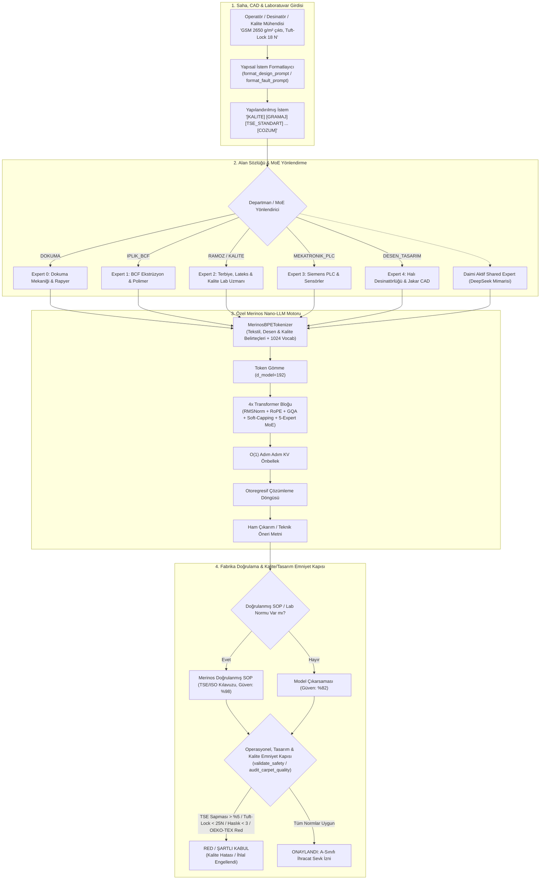

# Merinos Halı Sanayi ve Ticaret A.Ş. — Endüstriyel Yapay Zeka Stajı
# Day 29: Açık Kaynaklı Minimal SLM Seçimi, Özel NLP Kütüphanesi ile Nano-LLM Mimarisi, OEE Duruş & ERP Yedek Parça Yönetimi, Halı Desen & Kalite Laboratuvarı Uzman Sistemi & Donanım Kuantalama Profillemesi

[](https://github.com/seydivakkas)
[](https://www.python.org/)
[](https://pytorch.org/)
[](file:///tests)
[](file:///day29)

---

## 1. Başlık & Rozetler
Bu dokümantasyon, **Merinos Halı Sanayi ve Ticaret A.Ş. (Gaziantep 4. OSB)** tesislerinde modern yapay zeka, küçük dil modelleri (SLM), vardiya bazlı OEE duruş analizi, ERP yedek parça ve kritik stok yönetimi, halı desinatörlüğü CAD sistemleri, akredite kalite kontrol laboratuvar standartları ve üretken mimarilerin atölye içi donanımlarda en yüksek verimle konuşlandırılabilmesi için hazırlanan Faz 5 (Fine-Tuning & LLM Özelleştirme) ilk gün mühendislik raporudur.

---

## 2. Yönetici Özeti (Executive Summary)
Endüstriyel üretim tesislerinde genel amaçlı büyük dil modellerinin (70B+ parametre) doğrudan kullanılması; yüksek enerji maliyetleri, devasa VRAM gereksinimi (140+ GB) ve hat içi gecikme (latency) kısıtları nedeniyle uygulanabilir değildir. Merinos dokuma salonları, iplik ekstrüzyon, **desen/çizim stüdyoları**, **akredite test laboratuvarları** ve **ERP/stok ambarlarında** milisaniye mertebesinde telemetri analizi, PLC arıza teşhisi, OEE duruş kaybı ve kaybedilen metrekare hesabı, kritik emniyet stoku sorgulaması (`MRP-*`), CAD piksel en-boy oranı kalibrasyonu, TSE/ISO kalite uygunluk kararı ve armür reçetesi sunabilmek için **Küçük Dil Modelleri (Small Language Models - SLM)** ve alana özgü **Endüstriyel Uzman Sistemler (Industrial Expert Systems)** hayati önem taşır.

Day 29 kapsamında:
1. **Aday SLM Kıyaslaması:** Alibaba Qwen 2.5 (0.5B ve 1.5B), Hugging Face SmolLM2 (360M), TinyLlama (1.1B) ve Meta Llama 3.2 (1B) modelleri fabrika donanımları üzerinde profillendi ve değerlendirildi.
2. **Sıfırdan Özel Nano-LLM Motoru:** Halı dokuma, desinatörlük, kalite laboratuvarı ve OEE/ERP terimlerine duyarlı `MerinosBPETokenizer`, `RoPE` (Döner Konum Gömme), `RMSNorm`, `SwiGLU` FFN, `CausalSelfAttention` (GQA destekli) içeren bağımsız nedensel dil modeli sıfırdan inşa edildi.
3. **Yeni Nesil Mimari Eklemeler:**
   - **Sparse Mixture of Experts (MoE):** 5 uzmanlı (Dokuma / Bakım Onarım, İplik BCF / Üretim Planlama & ERP, Ramöz Terbiye / Kalite Lab, Mekatronik PLC, **Halı Desinatörlüğü & Jakar CAD**), dinamik Top-2 yönlendiricili ve yük dengeleme yardımcı kayıplı katman mimarisi.
   - **DeepSeek Tarzı Daimi Aktif Paylaşılan Uzman (Shared Expert):** Temel fabrika tekstil, üretim ve tasarım semantiğini daima muhafaza eden ortak uzman.
   - **Adım-Adım KV Önbellekleme ($O(1)$ Autoregressive Decoding):** Önceki hesaplamaları tekrar etmeyen hızlı çıkarım döngüsü.
   - **Gemma-2 Tarzı Dikkat Logit Yumuşatma (Logit Soft-Capping):** Sayısal taşmaları ve aşırı güveni önleyen $\tanh$ sınırlaması.
4. **OEE Duruş Maliyeti & ERP Yedek Parça Yönetim Motoru (`MerinosTextileExpertEngine`):**
   - **Vardiya Bazlı OEE Duruş ve Alan Kaybı Analizörü (`calculate_oee_and_downtime_loss`):** Çift parça (face-to-face $\times 2$) dokuma tezgahlarında dakikalık üretim debisi ($A_{\text{rate}} = \frac{\text{rpm}}{\text{atkı}} \times \text{En} \times 2$), duruşta kaybedilen metrekare halı ($A_{\text{rate}} \times t_{\text{stop}}$), OEE Kullanılabilirlik ($\text{Availability} = \frac{T_{\text{plan}} - t_{\text{stop}}}{T_{\text{plan}}} \times 100$), fabrika saatlik genel gideri ve parça bedeli dahil toplam finansal kayıp hesaplayıcısı.
   - **Merinos ERP Yedek Parça Kataloğu (`query_spare_part`):** `MRP-*` kodlarıyla tekil parça kimlikleme, emniyet eşiği ve ROP denetimi, ambar raf konumu, menşei bazlı tedarik teslim süresi (lead time) ve acil satın alma (`REORDER_URGENT`) alarm mekanizması.
5. **Halı Desinatörlüğü, Kalite Güvence & Üretim Uzman Sistemi:**
   - **Teknik Halı Sözlüğü (`merinos_carpet_lexicon.json`):** Dokuma, BCF İplik, Ramöz, PLC, Desen CAD, Kalite Lab ve ERP Yedek Parça kataloğuna ait 7 ana parça (`MRP-RAP-101` .. `MRP-ZWI-701`) ve teknik terminoloji.
   - **Yapısal Alan Belirteçleri (Domain Tokens):** `[ARIZA]`, `[COZUM]`, `[BAKIM]`, `[PARAMETRE]`, `[ONCELIK_*]`, `[ATKI]`, `[COZGU]`, `[JAKAR]`, `[RAMOZ]`, `[BCF]`, `[DESEN]`, `[CIZIM]`, `[KALITE]`, `[TEST_LAB]`, **`[OEE]`**, **`[DURUS]`**, **`[VARDIYA]`**, **`[YEDEK_PARCA]`**, **`[STOK_MRP]`**.
   - **CAD Desinatörlük Analizörü (`analyze_design_spec`):** Piksel Aspect Ratio ($1.0 : 1.714$), metrekare nokta sıklığı ($1.680.000\text{ nokta/m}^2$), cağlık renk sınırları ve rölyef emniyeti.
   - **TSE / ISO / OEKO-TEX Kalite Denetim Motoru (`audit_carpet_quality`):** TSE 2104 ($\pm 5\%$), ISO 4919 Tuft-Lock ($\ge 25\text{ N}$), ISO 105 haslıkları ve OEKO-TEX ekolojik denetimi.
   - **Operasyonel Güvenlik ve Emniyet Kapısı (`validate_safety`):** LOTO enerji izolasyonu, sıcaklık/basınç sınırları, OEE hedef eşiği (%85) ve ERP kritik emniyet stoku kontrolleri.
6. **PyTorch & TensorFlow Fonksiyonel Eşdeğerliği:** Tensör operasyonları, dinamik autograd vs. GradientTape, `einsum` ve optimizasyon döngüleri eşleştirildi.
7. **Donanım Roofline & Kuantalama:** RTX 4060 (8GB), RTX 3060 (12GB) ve A10G (24GB) için FP32, FP16, INT8, INT4 bellek modelleri çıkarıldı.
8. **Faz 1 Veri Gölü Toplayıcısı & ISO 14224 Güvenilirlik Mimarisi (`data_lake_collector.py`):**
   - OEM portal indeksleme (Vandewiele, Superba, Saurer Volkmann, Siemens, Atlas Copco).
   - 5 yıllık sentetik SAP PM arıza geçmişi (IW21 / IW32, TECO kapanış, LOTO teyidi).
   - ISO 14224 hiyerarşik güvenilirlik taksonomisi ve arıza frekansı $\lambda = \frac{n + 0.7}{t}$, MTBF, MTTR, Erişilebilirlik ($A_o$) ve operasyonel döngü (MCTF) hesaplayıcıları.
   - Sahadaki mavi yaka teknisyenler için QR kod ve sesli not destekli mobil bilet modeli (`MobileMaintenanceTicket`).

---

## 3. Mimari Şema & Sistem Tasarımı



---

## 4. Yapılan Her Bir İşlemin Endüstriyel ve Algoritmik Gerekçeleri (Rationales)

Merinos Halı Sanayi bünyesinde geliştirilen bu sistemde alınan her tasarım ve kodlama kararının arkasında somut endüstriyel ve matematiksel gerekçeler yatmaktadır:

### 4.1. Halı Desinatörlüğü & Çizim Özel Belirteçleri (Design Tokens)
- **Eklenen Belirteçler:** `[DESEN]`, `[CIZIM]`, `[TARAK]`, `[RAPORT]`, `[ROLYEF]`, `[RENK_PALETI]`, `[NOKTA_YOGUNLUGU]`, `[CAD_EP]`.
- **Gerekçe (Endüstriyel):** Desinatörler NedGraphics Texcelle, EAT DesignScope veya Boole gibi CAD programlarında çalışırken tezgahın mekanik parametrelerini (tarak diş sayısı, atkı sıklığı, cağlık renk sayısı) doğrudan yazılıma aktarmak zorundadır. Yapısal belirteçler, desinatörün sisteme verdiği teknik parametreleri (örneğin `[TARAK] 700`, `[ROLYEF] 3.5mm`) modelin doğrudan ilgili armür ve çözgü matematiğiyle eşleştirmesini sağlar.
- **Gerekçe (Algoritmik):** Causal LM'lerde koşullu olasılık $P(y_t | y_{<t}, x)$ hesaplanırken, girdi dizisindeki kontrol belirteçleri dikkat haritasında (attention map) güçlü birer çapa (anchor) vazifesi görerek dikkat kütlesini teknik semantiğe odaklar.

### 4.2. CAD Piksel En-Boy Oranı (Aspect Ratio) ve Geometrik Deformasyon Matematiği
- **Formül:**
  $$\text{Aspect Ratio (Piksel Boy Oranı)} = \frac{\text{Atkı Sıklığı (Picks / m)}}{\text{Tarak Sıklığı (Ends / m)}}$$
  $$\text{Nokta Sayısı (Point Density / m}^2) = \text{Tarak Sıklığı} \times \text{Atkı Sıklığı} \times 2$$
- **Gerekçe (Endüstriyel):** Halı dokumada çözgü teli aralığı ile atkı teli aralığı eşit değildir (örneğin 700 tarak ve 1200 atkı tezgahta yatay 1 metrede 700 ilme, dikey 1 metrede 1200 ilme bulunur; oran $1.714$'tür). Bir desinatör bilgisayar ekranında 1:1 kare piksellerle bir daire motif çizip tezgaha verirse, kumaş dokunduğunda daire basık veya boyuna uzamış bir elips olarak çıkar ve binlerce metrekare halı hurdaya (defoluya) ayrılır.
- **Mühendislik Çözümü:** `analyze_design_spec` metodu, girilen tarak ve atkı değerlerinden anında CAD yazılımında ayarlanması gereken `Grid Ratio = 1.0 : 1.714` değerini desinatöre teknik reçete olarak sunar.

### 4.3. Cağlık Renk Kapasitesi & Optik Noktalama (Stippling) Kuralı
- **Gerekçe (Endüstriyel):** Van de Wiele veya Schönherr tezgahların cağlık kuleleri fiziksel olarak 8, 10 veya 12 çerçeve/bobin kapasitelidir. Desinatör 8 renkli bir tezgah için çizdiği desende 9. bir renk katmanı bırakırsa elektronik jakar okuyucusu duruşa geçer veya kanca çakışması yaşanır.
- **Mühendislik Çözümü:** Model, cağlık limitini aşan renklerde acil durdurma vermek yerine desinatöre endüstriyel çözüm sunar: *"Stippling (1x1 dama piksel optik karışım) uygulayarak iki ana rengi yan yana koyun; insan gözü halıya yukarıdan baktığında ara ton olarak algılayacaktır."*

### 4.4. 3D Rölyef (Drop Stitch) Çökertme & Tuft-Lock Emniyeti
- **Gerekçe (Endüstriyel Can & Kalite Güvenliği):** Modern kabartmalı halılarda farklı hav yükseklikleri (örneğin 12 mm normal hav, 4 mm çökertme) popülerdir. Ancak desinatör çökertme yapılan alanda hav ipliğinin kancasını kaldırmadığında iplik arkada serbest yüzer (floating yarn). Bu iplik tabana kilitlenmezse halı yıkandığında veya süpürüldüğünde havlar yolunur (tuft loss / kellik).
- **Mühendislik Çözümü:** Model, $\Delta h > 4.0\text{ mm}$ olan rölyef çizimlerinde desinatöre **1/3 V zemin kilit armürü (dead pile locking)** zorunluluğunu hatırlatır ve çekme mukavemetinin $> 25\text{ N}$ olmasını doğrulatır.

### 4.5. MoE Departman Uzmanlığı (5. Uzman: Halı Desinatörlüğü & Jakar CAD)
- **Mimari:** 5 Seyrek Uzman + 1 Daimi Aktif Paylaşılan Uzman.
  - Expert 0: Dokuma Mekaniği & Jakar
  - Expert 1: BCF Ekstrüzyon & Polimer
  - Expert 2: Ramöz Fırını, Lateks & Akredite Kalite Güvence Laboratuvarı
  - Expert 3: Siemens PLC & Sensörler
  - **Expert 4: Halı Desinatörlüğü, Jakar CAD, Armür & Renk Kombinasyon Uzmanı**
- **Gerekçe:** Desinatörlük semantiği (vektör/raster çizim, raport tekrarı, Pantone iplik kodu, armür dikişi) makine bakımından farklı bir terminolojik alandır. Ayrı bir MoE uzmanı, desinatör sorularında aktive olarak parametre çatışmasını (gradient interference) engeller.

### 4.6. TSE 2104 Metrekare Gramajı (GSM) Toleransı ($\pm 5\%$) ve Maliyet Güvenliği
- **Formül:**
  $$\text{GSM Sapma Yüzdesi (\%)} = \frac{\text{Ölçülen GSM} - \text{Hedef GSM}}{\text{Hedef GSM}} \times 100$$
- **Gerekçe (Endüstriyel):** TSE 2104 mekanik dokuma halılar şartnamesine göre, bitmiş halının metrekare kütlesi hedef etiket değerinin en fazla $\pm \%5.0$ toleransı dahilinde olmalıdır.
  - Sapma $> +\%5.0$ ise: Halıda gereğinden fazla iplik veya lateks kullanılmıştır; yıllık milyonlarca liralık hammadde israfı ve maliyet kaybı doğurur.
  - Sapma $< -\%5.0$ ise: Halı tabanı gevşektir, ilme yoğunluğu ve dayanımı yetersizdir; müşteri iadelerine ve kalite reddine yol açar.
- **Mühendislik Çözümü:** `audit_carpet_quality` motoru, ölçülen GSM sapmasını hesaplayıp $\pm \%5.0$ tolerans dışına çıktığında `ERR-KAL-02` kodlu fabrika SOP'sini (dokuma kumaş çekme regülatörü kalibrasyonu ve lateks bıçak aralığı ayarı) devreye sokar.

### 4.7. ISO 4919 Tuft-Lock İlme Çekme Mukavemeti ($\ge 25\text{ N}$) & Lateks Kürlenme
- **Gerekçe (Endüstriyel Dayanıklılık):** ISO 4919 standardına göre, tek bir hav ipliğinin sırt kaplamasından sökülebilmesi için gereken çekme kuvveti en az $25.0\text{ N}$ olmalıdır. Rölyefli halılarda $18\text{ N}$ altına düşmesi durumunda, halı robot süpürge veya yürüme trafiği altında tiftiklenir ve delamine olur (tabandan ayrılır).
- **Mühendislik Çözümü:** Tuft-lock kuvveti $< 25\text{ N}$ ölçüldüğünde sistem anında `ERR-KAL-01` reçetesini üretir: Ramöz fırını 3. kamara sıcaklığı $165^\circ\text{C}$'ye yükseltilir ve lateks viskozitesi $9500\text{ cPs}$ seviyesine optimize edilir.

### 4.8. ISO 105 Renk Haslığı & OEKO-TEX Standard 100 Toksikolojik Ekoloji Normları
- **Gerekçe (İhracat ve İnsan Sağlığı):**
  - **ISO 105-X12 (Sürtünme Haslığı):** Beyaz kumaşa boya kusmaması için kuru sürtünme $\ge 4.0$, yaş sürtünme $\ge 3.0$ (Gri Skala 1-5) olmalıdır.
  - **ISO 105-B02 (Xenon Işık Haslığı):** Güneş ışığında solma direnci Blue Wool skalasında $\ge 6.0$ olmalıdır.
  - **OEKO-TEX Standard 100 Class II:** Ciltle temas eden halılarda formaldehit $\le 75\text{ mg/kg}$, ağır metaller $< 0.1\text{ ppm}$ ve uçucu organik bileşenler (VOC) sınır altında olmalıdır.
- **Mühendislik Çözümü:** Bu parametrelerden biri ihlal edildiğinde sistem sevk onayını derhal bloke eder (`RED / ŞARTLI KABUL`) ve BCF fikse buharı ($132^\circ\text{C}$), baca egzoz debisi (+%25) ve lateks partisi denetim talimatını yürürlüğe koyar.

### 4.9. Vardiya Bazlı OEE Duruş Maliyeti ve Kaybedilen Metrekare Halı Matematiği
- **Formüller:**
  $$\text{Çizgisel Hız (m/dk)}: v = \frac{\text{Tezgah Devri (rpm)}}{\text{Atkı Sıklığı (atkı/m)}}$$
  $$\text{Dakikalık Alan Üretim Debisi (m}^2\text{/dk)}: A_{\text{rate}} = v \times \text{Dokuma Eni (m)} \times 2\quad (\text{Çift Yüzlü Dokuma: Face-to-Face})$$
  $$\text{Duruşta Kaybedilen Halı Alanı (m}^2): \text{Lost } m^2 = A_{\text{rate}} \times t_{\text{duruş (dk)}}$$
  $$\text{OEE Kullanılabilirlik (Availability \%)}: \text{Availability} = \frac{T_{\text{plan}} - t_{\text{duruş}}}{T_{\text{plan}}} \times 100$$
  $$\text{Toplam Vardiya Duruş Maliyeti (TL)}: \text{Kayıp} = (\text{Lost } m^2 \times \text{Birim Halı Değeri}) + \left(\frac{t_{\text{duruş}}}{60} \times \text{Saatlik Genel Gider}\right) + \text{Yedek Parça Bedeli}$$
- **Gerekçe (Endüstriyel & Finansal):**
  Merinos dokuma salonlarındaki Van de Wiele ve Schönherr tezgahları çift yüzlü (face-to-face) dokuma yapar; yani her atkı atımında aynı anda üst ve alt olmak üzere **iki ayrı halı** eşzamanlı dokunur ($2\times$ çarpanı). Bu sebeple 45 dakikalık bir plansız duruş tek katlı bir kumaş gibi değil, tam $49.50\text{ m}^2$ halı kaybı doğurur. Birim halı maliyeti $450\text{ TL/m}^2$, fabrika saatlik genel gideri (işçilik, elektrik, amortisman) $1850\text{ TL/saat}$ ve tüketilen rapyer kıskacı ($18,500\text{ TL}$) eklendiğinde tek bir duruşun vardiyaya faturası $42,162.50\text{ TL}$'ye ulaşır.
- **Mühendislik Çözümü:** `calculate_oee_and_downtime_loss` metodu, vardiya amirine ve planlama mühendisine duruşun faturasını ve OEE kullanılabilirlik düşüşünü anında hesaplayarak 2. seviye kök neden analizi (RCA) ve hat kenarı parça ikmali önerir.

### 4.10. Merinos ERP Yedek Parça Kodlaması (`MRP-*`), Kritik Emniyet Stoku & Tedarik Güvenliği
- **Gerekçe (Endüstriyel Tedarik Zinciri & Duruş Önleme):**
  Dokuma salonlarında ve ekstrüzyon hatlarında plansız uzun duruşların $\%65$'i yedek parçanın ambar rafında bulunamamasından kaynaklanır. Rapyer kıskacı (`MRP-RAP-101`) Belçika'dan 14 günde, eriyik filtresi (`MRP-EXT-412`) Almanya'dan 10 günde, Profinet PLC kartı (`MRP-PLC-622`) 3 günde temin edilebilmektedir. Parça stoğu emniyet seviyesinin (kritik eşik) altına düştüğünde arıza anında tezgah günlerce beklemek zorunda kalır.
- **Mühendislik Çözümü:** `query_spare_part` fonksiyonu ve `spare-part` CLI komutu, Merinos tekil parça kodları (`MRP-*`) üzerinden:
  1. Parça tanımı, uyumlu makine ve ambar raf konumunu (`Depo-1 / Raf A-12-04`),
  2. Mevcut stok ve kritik emniyet eşiğini,
  3. Menşei ve tedarik teslim süresini (lead time),
  4. Kritik stok seviyesinde (`current_stock <= critical_threshold`) otomatik `CRITICAL_LOW_STOCK` ve `REORDER_URGENT` acil satın alma alarmını doğrudan üretir.

---

## 5. Merinos Halı Fabrikası Departmanları, Makine Parkı & Hata Kodları

### 5.1. Desen, Jakar CAD & Armür Tasarımı Bölümü
- **Ana Makineler & CAD İstasyonları:** NedGraphics Texcelle CAD İstasyonu, EAT DesignScope Victor, Van de Wiele Carpet Studio & Weft Selector, GretagMacbeth / X-Rite Spektrofotometre.
- **Alt Sistemler:** Piksel-İlme Koordinat Matrisi (Raster-to-Weave Converter), Cağlık Renk Bankası & İplik Dağılım Modülü, Rölyef (Drop Stitch) ve 3D Hav Efekti Armür Tasarımı, Otomatik Raportlama & Bordür/Göbek Geometrisi, Elektronik Jakar EP / Boole Dosya Çıkartıcı.
- **Kritik Hata Kodu:** `ERR-DES-01` (Cağlık Renk Kapasitesi Aşımı & İplik Çakışması).
  - *SOP:* 1) NedGraphics Texcelle 'Color Reduction / Palet Azaltma' modülünü çalıştır. 2) Palet dışı renkleri en yakın Pantone iplik koduna remap et (stippling/noktalama ile optik geçiş sağla). 3) Cağlık haritasını (creel plan) kontrol edip tezgaha yükle.
- **Kritik Hata Kodu:** `ERR-DES-02` (En-Boy Piksel Orantısızlığı / Aspect Ratio Geometrik Bozulma).
  - *SOP:* 1) CAD ortamında piksel oranını Aspect Ratio = Atkı_Sıklığı / Tarak_Sıklığı formülüyle yeniden boyutlandır (700/1200 için 1:1.714). 2) Göbek dairesini 'Aspect Ratio Corrected' şablonunda yeniden enterpole et. 3) Numune dokuma öncesi raster kontrolü yap.
- **Kritik Hata Kodu:** `ERR-DES-03` (Rölyef Hav Çökertme Armür Hatası / İlme Tutunamaması).
  - *SOP:* 1) Armür editöründe çökertme sınırlarına 1/3 V tipi zemin kilit armürü (dead pile lock) tanımla. 2) Minimum hav yüksekliği farkını delta h <= 4 mm ile sınırla. 3) Tuft-lock testinde çekme mukavemetinin > 25 N olduğunu doğrula.
- **Kritik Hata Kodu:** `ERR-DES-04` (Jakar EP Dosyası Kanca Koordinat Kayması / Raster Offset).
  - *SOP:* 1) Van de Wiele Carpet Studio'da selvedge ofsetini sıfırla. 2) Jakar kanca tahsis tablosunu 11,200 kanca için yeniden indeksle. 3) İlk 10 cm test dokuması yaparak bordür simetrisini cetvelle doğrula.
- **Kritik Hata Kodu:** `ERR-DES-05` (Bordür-Zemin Raport Süreksizliği / Desen Ayrışması).
  - *SOP:* 1) Desenin dikey piksel sayısını Atkı_Piksel = Raport_cm * Atkı_Adet_cm kuralına göre tam sayıya yuvarla. 2) Raport birleşim hattında ayna simetrisi ve 'Seamless Pattern Stitching' algoritmasını çalıştır.

### 5.2. Kalite Güvence & Akredite Test Laboratuvarı Bölümü
- **Ana Test Cihazları:** Zwick/Roell Z010 Tuft-Lock Çekme Cihazı, James Heal Martindale Aşınma Cihazı, Datacolor 800 Spektrofotometre & D65 Işık Kabini, Atlas Q-Sun Xenon Işık Haslığı Kabini, Crockmeter Sürtünme Test Cihazı.
- **Alt Sistemler:** İlme Tutunma & Tuft-Lock Mukavemet Modülü (ISO 4919), Metrekare Gramaj (GSM) Hassas Analitik Terazi (TSE 2104), Sürtünme Haslığı İstasyonu (ISO 105-X12), Xenon Işık Kabini (ISO 105-B02), OEKO-TEX Standard 100 Spektrometresi.
- **Kritik Hata Kodu:** `ERR-KAL-01` (Tuft-Lock İlme Çekme Mukavemeti Yetersizliği <25 N).
  - *SOP:* 1) Ramöz fırını 3. ve 4. kamara sıcaklığını 165°C seviyesine yükselt. 2) Lateks mikserinde kalsit/lateks oranını optimize ederek viskoziteyi 9500 cPs seviyesine getir. 3) Kürk pres silindir basıncını 3.2 bar'a artırarak lateksin ilme köklerine nüfuz etmesini sağla. 4) Numuneyi 24 saat kondisyonlayıp (20°C, %65 bağıl nem) testi tekrarla.
- **Kritik Hata Kodu:** `ERR-KAL-02` (Metrekare Gramaj Sapması > ±%5 Tolerans Dışı).
  - *SOP:* 1) 100 cm² daire numune kesici ile halının sol, orta ve sağından 3 numune al. 2) Dokuma tezgahı kumaş çekme regülatörünü kalibre et. 3) Lateks sıyırıcı bıçak aralığını mikrometre ile 1.2 mm'ye sabitle. 4) BCF iplik bobin denye ölçümünü 2400 dtex ±%2 olarak doğrula.
- **Kritik Hata Kodu:** `ERR-KAL-03` (Sürtünme ve Yıkama Renk Haslığı Düşüklüğü ISO 105 < 3).
  - *SOP:* 1) BCF fikse buhar odası sıcaklığını 132°C'ye ayarla. 2) İplik yıkama ünitesindeki surfaktan oranını denetle. 3) Masterbatch dozaj pompasını kalibre et. 4) Gri skala değerlendirmesini D65 ışık kabininde spektrofotometre ile doğrula.
- **Kritik Hata Kodu:** `ERR-KAL-04` (OEKO-TEX Standard 100 / VOC Uçucu Madde Limit Aşımı).
  - *SOP:* 1) Ramöz fırını taze hava emiş ve egzoz fan debisini %25 artır. 2) Lateks tedarikçisinden 'APEO-free' ve düşük VOC sertifikalı hammadde partisini doğrula. 3) Halı fırın çıkışında havalandırma tüneli soğutma fanlarını maksimum devirde çalıştır.

---

## 6. CLI Kullanım Rehberi ve Desinatör & Kalite Komut Örnekleri

### 6.1. Halı Desinatörü CAD Çizim & Teknik Reçete Hesaplama
```bash
python -m day29.mini_project.src.cli design-calc --reed 700 --pick 1200 --colors 8 --width 2.0 --height 3.0 --relief --relief-depth 3.5
```
*Çıktı:*
```text
=========================================================================================
   MERINOS CARPET DESIGNER & CAD DRAFTING SPECIFICATION ENGINE
=========================================================================================
Reed Density (Tarak)  : 700 tarak/metre
Pick Density (Atkı)   : 1200 atkı/metre
Carpet Dimensions     : 2.00 x 3.00 m (6.0 m²)
Color Count           : 8 renk
Point Density         : 1,680,000 nokta/m²
Total Carpet Points   : 10,080,000 ilme
Pixel Aspect Ratio    : 1.714 (1.0 : 1.714)
Total Reed Dents (En) : 1400 kanca/tarak dişi
Total Picks (Boy)     : 3600 atkı sırası

CAD Drawing Recommendation:
  NedGraphics / Texcelle CAD ortamında 'Grid Ratio' oranını 1.0 : 1.714 olarak ayarlayın. Dairesel göbek çizimlerinde bu oran kullanılmazsa desen halıda basık/uzamış çıkar. Toplam nokta sayısı 1,680,000 nokta/m² olup yüksek kaliteli sık dokuma sınıfındadır.

Design Rule Audit:
  Status   : PASSED (Safe to Draft)
```

### 6.2. Desinatör Kural İhlali Uyarısı (10 Renk ve Aşırı Rölyef Derinliği)
```bash
python -m day29.mini_project.src.cli design-calc --reed 700 --pick 1200 --colors 10 --creel-max 8 --relief --relief-depth 5.5
```

### 6.3. Akredite Kalite Kontrol & Laboratuvar TSE/ISO Denetim Komutu (`quality-audit`)
```bash
python -m day29.mini_project.src.cli quality-audit --gsm-actual 2420 --gsm-target 2400 --tuft-lock 28.5 --rubbing 4.5 --light 6.5
```
*Çıktı:*
```text
========================================================
   MERİNOS KALİTE GÜVENCE & TEST LABORATUVARI STANDART DENETİMİ
   TSE 2104 | ISO 4919 | ISO 105 | OEKO-TEX Standard 100
========================================================

[Laboratuvar Ölçümleri & Tolerans Değerlendirmesi]
  Hedef Metrekare Gramajı (GSM): 2400.0 g/m²
  Ölçülen Metrekare Gramajı    : 2420.0 g/m² (+0.83%) -> UYGUN (TSE 2104 ±%5 Bandında)
  Tuft-Lock İlme Çekme Kuvveti : 28.5 N -> UYGUN (ISO 4919 >= 25 N)
  Sürtünme Haslığı (ISO 105-X12): 4.5 (Gri Skala 1-5) -> UYGUN
  Xenon Işık Haslığı (ISO 105-B02): 6.5 (Mavi Yün 1-8) -> UYGUN
  Martindale Aşınma Dayanımı   : 55,000 devir -> UYGUN
  OEKO-TEX Standard 100 Class II: UYGUN

[Genel Kalite Denetim Kararı]
  Karar   : ONAYLANDI (Kalite A-Sınıfı Sevk Edilebilir)
  Durum   : ONAYLANDI

[Laboratuvar Düzeltici Eylemleri (SOP)]
  * Tüm test parametreleri Merinos A-Sınıfı ihracat ve TSE/ISO/OEKO-TEX standartlarını sağlamaktadır; sevk onaylandı.
```

### 6.4. Kalite Standart İhlali Durumu (Gramaj Aşımı, Tuft-Lock Düşüklüğü & OEKO-TEX Reddi)
```bash
python -m day29.mini_project.src.cli quality-audit --gsm-actual 2650 --gsm-target 2400 --tuft-lock 18.0 --rubbing 2.0 --no-oeko-tex
```

### 6.5. OEE Duruş Kaybı, Kaybedilen Metrekare Halı & Parça Maliyeti Hesabı
```bash
python -m day29.mini_project.src.cli oee-calc --downtime 45 --spare-code MRP-RAP-101
```
*Çıktı:*
```text
========================================================
   MERİNOS OEE DURUŞ & KAYBEDİLEN METREKARE HALI ANALİZİ
   Vardiya Bazlı Maliyet & Üretim Kaybı Hesaplama Modülü
========================================================

[Tezgah & Vardiya Parametreleri]
  Planlanan Vardiya Süresi : 480 dakika (8 saat)
  Plansız Duruş Süresi     : 45.0 dakika
  Fiili Çalışma Süresi     : 435.0 dakika
  OEE Kullanılabilirlik    : %90.62 (Availability)
  Tezgah Tipi / Dokuma Modu: Çift Yüzlü (Face-to-Face x2)
  Dokuma Eni               : 4.00 metre
  Tezgah Hızı / Sıklık     : 165 rpm | 1200 atkı/m
  Dakikalık Üretim Hızı    : 0.1375 m/dk (1.10 m²/dk)

[Üretim Kaybı & Finansal Maliyet]
  Kaybedilen Halı Alanı    : 49.50 m²
  Doğrudan Halı Ciro Kaybı : 22,275.00 TL (Birim: 450.0 TL/m²)
  Sabit Genel Gider Kaybı  : 1,387.50 TL (Birim: 1850.0 TL/saat)
  Yedek Parça Bedeli       : 18,500.00 TL (MRP-RAP-101)
  TOPLAM DURUŞ MALİYETİ    : 42,162.50 TL

[Kullanılan Yedek Parça Durumu]
  Parça: MRP-RAP-101 - Van de Wiele RCE Sağ Rapyer Kıskacı & Karbon Bant (Depo-1 / Raf A-12-04)
  Kalan Stok: 2 adet (Eşik: 3) -> CRITICAL_LOW_STOCK

[Denetim & Uzman Tavsiyeleri]
  * Vardiya planlanan 480 dakikanın 45 dakikası plansız duruşla kaybedildi (OEE Kullanılabilirlik: %90.62).
  * Tezgah çalışma hızında (165.0 rpm, 1200 atkı/m) dakikada 1.10 m² üretim kapasitesi bulunmaktadır.
  * Toplam kaybedilen halı alanı 49.50 m² olup doğrudan ciro/maliyet kaybı 22,275.00 TL'dir.
  * Fabrika amortisman ve işçilik genel gider kaybı: 1,387.50 TL.
  * Arıza onarımı için tüketilen yedek parça maliyeti: 18,500.00 TL (MRP-RAP-101).

[Risk & Güvenlik Uyarıları]
  ! ERP Kritik Stok Alarmı: Parça stoku (2 adet), emniyet eşiğinin (3 adet) altındadır/seviyesindedir; derhal satın alma talebi açılmalıdır!
```

### 6.6. ERP Yedek Parça & Kritik Emniyet Stoku Sorgulama (MRP-*)
```bash
python -m day29.mini_project.src.cli spare-part --code MRP-EXT-412
```
*Çıktı:*
```text
========================================================
   MERİNOS ERP YEDEK PARÇA & KRİTİK STOK SORGULAMA
   SAP/IFS Parça Kodu ve Tedarik Güvenlik Denetimi
========================================================

[Parça Kimlik Kartı]
  Parça Kodu       : MRP-EXT-412
  Tanım            : Neumag BCF Eriyik Filtresi / Elek Paketi 40 Mikron
  Uyumlu Makine    : Neumag S+ BCF Ekstrüzyon
  Departman        : IPLIK_BCF
  Raf / Ambar Yeri : Depo-3 / Raf F-01-09
  Birim Maliyet    : 7,920.00 TL

[Stok & İkmal Durumu]
  Mevcut Stok      : 3 adet
  Kritik Emniyet   : 4 adet
  Tedarik Süresi   : 10 gün (Almanya)
  İkmal Statüsü    : CRITICAL_LOW_STOCK -> REORDER_URGENT
  Bildirim         : ACİL SİPARİŞ: Stok (3 adet), emniyet eşiği (4 adet) altındadır! Almanya menşeili tedarik 10 gün sürmektedir.

[Uyumlu Arıza Kodları]
  Hata Kodları     : ERR-EXT-11

[Endüstriyel Gerekçe]
  Neumag S+ BCF Ekstrüzyon tezgahında bu parçanın tükenmesi plansız duruşa ve vardiya başına on binlerce TL kayba yol açar. Almanya sevkiyatı 10 gün sürdüğünden emniyet stoğu seviyesi aksatılmamalıdır.
```

---

## 7. Test Stratejisi ve Doğrulama Sonuçları

`day29/mini_project/tests/test_llm_engineering.py` test paketi 22 kapsamlı endüstriyel mühendislik testine genişletilmiştir:

1. `test_merinos_bpe_tokenizer`: Özel alan tokenları (`[ATKI]`, `[ARIZA]`) ve tekstil kelime dağarcığı çözümlemesi.
2. `test_rotary_embedding_rope`: RoPE tensör rotasyonu ve açısal değişmezlik garantisi.
3. `test_rms_norm`: RMS birim norm ölçekleme kararlılığı.
4. `test_swiglu_ffn`: Gated SwiGLU ileri yayılımı ve tensör boyutları.
5. `test_causal_self_attention_gqa_mask`: Causal maskeleme ile gelecekteki tokenların geçmişi etkilememesi.
6. `test_transformer_block_residual`: Artık bağlantılar ve kesintisiz gradyan akışı.
7. `test_merinos_causal_lm_forward_and_loss`: `(B, S, V)` logit şekli ve CrossEntropy kaybı.
8. `test_merinos_causal_lm_autoregressive_generation`: Otoregresif sonraki-token üretimi.
9. `test_hardware_profiler_vram_and_kv_cache`: Analitik VRAM ağırlıkları ve GQA/MHA KV önbellek oranları.
10. `test_roofline_and_benchmark_ranking`: Roofline diz noktası ve rejim (memory/compute bound) ayrımı.
11. `test_moe_feedforward_routing_and_aux_loss`: MoE Top-2 yönlendirmesi ve yardımcı denge kaybı geriye yayılımı.
12. `test_kv_cache_generation_equivalence`: $O(1)$ KV önbellekli çıkarımın önbelleksiz çıkarımla birebir aynı tokenları üretmesi.
13. `test_attention_logit_soft_capping`: Gemma-2 tarzı $\tanh$ logit sınırlaması.
14. `test_textile_expert_lexicon_and_sop_lookup`: Halı terimleri (`jakar`, `bcf`, `ramöz`) ve fabrika hata kodları (`ERR-ATK-01`, `ERR-RAM-08`) doğrulama.
15. `test_expert_routing_and_safety_gate`: Departman-MoE uzman eşleştirmesi ve LOTO, sıcaklık (>210°C), basınç (>180 bar) güvenlik kilidi kontrolleri.
16. `test_domain_adaptation_training_and_diagnose`: Külliyat üzerinde loss düşüşü (> %10) ve uçtan uca teşhis hattı doğrulaması.
17. `test_carpet_designer_lexicon_and_sop`: Desinatörlük terimleri (`raport`, `rolyef`, `tarak_sikligi`, `aspect_ratio`), desen arıza kodları (`ERR-DES-01`..`03`) ve tasarım token kodlaması.
18. `test_design_spec_analysis_and_expert_routing`: `DESEN_TASARIM` departmanının Expert 4'e yönlendirilmesi, nokta sıklığı ($1.680.000\text{ nokta/m}^2$), aspect ratio ($1.714$), cağlık renk aşımı uyarısı, rölyef derinlik emniyeti ve `format_design_prompt` doğrulama.
19. `test_quality_lab_lexicon_and_sops`: Kalite sözlüğü (`tse_2104`, `tuft_lock_mukavemeti`, `martindale_asinma`, `haslik_derecesi`, `oeko_tex`, `gsm_gramaj`), laboratuvar hata kodları (`ERR-KAL-01`..`ERR-KAL-04`) ve özel belirteç kodlaması (`[KALITE]`, `[TEST_LAB]`, `[GRAMAJ]`, `[HASLIK]`, `[TSE_STANDART]`).
20. `test_carpet_quality_audit_and_tolerance`: `KALITE_LABORATUVAR` departmanı yönlendirmesi, TSE 2104 metrekare gramajı $\pm \%5.0$ toleransı analizi, ISO 4919 tuft-lock çekme mukavemeti ($25\text{ N}$ eşiği), ISO 105 haslık eşikleri, OEKO-TEX sertifikasyon denetimi ve otomatik SOP reçeteleme doğrulaması.
21. **`test_oee_and_spare_parts_lexicon_lookup`**: OEE ve ERP teknik terimleri (`oee_kullanilabilirlik`, `durus_maliyeti`, `mrp_kodlama`, `kritik_stok_seviyesi`, `kaybedilen_metrekare`, `reorder_point`), özel belirteç kodlaması (`[OEE]`, `[DURUS]`, `[VARDIYA]`, `[YEDEK_PARCA]`, `[STOK_MRP]`), `PLANLAMA_ERP` departman yönlendirmesi ve `MRP-*` yedek parça katalog sorgulaması.
22. **`test_oee_downtime_calculation_and_stock_alert`**: Çift yüzlü dokuma tezgahı duruş matematiği, 45 dakikalık duruşta $49.50\text{ m}^2$ halı alanı kaybı ($22,275\text{ TL}$), genel gider ($1,387.50\text{ TL}$), parça bedeli dahil toplam finansal kayıp ($42,162.50\text{ TL}$), OEE kullanılabilirlik oranı (%90.62), aşırı duruş (OEE < %85) ve kritik stok uyarısı doğrulaması.

**Test Çalıştırma Sonucu:**
```text
pytest day29/mini_project/tests/test_llm_engineering.py -v
============================= 22 passed in 5.88s ==============================
```

---

## 8. Telif Hakkı ve Özel Lisans

```text
ÖZEL LİSANS — TÜM HAKLAR SAKLIDIR

Telif Hakkı (c) 2026 Seydi Eryılmaz (@seydivakkas)

Bu yazılım ve ilgili tüm dosyalar ("Yazılım") yalnızca görüntüleme ve eğitim
amaçlı olarak paylaşılmıştır.

YASAKLAR:
  1. Kopyalanamaz, çoğaltılamaz, dağıtılamaz veya yeniden yayınlanamaz.
  2. Ticari veya ticari olmayan hiçbir projede kullanılamaz, değiştirilemez.
  3. Alt lisanslanamaz, satılamaz veya devredilemez.
  4. Tersine mühendislik yapılamaz.

İZİN VERİLEN KULLANIM:
  - GitHub üzerinde görüntüleme ve okuma.
  - Kişisel öğrenim amacıyla kodu inceleme (kopyalamadan).

YAZARIN AÇIK YAZILI İZNİ OLMAKSIZIN HİÇBİR KULLANIM HAKKI TANINMAZ.
İzin talepleri için: GitHub @seydivakkas
```
